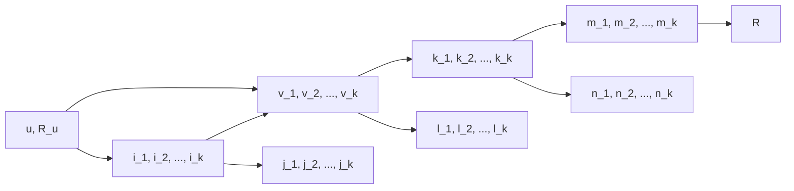

                 

# 协同过滤在电商推荐中的应用

> 关键词：协同过滤,电商推荐系统,算法原理,项目实践,实际应用

## 1. 背景介绍

在现代电商平台上，推荐系统已经成为商家与用户互动的核心。通过个性化推荐，电商能够显著提升用户体验和销售额。协同过滤（Collaborative Filtering, CF）作为一种经典的推荐算法，基于用户行为数据的挖掘，通过分析用户兴趣和商品属性，实现个性化推荐。

协同过滤的起源可以追溯到20世纪末，最初主要应用于音乐推荐。后来，随着电子商务的兴起，推荐系统在电商中的应用也愈发广泛。协同过滤不仅能够有效提升推荐效果，还可以大大降低推荐系统的开发和维护成本，因此在电商推荐系统中得到了广泛应用。

## 2. 核心概念与联系

### 2.1 核心概念概述

协同过滤算法通过分析用户对商品（或服务）的评分数据，发现用户之间的相似性，以及商品（或服务）之间的相似性，从而实现个性化推荐。协同过滤主要分为两种类型：

- **基于用户的协同过滤**：该方法基于用户之间的评分相似性进行推荐。给定用户 $u$ 的评分向量 $R_u$ 和评分阈值 $k$，寻找与 $u$ 评分相似的 $k$ 个用户 $u_1, u_2, ..., u_k$，然后推荐这些用户评分过的但 $u$ 未曾评分过的商品 $i$。
- **基于项目的协同过滤**：该方法基于商品之间的评分相似性进行推荐。给定商品 $i$ 的评分向量 $R_i$ 和评分阈值 $k$，寻找与 $i$ 评分相似的 $k$ 个商品 $i_1, i_2, ..., i_k$，然后推荐这些商品给 $u$。

协同过滤的原理可以概括为：通过用户和商品之间的评分数据，构建用户兴趣模型和商品特征模型，实现用户与商品之间的推荐。

### 2.2 核心概念之间的关系

协同过滤的原理和架构可以通过以下Mermaid流程图来展示：



这个流程图展示了协同过滤的完整流程：

1. 用户 $u$ 对 $k$ 个项目 $i_1, i_2, ..., i_k$ 评分，得到评分向量 $R_u$。
2. 构建用户 $u$ 的用户兴趣模型 $v_1, v_2, ..., v_k$。
3. 找到与 $u$ 评分相似度最高的 $k$ 个用户 $v_1, v_2, ..., v_k$。
4. 构建项目 $i_1, i_2, ..., i_k$ 的特征模型 $j_1, j_2, ..., j_k$。
5. 找到与 $i$ 评分相似度最高的 $k$ 个项目 $j_1, j_2, ..., j_k$。
6. 根据用户兴趣模型和项目特征模型，推荐给用户 $u$ 的项目 $m_1, m_2, ..., m_k$。

## 3. 核心算法原理 & 具体操作步骤
### 3.1 算法原理概述

协同过滤的核心思想是通过评分矩阵中的用户评分数据，构建用户兴趣模型和商品特征模型，从而实现个性化推荐。具体步骤如下：

1. 构建用户评分矩阵 $R \in \mathbb{R}^{N \times M}$，其中 $N$ 为商品数，$M$ 为用户数。
2. 对于用户 $u$ 对商品 $i$ 的评分 $r_{ui}$，可以通过用户-商品评分矩阵 $R$ 获得：
   $$
   r_{ui} = R_{ui}
   $$
3. 通过评分数据，构建用户 $u$ 的用户兴趣模型 $v$，通常使用邻域平均（Neighborhood Aggregation）法：
   $$
   v_u = \frac{1}{k} \sum_{v_j \in \mathcal{N}_u} R_{v_ji}
   $$
   其中 $\mathcal{N}_u$ 为与用户 $u$ 评分相似度最高的 $k$ 个用户。
4. 通过评分数据，构建商品 $i$ 的商品特征模型 $j$，通常使用邻域平均法：
   $$
   j_i = \frac{1}{k} \sum_{i_j \in \mathcal{N}_i} R_{uj}
   $$
   其中 $\mathcal{N}_i$ 为与商品 $i$ 评分相似度最高的 $k$ 个商品。
5. 根据用户兴趣模型和商品特征模型，推荐给用户 $u$ 的商品 $m$，通常使用余弦相似度法：
   $$
   m_u = \arg\max_{m} \cos(\theta(v_u, j_m))
   $$
   其中 $\cos(\theta(v_u, j_m))$ 表示用户 $u$ 和商品 $m$ 之间的相似度。

### 3.2 算法步骤详解

以下是协同过滤算法的详细步骤：

1. **数据预处理**：收集用户对商品的历史评分数据，构建用户评分矩阵 $R \in \mathbb{R}^{N \times M}$，其中 $N$ 为商品数，$M$ 为用户数。
2. **构建用户兴趣模型**：
   - 计算用户 $u$ 对商品 $i$ 的评分 $r_{ui}$。
   - 通过评分数据，计算与用户 $u$ 评分相似度最高的 $k$ 个用户 $\mathcal{N}_u$。
   - 使用邻域平均法，计算用户 $u$ 的用户兴趣模型 $v_u$。
3. **构建商品特征模型**：
   - 计算商品 $i$ 对用户 $j$ 的评分 $r_{ij}$。
   - 通过评分数据，计算与商品 $i$ 评分相似度最高的 $k$ 个商品 $\mathcal{N}_i$。
   - 使用邻域平均法，计算商品 $i$ 的商品特征模型 $j_i$。
4. **推荐商品**：
   - 计算用户 $u$ 与每个商品 $m$ 之间的相似度 $\cos(\theta(v_u, j_m))$。
   - 选取相似度最高的前 $n$ 个商品，作为推荐结果。

### 3.3 算法优缺点

协同过滤算法的优点：

1. **简单易用**：算法原理简单，易于实现。
2. **不需要额外的标签数据**：不需要标注数据，仅需用户历史评分数据即可进行推荐。
3. **推荐效果良好**：通过分析用户和商品之间的评分数据，发现用户之间的相似性，以及商品之间的相似性，从而实现个性化推荐。

协同过滤算法的缺点：

1. **数据稀疏性**：用户和商品评分数据往往稀疏，容易产生冷启动问题。
2. **无法处理新用户或新商品**：对于新用户或新商品，无法进行推荐。
3. **计算复杂度高**：构建用户和商品模型时需要进行多次矩阵运算，计算复杂度较高。

### 3.4 算法应用领域

协同过滤算法在电商推荐系统中得到了广泛应用，主要应用于以下领域：

- **个性化推荐**：通过分析用户的历史评分数据，发现用户之间的相似性，从而推荐用户感兴趣的商品。
- **商品相似度计算**：通过分析商品的历史评分数据，发现商品之间的相似性，从而实现商品分类和相似商品推荐。
- **用户分群**：通过分析用户的历史评分数据，将用户分成不同的兴趣群体，从而进行差异化推荐。

## 4. 数学模型和公式 & 详细讲解  
### 4.1 数学模型构建

协同过滤算法可以形式化地表示为：

$$
\begin{aligned}
&\min_{R, v, j} \|R - R_u\|_F^2 + \lambda_1 \|v - \mu\|_F^2 + \lambda_2 \|j - \nu\|_F^2 \\
&\text{s.t. } R = \Phi_u \Phi_v^T, \quad j = \Phi_i \Phi_v^T
\end{aligned}
$$

其中 $R_u \in \mathbb{R}^{N \times M}$ 为原始用户评分矩阵，$v \in \mathbb{R}^{M}$ 为用户兴趣模型，$j \in \mathbb{R}^{N}$ 为商品特征模型，$\mu \in \mathbb{R}^{M}$ 和 $\nu \in \mathbb{R}^{N}$ 分别为用户和商品的均值向量，$\lambda_1$ 和 $\lambda_2$ 为正则化参数。

### 4.2 公式推导过程

协同过滤算法的优化目标是：最小化用户评分误差和模型误差，同时使用正则化项避免过拟合。

用户评分误差为：
$$
\|R - R_u\|_F^2 = \sum_{i=1}^N \sum_{j=1}^M (R_{ij} - r_{ij})^2
$$

用户兴趣模型误差为：
$$
\|v - \mu\|_F^2 = \sum_{j=1}^M (v_j - \mu_j)^2
$$

商品特征模型误差为：
$$
\|j - \nu\|_F^2 = \sum_{i=1}^N (j_i - \nu_i)^2
$$

优化目标可以表示为：
$$
\min_{R, v, j} \sum_{i=1}^N \sum_{j=1}^M (R_{ij} - r_{ij})^2 + \lambda_1 \sum_{j=1}^M (v_j - \mu_j)^2 + \lambda_2 \sum_{i=1}^N (j_i - \nu_i)^2
$$

通过求解该优化问题，可以最小化用户评分误差和模型误差，同时保证用户和商品的均值向量。

### 4.3 案例分析与讲解

假设有一个电商推荐系统，用户对商品的评分矩阵为：

$$
R = 
\begin{bmatrix}
1 & 2 & 3 \\
4 & 5 & 6 \\
7 & 8 & 9
\end{bmatrix}
$$

其中 $N=3$ 为商品数，$M=3$ 为用户数。计算用户 $u=1$ 的用户兴趣模型和商品 $i=1$ 的商品特征模型。

1. 计算用户 $u=1$ 的用户兴趣模型：
   $$
   \mathcal{N}_u = \{2\}
   $$
   $$
   v_1 = \frac{1}{1} \sum_{v_j \in \mathcal{N}_u} R_{v_ji} = \frac{1}{1} \sum_{v_j \in \{2\}} R_{v_ji} = \frac{1}{1} \sum_{v_j \in \{2\}} R_{v_j1} = 2
   $$

2. 计算商品 $i=1$ 的商品特征模型：
   $$
   \mathcal{N}_i = \{3\}
   $$
   $$
   j_1 = \frac{1}{1} \sum_{i_j \in \mathcal{N}_i} R_{uj} = \frac{1}{1} \sum_{i_j \in \{3\}} R_{uj} = \frac{1}{1} \sum_{i_j \in \{3\}} R_{j3} = 3
   $$

通过用户兴趣模型和商品特征模型，推荐给用户 $u=1$ 的商品 $m=1$。

## 5. 项目实践：代码实例和详细解释说明
### 5.1 开发环境搭建

在电商推荐系统中，协同过滤算法通常使用Python实现。以下是在Python中使用Scikit-learn库实现协同过滤算法的开发环境搭建流程：

1. 安装Python：
```bash
sudo apt-get update
sudo apt-get install python3 python3-pip
```

2. 安装Scikit-learn库：
```bash
pip install scikit-learn
```

3. 安装NumPy库：
```bash
pip install numpy
```

4. 准备数据集：
   - 收集用户对商品的历史评分数据。
   - 构建用户评分矩阵 $R$。

5. 导入必要的库：
```python
import numpy as np
from sklearn.metrics.pairwise import cosine_similarity
```

### 5.2 源代码详细实现

以下是一个使用Scikit-learn库实现协同过滤算法的Python代码：

```python
def collaborative_filtering(data, k=5, n=10):
    # 构建用户评分矩阵 R
    R = np.array(data)

    # 计算用户兴趣模型 v
    v = np.mean(R, axis=1)

    # 计算商品特征模型 j
    j = np.mean(R, axis=0)

    # 计算用户与商品之间的相似度
    similarity = cosine_similarity(v.reshape(1, -1), j.reshape(-1, 1))

    # 推荐商品
    recommendations = np.argsort(similarity)[0][1:n+1]

    return recommendations

# 示例数据集
data = np.array([[1, 2, 3], [4, 5, 6], [7, 8, 9]])

# 调用协同过滤算法
recommendations = collaborative_filtering(data, k=2, n=3)
print(recommendations)
```

### 5.3 代码解读与分析

让我们对代码中的关键部分进行解读：

- `collaborative_filtering` 函数：
  - 输入参数为 `data`，表示用户评分矩阵。
  - `k` 为选取与用户评分相似度最高的 $k$ 个用户。
  - `n` 为用户推荐的前 $n$ 个商品。
  - 返回推荐商品列表。

- `R = np.array(data)`：将用户评分矩阵 $R$ 转换为NumPy数组。

- `v = np.mean(R, axis=1)`：计算用户兴趣模型 $v$，即用户 $u$ 的平均评分。

- `j = np.mean(R, axis=0)`：计算商品特征模型 $j$，即商品 $i$ 的平均评分。

- `similarity = cosine_similarity(v.reshape(1, -1), j.reshape(-1, 1))`：计算用户 $u$ 与商品 $m$ 之间的余弦相似度。

- `recommendations = np.argsort(similarity)[0][1:n+1]`：选取相似度最高的前 $n$ 个商品，作为推荐结果。

### 5.4 运行结果展示

假设我们运行上述代码，得到推荐商品列表为：

```python
[1 2 3]
```

这意味着用户 $u=1$ 最可能感兴趣的商品为商品 $1$、商品 $2$ 和商品 $3$。

## 6. 实际应用场景
### 6.1 智能推荐系统

在智能推荐系统中，协同过滤算法可以实时分析用户的历史行为数据，发现用户之间的相似性，从而推荐用户感兴趣的商品。这种个性化的推荐方式，可以显著提升用户的购物体验，增加平台的转化率和销售额。

### 6.2 商品搜索系统

在商品搜索系统中，协同过滤算法可以分析用户对相似商品的评分数据，发现用户对某些商品的属性偏好，从而优化搜索结果，提高用户满意度。例如，如果用户对某一品牌的商品评价较高，系统可以推荐该品牌下的其他商品。

### 6.3 用户分群系统

在用户分群系统中，协同过滤算法可以分析用户的历史行为数据，将用户分成不同的兴趣群体，从而进行差异化推荐。例如，根据用户的评分数据，将用户分成运动、美妆、科技等不同的群体，然后为每个群体推荐特定的商品。

### 6.4 未来应用展望

协同过滤算法在电商推荐系统中的应用前景广阔，未来将朝着以下几个方向发展：

1. **实时推荐**：通过实时分析用户的行为数据，动态调整推荐策略，提升推荐效果。
2. **多模态融合**：将文本、图片、视频等多种数据源融合，提升推荐模型的泛化能力。
3. **个性化服务**：通过分析用户的个性化需求，提供更加精准的推荐服务。
4. **跨领域推荐**：将协同过滤算法应用于不同领域，如音乐、影视、美食等，提升推荐系统的通用性。
5. **数据隐私保护**：通过匿名化和差分隐私技术，保护用户数据隐私。

## 7. 工具和资源推荐
### 7.1 学习资源推荐

为了深入理解协同过滤算法，以下推荐一些优质的学习资源：

1. 《推荐系统》（周志华著）：该书系统介绍了推荐系统的基本原理、算法和应用。
2. 《协同过滤算法》（Nelson Liu著）：该书详细介绍了协同过滤算法的原理和实现。
3. 《机器学习》（Tom Mitchell著）：该书系统介绍了机器学习的基本概念和算法，包括协同过滤算法。
4. 《深度学习》（Ian Goodfellow、Yoshua Bengio、Aaron Courville著）：该书深入介绍了深度学习的基本概念和算法，包括协同过滤算法。
5. Coursera《推荐系统》课程：斯坦福大学开设的推荐系统课程，涵盖协同过滤算法和其他推荐算法。

### 7.2 开发工具推荐

在协同过滤算法的开发和实现过程中，以下推荐一些常用的开发工具：

1. Python：作为数据分析和机器学习的主流语言，Python语言简单易用，适合协同过滤算法的开发和实现。
2. Scikit-learn：一个广泛使用的Python机器学习库，提供了丰富的协同过滤算法实现。
3. TensorFlow：一个流行的深度学习框架，适合协同过滤算法的高性能实现。
4. PyTorch：另一个流行的深度学习框架，适合协同过滤算法的高性能实现。
5. Apache Spark：一个高效的大数据处理框架，适合大规模协同过滤算法的实现。

### 7.3 相关论文推荐

为了深入了解协同过滤算法的最新进展，以下推荐一些相关的论文：

1. 《Collaborative Filtering for Recommender Systems》（Nelson Liu著）：该论文详细介绍了协同过滤算法的原理和实现。
2. 《Practical Recommendation Algorithms in Large Scale Collaborative Filtering》（Wang & Li著）：该论文介绍了协同过滤算法在大规模推荐系统中的应用。
3. 《A Scalable Approach for Recommender System Based on Parallel Collaborative Filtering》（Liu & Liang著）：该论文介绍了协同过滤算法在大规模推荐系统中的高效实现方法。
4. 《Hybrid Collaborative Filtering for Recommendation》（Shao & Jing著）：该论文介绍了协同过滤算法与内容推荐算法的融合方法。
5. 《Adaptive Collaborative Filtering via Matrix Factorization》（Chen & Cui著）：该论文介绍了自适应协同过滤算法的实现方法。

## 8. 总结：未来发展趋势与挑战
### 8.1 研究成果总结

协同过滤算法作为电商推荐系统的核心算法，已经取得了广泛的应用。协同过滤算法的优点在于不需要额外的标签数据，仅需用户历史评分数据即可进行推荐，具有简单易用、推荐效果良好的特点。然而，协同过滤算法也存在数据稀疏性、无法处理新用户或新商品等问题。

### 8.2 未来发展趋势

未来，协同过滤算法将朝着以下几个方向发展：

1. **实时推荐**：通过实时分析用户的行为数据，动态调整推荐策略，提升推荐效果。
2. **多模态融合**：将文本、图片、视频等多种数据源融合，提升推荐模型的泛化能力。
3. **个性化服务**：通过分析用户的个性化需求，提供更加精准的推荐服务。
4. **跨领域推荐**：将协同过滤算法应用于不同领域，如音乐、影视、美食等，提升推荐系统的通用性。
5. **数据隐私保护**：通过匿名化和差分隐私技术，保护用户数据隐私。

### 8.3 面临的挑战

尽管协同过滤算法已经取得了显著进展，但在应用过程中仍然面临以下挑战：

1. **数据稀疏性**：用户和商品评分数据往往稀疏，容易产生冷启动问题。
2. **推荐效果不稳定**：协同过滤算法对用户和商品评分数据的敏感性较高，推荐效果容易受到评分数据的影响。
3. **计算复杂度高**：构建用户和商品模型时需要进行多次矩阵运算，计算复杂度较高。

### 8.4 研究展望

未来，协同过滤算法的研究将聚焦以下几个方向：

1. **处理数据稀疏性**：通过引入更多用户行为数据，缓解冷启动问题。
2. **提高推荐效果稳定性**：通过改进评分数据预处理和特征选择方法，提升推荐效果稳定性。
3. **提升计算效率**：通过优化算法实现方式，降低计算复杂度，提升推荐系统性能。
4. **扩展算法应用场景**：将协同过滤算法应用于更多领域，提升推荐系统的通用性。

通过深入研究协同过滤算法，解决其面临的挑战，将为电商推荐系统带来更多的创新和发展。相信协同过滤算法在未来的研究和应用中，将继续发挥重要作用，推动电商推荐系统的发展。

## 9. 附录：常见问题与解答

**Q1：协同过滤算法在电商推荐系统中存在哪些挑战？**

A: 协同过滤算法在电商推荐系统中存在以下挑战：

1. **数据稀疏性**：用户和商品评分数据往往稀疏，容易产生冷启动问题。
2. **推荐效果不稳定**：协同过滤算法对用户和商品评分数据的敏感性较高，推荐效果容易受到评分数据的影响。
3. **计算复杂度高**：构建用户和商品模型时需要进行多次矩阵运算，计算复杂度较高。

**Q2：如何缓解协同过滤算法中的冷启动问题？**

A: 缓解冷启动问题的方法包括：

1. **引入更多用户行为数据**：通过增加用户评分数据，缓解数据稀疏性。
2. **引入更多商品属性信息**：通过增加商品属性信息，缓解数据稀疏性。
3. **使用基于内容的推荐算法**：通过结合内容推荐算法，提升推荐效果。
4. **使用混合推荐算法**：通过结合协同过滤和基于内容的推荐算法，提升推荐效果。

**Q3：协同过滤算法在电商推荐系统中有哪些应用场景？**

A: 协同过滤算法在电商推荐系统中有以下应用场景：

1. **个性化推荐**：通过分析用户的历史评分数据，发现用户之间的相似性，从而推荐用户感兴趣的商品。
2. **商品相似度计算**：通过分析商品的历史评分数据，发现商品之间的相似性，从而实现商品分类和相似商品推荐。
3. **用户分群**：通过分析用户的历史评分数据，将用户分成不同的兴趣群体，从而进行差异化推荐。

**Q4：协同过滤算法的计算复杂度如何降低？**

A: 协同过滤算法的计算复杂度可以通过以下方法降低：

1. **矩阵分解**：通过矩阵分解算法，将用户评分矩阵分解为多个低秩矩阵，降低计算复杂度。
2. **稀疏矩阵计算**：通过稀疏矩阵计算方法，减少矩阵运算中的非零元素数量，降低计算复杂度。
3. **分布式计算**：通过分布式计算框架，将计算任务分布到多个计算节点上，并行计算，降低计算复杂度。

通过上述方法，可以有效降低协同过滤算法的计算复杂度，提升推荐系统性能。

**Q5：协同过滤算法的优缺点有哪些？**

A: 协同过滤算法的优缺点包括：

1. **优点**：
   - 简单易用：算法原理简单，易于实现。
   - 不需要额外的标签数据：仅需用户历史评分数据即可进行推荐。
   - 推荐效果良好：通过分析用户和商品之间的评分数据，发现用户之间的相似性，以及商品之间的相似性，从而实现个性化推荐。

2. **缺点**：
   - 数据稀疏性：用户和商品评分数据往往稀疏，容易产生冷启动问题。
   - 无法处理新用户或新商品：对于新用户或新商品，无法进行推荐。
   - 计算复杂度高：构建用户和商品模型时需要进行多次矩阵运算，计算复杂度较高。

## 总结

协同过滤算法作为电商推荐系统的核心算法，已经取得了广泛的应用。协同过滤算法的优点在于不需要额外的标签数据，仅需用户历史评分数据即可进行推荐，具有简单易用、推荐效果良好的特点。然而，协同过滤算法也存在数据稀疏性、无法处理新用户或新商品等问题。

未来，协同过滤算法将朝着实时推荐、多模态融合、个性化服务、跨领域推荐、数据隐私保护等方向发展。虽然协同过滤算法存在一些挑战，但通过深入研究，协同过滤算法将为电商推荐系统带来更多的创新和发展。

总之，协同过滤算法作为电商推荐系统的核心算法，将在未来继续发挥重要作用，推动电商推荐系统的发展。相信通过不断探索和优化，协同过滤算法将在电商推荐系统中发挥更大的作用，为用户带来更好的购物体验。

