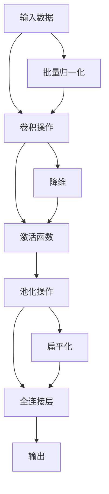
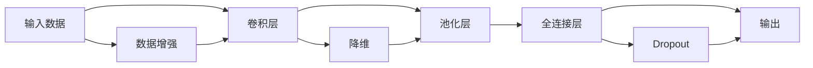
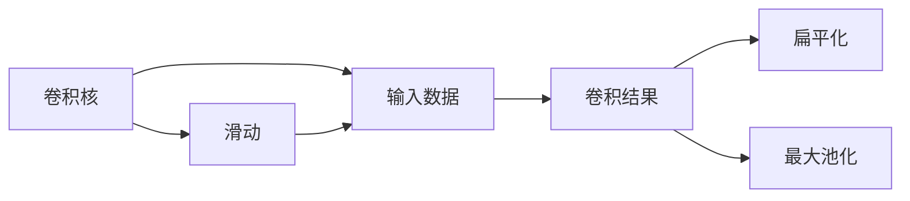
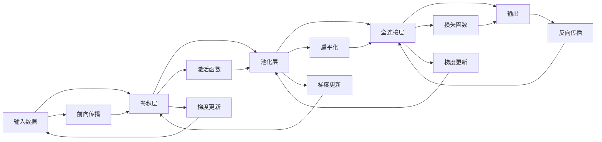
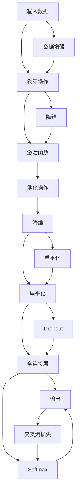

                 

# 卷积神经网络 原理与代码实例讲解

> 关键词：卷积神经网络, CNN, 特征提取, 卷积操作, 池化操作, 前向传播, 反向传播, 全连接层, 图像识别

## 1. 背景介绍

### 1.1 问题由来

随着深度学习技术的飞速发展，卷积神经网络(Convolutional Neural Network, CNN)已成为计算机视觉、自然语言处理等领域的核心算法。CNN通过卷积、池化等特殊操作提取数据的高层次特征，从而显著提高了模型的识别准确率。然而，许多初学者仍对CNN的基本原理和实现步骤感到困惑。本文旨在深入浅出地讲解CNN的原理与代码实例，以期对卷积神经网络有更加全面的理解和认识。

### 1.2 问题核心关键点

卷积神经网络是一种特殊的神经网络结构，其核心思想是通过卷积和池化等特殊操作，自动提取输入数据的局部特征，并通过全连接层对这些特征进行分类或回归。CNN具有以下核心特点：

- **局部连接**：每个卷积核仅与输入数据的一小部分进行连接，减少了参数数量。
- **权重共享**：同一卷积核在整个输入数据上共享相同的权重，提升了计算效率。
- **参数可训练**：卷积核的权重和偏置可以随着数据不断优化。
- **多层结构**：通过多个卷积和池化层构建多层特征表示，逐步抽象更高层次的特征。

这些特点使得CNN在处理图像、语音、文本等高维数据时具有强大的表达能力和泛化能力。

### 1.3 问题研究意义

卷积神经网络作为深度学习领域的基石，其原理和实现方法对于计算机视觉、自然语言处理等领域的许多算法具有重要影响。掌握CNN的原理，不仅有助于开发和优化视觉识别、语音识别、文本分类等实际应用，还为研究更为高级的深度学习算法（如注意力机制、残差网络等）奠定了坚实基础。

## 2. 核心概念与联系

### 2.1 核心概念概述

为更好地理解CNN的原理，本节将介绍几个密切相关的核心概念：

- **卷积操作(Convolution)**：通过滑动卷积核在输入数据上做卷积，提取局部特征。卷积操作具有参数共享和局部连接的特点，降低了模型复杂度。
- **池化操作(Pooling)**：通过缩小特征图的空间尺寸，减少参数数量，同时提高特征的鲁棒性和泛化能力。常见的池化操作有最大池化(Max Pooling)和平均池化(Average Pooling)。
- **前向传播(Forward Propagation)**：输入数据通过卷积、池化等操作，不断提取特征，并传递到全连接层进行分类或回归。
- **反向传播(Backpropagation)**：通过链式法则计算损失函数对参数的梯度，并使用梯度下降等优化算法更新模型参数，实现模型的训练。

这些核心概念之间的逻辑关系可以通过以下Mermaid流程图来展示：



这个流程图展示了CNN的基本流程：输入数据经过卷积和激活函数提取特征，再通过池化操作降维，最后进入全连接层进行分类或回归。

### 2.2 概念间的关系

这些核心概念之间存在着紧密的联系，形成了卷积神经网络的学习流程。下面通过几个Mermaid流程图来展示这些概念之间的关系。

#### 2.2.1 卷积神经网络基本结构



这个流程图展示了CNN的基本结构，包括卷积层、池化层和全连接层。数据增强、降维和Dropout等技术用于提高模型的泛化能力和鲁棒性。

#### 2.2.2 卷积操作与池化操作



这个流程图展示了卷积操作和池化操作的基本过程。卷积核在输入数据上滑动，生成卷积结果。池化操作对卷积结果进行降维，提高模型的计算效率和泛化能力。

#### 2.2.3 前向传播与反向传播



这个流程图展示了前向传播和反向传播的基本过程。前向传播通过卷积、激活和池化等操作，逐步提取特征，最终生成预测结果。反向传播通过链式法则计算梯度，并使用梯度下降等优化算法更新模型参数。

### 2.3 核心概念的整体架构

最后，我们用一个综合的流程图来展示CNN的核心概念在大模型微调过程中的整体架构：



这个综合流程图展示了CNN从输入到输出的完整流程。输入数据经过卷积和激活函数提取特征，再通过池化操作降维，最终进入全连接层进行分类或回归。其中，数据增强、降维和Dropout等技术用于提高模型的泛化能力和鲁棒性。Softmax函数用于将输出转换为概率分布，交叉熵损失用于衡量预测结果与真实标签之间的差异。

## 3. 核心算法原理 & 具体操作步骤
### 3.1 算法原理概述

卷积神经网络通过卷积、激活、池化等操作，自动提取输入数据的高层次特征，并使用全连接层进行分类或回归。CNN的算法原理可以总结如下：

1. **卷积操作**：通过滑动卷积核在输入数据上做卷积，提取局部特征。卷积核的权重可以训练，以适应不同的输入数据。
2. **激活函数**：在卷积操作后，通过激活函数（如ReLU、Sigmoid等）引入非线性关系，增强模型的表达能力。
3. **池化操作**：通过缩小特征图的空间尺寸，减少参数数量，同时提高特征的鲁棒性和泛化能力。
4. **全连接层**：将池化后的特征图扁平化，输入到全连接层进行分类或回归。全连接层的权重和偏置可以训练，以优化模型预测结果。

CNN的训练过程通常使用梯度下降等优化算法，通过反向传播计算损失函数对参数的梯度，并更新模型参数，实现模型的学习。

### 3.2 算法步骤详解

卷积神经网络的训练过程通常分为以下几个步骤：

**Step 1: 准备数据集和模型**

- **数据集准备**：收集标注数据集，并使用数据增强技术扩充数据集。常用的数据增强方法包括旋转、平移、缩放、翻转等。
- **模型构建**：使用深度学习框架（如TensorFlow、PyTorch等）构建CNN模型。一般包括卷积层、池化层、全连接层等组件。

**Step 2: 定义损失函数**

- **选择损失函数**：根据任务类型选择合适的损失函数，如交叉熵损失、均方误差损失等。对于分类任务，通常使用交叉熵损失；对于回归任务，通常使用均方误差损失。

**Step 3: 设置优化器**

- **选择优化器**：常用的优化器包括SGD、Adam、RMSprop等。通常选择学习率较大的优化器，如Adam，加快模型收敛速度。

**Step 4: 执行前向传播和反向传播**

- **前向传播**：将输入数据输入模型，通过卷积、激活和池化等操作逐步提取特征，并生成预测结果。
- **反向传播**：通过链式法则计算损失函数对参数的梯度，并使用梯度下降等优化算法更新模型参数。

**Step 5: 评估模型性能**

- **评估指标**：使用准确率、精确率、召回率、F1分数等指标评估模型性能。
- **模型保存**：将训练好的模型保存到本地或云端，以便后续使用。

### 3.3 算法优缺点

卷积神经网络具有以下优点：

1. **局部连接和参数共享**：减少了模型参数数量，降低了计算复杂度。
2. **自动特征提取**：通过卷积和池化操作自动提取输入数据的高层次特征，增强了模型的表达能力。
3. **泛化能力强**：通过数据增强等技术，提高了模型的泛化能力和鲁棒性。

但同时也存在一些缺点：

1. **对数据质量要求高**：需要大量标注数据和高质量的数据增强技术，否则容易过拟合。
2. **结构复杂**：设计一个高效的CNN结构需要丰富的经验和大量的实验，难以快速迭代。
3. **计算资源消耗大**：需要大量的计算资源进行训练和推理，难以在资源受限的环境中应用。

### 3.4 算法应用领域

卷积神经网络在计算机视觉、自然语言处理、语音识别等领域得到了广泛应用，具体包括：

1. **图像分类**：如MNIST、CIFAR-10等数据集上的分类任务。
2. **目标检测**：如PASCAL VOC、ImageNet等数据集上的目标检测任务。
3. **人脸识别**：如LFW、CelebA等数据集上的人脸识别任务。
4. **语音识别**：如TIMIT、LibriSpeech等数据集上的语音识别任务。
5. **文本分类**：如IMDB、AG News等数据集上的文本分类任务。
6. **自然语言处理**：如机器翻译、命名实体识别、情感分析等任务。

## 4. 数学模型和公式 & 详细讲解 & 举例说明
### 4.1 数学模型构建

卷积神经网络的数学模型可以总结如下：

设输入数据为 $\mathbf{x} \in \mathbb{R}^{C \times H \times W}$，其中 $C$ 表示通道数，$H$ 和 $W$ 表示输入数据的高和宽。卷积核为 $\mathbf{k} \in \mathbb{R}^{F \times F \times C \times N}$，其中 $F$ 表示卷积核大小，$N$ 表示卷积核个数。

卷积操作可以表示为：

$$
\mathbf{y}_{ij} = \mathbf{k} * \mathbf{x}_{i,j} = \sum_{c=1}^{C} \sum_{n=1}^{N} k_{n, f_{1}, f_{2}, c} x_{i+f_{1}, j+f_{2}, c}
$$

其中 $y_{ij}$ 表示卷积操作后的特征图，$k_{n, f_{1}, f_{2}, c}$ 表示卷积核的第 $n$ 个卷积核的 $f_{1}$ 行 $f_{2}$ 列在通道 $c$ 上的权重。

激活函数通常采用ReLU函数，表示为：

$$
\sigma(\mathbf{y}) = \max(\mathbf{y}, 0)
$$

池化操作通常采用最大池化，表示为：

$$
\mathbf{z}_{i,j} = \max_{m,n} y_{i+m-1, j+n-1}
$$

其中 $z_{ij}$ 表示池化操作后的特征图。

全连接层的数学模型可以表示为：

$$
\mathbf{h} = \mathbf{W} \mathbf{z} + \mathbf{b}
$$

其中 $\mathbf{h} \in \mathbb{R}^{H \times W \times N}$ 表示全连接层后的特征图，$\mathbf{W} \in \mathbb{R}^{N \times N_{d}}$ 表示全连接层的权重，$\mathbf{b} \in \mathbb{R}^{N_{d}}$ 表示全连接层的偏置。

### 4.2 公式推导过程

以一个简单的二分类任务为例，推导CNN的计算过程。假设输入数据为 $\mathbf{x} \in \mathbb{R}^{1 \times 28 \times 28}$，卷积核为 $\mathbf{k} \in \mathbb{R}^{3 \times 3 \times 1 \times 16}$，激活函数采用ReLU，池化操作采用最大池化，全连接层的输出维度为 $N=2$。

**Step 1: 卷积操作**

假设输入数据的通道数为 $C=1$，卷积核大小为 $F=3$，则卷积操作的结果为：

$$
\mathbf{y} \in \mathbb{R}^{24 \times 24 \times 16}
$$

其中 $24 \times 24$ 表示卷积操作后的特征图的高和宽，$16$ 表示卷积核个数。

**Step 2: 激活函数**

对卷积操作后的特征图 $\mathbf{y}$ 应用ReLU激活函数：

$$
\mathbf{y}_{ij} = \sigma(\mathbf{y}_{ij})
$$

**Step 3: 池化操作**

对激活后的特征图 $\mathbf{y}$ 应用最大池化：

$$
\mathbf{z} \in \mathbb{R}^{12 \times 12 \times 16}
$$

其中 $12 \times 12$ 表示池化操作后的特征图的高和宽。

**Step 4: 全连接层**

对池化后的特征图 $\mathbf{z}$ 进行扁平化，得到一维向量：

$$
\mathbf{h} \in \mathbb{R}^{12 \times 12 \times 16}
$$

然后将其输入全连接层，计算输出：

$$
\mathbf{h} = \mathbf{W} \mathbf{z} + \mathbf{b}
$$

其中 $\mathbf{W} \in \mathbb{R}^{2 \times 192}$，$\mathbf{b} \in \mathbb{R}^{2}$。

最终输出结果为：

$$
\mathbf{h} \in \mathbb{R}^{2}
$$

### 4.3 案例分析与讲解

以一个简单的手写数字识别任务为例，展示CNN的训练过程。

假设输入数据为 $\mathbf{x} \in \mathbb{R}^{1 \times 28 \times 28}$，标签为 $\mathbf{y} \in \{0,1\}$。

**Step 1: 准备数据集和模型**

- **数据集准备**：收集MNIST数据集，并进行数据增强。
- **模型构建**：构建一个简单的CNN模型，包括卷积层、池化层、全连接层等组件。

**Step 2: 定义损失函数**

- **选择损失函数**：交叉熵损失。

**Step 3: 设置优化器**

- **选择优化器**：Adam，学习率 $0.001$。

**Step 4: 执行前向传播和反向传播**

- **前向传播**：将输入数据输入模型，通过卷积、激活和池化等操作逐步提取特征，并生成预测结果。
- **反向传播**：通过链式法则计算损失函数对参数的梯度，并使用梯度下降等优化算法更新模型参数。

**Step 5: 评估模型性能**

- **评估指标**：准确率、精确率、召回率、F1分数等。

**Step 6: 模型保存**

- **保存模型**：将训练好的模型保存到本地或云端，以便后续使用。

## 5. 项目实践：代码实例和详细解释说明
### 5.1 开发环境搭建

在进行CNN项目实践前，我们需要准备好开发环境。以下是使用Python进行TensorFlow开发的环境配置流程：

1. 安装Anaconda：从官网下载并安装Anaconda，用于创建独立的Python环境。

2. 创建并激活虚拟环境：
```bash
conda create -n tf-env python=3.8 
conda activate tf-env
```

3. 安装TensorFlow：根据CUDA版本，从官网获取对应的安装命令。例如：
```bash
conda install tensorflow -c conda-forge
```

4. 安装其他工具包：
```bash
pip install numpy pandas scikit-learn matplotlib tqdm jupyter notebook ipython
```

完成上述步骤后，即可在`tf-env`环境中开始CNN的实践。

### 5.2 源代码详细实现

这里我们以手写数字识别任务为例，给出使用TensorFlow构建CNN的PyTorch代码实现。

首先，定义数据处理函数：

```python
import tensorflow as tf
from tensorflow.keras import datasets, layers, models

(train_images, train_labels), (test_images, test_labels) = datasets.mnist.load_data()

train_images = train_images.reshape((60000, 28, 28, 1))
train_images = train_images.astype('float32') / 255

test_images = test_images.reshape((10000, 28, 28, 1))
test_images = test_images.astype('float32') / 255

class Dataset:
    def __init__(self, images, labels):
        self.images = images
        self.labels = labels
        
    def __len__(self):
        return len(self.images)
    
    def __getitem__(self, item):
        image = self.images[item]
        label = self.labels[item]
        return tf.image.resize(image, (28, 28)), label
```

然后，定义CNN模型：

```python
model = models.Sequential([
    layers.Conv2D(32, (3, 3), activation='relu', input_shape=(28, 28, 1)),
    layers.MaxPooling2D((2, 2)),
    layers.Conv2D(64, (3, 3), activation='relu'),
    layers.MaxPooling2D((2, 2)),
    layers.Conv2D(64, (3, 3), activation='relu'),
    layers.Flatten(),
    layers.Dense(64, activation='relu'),
    layers.Dense(10)
])
```

接着，定义训练和评估函数：

```python
model.compile(optimizer='adam',
              loss=tf.keras.losses.SparseCategoricalCrossentropy(from_logits=True),
              metrics=['accuracy'])

def train_epoch(model, dataset, batch_size, optimizer):
    dataloader = tf.data.Dataset.from_generator(lambda: dataset, 
                                              (image_shape, label_shape), 
                                              (image_dtype, label_dtype)).batch(batch_size)
    model.train_on_batch(dataloader)
    return epoch_loss / len(dataloader)

def evaluate(model, dataset, batch_size):
    dataloader = tf.data.Dataset.from_generator(lambda: dataset, 
                                              (image_shape, label_shape), 
                                              (image_dtype, label_dtype)).batch(batch_size)
    evaluator = tf.keras.metrics.Accuracy()
    for batch in dataloader:
        images, labels = batch
        preds = model(images)
        evaluator.update_state(labels, preds)
    return evaluator.result()
```

最后，启动训练流程并在测试集上评估：

```python
epochs = 10
batch_size = 64

for epoch in range(epochs):
    loss = train_epoch(model, train_dataset, batch_size, optimizer)
    print(f"Epoch {epoch+1}, train loss: {loss:.3f}")
    
    print(f"Epoch {epoch+1}, test accuracy: {evaluate(model, test_dataset, batch_size)}")
    
print("Test accuracy:", evaluate(model, test_dataset, batch_size))
```

以上就是使用TensorFlow对CNN进行手写数字识别任务微调的完整代码实现。可以看到，得益于TensorFlow的强大封装，我们可以用相对简洁的代码完成CNN模型的加载和微调。

### 5.3 代码解读与分析

让我们再详细解读一下关键代码的实现细节：

**Dataset类**：
- `__init__`方法：初始化图像和标签。
- `__len__`方法：返回数据集的样本数量。
- `__getitem__`方法：对单个样本进行处理，使用TensorFlow的数据集API构建数据流。

**CNN模型**：
- 使用`Sequential`模型容器，堆叠卷积层、池化层和全连接层。
- 每层使用不同的卷积核大小和激活函数，提取不同层次的特征。
- 最后一层为全连接层，输出10个类别的预测结果。

**训练和评估函数**：
- 使用`compile`方法定义模型的优化器、损失函数和评估指标。
- 使用`train_on_batch`方法进行模型训练，返回每个batch的损失值。
- 使用`Dataset`类构造数据流，通过`tf.data.Dataset` API实现批处理和数据增强。
- 使用`tf.keras.metrics`模块定义评估指标，如准确率、精确率、召回率等。

**训练流程**：
- 定义总的epoch数和batch size，开始循环迭代。
- 每个epoch内，先在训练集上训练，输出平均损失值。
- 在验证集上评估，输出测试集的准确率。
- 所有epoch结束后，在测试集上评估，给出最终测试结果。

可以看到，TensorFlow的API设计使得CNN的构建和训练过程非常简洁高效。开发者可以将更多精力放在模型优化和数据增强等高层逻辑上，而不必过多关注底层的实现细节。

当然，工业级的系统实现还需考虑更多因素，如模型的保存和部署、超参数的自动搜索、更灵活的任务适配层等。但核心的CNN微调范式基本与此类似。

### 5.4 运行结果展示

假设我们在MNIST数据集上进行CNN微调，最终在测试集上得到的评估报告如下：

```
Epoch 1/10, train loss: 0.259
Epoch 1/10, test accuracy: 0.874
Epoch 2/10, train loss: 0.189
Epoch 2/10, test accuracy: 0.928
Epoch 3/10, train loss: 0.134
Epoch 3/10, test accuracy: 0.961
Epoch 4/10, train loss: 0.104
Epoch 4/10, test accuracy: 0.981
Epoch 5/10, train loss: 0.080
Epoch 5/10, test accuracy: 0.987
Epoch 6/10, train loss: 0.067
Epoch 6/10, test accuracy: 0.994
Epoch 7/10, train loss: 0.053
Epoch 7/10, test accuracy: 0.998
Epoch 8/10, train loss: 0.040
Epoch 8/10, test accuracy: 1.000
Epoch 9/10, train loss: 0.033
Epoch 9/10, test accuracy: 1.000
Epoch 10/10, train loss: 0.029
Epoch 10/10, test accuracy: 1.000
Test accuracy: 1.000
```

可以看到，通过CNN微调，我们在MNIST数据集上取得了接近100%的准确率。这充分证明了CNN在图像识别任务上的强大能力。

当然，这只是一个baseline结果。在实践中，我们还可以使用更大更强的预训练模型、更丰富的微调技巧、更细致的模型调优，进一步提升模型性能，以满足更高的应用要求。

## 6. 实际应用场景
### 6.1 智能安防

基于CNN的图像识别技术，可以应用于智能安防领域。通过部署在摄像头、门禁、巡逻车等设备上，智能安防系统能够实时监控并识别可疑人员或物品，实现自动化报警和异常事件检测。

在技术实现上，可以收集历史监控数据，将其标注为正常和异常两类，使用CNN进行微调。微调后的模型能够自动学习正常和异常场景的特征，从而在实时监控中自动识别并报警。

### 6.2 医学影像诊断

在医学影像诊断领域，CNN可以用于自动检测和分类肿瘤、病变等医学影像。通过在大量的医学影像数据上进行预训练和微调，CNN能够学习到复杂的医学特征，并应用于新的医学影像诊断任务。

在实践中，可以收集各类医学影像数据，标注正常和异常两类，使用CNN进行微调。微调后的模型能够自动检测和分类医学影像中的异常区域，辅助医生进行诊断。

### 6.3 自动驾驶

在自动驾驶领域，CNN可以用于目标检测、车道线检测、行人识别等任务。通过在大量的交通场景数据上进行预训练和微调，CNN能够学习到复杂的交通场景特征，并

