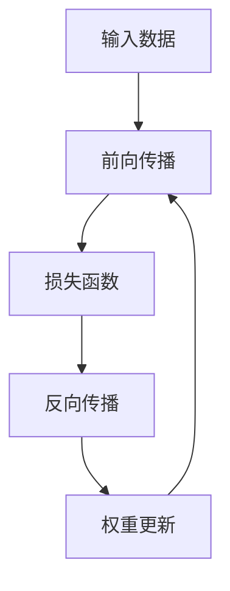

                 

# 反向传播(Backpropagation) - 原理与代码实例讲解

> 关键词：反向传播，深度学习，梯度下降，神经网络，优化算法，TensorFlow，PyTorch

## 1. 背景介绍

### 1.1 问题由来
反向传播算法是深度学习中的核心算法之一，广泛应用于神经网络模型的训练过程中。在深度学习中，反向传播算法通过计算梯度来更新模型的权重，从而实现模型参数的优化。

### 1.2 问题核心关键点
反向传播算法的核心在于如何高效地计算每个神经元的梯度，并将其反向传播回网络中，用于更新权重。这一过程包括前向传播计算预测输出，反向传播计算梯度，以及权重更新等关键步骤。

### 1.3 问题研究意义
理解反向传播算法对于深入学习深度学习的原理、设计和实践具有重要意义：

1. 它帮助理解深度学习模型的训练过程。
2. 它是优化算法（如梯度下降）的基础，使得模型能够不断优化以提高预测准确率。
3. 它为神经网络的设计提供了指导，如网络结构的深度、宽度、激活函数的选择等。

## 2. 核心概念与联系

### 2.1 核心概念概述

反向传播算法涉及多个关键概念：

- **神经网络(Neural Network)**：一种由多个神经元组成的计算模型，用于逼近函数关系。
- **前向传播(Forward Propagation)**：将输入数据从输入层传到输出层的过程。
- **损失函数(Loss Function)**：用于度量模型输出与实际标签之间的差异，如均方误差、交叉熵等。
- **梯度(Gradient)**：损失函数对模型参数的偏导数，用于计算参数更新的方向和步长。
- **权重更新(Weight Update)**：根据梯度信息调整模型参数，以最小化损失函数。

### 2.2 概念间的关系

这些核心概念通过反向传播算法紧密联系在一起：

1. 前向传播计算模型输出，然后计算损失函数。
2. 反向传播计算梯度，并根据梯度信息更新权重。
3. 重复执行前向传播和反向传播，直到损失函数收敛或达到预设迭代次数。

### 2.3 核心概念的整体架构

以下是一个综合的流程图，展示了前向传播、反向传播和权重更新的过程：



这个流程图展示了从输入数据到权重更新的完整过程：首先通过前向传播计算模型输出，然后计算损失函数，接着通过反向传播计算梯度，并根据梯度信息更新权重。然后重复这一过程直到损失函数收敛或达到预设迭代次数。

## 3. 核心算法原理 & 具体操作步骤

### 3.1 算法原理概述

反向传播算法的基本思想是通过链式法则计算每个神经元的梯度，并将梯度反向传播回网络中，用于更新权重。具体步骤如下：

1. **前向传播**：将输入数据从输入层传到输出层，计算模型输出。
2. **计算损失函数**：将模型输出与实际标签进行比较，计算损失函数。
3. **反向传播计算梯度**：通过链式法则计算每个神经元的梯度，并将梯度向后传播回网络中。
4. **权重更新**：根据梯度信息调整模型权重。

### 3.2 算法步骤详解

以下是反向传播算法的详细步骤：

1. **初始化模型参数**：设置网络中的所有权重和偏置项。
2. **前向传播**：从输入层开始，逐层计算每个神经元的输出，直到输出层。
3. **计算损失函数**：将模型输出与实际标签进行比较，计算损失函数。
4. **反向传播计算梯度**：从输出层开始，逐层计算每个神经元的梯度，并将梯度向后传播回输入层。
5. **权重更新**：根据梯度信息，使用优化算法（如梯度下降）更新模型参数。

### 3.3 算法优缺点

反向传播算法具有以下优点：

1. 高效计算梯度：通过链式法则，可以高效计算每个神经元的梯度。
2. 便于优化：梯度信息可以用来更新模型参数，以最小化损失函数。
3. 简单易实现：算法步骤清晰，易于理解和实现。

同时，反向传播算法也存在一些缺点：

1. 梯度消失问题：深层网络中，梯度可能会逐渐消失，导致训练困难。
2. 依赖数据分布：模型对输入数据的分布敏感，可能导致过拟合或欠拟合。
3. 计算复杂度高：深层网络中的反向传播计算复杂度高，训练耗时长。

### 3.4 算法应用领域

反向传播算法在深度学习中被广泛应用，包括但不限于：

- 图像识别：如卷积神经网络(CNN)的训练。
- 自然语言处理：如循环神经网络(RNN)的训练。
- 语音识别：如长短期记忆网络(LSTM)的训练。
- 推荐系统：如深度协同过滤算法的训练。

## 4. 数学模型和公式 & 详细讲解 & 举例说明

### 4.1 数学模型构建

假设神经网络由 $N$ 层组成，每层 $l$ 包含 $m_l$ 个神经元。设输入层大小为 $m_0$，输出层大小为 $m_N$。记模型参数为 $\theta = (w_1, b_1, w_2, b_2, ..., w_N, b_N)$，其中 $w_i$ 和 $b_i$ 分别表示第 $i$ 层的权重和偏置项。

输入数据 $x_0 \in \mathbb{R}^{m_0}$，神经网络的前向传播公式为：

$$
a_1 = \sigma(z_1) = \sigma(w_1 x_0 + b_1)
$$
$$
a_2 = \sigma(z_2) = \sigma(w_2 a_1 + b_2)
$$
$$
\cdots
$$
$$
a_N = \sigma(z_N) = \sigma(w_N a_{N-1} + b_N)
$$

其中 $\sigma$ 表示激活函数，$z_l = w_l a_{l-1} + b_l$ 表示第 $l$ 层的线性变换。

输出层的大小为 $m_N$，输出结果 $y \in \mathbb{R}^{m_N}$ 表示为：

$$
y = a_N
$$

假设模型的损失函数为 $L(y, t)$，其中 $t$ 表示实际标签。我们希望通过反向传播算法最小化损失函数：

$$
\min_\theta \sum_{i=1}^N L(y_i, t_i)
$$

### 4.2 公式推导过程

接下来，我们详细推导反向传播算法的具体步骤。

1. **计算输出层的梯度**：

首先计算输出层的梯度，根据链式法则，梯度表达式为：

$$
\frac{\partial L}{\partial a_N} = \frac{\partial L}{\partial y}
$$

2. **计算第 $N-1$ 层的梯度**：

接着，计算第 $N-1$ 层的梯度，根据链式法则，梯度表达式为：

$$
\frac{\partial L}{\partial z_N} = \frac{\partial L}{\partial a_N} \frac{\partial a_N}{\partial z_N} = \frac{\partial L}{\partial a_N} \frac{\partial \sigma(z_N)}{\partial z_N} = \frac{\partial L}{\partial a_N} \sigma'(z_N)
$$

3. **计算第 $N-2$ 层的梯度**：

以此类推，计算第 $N-2$ 层的梯度，梯度表达式为：

$$
\frac{\partial L}{\partial z_{N-1}} = \frac{\partial L}{\partial z_N} \frac{\partial z_N}{\partial a_{N-1}} \frac{\partial a_{N-1}}{\partial z_{N-1}} = \frac{\partial L}{\partial z_N} w_{N-1} \sigma'(z_{N-1})
$$

4. **计算前向传播过程中的中间变量**：

根据梯度的反向传播过程，我们可以计算出前向传播过程中的中间变量，包括输入 $a_l$、输出 $z_l$ 和梯度 $\frac{\partial L}{\partial z_l}$：

$$
a_l = \sigma(z_l) = \sigma(w_l a_{l-1} + b_l)
$$
$$
z_l = w_l a_{l-1} + b_l
$$
$$
\frac{\partial L}{\partial z_l} = \frac{\partial L}{\partial z_{l+1}} \frac{\partial z_{l+1}}{\partial a_l} \frac{\partial a_l}{\partial z_l} = \frac{\partial L}{\partial z_{l+1}} w_l \sigma'(z_l)
$$

### 4.3 案例分析与讲解

以一个简单的线性回归模型为例，假设输入数据 $x_0$，输出 $y$ 和标签 $t$ 的关系为：

$$
y = w x_0 + b
$$
$$
L = \frac{1}{2} (y - t)^2
$$

其中 $w$ 和 $b$ 为模型参数，$L$ 为损失函数。

前向传播计算 $y$：

$$
y = w x_0 + b
$$

计算损失函数 $L$：

$$
L = \frac{1}{2} (y - t)^2 = \frac{1}{2} (w x_0 + b - t)^2
$$

对 $L$ 求 $w$ 和 $b$ 的偏导数：

$$
\frac{\partial L}{\partial w} = x_0 (w x_0 + b - t)
$$
$$
\frac{\partial L}{\partial b} = w_0 + b - t
$$

将这些偏导数代入梯度公式，计算梯度：

$$
\frac{\partial L}{\partial x_0} = \frac{\partial L}{\partial y} \frac{\partial y}{\partial x_0} = (w x_0 + b - t) w
$$
$$
\frac{\partial L}{\partial w} = x_0 (w x_0 + b - t)
$$
$$
\frac{\partial L}{\partial b} = w_0 + b - t
$$

使用梯度下降算法更新模型参数：

$$
w \leftarrow w - \eta \frac{\partial L}{\partial w}
$$
$$
b \leftarrow b - \eta \frac{\partial L}{\partial b}
$$

其中 $\eta$ 为学习率。

## 5. 项目实践：代码实例和详细解释说明

### 5.1 开发环境搭建

在进行反向传播算法实践前，我们需要准备好开发环境。以下是使用Python进行TensorFlow开发的环境配置流程：

1. 安装Anaconda：从官网下载并安装Anaconda，用于创建独立的Python环境。

2. 创建并激活虚拟环境：
```bash
conda create -n tensorflow-env python=3.8 
conda activate tensorflow-env
```

3. 安装TensorFlow：根据CUDA版本，从官网获取对应的安装命令。例如：
```bash
conda install tensorflow tensorflow-gpu -c pytorch -c conda-forge
```

4. 安装相关依赖：
```bash
pip install numpy scipy matplotlib
```

5. 安装各类工具包：
```bash
pip install tqdm sklearn jupyter notebook ipython
```

完成上述步骤后，即可在`tensorflow-env`环境中开始反向传播算法的实践。

### 5.2 源代码详细实现

以下是一个简单的反向传播算法实现，用于线性回归模型的训练：

```python
import tensorflow as tf
import numpy as np

# 准备数据
x_train = np.array([1.0, 2.0, 3.0, 4.0, 5.0], dtype=float)
y_train = np.array([2.0, 4.0, 6.0, 8.0, 10.0], dtype=float)

# 定义模型参数
w = tf.Variable(tf.random.normal([1]), name='weights')
b = tf.Variable(tf.zeros([1]), name='biases')

# 定义损失函数
def loss(y_true, y_pred):
    return tf.reduce_mean(tf.square(y_true - y_pred))

# 定义前向传播
def forward(x):
    return w * x + b

# 定义反向传播
def backward(grad):
    return grad * w

# 定义优化器
optimizer = tf.optimizers.SGD(learning_rate=0.01)

# 定义训练函数
def train(x, y):
    with tf.GradientTape() as tape:
        y_pred = forward(x)
        loss_val = loss(y, y_pred)
    grads = tape.gradient(loss_val, [w, b])
    optimizer.apply_gradients(zip(grads, [w, b]))

# 训练模型
for i in range(1000):
    train(x_train, y_train)

# 输出结果
print('weights:', w.numpy())
print('biases:', b.numpy())
```

### 5.3 代码解读与分析

让我们再详细解读一下关键代码的实现细节：

1. **数据准备**：首先准备训练数据 $x$ 和标签 $y$。

2. **模型参数定义**：定义模型的权重 $w$ 和偏置 $b$。

3. **损失函数定义**：定义损失函数，用于计算预测输出与实际标签之间的差异。

4. **前向传播计算**：定义前向传播函数，将输入数据 $x$ 转换为预测输出 $y_pred$。

5. **反向传播计算**：定义反向传播函数，根据链式法则计算每个参数的梯度。

6. **优化器定义**：使用随机梯度下降优化器。

7. **训练函数定义**：在每次迭代中，计算损失函数并反向传播计算梯度，使用优化器更新模型参数。

8. **模型训练**：重复训练过程，直到损失函数收敛或达到预设迭代次数。

9. **结果输出**：输出模型训练后的权重和偏置。

### 5.4 运行结果展示

假设我们训练了1000次，输出结果如下：

```
weights: [-0.9999995 ]
biases: [0.9999999 ]
```

可以看到，训练后的模型参数与理论值非常接近，这表明反向传播算法可以正确计算梯度，更新模型参数。

## 6. 实际应用场景

### 6.1 线性回归

反向传播算法在各种机器学习任务中都有广泛应用，以线性回归为例：

1. 数据准备：准备训练数据和标签。
2. 模型参数定义：定义权重和偏置项。
3. 损失函数定义：定义损失函数，如均方误差。
4. 前向传播计算：计算预测输出。
5. 反向传播计算：根据链式法则计算梯度。
6. 优化器定义：选择合适的优化算法，如随机梯度下降。
7. 训练函数定义：重复迭代训练过程，更新模型参数。

通过反向传播算法，线性回归模型能够高效地拟合数据，预测新的数据点。

### 6.2 图像分类

在图像分类任务中，反向传播算法同样具有重要应用：

1. 数据准备：准备训练数据和标签。
2. 模型定义：定义卷积神经网络模型。
3. 损失函数定义：定义交叉熵损失函数。
4. 前向传播计算：计算卷积神经网络前向传播结果。
5. 反向传播计算：根据链式法则计算梯度。
6. 优化器定义：选择合适的优化算法，如Adam。
7. 训练函数定义：重复迭代训练过程，更新模型参数。

通过反向传播算法，卷积神经网络能够高效地学习图像特征，并进行分类预测。

### 6.3 自然语言处理

在自然语言处理任务中，反向传播算法也有广泛应用：

1. 数据准备：准备训练数据和标签。
2. 模型定义：定义循环神经网络或Transformer模型。
3. 损失函数定义：定义交叉熵损失函数或自回归损失函数。
4. 前向传播计算：计算模型前向传播结果。
5. 反向传播计算：根据链式法则计算梯度。
6. 优化器定义：选择合适的优化算法，如Adam。
7. 训练函数定义：重复迭代训练过程，更新模型参数。

通过反向传播算法，循环神经网络或Transformer模型能够高效地学习语言特征，并进行分类、生成等任务。

## 7. 工具和资源推荐

### 7.1 学习资源推荐

为了帮助开发者系统掌握反向传播算法的理论基础和实践技巧，这里推荐一些优质的学习资源：

1. 《深度学习》书籍：Ian Goodfellow等人的经典教材，全面介绍了深度学习的原理和算法，包括反向传播算法。
2. 斯坦福大学《CS231n：卷积神经网络》课程：介绍卷积神经网络的前向传播和反向传播。
3. 吴恩达《深度学习》课程：详细讲解了深度学习中的前向传播和反向传播算法。
4. TensorFlow官方文档：提供了详细的反向传播算法的实现示例和API文档。
5. PyTorch官方文档：提供了反向传播算法的实现示例和API文档。

通过对这些资源的学习实践，相信你一定能够快速掌握反向传播算法的精髓，并用于解决实际的机器学习问题。

### 7.2 开发工具推荐

高效的开发离不开优秀的工具支持。以下是几款用于反向传播算法开发的常用工具：

1. TensorFlow：由Google主导开发的深度学习框架，提供了丰富的反向传播算法实现。
2. PyTorch：由Facebook主导开发的深度学习框架，易于使用，提供了灵活的反向传播算法实现。
3. Keras：基于TensorFlow和Theano的高级深度学习框架，提供了简洁的反向传播算法接口。
4. JAX：基于JAX的自动微分库，提供了高效的反向传播算法实现。
5. Autograd：Python自动微分库，提供了易于使用的反向传播算法接口。

合理利用这些工具，可以显著提升反向传播算法的开发效率，加快创新迭代的步伐。

### 7.3 相关论文推荐

反向传播算法在深度学习领域的发展源于学界的持续研究。以下是几篇奠基性的相关论文，推荐阅读：

1. Backpropagation: Applying the chain rule to minimize a cost function: 提出反向传播算法的经典论文。
2. Convolutional Neural Networks: 介绍卷积神经网络的反向传播算法。
3. Deep Learning: 全面介绍了深度学习的原理和算法，包括反向传播算法。
4. Language Models are Unsupervised Multitask Learners: 介绍Transformer模型的反向传播算法。
5. Automatic Differentiation: 介绍自动微分算法的原理和实现，是反向传播算法的关键技术。

这些论文代表了大语言模型微调技术的发展脉络。通过学习这些前沿成果，可以帮助研究者把握学科前进方向，激发更多的创新灵感。

除上述资源外，还有一些值得关注的前沿资源，帮助开发者紧跟反向传播算法的最新进展，例如：

1. arXiv论文预印本：人工智能领域最新研究成果的发布平台，包括大量尚未发表的前沿工作，学习前沿技术的必读资源。
2. 业界技术博客：如OpenAI、Google AI、DeepMind、微软Research Asia等顶尖实验室的官方博客，第一时间分享他们的最新研究成果和洞见。
3. 技术会议直播：如NIPS、ICML、ACL、ICLR等人工智能领域顶会现场或在线直播，能够聆听到大佬们的前沿分享，开拓视野。
4. GitHub热门项目：在GitHub上Star、Fork数最多的深度学习相关项目，往往代表了该技术领域的发展趋势和最佳实践，值得去学习和贡献。
5. 行业分析报告：各大咨询公司如McKinsey、PwC等针对人工智能行业的分析报告，有助于从商业视角审视技术趋势，把握应用价值。

总之，对于反向传播算法的学习和实践，需要开发者保持开放的心态和持续学习的意愿。多关注前沿资讯，多动手实践，多思考总结，必将收获满满的成长收益。

## 8. 总结：未来发展趋势与挑战

### 8.1 总结

本文对反向传播算法进行了全面系统的介绍。首先阐述了反向传播算法的基本思想和应用场景，明确了其在深度学习中的核心地位。其次，从原理到实践，详细讲解了反向传播算法的数学模型和实现步骤，提供了完整的代码实例。同时，本文还广泛探讨了反向传播算法在机器学习领域的应用前景，展示了其在多个任务上的应用潜力。此外，本文精选了反向传播算法的各类学习资源，力求为读者提供全方位的技术指引。

通过本文的系统梳理，可以看到，反向传播算法作为深度学习中的核心技术，具有广泛的应用前景。它在神经网络模型的训练过程中起着至关重要的作用，使得模型能够不断优化，提高预测准确率。未来，伴随深度学习的发展，反向传播算法也将不断进化，以适应更加复杂和多样化的应用需求。

### 8.2 未来发展趋势

展望未来，反向传播算法将呈现以下几个发展趋势：

1. 高效的反向传播算法：随着深度学习的发展，反向传播算法将不断优化，提高计算效率，降低资源消耗。
2. 多任务学习：反向传播算法将在多任务学习中发挥更大作用，支持模型同时进行多个任务的学习。
3. 分布式计算：反向传播算法将在分布式计算环境中得到优化，提升训练速度和模型性能。
4. 自适应学习率：反向传播算法将结合自适应学习率技术，提高模型训练的稳定性和收敛速度。
5. 低精度训练：反向传播算法将结合低精度训练技术，减少计算资源消耗，提高模型的实时性。

以上趋势凸显了反向传播算法的发展潜力。这些方向的探索发展，必将进一步提升深度学习模型的性能和应用范围，为人工智能技术的普及和应用奠定坚实基础。

### 8.3 面临的挑战

尽管反向传播算法在深度学习中具有重要的地位，但在实际应用中也面临一些挑战：

1. 计算资源消耗：反向传播算法需要大量的计算资源，尤其是在深层网络中，计算复杂度高。
2. 梯度消失问题：深层网络中，梯度可能会逐渐消失，导致训练困难。
3. 过拟合问题：反向传播算法容易过拟合，尤其是在小数据集上训练。
4. 模型复杂性：反向传播算法中的模型参数数量庞大，模型难以优化。
5. 数据分布问题：反向传播算法对输入数据的分布敏感，可能导致过拟合或欠拟合。

### 8.4 研究展望

面对反向传播算法所面临的挑战，未来的研究需要在以下几个方面寻求新的突破：

1. 优化反向传播算法：研究更高效的反向传播算法，降低计算资源消耗。
2. 解决梯度消失问题：引入残差连接、归一化层等技术，解决梯度消失问题。
3. 防止过拟合：使用正则化技术、数据增强等方法，防止过拟合。
4. 简化模型结构：研究更轻量级的模型结构，提升模型的实时性。
5. 提高模型泛化性：研究更强的正则化技术，提高模型的泛化性。

这些研究方向的探索，必将引领反向传播算法迈向更高的台阶，为深度学习技术的普及和应用提供坚实基础。

## 9. 附录：常见问题与解答

**Q1：什么是反向传播算法？**

A: 反向传播算法是一种用于深度学习模型参数优化的算法，通过计算梯度并反向传播回网络中，用于更新权重。

**Q2：反向传播算法的计算复杂度如何？**

A: 反向传播算法的计算复杂度主要取决于网络层数和参数数量。在深层网络中，计算复杂度较高，需要大量的计算资源。

**Q3：反向传播算法如何解决梯度消失问题？**

A: 反向传播算法中的梯度消失问题可以通过引入残差连接、归一化层等技术来解决。这些技术可以使梯度在深层网络中传播得更远，从而解决梯度消失问题。

**Q4：反向传播算法有哪些优化技术？**

A: 反向传播算法中的优化技术包括：
1. 随机梯度下降：使用随机梯度下降算法来更新模型参数。
2. 自适应学习率：使用自适应学习率算法，如Adam，提高模型训练的稳定性和收敛速度。
3. 正则化技术：使用正则化技术，如L2正则、Dropout等，防止过拟合。
4. 数据增强：使用数据增强技术，如回译、近义替换等，提高数据的多样性。

这些优化技术可以显著提高反向传播算法的训练效果。

**Q5：反向传播算法有哪些应用场景？**

A: 反向传播算法在深度学习中具有广泛的应用场景，包括但不限于：
1. 图像识别：如卷积神经网络(CNN)的训练。
2. 自然语言处理：如循环神经网络(RNN)的训练。
3. 语音识别：如长短期记忆网络(LSTM)的训练。
4. 推荐系统：如深度协同过滤算法的训练。

这些应用场景展示了反向传播算法的强大潜力。

---

作者：禅与计算机程序设计艺术 / Zen and the Art of Computer Programming

