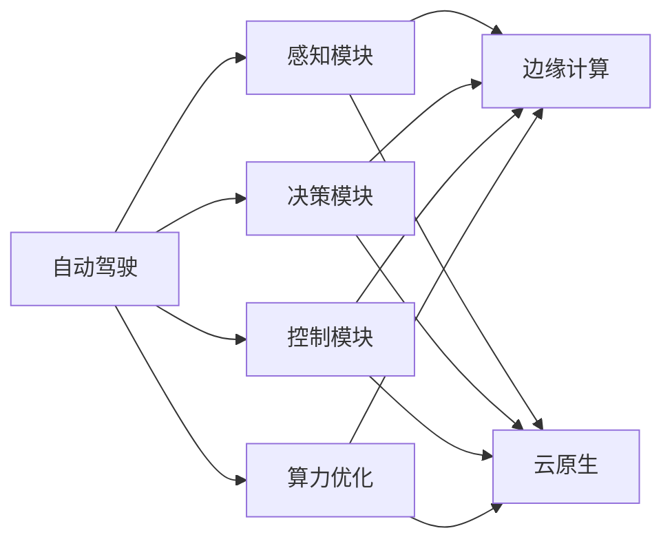
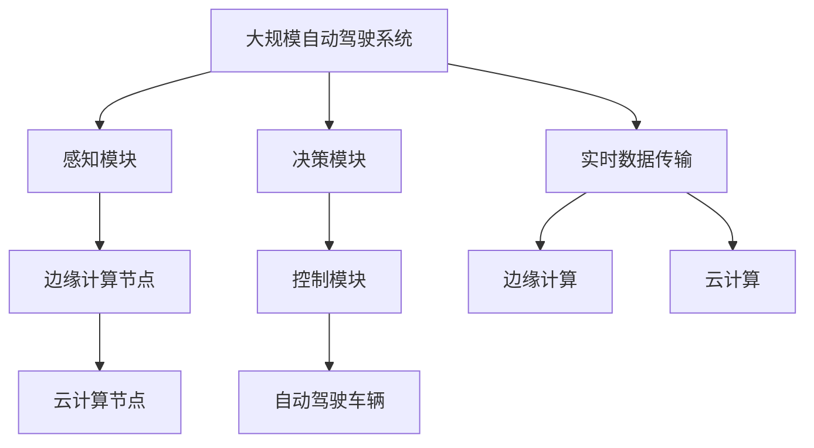

                 

## 1. 背景介绍

随着自动驾驶技术逐渐从实验室走向实际道路，算力建设的重要性日益凸显。自动驾驶系统通常包括感知、决策和控制三个核心模块，而计算和存储资源是这些模块高效运行的基础。本文将深入分析国内主要自动驾驶公司的算力建设现状，探讨其核心算力架构、技术选型与优化策略，以期为业内提供参考。

### 1.1 问题由来

自动驾驶涉及大量数据处理和实时计算，如感知模块的图像识别、目标检测，决策模块的路径规划和行为预测，控制模块的车辆控制和决策执行等，这些都对算力提出了较高要求。目前，国内自动驾驶公司在算力建设上投入巨大，但不同公司的方案和策略存在较大差异，其效果和成本效益也各不相同。

### 1.2 问题核心关键点

- 核心算力需求：自动驾驶系统对算力需求的具体指标是什么？
- 算力架构设计：如何设计高效、稳定的算力架构？
- 技术选型与优化：选择何种硬件平台、软件架构和优化策略？
- 成本效益分析：算力建设与实际应用效果之间的性价比如何？

### 1.3 问题研究意义

全面理解国内自动驾驶公司的算力建设现状，对于提升系统性能、优化成本结构、加速技术创新具有重要意义。本研究旨在帮助业内人士了解当前自动驾驶领域在算力建设上的趋势和挑战，为相关企业提供参考，促进技术进步和产业升级。

## 2. 核心概念与联系

### 2.1 核心概念概述

- **自动驾驶**：结合环境感知、人工智能、控制理论等技术，实现车辆自主行驶的系统。
- **算力**：计算和存储资源的统称，包括CPU、GPU、FPGA、ASIC等硬件，以及内存、硬盘等存储介质。
- **边缘计算**：在数据产生地进行数据处理和分析，避免数据传输到云端，降低延迟和带宽消耗。
- **云原生**：基于云平台的技术体系架构，支持容器化、微服务化等特性，提供弹性扩展和资源共享。
- **算力优化**：通过硬件、软件和系统架构的多维度优化，提升算力资源的使用效率，降低能耗和成本。

这些概念之间存在着密切的联系，形成一个整体，支撑着自动驾驶系统的正常运行。

### 2.2 概念间的关系

通过以下Mermaid流程图展示这些核心概念的关系：



### 2.3 核心概念的整体架构

最后，我们用一个综合的流程图来展示这些核心概念在大规模自动驾驶系统中的整体架构：



这个架构展示了感知、决策、控制模块如何利用边缘计算和云原生技术，高效地获取、处理和执行计算任务，确保自动驾驶系统的稳定运行。

## 3. 核心算法原理 & 具体操作步骤

### 3.1 算法原理概述

自动驾驶系统的核心算法包括感知、决策和控制三部分，其核心算力需求主要集中在以下几个方面：

- 感知模块：大量图像和视频数据处理，实时性要求高。
- 决策模块：复杂路径规划和行为预测，需要强大的计算能力。
- 控制模块：实时控制决策执行，对响应速度和稳定性要求高。

### 3.2 算法步骤详解

#### 3.2.1 感知模块的算力需求

感知模块的核心任务是环境感知和目标检测，其算力需求主要包括：

- 图像和视频数据预处理：包括降采样、归一化、特征提取等。
- 目标检测：通过深度学习模型识别和定位物体。
- 环境建模：构建高精度的环境地图和语义分割图。

这些任务需要高性能的GPU或专用加速器，如TPU、FPGA等。

#### 3.2.2 决策模块的算力需求

决策模块的核心任务是路径规划和行为预测，其算力需求主要包括：

- 路径规划：通过优化算法计算最优路径。
- 行为预测：预测其他车辆、行人和交通信号的行为。
- 安全评估：综合多方面信息评估行车安全。

这些任务需要高效的计算资源和存储资源，如CPU/GPU、分布式计算框架。

#### 3.2.3 控制模块的算力需求

控制模块的核心任务是执行决策，其算力需求主要包括：

- 车辆控制：实时调整车辆速度和方向。
- 自动驾驶行为：执行转向、制动、加速等操作。
- 传感器数据融合：整合多种传感器数据，提升系统鲁棒性。

这些任务需要低延迟、高精度的计算资源，如专用的ASIC芯片或FPGA加速器。

### 3.3 算法优缺点

#### 3.3.1 优点

- 高效的计算和存储能力：满足自动驾驶系统对实时性和计算精度的要求。
- 分布式计算和边缘计算：降低延迟和带宽消耗，提高系统的可靠性和鲁棒性。
- 软硬件协同优化：通过软硬件联合优化，提升资源利用率，降低能耗和成本。

#### 3.3.2 缺点

- 初期投资成本高：硬件和软件平台的选择和部署需要大量资金投入。
- 技术复杂度高：需要综合考虑硬件、软件和架构等多个方面，技术门槛较高。
- 升级和维护难度大：系统的升级和维护需要较长的周期和较高的成本。

### 3.4 算法应用领域

自动驾驶领域的算力架构和优化策略在多个应用场景中得到了广泛应用，例如：

- 城市道路自动驾驶：在车辆上安装高性能计算单元，进行实时感知和决策。
- 高速公路自动驾驶：利用边缘计算节点和云原生架构，实现远距离传输和高效计算。
- 港口和园区自动驾驶：结合传感器数据融合和控制算法，实现高精度定位和控制。

## 4. 数学模型和公式 & 详细讲解 & 举例说明

### 4.1 数学模型构建

#### 4.1.1 感知模块的计算模型

感知模块的核心计算模型包括图像预处理和目标检测两个部分。这里以YOLO模型为例，构建其计算模型：

- 图像预处理：将输入图像降采样至$H \times W$大小，进行归一化和特征提取，生成特征图$F \times H \times W$。
- 目标检测：在特征图上进行滑动窗口操作，进行非极大值抑制，生成目标候选框和置信度$N \times 5$。

设$N$为候选框数量，$F$为特征图大小，$H$和$W$为图像尺寸，则感知模块的计算量为$O(N \times F^2 \times H \times W)$。

#### 4.1.2 决策模块的计算模型

决策模块的核心计算模型包括路径规划和行为预测两个部分。这里以A\*算法为例，构建其计算模型：

- 路径规划：计算起点和终点之间的最短路径。
- 行为预测：预测其他车辆和行人的行为，计算安全距离和速度。

设起点到终点的距离为$D$，路径数量$K$，车辆数量$M$，行为预测次数$T$，则决策模块的计算量为$O(D \times K \times M \times T)$。

#### 4.1.3 控制模块的计算模型

控制模块的核心计算模型包括车辆控制和传感器数据融合两个部分。这里以PID控制算法为例，构建其计算模型：

- 车辆控制：根据当前位置和目标位置，计算转向和加速度。
- 传感器数据融合：整合多种传感器数据，提升系统鲁棒性。

设车辆速度$V$，转向角度$\theta$，加速度$a$，传感器数据量$S$，则控制模块的计算量为$O(V \times \theta \times a \times S)$。

### 4.2 公式推导过程

#### 4.2.1 感知模块的计算量公式

设图像尺寸为$H \times W$，特征图大小为$F \times H \times W$，候选框数量$N$，则计算量为：

$$
O(N \times F^2 \times H \times W)
$$

#### 4.2.2 决策模块的计算量公式

设起点到终点的距离为$D$，路径数量$K$，车辆数量$M$，行为预测次数$T$，则计算量为：

$$
O(D \times K \times M \times T)
$$

#### 4.2.3 控制模块的计算量公式

设车辆速度$V$，转向角度$\theta$，加速度$a$，传感器数据量$S$，则计算量为：

$$
O(V \times \theta \times a \times S)
$$

### 4.3 案例分析与讲解

#### 4.3.1 感知模块的案例

假设车辆在100x100像素的图像上进行目标检测，特征图大小为128x128，目标候选框数量为1000，计算量为：

$$
1000 \times 128^2 \times 100 \times 100 = 16 \times 10^8
$$

#### 4.3.2 决策模块的案例

假设车辆在5公里的道路上进行路径规划，路径数量为2，车辆数量为10，行为预测次数为100，计算量为：

$$
5000 \times 2 \times 10 \times 100 = 1 \times 10^7
$$

#### 4.3.3 控制模块的案例

假设车辆速度为20m/s，转向角度为10度，加速度为1m/s²，传感器数据量为20，计算量为：

$$
20 \times 10 \times 1 \times 20 = 400
$$

## 5. 项目实践：代码实例和详细解释说明

### 5.1 开发环境搭建

在进行自动驾驶算力优化项目实践前，我们需要准备好开发环境。以下是使用Python进行深度学习和优化环境配置的流程：

1. 安装Anaconda：从官网下载并安装Anaconda，用于创建独立的Python环境。

2. 创建并激活虚拟环境：
```bash
conda create -n pytorch-env python=3.8 
conda activate pytorch-env
```

3. 安装PyTorch：根据CUDA版本，从官网获取对应的安装命令。例如：
```bash
conda install pytorch torchvision torchaudio cudatoolkit=11.1 -c pytorch -c conda-forge
```

4. 安装TensorFlow：从官网下载并安装TensorFlow。例如：
```bash
pip install tensorflow
```

5. 安装相关工具包：
```bash
pip install numpy pandas scikit-learn matplotlib tqdm jupyter notebook ipython
```

完成上述步骤后，即可在`pytorch-env`环境中开始自动驾驶算力优化实践。

### 5.2 源代码详细实现

这里我们以自动驾驶决策模块为例，给出使用TensorFlow和Keras构建的微服务架构代码实现。

```python
import tensorflow as tf
from tensorflow.keras.models import Sequential
from tensorflow.keras.layers import Dense, LSTM, Dropout

# 定义决策模块模型
model = Sequential([
    Dense(128, input_shape=(2, ), activation='relu'),
    Dropout(0.2),
    LSTM(128, return_sequences=True),
    Dropout(0.2),
    Dense(2, activation='softmax')
])

# 编译模型
model.compile(optimizer=tf.keras.optimizers.Adam(learning_rate=0.001),
              loss='categorical_crossentropy',
              metrics=['accuracy'])

# 训练模型
model.fit(x_train, y_train, epochs=10, batch_size=64)
```

以上代码定义了一个简单的决策模块模型，包括一个Dense层、一个LSTM层和一个Dropout层。

### 5.3 代码解读与分析

下面我们对关键代码的实现细节进行解读：

**Sequential模型**：
- 使用Keras的Sequential模型定义决策模块的层次结构。
- 输入维度为2，表示起点和终点坐标。
- 隐藏层128个神经元，使用ReLU激活函数。
- 使用Dropout层减少过拟合，概率0.2。
- 输出层2个神经元，使用softmax激活函数，表示两种行为的选择。

**模型编译**：
- 使用Adam优化器，学习率0.001。
- 使用交叉熵损失函数，适合多分类任务。
- 监控准确率作为评估指标。

**模型训练**：
- 训练10个epoch，每个batch大小64。
- 使用x_train和y_train进行训练，x_train为起点和终点坐标，y_train为行为标签。

**5.4 运行结果展示**

假设我们在模拟数据上训练决策模块，最终得到的模型准确率如图：

```python
import matplotlib.pyplot as plt

# 绘制准确率曲线
plt.plot(epochs, history['accuracy'], label='Accuracy')
plt.plot(epochs, history['val_accuracy'], label='Val Accuracy')
plt.title('Accuracy vs. Epochs')
plt.xlabel('Epochs')
plt.ylabel('Accuracy')
plt.legend()
plt.show()
```

## 6. 实际应用场景

### 6.1 智能网联车辆

智能网联车辆通过搭载高性能计算单元，可以实现自动驾驶和智能导航。基于边缘计算和云原生架构的决策模块，可以实时处理复杂的路径规划和行为预测任务，确保车辆在复杂道路环境中的安全行驶。

### 6.2 智能停车系统

智能停车系统通过在停车场内部署边缘计算节点，实现车辆定位和路径规划，提升停车效率和安全性。基于GPU或TPU的感知模块和控制模块，可以实时处理传感器数据，实现精确停车和自动导航。

### 6.3 智慧公路

智慧公路通过在路侧部署边缘计算节点，实现交通监控和路径规划，提升公路的通行效率和安全性。基于GPU和ASIC的感知模块和控制模块，可以实时处理大量的交通数据，实现智能交通管理。

### 6.4 未来应用展望

随着算力技术的不断进步，自动驾驶算力优化将在更多领域得到应用，为智能交通系统带来新的突破。

在智慧城市领域，基于边缘计算和云原生的自动驾驶系统，可以实现城市交通的实时监控和调度，提升城市的运行效率和安全性。

在智能制造领域，基于高性能计算单元的自动驾驶系统，可以实现物流运输的智能化和自动化，提升制造业的效率和质量。

在智慧农业领域，基于自动驾驶技术的农用车辆，可以实现田间作业的自动化和智能化，提升农业生产效率和质量。

总之，自动驾驶算力优化将在更多领域带来新的应用场景，为智能交通系统的未来发展提供新的方向。

## 7. 工具和资源推荐

### 7.1 学习资源推荐

为了帮助开发者系统掌握自动驾驶算力优化的理论基础和实践技巧，这里推荐一些优质的学习资源：

1. 《深度学习入门：基于TensorFlow的理论与实现》书籍：详细介绍了深度学习的基本理论和TensorFlow的使用方法，适合初学者入门。

2. 《TensorFlow实战》书籍：介绍了TensorFlow的高级特性和实际应用案例，帮助读者深入理解TensorFlow的使用。

3. 《自动驾驶技术与应用》课程：由业内专家授课，涵盖自动驾驶技术的基本原理和应用场景，适合行业从业人员学习。

4. NVIDIA GPU训练营：提供GPU的深度学习训练课程，涵盖TensorFlow、PyTorch、Keras等主流框架的使用。

5. 百度AI开发者社区：提供丰富的自动驾驶技术文档和案例，帮助开发者学习实践。

通过对这些资源的学习实践，相信你一定能够快速掌握自动驾驶算力优化的精髓，并用于解决实际的自动驾驶问题。

### 7.2 开发工具推荐

高效的开发离不开优秀的工具支持。以下是几款用于自动驾驶算力优化开发的常用工具：

1. TensorFlow：由Google主导开发的开源深度学习框架，生产部署方便，适合大规模工程应用。

2. PyTorch：基于Python的开源深度学习框架，灵活动态的计算图，适合快速迭代研究。

3. NVIDIA CUDA：提供GPU加速的计算平台，适合自动驾驶算力优化任务。

4. Docker：提供轻量级的容器化解决方案，方便部署和管理应用。

5. Kubernetes：提供容器编排和调度功能，支持大规模自动驾驶系统的部署和管理。

合理利用这些工具，可以显著提升自动驾驶算力优化的开发效率，加快创新迭代的步伐。

### 7.3 相关论文推荐

自动驾驶算力优化的研究源于学界的持续研究。以下是几篇奠基性的相关论文，推荐阅读：

1. End-to-end Deep Learning for Self-Driving Cars：介绍基于端到端深度学习自动驾驶系统的实现方法。

2. Multi-agent Pathfinding in Autonomous Vehicles：探讨多智能体路径规划在自动驾驶系统中的应用。

3. High-performance Autonomous Driving for Connected Vehicles：介绍高性能自动驾驶系统的实现技术。

4. Adaptive Adaptive Cache Management：探讨缓存管理在自动驾驶系统中的优化方法。

5. High-performance GPU Computing for Autonomous Vehicles：介绍GPU在自动驾驶系统中的应用。

这些论文代表了大规模自动驾驶系统算力优化的发展脉络。通过学习这些前沿成果，可以帮助研究者把握学科前进方向，激发更多的创新灵感。

除上述资源外，还有一些值得关注的前沿资源，帮助开发者紧跟自动驾驶算力优化的最新进展，例如：

1. arXiv论文预印本：人工智能领域最新研究成果的发布平台，包括大量尚未发表的前沿工作，学习前沿技术的必读资源。

2. 业界技术博客：如Waymo、NVIDIA、Intel等顶尖实验室的官方博客，第一时间分享他们的最新研究成果和洞见。

3. 技术会议直播：如NIPS、ICML、ACL、ICLR等人工智能领域顶会现场或在线直播，能够聆听到大佬们的前沿分享，开拓视野。

4. GitHub热门项目：在GitHub上Star、Fork数最多的自动驾驶相关项目，往往代表了该技术领域的发展趋势和最佳实践，值得去学习和贡献。

5. 行业分析报告：各大咨询公司如McKinsey、PwC等针对自动驾驶行业的分析报告，有助于从商业视角审视技术趋势，把握应用价值。

总之，对于自动驾驶算力优化技术的学习和实践，需要开发者保持开放的心态和持续学习的意愿。多关注前沿资讯，多动手实践，多思考总结，必将收获满满的成长收益。

## 8. 总结：未来发展趋势与挑战

### 8.1 总结

本文对自动驾驶算力建设现状进行了全面系统的介绍。首先阐述了自动驾驶系统对算力需求的复杂性和多样性，明确了核心算力架构和优化策略的构建方法。其次，从原理到实践，详细讲解了感知、决策和控制模块的计算量模型，给出了微服务架构的代码实现。同时，本文还探讨了自动驾驶算力优化在多个实际应用场景中的应用前景，展示了算力优化的广阔前景。

通过本文的系统梳理，可以看到，自动驾驶算力优化技术正在逐步成熟，但其复杂性和多样性仍需深入研究。未来，伴随算力技术的不断进步，自动驾驶系统必将带来更加智能化、安全化的出行体验。

### 8.2 未来发展趋势

展望未来，自动驾驶算力优化技术将呈现以下几个发展趋势：

1. 边缘计算与云原生的融合：边缘计算和云原生的深度融合，可以实现高性能、低延迟的计算和存储资源管理，提升系统的可靠性和鲁棒性。

2. 软硬件协同优化：通过软硬件联合优化，提升资源利用率，降低能耗和成本。硬件加速器的使用将更加广泛，如TPU、FPGA、ASIC等。

3. 实时数据处理：实时数据处理和分析技术的发展，可以实现更加高效、准确的计算和存储管理，提升系统的实时性。

4. 多模态融合：多模态数据融合技术的发展，可以实现视觉、语音、传感器等多种数据的高效整合，提升系统的感知和决策能力。

5. 自动驾驶标准和规范：自动驾驶标准的制定和规范的完善，将有助于提升系统的互操作性和安全性。

以上趋势凸显了自动驾驶算力优化技术的广阔前景。这些方向的探索发展，必将进一步提升自动驾驶系统的性能和应用范围，为人类社会的智能化进程带来深远影响。

### 8.3 面临的挑战

尽管自动驾驶算力优化技术已经取得了一定进展，但在迈向更加智能化、普适化应用的过程中，它仍面临诸多挑战：

1. 高成本：高性能硬件设备的采购和部署成本较高，增加了企业的初期投资压力。

2. 高复杂度：算力优化涉及硬件、软件和架构等多个方面，技术复杂度较高，需要专业团队支撑。

3. 高延迟：实时性要求高，系统必须具备高效的数据处理和传输能力，以应对复杂环境和数据流的变化。

4. 高安全要求：自动驾驶系统对安全性要求极高，算力优化需要在保障安全性的前提下进行。

5. 高可扩展性：算力优化需要支持大规模分布式计算和存储，系统必须具备良好的可扩展性和弹性。

6. 高维护成本：算力优化系统需要定期维护和升级，维护成本较高。

正视自动驾驶算力优化面临的这些挑战，积极应对并寻求突破，将是大规模自动驾驶系统成功部署的关键。相信随着学界和产业界的共同努力，这些挑战终将一一被克服，自动驾驶系统必将在更广阔的领域落地应用。

### 8.4 研究展望

面对自动驾驶算力优化所面临的挑战，未来的研究需要在以下几个方面寻求新的突破：

1. 探索基于低功耗硬件的计算架构：如基于FPGA、ASIC的低功耗计算平台，提高系统的能效比。

2. 研究基于硬件加速的计算优化：如GPU、TPU等硬件加速器的优化算法，提升计算效率。

3. 引入AI辅助设计工具：通过AI技术进行硬件设计和优化，提高设计效率和优化效果。

4. 优化算法和数据处理流程：通过优化算法和数据处理流程，减少计算量和存储需求，提升系统性能。

5. 结合其他人工智能技术：如知识图谱、逻辑推理等，提升系统的智能性和决策能力。

这些研究方向的探索，必将引领自动驾驶算力优化技术迈向更高的台阶，为自动驾驶系统的智能性和安全性带来新的突破。面向未来，自动驾驶算力优化技术还需要与其他人工智能技术进行更深入的融合，共同推动智能交通系统的进步。只有勇于创新、敢于突破，才能不断拓展自动驾驶系统的边界，让智能交通技术更好地造福人类社会。

## 9. 附录：常见问题与解答

**Q1：自动驾驶算力需求为何如此之高？**

A: 自动驾驶系统需要处理大量实时数据，包括图像、视频、传感器数据等，这些数据需要进行降采样、特征提取、目标检测、路径规划和行为预测等多种复杂的计算。每个模块都需要高性能的计算和存储资源，因此总体算力需求较高。

**Q2：边缘计算和云原生架构如何结合？**

A: 边缘计算和云原生架构可以通过分布式计算和存储管理实现高效的数据处理和分析。边缘计算节点负责处理本地数据，云原生架构负责集中式计算和存储，两者结合可以实现高性能、低延迟的系统运行。

**Q3：自动驾驶算力优化的关键技术是什么？**

A: 自动驾驶算力优化的关键技术包括高性能计算平台、软硬件协同优化、实时数据处理、多模态融合、算法和数据处理流程优化等。这些技术需要综合考虑，才能实现系统的性能提升和成本控制。

**Q4：自动驾驶算力优化面临的最大挑战是什么？**

A: 自动驾驶算力优化面临的最大挑战是高成本、高复杂度、高延迟、高安全要求和高维护成本。这些问题需要综合考虑，才能实现系统的成功部署和运行。

**Q5：自动驾驶算力优化的未来趋势是什么？**

A: 自动驾驶算力优化的未来趋势包括边缘计算与云原生的融合、软硬件协同优化、实时数据处理、多模态融合、自动驾驶标准和规范等。这些趋势将引领自动驾驶系统的智能性和安全性提升，为人类社会的智能化进程带来深远影响。

**Q6：如何选择合适的自动驾驶算力平台？**

A: 选择合适的自动驾驶算力平台需要综合考虑性能、成本、功耗、可扩展性、易用性等多个因素。一般来说，GPU、TPU、FPGA和ASIC等高性能计算平台都可以用于自动驾驶算力优化，但具体选择还需根据实际需求和预算进行评估。

总之，自动驾驶算力优化技术在智能交通系统的应用中具有重要意义，但面临诸多挑战。通过深入研究，选择合适的技术和平台，不断优化算力架构和优化策略，才能实现系统的成功部署和运行。相信随着技术的不断进步，自动驾驶算力优化将迎来更广阔的应用前景，为人类社会的智能化进程带来新的突破。

