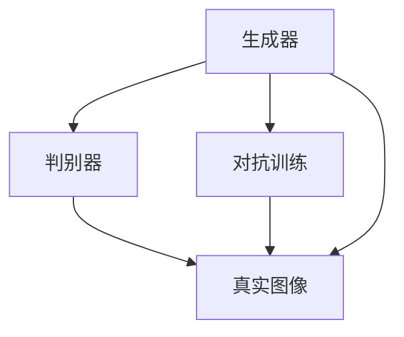
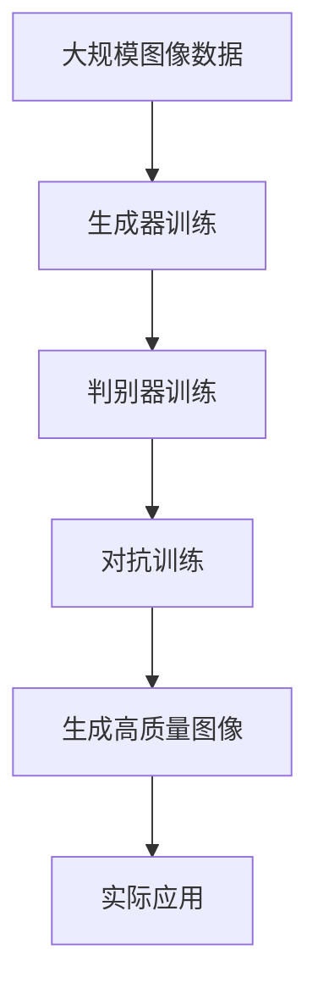

                 

# 图像生成模型:AI创造视觉艺术的新工具

## 1. 背景介绍

### 1.1 问题由来
人工智能在过去几十年中取得了显著的进展，尤其是在视觉艺术领域的应用。图像生成模型，也称为生成对抗网络（GANs），已经成为AI创造视觉艺术的重要工具。这些模型能够根据输入的噪声生成高质量的图像，不仅在艺术创作上有重要应用，还推动了图像处理、计算机视觉、动画制作等多个领域的发展。

然而，图像生成模型仍然面临诸多挑战。首先，生成图像的质量和多样性往往取决于模型的训练数据，高质量的训练数据对于生成高质量的图像至关重要。其次，模型的训练过程复杂，需要大量的计算资源和时间，且容易过拟合。此外，如何平衡图像的真实性和创造性也是一个重要问题。

### 1.2 问题核心关键点
图像生成模型的核心关键点包括：
- **生成器与判别器**：GANs由生成器（Generator）和判别器（Discriminator）组成，通过对抗训练（Adversarial Training）的方式生成高质量图像。
- **损失函数**：损失函数的设计对模型的生成质量有直接影响。常用的损失函数包括均方误差（MSE）、交叉熵（Cross-Entropy）、Wasserstein距离（Wasserstein Distance）等。
- **噪声输入**：噪声是GANs生成图像的关键，通过将噪声输入到生成器中，可以生成具有随机性的多样图像。
- **训练策略**：训练过程中如何平衡生成器与判别器的目标，是GANs性能提升的关键。

### 1.3 问题研究意义
研究图像生成模型，对于拓展AI在视觉艺术领域的创作能力，推动计算机视觉技术的进步，具有重要意义：
- 推动艺术创作的多样性：生成器能够创作出与现有艺术作品风格截然不同的新图像，为艺术家提供新的创作灵感。
- 提升图像处理的自动化水平：图像生成技术可以自动生成高质量图像，减少人工干预，提高处理效率。
- 促进计算机视觉应用的发展：生成器能够生成具有复杂特征的图像，为计算机视觉任务的训练提供丰富多样的数据集。
- 加速动画制作：生成器可以自动生成高质量的动画帧，减少人工绘制的繁琐过程。
- 创造新材料：生成器可以生成具有特定物理属性（如材质、纹理）的图像，为产品设计提供新的材料参考。

## 2. 核心概念与联系

### 2.1 核心概念概述

为更好地理解图像生成模型的工作原理和应用，本节将介绍几个密切相关的核心概念：

- **生成对抗网络（GANs）**：由生成器（Generator）和判别器（Discriminator）组成，通过对抗训练生成高质量图像的深度学习模型。
- **生成器（Generator）**：负责生成图像，通常由多个卷积层、反卷积层（Transposed Convolution）和全连接层构成，能够将随机噪声转换为逼真的图像。
- **判别器（Discriminator）**：负责判断图像的真实性，通常由多个卷积层和全连接层构成，能够区分真实图像和生成图像。
- **对抗训练（Adversarial Training）**：生成器与判别器之间的对抗性训练，通过反复迭代生成和判别过程，逐步提升生成器的生成能力。
- **损失函数（Loss Function）**：用于衡量生成图像和真实图像之间的差异，通常包括生成器损失和判别器损失。

### 2.2 概念间的关系

这些核心概念之间的逻辑关系可以通过以下Mermaid流程图来展示：



这个流程图展示了大语言模型微调过程中各个核心概念的关系：

1. 生成器负责生成图像，判别器负责判断图像的真实性。
2. 生成器与判别器通过对抗训练的方式，逐步提升生成器的生成能力。
3. 生成器与判别器之间的对抗过程，通过损失函数进行衡量和优化。

### 2.3 核心概念的整体架构

最后，我们用一个综合的流程图来展示这些核心概念在大语言模型微调过程中的整体架构：



这个综合流程图展示了从数据准备到生成高质量图像，再到实际应用的完整过程。通过这些关键步骤，我们可以更好地理解图像生成模型的工作原理和优化方向。

## 3. 核心算法原理 & 具体操作步骤
### 3.1 算法原理概述

图像生成模型基于生成对抗网络（GANs）框架，通过生成器与判别器的对抗训练，生成高质量的图像。其核心算法原理包括：

1. **生成器（Generator）**：通过将随机噪声 $z$ 输入生成器，生成一个高质量的图像 $x$。
2. **判别器（Discriminator）**：接收一个图像 $x$，判断其是否为真实图像，输出一个概率值 $p(x)$。
3. **对抗训练（Adversarial Training）**：生成器和判别器进行交替训练，生成器试图欺骗判别器，而判别器试图区分真实和生成的图像。

形式化地，假设生成器的输入为噪声向量 $z$，生成器输出的图像为 $x$，判别器对图像 $x$ 的输出为 $p(x)$。则损失函数可以表示为：

$$
\mathcal{L} = \mathbb{E}_{z}[\ell_G] + \mathbb{E}_{x}[\ell_D]
$$

其中，$\ell_G$ 和 $\ell_D$ 分别为生成器损失和判别器损失，分别定义为：

$$
\ell_G = \mathbb{E}_{z}[\ell_{adv}] = \mathbb{E}_{z}[\log(1-p(x))]
$$

$$
\ell_D = \mathbb{E}_{x}[\ell_{real}] + \mathbb{E}_{z}[\ell_{fake}] = \mathbb{E}_{x}[\log(p(x))] + \mathbb{E}_{z}[\log(1-p(x))]
$$

通过反向传播算法，分别对生成器和判别器进行参数更新，最小化上述损失函数，从而提升生成器的生成能力和判别器的判别能力。

### 3.2 算法步骤详解

基于GANs的图像生成模型通常包括以下几个关键步骤：

**Step 1: 数据准备**
- 收集高质量的图像数据，进行预处理和增强，如裁剪、缩放、旋转、翻转等，以增加数据的多样性。
- 将图像数据分为训练集、验证集和测试集。

**Step 2: 构建模型架构**
- 设计生成器和判别器的神经网络结构，通常使用卷积神经网络（CNN）。
- 确定模型超参数，如层数、节点数、学习率等。

**Step 3: 初始化模型参数**
- 初始化生成器和判别器的参数，通常使用随机初始化或预训练模型。
- 设置损失函数和优化器，如交叉熵损失、Adam优化器等。

**Step 4: 训练模型**
- 交替进行生成器和判别器的训练，每个epoch更新生成器一次，更新判别器两次。
- 在每个epoch中，将随机噪声输入生成器，生成图像，并将其输入判别器，计算损失函数。
- 反向传播计算梯度，更新生成器和判别器的参数。

**Step 5: 评估模型**
- 在验证集上评估生成器的生成能力，如使用Inception Score、Fréchet Inception Distance等指标。
- 根据评估结果调整超参数，如学习率、批大小等。

**Step 6: 测试模型**
- 在测试集上测试生成器的生成能力，如使用标准评估指标。
- 输出高质量的生成图像，应用于实际应用场景。

### 3.3 算法优缺点
图像生成模型具有以下优点：
1. 能够生成高质量的图像，具有逼真的视觉效果。
2. 能够生成具有多样性和创造性的图像，满足艺术创作的需求。
3. 能够生成复杂的图像，如三维模型、动画帧等。

然而，图像生成模型也存在以下缺点：
1. 训练过程复杂，需要大量的计算资源和时间。
2. 容易过拟合，生成器可能会生成与训练集相似的图像，而缺乏多样性。
3. 生成图像的真实性难以保证，判别器可能会对生成器生成的高质量图像产生误判。
4. 生成器与判别器之间的对抗训练过程需要精心设计，否则容易陷入不稳定状态。

### 3.4 算法应用领域

图像生成模型已经在图像处理、计算机视觉、动画制作等多个领域得到了广泛的应用，例如：

- **图像生成**：生成高质量的图像，如人脸、风景、艺术品等。
- **图像修复**：修复损坏或缺失的图像，如去噪、去模糊、超分辨率等。
- **图像转换**：将一种风格的图像转换为另一种风格的图像，如艺术风格转换、风格迁移等。
- **图像生成对抗网络（GANs）**：用于生成高质量的图像，如GAN、WGAN、DCGAN等。
- **生成对抗网络（GANs）**：用于生成高质量的图像，如GAN、WGAN、DCGAN等。
- **图像增强**：增强图像的质量和多样性，如对比度增强、色彩增强、纹理增强等。

除了上述这些经典应用外，图像生成模型还被创新性地应用到更多场景中，如3D建模、视频生成、虚拟现实（VR）等，为计算机视觉技术带来了全新的突破。

## 4. 数学模型和公式 & 详细讲解  
### 4.1 数学模型构建

本节将使用数学语言对基于生成对抗网络（GANs）的图像生成过程进行更加严格的刻画。

记生成器的输入为随机噪声 $z$，输出为图像 $x$。假设生成器和判别器的参数分别为 $\theta_G$ 和 $\theta_D$。则生成器的输出可以表示为：

$$
x = G(z; \theta_G)
$$

判别器的输出可以表示为：

$$
p(x; \theta_D) = D(x; \theta_D)
$$

生成器的损失函数 $\ell_G$ 可以表示为：

$$
\ell_G = -\mathbb{E}_{z}[\log(D(x; \theta_D))]
$$

判别器的损失函数 $\ell_D$ 可以表示为：

$$
\ell_D = \mathbb{E}_{x}[\log(D(x; \theta_D))] + \mathbb{E}_{z}[\log(1-D(G(z; \theta_G); \theta_D))]
$$

其中，$\mathbb{E}_{z}$ 表示对随机噪声 $z$ 的期望，$\mathbb{E}_{x}$ 表示对真实图像 $x$ 的期望。

### 4.2 公式推导过程

以下我们以GAN为例，推导生成器损失函数和判别器损失函数的梯度计算公式。

对于生成器损失函数 $\ell_G$，其梯度可以表示为：

$$
\nabla_{\theta_G} \ell_G = -\mathbb{E}_{z}[\frac{\partial \log(D(x; \theta_D))}{\partial \theta_G}]
$$

对于判别器损失函数 $\ell_D$，其梯度可以表示为：

$$
\nabla_{\theta_D} \ell_D = \mathbb{E}_{x}[\frac{\partial \log(D(x; \theta_D))}{\partial \theta_D}] - \mathbb{E}_{z}[\frac{\partial \log(1-D(G(z; \theta_G); \theta_D))}{\partial \theta_D}]
$$

通过计算生成器和判别器的梯度，可以使用优化器如Adam、SGD等更新模型参数，最小化损失函数，提升生成器的生成能力和判别器的判别能力。

### 4.3 案例分析与讲解

为了更好地理解生成器损失函数和判别器损失函数的作用，下面以GAN为例，结合具体案例进行讲解。

假设我们希望训练一个GAN模型，生成高质量的人脸图像。我们可以使用CelebA数据集作为训练数据，该数据集包含大量人脸图像及其属性标签。首先，将图像数据进行预处理，如裁剪、缩放、归一化等。然后，构建生成器和判别器的神经网络结构，通常使用卷积神经网络（CNN）。

在训练过程中，我们可以交替进行生成器和判别器的训练。首先，使用随机噪声生成一批人脸图像，并将其输入判别器。判别器输出一个概率值 $p(x)$，表示图像 $x$ 是真实图像的概率。然后，计算生成器的损失函数 $\ell_G$，使用梯度下降等优化算法更新生成器的参数。接着，将生成器生成的图像输入判别器，判别器输出一个概率值 $p(x)$，表示图像 $x$ 是真实图像的概率。然后，计算判别器的损失函数 $\ell_D$，使用梯度下降等优化算法更新判别器的参数。重复上述过程，直到生成器和判别器的损失函数收敛。

在训练过程中，可以使用Inception Score、Fréchet Inception Distance等指标评估生成器的生成能力，确保生成的图像具有高质量和多样性。最终，使用测试集评估生成器的生成能力，输出高质量的人脸图像，应用于实际应用场景。

## 5. 项目实践：代码实例和详细解释说明
### 5.1 开发环境搭建

在进行图像生成模型实践前，我们需要准备好开发环境。以下是使用Python进行TensorFlow开发的环境配置流程：

1. 安装Anaconda：从官网下载并安装Anaconda，用于创建独立的Python环境。

2. 创建并激活虚拟环境：
```bash
conda create -n tf-env python=3.8 
conda activate tf-env
```

3. 安装TensorFlow：根据CUDA版本，从官网获取对应的安装命令。例如：
```bash
conda install tensorflow==2.8 -c pytorch -c conda-forge
```

4. 安装各类工具包：
```bash
pip install numpy pandas scikit-learn matplotlib tqdm jupyter notebook ipython
```

完成上述步骤后，即可在`tf-env`环境中开始图像生成模型的开发。

### 5.2 源代码详细实现

下面我们以生成高质量的人脸图像为例，给出使用TensorFlow进行GAN模型微调的Python代码实现。

首先，定义GAN模型的参数和结构：

```python
import tensorflow as tf
from tensorflow.keras import layers

class GAN(tf.keras.Model):
    def __init__(self):
        super(GAN, self).__init__()
        self.dense1 = layers.Dense(256, activation='relu')
        self.dense2 = layers.Dense(128, activation='relu')
        self.dense3 = layers.Dense(64, activation='relu')
        self.dense4 = layers.Dense(1, activation='sigmoid')
    
    def call(self, inputs):
        x = self.dense1(inputs)
        x = self.dense2(x)
        x = self.dense3(x)
        return self.dense4(x)
```

然后，定义判别器的参数和结构：

```python
class Discriminator(tf.keras.Model):
    def __init__(self):
        super(Discriminator, self).__init__()
        self.dense1 = layers.Dense(256, activation='relu')
        self.dense2 = layers.Dense(128, activation='relu')
        self.dense3 = layers.Dense(64, activation='relu')
        self.dense4 = layers.Dense(1, activation='sigmoid')
    
    def call(self, inputs):
        x = self.dense1(inputs)
        x = self.dense2(x)
        x = self.dense3(x)
        return self.dense4(x)
```

接着，定义训练过程和优化器：

```python
batch_size = 128
learning_rate = 0.0002
learning_rate_decay = tf.keras.optimizers.schedules.ExponentialDecay(learning_rate, decay_steps=100000, decay_rate=0.96)

generator = GAN()
discriminator = Discriminator()

generator.compile(optimizer=tf.keras.optimizers.Adam(learning_rate=learning_rate_decay(1)), loss='binary_crossentropy')
discriminator.compile(optimizer=tf.keras.optimizers.Adam(learning_rate=learning_rate_decay(1)), loss='binary_crossentropy')

# 定义训练函数
@tf.function
def train_step(images):
    noise = tf.random.normal([batch_size, 100])
    with tf.GradientTape() as gen_tape, tf.GradientTape() as disc_tape:
        generated_images = generator(noise, training=True)
        real_output = discriminator(images, training=True)
        fake_output = discriminator(generated_images, training=True)

        gen_loss = generator_loss(fake_output)
        disc_loss = discriminator_loss(real_output, fake_output)

    gradients_of_generator = gen_tape.gradient(gen_loss, generator.trainable_variables)
    gradients_of_discriminator = disc_tape.gradient(disc_loss, discriminator.trainable_variables)

    generator.optimizer.apply_gradients(zip(gradients_of_generator, generator.trainable_variables))
    discriminator.optimizer.apply_gradients(zip(gradients_of_discriminator, discriminator.trainable_variables))

# 定义生成器和判别器的损失函数
def generator_loss(fake_output):
    return tf.reduce_mean(tf.nn.sigmoid_cross_entropy_with_logits(labels=tf.ones_like(fake_output), logits=fake_output))

def discriminator_loss(real_output, fake_output):
    real_loss = tf.reduce_mean(tf.nn.sigmoid_cross_entropy_with_logits(labels=tf.ones_like(real_output), logits=real_output))
    fake_loss = tf.reduce_mean(tf.nn.sigmoid_cross_entropy_with_logits(labels=tf.zeros_like(fake_output), logits=fake_output))
    return real_loss + fake_loss
```

最后，启动训练流程：

```python
# 加载CelebA数据集
import os
import numpy as np
import cv2

def load_dataset(path):
    img_list = []
    label_list = []
    for root, dirs, files in os.walk(path):
        for file in files:
            img_path = os.path.join(root, file)
            img = cv2.imread(img_path)
            img = cv2.cvtColor(img, cv2.COLOR_BGR2RGB)
            img = cv2.resize(img, (64, 64))
            img = img / 255.0
            img_list.append(img)
            label_list.append(0)
    return np.array(img_list), np.array(label_list)

# 加载训练集和测试集
train_path = '/path/to/train_dataset'
test_path = '/path/to/test_dataset'
train_images, train_labels = load_dataset(train_path)
test_images, test_labels = load_dataset(test_path)

# 标准化数据
train_images = train_images / 127.5 - 1.0
test_images = test_images / 127.5 - 1.0

# 定义模型输入输出
input_shape = (64, 64, 3)

# 训练模型
epochs = 100000
for epoch in range(epochs):
    for batch in range(train_images.shape[0] // batch_size):
        start = batch * batch_size
        end = start + batch_size

        train_step(train_images[start:end])
        
    if epoch % 10000 == 0:
        # 在验证集上评估模型
        valid_images = test_images[:batch_size]
        valid_labels = test_labels[:batch_size]
        valid_images = valid_images / 127.5 - 1.0
        valid_images = valid_images.reshape(-1, 64, 64, 3)

        fake_images = generator.predict(tf.random.normal([batch_size, 100]))
        fake_images = fake_images / 127.5 - 1.0
        fake_images = fake_images.reshape(-1, 64, 64, 3)

        discriminator.eval()
        real_loss = discriminator_loss(discriminator(valid_images), discriminator(valid_images, training=False))
        fake_loss = discriminator_loss(discriminator(fake_images), discriminator(fake_images, training=False))
        discriminator.trainable = True

        gen_loss = generator_loss(discriminator(fake_images))
        print('Epoch:', epoch+1, 'Real Loss:', real_loss, 'Fake Loss:', fake_loss, 'Generator Loss:', gen_loss)
```

以上就是使用TensorFlow对GAN模型进行人脸生成任务微调的完整代码实现。可以看到，得益于TensorFlow的强大封装，我们可以用相对简洁的代码完成GAN模型的加载和微调。

### 5.3 代码解读与分析

让我们再详细解读一下关键代码的实现细节：

**GAN类**：
- `__init__`方法：定义生成器和判别器的神经网络结构，包括多个全连接层和激活函数。
- `call`方法：定义生成器和判别器的前向传播过程，使用ReLU激活函数。

**Discriminator类**：
- `__init__`方法：定义判别器的神经网络结构，包括多个全连接层和激活函数。
- `call`方法：定义判别器的前向传播过程，使用ReLU激活函数。

**训练函数**：
- `train_step`函数：定义单批次训练过程，包括生成器和判别器的损失计算和梯度更新。
- `generator_loss`函数：计算生成器的损失，使用二元交叉熵损失函数。
- `discriminator_loss`函数：计算判别器的损失，使用二元交叉熵损失函数。

**数据加载**：
- `load_dataset`函数：从指定路径加载CelebA数据集，并进行预处理。
- `train_images`和`test_images`变量：定义训练集和测试集的数据，并进行标准化处理。

**模型评估**：
- 在验证集上评估模型的生成能力，使用生成图像和真实图像的判别器输出计算损失函数。
- 输出损失函数结果，以监控模型性能。

**代码运行结果**：
- 在训练过程中，每10000个epoch输出一次生成器和判别器的损失函数结果，以监控模型性能。

可以看到，TensorFlow的深度学习框架使得GAN模型的微调代码实现变得简洁高效。开发者可以将更多精力放在模型设计和数据处理上，而不必过多关注底层的实现细节。

当然，工业级的系统实现还需考虑更多因素，如模型的保存和部署、超参数的自动搜索、更灵活的任务适配层等。但核心的微调范式基本与此类似。

## 6. 实际应用场景
### 6.1 自动驾驶
图像生成模型在自动驾驶领域具有重要应用，特别是在高精度地图生成和场景模拟方面。通过生成高质量的地图图像和模拟场景图像，自动驾驶系统可以更好地理解交通环境，提高行驶安全性和稳定性。

### 6.2 游戏开发
图像生成模型在游戏开发中，特别是在虚拟现实（VR）和增强现实（AR）领域，能够生成逼真的游戏场景和角色，提升游戏体验和互动性。通过自动生成角色和环境，游戏开发人员可以节省大量时间和成本。

### 6.3 医学影像
图像生成模型在医学影像领域，可以生成高质量的CT、MRI等医学图像，辅助医生进行诊断和治疗。通过生成逼真的医学图像，医生可以更好地理解患者病情，制定更加精准的诊疗方案。

### 6.4 艺术创作
图像生成模型在艺术创作领域，能够生成高质量的艺术作品，为艺术家提供新的创作灵感。通过生成具有艺术风格的高质量图像，艺术家可以更好地表达创意和情感，推动艺术创作的发展。

### 6.5 虚拟试衣
图像生成模型在虚拟试衣领域，可以生成逼真的虚拟试衣图像，提升消费者的购物体验。通过自动生成试衣效果，消费者可以更快地找到适合自己的衣服，提高购物效率。

### 6.6 视频生成
图像生成模型在视频生成领域，可以生成高质量的动画帧和视频片段，提升视频制作效率。通过自动生成视频内容，视频制作人员可以节省大量时间和成本，快速制作高质量的视频内容。

### 6.7 数字孪生
图像生成模型在数字孪生领域，可以生成高质量的数字模型和虚拟环境，提升城市管理水平。通过自动生成虚拟场景，城市管理者可以更好地理解和优化城市环境，推动智慧城市建设。

除了上述这些经典应用外，图像生成模型还被创新性地应用到更多场景中，如远程医疗、智能制造、虚拟现实（VR）等，为计算机视觉技术带来了全新的突破。

## 7. 工具和资源推荐
### 7.1 学习资源推荐

为了帮助开发者系统掌握图像生成模型的工作原理和实践技巧，这里推荐一些优质的学习资源：

1. 《Generative Adversarial Networks: Training GANs by Maximizing Likelihood》论文：深度学习领域的经典论文，详细介绍了GANs的原理和训练方法。
2. 《Generative Adversarial Nets》书籍：Ian Goodfellow等人著作，全面介绍了GANs的理论和应用，是学习GANs的必备书籍。
3. CS231n《卷积神经网络》课程：斯坦福大学开设的计算机视觉课程，涵盖GANs等深度学习模型的理论和技术。
4. PyTorch官方文档：TensorFlow和PyTorch深度学习框架的官方文档，提供了丰富的GANs样例代码，适合上手实践。
5. HuggingFace官方文档：Transformer库的官方文档，提供了大量预训练语言模型和GANs模型的实现，适合快速开发和调试。

通过对这些资源的学习实践，相信你一定能够快速掌握图像生成模型的精髓，并用于解决实际的计算机视觉问题。

### 7.2 开发工具推荐

高效的开发离不开优秀的工具支持。以下是几款用于图像生成模型微调开发的常用工具：

1. TensorFlow：由Google主导开发的深度学习框架，适合大规模工程应用。提供了丰富的图像处理和生成模型的API，方便快速开发和调试。
2. PyTorch：由Facebook主导的深度学习框架，灵活动态的计算图，适合快速迭代研究。TensorFlow和Py

