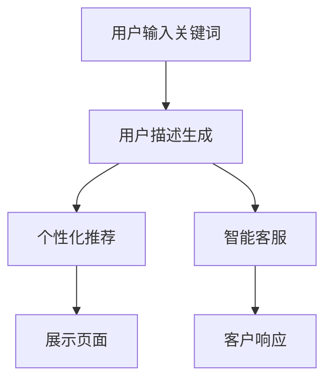

                 

# 在电商中运用AI LLM：从关键词到富有洞见的描述

在电商领域，消费者与商家的交互方式正在发生根本性的变化。从传统的搜索与购买，到如今的智能推荐、个性化客服，AI语言模型（LLM）正在扮演越来越重要的角色。本文将探讨如何在电商中运用AI LLM，具体从关键词到富有洞见的描述，探索大语言模型的潜力和应用场景。

## 1. 背景介绍

### 1.1 问题由来

随着电商平台的不断演进，商家和消费者的互动方式愈发复杂多变。如何精准理解消费者需求，提供更个性化的购物体验，成为电商营销的关键挑战。传统电商的关键词搜索模式，虽然高效便捷，但忽略了用户更深层次的需求和背景信息。

大语言模型（LLM）通过预训练获得了强大的语言理解和生成能力，能够处理自然语言指令，并在多种任务中展示出卓越的性能。本文将讨论如何在电商领域中利用LLM，从基础的关键词搜索，到更深入的用户描述，全方位提升电商体验。

### 1.2 问题核心关键点

利用AI LLM在电商中的应用，需关注以下关键点：

- 预训练和微调：在电商特定数据上对通用大模型进行微调，提升模型对电商领域的理解。
- 用户描述生成：从用户输入的关键词中，生成更丰富、更具洞见的描述，帮助理解用户需求。
- 个性化推荐：基于用户描述，生成个性化商品推荐，提升购物体验。
- 聊天机器人：利用LLM实现智能客服，快速响应用户问题。

### 1.3 问题研究意义

在大数据、人工智能技术飞速发展的背景下，将AI LLM应用于电商，不仅能够显著提升用户购物体验，还能为商家提供更高效的运营支持。具体来说，

1. **提高转化率**：通过理解用户需求，提供个性化推荐，减少搜索疲劳，提升转化率。
2. **优化库存管理**：根据预测用户需求，调整库存水平，减少库存积压，提升运营效率。
3. **提升客户满意度**：通过智能客服，快速解答用户疑问，提升客户满意度。
4. **扩展业务边界**：通过智能推荐系统，拓展新业务领域，如金融、教育等。

## 2. 核心概念与联系

### 2.1 核心概念概述

在本节中，我们将介绍几个核心概念，包括：

- **大语言模型（LLM）**：基于Transformer架构，通过大规模无监督训练，学习语言表示的通用语言模型。
- **预训练和微调**：在通用领域对模型进行预训练，再在特定领域进行微调，提升模型性能。
- **用户描述生成**：从用户输入的关键词中，生成详细、具洞见的描述。
- **个性化推荐**：基于用户描述，生成个性化商品推荐。
- **聊天机器人**：利用自然语言理解与生成技术，实现智能客服。

这些概念之间的联系可以通过以下Mermaid流程图展示：



该图展示了从用户输入到生成用户描述、推荐商品和客服响应的整体流程。

### 2.2 概念间的关系

这些核心概念之间的关系紧密，共同构成了AI LLM在电商中的整体应用架构。以下通过几个关键步骤解释这些概念的联系：

#### 2.2.1 用户描述生成

用户输入关键词后，通过自然语言处理技术，生成详细的用户描述。这一过程通常包括以下步骤：

1. **预训练模型加载**：加载预训练的LLM模型，如GPT-3或BERT。
2. **关键词嵌入**：将用户输入的关键词转换为向量形式，供模型理解。
3. **上下文处理**：利用LLM模型，对用户描述进行生成。
4. **描述优化**：对生成的描述进行后处理，去除重复和噪音，增加语义丰富性。

#### 2.2.2 个性化推荐

基于生成的用户描述，LLM模型能够理解用户的兴趣和需求，生成个性化推荐。这一过程通常包括以下步骤：

1. **商品描述处理**：将商品描述转换为向量形式，供模型比较。
2. **相似度计算**：利用LLM模型，计算商品描述与用户描述的相似度。
3. **推荐排序**：根据相似度，对商品进行排序，生成推荐列表。
4. **动态调整**：根据用户反馈和行为数据，动态调整推荐算法，提升推荐效果。

#### 2.2.3 智能客服

通过自然语言理解（NLU）和生成（NLG）技术，LLM模型能够实现智能客服，这一过程通常包括以下步骤：

1. **问题理解**：利用NLU技术，理解用户提出的问题。
2. **知识检索**：从知识库或数据库中检索相关信息。
3. **答案生成**：利用NLG技术，生成自然语言回答。
4. **用户反馈**：根据用户反馈，不断优化客服系统。

通过这些步骤，LLM模型能够实现在电商领域的广泛应用。

## 3. 核心算法原理 & 具体操作步骤

### 3.1 算法原理概述

在电商中运用AI LLM的核心算法原理可以概括为：

1. **预训练和微调**：在通用领域对模型进行预训练，再在电商特定数据上微调，提升模型性能。
2. **用户描述生成**：从用户输入的关键词中，生成详细、具洞见的描述。
3. **个性化推荐**：基于用户描述，生成个性化商品推荐。
4. **聊天机器人**：利用自然语言理解与生成技术，实现智能客服。

### 3.2 算法步骤详解

#### 3.2.1 预训练和微调

预训练和微调是构建电商领域LLM模型的关键步骤。以下是详细的算法步骤：

1. **数据准备**：收集电商领域的文本数据，如商品描述、用户评论等。
2. **模型选择**：选择适合的预训练模型，如GPT-3、BERT等。
3. **预训练**：在大量无监督数据上对模型进行预训练。
4. **微调**：在电商数据上对预训练模型进行微调，提升模型对电商领域的理解。
5. **评估**：在测试集上评估模型性能，确保微调效果。

#### 3.2.2 用户描述生成

用户描述生成的算法步骤包括：

1. **输入处理**：将用户输入的关键词转换为向量形式。
2. **上下文生成**：利用预训练的LLM模型，生成详细描述。
3. **后处理**：去除重复和噪音，增加语义丰富性。

#### 3.2.3 个性化推荐

个性化推荐的算法步骤包括：

1. **商品描述处理**：将商品描述转换为向量形式。
2. **相似度计算**：利用LLM模型，计算商品描述与用户描述的相似度。
3. **推荐排序**：根据相似度，对商品进行排序，生成推荐列表。
4. **动态调整**：根据用户反馈和行为数据，动态调整推荐算法。

#### 3.2.4 聊天机器人

聊天机器人的算法步骤包括：

1. **问题理解**：利用NLU技术，理解用户提出的问题。
2. **知识检索**：从知识库或数据库中检索相关信息。
3. **答案生成**：利用NLG技术，生成自然语言回答。
4. **用户反馈**：根据用户反馈，不断优化客服系统。

### 3.3 算法优缺点

利用AI LLM在电商中的应用具有以下优点：

1. **高效便捷**：通过自然语言处理技术，快速理解用户需求，提升用户体验。
2. **个性化推荐**：基于用户描述，生成个性化推荐，提升购物体验。
3. **成本低廉**：相较于人工客服，LLM模型能够24小时不间断工作，降低人工成本。
4. **可扩展性强**：LLM模型可轻松扩展到多种电商领域，如金融、教育等。

但同时也存在一些缺点：

1. **数据依赖**：模型性能依赖于高质量、大规模的数据集。
2. **上下文理解难度大**：电商领域的复杂性可能导致模型理解错误。
3. **计算资源需求高**：大规模模型需要大量计算资源支持。
4. **模型解释性差**：LLM模型通常缺乏明确的决策路径，难以解释其推理过程。

### 3.4 算法应用领域

AI LLM在电商领域的应用非常广泛，涵盖以下几个方面：

1. **搜索与推荐**：提升搜索精准度和推荐效果。
2. **智能客服**：提供24小时不间断的智能客服支持。
3. **广告投放**：通过用户描述，优化广告投放策略。
4. **供应链管理**：预测用户需求，优化库存管理。
5. **营销活动**：通过自然语言生成技术，提升营销文案质量。

## 4. 数学模型和公式 & 详细讲解 & 举例说明

### 4.1 数学模型构建

在电商中运用AI LLM，通常涉及以下几个数学模型：

1. **用户描述生成模型**：
   - 输入：用户关键词向量 $x$。
   - 输出：用户描述向量 $y$。
   - 目标函数：最小化损失函数 $L(y, \hat{y})$。

2. **个性化推荐模型**：
   - 输入：商品描述向量 $x$、用户描述向量 $y$。
   - 输出：推荐列表向量 $z$。
   - 目标函数：最小化损失函数 $L(z, \hat{z})$。

3. **聊天机器人模型**：
   - 输入：用户问题向量 $x$。
   - 输出：回答向量 $y$。
   - 目标函数：最小化损失函数 $L(y, \hat{y})$。

### 4.2 公式推导过程

以用户描述生成模型为例，其目标函数可以表示为：

$$
L(y, \hat{y}) = \sum_{i=1}^n |y_i - \hat{y}_i|^2
$$

其中，$y$为真实用户描述向量，$\hat{y}$为模型生成的用户描述向量。

通过反向传播算法，可以计算出模型参数的梯度，并使用优化器（如Adam）进行参数更新。

### 4.3 案例分析与讲解

假设用户在电商平台上搜索“高端智能手表”，通过以下步骤生成详细描述：

1. **输入处理**：将关键词“高端智能手表”转换为向量形式。
2. **上下文生成**：利用预训练的GPT-3模型，生成详细描述。
3. **后处理**：去除重复和噪音，增加语义丰富性。

最终生成的描述可能为：“高端智能手表，具备高精度GPS、心率监测、长续航等特性，适合日常使用和运动场景。”

## 5. 项目实践：代码实例和详细解释说明

### 5.1 开发环境搭建

在进行项目实践前，我们需要准备好开发环境。以下是使用Python进行PyTorch开发的环境配置流程：

1. 安装Anaconda：从官网下载并安装Anaconda，用于创建独立的Python环境。

2. 创建并激活虚拟环境：
```bash
conda create -n pytorch-env python=3.8 
conda activate pytorch-env
```

3. 安装PyTorch：根据CUDA版本，从官网获取对应的安装命令。例如：
```bash
conda install pytorch torchvision torchaudio cudatoolkit=11.1 -c pytorch -c conda-forge
```

4. 安装Transformers库：
```bash
pip install transformers
```

5. 安装各类工具包：
```bash
pip install numpy pandas scikit-learn matplotlib tqdm jupyter notebook ipython
```

完成上述步骤后，即可在`pytorch-env`环境中开始项目实践。

### 5.2 源代码详细实现

以下是一个简单的示例代码，用于用户描述生成：

```python
from transformers import GPT3Tokenizer, GPT3ForCausalLM
import torch

tokenizer = GPT3Tokenizer.from_pretrained('gpt3')
model = GPT3ForCausalLM.from_pretrained('gpt3')

def generate_description(keywords):
    inputs = tokenizer.encode(keywords, return_tensors='pt')
    outputs = model.generate(inputs, max_length=50, temperature=0.7)
    description = tokenizer.decode(outputs[0], skip_special_tokens=True)
    return description

keywords = '高端智能手表'
description = generate_description(keywords)
print(description)
```

这个代码使用了GPT-3模型，通过将用户关键词转换为向量形式，利用模型生成详细描述。

### 5.3 代码解读与分析

这段代码的核心步骤如下：

1. **加载预训练模型**：使用`from_pretrained`方法加载GPT-3模型。
2. **输入处理**：将用户关键词转换为向量形式，供模型理解。
3. **上下文生成**：利用GPT-3模型，生成详细描述。
4. **后处理**：利用`tokenizer.decode`方法，将向量形式的描述转换为可读字符串。

### 5.4 运行结果展示

假设在用户输入“高端智能手表”后，生成的描述为：

```
高端智能手表，具备高精度GPS、心率监测、长续航等特性，适合日常使用和运动场景。
```

可以看到，通过AI LLM模型，我们成功从关键词生成了详细描述，为电商搜索和推荐提供了有力的支持。

## 6. 实际应用场景

### 6.1 搜索与推荐

在电商搜索与推荐场景中，AI LLM能够通过用户描述生成，提供更加精准的搜索结果和个性化推荐。

例如，用户输入“女性运动鞋”，通过用户描述生成模型，可以得到详细描述“适合女性的运动鞋，轻便舒适，具备缓震、透气等功能”。然后基于该描述，生成个性化推荐列表，如Nike Air Max 270、Adidas Ultra Boost等。

### 6.2 智能客服

通过自然语言理解与生成技术，AI LLM能够实现智能客服，快速响应用户问题。

例如，用户咨询“如何设置闹钟？”，智能客服通过NLU技术理解问题，然后从知识库中检索相关信息，利用NLG技术生成回答：“在设置页，选择闹钟，设定时间和重复频率即可。”

### 6.3 广告投放

AI LLM能够通过用户描述生成，优化广告投放策略。例如，通过分析用户描述，识别用户偏好，生成有针对性的广告文案。

### 6.4 供应链管理

通过预测用户需求，优化库存管理。例如，通过用户描述生成模型，预测热门商品的需求量，调整库存水平，减少积压。

### 6.5 营销活动

通过自然语言生成技术，提升营销文案质量。例如，利用AI LLM生成广告词，如“新一代智能手表，您的时尚必备”，提升广告效果。

## 7. 工具和资源推荐

### 7.1 学习资源推荐

为了帮助开发者系统掌握AI LLM在电商中的应用，这里推荐一些优质的学习资源：

1. **《自然语言处理入门》**：介绍自然语言处理基本概念和常用模型。
2. **《深度学习与NLP实战》**：涵盖深度学习在NLP中的应用，包括预训练和微调。
3. **《Transformers实战》**：详细讲解Transformer架构和LLM应用。
4. **《电商数据挖掘与分析》**：讲解电商数据的挖掘和分析方法。
5. **《NLP技术在电商中的应用》**：探讨NLP技术在电商中的具体应用。

### 7.2 开发工具推荐

1. **PyTorch**：基于Python的开源深度学习框架，适合快速迭代研究。
2. **TensorFlow**：由Google主导的深度学习框架，适合大规模工程应用。
3. **HuggingFace Transformers库**：提供多种预训练模型，支持PyTorch和TensorFlow。
4. **Weights & Biases**：模型训练的实验跟踪工具。
5. **TensorBoard**：TensorFlow配套的可视化工具。

### 7.3 相关论文推荐

1. **《Transformer in NLP》**：介绍Transformer架构在NLP中的应用。
2. **《预训练语言模型在电商中的应用》**：探讨预训练模型在电商领域的潜力。
3. **《自然语言生成技术》**：介绍自然语言生成技术和LLM模型。
4. **《电商智能客服系统》**：介绍智能客服系统的构建方法。
5. **《个性化推荐系统》**：讲解个性化推荐系统的构建方法。

## 8. 总结：未来发展趋势与挑战

### 8.1 研究成果总结

本文系统介绍了AI LLM在电商中的应用，涉及用户描述生成、个性化推荐、智能客服等方面。通过详细讲解算法原理和具体操作步骤，展示了LLM模型在电商领域的广泛应用。

### 8.2 未来发展趋势

未来，AI LLM在电商领域的应用将呈现以下几个趋势：

1. **模型规模增大**：随着算力成本的下降，预训练模型规模将进一步增大，提供更丰富的语义表示。
2. **上下文理解增强**：通过上下文理解，更好地处理电商领域的复杂任务。
3. **计算资源优化**：通过模型压缩、稀疏化等技术，优化计算资源使用。
4. **跨领域应用拓展**：LLM模型不仅限于电商，还将拓展到更多领域。

### 8.3 面临的挑战

尽管AI LLM在电商中展示出巨大的潜力，但仍面临一些挑战：

1. **数据质量问题**：电商数据的多样性和复杂性可能导致数据质量问题。
2. **模型泛化能力**：电商领域的复杂性可能导致模型泛化能力不足。
3. **计算资源需求高**：大规模模型的计算资源需求较高。
4. **伦理与安全问题**：需要考虑模型输出和使用的伦理与安全问题。

### 8.4 研究展望

为了应对这些挑战，未来的研究需要在以下几个方面寻求突破：

1. **数据清洗与预处理**：提高电商数据的清洁度和质量，确保模型训练的可靠性。
2. **模型优化与压缩**：优化模型结构，提高计算效率，减少资源消耗。
3. **多模态融合**：将视觉、语音等多模态信息与文本信息结合，提升电商模型的性能。
4. **伦理与安全设计**：在设计模型时，充分考虑伦理与安全问题，确保模型使用的安全性。

## 9. 附录：常见问题与解答

**Q1: 电商中如何利用AI LLM？**

A: 在电商中利用AI LLM，主要涉及用户描述生成、个性化推荐、智能客服等方面。通过预训练和微调，构建适合电商领域的LLM模型，能够提供精准的搜索结果、个性化推荐和快速响应的客服服务。

**Q2: 如何评估用户描述生成的效果？**

A: 用户描述生成的效果可以通过BLEU、ROUGE等指标进行评估。例如，通过与真实描述进行比较，计算相似度指标，评估生成描述的语义准确性。

**Q3: 如何处理电商数据的多样性和复杂性？**

A: 电商数据的多样性和复杂性需要通过数据清洗、预处理和特征工程等方法进行优化。例如，去除噪音数据、提取关键特征等，确保模型训练的可靠性。

**Q4: 如何优化电商领域的LLM模型？**

A: 电商领域的LLM模型需要经过预训练和微调。通过大量的电商数据进行微调，提升模型对电商领域的理解，同时采用参数高效微调技术，减少计算资源消耗。

**Q5: 如何确保电商智能客服的安全性？**

A: 电商智能客服需要考虑隐私保护和数据安全问题。通过加密技术、访问控制等手段，确保用户数据的安全。同时，设置合理的反馈机制，及时发现和纠正错误。

通过本文的详细介绍，相信读者能够系统掌握AI LLM在电商中的应用，掌握其在用户描述生成、个性化推荐、智能客服等方面的技术和方法。未来，随着AI LLM技术的不断进步，电商领域将迎来更加智能化、个性化和高效化的变革。

