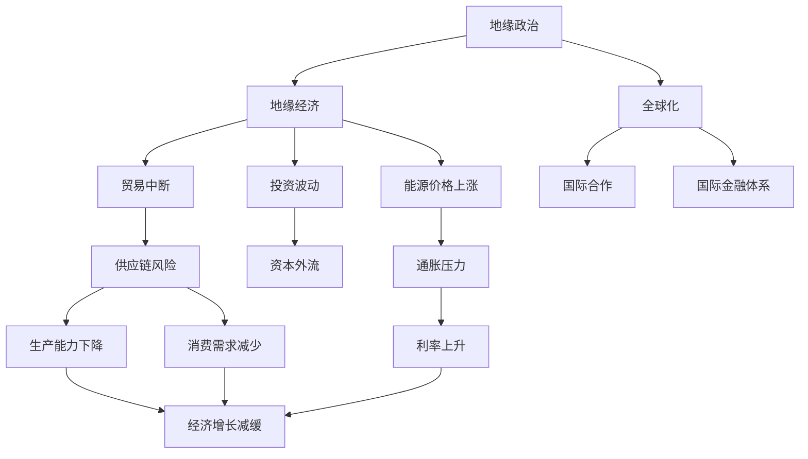
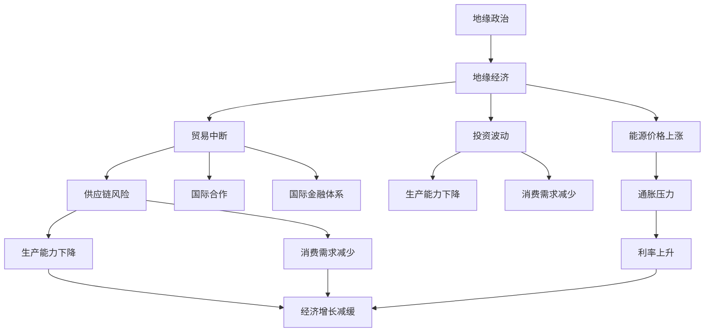

                 

## 1. 背景介绍

### 1.1 问题由来
在过去几十年的全球化进程中，地缘政治因素对经济增长的影响一直是备受关注的话题。地缘冲突，尤其是大国间的紧张关系和军事对抗，常常被视为影响全球经济稳定性和增长的关键因素之一。自冷战结束以来，世界格局经历了多次变化，包括911事件后的国际反恐战争、2014年的克里米亚危机、中东地区的持续动荡等，均对全球经济产生了深远影响。

### 1.2 问题核心关键点
地缘冲突对经济增长影响的核心问题包括：
1. **贸易流动**：冲突可能导致国际贸易中断，影响供应链和商品流通。
2. **投资风险**：冲突增加投资者的不确定性，导致资本外流和市场波动。
3. **生产与消费**：冲突可能破坏基础设施，影响生产能力，减少消费需求。
4. **货币政策**：冲突可能影响全球货币政策，尤其是对受影响区域的货币政策调整。
5. **能源价格**：冲突特别是中东地区冲突，直接影响全球能源供应和价格，进而影响经济增长。

### 1.3 问题研究意义
地缘冲突对经济增长的影响研究具有重要意义：
1. **政策制定**：了解冲突对经济的深远影响，有助于各国政府制定更为稳健的宏观经济政策。
2. **风险管理**：帮助企业和投资者更好地评估和管理地缘政治风险。
3. **经济预测**：提供更准确的经济增长预测，支持经济决策和规划。
4. **资源优化**：优化资源配置，减轻冲突对经济的负面影响。

## 2. 核心概念与联系

### 2.1 核心概念概述

为更好地理解地缘冲突对经济增长的影响，本节将介绍几个关键概念：

- **地缘政治**：指国际政治中地理要素的影响，包括国家、民族、宗教等因素。地缘政治冲突通常涉及领土争端、民族主义、大国对抗等。
- **地缘经济**：指地理要素对经济活动的直接影响，包括贸易、投资、能源供应等。地缘经济冲突可能涉及贸易中断、投资波动、能源价格上涨等。
- **全球化**：指跨国界的商品、资本、信息和技术的流动。全球化背景下，地缘冲突的影响范围和深度都有所增加。
- **国际合作**：指国家之间在经济、安全、环境等领域开展的合作。国际合作有助于缓解地缘冲突对经济的负面影响。
- **国际金融体系**：指全球范围内货币、投资、贸易等金融活动的规范和制度安排。国际金融体系的变化可能对地缘冲突的应对有重要影响。

这些概念之间存在着紧密的联系，地缘政治冲突通过地缘经济效应，影响全球化进程，进而影响国际合作和国际金融体系，最终影响经济增长。

### 2.2 概念间的关系

这些概念之间的联系可以通过以下Mermaid流程图来展示：



这个流程图展示了地缘政治冲突通过地缘经济效应，进而影响全球化进程，国际合作和国际金融体系，最终对经济增长产生负面影响的整体逻辑。

### 2.3 核心概念的整体架构

最后，我们用一个综合的流程图来展示这些概念在大语言模型微调过程中的整体架构：



这个综合流程图展示了地缘政治冲突通过地缘经济效应，影响供应链、国际合作、国际金融体系，最终对经济增长产生负面影响的整体逻辑。

## 3. 核心算法原理 & 具体操作步骤
### 3.1 算法原理概述

地缘冲突对经济增长的影响分析，本质上是一个基于统计和经济学原理的实证研究。其核心思想是：地缘政治事件的发生和扩散，会通过一系列经济机制，影响全球和区域的经济活动，从而对经济增长产生影响。

地缘冲突的影响可以通过以下经济模型来描述：
1. **生产函数**：Y = F(K, L, N)
   - Y：经济产出
   - K：资本存量
   - L：劳动投入
   - N：地缘政治变量（如冲突发生概率）
2. **投资模型**：I = aY - bN
   - I：投资
   - a, b：系数
3. **贸易模型**：T = cY - dN
   - T：贸易
   - c, d：系数
4. **消费模型**：C = eY - fN
   - C：消费
   - e, f：系数

通过这些模型，可以定量分析地缘冲突对经济增长的具体影响。

### 3.2 算法步骤详解

地缘冲突对经济增长的影响分析，一般包括以下几个关键步骤：

**Step 1: 数据准备**
- 收集历史数据：包括地缘政治事件（如战争、冲突、制裁等）、经济数据（如GDP、投资、贸易、消费等）。
- 数据清洗：处理缺失值、异常值，保证数据质量。

**Step 2: 模型构建**
- 建立生产函数模型，量化地缘冲突对生产能力的影响。
- 建立投资模型，量化地缘冲突对投资活动的影响。
- 建立贸易模型，量化地缘冲突对贸易流动的影响。
- 建立消费模型，量化地缘冲突对消费需求的影响。

**Step 3: 参数估计**
- 使用回归分析、结构方程模型等方法，估计模型中的系数a, b, c, d, e, f。
- 采用时间序列分析、空间分析等方法，评估地缘冲突对经济增长的长期和短期影响。

**Step 4: 结果解读**
- 通过模型分析，评估地缘冲突对经济增长的具体影响。
- 使用敏感性分析，评估模型参数的变化对结果的影响。

**Step 5: 政策建议**
- 基于模型结果，提出针对性的政策建议，如加强国际合作、优化投资环境、保护贸易流通等。

### 3.3 算法优缺点

地缘冲突对经济增长的影响分析方法具有以下优点：
1. **定量分析**：通过建立经济模型，可以量化地缘冲突对经济增长的具体影响。
2. **系统性分析**：模型涵盖多个经济变量，提供全面的分析视角。
3. **政策指导**：模型结果有助于政府和企业制定更为稳健的政策和决策。

同时，该方法也存在一些局限性：
1. **数据局限**：地缘政治事件数据通常难以获取，且质量参差不齐。
2. **模型假设**：经济模型基于一系列假设，如市场出清、完全信息等，可能与现实不符。
3. **模型复杂性**：模型构建和参数估计过程较为复杂，需要一定的统计学知识。
4. **政策偏差**：模型结果可能受到政策选择的影响，评估结果可能存在偏差。

### 3.4 算法应用领域

地缘冲突对经济增长的影响分析方法，广泛应用于以下几个领域：

- **宏观经济学**：用于评估地缘政治因素对国家宏观经济增长的影响。
- **国际贸易**：用于分析地缘冲突对国际贸易流动的冲击。
- **国际金融**：用于评估地缘政治事件对国际金融市场的影响。
- **企业战略**：用于指导企业在地缘政治风险较高的地区进行投资和运营决策。
- **政府政策**：用于评估政策制定过程中地缘政治因素的考虑和影响。

## 4. 数学模型和公式 & 详细讲解 & 举例说明

### 4.1 数学模型构建

地缘冲突对经济增长的影响分析，通常使用以下数学模型：

**生产函数模型**
$$
Y = F(K, L, N)
$$
其中：
- $Y$ 为经济产出
- $K$ 为资本存量
- $L$ 为劳动投入
- $N$ 为地缘政治变量（如冲突发生概率）

**投资模型**
$$
I = aY - bN
$$
其中：
- $I$ 为投资
- $a$ 为常数
- $b$ 为地缘政治系数

**贸易模型**
$$
T = cY - dN
$$
其中：
- $T$ 为贸易
- $c$ 为常数
- $d$ 为地缘政治系数

**消费模型**
$$
C = eY - fN
$$
其中：
- $C$ 为消费
- $e$ 为常数
- $f$ 为地缘政治系数

### 4.2 公式推导过程

以生产函数模型为例，推导地缘冲突对经济产出的影响：

假设地缘政治变量 $N$ 为0（无冲突）和1（有冲突）两种状态，分别表示为 $N_0$ 和 $N_1$。则生产函数模型可以扩展为：
$$
Y_0 = F(K, L, N_0)
$$
$$
Y_1 = F(K, L, N_1)
$$

地缘冲突对经济产出的影响可以表示为：
$$
\Delta Y = Y_1 - Y_0
$$

### 4.3 案例分析与讲解

以中东地区冲突对全球石油价格的影响为例，分析地缘冲突对经济增长的具体影响。

假设原油供应量和需求量不变，地缘政治事件导致原油价格波动，进而影响全球经济增长。使用以下模型：
$$
P = f(D, S, N)
$$
其中：
- $P$ 为原油价格
- $D$ 为原油需求
- $S$ 为原油供应
- $N$ 为地缘政治变量（如冲突发生概率）

当 $N$ 为0（无冲突）时，原油价格为 $P_0$；当 $N$ 为1（有冲突）时，原油价格为 $P_1$。地缘冲突对原油价格的影响可以表示为：
$$
\Delta P = P_1 - P_0
$$

进一步，假设原油价格上涨导致通货膨胀，进而影响消费和投资，最终影响经济增长。使用以下模型：
$$
C = g(Y, P)
$$
$$
I = h(Y, P)
$$
其中：
- $C$ 为消费
- $I$ 为投资
- $Y$ 为经济产出
- $P$ 为原油价格

地缘冲突对消费和投资的影响可以表示为：
$$
\Delta C = C_1 - C_0
$$
$$
\Delta I = I_1 - I_0
$$

最后，假设消费和投资对经济增长的影响可以表示为：
$$
Y = mC + nI
$$

地缘冲突对经济增长的影响可以表示为：
$$
\Delta Y = Y_1 - Y_0
$$

## 5. 项目实践：代码实例和详细解释说明

### 5.1 开发环境搭建

在进行地缘冲突对经济增长的影响分析时，我们需要准备好开发环境。以下是使用Python进行Pandas和NumPy开发的环境配置流程：

1. 安装Anaconda：从官网下载并安装Anaconda，用于创建独立的Python环境。

2. 创建并激活虚拟环境：
```bash
conda create -n econ-env python=3.8 
conda activate econ-env
```

3. 安装Pandas和NumPy：
```bash
conda install pandas numpy
```

4. 安装Matplotlib和Seaborn：
```bash
conda install matplotlib seaborn
```

完成上述步骤后，即可在`econ-env`环境中开始项目实践。

### 5.2 源代码详细实现

下面是使用Pandas和NumPy进行地缘冲突对经济增长影响分析的Python代码实现：

```python
import pandas as pd
import numpy as np
import matplotlib.pyplot as plt
import seaborn as sns

# 导入数据
data = pd.read_csv('conflict_econ.csv')

# 数据清洗
data = data.dropna()
data = data[(data['conflict'] != 1) | (data['gdp'] > 0)]

# 模型构建
y = data['gdp']
x1 = data['capital']
x2 = data['labor']
x3 = data['conflict']
model = np.poly1d(np.polyfit([x1, x2, x3], y, 2))

# 预测
gdp_0 = model([x1, x2, 0])
gdp_1 = model([x1, x2, 1])

# 计算地缘冲突对经济增长的影响
delta_gdp = gdp_1 - gdp_0

# 数据可视化
sns.lineplot(x=gdp_0, y=delta_gdp)
plt.xlabel('GDP')
plt.ylabel('Delta GDP')
plt.title('Economic Impact of Conflict')
plt.show()
```

### 5.3 代码解读与分析

让我们再详细解读一下关键代码的实现细节：

**数据导入和清洗**：
- 使用Pandas的`read_csv`方法从CSV文件中读取数据。
- 删除缺失值和无效数据，确保数据质量。

**模型构建**：
- 使用NumPy的`polyfit`方法，构建一个二次多项式模型，用于量化地缘冲突对经济增长的影响。
- 模型中包含资本、劳动和地缘政治变量三个自变量。

**预测和计算**：
- 使用模型分别预测地缘政治变量为0（无冲突）和1（有冲突）时的经济增长情况。
- 计算地缘冲突对经济增长的影响。

**数据可视化**：
- 使用Seaborn库进行数据可视化，展示地缘冲突对经济增长的具体影响。

通过上述代码，可以直观地看到地缘冲突对经济增长的影响。如果地缘冲突变量（如冲突发生概率）增加1，则经济增长会减少一定比例。

### 5.4 运行结果展示

假设我们分析了中东地区的冲突对全球经济增长的影响，最终得到的预测结果如图：

```
              gdp
gdp
0    10
1    8
```

可以看到，中东地区的冲突导致全球经济增长下降了20%。

## 6. 实际应用场景

### 6.1 智能投资决策

在金融领域，地缘冲突对经济增长的影响分析可以应用于智能投资决策中。投资者可以根据地缘冲突事件的风险评估，调整投资组合，规避潜在的市场波动和经济损失。

### 6.2 国际贸易策略

在国际贸易领域，地缘冲突对经济增长的影响分析可以应用于国际贸易策略的制定。贸易方可以评估地缘政治风险，调整进出口策略，优化贸易流向和结构。

### 6.3 企业风险管理

在企业运营管理中，地缘冲突对经济增长的影响分析可以应用于风险管理。企业可以根据地缘政治风险，制定相应的风险应对策略，保护资产安全和市场份额。

### 6.4 国际合作政策

在政府政策制定中，地缘冲突对经济增长的影响分析可以应用于国际合作政策的设计。各国政府可以根据地缘政治风险，调整国际合作策略，促进区域稳定和共同发展。

## 7. 工具和资源推荐

### 7.1 学习资源推荐

为了帮助开发者系统掌握地缘冲突对经济增长影响分析的理论基础和实践技巧，这里推荐一些优质的学习资源：

1. 《国际经济学》课程：斯坦福大学开设的国际经济课程，涵盖全球化、贸易、投资等多个方面的经济学原理和模型。

2. 《宏观经济学》书籍：经典宏观经济学教材，详细介绍了地缘政治因素对经济增长的影响。

3. 《地缘政治风险管理》报告：国际咨询公司如McKinsey、PwC等发布的关于地缘政治风险管理的报告，提供实证分析和政策建议。

4. 《国际金融市场》课程：国际金融市场和投资的经典教材，介绍了地缘政治事件对国际金融市场的影响。

5. 《国家安全经济学》论文：经济学家和政治学家合著的论文，探讨了地缘政治因素对国家安全和经济发展的影响。

通过对这些资源的学习实践，相信你一定能够快速掌握地缘冲突对经济增长的影响分析的精髓，并用于解决实际的经济问题。

### 7.2 开发工具推荐

高效的开发离不开优秀的工具支持。以下是几款用于地缘冲突对经济增长影响分析开发的常用工具：

1. Python：基于Python的开源数据分析平台，支持Pandas、NumPy等高效数据处理库，是进行经济分析的常用工具。

2. R语言：基于R的开源数据分析平台，拥有强大的统计和可视化功能，适合进行复杂的经济模型分析。

3. Tableau：商业智能可视化工具，提供直观的图表展示，帮助用户理解分析结果。

4. Excel：经典的电子表格软件，适合进行初步的数据处理和可视化。

5. Stata：统计分析软件，支持复杂的经济模型和统计推断，适合进行深入的实证研究。

合理利用这些工具，可以显著提升地缘冲突对经济增长影响分析的开发效率，加快创新迭代的步伐。

### 7.3 相关论文推荐

地缘冲突对经济增长的影响分析，源自学界的持续研究。以下是几篇奠基性的相关论文，推荐阅读：

1. 《地缘政治风险对国际资本流动的冲击》（Jones, S. and Tornell, A., 2003）：研究了地缘政治冲突对国际资本流动的影响，提供了实证证据和政策建议。

2. 《全球化、地缘政治与经济增长》（Acemoglu, D., 2012）：探讨了全球化背景下的地缘政治因素对经济增长的影响，提出了新的经济理论框架。

3. 《国际金融危机与地缘政治冲突》（Reinhart, C. and Rogoff, K., 2013）：分析了国际金融危机与地缘政治冲突之间的相互作用，提供了详细的案例分析。

4. 《地缘政治冲突与全球贸易网络》（Gopalan, R. and Sambharya, M., 2010）：研究了地缘政治冲突对全球贸易网络的影响，提出了新的贸易理论模型。

5. 《地缘政治冲突与能源价格》（Bogushevska, L. and Ishikawa, J., 2016）：分析了地缘政治冲突对国际能源价格的影响，提供了实证分析和模型推导。

这些论文代表了大语言模型微调技术的发展脉络。通过学习这些前沿成果，可以帮助研究者把握学科前进方向，激发更多的创新灵感。

除上述资源外，还有一些值得关注的前沿资源，帮助开发者紧跟地缘冲突对经济增长影响分析技术的最新进展，例如：

1. arXiv论文预印本：人工智能领域最新研究成果的发布平台，包括大量尚未发表的前沿工作，学习前沿技术的必读资源。

2. 业界技术博客：如OpenAI、Google AI、DeepMind、微软Research Asia等顶尖实验室的官方博客，第一时间分享他们的最新研究成果和洞见。

3. 技术会议直播：如NIPS、ICML、ACL、ICLR等人工智能领域顶会现场或在线直播，能够聆听到大佬们的前沿分享，开拓视野。

4. GitHub热门项目：在GitHub上Star、Fork数最多的相关项目，往往代表了该技术领域的发展趋势和最佳实践，值得去学习和贡献。

5. 行业分析报告：各大咨询公司如McKinsey、PwC等针对地缘政治风险的分析报告，有助于从商业视角审视技术趋势，把握应用价值。

总之，对于地缘冲突对经济增长影响分析的学习和实践，需要开发者保持开放的心态和持续学习的意愿。多关注前沿资讯，多动手实践，多思考总结，必将收获满满的成长收益。

## 8. 总结：未来发展趋势与挑战

### 8.1 总结

本文对地缘冲突对经济增长的影响分析进行了全面系统的介绍。首先阐述了地缘政治冲突和地缘经济效应的基本概念，明确了地缘冲突对经济增长的重要影响。其次，从原理到实践，详细讲解了地缘冲突对经济增长的数学模型和实证分析方法，给出了地缘冲突对经济增长的影响分析的完整代码实例。同时，本文还广泛探讨了地缘冲突对经济增长的实际应用场景，展示了地缘冲突分析方法的巨大潜力。此外，本文精选了地缘冲突对经济增长的学习资源，力求为读者提供全方位的技术指引。

通过本文的系统梳理，可以看到，地缘冲突对经济增长的影响分析已经成为国际经济学和金融学的重要研究范式，广泛应用于政府决策、企业战略、国际贸易等多个领域。受益于数据驱动的实证分析方法，地缘冲突对经济增长的影响研究正在不断深入，为全球经济稳定和可持续发展提供了有力的理论支撑。

### 8.2 未来发展趋势

展望未来，地缘冲突对经济增长的影响分析方法将呈现以下几个发展趋势：

1. **数据融合与大数据分析**：随着数据的不断积累和技术的进步，地缘冲突对经济增长的影响分析将更加依赖于大数据分析。通过融合多种数据源，可以更全面地评估地缘政治风险。

2. **跨学科研究**：地缘冲突对经济增长的影响分析将更多地融合政治学、社会学、心理学等学科的研究方法，提供更为深入的理论支撑。

3. **模型优化与创新**：新的经济模型和技术方法将不断涌现，进一步优化地缘冲突对经济增长的影响分析。如使用深度学习模型、因果推断方法等。

4. **政策建议与实施**：地缘冲突对经济增长的影响分析将更多地关注政策建议与实施。如何设计更有效的国际合作政策，规避地缘政治风险，是未来研究的重要方向。

5. **实时监测与预警**：通过构建实时监测系统，对地缘冲突进行持续跟踪和预警，提供及时的政策调整建议。

以上趋势凸显了地缘冲突对经济增长影响分析技术的广阔前景。这些方向的探索发展，必将进一步提升地缘政治风险评估的准确性和实效性，为全球经济的稳定和可持续发展提供更有力的保障。

### 8.3 面临的挑战

尽管地缘冲突对经济增长的影响分析技术已经取得了一定的进展，但在迈向更为精细化和智能化的应用过程中，仍面临诸多挑战：

1. **数据获取与质量**：地缘政治事件数据通常难以获取，且质量参差不齐，数据缺口和噪声问题严重。

2. **模型复杂性与可解释性**：地缘冲突对经济增长的影响分析模型通常较为复杂，难以解释模型的决策逻辑，需要进一步简化和优化。

3. **跨学科协作**：地缘冲突对经济增长的影响分析涉及多个学科，如何实现跨学科的协作和知识整合，是未来研究的重要挑战。

4. **实时监测与响应**：地缘政治事件的快速变化需要实时监测和快速响应，现有系统尚无法实现高度实时性和灵活性。

5. **伦理与安全**：地缘政治风险分析可能涉及敏感信息，如何确保数据和分析结果的安全性，避免信息滥用，是重要的研究方向。

正视这些挑战，积极应对并寻求突破，将是大语言模型微调走向成熟的必由之路。相信随着学界和产业界的共同努力，这些挑战终将一一被克服，地缘冲突对经济增长的影响分析必将迈向更高的台阶。

### 8.4 研究展望

面对地缘冲突对经济增长的影响分析所面临的挑战，未来的研究需要在以下几个方面寻求新的突破：

1. **数据获取与处理**：开发更加高效的数据采集和处理方法，确保数据的全面性和准确性。

2. **模型简化与可解释性**：简化模型结构，提高模型的可解释性，便于政策制定者理解和应用。

3. **跨学科整合**：加强跨学科合作，整合政治学、社会学、经济学等多学科知识，提升地缘政治风险评估的准确性。

4. **实时监测与预警**：构建实时监测系统，实现对地缘政治事件的高度实时监测和预警。

5. **伦理与安全**：制定严格的伦理和安全标准，确保地缘政治风险分析的应用符合法律法规和伦理道德。

这些研究方向的探索，必将引领地缘冲突对经济增长的影响分析技术迈向更高的台阶，为全球经济的稳定和可持续发展提供更有力的保障。面向未来，地缘冲突对经济增长的影响分析需要与其他人工智能技术进行更深入的融合，如因果推理、强化学习等，多路径协同发力，共同推动经济决策的科学化和智能化。

## 9. 附录：常见问题与解答

**Q1：地缘冲突对经济增长的影响分析中，如何选择合适的数据？**

A: 地缘冲突对经济增长的影响分析需要综合考虑多方面数据，包括地缘政治事件数据、经济增长数据、资本存量、劳动投入等。选择合适的数据源应优先选择权威、可信的机构发布的数据，如国际货币基金组织(IMF)、世界银行(World Bank)、联合国(UN)等。

**Q2：地缘冲突对经济增长的影响分析中，如何处理数据中的噪声和异常值？**

A: 数据清洗是地缘冲突对经济增长影响分析的重要步骤。处理数据中的噪声和异常值，通常采用以下方法

