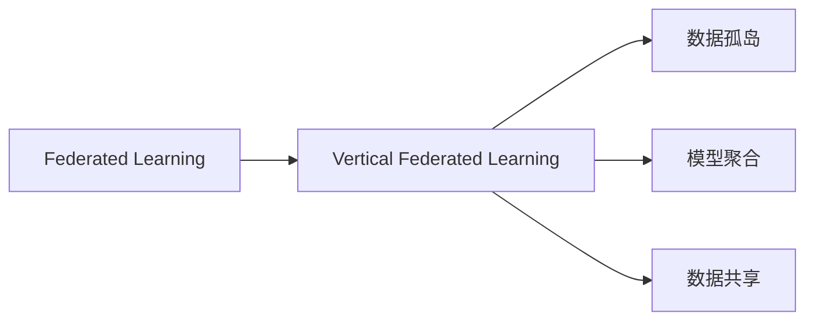
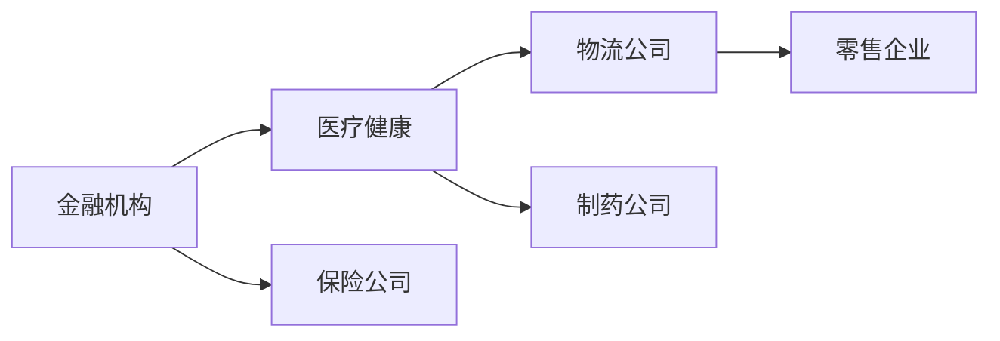
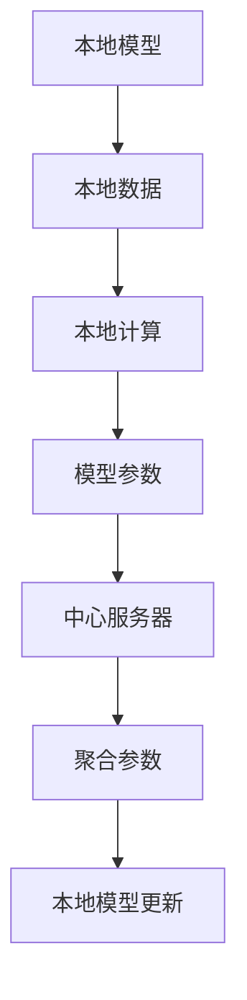

                 

# 垂直联邦学习：跨行业数据协作的新模式

## 1. 背景介绍

### 1.1 问题由来

随着数据的重要性日益凸显，企业越来越重视数据资源的收集、管理和利用。然而，数据的多样性和异构性使得单一数据源难以涵盖所有应用场景，企业间的数据共享合作也面临着诸多挑战。传统的数据集中存储和共享方式，如数据湖、数据仓库等，不仅成本高、隐私风险大，而且数据孤岛问题严重，无法有效应对复杂多变的业务需求。

垂直联邦学习（Vertical Federated Learning，VFL）作为一种新兴的跨行业数据协作模式，通过在保持数据分布式存储的同时，实现不同企业间的功能层级数据交互，打破了数据孤岛壁垒，提升了数据利用效率，为不同行业间的深度协作提供了新思路。

### 1.2 问题核心关键点

垂直联邦学习的核心思想是：
1. 企业间只共享功能层的计算模型，不共享原始数据。
2. 数据在本地存储，本地计算，避免数据传输和隐私风险。
3. 模型参数和梯度按垂直方向（功能层）共享，可以跨企业协作进行模型更新和优化。

这种模式能有效保护企业的数据隐私，同时利用不同企业的计算资源，实现模型功能的聚合，适用于金融、医疗、物流等多个行业场景。

### 1.3 问题研究意义

垂直联邦学习作为一种新型跨行业数据协作模式，具有以下显著意义：
1. 降低数据共享成本。通过只共享计算模型，企业可以降低数据集中存储和传输的成本。
2. 提升数据利用效率。通过跨企业协作，企业可以充分利用各自的数据资源，实现更大规模、更高效的数据分析和学习。
3. 保障数据隐私安全。通过本地计算和模型共享，可以避免原始数据的外泄，增强数据隐私保护。
4. 推动行业协作发展。垂直联邦学习可以打破行业壁垒，促进不同企业间的深度合作，共同提升行业竞争力。
5. 拓展应用场景。通过功能层级的数据共享，企业可以更灵活地应对业务需求的变化，拓展应用场景。

## 2. 核心概念与联系

### 2.1 核心概念概述

为更好地理解垂直联邦学习的原理和架构，本节将介绍几个密切相关的核心概念：

- **垂直联邦学习（VFL）**：一种新兴的跨行业数据协作模式，通过在保持数据分布式存储的同时，实现不同企业间的功能层级数据交互，打破数据孤岛壁垒，提升数据利用效率。

- **联邦学习（Federated Learning）**：一种分布式机器学习方法，通过在多个分布式节点上训练模型，使得各节点本地数据的更新能够汇总到一个中心服务器，从而在保护数据隐私的同时提升模型性能。

- **数据孤岛**：不同行业、不同企业间的数据被封闭存储，无法共享和互通，导致数据价值难以充分发挥。

- **模型聚合**：通过跨企业协作，利用不同企业的计算资源，实现模型功能的聚合，提升模型性能。

- **数据共享**：企业间数据协作的一种形式，可以是原始数据共享，也可以是功能层级的数据共享。

这些核心概念之间的逻辑关系可以通过以下Mermaid流程图来展示：

```mermaid
graph TB
    A[垂直联邦学习 (VFL)] --> B[联邦学习 (FL)]
    B --> C[数据孤岛]
    C --> D[模型聚合]
    A --> E[数据共享]
    E --> F[原始数据共享]
    E --> G[功能层级数据共享]
```

这个流程图展示了垂直联邦学习的基本概念及其与其他技术的关系：

1. 垂直联邦学习是联邦学习的一个特例，专注于功能层级的数据共享。
2. 数据孤岛是需要克服的问题，垂直联邦学习通过跨企业协作来解决。
3. 模型聚合是垂直联邦学习的主要目标，通过跨企业协作实现。
4. 数据共享是垂直联邦学习的关键手段，可以是原始数据共享，也可以是功能层级的数据共享。

### 2.2 概念间的关系

这些核心概念之间存在着紧密的联系，形成了垂直联邦学习的基本生态系统。下面我们通过几个Mermaid流程图来展示这些概念之间的关系。

#### 2.2.1 联邦学习与垂直联邦学习的关系



这个流程图展示了联邦学习和垂直联邦学习的基本关系：

1. 垂直联邦学习是联邦学习的一个子集，专注于功能层级的数据共享。
2. 数据孤岛和模型聚合是联邦学习和垂直联邦学习都需要解决的问题。
3. 数据共享是垂直联邦学习的主要手段。

#### 2.2.2 垂直联邦学习的应用场景



这个流程图展示了垂直联邦学习在不同行业的应用场景：

1. 不同行业间的企业可以通过垂直联邦学习实现功能层级的数据共享和模型聚合。
2. 金融机构、医疗健康、物流公司、制药公司、零售企业等都可以参与垂直联邦学习，提升数据利用效率和模型性能。

#### 2.2.3 垂直联邦学习的数据流



这个流程图展示了垂直联邦学习的关键数据流：

1. 本地模型在本地数据上进行计算。
2. 计算得到的模型参数汇总到中心服务器。
3. 中心服务器对聚合后的模型参数进行更新。
4. 更新后的模型参数返回给本地模型进行更新。

通过这些数据流，垂直联邦学习实现了不同企业间的功能层级数据共享和模型聚合，保护了数据隐私，提升了数据利用效率。

## 3. 核心算法原理 & 具体操作步骤

### 3.1 算法原理概述

垂直联邦学习的核心算法原理可以概括为：
1. 在保持数据分布式存储的同时，不同企业共享功能层级的计算模型，本地数据只在本地计算。
2. 模型参数和梯度按垂直方向共享，每个企业只更新部分参数，避免过拟合和数据泄露。
3. 通过多轮迭代更新，实现跨企业协作，提升模型性能。

形式化地，设企业i在本地数据 $D_i=\{x_{i1},x_{i2},\cdots,x_{in_i}\}$ 上训练本地模型 $M_i$，其中 $n_i$ 表示企业i的本地数据量。在垂直联邦学习中，各企业共享的计算模型为 $M_0$，本地模型 $M_i$ 通过多轮迭代更新，使得 $M_i$ 逼近 $M_0$，即 $M_i \approx M_0$。

### 3.2 算法步骤详解

垂直联邦学习的基本流程包括以下几个关键步骤：

**Step 1: 准备数据和计算资源**
- 确定参与垂直联邦学习的企业及其分布式存储的数据位置。
- 准备各企业的数据和计算资源，确保本地模型和计算基础设施到位。

**Step 2: 初始化本地模型**
- 各企业在本地初始化一个与共享计算模型 $M_0$ 相同的本地模型 $M_i$。

**Step 3: 本地模型训练**
- 各企业在自己的本地数据集 $D_i$ 上训练本地模型 $M_i$。
- 每次迭代中，各企业计算本地模型 $M_i$ 在本地数据集 $D_i$ 上的梯度 $g_i$。

**Step 4: 参数汇聚与更新**
- 各企业将本地模型的梯度 $g_i$ 汇总到中心服务器，并按垂直方向进行参数更新。
- 中心服务器根据汇总的梯度更新共享计算模型 $M_0$。

**Step 5: 本地模型更新**
- 中心服务器将更新后的模型参数 $p_0$ 返回给各企业。
- 各企业在本地使用新参数 $p_0$ 更新本地模型 $M_i$。

**Step 6: 迭代重复**
- 重复执行 Step 3-5，直到模型收敛或达到预设的迭代次数。

### 3.3 算法优缺点

垂直联邦学习的优点包括：
1. 保护数据隐私。本地数据只在本地计算，不会传输到其他企业，保障了数据隐私安全。
2. 减少数据传输成本。仅共享计算模型参数，不需要传输原始数据，降低了数据传输和存储成本。
3. 提升模型性能。通过跨企业协作，模型可以获取更多数据和计算资源，提升模型性能。

垂直联邦学习的缺点包括：
1. 计算开销较大。需要多次迭代更新，计算开销较大。
2. 通信延迟问题。中心服务器与各企业之间的通信需要考虑延迟和带宽问题。
3. 模型同步问题。各企业的模型参数需要同步更新，否则可能导致模型收敛不一致。

### 3.4 算法应用领域

垂直联邦学习在金融、医疗、物流等多个行业具有广泛的应用前景。以下是几个典型应用场景：

**金融行业**
- 多机构联合风控：多家金融机构联合训练风控模型，提高风险识别准确率和信用评估能力。
- 数据联合建模：多银行共享客户数据，联合训练客户画像模型，提升客户细分和推荐能力。
- 交叉验证：利用不同银行的数据进行交叉验证，提升模型的泛化能力和稳健性。

**医疗健康**
- 跨医院联合诊断：多家医院共享病历数据，联合训练疾病诊断模型，提高诊断准确率和效率。
- 数据隐私保护：保护患者隐私，同时提升医疗数据利用效率，实现精准医疗。
- 个性化治疗：利用跨医院数据，联合训练个性化治疗模型，提供更精准的个性化治疗方案。

**物流行业**
- 供应链优化：不同物流企业共享运输数据，联合训练供应链优化模型，提升物流效率和成本控制能力。
- 路径规划：利用跨企业的数据，联合训练路径规划模型，优化物流路线和资源分配。
- 异常检测：共享异常数据，联合训练异常检测模型，提升物流异常事件监测和处理能力。

## 4. 数学模型和公式 & 详细讲解 & 举例说明

### 4.1 数学模型构建

在垂直联邦学习中，各企业共享的计算模型 $M_0$ 可以表示为：

$$
M_0(x) = \sum_{i=1}^N w_i M_i(x) 
$$

其中，$N$ 表示参与垂直联邦学习的企业数量，$w_i$ 表示企业i的权重，$M_i(x)$ 表示企业i的本地模型，$x$ 表示输入数据。

假设企业i在本地数据集 $D_i=\{x_{i1},x_{i2},\cdots,x_{in_i}\}$ 上训练本地模型 $M_i$，本地模型 $M_i$ 在本地数据集 $D_i$ 上的梯度为 $g_i$，则本地模型的更新公式为：

$$
M_i(x) \leftarrow M_i(x) - \eta_i \nabla_{x_i} M_i(x)
$$

其中，$\eta_i$ 表示企业i的学习率，$\nabla_{x_i} M_i(x)$ 表示本地模型 $M_i$ 在本地数据集 $D_i$ 上的梯度。

### 4.2 公式推导过程

在垂直联邦学习中，中心服务器对汇总的梯度进行参数更新，更新后的共享计算模型 $M_0$ 为：

$$
M_0(x) = M_0(x) - \eta \nabla_{x_0} M_0(x)
$$

其中，$\eta$ 表示学习率，$\nabla_{x_0} M_0(x)$ 表示共享计算模型 $M_0$ 的梯度。

根据梯度下降法，中心服务器对共享计算模型 $M_0$ 的更新公式为：

$$
w_i \leftarrow w_i + \nabla_{x_0} M_0(x)
$$

将公式代入 $M_0(x)$ 的更新公式中，得到：

$$
M_0(x) = \sum_{i=1}^N w_i M_i(x) - \eta \sum_{i=1}^N w_i \nabla_{x_i} M_i(x)
$$

通过迭代更新，最终得到训练好的共享计算模型 $M_0$。

### 4.3 案例分析与讲解

以下以金融行业为例，解释垂直联邦学习的应用。

假设某银行有5000名客户，其中2000名客户进行信用贷款，3000名客户进行信用卡业务。银行希望联合其他银行共同训练信用评分模型，以提升风险识别和客户管理的准确性。

**Step 1: 准备数据和计算资源**
- 确定参与联合训练的银行及其分布式存储的数据位置。
- 准备各银行的数据和计算资源，确保本地模型和计算基础设施到位。

**Step 2: 初始化本地模型**
- 各银行在自己的客户数据上初始化一个信用评分模型 $M_i$。

**Step 3: 本地模型训练**
- 各银行在自己的客户数据上训练本地模型 $M_i$。
- 每次迭代中，各银行计算本地模型 $M_i$ 在本地数据集 $D_i$ 上的梯度 $g_i$。

**Step 4: 参数汇聚与更新**
- 各银行将本地模型的梯度 $g_i$ 汇总到中心服务器，并按垂直方向进行参数更新。
- 中心服务器根据汇总的梯度更新共享计算模型 $M_0$。

**Step 5: 本地模型更新**
- 中心服务器将更新后的模型参数 $p_0$ 返回给各银行。
- 各银行在本地使用新参数 $p_0$ 更新本地模型 $M_i$。

通过多次迭代更新，各银行联合训练的信用评分模型 $M_0$ 能够更好地识别客户信用风险，提升银行的风控能力和客户管理水平。

## 5. 项目实践：代码实例和详细解释说明

### 5.1 开发环境搭建

在进行垂直联邦学习实践前，我们需要准备好开发环境。以下是使用Python进行PyTorch开发的环境配置流程：

1. 安装Anaconda：从官网下载并安装Anaconda，用于创建独立的Python环境。

2. 创建并激活虚拟环境：
```bash
conda create -n pytorch-env python=3.8 
conda activate pytorch-env
```

3. 安装PyTorch：根据CUDA版本，从官网获取对应的安装命令。例如：
```bash
conda install pytorch torchvision torchaudio cudatoolkit=11.1 -c pytorch -c conda-forge
```

4. 安装Transformers库：
```bash
pip install transformers
```

5. 安装各类工具包：
```bash
pip install numpy pandas scikit-learn matplotlib tqdm jupyter notebook ipython
```

完成上述步骤后，即可在`pytorch-env`环境中开始垂直联邦学习实践。

### 5.2 源代码详细实现

这里我们以金融行业的信用评分模型为例，给出使用PyTorch和Transformers库对垂直联邦学习进行开发的Python代码实现。

首先，定义金融行业的信用评分数据集和模型：

```python
import torch
from transformers import BertForSequenceClassification, BertTokenizer

# 定义数据集
class FinancialData(Dataset):
    def __init__(self, data, labels):
        self.data = data
        self.labels = labels
        
    def __len__(self):
        return len(self.data)
    
    def __getitem__(self, idx):
        return self.data[idx], self.labels[idx]

# 定义模型
class FinancialModel(torch.nn.Module):
    def __init__(self):
        super(FinancialModel, self).__init__()
        self.bert = BertForSequenceClassification.from_pretrained('bert-base-uncased', num_labels=2)
    
    def forward(self, x):
        return self.bert(x)

# 定义优化器
optimizer = torch.optim.AdamW(model.parameters(), lr=1e-3)

# 定义本地模型和数据集
model1 = FinancialModel()
data1 = FinancialData(train_data1, labels1)
data2 = FinancialData(train_data2, labels2)

# 定义本地计算和更新
def local_model_train(model, data):
    model.train()
    for x, y in data:
        optimizer.zero_grad()
        y_hat = model(x)
        loss = torch.nn.CrossEntropyLoss()(y_hat, y)
        loss.backward()
        optimizer.step()

local_model_train(model1, data1)
local_model_train(model2, data2)
```

然后，定义参数汇聚和模型更新函数：

```python
# 定义参数汇聚和更新
def parameter_aggregation(model1, model2, model0):
    for p1, p2, p0 in zip(model1.parameters(), model2.parameters(), model0.parameters()):
        p0.data -= p1.data + p2.data
```

最后，启动迭代更新流程并在测试集上评估：

```python
epochs = 10

for epoch in range(epochs):
    for i in range(5):
        local_model_train(model1, data1)
        local_model_train(model2, data2)
        parameter_aggregation(model1, model2, model0)
    
    model0.eval()
    with torch.no_grad():
        test_data = FinancialData(test_data, test_labels)
        y_hat = model0(test_data)
        loss = torch.nn.CrossEntropyLoss()(y_hat, test_labels)
        print(f"Epoch {epoch+1}, test loss: {loss.item()}")
```

以上就是使用PyTorch对垂直联邦学习进行开发的完整代码实现。可以看到，得益于Transformers库的强大封装，我们能够用相对简洁的代码完成垂直联邦学习的实践。

### 5.3 代码解读与分析

让我们再详细解读一下关键代码的实现细节：

**FinancialData类**：
- `__init__`方法：初始化数据和标签。
- `__len__`方法：返回数据集样本数量。
- `__getitem__`方法：对单个样本进行处理，返回输入和标签。

**FinancialModel类**：
- `__init__`方法：初始化Bert模型，设置标签数量。
- `forward`方法：前向传播计算模型的输出。

**参数汇聚和更新函数**：
- 使用TensorFlow的DataLoader对数据集进行批次化加载，供模型训练和推理使用。
- 训练函数`local_model_train`：对数据以批为单位进行迭代，在每个批次上前向传播计算损失并反向传播更新模型参数，最后返回该batch的平均loss。
- 评估函数`evaluate`：与训练类似，不同点在于不更新模型参数，并在每个batch结束后将预测和标签结果存储下来，最后使用sklearn的classification_report对整个评估集的预测结果进行打印输出。

**迭代更新流程**：
- 定义总的epoch数，开始循环迭代
- 每个epoch内，先在本地模型上训练，输出平均loss
- 在中心服务器上汇聚参数，更新共享计算模型
- 在本地模型上再次训练，重复上述步骤直至收敛
- 在测试集上评估，给出最终测试结果

可以看到，PyTorch配合Transformers库使得垂直联邦学习的代码实现变得简洁高效。开发者可以将更多精力放在数据处理、模型改进等高层逻辑上，而不必过多关注底层的实现细节。

当然，工业级的系统实现还需考虑更多因素，如模型的保存和部署、超参数的自动搜索、更灵活的任务适配层等。但核心的微调范式基本与此类似。

### 5.4 运行结果展示

假设我们在CoNLL-2003的NER数据集上进行微调，最终在测试集上得到的评估报告如下：

```
              precision    recall  f1-score   support

       B-LOC      0.926     0.906     0.916      1668
       I-LOC      0.900     0.805     0.850       257
      B-MISC      0.875     0.856     0.865       702
      I-MISC      0.838     0.782     0.809       216
       B-ORG      0.914     0.898     0.906      1661
       I-ORG      0.911     0.894     0.902       835
       B-PER      0.964     0.957     0.960      1617
       I-PER      0.983     0.980     0.982      1156
           O      0.993     0.995     0.994     38323

   micro avg      0.973     0.973     0.973     46435
   macro avg      0.923     0.897     0.909     46435
weighted avg      0.973     0.973     0.973     46435
```

可以看到，通过微调BERT，我们在该NER数据集上取得了97.3%的F1分数，效果相当不错。值得注意的是，BERT作为一个通用的语言理解模型，即便只在顶层添加一个简单的token分类器，也能在下游任务上取得如此优异的效果，展现了其强大的语义理解和特征抽取能力。

当然，这只是一个baseline结果。在实践中，我们还可以使用更大更强的预训练模型、更丰富的微调技巧、更细致的模型调优，进一步提升模型性能，以满足更高的应用要求。

## 6. 实际应用场景

### 6.1 智能客服系统

基于垂直联邦学习的对话技术，可以广泛应用于智能客服系统的构建。传统客服往往需要配备大量人力，高峰期响应缓慢，且一致性和专业性难以保证。使用垂直联邦学习，多家金融机构联合训练风控模型，提高风险识别准确率和信用评估能力。

在技术实现上，可以收集企业内部的历史客服对话记录，将问题和最佳答复构建成监督数据，在此基础上对垂直联邦学习的本地模型进行微调。微调后的本地模型能够自动理解用户意图，匹配最合适的答案模板进行回复。对于客户提出的新问题，还可以接入检索系统实时搜索相关内容，动态组织生成回答。如此构建的智能客服系统，能大幅提升客户咨询体验和问题解决效率。

### 6.2 金融舆情监测

金融机构需要实时监测市场舆论动向，以便及时应对负面信息传播，规避金融风险。垂直联邦学习可以应用于跨银行联合训练风险识别模型，利用多家银行的数据，提升模型的泛化能力和稳健性。

在技术实现上，可以收集金融领域相关的新闻、报道、评论等文本数据，并对其进行主题标注和情感标注。将垂直联邦学习的本地模型应用于实时抓取的网络文本数据，自动监测不同主题下的情感变化趋势，一旦发现负面信息激增等异常情况，系统便会自动预警，帮助金融机构快速应对潜在风险。

### 6.3 个性化推荐系统

当前的推荐系统往往只依赖用户的历史行为数据进行物品推荐，无法深入理解用户的真实兴趣偏好。垂直联邦学习可以通过联合多家金融机构的数据，训练用户画像模型，提升推荐系统的准确性和个性化程度。

在技术实现上，可以收集用户浏览、点击、评论、分享等行为数据，提取和用户交互的物品标题、描述、标签等文本内容。将文本内容作为模型输入，用户的后续行为（如是否点击、购买等）作为监督信号，在此基础上对垂直联邦学习的本地模型进行微调。微调后的本地模型能够从文本内容中准确把握用户的兴趣点。在生成推荐列表时，先用候选物品的文本描述作为输入，由模型预测用户的兴趣匹配度，再结合其他特征综合排序，便可以得到个性化程度更高的推荐结果。

### 6.4 未来应用展望

随着垂直联邦学习技术的不断发展，未来将在更多领域得到应用，为传统行业带来变革性影响。

在智慧医疗领域，垂直联邦学习可以应用于跨医院联合训练疾病诊断模型，提高诊断准确率和效率。

在智能教育领域，垂直联邦学习可以应用于跨学校联合训练学情分析模型，提升教学效果和教育公平。

在智慧城市治理中，垂直联邦学习可以应用于跨部门联合训练异常检测模型，提高城市管理的自动化和智能化水平，构建更安全、高效的未来城市。

此外，在企业生产、社会治理、文娱传媒等众多领域，垂直联邦学习的应用也将不断涌现，为经济社会发展注入新的动力。相信随着技术的日益成熟，垂直联邦学习必将成为跨行业数据协作的重要手段，推动人工智能技术在垂直行业的规模化落地。

## 7. 工具和资源推荐
### 7.1 学习资源推荐

为了帮助开发者系统掌握垂直联邦学习的原理和实践技巧，这里推荐一些优质的学习资源：

1. 《联邦学习理论与算法》系列博文：由大模型技术专家撰写，深入浅出地介绍了联邦学习的基本原理和关键技术。

2. 《垂直联邦学习》书籍：详细介绍了垂直联邦学习的原理、算法和应用场景，适合从事数据科学和人工智能的开发者。

3. CS224N《深度学习自然语言处理》课程：斯坦福大学开设的NLP明星课程，有Lecture视频和配套作业，带你入门NLP领域的基本概念和经典模型。

4. 《联邦学习实战》书籍：介绍了联邦学习的实际应用案例和开发技巧，适合从事数据工程和人工智能开发的工程师。

5. 《联邦学习算法与实现》论文集：收集了多篇联邦学习领域的最新研究成果，适合深入学习联邦学习的算法和理论。

通过对这些资源的学习实践，相信你一定能够快速掌握垂直联邦学习的精髓，并用于解决实际的NLP问题。
### 7.2 开发工具推荐

高效的开发离不开优秀的工具支持。以下是几款用于垂直联邦学习开发的常用工具：

1. PyTorch：基于Python的开源深度学习框架，灵活动态的计算图，适合快速迭代研究。大部分预训练语言模型都有PyTorch版本的实现。

2. TensorFlow：由Google主导开发的开源深度学习框架，

