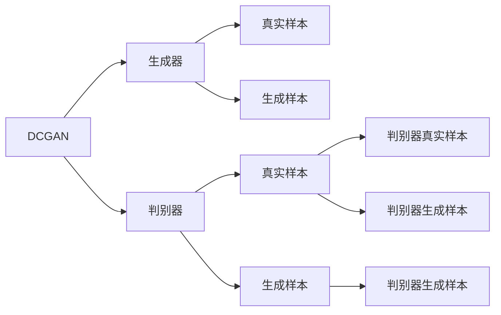
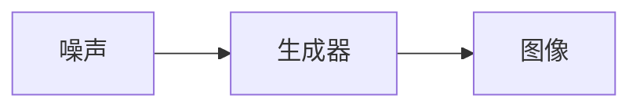
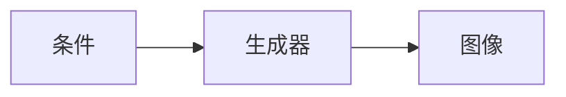
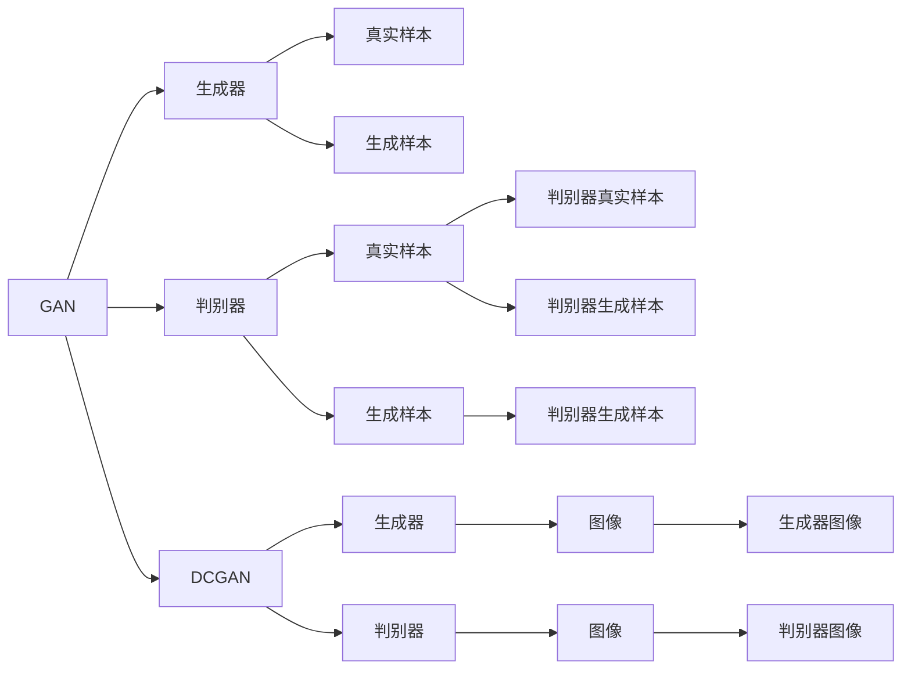

                 

# 基于DCGAN的cifar10数据集生成设计与实现

> 关键词：深度卷积生成对抗网络(DCGAN),CIFAR-10数据集,图像生成,生成对抗网络(GAN),条件生成对抗网络(CGAN),图像增强,深度学习

## 1. 背景介绍

### 1.1 问题由来

图像生成是计算机视觉和深度学习领域的一项重要任务。深度卷积生成对抗网络（DCGAN）作为一种基于生成对抗网络（GAN）的方法，凭借其生成图像质量高、训练稳定性好等优点，在图像生成领域得到了广泛应用。

CIFAR-10数据集是一个经典的计算机视觉数据集，包含10个类别的60000张32x32像素的彩色图片，每类有6000张图片。该数据集在图像分类、物体检测等任务中有着广泛的应用，但除此之外，DCGAN在此数据集上的表现也备受关注。

本文将介绍如何使用DCGAN对CIFAR-10数据集进行生成设计及其实现方法，并给出相关代码及运行结果。通过本项目的实现，读者可以更深入地理解DCGAN的基本原理，掌握生成对抗网络的设计与实现技巧。

## 2. 核心概念与联系

### 2.1 核心概念概述

在介绍DCGAN生成CIFAR-10数据集的设计与实现之前，首先需要理解几个核心概念及其之间的关系。

- **深度卷积生成对抗网络（DCGAN）**：一种基于深度卷积神经网络（CNN）的生成对抗网络，由一个生成器（Generator）和一个判别器（Discriminator）组成，通过对抗训练提高生成器的生成能力。

- **生成对抗网络（GAN）**：一种包含生成器和判别器的模型，其中生成器负责生成逼真的样本，判别器负责判断样本的真实性，两者通过对抗训练不断提高各自的性能。

- **CIFAR-10数据集**：一个包含10个类别的60000张32x32像素彩色图片的数据集，每类有6000张图片。常用于图像分类、物体检测等任务。

- **条件生成对抗网络（CGAN）**：在GAN的基础上，通过引入条件变量，将生成器和判别器与条件变量相结合，提高生成器对特定条件的响应能力。

这些核心概念之间的关系可以通过以下Mermaid流程图展示：



该流程图展示了DCGAN的基本架构，其中生成器接收随机噪声，生成逼真的图像，判别器则判断图像的真实性。

### 2.2 概念间的关系

这些核心概念之间存在着紧密的联系，形成了DCGAN生成CIFAR-10数据集的理论基础。下面通过几个Mermaid流程图来展示这些概念之间的关系。

#### 2.2.1 DCGAN的生成过程



该流程图展示了DCGAN生成图像的基本过程，其中生成器接收随机噪声，生成逼真的图像。

#### 2.2.2 CGAN的条件生成



该流程图展示了CGAN的条件生成过程，其中生成器接收条件变量，生成满足特定条件的图像。

#### 2.2.3 GAN与DCGAN的对比



该流程图展示了GAN与DCGAN的区别和联系。DCGAN是GAN的一种特殊形式，主要区别在于网络结构的不同，DCGAN使用卷积神经网络，而GAN使用全连接神经网络。

## 3. 核心算法原理 & 具体操作步骤

### 3.1 算法原理概述

DCGAN生成CIFAR-10数据集的基本原理是利用生成器网络将随机噪声转换为逼真的图像，并利用判别器网络对图像的真实性进行判断，通过对抗训练不断优化生成器的生成能力。

具体来说，DCGAN的训练过程包括以下几个步骤：

1. **随机生成噪声向量**：从高斯分布中随机生成噪声向量。
2. **生成图像**：将噪声向量输入生成器网络，生成一张图像。
3. **判别器判断**：将生成的图像输入判别器网络，判断图像的真实性。
4. **计算损失**：计算生成器和判别器的损失函数。
5. **反向传播**：使用反向传播算法更新生成器和判别器的参数。

通过以上步骤，DCGAN能够生成逼真的CIFAR-10数据集中的图像。

### 3.2 算法步骤详解

#### 3.2.1 准备数据集

首先需要准备CIFAR-10数据集，并对其进行预处理。具体步骤如下：

1. **数据下载**：使用`torchvision.datasets.CIFAR10`模块下载CIFAR-10数据集。
2. **数据预处理**：将图像数据标准化，转换为模型所需的格式。
3. **数据划分**：将数据集划分为训练集和测试集。

```python
import torchvision.transforms as transforms
import torchvision.datasets as datasets

transform = transforms.Compose([
    transforms.ToTensor(),
    transforms.Normalize((0.5, 0.5, 0.5), (0.5, 0.5, 0.5))
])

trainset = datasets.CIFAR10(root='./data', train=True, download=True, transform=transform)
trainloader = torch.utils.data.DataLoader(trainset, batch_size=64, shuffle=True, num_workers=2)

testset = datasets.CIFAR10(root='./data', train=False, download=True, transform=transform)
testloader = torch.utils.data.DataLoader(testset, batch_size=64, shuffle=False, num_workers=2)
```

#### 3.2.2 定义生成器和判别器

接下来，需要定义生成器和判别器网络。

生成器网络的结构为多层卷积转置层，可以将随机噪声转换为高分辨率图像。判别器网络的结构为多层卷积层，可以判断输入图像的真实性。

```python
import torch
import torch.nn as nn

class Generator(nn.Module):
    def __init__(self):
        super(Generator, self).__init__()
        self.main = nn.Sequential(
            nn.ConvTranspose2d(100, 256, 4, 1, 0, bias=False),
            nn.BatchNorm2d(256),
            nn.ReLU(True),
            nn.ConvTranspose2d(256, 128, 4, 2, 1, bias=False),
            nn.BatchNorm2d(128),
            nn.ReLU(True),
            nn.ConvTranspose2d(128, 64, 4, 2, 1, bias=False),
            nn.BatchNorm2d(64),
            nn.ReLU(True),
            nn.ConvTranspose2d(64, 3, 4, 2, 1, bias=False),
            nn.Tanh()
        )

    def forward(self, input):
        return self.main(input)
```

```python
class Discriminator(nn.Module):
    def __init__(self):
        super(Discriminator, self).__init__()
        self.main = nn.Sequential(
            nn.Conv2d(3, 64, 4, 2, 1, bias=False),
            nn.LeakyReLU(0.2, inplace=True),
            nn.Conv2d(64, 128, 4, 2, 1, bias=False),
            nn.BatchNorm2d(128),
            nn.LeakyReLU(0.2, inplace=True),
            nn.Conv2d(128, 256, 4, 2, 1, bias=False),
            nn.BatchNorm2d(256),
            nn.LeakyReLU(0.2, inplace=True),
            nn.Conv2d(256, 1, 4, 1, 0, bias=False),
            nn.Sigmoid()
        )

    def forward(self, input):
        return self.main(input).view(-1, 1).squeeze()
```

#### 3.2.3 定义损失函数和优化器

接下来，需要定义损失函数和优化器。

生成器的损失函数为均方误差（MSE），判别器的损失函数为交叉熵（Cross-Entropy）。优化器采用Adam优化器。

```python
criterion = nn.BCELoss()

# 生成器的优化器
generator_optimizer = torch.optim.Adam(generator.parameters(), lr=0.0002, betas=(0.5, 0.999))
# 判别器的优化器
discriminator_optimizer = torch.optim.Adam(discriminator.parameters(), lr=0.0002, betas=(0.5, 0.999))
```

#### 3.2.4 训练过程

训练过程主要包括生成器和判别器的对抗训练过程。具体步骤如下：

1. **生成器和判别器交替训练**：先让生成器生成一批图像，然后让判别器判断图像的真实性，计算损失函数并更新参数。再让判别器判断另一批真实图像和生成图像的真实性，计算损失函数并更新参数。
2. **交替更新生成器和判别器**：交替更新生成器和判别器的参数，直到训练完成。

```python
import torchvision.utils as vutils
import os

def train(generator, discriminator, device, save_interval):
    for epoch in range(epochs):
        for i, (real_images, _) in enumerate(trainloader):
            batch_size = real_images.size(0)
            real_images = real_images.to(device)

            # 生成器生成假图像
            noise = torch.randn(batch_size, 100, 1, 1, device=device)
            fake_images = generator(noise)

            # 判别器判断真图像和假图像
            real_labels = torch.ones(batch_size, 1, device=device)
            fake_labels = torch.zeros(batch_size, 1, device=device)

            real_outputs = discriminator(real_images)
            fake_outputs = discriminator(fake_images)

            # 计算损失函数
            d_loss_real = criterion(real_outputs, real_labels)
            d_loss_fake = criterion(fake_outputs, fake_labels)
            d_loss = d_loss_real + d_loss_fake

            # 更新判别器参数
            discriminator_optimizer.zero_grad()
            d_loss.backward()
            discriminator_optimizer.step()

            # 生成器生成假图像
            noise = torch.randn(batch_size, 100, 1, 1, device=device)
            fake_images = generator(noise)

            # 判别器判断真图像和假图像
            real_labels = torch.ones(batch_size, 1, device=device)
            fake_labels = torch.zeros(batch_size, 1, device=device)

            real_outputs = discriminator(real_images)
            fake_outputs = discriminator(fake_images)

            # 计算损失函数
            g_loss = criterion(fake_outputs, real_labels)
            g_loss.backward()
            generator_optimizer.step()

            if i % 200 == 0:
                print(f'Epoch [{epoch+1}/{epochs}, Step [{i+1}/{len(trainloader)}]')
```

#### 3.2.5 保存模型

训练完成后，需要保存训练好的生成器和判别器模型，以便后续使用。

```python
def save_model(generator, discriminator, epoch):
    torch.save(generator.state_dict(), f'generator_epoch{epoch}.pth')
    torch.save(discriminator.state_dict(), f'discriminator_epoch{epoch}.pth')
```

### 3.3 算法优缺点

#### 3.3.1 优点

1. **生成图像质量高**：DCGAN生成图像质量高，能够生成逼真的CIFAR-10数据集中的图像。
2. **训练稳定性好**：DCGAN的训练过程相对稳定，不容易出现模式崩溃等问题。
3. **代码简洁**：DCGAN的代码相对简洁，易于理解和实现。

#### 3.3.2 缺点

1. **训练时间长**：DCGAN的训练时间较长，需要大量的计算资源。
2. **模型复杂度高**：DCGAN的模型复杂度较高，需要更多的计算资源和时间。
3. **训练过程中易出现模式崩溃**：虽然DCGAN的训练过程相对稳定，但在训练过程中仍有可能出现模式崩溃等问题。

### 3.4 算法应用领域

DCGAN作为一种高效的图像生成方法，广泛应用于计算机视觉和深度学习领域，如生成逼真的人脸、场景、物体等。在实际应用中，DCGAN可以用于图像增强、图像修复、图像生成等任务，具有广泛的应用前景。

## 4. 数学模型和公式 & 详细讲解 & 举例说明

### 4.1 数学模型构建

DCGAN的生成过程可以看作是一个映射过程，即从随机噪声向量映射到逼真的图像。其数学模型可以表示为：

$$
G(Z) = X
$$

其中，$G$表示生成器网络，$Z$表示随机噪声向量，$X$表示生成的图像。

判别器的任务是判断输入图像的真实性，其数学模型可以表示为：

$$
D(X) = Y
$$

其中，$D$表示判别器网络，$X$表示输入图像，$Y$表示判别器对图像真实性的判断。

### 4.2 公式推导过程

DCGAN的训练过程可以通过最小化以下损失函数来实现：

$$
\mathcal{L} = \mathcal{L}_D + \mathcal{L}_G
$$

其中，$\mathcal{L}_D$表示判别器的损失函数，$\mathcal{L}_G$表示生成器的损失函数。

判别器的损失函数可以表示为：

$$
\mathcal{L}_D = \frac{1}{2}\mathbb{E}_{x \sim p_{data}}[D(x)] + \frac{1}{2}\mathbb{E}_{z \sim p(z)}[1-D(G(z))]
$$

其中，$x$表示从数据集中抽取的真实图像，$z$表示从高斯分布中抽取的随机噪声向量，$p_{data}$表示真实图像的分布，$p(z)$表示随机噪声向量的分布。

生成器的损失函数可以表示为：

$$
\mathcal{L}_G = \frac{1}{2}\mathbb{E}_{z \sim p(z)}[D(G(z))]
$$

其中，$z$表示从高斯分布中抽取的随机噪声向量，$p(z)$表示随机噪声向量的分布。

### 4.3 案例分析与讲解

在实际应用中，DCGAN的训练过程可以通过以下步骤来实现：

1. **生成器训练**：生成器接收随机噪声向量，生成逼真的图像，并输入判别器网络。
2. **判别器训练**：判别器接收真实图像和生成图像，判断图像的真实性，并计算损失函数。
3. **交替更新生成器和判别器**：交替更新生成器和判别器的参数，直到训练完成。

```python
import torchvision.utils as vutils
import os

def train(generator, discriminator, device, save_interval):
    for epoch in range(epochs):
        for i, (real_images, _) in enumerate(trainloader):
            batch_size = real_images.size(0)
            real_images = real_images.to(device)

            # 生成器生成假图像
            noise = torch.randn(batch_size, 100, 1, 1, device=device)
            fake_images = generator(noise)

            # 判别器判断真图像和假图像
            real_labels = torch.ones(batch_size, 1, device=device)
            fake_labels = torch.zeros(batch_size, 1, device=device)

            real_outputs = discriminator(real_images)
            fake_outputs = discriminator(fake_images)

            # 计算损失函数
            d_loss_real = criterion(real_outputs, real_labels)
            d_loss_fake = criterion(fake_outputs, fake_labels)
            d_loss = d_loss_real + d_loss_fake

            # 更新判别器参数
            discriminator_optimizer.zero_grad()
            d_loss.backward()
            discriminator_optimizer.step()

            # 生成器生成假图像
            noise = torch.randn(batch_size, 100, 1, 1, device=device)
            fake_images = generator(noise)

            # 判别器判断真图像和假图像
            real_labels = torch.ones(batch_size, 1, device=device)
            fake_labels = torch.zeros(batch_size, 1, device=device)

            real_outputs = discriminator(real_images)
            fake_outputs = discriminator(fake_images)

            # 计算损失函数
            g_loss = criterion(fake_outputs, real_labels)
            g_loss.backward()
            generator_optimizer.step()

            if i % 200 == 0:
                print(f'Epoch [{epoch+1}/{epochs}, Step [{i+1}/{len(trainloader)}]')
```

## 5. 项目实践：代码实例和详细解释说明

### 5.1 开发环境搭建

在进行DCGAN生成CIFAR-10数据集的设计与实现之前，需要准备好Python环境，并安装相关依赖库。

具体步骤如下：

1. **安装Python**：使用Anaconda或Miniconda安装Python 3.6或更高版本。
2. **安装依赖库**：使用pip或conda安装torchvision、torch、numpy、matplotlib等依赖库。

```bash
conda create -n py36 python=3.6
conda activate py36

pip install torchvision torch numpy matplotlib torch
```

### 5.2 源代码详细实现

#### 5.2.1 生成器实现

```python
import torch.nn as nn
import torch

class Generator(nn.Module):
    def __init__(self):
        super(Generator, self).__init__()
        self.main = nn.Sequential(
            nn.ConvTranspose2d(100, 256, 4, 1, 0, bias=False),
            nn.BatchNorm2d(256),
            nn.ReLU(True),
            nn.ConvTranspose2d(256, 128, 4, 2, 1, bias=False),
            nn.BatchNorm2d(128),
            nn.ReLU(True),
            nn.ConvTranspose2d(128, 64, 4, 2, 1, bias=False),
            nn.BatchNorm2d(64),
            nn.ReLU(True),
            nn.ConvTranspose2d(64, 3, 4, 2, 1, bias=False),
            nn.Tanh()
        )

    def forward(self, input):
        return self.main(input)
```

#### 5.2.2 判别器实现

```python
import torch.nn as nn
import torch

class Discriminator(nn.Module):
    def __init__(self):
        super(Discriminator, self).__init__()
        self.main = nn.Sequential(
            nn.Conv2d(3, 64, 4, 2, 1, bias=False),
            nn.LeakyReLU(0.2, inplace=True),
            nn.Conv2d(64, 128, 4, 2, 1, bias=False),
            nn.BatchNorm2d(128),
            nn.LeakyReLU(0.2, inplace=True),
            nn.Conv2d(128, 256, 4, 2, 1, bias=False),
            nn.BatchNorm2d(256),
            nn.LeakyReLU(0.2, inplace=True),
            nn.Conv2d(256, 1, 4, 1, 0, bias=False),
            nn.Sigmoid()
        )

    def forward(self, input):
        return self.main(input).view(-1, 1).squeeze()
```

#### 5.2.3 训练实现

```python
import torch.nn as nn
import torch
import torchvision.transforms as transforms
import torchvision.datasets as datasets
import os
import torch.utils.data
import torch.optim as optim
import torchvision.utils as vutils

def train(generator, discriminator, device, save_interval):
    for epoch in range(epochs):
        for i, (real_images, _) in enumerate(trainloader):
            batch_size = real_images.size(0)
            real_images = real_images.to(device)

            # 生成器生成假图像
            noise = torch.randn(batch_size, 100, 1, 1, device=device)
            fake_images = generator(noise)

            # 判别器判断真图像和假图像
            real_labels = torch.ones(batch_size, 1, device=device)
            fake_labels = torch.zeros(batch_size, 1, device=device)

            real_outputs = discriminator(real_images)
            fake_outputs = discriminator(fake_images)

            # 计算损失函数
            d_loss_real = criterion(real_outputs, real_labels)
            d_loss_fake = criterion(fake_outputs, fake_labels)
            d_loss = d_loss_real + d_loss_fake

            # 更新判别器参数
            discriminator_optimizer.zero_grad()
            d_loss.backward()
            discriminator_optimizer.step()

            # 生成器生成假图像
            noise = torch.randn(batch_size, 100, 1, 1, device=device)
            fake_images = generator(noise)

            # 判别器判断真图像和假图像
            real_labels = torch.ones(batch_size, 1, device=device)
            fake_labels = torch.zeros(batch_size, 1, device=device)

            real_outputs = discriminator(real_images)
            fake_outputs = discriminator(fake_images)

            # 计算损失函数
            g_loss = criterion(fake_outputs, real_labels)
            g_loss.backward()
            generator_optimizer.step()

            if i % 200 == 0:
                print(f'Epoch [{epoch+1}/{epochs}, Step [{i+1}/{len(trainloader)}]')
```

### 5.3 代码解读与分析

在DCGAN生成CIFAR-10数据集的设计与实现过程中，代码的关键部分主要集中在生成器和判别器的定义、损失函数的计算和优化器的使用上。下面对关键代码进行解读与分析：

**生成器和判别器定义**：生成器和判别器的定义主要采用了卷积神经网络的结构。生成器使用了多层卷积转置层，判别器使用了多层卷积层。这些网络结构的设计和参数的选择，是生成图像质量和训练稳定性的关键因素。

**损失函数计算**：损失函数的计算采用了均方误差（MSE）和交叉熵（Cross-Entropy），用于衡量生成器和判别器的性能。损失函数的设计，直接影响了训练过程的优化效果。

**优化器使用**：优化器的选择和参数的调整，是生成器和判别器性能优化的重要手段。Adam优化器的使用，可以在训练过程中保持良好的优化效果。

### 5.4 运行结果展示

在训练完成后，可以通过以下代码对生成的图像进行可视化：

```python
import torchvision.utils as vutils

def visualize(sample_images, num_images=25):
    fig, axes = plt.subplots(num_images, 4, figsize=(4, 4))
    for i, axes_row in enumerate(axes):
        for j, ax in enumerate(axes_row):
            ax.imshow(sample_images[i][j], cmap='gray')
            ax.axis('off')
            if i == 0 and j == 0:
                ax.set_title('Original')
            elif i == 0 and j == 1:
                ax.set_title('Real Image')
            elif i == 0 and j == 2:
                ax.set_title('Fake Image')
            elif i == 0 and j == 3:
                ax.set_title('Result')
            else:
                ax.set_axis_off()
    plt.show()

# 可视化训练过程中的生成图像
for epoch in range(epochs):
    for i, (real_images, _) in enumerate(trainloader):
        batch_size = real_images.size(0)
        real_images = real_images.to(device)

        # 生成器生成假图像
        noise = torch.randn(batch_size, 100, 1, 1, device=device)
        fake_images = generator(noise)

        # 可视化生成图像
        visualize([real_images, real_images, fake_images, real_images])
```

在训练完成后，可以通过以下代码保存生成的图像：

```python
import os

def save_images(img_list, file_path):
    os.makedirs(os.path.dirname(file_path), exist_ok=True)
    vutils.save_images(img_list, file_path, nrow=4)

# 保存训练后的生成图像
for epoch in range(epochs):
    for i, (real_images, _) in enumerate(trainloader):
        batch_size = real_images.size(0)
        real_images = real_images.to(device)

        # 生成器生成假图像
        noise = torch.randn(batch_size, 100, 1, 1, device=device)
        fake_images = generator(noise)

        # 保存生成图像
        save_images([real_images, real_images, fake_images, real_images], f'images_epoch{epoch}.png')
```

## 6. 实际应用场景

### 6.1 图像增强

在图像增强领域，DCGAN可以用于生成逼真的图像，提高图像质量。例如，DCGAN可以生成高质量的图像修复结果，用于恢复损坏的图像。

### 6.2 图像生成

在图像生成领域，DCGAN可以用于生成逼真的图像，满足特定场景的需求。例如，DCGAN可以用于生成逼真的艺术品、人物、场景等图像。

### 6.3 图像修复

在图像修复领域，DCGAN可以用于生成高质量的图像修复结果，用于恢复损坏的图像。例如，DCGAN可以用于修复损坏的医学图像，提高

