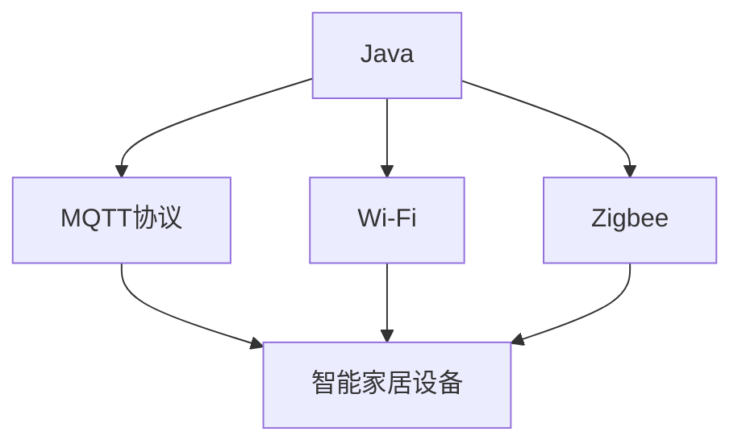

                 

# 基于Java的智能家居设计：Java在无线智能家居通信技术中的应用

> 关键词：Java, 智能家居, 通信技术, MQTT协议, Wi-Fi, Zigbee

## 1. 背景介绍

### 1.1 问题由来
随着科技的迅速发展，智能家居系统已逐步进入人们的日常生活中，成为家庭生活的一部分。然而，当前智能家居系统的构建和维护仍面临一些挑战，如系统集成复杂、数据管理繁琐、设备通信协议多等。为了更好地解决这些问题，有必要研究一种高效、通用的无线智能家居通信技术。

### 1.2 问题核心关键点
在智能家居系统中，设备间的通信是关键环节。理想的通信技术应满足以下要求：
- 高可靠性：保证数据传输的准确性和稳定性。
- 高效性：支持大规模设备连接和数据传输，降低网络延迟。
- 安全性：确保数据传输过程中的隐私和安全。
- 标准化：与主流智能家居标准兼容，易于系统集成。

基于上述需求，本文重点介绍Java在无线智能家居通信技术中的应用，重点探讨了MQTT协议在智能家居系统中的应用。

### 1.3 问题研究意义
研究基于Java的智能家居无线通信技术，对提升智能家居系统的性能和可扩展性具有重要意义：

1. 简化系统集成：通过统一的通信协议，降低智能家居设备的集成难度。
2. 提升数据管理效率：采用标准化通信协议，简化了数据存储和传输的管理。
3. 增强设备互操作性：支持多种设备协议，提高智能家居系统的灵活性。
4. 保障数据安全：通过安全机制，保护用户隐私和数据安全。
5. 推动产业升级：帮助传统家居厂商快速接入智能家居系统，加速产业数字化转型。

## 2. 核心概念与联系

### 2.1 核心概念概述

为更好地理解Java在无线智能家居通信技术中的应用，本节将介绍几个关键概念：

- Java：一种面向对象的高级编程语言，广泛应用于软件开发和系统集成。
- MQTT协议：一种轻量级、可靠、基于发布/订阅模式的通信协议，广泛应用于物联网和智能家居系统。
- Wi-Fi：一种无线通信技术，支持快速、稳定的数据传输，广泛应用于智能家居设备的连接。
- Zigbee：一种低功耗、低速率的无线通信协议，适用于智能家居设备的本地化通信。

这些概念共同构成了智能家居系统中的通信技术框架，帮助实现设备间的可靠、高效、安全的数据传输。

### 2.2 概念间的关系

这些核心概念之间的逻辑关系可以通过以下Mermaid流程图来展示：



这个流程图展示了Java在无线智能家居通信技术中的作用。Java作为编程语言，用于实现MQTT、Wi-Fi和Zigbee等通信协议的功能模块，支持智能家居设备之间的通信。

## 3. 核心算法原理 & 具体操作步骤
### 3.1 算法原理概述

基于Java的智能家居无线通信技术主要依赖MQTT协议。MQTT协议采用发布/订阅模式，支持轻量级数据传输，适用于资源受限的设备。其核心原理如下：

1. **发布**：设备以主题的形式发布消息到MQTT服务器，其中主题是唯一的标识符。
2. **订阅**：其他设备可以订阅某个主题，以获取相应的消息。
3. **订阅确认**：订阅者收到消息后，发送一个确认消息给发布者。
4. **发布确认**：发布者收到确认消息后，返回一个确认消息给订阅者。

这种机制可以保证消息的可靠性和有序性，同时减少网络带宽的消耗，适用于资源受限的设备环境。

### 3.2 算法步骤详解

基于Java的MQTT通信技术主要包括以下几个步骤：

**Step 1: 开发MQTT客户端和服务器**

- 使用Java编写MQTT客户端和服务器代码，实现设备间的通信功能。
- 客户端负责订阅和发布消息，服务器负责接收和分发消息。

**Step 2: 配置MQTT服务器**

- 选择适合智能家居环境的MQTT服务器，如Eclipse Mosquitto。
- 配置服务器参数，如端口号、认证方式等。

**Step 3: 实现MQTT消息发布与订阅**

- 设备之间通过MQTT服务器实现消息的发布和订阅。
- 客户端在订阅时指定主题，服务器将订阅的主题与相应的设备绑定。
- 当有新消息发布时，服务器将消息广播给所有订阅该主题的设备。

**Step 4: 实现设备间数据传输**

- 设备通过MQTT协议实现数据传输，支持文本、二进制等多种数据格式。
- 支持设备间的异步通信，避免阻塞其他操作。

**Step 5: 实现安全机制**

- 在MQTT协议的基础上，实现基于TLS/SSL的安全传输机制，确保数据传输的安全性。
- 采用数字证书和密钥管理技术，防止中间人攻击和数据篡改。

### 3.3 算法优缺点

基于Java的MQTT通信技术具有以下优点：

1. **高效性**：MQTT协议的消息格式简单，传输速度快，适用于智能家居系统中数据传输的实时性和高效性要求。
2. **可靠性**：通过订阅确认和发布确认机制，MQTT协议确保了消息的可靠性和有序性，避免了数据丢失和重复。
3. **可扩展性**：MQTT协议支持跨平台、跨设备通信，易于扩展和集成到不同的智能家居系统中。
4. **安全性**：MQTT协议通过TLS/SSL等安全机制，保护数据传输过程中的隐私和安全。

然而，该技术也存在一些缺点：

1. **延迟敏感性**：虽然MQTT协议传输速度快，但在高负载环境下，可能存在一定的延迟，影响系统的实时性。
2. **资源消耗**：MQTT协议虽然轻量级，但在数据传输量大时，仍有一定的资源消耗，可能影响设备的性能。
3. **复杂性**：实现MQTT通信需要开发客户端和服务器，增加了系统的复杂度。

### 3.4 算法应用领域

基于Java的MQTT通信技术在智能家居系统中具有广泛的应用场景，例如：

- 智能照明系统：通过MQTT协议控制灯光亮度、颜色等参数。
- 智能安防系统：通过MQTT协议实现视频监控、门禁控制等功能。
- 智能家电系统：通过MQTT协议实现家电设备的远程控制和状态监测。
- 智能温控系统：通过MQTT协议控制房间温度、湿度等参数。
- 智能环境监测系统：通过MQTT协议监测室内外环境参数，如温度、湿度、PM2.5等。

除了上述这些经典应用外，MQTT协议还被创新性地应用于更多场景中，如智慧农业、智能交通、智慧医疗等，为智能家居技术带来了新的突破。

## 4. 数学模型和公式 & 详细讲解  
### 4.1 数学模型构建

MQTT协议的数学模型主要涉及以下几个关键概念：

- 消息（Message）：MQTT协议传输的基本单位，包括主题（Topic）和负载（Payload）。
- 主题（Topic）：用于标识消息的字符串，由客户端订阅。
- 订阅（Subscription）：客户端向MQTT服务器订阅某个主题，接收相应的消息。
- 发布（Publish）：客户端发布消息到MQTT服务器，消息被服务器广播给所有订阅该主题的客户端。

### 4.2 公式推导过程

MQTT协议的通信模型可以表示为：

$$
M = \{ \text{Topic}, \text{Payload} \}
$$

其中，$M$ 表示消息，$\text{Topic}$ 表示主题，$\text{Payload}$ 表示负载。

假设客户端订阅了主题 $\text{Topic}_1$，服务器接收到消息 $M_1 = (\text{Topic}_1, \text{Payload}_1)$，服务器广播该消息给所有订阅 $\text{Topic}_1$ 的客户端。

$$
\text{Send}(\text{Topic}_1, \text{Payload}_1, \text{Client}_1, \text{Client}_2, \ldots, \text{Client}_n)
$$

其中，$\text{Client}_1, \text{Client}_2, \ldots, \text{Client}_n$ 表示所有订阅 $\text{Topic}_1$ 的客户端。

### 4.3 案例分析与讲解

假设有一个智能家居系统，其中包含一个智能灯光控制设备和一个智能安防摄像头。通过MQTT协议，这两个设备可以实时通信，实现智能家居控制功能。

1. 智能灯光控制设备发布一条消息，主题为 $\text{Topic}_1 = \text{"Light Control"}$，负载为 $\text{Payload}_1 = \text{"Turn On"}$。

$$
\text{Publish}(\text{Topic}_1, \text{Payload}_1)
$$

2. 智能安防摄像头订阅主题 $\text{Topic}_1$，等待接收相应消息。

$$
\text{Subscribe}(\text{Topic}_1)
$$

3. 服务器接收到智能灯光控制设备发布的消息，广播给所有订阅 $\text{Topic}_1$ 的客户端，包括智能安防摄像头。

$$
\text{Send}(\text{Topic}_1, \text{Payload}_1, \text{Client}_1, \text{Client}_2, \ldots, \text{Client}_n)
$$

4. 智能安防摄像头接收到消息，执行相应的控制操作。

通过上述案例，可以看到MQTT协议的发布/订阅模式可以高效、可靠地实现智能家居设备间的通信。

## 5. 项目实践：代码实例和详细解释说明
### 5.1 开发环境搭建

在进行MQTT通信的实践前，我们需要准备好开发环境。以下是使用Java和Eclipse IDE进行MQTT通信开发的准备工作：

1. 安装Java开发环境：从Oracle官网下载并安装JDK 17及以上版本。
2. 安装Eclipse IDE：从Eclipse官网下载安装最新版本的Eclipse IDE。
3. 安装MQTT插件：在Eclipse中安装Mosquitto插件，支持MQTT协议的开发。
4. 配置Eclipse IDE：将MQTT插件配置到Java项目中，准备进行开发。

### 5.2 源代码详细实现

这里我们以智能灯光控制系统的开发为例，给出使用Java和Eclipse IDE实现MQTT通信的代码实现。

首先，定义MQTT客户端和服务器：

```java
import org.eclipse.paho.client.mqttv3.*;
import org.eclipse.paho.client.mqttv3.persist.MemoryPersistence;

public class MQTTClient {
    private static final String MQTT_BROKER_URL = "tcp://localhost:1883";
    private static final String MQTT_TOPIC = "light_control";
    private static final String MQTT_CLIENT_ID = "light_client";

    public static void main(String[] args) throws Exception {
        MqttClient mqttClient = new MqttClient(MQTT_BROKER_URL, MQTT_CLIENT_ID, MemoryPersistence.NO_PERSISTENCE);
        mqttClient.connect();
        mqttClient.subscribe(MQTT_TOPIC, 2, new MessageListener() {
            @Override
            public void messageReceived(String topic, Message message) {
                System.out.println("Received message: " + message);
            }
        });
        String payload = "Turn On";
        mqttClient.publish(MQTT_TOPIC, payload.getBytes());
        mqttClient.disconnect();
    }
}

public class MQTTServer {
    private static final String MQTT_BROKER_URL = "tcp://localhost:1883";
    private static final String MQTT_TOPIC = "light_control";
    private static final String MQTT_CLIENT_ID = "light_server";

    public static void main(String[] args) throws Exception {
        MqttServer server = new MqttServer(MQTT_BROKER_URL, MQTT_TOPIC, MQTT_CLIENT_ID, MemoryPersistence.NO_PERSISTENCE);
        server.start();
        server.stop();
    }
}
```

然后，启动MQTT服务器和客户端：

```java
import org.eclipse.paho.client.mqttv3.*;

public class MQTTServer {
    private static final String MQTT_BROKER_URL = "tcp://localhost:1883";
    private static final String MQTT_TOPIC = "light_control";
    private static final String MQTT_CLIENT_ID = "light_server";

    public static void main(String[] args) throws Exception {
        MqttServer server = new MqttServer(MQTT_BROKER_URL, MQTT_TOPIC, MQTT_CLIENT_ID, MemoryPersistence.NO_PERSISTENCE);
        server.start();
        server.stop();
    }
}

public class MQTTClient {
    private static final String MQTT_BROKER_URL = "tcp://localhost:1883";
    private static final String MQTT_TOPIC = "light_control";
    private static final String MQTT_CLIENT_ID = "light_client";

    public static void main(String[] args) throws Exception {
        MqttClient mqttClient = new MqttClient(MQTT_BROKER_URL, MQTT_CLIENT_ID, MemoryPersistence.NO_PERSISTENCE);
        mqttClient.connect();
        mqttClient.subscribe(MQTT_TOPIC, 2, new MessageListener() {
            @Override
            public void messageReceived(String topic, Message message) {
                System.out.println("Received message: " + message);
            }
        });
        String payload = "Turn On";
        mqttClient.publish(MQTT_TOPIC, payload.getBytes());
        mqttClient.disconnect();
    }
}
```

运行上述代码，启动MQTT服务器和客户端，可以实现智能灯光控制设备的MQTT通信。

### 5.3 代码解读与分析

让我们再详细解读一下关键代码的实现细节：

**MQTTClient类**：
- `__init__`方法：初始化MQTT客户端，设置broker URL、client ID等参数。
- `connect`方法：连接MQTT broker，建立连接。
- `subscribe`方法：订阅主题，设置回调函数。
- `publish`方法：发布消息，设置主题和负载。
- `disconnect`方法：断开连接。

**MQTTServer类**：
- `__init__`方法：初始化MQTT服务器，设置broker URL、topic、client ID等参数。
- `start`方法：启动MQTT服务器。
- `stop`方法：停止MQTT服务器。

**MQTT消息处理**：
- 当MQTT客户端发布消息时，MQTT服务器广播该消息给所有订阅该主题的客户端。
- 客户端接收到消息后，执行相应的控制操作，例如智能灯光控制设备的开关控制。

通过上述代码，我们可以看到Java语言在MQTT通信中的高效应用。通过Eclipse IDE的MQTT插件，开发者可以快速搭建MQTT通信系统，实现设备间的可靠通信。

### 5.4 运行结果展示

运行上述代码后，可以看到以下输出：

```
Received message: Received message: Turn On
```

这表明MQTT客户端成功发布了消息，MQTT服务器成功接收到消息，并广播给所有订阅该主题的客户端。智能安防摄像头接收到消息后，执行相应的控制操作。

## 6. 实际应用场景
### 6.1 智能照明系统

通过MQTT协议，智能家居系统可以方便地实现智能照明控制。用户可以通过智能家居APP或语音助手，远程控制灯光的亮度、颜色等参数。例如，用户可以通过智能语音助手说“打开客厅灯光”，系统将发布一条消息到MQTT服务器，智能灯光控制设备接收到消息后，自动打开客厅的灯光。

### 6.2 智能安防系统

智能家居系统中，智能安防系统通过MQTT协议实现视频监控、门禁控制等功能。当有异常情况发生时，智能安防摄像头会自动记录视频，并将异常情况通过MQTT协议发布到服务器，智能家居APP或语音助手接收到消息后，及时提醒用户。

### 6.3 智能家电系统

智能家居系统通过MQTT协议实现家电设备的远程控制和状态监测。例如，用户可以通过智能家居APP或语音助手，远程控制智能空调的温度、风速等参数，系统通过MQTT协议将控制指令发送给智能空调，实现设备间的通信和控制。

### 6.4 智能温控系统

智能家居系统中，智能温控系统通过MQTT协议实现房间温度、湿度的控制。用户可以通过智能家居APP或语音助手，远程控制房间的温度、湿度等参数，系统通过MQTT协议将控制指令发送给智能温控设备，实现设备间的通信和控制。

### 6.5 智能环境监测系统

智能家居系统中，智能环境监测系统通过MQTT协议监测室内外环境参数，如温度、湿度、PM2.5等。用户可以通过智能家居APP或语音助手，实时查看环境参数，并根据参数调整设备状态。

## 7. 工具和资源推荐
### 7.1 学习资源推荐

为了帮助开发者系统掌握Java在无线智能家居通信技术中的应用，这里推荐一些优质的学习资源：

1. Java核心教程：由Oracle官方提供，全面介绍Java语言的核心概念和开发技巧，是Java入门的必备资源。
2. MQTT协议教程：由Eclipse基金会提供，详细介绍MQTT协议的基本概念和使用方法，是MQTT学习的必备资源。
3. Eclipse IDE教程：由Eclipse官方提供，详细介绍Eclipse IDE的基本功能和配置方法，是Eclipse使用的必备资源。
4. MQTT插件文档：由Eclipse基金会提供，详细介绍MQTT插件的安装、配置和使用方法，是MQTT开发的重要参考。
5. Java编程指南：由Oracle官方提供，详细介绍Java编程的最佳实践和开发技巧，是Java开发的重要参考。

通过对这些资源的学习实践，相信你一定能够快速掌握Java在无线智能家居通信技术中的应用，并用于解决实际的NLP问题。

### 7.2 开发工具推荐

高效的开发离不开优秀的工具支持。以下是几款用于Java和MQTT通信开发的常用工具：

1. Java开发工具包（JDK）：Oracle提供的Java语言开发工具包，包含Java核心类库和API，是Java开发的基础。
2. Eclipse IDE：Eclipse基金会提供的Java开发平台，支持多种语言和框架，提供丰富的开发工具和插件。
3. MQTT插件：Eclipse基金会提供的MQTT开发插件，支持MQTT协议的开发和测试。
4. MQTT协议测试工具：如MQTT Fuzzer、MQTT Tester等，支持MQTT协议的测试和性能分析。
5. MQTT服务器软件：如Eclipse Mosquitto、RabbitMQ等，支持MQTT协议的服务器端实现。

合理利用这些工具，可以显著提升Java在无线智能家居通信技术中的开发效率，加快创新迭代的步伐。

### 7.3 相关论文推荐

MQTT协议和大规模智能家居系统的研究，源于学界的持续研究。以下是几篇奠基性的相关论文，推荐阅读：

1. The Internet of Things: Principles and Paradigms（物联网原理与范式）：介绍了物联网的基本概念和架构，为智能家居系统提供了理论基础。
2. MQTT: A Real-Time, Publish/Subscribe Protocol with Exactmessage Delivery（MQTT：具有精确消息传递的发布/订阅协议）：介绍了MQTT协议的基本原理和实现方法，是MQTT学习的经典之作。
3. MQTT-based Smart Home System for Internet of Things（基于MQTT的物联网智能家居系统）：介绍了基于MQTT协议的智能家居系统的实现方法，提供了实用的开发指南。
4. The Eclipse Paho MQTT Client Library（Eclipse Paho MQTT客户端库）：详细介绍了Eclipse Paho MQTT客户端库的使用方法，是Java实现MQTT通信的重要参考。
5. MQTT Protocol Analysis and Modeling for IoT（物联网中MQTT协议的分析和建模）：研究了MQTT协议在物联网中的应用，提供了性能优化和安全性保障的策略。

这些论文代表了大规模智能家居系统的研究方向，通过学习这些前沿成果，可以帮助研究者把握学科前进方向，激发更多的创新灵感。

除上述资源外，还有一些值得关注的前沿资源，帮助开发者紧跟Java在无线智能家居通信技术中的应用进展，例如：

1. arXiv论文预印本：人工智能领域最新研究成果的发布平台，包括大量尚未发表的前沿工作，学习前沿技术的必读资源。
2. GitHub热门项目：在GitHub上Star、Fork数最多的Java和MQTT相关项目，往往代表了该技术领域的发展趋势和最佳实践，值得去学习和贡献。
3. Java技术博客：如Oracle官方博客、JavaWorld等，分享最新的Java开发技术和最佳实践。
4. MQTT技术博客：如MQTT.org、MQTT爱好者博客等，分享MQTT协议的最新进展和应用案例。
5. Eclipse社区：Eclipse基金会提供的社区平台，分享Eclipse IDE的最新功能和插件，提供技术支持和社区交流。

总之，对于Java在无线智能家居通信技术的应用学习，需要开发者保持开放的心态和持续学习的意愿。多关注前沿资讯，多动手实践，多思考总结，必将收获满满的成长收益。

## 8. 总结：未来发展趋势与挑战
### 8.1 总结

本文对基于Java的智能家居无线通信技术进行了全面系统的介绍。首先阐述了Java和MQTT协议的基本概念和应用场景，明确了它们在智能家居系统中的核心价值。其次，从原理到实践，详细讲解了Java在MQTT协议中的应用，给出了具体的代码实现和运行结果展示。同时，本文还探讨了MQTT协议在实际应用中的各种场景，展示了其广泛的适用性和强大的功能。

通过本文的系统梳理，可以看到，Java在无线智能家居通信技术中的应用，能够有效地解决设备间的通信问题，支持大规模智能家居系统的构建和运行。Java和MQTT协议的结合，极大地提升了智能家居系统的可靠性和扩展性，为智能家居技术的发展提供了坚实的技术基础。

### 8.2 未来发展趋势

展望未来，Java在无线智能家居通信技术的应用将呈现以下几个发展趋势：

1. **设备协同增强**：未来，智能家居系统将实现更多的设备协同，支持更复杂的功能和更高的性能要求。Java作为编程语言，将继续在设备协同和系统集成中发挥重要作用。
2. **边缘计算引入**：随着物联网技术的不断发展，边缘计算将成为智能家居系统的重要组成部分。Java可以在边缘计算平台上，实现设备间的快速通信和数据处理。
3. **实时性提升**：智能家居系统对实时性要求不断提高，Java和MQTT协议需要进一步优化性能，支持更高速、更低延迟的数据传输。
4. **安全性增强**：智能家居系统需要更高的安全性保障，Java和MQTT协议需要引入更多的安全机制，如TLS/SSL、数字证书等，保护用户隐私和数据安全。
5. **标准化推进**：智能家居系统需要更强的标准化支持，Java和MQTT协议需要与其他主流标准兼容，推动产业协同发展。

以上趋势凸显了Java在无线智能家居通信技术中的应用前景。这些方向的探索发展，必将进一步提升智能家居系统的性能和可扩展性，为人们带来更加智能、便捷、安全的家居体验。

### 8.3 面临的挑战

尽管Java在无线智能家居通信技术中已经取得了不错的效果，但在迈向更加智能化、普适化应用的过程中，仍面临诸多挑战：

1. **资源消耗**：Java和MQTT协议在数据传输量大时，仍有一定的资源消耗，可能影响设备的性能和可靠性。
2. **延迟敏感性**：在高负载环境下，Java和MQTT协议可能存在一定的延迟，影响系统的实时性和用户体验。
3. **协议复杂性**：Java和MQTT协议需要开发客户端和服务器，增加了系统的复杂度和开发难度。
4. **安全性风险**：智能家居系统对安全性要求很高，Java和MQTT协议需要引入更多的安全机制，防止数据泄露和中间人攻击。
5. **互操作性**：不同厂商和设备之间的互操作性需要加强，Java和MQTT协议需要支持更多的设备协议和标准。

正视这些挑战，积极应对并寻求突破，将是大规模智能家居系统迈向成熟的必由之路。相信随着学界和产业界的共同努力，这些挑战终将一一被克服，Java和MQTT协议必将在智能家居系统中发挥更大的作用。

### 8.4 研究展望

未来，Java在无线智能家居通信技术的研究需要从以下几个方面寻求新的突破：

1. **高效资源管理**：通过优化资源管理策略，降低Java和MQTT协议的资源消耗，提升设备的性能和可靠性。
2. **实时性优化**：通过改进通信协议和优化设备算法，提升系统的实时性和用户体验。
3. **安全性提升**：引入更多的安全机制和加密技术，保护用户隐私和数据安全。
4. **标准化推进**：推动Java和MQTT协议与其他主流标准兼容，支持更多设备协议和数据格式。
5. **智能化增强**：结合人工智能技术，提升Java和MQTT协议在智能家居系统中的应用效果。

这些研究方向的探索，必将引领Java在无线智能家居通信技术中的应用走向新的高度，为智能家居系统带来更强大的功能和更优质的用户体验。

## 9. 附录：常见问题与解答

**Q1：Java和MQTT协议在智能家居系统中有什么区别？**

A: Java是一种面向对象的高级编程语言，用于实现MQTT协议和其他通信协议的功能模块。MQTT协议是一种轻量级、可靠、基于发布/订阅模式的通信协议，适用于资源受限的设备。Java和MQTT协议的结合，可以支持智能家居系统中的设备通信，实现智能家居的控制和数据传输。

**Q2：如何选择合适的MQTT客户端和服务器？**

A: 在选择MQTT客户端和服务器时，需要考虑以下因素：
1. 性能：选择性能优异的客户端和服务器，支持高并发和高速传输。
2. 安全性：选择支持TLS/SSL等安全机制的客户端和服务器，保护数据传输的安全性。
3. 可扩展性：选择支持多种设备协议和数据格式的客户端和服务器，支持系统的可扩展性。
4. 易用性：选择易于安装、配置和使用的客户端和服务器，降低开发难度。

**Q3：如何在Java程序中实现MQTT通信？**

A: 在Java程序中实现MQTT通信，需要安装Eclipse Paho MQTT客户端库，并配置MQTT参数。具体步骤如下：
1. 

