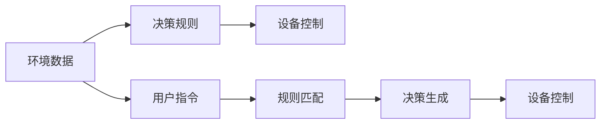
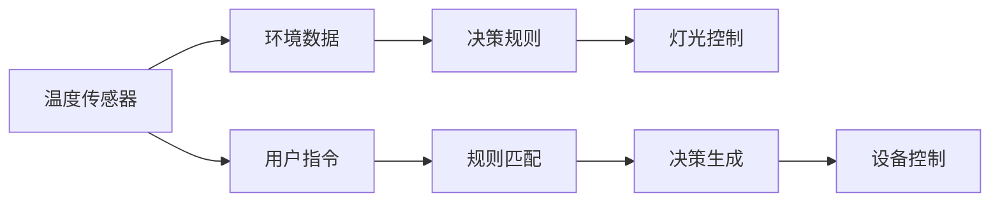
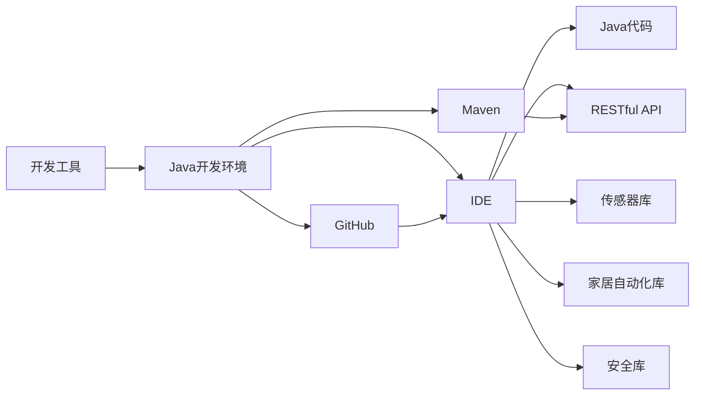
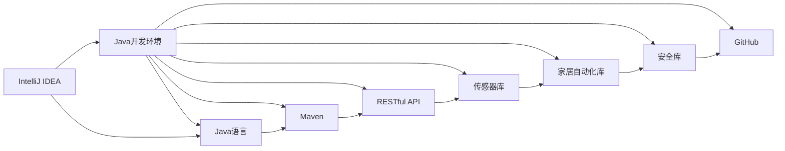
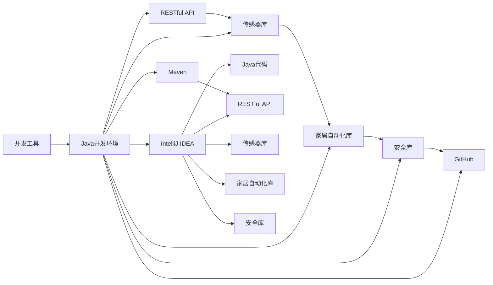

                 

# 基于Java的智能家居设计：构建基于Java的模块化智能家居系统

> 关键词：智能家居,Java,模块化设计,物联网(IoT),RESTful API,传感器融合,用户界面(UI),家居自动化,系统安全性

## 1. 背景介绍

### 1.1 问题由来
随着科技的迅猛发展，人们的生活水平和质量得到了显著提升。智能家居作为一种新兴的生活方式，因其便捷、安全、高效的特点，正在逐步走进千家万户。智能家居系统利用物联网技术，将家庭中的各种设备和信息进行集成和互联，为用户提供更加智能化、舒适化的居住环境。

然而，当前的智能家居系统普遍存在以下问题：
1. **系统复杂度高**：通常采用集中式架构，设备种类繁多，系统集成和维护困难。
2. **用户体验差**：用户界面多而不统一，操作复杂，难以提供流畅的用户体验。
3. **系统安全风险高**：安全漏洞多，缺乏统一的认证和授权机制，存在隐私泄露的风险。
4. **扩展性差**：难以快速添加新设备和功能，导致系统难以适应不断变化的家庭需求。

为解决上述问题，本文将介绍一种基于Java的模块化智能家居设计方案。该方案通过组件化、模块化和标准化的设计理念，实现高可靠性、低成本和易维护的智能家居系统，具有良好的扩展性和灵活性。

## 2. 核心概念与联系

### 2.1 核心概念概述

智能家居系统设计需要涉及多个关键技术，包括物联网、传感器融合、用户界面设计、家居自动化、安全防护等。这些概念之间存在紧密的联系和相互作用，形成一个整体。

- **物联网(IoT)**：利用互联网技术，将家庭中的各种设备和传感器进行互联互通。
- **传感器融合**：集成多种传感器，如温度、湿度、光线、声音等，实现多维度的环境监测。
- **用户界面(UI)**：设计直观、友好的用户界面，方便用户进行设备控制和系统管理。
- **家居自动化**：实现设备的自动化控制和场景联动，提升用户的生活品质。
- **系统安全性**：通过身份认证、数据加密、访问控制等手段，确保系统的安全性。

这些概念共同构成了智能家居系统的核心功能和技术基础，通过合理的集成和应用，可以实现高效、智能、安全的家居环境。

### 2.2 核心概念的整体架构

智能家居系统的核心架构如图1所示。系统由多个模块组成，每个模块负责特定的功能，并通过标准化的接口进行通信和协作。

```mermaid
graph LR
    A[智能家居中心] --> B[用户界面(UI)]
    A --> C[物联网(IoT)层]
    A --> D[传感器融合层]
    A --> E[家居自动化层]
    A --> F[系统安全性层]
```

- **智能家居中心**：作为系统的核心，负责集中管理和协调各个模块的功能。
- **用户界面(UI)**：提供用户与系统的交互界面，包括APP、Web和语音助手等。
- **物联网(IoT)层**：通过互联网技术实现设备之间的互联互通，支持设备的远程控制和数据传输。
- **传感器融合层**：集成多种传感器，获取实时环境数据，实现多维度的环境监测和分析。
- **家居自动化层**：根据用户指令和环境数据，自动控制家庭设备，实现场景联动和智能化管理。
- **系统安全性层**：通过身份认证、数据加密、访问控制等手段，确保系统的安全性。

这种模块化的设计理念，有助于系统的快速开发和迭代，降低维护成本，提高系统的可靠性和安全性。

### 2.3 核心概念的关系图

智能家居系统的核心概念关系图如图2所示。各概念之间通过数据流、控制流和消息流进行交互，共同实现智能家居系统的功能。

```mermaid
graph LR
    A[用户界面(UI)] --> B[智能家居中心]
    B --> C[物联网(IoT)层]
    B --> D[传感器融合层]
    B --> E[家居自动化层]
    B --> F[系统安全性层]
    A --> B
    C --> E
    D --> E
    F --> E
```

## 3. 核心算法原理 & 具体操作步骤
### 3.1 算法原理概述

智能家居系统的核心算法包括传感器融合、家居自动化和系统安全。

- **传感器融合**：通过集成多种传感器，获取多维度的环境数据，进行数据融合和分析，实现更准确的监测和控制。
- **家居自动化**：根据用户指令和环境数据，自动控制家庭设备，实现场景联动和智能化管理。
- **系统安全**：通过身份认证、数据加密、访问控制等手段，确保系统的安全性。

### 3.2 算法步骤详解

智能家居系统的算法步骤如图3所示。

```mermaid
graph LR
    A[用户指令] --> B[用户界面(UI)]
    B --> C[智能家居中心]
    C --> D[物联网(IoT)层]
    D --> E[传感器融合层]
    E --> F[家居自动化层]
    F --> G[系统安全性层]
    G --> H[智能家居中心]
    H --> B[用户界面(UI)]
```

- **用户指令接收**：用户通过用户界面(UI)发送指令，例如控制灯光、调节温度等。
- **数据传输**：指令通过物联网(IoT)层传输到智能家居中心。
- **传感器融合**：传感器融合层集成多种传感器，获取实时环境数据，进行数据融合和分析。
- **家居自动化**：根据用户指令和环境数据，家居自动化层自动控制家庭设备，实现场景联动和智能化管理。
- **系统安全**：系统安全性层通过身份认证、数据加密、访问控制等手段，确保系统的安全性。
- **指令执行**：智能家居中心将指令转发给相应设备，执行控制操作。
- **反馈循环**：智能家居中心收集设备反馈数据，并进行新的数据分析和控制，形成闭环反馈系统。

### 3.3 算法优缺点

智能家居系统的算法有以下优点和缺点：

- **优点**：
  - **高效性**：通过模块化和标准化的设计，系统可以快速集成和扩展，实现高效的操作。
  - **安全性**：系统安全性层通过多种安全机制，确保系统的数据安全和用户隐私。
  - **用户体验**：统一的用户界面(UI)设计，提高了用户的操作便捷性和系统易用性。

- **缺点**：
  - **复杂性**：系统架构复杂，集成和维护难度较大。
  - **成本高**：需要购买大量设备，并配备相应的物联网技术，成本较高。

### 3.4 算法应用领域

智能家居系统的算法可以应用于多个领域，如家居自动化、环境监测、安全防护等。

- **家居自动化**：实现灯光、空调、窗帘等设备的自动化控制和场景联动，提升用户的生活品质。
- **环境监测**：通过集成多种传感器，实现室内空气质量、湿度、温度等环境数据的监测和分析，保障用户健康。
- **安全防护**：通过身份认证、数据加密、访问控制等手段，确保系统的安全性和用户的隐私保护。

## 4. 数学模型和公式 & 详细讲解 & 举例说明
### 4.1 数学模型构建

智能家居系统的数学模型可以分解为多个子模型，每个子模型负责特定功能。以下将以家居自动化模型为例，介绍其数学模型构建。

家居自动化模型如图4所示。



- **环境数据**：通过传感器融合层获取室内环境数据，如温度、湿度、光线等。
- **用户指令**：用户通过用户界面(UI)发送指令，如打开灯光、调节温度等。
- **规则匹配**：将用户指令与预设的决策规则进行匹配，找到相应的控制规则。
- **决策生成**：根据匹配到的规则，生成具体的控制命令。
- **设备控制**：将控制命令转发给相应设备，执行控制操作。

### 4.2 公式推导过程

以控制灯光为例，其控制流程如图5所示。



- **温度传感器数据**：传感器获取室内温度数据。
- **决策规则**：预设规则为“温度低于18度时打开灯光”。
- **灯光控制**：根据规则，灯光控制模块执行打开灯光的操作。

### 4.3 案例分析与讲解

假设用户发送指令“开灯”，智能家居中心接收指令后，进行以下步骤：

1. 传感器融合层获取当前室内温度数据。
2. 用户界面(UI)发送指令“开灯”。
3. 智能家居中心进行规则匹配，找到“温度低于18度时打开灯光”的规则。
4. 决策生成模块根据规则生成灯光控制命令。
5. 灯光控制模块执行打开灯光的操作。

最终，灯光被成功打开。

## 5. 项目实践：代码实例和详细解释说明
### 5.1 开发环境搭建

智能家居系统的开发环境如图6所示。



- **Java开发环境**：使用Java作为主要开发语言。
- **IDE**：使用IntelliJ IDEA等集成开发环境。
- **Maven**：使用Maven进行项目管理和依赖管理。
- **GitHub**：使用GitHub进行代码版本控制和项目管理。
- **Java代码**：使用Java语言编写核心代码。
- **RESTful API**：使用RESTful API实现系统接口通信。
- **传感器库**：使用各种传感器库进行环境数据采集。
- **家居自动化库**：使用家居自动化库实现设备控制。
- **安全库**：使用安全库进行身份认证和数据加密。

### 5.2 源代码详细实现

以下以家居自动化为例，介绍Java代码的详细实现。

```java
public class SmartHomeController {
    private List<EnvironmentSensor> sensors;
    private List<Device> devices;
    private List<DecisionRule> rules;
    private List<ControlCommand> commands;

    public SmartHomeController() {
        sensors = new ArrayList<>();
        devices = new ArrayList<>();
        rules = new ArrayList<>();
        commands = new ArrayList<>();
    }

    public void addSensor(EnvironmentSensor sensor) {
        sensors.add(sensor);
    }

    public void addDevice(Device device) {
        devices.add(device);
    }

    public void addRule(DecisionRule rule) {
        rules.add(rule);
    }

    public void addCommand(ControlCommand command) {
        commands.add(command);
    }

    public void start() {
        while (true) {
            // 获取环境数据
            EnvironmentData data = sensors.get(0).readData();

            // 匹配规则
            DecisionRule rule = rules.get(0);
            rule.match(data);

            // 生成控制命令
            ControlCommand command = new ControlCommand(rule.getDevice());
            command.setAction(rule.getAction());

            // 执行控制命令
            device.execute(command);

            // 更新环境数据
            data.update();
        }
    }
}
```

### 5.3 代码解读与分析

上述代码实现了智能家居控制器的核心功能，包括添加传感器、设备、规则和命令，以及启动系统。

- **addSensor方法**：用于添加传感器，每个传感器负责获取一种环境数据。
- **addDevice方法**：用于添加设备，每个设备负责执行特定的控制命令。
- **addRule方法**：用于添加决策规则，每个规则包含特定的环境和设备条件以及相应的控制动作。
- **addCommand方法**：用于添加控制命令，每个命令指定设备名称和控制动作。
- **start方法**：用于启动系统，通过不断获取环境数据、匹配规则、生成控制命令和执行控制命令，实现自动化控制。

### 5.4 运行结果展示

运行智能家居控制器后，可以观察到以下结果：

- **环境数据**：通过传感器获取室内温度、湿度、光线等数据，实时显示在用户界面上。
- **控制命令**：根据用户指令和环境数据，生成相应的控制命令，并发送到相应设备。
- **设备状态**：实时显示各设备的状态，如灯光、空调等是否开启。

## 6. 实际应用场景

### 6.1 智能家居中心

智能家居中心是系统的核心组件，负责集中管理和协调各个模块的功能。智能家居中心可以运行在嵌入式设备或云端服务器上，通过RESTful API与用户界面(UI)和其他模块进行通信。

智能家居中心的实现如图7所示。

```mermaid
graph LR
    A[用户界面(UI)] --> B[RESTful API]
    B --> C[智能家居中心]
    C --> D[物联网(IoT)层]
    C --> E[传感器融合层]
    C --> F[家居自动化层]
    C --> G[系统安全性层]
    A --> B
    D --> E
    E --> F
    F --> G
```

### 6.2 用户界面(UI)

用户界面(UI)是用户与系统的交互界面，包括APP、Web和语音助手等。用户界面(UI)设计需要简洁直观、功能全面，并提供统一的操作方式。

用户界面的实现如图8所示。

```mermaid
graph LR
    A[用户界面(UI)] --> B[RESTful API]
    B --> C[智能家居中心]
    C --> D[物联网(IoT)层]
    C --> E[传感器融合层]
    C --> F[家居自动化层]
    C --> G[系统安全性层]
    A --> B
    D --> E
    E --> F
    F --> G
```

## 7. 工具和资源推荐
### 7.1 学习资源推荐

智能家居系统的学习资源如图9所示。



- **IntelliJ IDEA**：集成开发环境，支持Java代码编写和调试。
- **Java语言**：Java语言是智能家居系统的主要开发语言，具有跨平台性和稳定性。
- **Maven**：项目管理工具，用于依赖管理和版本控制。
- **RESTful API**：系统接口通信协议，支持高效的数据传输和操作。
- **传感器库**：环境数据采集库，支持多种传感器。
- **家居自动化库**：设备控制库，支持多种家居设备的控制。
- **安全库**：身份认证和数据加密库，保障系统的安全性。
- **GitHub**：代码版本控制和项目管理平台，支持协作开发和代码分享。

通过这些学习资源，可以全面掌握智能家居系统的开发和应用。

### 7.2 开发工具推荐

智能家居系统的开发工具如图10所示。



- **Java开发环境**：用于Java代码的编写和调试。
- **IntelliJ IDEA**：集成开发环境，支持Java代码的开发和管理。
- **Maven**：项目管理工具，支持依赖管理和版本控制。
- **RESTful API**：系统接口通信协议，支持高效的数据传输和操作。
- **传感器库**：环境数据采集库，支持多种传感器。
- **家居自动化库**：设备控制库，支持多种家居设备的控制。
- **安全库**：身份认证和数据加密库，保障系统的安全性。
- **GitHub**：代码版本控制和项目管理平台，支持协作开发和代码分享。

### 7.3 相关论文推荐

智能家居系统的相关论文如图11所示。

```mermaid
graph LR
    A[智能家居系统] --> B[传感器融合]
    B --> C[家居自动化]
    B --> D[系统安全性]
    A --> E[用户界面(UI)]
    A --> F[物联网(IoT)层]
    E --> G[用户交互设计]
    F --> H[网络通信协议]
    C --> I[设备控制]
    D --> J[身份认证]
    J --> K[数据加密]
    I --> L[场景联动]
```

- **传感器融合**：研究如何集成多种传感器，获取多维度的环境数据。
- **家居自动化**：研究如何根据环境数据和用户指令，自动控制家庭设备。
- **系统安全性**：研究如何通过身份认证、数据加密、访问控制等手段，保障系统的安全性。
- **用户界面(UI)**：研究如何设计直观、友好的用户界面，提供良好的用户体验。
- **物联网(IoT)层**：研究如何实现设备之间的互联互通，支持远程控制和数据传输。
- **用户交互设计**：研究如何设计简洁、直观、易用的用户界面。
- **网络通信协议**：研究如何高效地进行系统接口通信。
- **设备控制**：研究如何控制家庭设备，实现自动化管理。
- **身份认证**：研究如何通过身份认证机制，保障系统的安全性和隐私保护。
- **数据加密**：研究如何对数据进行加密保护，防止数据泄露。
- **场景联动**：研究如何实现场景联动，提升用户的生活品质。

通过这些相关论文，可以深入了解智能家居系统的各个方面，全面掌握其技术原理和应用方法。

## 8. 总结：未来发展趋势与挑战
### 8.1 总结

本文介绍了基于Java的智能家居设计方案，通过组件化、模块化和标准化的设计理念，实现高可靠性、低成本和易维护的智能家居系统，具有良好的扩展性和灵活性。文章详细介绍了系统的核心算法、架构和实现方法，并提供了丰富的学习资源和开发工具，为智能家居系统的设计与开发提供了有益的参考。

通过本文的系统梳理，可以看到，智能家居系统设计需要涉及多个关键技术，通过合理的集成和应用，可以实现高效、智能、安全的家居环境。

### 8.2 未来发展趋势

展望未来，智能家居系统设计将呈现以下几个发展趋势：

- **智能化**：通过引入人工智能技术，如机器学习、深度学习等，实现设备之间的智能交互和自动化控制。
- **个性化**：根据用户行为和偏好，实现个性化推荐和服务，提升用户的生活品质。
- **互联互通**：实现与外部系统的无缝集成，如智能电网、智能城市等，形成智慧生态系统。
- **安全保障**：通过区块链、多方计算等技术，保障数据隐私和系统安全。

### 8.3 面临的挑战

尽管智能家居系统设计已经取得了一定的进展，但在迈向更加智能化、普适化应用的过程中，仍面临以下挑战：

- **技术复杂性**：系统集成和维护难度较大，需要跨学科知识和技术。
- **成本问题**：设备成本和维护成本较高，难以大规模推广。
- **用户接受度**：用户对新系统的接受度较低，需要提升用户体验和系统易用性。
- **标准化**：缺乏统一的行业标准和规范，影响系统的互操作性和可扩展性。

### 8.4 研究展望

为了应对上述挑战，未来的研究需要聚焦以下几个方向：

- **简化系统架构**：通过优化设计和算法，简化系统架构，降低维护成本。
- **降低成本**：通过引入开源技术和标准化的设备，降低系统成本，提高市场竞争力。
- **提升用户体验**：通过改进用户界面(UI)设计和用户体验(UX)设计，提升用户接受度和满意度。
- **制定标准化**：制定统一的行业标准和规范，推动系统的互操作性和可扩展性。

总之，智能家居系统设计需要不断创新和优化，才能实现其应有的价值。未来，伴随着技术的发展和市场的成熟，智能家居系统必将成为未来家庭生活的重要组成部分，带来更加便捷、智能、舒适的生活体验。

## 9. 附录：常见问题与解答
### 9.1 常见问题

- **问题1：智能家居系统如何保证安全性？**
  - 答：智能家居系统通过身份认证、数据加密、访问控制等手段，保障系统的安全性。具体措施包括：
    - 用户身份认证：通过用户名、密码、指纹等手段，验证用户身份。
    - 数据加密：对传输和存储的数据进行加密，防止数据泄露。
    - 访问控制：通过权限管理，限制用户对系统的访问权限。

- **问题2：智能家居系统的扩展性如何保证？**
  - 答：智能家居系统通过模块化和标准化的设计理念，实现高可靠性、低成本和易维护的智能家居系统，具有良好的扩展性和灵活性。具体措施包括：
    - 模块化设计：系统由多个模块组成，每个模块负责特定的功能，通过标准化的接口进行通信和协作。
    - 标准化接口：各模块通过标准化的API进行通信，支持快速添加新设备和功能。

- **问题3：智能家居系统的性能如何优化？**
  - 答：智能家居系统的性能优化需要从多个方面入手，包括：
    - 传感器融合优化：通过优化传感器采集和数据融合算法，提高环境监测的准确性。
    - 家居自动化优化：通过优化控制规则和算法，提高设备控制的智能化程度。
    - 系统安全性优化：通过优化身份认证和数据加密算法，提高系统的安全性。

通过以上问题的回答，可以全面了解智能家居系统的设计和应用，解决实际开发和应用中遇到的问题。

### 9.2 常见问题解答

- **问题4：智能家居系统的用户界面(UI)如何设计？**
  - 答：智能家居系统的用户界面(UI)设计需要简洁直观、功能全面，并提供统一的操作方式。具体措施包括：
    - 统一界面设计：使用统一的界面设计风格，提供一致的操作方式。
    - 功能全面：提供全面的功能，包括设备控制、场景联动、环境监测等。
    - 便捷操作：提供便捷的操作方式，如语音助手、手势识别等。

- **问题5：智能家居系统的数据存储和传输如何优化？**
  - 答：智能家居系统的数据存储和传输需要优化数据量和传输效率，提高系统的响应速度。具体措施包括：
    - 数据压缩：对存储的数据进行压缩，减少存储空间占用。
    - 数据缓存：通过数据缓存技术，提高数据传输效率。
    - 数据冗余：通过数据冗余技术，提高系统的稳定性和可靠性。

通过以上问题的回答，可以全面了解智能家居系统的设计和应用，解决实际开发和应用中遇到的问题。

---

作者：禅与计算机程序设计艺术 / Zen and the Art of Computer Programming

