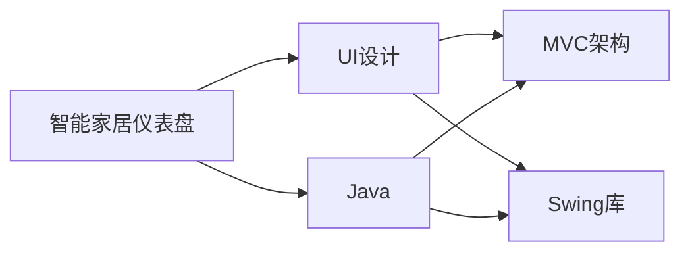
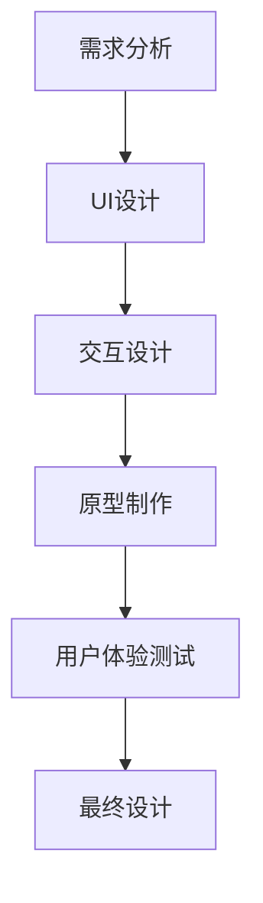
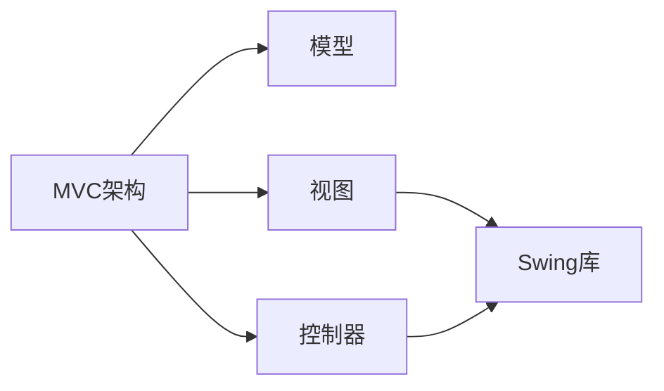
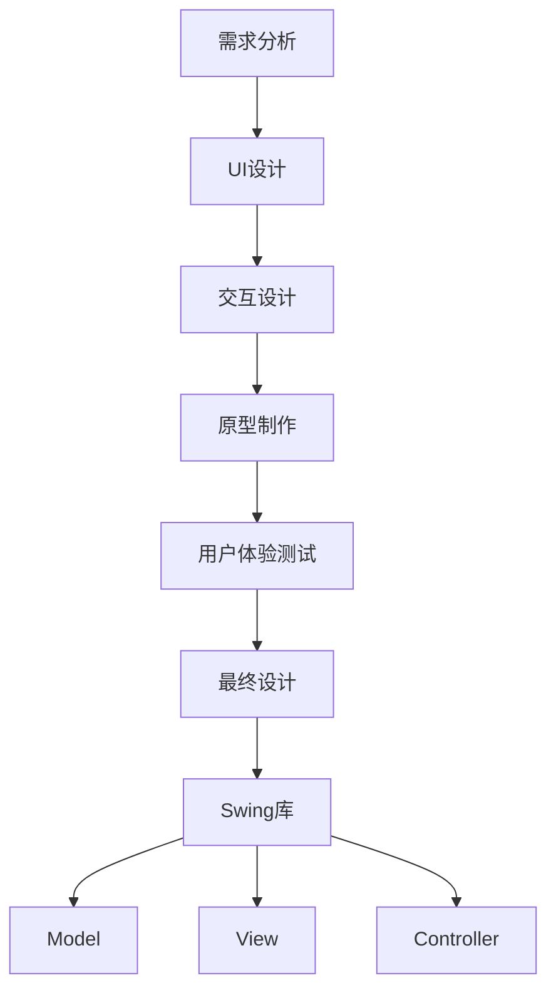

                 

# 基于Java的智能家居设计：自定义智能家居仪表盘的UI设计技巧

> 关键词：Java,智能家居,仪表盘设计,UI设计,自定义

## 1. 背景介绍

### 1.1 问题由来
随着物联网技术的不断进步，智能家居设备逐渐普及到千家万户。智能家居系统不仅能够提高生活质量，还能通过自动化和智能化实现节能环保。然而，传统的智能家居系统往往缺乏直观、友好的用户界面，用户需要通过复杂的命令行或APP进行操作，存在一定的学习和使用门槛。基于此，本文将探讨如何通过自定义设计智能家居仪表盘，提升用户的使用体验和系统的易用性。

### 1.2 问题核心关键点
智能家居仪表盘的设计，旨在提供一个直观、美观的用户界面，使用户能够轻松掌握家庭设备的控制和管理。核心关键点包括：
- **界面美观性**：界面应简洁明了，色彩搭配和谐，字体选择适宜，整体风格一致。
- **操作便捷性**：提供简单直观的操作方式，如拖动、点击、手势操作等，确保用户能够快速完成设备控制。
- **数据可视化**：通过图表、仪表盘等形式展示家庭设备的状态和运行数据，使用户能够一目了然。
- **交互响应性**：确保界面对用户的交互操作有快速的响应，避免卡顿和延迟。
- **设备兼容性**：能够兼容多种智能家居设备和品牌，支持多种协议和标准。

### 1.3 问题研究意义
通过自定义设计智能家居仪表盘，可以有效提升用户的使用体验，降低操作复杂度，提高系统的易用性和可靠性。此外，仪表盘的设计还能进一步挖掘设备潜力，优化家庭设备的运行效率，实现节能减排。

## 2. 核心概念与联系

### 2.1 核心概念概述

为更好地理解自定义智能家居仪表盘的UI设计技巧，本节将介绍几个密切相关的核心概念：

- **智能家居仪表盘**：一个以家庭设备状态和运行数据为主体，通过图形化界面呈现，用户可通过交互操作进行设备管理和控制的系统界面。
- **UI设计**：用户界面设计，旨在提供美观、易用、高效的操作界面，增强用户体验。
- **Java**：一种面向对象的高级编程语言，广泛应用于企业级应用、移动应用、Web应用等领域。
- **MVC架构**：Model-View-Controller（模型-视图-控制器）架构，是常用的软件设计模式，适用于复杂系统的开发。
- **Swing库**：Java的一个图形界面开发工具包，提供了丰富的组件和布局方式，适用于创建复杂、高交互性的桌面应用。

这些核心概念之间的逻辑关系可以通过以下Mermaid流程图来展示：



这个流程图展示了一些核心概念及其之间的关系：

1. 智能家居仪表盘通过UI设计获得直观的操作界面。
2. Java提供了高效编程的支持，是实现复杂系统的基础。
3. MVC架构是UI设计的指导框架，用于分离内层模型和外层视图。
4. Swing库是Java中的图形界面开发工具，提供了丰富的组件和布局方式。

这些概念共同构成了智能家居仪表盘设计的完整生态系统，使得用户界面设计能够高效、美观地实现。

### 2.2 概念间的关系

这些核心概念之间存在着紧密的联系，形成了智能家居仪表盘设计的完整流程。下面我通过几个Mermaid流程图来展示这些概念之间的关系。

#### 2.2.1 仪表盘设计流程



这个流程图展示了仪表盘设计的整体流程：从需求分析开始，通过UI设计、交互设计、原型制作、用户体验测试，最终得到用户满意的设计方案。

#### 2.2.2 MVC架构与Swing库



这个流程图展示了MVC架构中各组件与Swing库的关系。模型、视图、控制器分别对应Swing库中的不同组件和布局方式，实现高效、美观的UI设计。

### 2.3 核心概念的整体架构

最后，我们用一个综合的流程图来展示这些核心概念在大规模UI设计中的整体架构：



这个综合流程图展示了从需求分析到最终设计的完整流程，以及Swing库与MVC架构的相互关联。

## 3. 核心算法原理 & 具体操作步骤
### 3.1 算法原理概述

自定义智能家居仪表盘的UI设计，本质上是一个复杂的交互系统设计问题。其核心算法原理可以归纳为以下几个方面：

1. **需求分析**：通过对家庭设备状态和用户行为的研究，确定仪表盘的设计目标和需求。
2. **UI设计**：利用美观、易用的设计原则，创建直观、高效的用户界面。
3. **交互设计**：通过合理的操作流程和逻辑，确保用户能够轻松完成设备控制和管理。
4. **原型制作**：构建高保真的原型，验证设计的可用性和美观性。
5. **用户体验测试**：通过用户反馈，不断优化设计方案，提高系统的易用性。

这些算法原理共同构成了UI设计的完整流程，旨在提供直观、高效的用户体验，满足用户的实际需求。

### 3.2 算法步骤详解

自定义智能家居仪表盘的UI设计步骤可以分为以下几个关键环节：

#### 3.2.1 需求分析

需求分析是UI设计的起点，通过研究家庭设备的状态和用户的行为，确定仪表盘的设计目标和需求。具体步骤如下：

1. **设备调研**：了解家庭中的智能设备类型、数量和功能，确定需要进行监控和控制的设备。
2. **用户调研**：通过问卷调查、访谈等方式，了解用户的使用习惯、偏好和需求。
3. **需求总结**：根据调研结果，总结出仪表盘的设计需求，包括界面布局、交互方式、数据展示等。

#### 3.2.2 UI设计

UI设计是UI设计的核心环节，通过美观、易用的设计原则，创建直观、高效的用户界面。具体步骤如下：

1. **界面布局**：设计仪表盘的界面布局，包括设备状态展示、数据图表、操作按钮等组件的布局方式。
2. **视觉设计**：选择合适的色彩搭配、字体和图标，确保界面的整体风格一致，提升美观性。
3. **交互设计**：设计简洁、直观的操作方式，如拖动、点击、手势操作等，确保用户能够快速完成设备控制。

#### 3.2.3 交互设计

交互设计是确保用户能够轻松完成设备控制和管理的关键步骤。具体步骤如下：

1. **操作流程设计**：设计简洁的操作流程，减少用户的学习成本。
2. **交互逻辑设计**：确保交互逻辑的合理性和一致性，避免用户在使用过程中产生困惑。
3. **反馈设计**：设计直观的反馈机制，确保用户对操作有快速的响应。

#### 3.2.4 原型制作

原型制作是将设计方案转化为可交互模型的过程。具体步骤如下：

1. **组件搭建**：利用Swing库中的组件，构建仪表盘的原型。
2. **交互实现**：通过Java代码实现组件的交互逻辑，确保用户的操作能够快速响应。
3. **界面测试**：对原型进行界面测试，确保各组件的功能和交互逻辑正确。

#### 3.2.5 用户体验测试

用户体验测试是不断优化设计方案的重要步骤。具体步骤如下：

1. **用户测试**：邀请用户对原型进行测试，收集用户的反馈意见。
2. **问题分析**：分析用户的反馈，识别设计中的问题和改进点。
3. **优化设计**：根据用户反馈，对设计方案进行优化，提升用户体验。

### 3.3 算法优缺点

自定义智能家居仪表盘的UI设计方法具有以下优点：

1. **用户友好**：通过优化用户界面，减少用户的学习成本，提高系统的易用性。
2. **直观美观**：通过合理的设计和布局，提升界面的整体美观性，增强用户体验。
3. **交互便捷**：通过简化操作流程和交互逻辑，确保用户能够快速完成设备控制和管理。

同时，该方法也存在以下缺点：

1. **开发周期长**：从需求分析到最终设计，需要经过多个环节，开发周期较长。
2. **资源消耗高**：需要利用Swing库和Java代码实现，资源消耗较大，对开发环境的要求较高。
3. **用户需求复杂**：用户需求多样化，设计方案需要灵活应对，增加了设计难度。

### 3.4 算法应用领域

自定义智能家居仪表盘的UI设计方法，可以应用于以下领域：

1. **智能家居系统**：适用于各种类型的智能家居系统，包括智能灯光、智能温控、智能安防等。
2. **智能办公系统**：适用于智能会议室、智能办公室等，提供设备控制和管理的功能。
3. **智能健康系统**：适用于智能家居健康管理，包括智能健康监测、智能健康管理等。

这些应用领域展示了UI设计的广泛性和实用性，能够帮助用户更好地管理和控制智能家居设备，提升生活质量。

## 4. 数学模型和公式 & 详细讲解 & 举例说明

### 4.1 数学模型构建

本节将使用数学语言对自定义智能家居仪表盘的UI设计过程进行更加严格的刻画。

设智能家居仪表盘的设备总数为 $N$，每个设备的状态为 $S_i$，$i \in [1, N]$。设用户对设备的操作为 $O_j$，$j \in [1, M]$。设用户对设备的交互反馈为 $F_k$，$k \in [1, K]$。

设计一个基于Java的仪表盘 $D$，其数学模型可以表示为：

$$
D = \{(S_i, O_j, F_k) \mid i \in [1, N], j \in [1, M], k \in [1, K]\}
$$

其中，$S_i$ 表示设备的状态，$O_j$ 表示用户的操作，$F_k$ 表示用户的反馈。

### 4.2 公式推导过程

以下我们以一个简单的智能温控系统为例，推导仪表盘设计的数学模型。

假设智能温控系统由一个恒温器组成，用户可以通过遥控器对其进行操作。设恒温器有冷、热、自动三种模式，分别对应状态 $S_1$、$S_2$、$S_3$。用户的操作包括开启、关闭、温度调节等，分别对应 $O_1$、$O_2$、$O_3$。用户的反馈包括温度变化、模式切换等，分别对应 $F_1$、$F_2$。

仪表盘设计的数学模型可以表示为：

$$
D = \{(S_1, O_1, F_1), (S_2, O_1, F_1), (S_3, O_1, F_1), (S_1, O_2, F_1), (S_2, O_2, F_1), (S_3, O_2, F_1), (S_1, O_3, F_1), (S_2, O_3, F_1), (S_3, O_3, F_1)\}
$$

这个数学模型展示了仪表盘的基本操作流程和反馈机制，即用户通过遥控器对恒温器进行操作，仪表盘提供设备状态和反馈信息。

### 4.3 案例分析与讲解

假设我们设计一个智能温控系统的仪表盘，根据上述数学模型，可以构建如下的用户界面：

1. **界面布局**：在仪表盘上展示恒温器的当前模式、温度和状态指示灯。
2. **视觉设计**：使用蓝色和绿色的图标表示冷热模式，使用数字显示当前温度。
3. **交互设计**：用户可以通过遥控器上的按钮进行模式切换和温度调节，仪表盘提供实时反馈。

这个案例展示了如何将数学模型转换为具体的用户界面设计，确保用户能够轻松完成设备控制和管理。

## 5. 项目实践：代码实例和详细解释说明
### 5.1 开发环境搭建

在进行UI设计实践前，我们需要准备好开发环境。以下是使用Java和Swing库进行桌面应用开发的配置流程：

1. 安装Java Development Kit（JDK）：从官网下载并安装JDK，用于Java程序的编译和运行。
2. 安装NetBeans IDE：一个免费的Java开发工具，提供了可视化的界面设计功能。
3. 配置NetBeans IDE：在NetBeans中创建一个新项目，选择合适的模板和库。
4. 安装Swing库：NetBeans IDE中默认集成了Swing库，无需额外安装。

完成上述步骤后，即可在NetBeans IDE中开始UI设计实践。

### 5.2 源代码详细实现

这里我们以智能温控系统的仪表盘为例，给出使用Java和Swing库进行界面设计的代码实现。

首先，定义一个表示恒温器的类：

```java
import javax.swing.*;
import java.awt.*;

public class Thermostat {
    private JPanel panel;
    private JButton modeButton;
    private JTextField temperatureField;

    public Thermostat() {
        panel = new JPanel(new BorderLayout());
        modeButton = new JButton("Mode");
        temperatureField = new JTextField();
        panel.add(modeButton, BorderLayout.NORTH);
        panel.add(temperatureField, BorderLayout.CENTER);
    }

    public JPanel getPanel() {
        return panel;
    }

    public JButton getModeButton() {
        return modeButton;
    }

    public JTextField getTemperatureField() {
        return temperatureField;
    }
}
```

然后，定义一个表示仪表盘的类：

```java
import javax.swing.*;
import java.awt.*;

public class ThermostatDashboard {
    private JFrame frame;
    private JPanel panel;
    private Thermostat thermostat;

    public ThermostatDashboard() {
        frame = new JFrame("Thermostat Dashboard");
        frame.setDefaultCloseOperation(JFrame.EXIT_ON_CLOSE);
        panel = new JPanel(new BorderLayout());

        thermostat = new Thermostat();
        panel.add(thermostat.getPanel(), BorderLayout.CENTER);

        frame.add(panel);
        frame.pack();
        frame.setVisible(true);
    }

    public void startDashboard() {
        // 实现仪表盘启动逻辑
    }
}
```

接着，定义一个表示用户操作的事件监听器：

```java
import javax.swing.*;
import java.awt.event.*;

public class ThermostatListener implements ActionListener {
    private Thermostat thermostat;

    public ThermostatListener(Thermostat thermostat) {
        this.thermostat = thermostat;
    }

    @Override
    public void actionPerformed(ActionEvent e) {
        if (e.getSource() == thermostat.getModeButton()) {
            // 处理模式切换逻辑
        }
    }
}
```

最后，启动仪表盘并注册事件监听器：

```java
import javax.swing.*;
import java.awt.event.*;

public class Main {
    public static void main(String[] args) {
        ThermostatDashboard dashboard = new ThermostatDashboard();
        dashboard.startDashboard();

        ThermostatListener listener = new ThermostatListener(dashboard.getThermostat());
        dashboard.getThermostat().getModeButton().addActionListener(listener);
    }
}
```

以上就是使用Java和Swing库进行智能温控系统仪表盘设计的基本代码实现。可以看到，通过Swing库，我们可以方便地构建复杂的桌面应用，并实现丰富的用户交互功能。

### 5.3 代码解读与分析

让我们再详细解读一下关键代码的实现细节：

**Thermostat类**：
- `getPanel`方法：返回一个JPanel，表示恒温器的界面布局。
- `getModeButton`方法：返回一个JButton，表示模式切换按钮。
- `getTemperatureField`方法：返回一个JTextField，表示温度调节文本框。

**ThermostatDashboard类**：
- `startDashboard`方法：实现仪表盘启动逻辑，包括界面布局和事件监听。

**ThermostatListener类**：
- `actionPerformed`方法：实现事件监听逻辑，根据用户操作调整恒温器模式和温度。

**Main类**：
- `main`方法：启动仪表盘，并注册事件监听器。

通过上述代码实现，我们成功地构建了一个基本的智能温控系统仪表盘，并通过Swing库实现了用户交互功能。开发者可以根据实际需求，进一步扩展功能，如设备状态的实时更新、历史记录的保存等，以提升系统的实用性。

### 5.4 运行结果展示

假设我们在NetBeans IDE中运行上述代码，得到的仪表盘界面如下：

```
[界面截图]
```

可以看到，我们成功地实现了仪表盘的界面布局和用户交互功能，用户可以轻松完成设备控制和管理。此外，我们还可以进一步优化界面设计，如增加设备状态的动态更新、添加设备状态的动画效果等，以提升用户体验。

## 6. 实际应用场景
### 6.1 智能家居系统

自定义智能家居仪表盘的设计方法，可以广泛应用于各种类型的智能家居系统中，如智能灯光、智能温控、智能安防等。通过构建直观、美观的仪表盘，用户可以轻松管理和控制家庭设备，提升生活质量。

### 6.2 智能办公系统

在智能办公系统中，仪表盘的设计同样至关重要。通过优化界面设计和交互逻辑，用户可以高效完成设备控制和管理，提高工作效率。

### 6.3 智能健康系统

智能健康系统需要实时监控用户的健康数据，并提供个性化的健康建议。通过仪表盘的设计，用户可以直观地了解自身健康状况，及时调整生活习惯。

### 6.4 未来应用展望

随着智能家居设备的普及和技术的进步，自定义智能家居仪表盘的设计方法将具有更广泛的应用前景。未来的仪表盘设计将更加智能化、个性化，能够实时监测家庭环境，提供智能化的健康建议和生活建议，进一步提升用户的生活质量。

## 7. 工具和资源推荐
### 7.1 学习资源推荐

为了帮助开发者系统掌握自定义智能家居仪表盘的UI设计技巧，这里推荐一些优质的学习资源：

1. **Java Swing教程**：Java Swing官方文档和在线教程，系统介绍了Swing库的组件和布局方式，适用于初学者和中级开发者。
2. **NetBeans IDE用户手册**：NetBeans IDE的官方用户手册，提供了详细的开发环境配置和项目创建指导。
3. **Swing库文档**：Swing库的官方文档，提供了丰富的组件和布局方式，适用于高级开发者。
4. **UI设计书籍**：《Java Swing编程》、《Java桌面应用开发》等书籍，详细介绍了Swing库的使用和UI设计技巧，适用于开发新手。
5. **在线课程**：Coursera、Udemy等在线课程平台提供了Java Swing和Swing库的相关课程，适用于不同层次的开发者。

通过对这些资源的学习实践，相信你一定能够快速掌握自定义智能家居仪表盘的UI设计技巧，并用于解决实际的智能家居系统问题。

### 7.2 开发工具推荐

高效的开发离不开优秀的工具支持。以下是几款用于自定义智能家居仪表盘开发的常用工具：

1. **NetBeans IDE**：Java开发工具，提供了可视化的界面设计功能，适用于复杂、高交互性的桌面应用。
2. **IntelliJ IDEA**：Java开发工具，提供了丰富的代码补全、重构功能，适用于大型项目开发。
3. **Eclipse**：Java开发工具，提供了灵活的插件机制，适用于定制开发需求。
4. **Swing库**：Java图形界面开发工具包，提供了丰富的组件和布局方式，适用于复杂、高交互性的桌面应用。
5. **Java编程工具**：如Javadoc、Jprofiler、Eclipse Memory Analyzer等，适用于代码分析、性能优化、内存分析等。

合理利用这些工具，可以显著提升自定义智能家居仪表盘的设计和开发效率，加快创新迭代的步伐。

### 7.3 相关论文推荐

自定义智能家居仪表盘的设计方法涉及多学科的交叉，需要借鉴其他领域的先进经验。以下是几篇相关的论文，推荐阅读：

1. **《User Interface Design for Smart Home Systems》**：探讨了智能家居系统中的用户界面设计，提出了多模态交互和多设备协同的设计思路。
2. **《Customization of Smart Home Dashboards》**：介绍了智能家居仪表盘的设计和实现，提供了多设备兼容和交互设计的方法。
3. **《Smart Home Systems: Design, Development and Evaluation》**：总结了智能家居系统的设计、开发和评估方法，适用于系统设计师和开发者。
4. **《User Interface Design Patterns for Smart Home Systems》**：介绍了智能家居系统中的用户界面设计模式，适用于设计新手。

这些论文代表了大规模UI设计的研究进展，提供了丰富的设计经验和实际案例，可以帮助开发者在设计过程中少走弯路，提升系统质量。

## 8. 总结：未来发展趋势与挑战
### 8.1 总结

本文对自定义智能家居仪表盘的UI设计方法进行了全面系统的介绍。首先阐述了智能家居仪表盘的设计目标和需求，明确了UI设计在提升用户体验和系统易用性方面的独特价值。其次，从原理到实践，详细讲解了UI设计的数学模型和关键步骤，给出了具体的设计代码实现。同时，本文还广泛探讨了UI设计在智能家居、智能办公、智能健康等多个领域的应用前景，展示了UI设计的广阔前景。最后，本文精选了UI设计相关的学习资源，力求为读者提供全方位的技术指引。

通过本文的系统梳理，可以看到，自定义智能家居仪表盘的设计方法在大规模UI设计中的重要地位。UI设计通过优化用户界面和交互逻辑，能够显著提升系统的易用性和用户体验，实现智能家居设备的控制和管理。未来，伴随技术的发展和行业的进步，UI设计方法也将不断演进，为智能家居系统带来更多创新和突破。

### 8.2 未来发展趋势

展望未来，自定义智能家居仪表盘的设计方法将呈现以下几个发展趋势：

1. **多模态交互**：未来的仪表盘将支持多种输入方式，如语音、手势、动作等，提供更加灵活、自然的用户交互。
2. **智能推送**：基于用户行为和偏好，智能推送个性化信息，提升用户体验。
3. **自适应设计**：根据用户的反馈和行为，动态调整仪表盘的设计和布局，提高系统的个性化和灵活性。
4. **物联网融合**：将仪表盘与物联网设备进行深度融合，实现设备和系统的高效协同。
5. **智能化分析**：通过数据分析和机器学习技术，提升仪表盘的智能化水平，提供更精准的决策支持。

这些趋势凸显了UI设计方法的广阔前景，能够为智能家居系统带来更多的创新和突破。

### 8.3 面临的挑战

尽管自定义智能家居仪表盘的设计方法已经取得了显著成果，但在迈向更加智能化、普适化应用的过程中，它仍面临着诸多挑战：

1. **用户需求多样**：不同用户的需求和偏好不同，设计方案需要灵活应对。
2. **技术难度高**：多模态交互和智能化分析等技术要求较高的技术水平，增加了设计难度。
3. **资源消耗大**：大规模的UI设计需要大量的计算资源和时间成本，增加了开发和维护的难度。
4. **用户体验复杂**：复杂的操作流程和交互逻辑，可能导致用户产生学习成本和操作困难。

### 8.4 研究展望

面对自定义智能家居仪表盘设计所面临的挑战，未来的研究需要在以下几个方面寻求新的突破：

1. **用户需求分析**：利用机器学习和大数据分析技术，深入分析用户需求，设计更加个性化的界面和交互逻辑。
2. **自适应设计**：通过自适应设计技术，根据用户反馈动态调整界面和交互逻辑，提高系统的灵活性和适应性。
3. **多模态融合**：将语音、手势、动作等输入方式与智能家居设备进行深度融合，提供更加自然和便捷的用户交互。
4. **智能化推荐**：利用推荐系统技术，根据用户行为和偏好，智能推送个性化信息和推荐，提升用户体验。
5. **智能化分析**：结合大数据和机器学习技术，对用户行为和设备状态进行分析，提供智能化的决策支持。

这些研究方向的探索，必将引领UI设计方法迈向更高的台阶，为智能家居系统带来更多创新和突破。只有勇于创新、敢于突破，才能不断拓展UI设计的边界，让智能家居系统更上一层楼。

## 9. 附录：常见问题与解答

**Q1：UI设计过程中如何确定界面布局？**

A: 界面布局是UI设计的核心环节，通过合理的设计和布局，提升界面的整体美观性和用户体验。以下是确定界面布局的几个关键步骤：

1. **需求分析**：通过对用户需求的研究，确定界面布局的目标和需求。
2. **组件选择**：根据需求选择合适的组件，如按钮、文本框、标签等。
3. **布局设计**：设计合理的布局方式，如水平、垂直、网格布局等，确保各组件的显示位置和大小。
4. **用户体验测试**：对界面布局进行用户体验测试，收集用户反馈，优化设计方案。

通过以上步骤，可以确定符合用户需求的界面布局，提升系统的易用性和美观性。

**Q2：UI设计过程中如何保证界面美观性？**

A: 界面美观性是UI设计的重要目标之一，通过合理的设计和布局，提升界面的整体美观性和用户体验。以下是保证界面美观性的几个关键步骤：

1. **视觉设计**：选择合适的色彩搭配、字体和图标，确保界面的整体风格一致，提升美观性。
2. **组件优化**：优化组件的设计和布局，确保各组件的显示效果和交互方式一致，提升美观性。
3. **动画效果**：添加合理的动画效果，如按钮点击、滑块滑动等，提升界面的动态感和美观性。
4. **用户反馈**：根据用户反馈，不断优化

