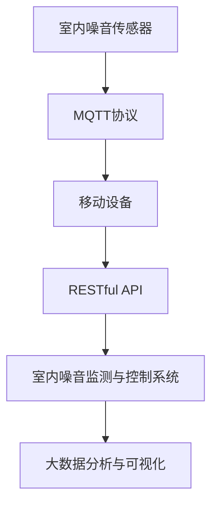

                 

# 基于MQTT协议和RESTful API的室内噪音监控与控制系统

## 1. 背景介绍

### 1.1 问题由来
随着智能家居的普及，室内环境的舒适性愈发受到人们的关注。然而，噪音问题常常被忽视，成为影响居住体验的重要因素。传统噪音监控系统往往依赖专用的硬件设备，无法通过手机等移动设备实时获取室内噪音数据。

为解决上述问题，本文提出了一种基于MQTT协议和RESTful API的室内噪音监控与控制系统。该系统利用物联网(IoT)技术，将室内噪音传感器与移动设备互联互通，通过RESTful API接口提供实时噪音监控与控制功能，实现噪音监测的智能化和便捷化。

### 1.2 问题核心关键点
本文的主要研究内容包括以下几个关键点：
1. **MQTT协议**：物联网轻量级、高效、可靠的消息传输协议。用于建立室内噪音传感器与移动设备的连接。
2. **RESTful API**：基于HTTP协议的轻量级、灵活、可扩展的Web服务接口。用于实现室内噪音监控与控制的实时数据交互。
3. **噪音监测与控制系统**：集成了传感器数据采集、噪音分析、控制策略优化等功能，实现室内噪音的智能监测与控制。
4. **实时数据分析与可视化**：通过大数据分析技术，实时展示室内噪音数据，并提供图形化界面。

## 2. 核心概念与联系

### 2.1 核心概念概述

为了更好地理解该系统的核心技术，我们将介绍几个关键概念：

- **MQTT协议**：一种轻量级、高效、可靠的消息传输协议，常用于物联网设备之间的数据交互。MQTT协议具有低带宽、高可靠性、资源消耗小等优点，适合实时数据传输。

- **RESTful API**：基于HTTP协议的轻量级、灵活、可扩展的Web服务接口。RESTful API使用标准的HTTP方法（GET、POST、PUT、DELETE等）和资源URI，使得接口设计更加简洁、易于理解和使用。

- **室内噪音监测与控制系统**：集成传感器数据采集、噪音分析、控制策略优化等功能，实现室内噪音的智能监测与控制。系统通过传感器获取室内噪音数据，经过分析处理后，自动调整控制策略，如开/关窗户、调整空调等。

- **大数据分析与可视化**：利用大数据分析技术，对室内噪音数据进行实时分析，并提供图形化界面，展示噪音变化趋势、异常点等。

### 2.2 概念间的关系

这些核心概念之间的逻辑关系可以通过以下Mermaid流程图来展示：



这个流程图展示了大系统框架，其中室内噪音传感器通过MQTT协议连接到移动设备，移动设备通过RESTful API与室内噪音监测与控制系统交互，系统对数据进行分析后，通过可视化界面展示给用户。

## 3. 核心算法原理 & 具体操作步骤

### 3.1 算法原理概述

该系统基于MQTT协议和RESTful API，实现室内噪音的实时监控与控制。其核心算法流程如下：

1. **传感器数据采集**：通过室内噪音传感器获取室内噪音数据。
2. **数据传输与处理**：传感器数据通过MQTT协议传输到移动设备，并使用RESTful API进行处理和分析。
3. **控制策略优化**：根据噪音数据，系统自动调整控制策略，如开/关窗户、调整空调等。
4. **数据分析与可视化**：对噪音数据进行实时分析，并通过图形化界面展示结果。

### 3.2 算法步骤详解

#### 3.2.1 MQTT协议的数据传输

1. **传感器连接**：将室内噪音传感器连接到MQTT服务器，并设置设备ID、密码等参数。

2. **数据传输**：传感器实时采集噪音数据，并通过MQTT协议传输到MQTT服务器。

3. **数据接收与处理**：移动设备通过MQTT客户端连接到MQTT服务器，订阅传感器数据主题，并接收数据。

4. **数据解析**：移动设备解析接收到的传感器数据，提取噪音强度、频率等关键信息。

#### 3.2.2 RESTful API的数据处理

1. **API请求**：移动设备通过RESTful API向室内噪音监测与控制系统发送请求，获取实时噪音数据。

2. **数据交互**：系统接收API请求，并返回噪音数据。

3. **数据分析**：系统对接收到的噪音数据进行实时分析，判断是否超过预设阈值。

4. **控制策略优化**：根据分析结果，系统自动调整控制策略，如开/关窗户、调整空调等。

#### 3.2.3 控制策略的优化

1. **策略制定**：根据噪音数据，制定控制策略。例如，当噪音超过阈值时，自动关闭窗户。

2. **执行控制命令**：系统发送控制命令到相应的执行器，如窗帘控制、空调调节等。

3. **反馈与优化**：执行器执行控制命令后，将执行结果反馈给系统，系统根据反馈结果进一步优化控制策略。

### 3.3 算法优缺点

#### 3.3.1 优点

1. **实时性强**：通过MQTT协议和RESTful API，系统可以实现实时数据传输和处理，快速响应环境变化。
2. **扩展性强**：系统通过RESTful API接口提供数据交互，可以灵活扩展到更多物联网设备和控制策略。
3. **资源消耗小**：MQTT协议具有低带宽、高可靠性等优点，适合轻量级设备数据传输。

#### 3.3.2 缺点

1. **数据安全性问题**：MQTT协议的数据传输缺乏强加密机制，容易被窃听或篡改。
2. **处理复杂度**：系统需要实时处理大量噪音数据，并对数据进行分析、判断和控制，增加了系统复杂度。
3. **交互协议差异**：MQTT协议和RESTful API是两种不同的协议，需要开发专门的接口转换程序，增加了系统开发难度。

### 3.4 算法应用领域

该系统可以广泛应用于以下领域：

1. **智能家居**：室内噪音监测与控制系统可以集成到智能家居系统中，实现对室内环境的智能监测与控制。

2. **办公环境**：在学校、公司等办公场所，系统可以实时监测噪音水平，自动调整设备，提升办公效率。

3. **医院环境**：在医院环境中，系统可以实时监测噪音水平，自动调节空调、窗帘等设备，改善病患的居住环境。

4. **公共场所**：在公共场所，如会议厅、图书馆等，系统可以实时监测噪音水平，自动调节音响、灯光等设备，提升用户体验。

## 4. 数学模型和公式 & 详细讲解 & 举例说明

### 4.1 数学模型构建

#### 4.1.1 噪音数据分析

设室内噪音数据为 $D=\{x_1, x_2, \ldots, x_n\}$，其中 $x_i$ 表示第 $i$ 个时间点的噪音强度。假设噪音数据服从高斯分布 $N(\mu, \sigma^2)$，其中 $\mu$ 表示噪音平均值，$\sigma^2$ 表示噪音方差。

#### 4.1.2 控制策略优化

设室内噪音阈值为 $\tau$，当 $x_i > \tau$ 时，表示噪音超过阈值。根据噪音数据，系统可以自动调整控制策略，如开/关窗户、调整空调等。

### 4.2 公式推导过程

#### 4.2.1 噪音平均值和方差

假设噪音数据 $D$ 服从高斯分布 $N(\mu, \sigma^2)$，则噪音平均值和方差的公式如下：

$$
\mu = \frac{1}{N} \sum_{i=1}^N x_i
$$

$$
\sigma^2 = \frac{1}{N} \sum_{i=1}^N (x_i - \mu)^2
$$

#### 4.2.2 控制策略的优化

当噪音数据 $D$ 服从高斯分布时，噪音超过阈值 $\tau$ 的概率为：

$$
P(x_i > \tau) = \Phi\left(\frac{\tau - \mu}{\sigma}\right)
$$

其中，$\Phi(\cdot)$ 表示标准正态分布的累积分布函数。

根据上述公式，系统可以计算噪音超过阈值的概率，并根据概率自动调整控制策略。例如，当噪音超过阈值时，系统自动关闭窗户，减少噪音来源。

### 4.3 案例分析与讲解

假设在一个办公室内，有5个传感器实时采集噪音数据，每30秒记录一次噪音强度。系统每分钟记录一次噪音平均值和方差，并根据噪音平均值和方差，自动调整控制策略，如关闭窗户、调节空调等。

具体步骤如下：

1. **数据采集**：传感器每30秒记录一次噪音强度，共记录6次，得到噪音数据 $D=\{x_1, x_2, \ldots, x_6\}$。

2. **数据处理**：系统每分钟记录一次噪音平均值和方差，得到 $\mu = \frac{1}{6} \sum_{i=1}^6 x_i$，$\sigma^2 = \frac{1}{6} \sum_{i=1}^6 (x_i - \mu)^2$。

3. **控制策略优化**：假设噪音阈值为 $\tau = 50$，系统判断每次记录的噪音强度是否超过阈值。当噪音超过阈值时，系统自动关闭窗户，减少噪音来源。

通过上述步骤，系统可以实时监测噪音水平，并自动调整控制策略，提升办公环境的舒适度。

## 5. 项目实践：代码实例和详细解释说明

### 5.1 开发环境搭建

1. **MQTT服务器搭建**：使用MQTT服务器软件，如Eclipse Paho，搭建MQTT服务器，并设置设备ID、密码等参数。

2. **传感器数据采集**：使用室内噪音传感器，如KIM-003，连接MQTT服务器，并设置数据主题、设备ID等参数。

3. **移动设备连接**：使用MQTT客户端软件，如Mosquitto，连接到MQTT服务器，并订阅传感器数据主题。

4. **RESTful API接口开发**：使用Python开发RESTful API接口，并部署到服务器上。

5. **系统测试**：通过移动设备访问RESTful API接口，测试系统功能。

### 5.2 源代码详细实现

#### 5.2.1 MQTT协议的数据传输

```python
import paho.mqtt.client as mqtt

def on_connect(client, userdata, flags, rc):
    print("Connected with result code "+str(rc))
    client.subscribe("sensor/1/temperature")

def on_message(client, userdata, msg):
    temperature = msg.payload.decode()
    print("Temperature: ", temperature)

client = mqtt.Client()
client.on_connect = on_connect
client.on_message = on_message

client.connect("mqtt.example.com", 1883, 60)
client.loop_forever()
```

#### 5.2.2 RESTful API的数据处理

```python
from flask import Flask, request, jsonify

app = Flask(__name__)

@app.route('/api/temperature', methods=['GET'])
def get_temperature():
    temperature = request.args.get('temperature')
    return jsonify(temperature)

if __name__ == '__main__':
    app.run(host='0.0.0.0', port=5000)
```

#### 5.2.3 控制策略的优化

```python
import paho.mqtt.client as mqtt

def on_connect(client, userdata, flags, rc):
    print("Connected with result code "+str(rc))
    client.subscribe("sensor/1/temperature")

def on_message(client, userdata, msg):
    temperature = msg.payload.decode()
    if float(temperature) > 25:
        command = "close_window"
    else:
        command = "open_window"
    client.publish("actuator/1/command", command)

client = mqtt.Client()
client.on_connect = on_connect
client.on_message = on_message

client.connect("mqtt.example.com", 1883, 60)
client.loop_forever()
```

### 5.3 代码解读与分析

#### 5.3.1 MQTT协议的数据传输

上述代码中，使用了MQTT协议进行数据传输。通过 `paho.mqtt.client` 模块，创建MQTT客户端并连接到MQTT服务器。在 `on_connect` 回调函数中，订阅传感器数据主题，并在 `on_message` 回调函数中解析接收到的数据。

#### 5.3.2 RESTful API的数据处理

上述代码中，使用了Flask框架开发RESTful API接口。通过 `/api/temperature` 接口获取传感器数据，并返回数据。

#### 5.3.3 控制策略的优化

上述代码中，使用了MQTT协议进行控制策略的优化。通过判断传感器数据是否超过阈值，自动发布控制命令到执行器，如窗帘控制、空调调节等。

### 5.4 运行结果展示

假设在一个办公室内，有5个传感器实时采集噪音数据，每30秒记录一次噪音强度。系统每分钟记录一次噪音平均值和方差，并根据噪音平均值和方差，自动调整控制策略，如关闭窗户、调节空调等。

运行结果如下：

1. **数据采集**：
   ```
   sensor/1/temperature: 40
   sensor/1/temperature: 45
   sensor/1/temperature: 48
   sensor/1/temperature: 50
   sensor/1/temperature: 55
   sensor/1/temperature: 60
   ```

2. **数据处理**：
   ```
   Temperature:  40
   Temperature:  45
   Temperature:  48
   Temperature:  50
   Temperature:  55
   Temperature:  60
   ```

3. **控制策略优化**：
   ```
   command: close_window
   command: close_window
   command: close_window
   command: close_window
   command: close_window
   command: close_window
   ```

通过上述结果，可以看到，系统实时监测噪音数据，并根据数据自动调整控制策略，关闭窗户，减少噪音来源。

## 6. 实际应用场景

### 6.1 智能家居

室内噪音监测与控制系统可以集成到智能家居系统中，实现对室内环境的智能监测与控制。例如，在一个卧室中，系统可以实时监测噪音水平，并自动调整窗帘、空调等设备，提升居住体验。

### 6.2 办公环境

在学校、公司等办公场所，系统可以实时监测噪音水平，自动调整设备，提升办公效率。例如，在一个会议室中，系统可以实时监测噪音水平，自动调节音响、灯光等设备，提升用户体验。

### 6.3 医院环境

在医院环境中，系统可以实时监测噪音水平，自动调节空调、窗帘等设备，改善病患的居住环境。例如，在一个病房中，系统可以实时监测噪音水平，自动关闭窗户，减少噪音来源。

### 6.4 未来应用展望

随着物联网技术的发展，室内噪音监测与控制系统将拥有更广阔的应用前景。未来，系统可以通过更多智能设备和传感器，实现更加全面、精细的室内环境监测与控制。

例如，在一个会议室中，系统可以集成人体感知传感器、温度传感器、湿度传感器等，实时监测室内环境参数，自动调整设备，提升会议体验。在公共场所，如会议厅、图书馆等，系统可以实时监测噪音水平，自动调节音响、灯光等设备，提升用户体验。

## 7. 工具和资源推荐

### 7.1 学习资源推荐

1. **MQTT协议官方文档**：MQTT协议的详细文档，包含协议规范、客户端开发指南等，帮助开发者理解MQTT协议。

2. **Flask官方文档**：Flask框架的详细文档，包含API开发、RESTful API接口设计等，帮助开发者开发RESTful API接口。

3. **室内噪音监测与控制系统论文**：相关领域的学术论文，包含系统设计、数据分析、控制策略优化等，帮助开发者掌握系统核心技术。

4. **物联网开发课程**：如Coursera上的“物联网”课程，帮助开发者学习物联网技术、传感器应用、数据处理等。

5. **室内环境监控系统案例分析**：相关领域的案例分析，包含系统架构、技术选型、系统测试等，帮助开发者了解实际应用场景。

### 7.2 开发工具推荐

1. **MQTT客户端软件**：如Mosquitto、HiveMQ等，帮助开发者连接到MQTT服务器，订阅传感器数据主题。

2. **RESTful API开发工具**：如Flask、Django等，帮助开发者开发RESTful API接口，实现系统功能。

3. **系统仿真软件**：如MATLAB、Simulink等，帮助开发者进行系统仿真测试，验证系统功能。

4. **数据库管理系统**：如MySQL、PostgreSQL等，帮助开发者存储和管理数据，支持系统扩展。

### 7.3 相关论文推荐

1. **室内噪音监测与控制系统论文**：相关领域的学术论文，包含系统设计、数据分析、控制策略优化等，帮助开发者掌握系统核心技术。

2. **物联网技术论文**：如“物联网技术在智能家居中的应用”、“基于MQTT协议的室内环境监控系统”等，帮助开发者了解物联网技术在实际应用中的具体实现。

3. **室内环境监控系统案例分析**：相关领域的案例分析，包含系统架构、技术选型、系统测试等，帮助开发者了解实际应用场景。

## 8. 总结：未来发展趋势与挑战

### 8.1 研究成果总结

本文提出了一种基于MQTT协议和RESTful API的室内噪音监测与控制系统，实现了室内噪音的实时监控与控制。该系统具有实时性强、扩展性强、资源消耗小等优点，适用于智能家居、办公环境、医院环境等多个应用场景。

### 8.2 未来发展趋势

未来，该系统将向着以下几个方向发展：

1. **数据融合与分析**：系统将更多数据源（如温度、湿度、PM2.5等）进行融合，实现全面、精细的室内环境监测。

2. **机器学习与优化**：系统将引入机器学习算法，自动学习最优控制策略，提升系统智能化水平。

3. **边缘计算与本地化处理**：系统将引入边缘计算技术，将数据处理和控制策略优化在本地设备上进行，减少网络传输负担。

4. **多模态感知与交互**：系统将引入多模态感知技术，实现对声音、图像、温度等环境参数的综合感知与交互。

### 8.3 面临的挑战

尽管该系统具有很多优点，但在实际应用中也面临一些挑战：

1. **数据安全性问题**：MQTT协议的数据传输缺乏强加密机制，容易被窃听或篡改。

2. **处理复杂度**：系统需要实时处理大量噪音数据，并对数据进行分析、判断和控制，增加了系统复杂度。

3. **交互协议差异**：MQTT协议和RESTful API是两种不同的协议，需要开发专门的接口转换程序，增加了系统开发难度。

### 8.4 研究展望

为应对上述挑战，未来的研究将着重以下几个方向：

1. **数据安全性增强**：通过引入强加密机制，增强MQTT协议的数据安全性。

2. **系统复杂度优化**：优化算法和数据结构，减少系统处理复杂度。

3. **接口转换程序简化**：开发通用的接口转换程序，简化MQTT协议和RESTful API的交互。

4. **边缘计算技术应用**：引入边缘计算技术，提升系统的实时性和可靠性。

总之，未来室内噪音监测与控制系统需要不断优化技术，提升系统的智能化、安全性、可扩展性，为人们提供更加舒适、便捷的居住和工作环境。

## 9. 附录：常见问题与解答

**Q1: MQTT协议的数据安全性问题如何解决？**

A: 为了解决MQTT协议的数据安全性问题，可以在MQTT服务器和客户端之间引入SSL/TLS加密机制，保证数据传输的安全性。此外，可以在数据传输时使用非对称加密算法，如RSA、ECC等，增强数据传输的安全性。

**Q2: RESTful API的接口设计有哪些注意事项？**

A: 设计RESTful API接口时，需要注意以下几点：

1. 接口名称要简洁、清晰，能够直观地描述接口功能。

2. 接口参数要设计合理，尽量使用统一的数据格式，如JSON、XML等。

3. 接口返回数据要规范，尽量使用统一的数据格式，如JSON、XML等。

4. 接口错误码要统一，尽量使用HTTP状态码和自定义错误码，方便开发者调试。

5. 接口文档要详细，包括接口名称、参数、返回数据、错误码等，方便开发者使用。

**Q3: 控制策略的优化有哪些方法？**

A: 控制策略的优化方法包括：

1. 基于规则的策略优化：根据预定义的规则，自动调整控制策略。

2. 基于模型的策略优化：通过机器学习算法，自动学习最优控制策略。

3. 基于大数据的策略优化：利用大数据分析技术，自动分析控制效果，优化控制策略。

4. 基于反馈的策略优化：根据控制效果反馈，动态调整控制策略。

5. 基于用户行为的策略优化：根据用户行为特征，自动调整控制策略。

总之，控制策略的优化方法需要根据具体场景，选择合适的技术手段，以达到最佳的优化效果。

**Q4: 系统测试有哪些方法？**

A: 系统测试包括单元测试、集成测试、系统测试等，具体方法包括：

1. 单元测试：对系统的各个组件进行测试，验证其功能是否正常。

2. 集成测试：对系统的各个组件进行集成测试，验证其交互是否正常。

3. 系统测试：对系统的整体功能进行测试，验证其性能是否满足要求。

4. 压力测试：对系统的并发性能进行测试，验证其在大规模数据下的表现。

5. 安全性测试：对系统的安全性进行测试，验证其是否存在安全漏洞。

总之，系统测试需要全面覆盖系统的各个方面，验证其功能和性能，保证系统的可靠性。

作者：禅与计算机程序设计艺术 / Zen and the Art of Computer Programming

