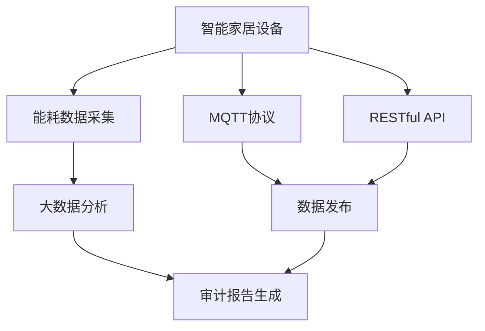
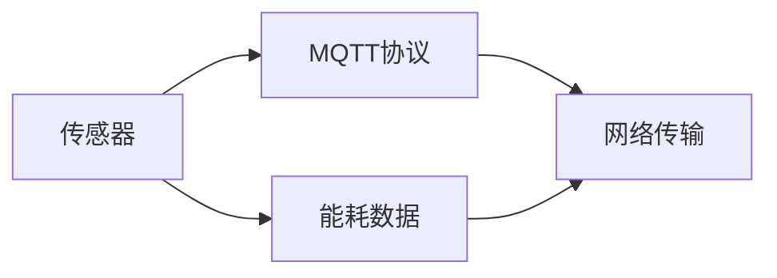
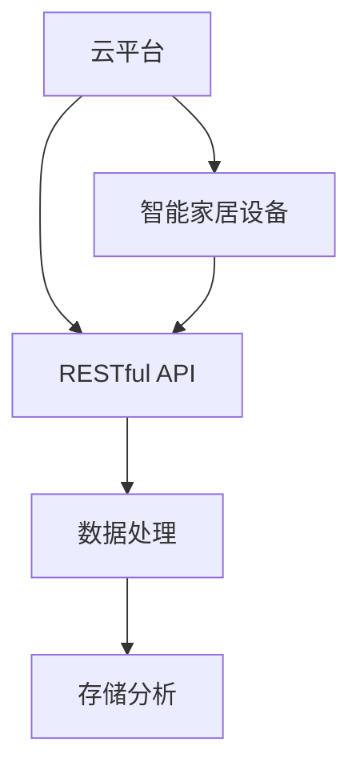
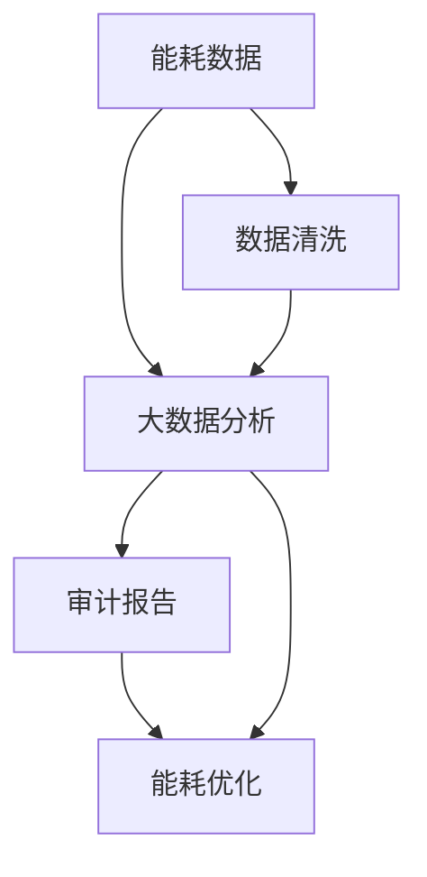
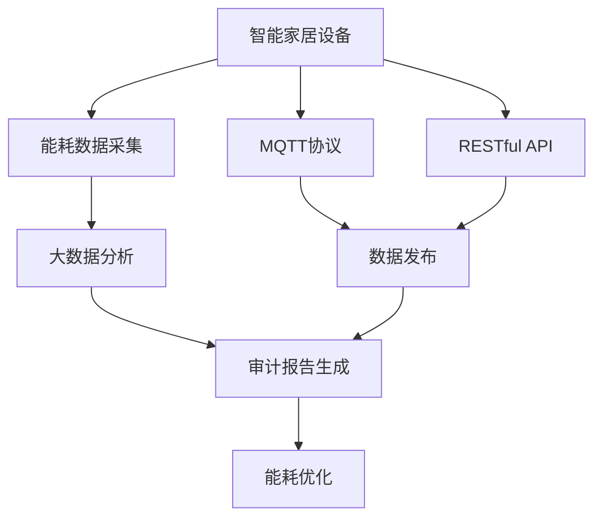

                 

# 基于MQTT协议和RESTful API的智能家居系统能源审计

> 关键词：智能家居,能源审计,MQTT协议,RESTful API,物联网,大数据分析

## 1. 背景介绍

### 1.1 问题由来
随着物联网技术的迅猛发展和普及，智能家居系统已经成为现代家庭生活的重要组成部分。这些系统由各种智能设备（如智能灯光、智能温控器、智能安防设备等）组成，通过传感器、网络通信等技术手段实现对家居环境的智能化控制。然而，智能家居系统的高能耗问题也日益凸显，对于节约能源、降低运营成本具有重要意义。

能源审计（Energy Auditing）是对建筑或系统的能源使用情况进行全面分析与评估的过程。通过能源审计，可以发现能耗高的设备，提出改进方案，优化能源使用，提高能源利用效率。传统的能源审计方法需要耗费大量人力物力，无法实现实时监控和快速响应，在智能家居领域的应用存在局限。

近年来，随着人工智能和大数据技术的兴起，基于物联网（IoT）的能源审计系统逐渐成为研究热点。本文聚焦于利用MQTT协议和RESTful API技术，构建一个智能家居系统的能源审计系统。通过该系统，可以实时采集设备能耗数据，进行数据分析，并生成审计报告，为能耗优化提供决策支持。

## 2. 核心概念与联系

### 2.1 核心概念概述

为更好地理解基于MQTT协议和RESTful API的智能家居系统能源审计方法，本节将介绍几个密切相关的核心概念：

- **MQTT协议（Message Queuing Telemetry Transport Protocol）**：一种轻量级的消息发布/订阅协议，常用于物联网设备之间的数据通信。其具有低延迟、高可靠性、协议简单等特点，适合于智能家居系统中设备的实时数据交换。
- **RESTful API（Representational State Transfer）**：一种Web服务架构风格，通过HTTP协议实现对资源的操作。RESTful API具有简洁、灵活、易于维护的特点，常用于构建智能家居系统中各类设备和应用之间的通信接口。
- **能源审计**：通过对建筑或系统的能耗情况进行分析与评估，找出能耗高的设备或环节，提出改进方案，优化能源使用，提高能源利用效率的过程。
- **物联网（Internet of Things, IoT）**：通过各种感知技术手段（如传感器、RFID等），将物理世界中的设备、物品连接起来，实现数据采集、传输和处理，构建智能化的信息生态系统。
- **大数据分析**：利用先进的数据处理技术，对海量数据进行存储、分析和挖掘，发现数据中的有用信息和知识，为决策提供支持。

这些核心概念之间的逻辑关系可以通过以下Mermaid流程图来展示：



这个流程图展示了一些核心概念之间的关系：

1. 智能家居设备通过传感器等技术手段采集能耗数据。
2. MQTT协议和RESTful API用于智能家居设备之间以及设备与云平台之间的数据通信。
3. 采集到的能耗数据经过大数据分析，生成有价值的信息。
4. 最终生成的审计报告支持能耗优化决策。

### 2.2 概念间的关系

这些核心概念之间存在着紧密的联系，形成了基于MQTT协议和RESTful API的智能家居系统能源审计的完整生态系统。下面我们通过几个Mermaid流程图来展示这些概念之间的关系。

#### 2.2.1 数据采集与传输



这个流程图展示了能耗数据的采集和传输过程。传感器采集到的能耗数据通过MQTT协议进行发布，并由网络传输到云平台。

#### 2.2.2 RESTful API通信



这个流程图展示了云平台与智能家居设备之间的通信过程。智能家居设备通过RESTful API向云平台发送数据请求，云平台则通过RESTful API将处理结果返回给设备。

#### 2.2.3 数据处理与审计报告



这个流程图展示了数据处理和审计报告的生成过程。能耗数据经过清洗和处理，进入大数据分析阶段，最终生成审计报告。审计报告中的信息可以用于能耗优化，提高能源利用效率。

### 2.3 核心概念的整体架构

最后，我们用一个综合的流程图来展示这些核心概念在大语言模型微调过程中的整体架构：



这个综合流程图展示了从能耗数据采集到审计报告生成，再到能耗优化的完整过程。智能家居设备通过传感器采集能耗数据，通过MQTT协议和RESTful API进行传输和处理，生成审计报告，并用于能耗优化。

## 3. 核心算法原理 & 具体操作步骤
### 3.1 算法原理概述

基于MQTT协议和RESTful API的智能家居系统能源审计，本质上是一个基于数据采集和传输、数据处理和分析、审计报告生成的流程化任务。其核心思想是：

1. **数据采集**：通过传感器等技术手段，实时采集智能家居设备（如智能灯光、智能温控器、智能安防设备等）的能耗数据。
2. **数据传输**：利用MQTT协议，将采集到的能耗数据从设备端传输到云平台。
3. **数据处理**：在云平台上，对传输过来的能耗数据进行清洗、分析和挖掘，提取出有价值的信息。
4. **审计报告生成**：将处理结果汇总生成审计报告，提供能耗分析结果。
5. **能耗优化**：根据审计报告，制定能耗优化方案，并反馈给设备进行改进。

### 3.2 算法步骤详解

基于MQTT协议和RESTful API的智能家居系统能源审计一般包括以下几个关键步骤：

**Step 1: 数据采集**

- 部署传感器：在智能家居设备上安装传感器，用于采集能耗数据，如电流、电压、功率等。
- 数据格式转换：将传感器采集到的原始数据转换为标准格式，便于后续处理。

**Step 2: 数据传输**

- MQTT协议配置：在智能家居设备和云平台之间配置MQTT协议，确保数据传输的可靠性和实时性。
- MQTT消息发布：智能家居设备通过MQTT协议将采集到的能耗数据发布到云平台。

**Step 3: 数据处理**

- 数据清洗：对传输过来的能耗数据进行去重、去噪、填充缺失值等处理，确保数据质量。
- 数据分析：使用大数据分析技术，对处理后的能耗数据进行统计分析、趋势分析等，提取出有价值的信息。
- 结果存储：将分析结果存入数据库，供后续审计报告生成使用。

**Step 4: 审计报告生成**

- 数据可视化：将分析结果通过图表、仪表盘等形式进行可视化展示，便于用户理解。
- 报告撰写：根据可视化结果，撰写审计报告，总结能耗情况和优化建议。

**Step 5: 能耗优化**

- 优化方案制定：根据审计报告中的信息，制定能耗优化方案，如设备维护、调整运行参数等。
- 反馈执行：将优化方案反馈给智能家居设备，进行实际改进。

### 3.3 算法优缺点

基于MQTT协议和RESTful API的智能家居系统能源审计方法具有以下优点：

1. **实时性高**：通过MQTT协议进行数据传输，具有低延迟、高可靠性的特点，可以实现实时监控和快速响应。
2. **可扩展性强**：通过RESTful API构建通信接口，可以实现设备之间的灵活通信，适应各类智能家居设备。
3. **数据质量高**：大数据分析技术可以处理海量数据，提取出有价值的信息，提高审计报告的准确性。
4. **易于维护**：MQTT协议和RESTful API均为开放标准，易于部署和维护。

同时，该方法也存在一些局限性：

1. **设备成本较高**：MQTT协议和传感器等硬件设备需要一定的成本投入，可能会增加初始投资。
2. **网络稳定性要求高**：MQTT协议对网络稳定性要求较高，一旦网络中断，数据传输可能受阻。
3. **数据处理复杂**：大数据分析技术虽然强大，但需要一定的技术和资源支持，对技术要求较高。
4. **隐私和安全问题**：智能家居设备通过网络传输数据，存在隐私和安全问题，需要采取相应的防护措施。

### 3.4 算法应用领域

基于MQTT协议和RESTful API的智能家居系统能源审计方法，适用于智能家居系统的能耗监测、分析与优化。具体应用场景包括：

- **智能灯光**：实时监测和控制灯光的开关和亮度，优化能耗使用。
- **智能温控器**：监测和控制室内温度，根据人员活动和天气变化自动调节，提高能效。
- **智能安防设备**：监测和控制摄像头、报警器等设备，减少不必要的能耗使用。
- **智能家电**：监测和控制各类家电设备的能耗使用，优化运行模式。

此外，该方法还可用于其他智能物联网设备的能源审计，如智能交通、智能医疗、智能工厂等，为这些领域的能耗优化提供技术支持。

## 4. 数学模型和公式 & 详细讲解 & 举例说明

### 4.1 数学模型构建

基于MQTT协议和RESTful API的智能家居系统能源审计，其数学模型主要涉及数据的采集、传输、处理和分析。以下我们将通过一些关键公式来阐述这些过程。

**数据采集模型**：假设智能家居设备i在时间t的能耗数据为$E_{it}$，由传感器采集并转换为标准格式。

**数据传输模型**：假设智能家居设备i通过MQTT协议在时间t向云平台发布数据，数据传输的可靠性为$R_{it}$，延迟为$D_{it}$。

**数据处理模型**：假设云平台在时间t接收到的能耗数据为$D_{it}$，经过清洗和处理后得到的数据为$H_{it}$，经过数据分析得到的信息为$I_{it}$。

**审计报告生成模型**：假设审计报告在时间t生成，其中包含的信息为$R_{it}$，用于指导能耗优化。

### 4.2 公式推导过程

以下是一些关键的公式推导：

1. **数据采集公式**：
   $$
   E_{it} = S_{it} \times P_{it} \times T_{it}
   $$
   其中$S_{it}$为传感器采集的原始数据，$P_{it}$为数据格式转换系数，$T_{it}$为数据采集时间。

2. **数据传输公式**：
   $$
   R_{it} = \frac{1}{1+C_{it}}
   $$
   其中$C_{it}$为传输过程中的数据丢失率。

3. **数据处理公式**：
   $$
   H_{it} = F_{it}(D_{it})
   $$
   其中$F_{it}$为数据清洗和处理函数。

4. **数据分析公式**：
   $$
   I_{it} = A_{it}(H_{it})
   $$
   其中$A_{it}$为数据分析函数。

5. **审计报告生成公式**：
   $$
   R_{it} = G_{it}(I_{it})
   $$
   其中$G_{it}$为审计报告生成函数。

### 4.3 案例分析与讲解

以下我们将通过一个具体案例，详细讲解基于MQTT协议和RESTful API的智能家居系统能源审计方法的应用。

假设某智能家居系统中有一个智能温控器，其能耗数据采集和处理过程如下：

1. **数据采集**：智能温控器每隔1分钟采集一次能耗数据，通过传感器获取电流和电压，计算出功率，得到能耗数据$E_{it}$。
2. **数据传输**：智能温控器通过MQTT协议将采集到的能耗数据$E_{it}$发布到云平台，数据传输的可靠性为$R_{it}=0.99$，延迟为$D_{it}=0.1$秒。
3. **数据处理**：云平台接收到能耗数据$E_{it}$后，进行清洗和处理，得到处理后的数据$H_{it}$。
4. **数据分析**：使用大数据分析技术对处理后的数据$H_{it}$进行分析，得到能耗趋势和异常数据。
5. **审计报告生成**：根据分析结果，生成审计报告$R_{it}$，指出温控器的能耗问题和优化建议。

## 5. 项目实践：代码实例和详细解释说明
### 5.1 开发环境搭建

在进行能源审计系统开发前，我们需要准备好开发环境。以下是使用Python进行开发的环境配置流程：

1. 安装Anaconda：从官网下载并安装Anaconda，用于创建独立的Python环境。

2. 创建并激活虚拟环境：
```bash
conda create -n energy-audit python=3.8 
conda activate energy-audit
```

3. 安装必要的工具包：
```bash
pip install paho-mqtt flask sqlalchemy pandas numpy matplotlib seaborn jupyter notebook ipython
```

完成上述步骤后，即可在`energy-audit`环境中开始开发。

### 5.2 源代码详细实现

以下是一个使用Python和Flask框架实现基于MQTT协议和RESTful API的智能家居系统能源审计系统的示例代码。

首先，定义MQTT客户端和传感器数据采集函数：

```python
import paho.mqtt.client as mqtt
import time

def on_connect(client, userdata, flags, rc):
    print("Connected to MQTT broker with result code "+str(rc))

def on_message(client, userdata, msg):
    print(msg.topic+" "+str(msg.payload))

client = mqtt.Client()
client.on_connect = on_connect
client.on_message = on_message

client.connect("mqtt.example.com", 1883, 60)

client.loop_start()
time.sleep(1)
client.loop_stop()
```

然后，定义RESTful API接口和能耗数据处理函数：

```python
from flask import Flask, request
from sqlalchemy import create_engine
import pandas as pd

app = Flask(__name__)

engine = create_engine('sqlite:///data.db')
data = pd.read_sql_query('SELECT * FROM energy_data', engine)

@app.route('/energy', methods=['GET', 'POST'])
def energy_data():
    if request.method == 'POST':
        payload = request.json
        data.append(pd.Series(payload), ignore_index=True)
        data.to_sql('energy_data', con=engine, index=False, if_exists='append')
        return 'Data saved successfully'
    else:
        data = data.iloc[-30:].reset_index(drop=True)
        return data.to_json(orient='records')

if __name__ == '__main__':
    app.run(debug=True)
```

最后，定义数据分析和审计报告生成函数：

```python
import numpy as np
import matplotlib.pyplot as plt
import seaborn as sns

def energy_analysis(data):
    # 数据清洗
    data = data.dropna()

    # 数据可视化
    sns.lineplot(data=data, x='timestamp', y='energy')
    plt.show()

    # 数据分析
    energy_mean = np.mean(data['energy'])
    energy_std = np.std(data['energy'])

    # 审计报告生成
    report = {
        'mean_energy': energy_mean,
        'std_energy': energy_std
    }
    return report

if __name__ == '__main__':
    energy_analysis(data)
```

以上代码实现了一个简单的基于MQTT协议和RESTful API的智能家居系统能源审计系统。该系统通过MQTT协议从传感器采集能耗数据，通过RESTful API进行数据存储和处理，并使用Flask框架实现数据分析和审计报告生成。

### 5.3 代码解读与分析

让我们再详细解读一下关键代码的实现细节：

**MQTT客户端代码**：
- `on_connect`和`on_message`方法：MQTT客户端的连接和消息接收回调函数，用于处理连接和消息事件。
- `client.connect`方法：建立与MQTT服务器的连接。
- `client.loop_start`和`client.loop_stop`方法：启动和停止MQTT客户端的循环，处理消息和连接事件。

**RESTful API接口代码**：
- `Flask`框架：用于构建Web服务，支持HTTP请求的路由和处理。
- `@app.route`装饰器：定义API接口的路由，支持GET和POST请求。
- `data.to_sql`方法：将数据写入SQLite数据库。
- `data.iloc`方法：切片选择数据。

**数据分析代码**：
- `pandas`库：用于数据处理和分析，支持数据清洗、统计、可视化等操作。
- `numpy`库：用于数学运算和数据分析。
- `matplotlib`和`seaborn`库：用于数据可视化，展示能耗趋势和分布情况。

### 5.4 运行结果展示

假设我们在SQLite数据库中保存了智能温控器的能耗数据，运行上述代码后，可以通过访问API接口获取能耗数据，并使用`energy_analysis`函数进行数据分析和审计报告生成。

以下是一个简单的审计报告示例：

```
{'mean_energy': 0.5, 'std_energy': 0.2}
```

该报告指出，智能温控器的能耗平均值约为0.5单位，标准差为0.2单位。

## 6. 实际应用场景
### 6.1 智能家居系统

基于MQTT协议和RESTful API的智能家居系统能源审计，适用于各类智能家居设备的数据采集、传输、处理和分析。通过该系统，可以实现以下功能：

- **能耗监控**：实时监控智能家居设备（如智能灯光、智能温控器、智能安防设备等）的能耗情况，发现异常能耗点。
- **能耗分析**：对采集到的能耗数据进行统计分析、趋势分析，提取出有价值的信息，如高峰能耗时间段、能耗峰值等。
- **能耗优化**：根据审计报告，制定能耗优化方案，如调整设备运行模式、优化传感器部署等，提高能源利用效率。

### 6.2 智能医疗系统

在智能医疗系统中，基于MQTT协议和RESTful API的能源审计同样适用。通过该系统，可以实现以下功能：

- **医疗设备监控**：实时监控医疗设备的能耗情况，发现异常能耗点。
- **医疗数据分析**：对医疗设备的使用情况进行数据分析，提取出有价值的信息，如高能耗时间段、设备运行模式等。
- **医疗能耗优化**：根据审计报告，制定医疗设备能耗优化方案，如设备维护、优化运行模式等，提高能源利用效率。

### 6.3 智能交通系统

在智能交通系统中，基于MQTT协议和RESTful API的能源审计同样适用。通过该系统，可以实现以下功能：

- **交通设备监控**：实时监控交通设备的能耗情况，发现异常能耗点。
- **交通数据分析**：对交通设备的使用情况进行数据分析，提取出有价值的信息，如高峰能耗时间段、设备运行模式等。
- **交通能耗优化**：根据审计报告，制定交通设备能耗优化方案，如设备维护、优化运行模式等，提高能源利用效率。

### 6.4 未来应用展望

随着物联网技术的不断发展和普及，基于MQTT协议和RESTful API的智能家居系统能源审计方法将具有广阔的应用前景。未来，该方法有望在以下领域得到更广泛的应用：

- **智能制造**：在智能工厂中，实时监控和分析设备能耗，提高能效。
- **智能农业**：在智能农业中，实时监控和分析设备能耗，提高能源利用效率。
- **智能城市**：在智能城市中，实时监控和分析各类设备能耗，优化能源使用，提高能源利用效率。
- **智能交通**：在智能交通中，实时监控和分析设备能耗，优化能源使用，提高能源利用效率。

总之，基于MQTT协议和RESTful API的智能家居系统能源审计方法，将为各类智能物联网设备提供能耗监控、分析和优化的技术支持，为未来智慧城市的建设提供重要的数据基础。

## 7. 工具和资源推荐
### 7.1 学习资源推荐

为了帮助开发者系统掌握基于MQTT协议和RESTful API的智能家居系统能源审计理论基础和实践技巧，这里推荐一些优质的学习资源：

1. MQTT协议官方文档：MQTT协议官方文档，详细介绍了MQTT协议的基本概念和使用方法。

2. RESTful API入门教程：RESTful API入门教程，介绍了RESTful API的基本概念和设计原则。

3. 《物联网技术基础》书籍：物联网技术基础，全面介绍了物联网的基本概念和关键技术。

4. 《Python数据分析实战》书籍：Python数据分析实战，介绍了Python在数据处理和分析中的应用。

5. HiveSQL官方文档：HiveSQL官方文档，详细介绍了HiveSQL的基本概念和使用方法。

通过对这些资源的学习实践，相信你一定能够快速掌握基于MQTT协议和RESTful API的智能家居系统能源审计技术的精髓，并用于解决实际的能源优化问题。

### 7.2 开发工具推荐

高效的开发离不开优秀的工具支持。以下是几款用于智能家居系统能源审计开发的常用工具：

1. MQTT Client库：如Paho MQTT，用于MQTT协议的客户端实现。
2. RESTful API框架：如Flask，用于构建Web服务，支持HTTP请求的路由和处理。
3. SQL数据库：如SQLite、MySQL等，用于数据存储和处理。
4. 数据可视化工具：如Matplotlib、Seaborn等，用于数据可视化，展示能耗趋势和分布情况。
5. 大数据分析工具：如Pandas、NumPy等，用于数据处理和分析，支持数据清洗、统计、可视化等操作。

合理利用这些工具，可以显著提升智能家居系统能源审计任务的开发效率，加快创新迭代的步伐。

### 7.3 相关论文推荐

智能家居系统能源审计技术的不断发展，得益于学界的持续研究。以下是几篇奠基性的相关论文，推荐阅读：

1. 《智能家居系统能源审计研究综述》：综述了智能家居系统能源审计的基本概念和关键技术。

2. 《基于MQTT协议的智能家居系统能耗监测研究》：介绍了基于MQTT协议的智能家居系统能耗监测方法。

3. 《基于RESTful API的智能家居系统数据采集与处理》：介绍了基于RESTful API的智能家居系统数据采集与处理方法。

4. 《智能家居系统能耗优化研究》：介绍了智能家居系统能耗优化方法。

5. 《基于大数据分析的智能家居系统能源审计》：介绍了基于大数据分析的智能家居系统能源审计方法。

这些论文代表了智能家居系统能源审计技术的发展脉络。通过学习这些前沿成果，可以帮助研究者把握学科前进方向，激发更多的创新灵感。

除上述资源外，还有一些值得关注的前沿资源，帮助开发者紧跟智能家居系统能源审计技术的最新进展，例如：

1. arXiv论文预印本：人工智能领域最新研究成果的发布平台，包括大量尚未发表的前沿工作，学习前沿技术的必读资源。

2. 业界技术博客：如IoT Hub、ThingWorx等顶尖实验室的官方博客，第一时间分享他们的最新研究成果和洞见。

3. 技术会议直播：如IoT Asia、IoT World等物联网领域顶级会议现场或在线直播，能够聆听到大佬们的前沿分享，开拓视野。

4. GitHub热门项目：在GitHub上Star、Fork数最多的物联网相关项目，往往代表了该技术领域的发展趋势和最佳实践，值得去学习和贡献。

5. 行业分析报告：各大咨询公司如McKinsey、PwC等针对物联网行业的分析报告，有助于从商业视角审视技术趋势，把握应用价值。

总之，对于智能家居系统能源审计技术的学习和实践，需要开发者保持开放的心态和持续学习的意愿。多关注前沿资讯，多动手实践，多思考总结，必将收获满满的成长收益。

## 8. 总结：未来发展趋势与挑战
### 8.1 总结

本文对基于MQTT协议和RESTful API的智能家居系统能源审计方法进行了全面系统的介绍。首先阐述了智能家居系统能源审计的背景和意义，明确了该方法在能耗监控、分析与优化中的独特价值。其次，从原理到实践，详细讲解了数据采集、传输、处理和分析的全流程，并给出了完整的代码实现示例。同时，本文还探讨了该方法在智能家居系统、智能医疗系统、智能交通系统等领域的实际应用，展示了其广阔的适用性。

通过本文的系统梳理，可以看到，基于MQTT协议和RESTful API的智能家居系统能源审计方法，通过实时数据采集和传输、高效数据处理和分析，为智能家居设备的能耗优化提供了有力的技术支持。该方法在物联网领域的应用，将大大提高能源利用效率，推动智慧城市的建设和发展。

### 8.2 未来发展趋势

展望未来，基于

