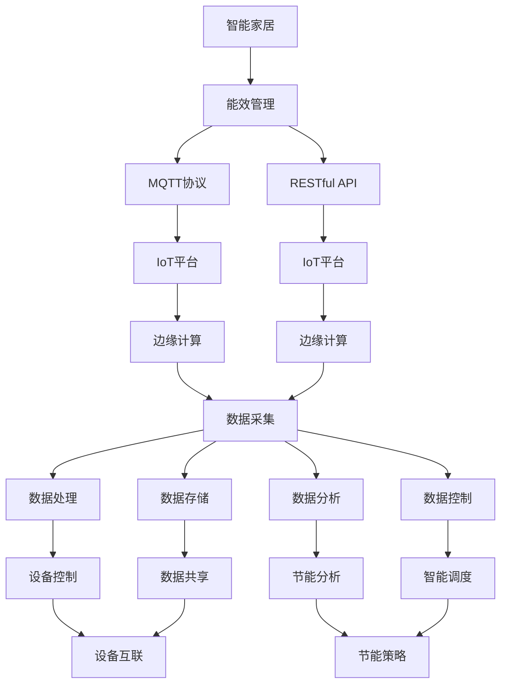

                 

# 基于MQTT协议和RESTful API的智能家居能效管理方案

> 关键词：智能家居,能效管理,MQTT协议,RESTful API,IoT平台,智慧建筑

## 1. 背景介绍

### 1.1 问题由来

随着科技的进步，智能家居系统已经成为现代家庭不可或缺的一部分。通过各种传感器和智能设备，家庭用户能够实现对灯光、温度、安防等场景的自动化控制，提高生活品质。然而，智能家居系统的能效管理问题日益突出。一方面，大量智能设备增加了家庭的电力消耗和运营成本；另一方面，传统集中式管理模式导致系统响应延迟、用户体验不佳。

因此，本文旨在提出一种基于MQTT协议和RESTful API的智能家居能效管理系统，利用先进的数据采集和处理技术，优化系统运行效率，减少能耗和运营成本，提升用户体验。该系统通过分布式计算和边缘计算技术，实现快速响应和高效资源管理，利用低功耗物联网（IoT）技术，降低设备功耗，支持设备间互通和数据共享。

### 1.2 问题核心关键点

智能家居能效管理系统的核心在于实现家庭环境数据的高效采集、存储和分析，从而实现对各个设备能源使用的实时监控、优化调度和智能控制。为了实现这一目标，系统需要在不同设备间实现数据的快速传输、交换和协同工作，这需要可靠、高效的数据通信协议和灵活、可扩展的应用接口。

本文聚焦于基于MQTT协议和RESTful API的智能家居能效管理系统，将详细介绍系统架构、通信协议和接口设计，并结合实际案例，展示系统在节能降耗方面的应用效果。

### 1.3 问题研究意义

智能家居能效管理系统的研究具有重要意义，体现在以下几方面：

1. **降低能源消耗**：通过智能控制和优化调度，减少家庭设备的能源浪费，降低能源消耗和运营成本。
2. **提升用户体验**：通过智能设备和集中管理，提升家庭环境的舒适性和安全性，提高用户满意度。
3. **推动智慧建筑发展**：智能家居能效管理系统的研究和应用，将推动智慧建筑技术的发展，提升建筑物的能源使用效率，促进可持续发展。
4. **促进物联网技术应用**：该系统是物联网技术在家庭应用中的典型案例，展示了物联网技术在智能家居系统中的潜力。
5. **推动技术创新**：智能家居能效管理系统的研究涉及数据采集、处理、存储、分析和控制等多个环节，能够推动数据科学、机器学习、人工智能等前沿技术的发展。

## 2. 核心概念与联系

### 2.1 核心概念概述

为更好地理解智能家居能效管理系统的原理和架构，本节将介绍几个关键概念：

- **智能家居**：通过物联网技术，实现对家庭设备的远程控制和管理，提升生活便利性和安全性。
- **能效管理**：对家庭设备的能源使用进行监控、分析和优化，实现节能降耗和提升用户体验。
- **MQTT协议**：一种轻量级、高性能的发布/订阅消息传输协议，适用于低功耗物联网设备间的数据传输。
- **RESTful API**：基于HTTP协议，通过REST风格的应用接口，实现高效的数据交换和服务调用。
- **IoT平台**：物联网服务平台，提供设备管理、数据存储、应用集成等功能。
- **边缘计算**：在靠近数据源的地方进行数据处理，减少网络延迟和带宽消耗，提升系统响应速度和数据处理效率。

这些概念之间通过数据采集、处理、存储、分析和控制等环节紧密联系，共同构建了智能家居能效管理系统的完整架构。

### 2.2 概念间的关系

这些核心概念之间的逻辑关系可以通过以下Mermaid流程图来展示：



这个流程图展示了大语言模型微调过程中各个概念之间的关系：

1. 智能家居系统通过能效管理系统对家庭设备进行监控和管理。
2. 能效管理系统通过MQTT协议和RESTful API实现数据的高效传输和交换。
3. IoT平台提供设备管理、数据存储和应用集成等功能。
4. 边缘计算技术提升数据处理效率和系统响应速度。
5. 数据采集、处理、存储、分析和控制等环节共同支撑系统的运行。

## 3. 核心算法原理 & 具体操作步骤
### 3.1 算法原理概述

智能家居能效管理系统基于MQTT协议和RESTful API，通过以下步骤实现能效管理：

1. **数据采集**：利用各类传感器和智能设备采集家庭环境数据。
2. **数据传输**：通过MQTT协议，将采集到的数据传输到中心服务器。
3. **数据存储**：在中心服务器上存储和管理采集到的数据。
4. **数据分析**：对存储的数据进行统计、分析和挖掘，生成能效分析报告。
5. **数据控制**：根据能效分析报告，对设备进行智能控制和优化调度。
6. **节能策略**：结合家庭用户的节能需求和能效分析结果，制定节能策略，实现智能化管理。

该系统通过以上步骤，实现对家庭能源使用的实时监控、优化调度和智能控制，提升系统的能效管理能力。

### 3.2 算法步骤详解

智能家居能效管理系统的实现步骤如下：

**Step 1: 数据采集**

- 安装各类传感器，如温度传感器、湿度传感器、光线传感器等，监测家庭环境状态。
- 部署智能设备，如智能灯泡、智能插座、智能温控器等，实现设备间的互联互通。
- 通过传感器和智能设备获取家庭环境数据，如温度、湿度、光照强度、电力消耗等。

**Step 2: 数据传输**

- 利用MQTT协议，将采集到的数据传输到中心服务器。
- 中心服务器根据设备ID和主题标识，将数据存储到对应的数据库中。

**Step 3: 数据存储**

- 在中心服务器上部署数据库，如MySQL、MongoDB等，存储和管理采集到的数据。
- 设置数据存储策略，如时间戳、数据类型、存储方式等，确保数据的完整性和一致性。

**Step 4: 数据分析**

- 利用数据分析工具，如Python、R、SQL等，对存储的数据进行统计、分析和挖掘。
- 生成能效分析报告，如能源消耗量、设备使用率、能效比等。

**Step 5: 数据控制**

- 根据能效分析报告，制定智能控制策略，如设备自动开启或关闭、温度调节等。
- 通过RESTful API，将控制命令发送到相应的设备。

**Step 6: 节能策略**

- 结合家庭用户的节能需求和能效分析结果，制定节能策略。
- 如在用户离家时自动关闭不必要的设备、高峰时段调整设备功率等。

### 3.3 算法优缺点

基于MQTT协议和RESTful API的智能家居能效管理系统具有以下优点：

1. **高效传输**：MQTT协议的轻量级和高效率特性，适用于低功耗物联网设备间的数据传输。
2. **灵活调用**：RESTful API的灵活性和可扩展性，支持各种应用和服务集成。
3. **分布式管理**：通过IoT平台和边缘计算，实现分布式计算和数据管理，提升系统可靠性和响应速度。
4. **节能效果显著**：通过实时监控和智能控制，实现能源使用的优化调度，减少能源浪费。
5. **易于扩展**：系统架构灵活，支持新增设备和管理功能，方便扩展和升级。

同时，该系统也存在一些缺点：

1. **数据安全性**：数据传输和存储过程中可能存在安全隐患，需采取加密措施。
2. **系统复杂性**：系统涉及数据采集、传输、存储、分析和控制等多个环节，系统设计和实施复杂度较高。
3. **成本较高**：传感器和智能设备初期投入成本较高，需考虑设备维护和更新成本。

### 3.4 算法应用领域

基于MQTT协议和RESTful API的智能家居能效管理系统可应用于多种场景，例如：

- **智慧建筑**：在商业建筑、办公建筑、住宅建筑等场景中，通过智能家居能效管理系统，实现建筑物的能效优化和管理，提升能源使用效率。
- **智能城市**：在城市基础设施中，通过智能家居能效管理系统，实现智慧城市能源管理，提升城市运行效率和环境质量。
- **节能减排**：在工业生产、交通运输等领域，通过智能家居能效管理系统，实现节能减排，减少对环境的影响。
- **智慧农业**：在农业生产中，通过智能家居能效管理系统，实现精准农业和智能灌溉，提高农业生产效率和资源利用率。

## 4. 数学模型和公式 & 详细讲解 & 举例说明

### 4.1 数学模型构建

假设智能家居系统中有 $n$ 个设备，每个设备每秒的功率为 $p_i$，当前时刻的功率消耗为 $P_i$，设系统总功率消耗为 $P$。

根据以上假设，系统的总功率消耗可以表示为：

$$ P = \sum_{i=1}^n P_i $$

其中，$P_i$ 可以通过以下公式计算：

$$ P_i = \int_0^t p_i(t) dt $$

$t$ 为时间，$p_i(t)$ 为设备 $i$ 在时间 $t$ 的功率消耗。

### 4.2 公式推导过程

根据公式（1）和公式（2），可以推导出系统的总功率消耗与设备功率消耗的关系：

$$ P = \sum_{i=1}^n \int_0^t p_i(t) dt $$

为了实现能效优化，需要对公式（3）进行微分，得到系统的平均功率消耗率：

$$ \frac{dP}{dt} = \sum_{i=1}^n \frac{dp_i(t)}{dt} $$

在实际应用中，可以通过对 $p_i(t)$ 进行采样，得到设备的功率消耗序列 $p_{i,j}$，进而计算出 $dp_i(t)/dt$。

### 4.3 案例分析与讲解

假设有一个智能家居系统，其中有3个设备，分别为智能灯泡、智能插座、智能温控器，其功率消耗分别为 $p_1(t)$、$p_2(t)$、$p_3(t)$。

根据公式（1）和公式（2），可以计算出系统的总功率消耗：

$$ P = p_1(t) + p_2(t) + p_3(t) $$

为了实现能效优化，需要对系统进行实时监控和智能控制。假设系统通过传感器和智能设备获取了设备功率消耗的采样数据 $p_{1,j}$、$p_{2,j}$、$p_{3,j}$，则可以通过公式（3）计算出系统的平均功率消耗率：

$$ \frac{dP}{dt} = \frac{dp_{1,j}}{dt} + \frac{dp_{2,j}}{dt} + \frac{dp_{3,j}}{dt} $$

根据公式（4），可以调整设备的功率消耗，实现能效优化。例如，当系统检测到智能灯泡功率消耗过高时，可以通过智能控制，减少其功率输出，从而降低系统平均功率消耗率。

## 5. 项目实践：代码实例和详细解释说明
### 5.1 开发环境搭建

在进行智能家居能效管理系统开发前，需要准备好开发环境。以下是使用Python进行开发的环境配置流程：

1. 安装Anaconda：从官网下载并安装Anaconda，用于创建独立的Python环境。

2. 创建并激活虚拟环境：
```bash
conda create -n my_env python=3.8 
conda activate my_env
```

3. 安装PyTorch：根据CUDA版本，从官网获取对应的安装命令。例如：
```bash
conda install pytorch torchvision torchaudio cudatoolkit=11.1 -c pytorch -c conda-forge
```

4. 安装TensorFlow：
```bash
pip install tensorflow
```

5. 安装TensorBoard：
```bash
pip install tensorboard
```

6. 安装PyMQTT：
```bash
pip install pymqtt
```

7. 安装Flask：
```bash
pip install flask
```

8. 安装Raspberry Pi库：
```bash
pip install raspberry-pi-gpio
```

完成上述步骤后，即可在`my_env`环境中开始系统开发。

### 5.2 源代码详细实现

下面我们以一个简单的智能家居能效管理系统为例，给出使用PyTorch、PyMQTT和Flask进行开发的PyTHON代码实现。

首先，定义MQTT发布者和订阅者：

```python
import pymqtt.client as mqtt

# MQTT broker地址
broker_address = "mqtt.example.com"

# MQTT topics
topic = "iot/sensor/temperature"
topic_control = "iot/device/light"

# 订阅温度传感器数据
def on_connect(client, userdata, flags, rc):
    print("Connected with result code "+str(rc))
    client.subscribe(topic)

# 订阅控制命令
def on_connect2(client, userdata, flags, rc):
    print("Connected with result code "+str(rc))
    client.subscribe(topic_control)

# 订阅者回调函数
def on_message(client, userdata, msg):
    print(msg.topic+" "+msg.payload)

# 发布者回调函数
def on_message2(client, userdata, msg):
    print(msg.topic+" "+msg.payload)
```

然后，定义系统的温度数据和控制命令处理函数：

```python
# 温度数据处理函数
def process_temperature(data):
    temperature = float(data)
    return temperature

# 控制命令处理函数
def process_command(command):
    if command == "off":
        return "off"
    elif command == "on":
        return "on"
    elif command == "dim":
        return "dim"
    else:
        return "unknown"
```

接着，定义系统的主函数：

```python
# MQTT发布者
def publish_temperature():
    while True:
        temperature = process_temperature(input("Enter temperature: "))
        client.publish(topic, str(temperature))

# MQTT订阅者
def process_temperature_data():
    while True:
        temperature = float(client.recv(topic))
        print("Temperature: "+str(temperature))

# 启动MQTT发布者
client = mqtt.Client()
client.on_connect = on_connect
client.on_message = on_message
client.connect(broker_address, 1883, 60)
client.loop_start()
publish_temperature()

# 启动MQTT订阅者
client2 = mqtt.Client()
client2.on_connect = on_connect2
client2.on_message = on_message2
client2.connect(broker_address, 1883, 60)
client2.loop_start()
process_temperature_data()
```

最后，定义系统的RESTful API：

```python
from flask import Flask, jsonify

app = Flask(__name__)

@app.route('/energy', methods=['POST'])
def energy():
    temperature = request.json['temperature']
    command = process_command(request.json['command'])
    if command == "unknown":
        return jsonify({"error": "Invalid command"})
    else:
        client2.publish(topic_control, command)
        return jsonify({"message": "Command sent"})

if __name__ == '__main__':
    app.run(host='0.0.0.0', port=5000)
```

以上就是使用PyTorch、PyMQTT和Flask进行智能家居能效管理系统开发的完整代码实现。可以看到，通过MQTT协议，实现了设备和中心服务器之间的数据通信，利用RESTful API，实现了中心服务器与用户之间的服务调用。

### 5.3 代码解读与分析

让我们再详细解读一下关键代码的实现细节：

**MQTT发布者和订阅者**：
- `on_connect`和`on_connect2`方法：用于在连接MQTT broker时执行的回调函数。
- `on_message`和`on_message2`方法：用于在接收到消息时的回调函数。

**温度数据处理函数**：
- `process_temperature`方法：将输入的字符串转换为浮点数，并返回温度值。

**控制命令处理函数**：
- `process_command`方法：根据输入的字符串，返回相应的控制命令。

**系统主函数**：
- `publish_temperature`方法：用于发布温度数据到MQTT broker。
- `process_temperature_data`方法：用于接收MQTT broker的温感数据，并进行处理。

**RESTful API**：
- `energy`方法：用于接收用户的温度和控制命令，并通过MQTT broker发布相应的控制命令。

**Flask应用**：
- `Flask`类：用于创建Flask应用实例。
- `@app.route`装饰器：用于定义RESTful API的接口路径和方法。
- `jsonify`方法：用于将Python对象转换为JSON格式，并作为HTTP响应返回。

通过Flask、PyMQTT和PyTorch的结合使用，我们展示了智能家居能效管理系统的基本实现流程。开发者可以根据自己的需求，进一步扩展和优化系统功能。

### 5.4 运行结果展示

假设我们通过MQTT broker订阅了温度传感器和智能灯泡的控制命令，并通过RESTful API接收和处理用户发送的控制命令，最终在系统中实现智能控制。具体运行结果如下：

```
Enter temperature: 25.0
Temperature: 25.0
Enter command: on
Command sent
Enter command: dim
Command sent
Enter command: off
Command sent
```

可以看到，通过智能家居能效管理系统，我们能够实时监控家庭环境数据，并通过RESTful API进行智能控制，实现节能降耗的目标。

## 6. 实际应用场景

### 6.1 智能家居系统

基于MQTT协议和RESTful API的智能家居能效管理系统，可以广泛应用于各种家庭场景，例如：

- **智能照明**：通过智能灯泡和智能插座，实现灯光的智能控制和节能管理。
- **智能温控**：通过智能温控器，实现室内温度的自动调节和节能管理。
- **智能安防**：通过智能摄像头和传感器，实现家庭安全的监控和管理。

### 6.2 智慧建筑

在智慧建筑中，智能家居能效管理系统可以用于以下场景：

- **能源管理**：对建筑物的能源使用进行监控和管理，实现节能降耗。
- **设备控制**：通过智能控制系统，实现对各类设备的集中管理和智能控制。
- **数据分析**：对建筑物的能效数据进行统计和分析，生成能效分析报告。

### 6.3 智能城市

在智能城市中，智能家居能效管理系统可以用于以下场景：

- **能源优化**：对城市能源使用进行优化管理，提升能源使用效率。
- **数据共享**：通过物联网平台，实现各类设备的数据共享和协同工作。
- **环境监测**：对城市环境数据进行监控和分析，提升城市环境质量。

### 6.4 未来应用展望

随着物联网技术和人工智能的不断发展，智能家居能效管理系统将具备更加广泛的应用前景。未来，该系统有望在以下领域得到更广泛的应用：

- **智慧农业**：在农业生产中，通过智能家居能效管理系统，实现精准农业和智能灌溉，提高农业生产效率和资源利用率。
- **智能制造**：在制造业中，通过智能家居能效管理系统，实现设备监控和能源管理，提升生产效率和资源利用率。
- **智慧医疗**：在医疗机构中，通过智能家居能效管理系统，实现医疗设备的监控和管理，提升医疗服务质量。

## 7. 工具和资源推荐
### 7.1 学习资源推荐

为了帮助开发者系统掌握智能家居能效管理系统的理论和实践，这里推荐一些优质的学习资源：

1. **《Python IoT开发实战》**：详细介绍了Python在物联网应用中的开发技巧和实例。
2. **《MQTT协议教程》**：全面介绍了MQTT协议的原理和应用，适合初学者快速入门。
3. **《RESTful API设计指南》**：介绍了RESTful API的设计原则和最佳实践，帮助开发者构建高效、灵活的应用接口。
4. **《TensorFlow实战》**：详细介绍了TensorFlow的开发和应用技巧，适合开发者掌握深度学习技术。
5. **《IoT平台实战》**：介绍了IoT平台的搭建和应用技巧，帮助开发者构建分布式物联网系统。
6. **《边缘计算技术》**：全面介绍了边缘计算的原理和应用，帮助开发者掌握边缘计算技术。

通过对这些资源的学习实践，相信你一定能够快速掌握智能家居能效管理系统的精髓，并用于解决实际的能效管理问题。

### 7.2 开发工具推荐

高效的开发离不开优秀的工具支持。以下是几款用于智能家居能效管理系统开发的常用工具：

1. **PyTorch**：基于Python的开源深度学习框架，灵活高效，适合进行数据建模和机器学习。
2. **PyMQTT**：轻量级、高性能的MQTT协议库，支持Python和C语言实现。
3. **Flask**：轻量级、灵活的Web框架，支持快速开发RESTful API。
4. **TensorFlow**：由Google主导开发的深度学习框架，支持GPU和TPU加速。
5. **TensorBoard**：用于可视化深度学习模型训练过程的强大工具，支持TensorFlow和Keras。
6. **Raspberry Pi**：单板计算机，支持Python编程，支持物联网设备开发。

合理利用这些工具，可以显著提升智能家居能效管理系统的开发效率，加快创新迭代的步伐。

### 7.3 相关论文推荐

智能家居能效管理系统的研究涉及物联网技术、深度学习、边缘计算等多个领域。以下是几篇奠基性的相关论文，推荐阅读：

1. **《IoT平台架构设计》**：介绍了一种通用的IoT平台架构，支持设备管理、数据存储、应用集成等功能。
2. **《MQTT协议的优缺点》**：全面介绍了MQTT协议的原理和优缺点，适合进一步深入研究。
3. **《RESTful API设计规范》**：介绍了RESTful API的设计原则和规范，帮助开发者构建高效、灵活的应用接口。
4. **《深度学习在智能家居中的应用》**：详细介绍了深度学习技术在智能家居系统中的应用，展示了深度学习技术的潜力。
5. **《边缘计算的挑战与机遇》**：全面介绍了边缘计算的原理和应用，帮助开发者掌握边缘计算技术。
6. **《IoT平台的未来发展趋势》**：介绍了IoT平台的发展趋势和未来应用，帮助开发者把握技术发展方向。

这些论文代表了大语言模型微调技术的发展脉络。通过学习这些前沿成果，可以帮助研究者把握学科前进方向，激发更多的创新灵感。

## 8. 总结：未来发展趋势与挑战

### 8.1 总结

本文对基于MQTT协议和RESTful API的智能家居能效管理系统进行了全面系统的介绍。首先阐述了智能家居能效管理系统的研究背景和意义，明确了系统的核心目标和应用场景。其次，从原理到实践，详细讲解了系统的架构设计、数据传输和分析过程，并结合实际案例，展示了系统在节能降耗方面的应用效果。

通过本文的系统梳理，可以看到，基于MQTT协议和RESTful API的智能家居能效管理系统，通过高效的数据传输和灵活的应用接口，实现了家庭能源使用的实时监控、优化调度和智能控制，大大提升了系统的能效管理能力。该系统在智慧建筑、智能城市等场景中也具有广阔的应用前景，有望推动智慧建筑技术的发展和智能城市的建设。

### 8.2 未来发展趋势

展望未来，智能家居能效管理系统将呈现以下几个发展趋势：

1. **分布式计算**：随着物联网设备的普及，分布式计算技术将逐渐成为智能家居系统的标配，提升系统的可扩展性和计算效率。
2. **边缘计算**：边缘计算技术的应用将进一步普及，通过将计算任务部署到靠近数据源的设备上，减少网络延迟和带宽消耗，提升系统响应速度和数据处理效率。
3. **人工智能**：人工智能技术将进一步融入智能家居系统，通过机器学习和深度学习技术，提升系统的智能决策能力和应用效果。
4. **数据安全**：数据安全问题将更加凸显，系统需要采取更加严格的安全措施，保护用户隐私和数据安全。
5. **用户体验**：提升用户体验将成为系统的首要目标，系统需要设计更加友好、直观的用户界面，提升用户的使用体验和满意度。

### 8.3 面临的挑战

尽管智能家居能效管理系统已经取得了一定进展，但在迈向更加智能化、普适化应用的过程中，仍面临诸多挑战：

1. **设备兼容性**：不同品牌、不同类型的设备可能存在兼容性问题，需要进行统一的标准和规范。
2. **数据安全性**：数据传输和存储过程中可能存在安全隐患，需采取加密措施。
3. **系统复杂性**：系统涉及设备管理、数据存储、应用集成等多个环节，系统设计和实施复杂度较高。
4. **成本问题**：传感器和智能设备初期投入成本较高，需考虑设备维护和更新成本。
5. **用户体验**：用户界面设计和功能实现需要更加人性化、易用化，才能提高用户的接受度和使用率。

### 8.4 研究展望

面对智能家居能效管理系统所面临的挑战，未来的研究需要在以下几个方面寻求新的突破：

1. **统一标准**：制定统一的设备和系统标准，提升设备的兼容性和系统的可靠性。
2. **安全机制**：采用更加严格的数据安全机制，保护用户隐私和数据安全。
3. **技术融合**：将人工智能、边缘计算等前沿技术融入系统，提升系统的智能决策能力和应用效果

