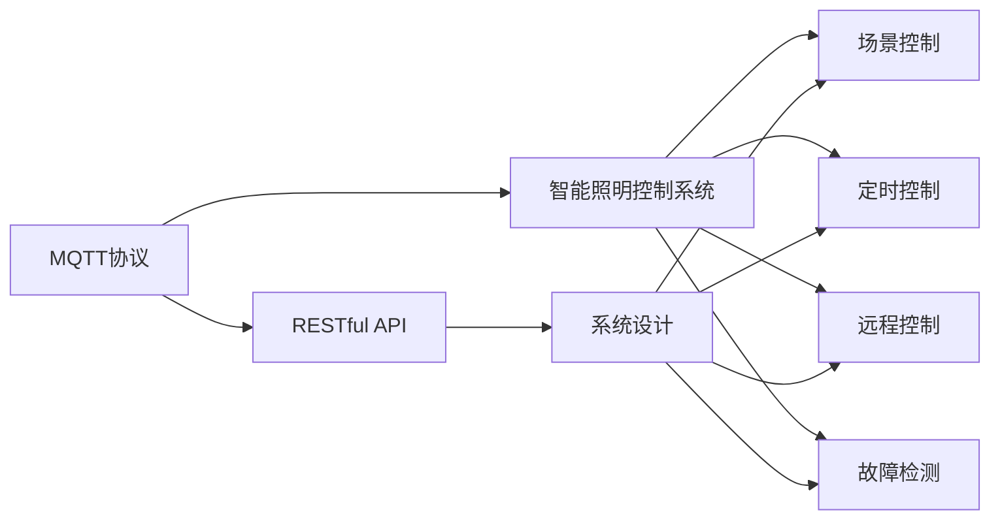

                 

# 基于MQTT协议和RESTful API的智能照明控制系统设计

> 关键词：智能照明, 物联网, MQTT协议, RESTful API, 系统设计, 物联网应用, 软件工程

## 1. 背景介绍

在当今智能化、自动化趋势下，智能照明系统作为智能家居的重要组成部分，已经成为现代城市生活不可或缺的一部分。智能照明不仅能提高能源利用效率，还大幅提升了用户体验。同时，随着物联网(IoT)技术的发展，智能照明系统也在向互联网化、平台化和智能化方向发展。

本文将结合物联网技术，介绍基于MQTT协议和RESTful API的智能照明控制系统设计方案。此方案旨在通过灵活、可靠、易扩展的通信协议和接口设计，实现不同品牌、不同类型的照明设备间的互联互通和统一管理。

## 2. 核心概念与联系

### 2.1 核心概念概述

为了更好地理解智能照明控制系统的设计方案，本节将介绍几个关键概念：

#### 2.1.1 MQTT协议

MQTT (Message Queuing Telemetry Transport) 是一种轻量级的、基于发布/订阅模式的通信协议，适合在资源受限的环境中使用。MQTT协议的主要特点包括：

- 数据传输速率低：适用于带宽有限、网络时延较高的物联网场景。
- 连接数多：支持大量设备同时在线，适合大规模物联网部署。
- 消息可靠传输：确保消息在传输过程中不被丢失。
- 持久化存储：支持消息在离线情况下也能被存储和恢复。

#### 2.1.2 RESTful API

REST (Representational State Transfer)是一种面向资源的操作方式，通过HTTP协议进行通信。RESTful API是基于REST架构风格的API设计规范，具有以下特点：

- 状态无关：客户端和服务器之间无状态交互，API独立于底层系统状态。
- 统一资源定位：通过URL定位资源，使用标准HTTP方法（GET、POST、PUT、DELETE等）进行资源操作。
- 可缓存：支持资源缓存，减少重复传输。
- 可扩展：方便添加新的资源和功能，扩展性强。

#### 2.1.3 智能照明控制系统

智能照明控制系统利用传感器、控制器和执行器，实现照明设备的自动化控制。主要功能包括：

- 场景控制：根据用户需求和环境条件，自动调节照明参数。
- 定时控制：根据时间、日期等设置，自动开启或关闭照明设备。
- 远程控制：通过网络远程控制照明设备，实现远程控制。
- 故障检测：监测照明设备状态，及时发现和处理故障。

#### 2.1.4 系统设计

智能照明控制系统的设计需要考虑以下关键要素：

- 系统架构：确定系统的整体结构和组件关系。
- 通信协议：选择适合的通信协议，确保系统可靠性和扩展性。
- 接口设计：设计统一、易用的API接口，支持设备间的交互。
- 用户界面：设计直观、易用的用户界面，提高用户体验。
- 数据管理：设计数据存储、传输和处理的方案，保证数据安全性和可靠性。

### 2.2 概念间的关系

这些核心概念之间存在着紧密的联系，形成了智能照明控制系统的完整架构。以下用Mermaid流程图来展示：



这个流程图展示出MQTT协议和RESTful API在智能照明控制系统中各自的角色和作用：

- MQTT协议用于设备间的数据通信，确保数据的可靠传输。
- RESTful API用于不同设备间的接口交互，提供统一的操作接口。
- 智能照明控制系统将MQTT协议和RESTful API整合起来，实现设备间的互联互通和统一管理。

## 3. 核心算法原理 & 具体操作步骤
### 3.1 算法原理概述

基于MQTT协议和RESTful API的智能照明控制系统，主要由设备、网关、服务器和用户界面四部分组成。其核心算法原理如下：

1. 设备通过MQTT协议与网关进行通信，将数据上传到网关。
2. 网关接收到数据后，通过RESTful API将数据上传到服务器。
3. 服务器接收到数据后，进行数据分析和处理，根据用户需求和环境条件，生成控制指令。
4. 服务器将控制指令通过RESTful API下发到网关。
5. 网关将控制指令通过MQTT协议下发到设备。
6. 设备执行控制指令，调整照明参数。

通过以上算法，系统实现了设备与服务器间的双向通信，支持设备的自动化控制和远程控制。

### 3.2 算法步骤详解

基于MQTT协议和RESTful API的智能照明控制系统设计步骤包括：

#### 3.2.1 系统架构设计

1. 确定系统的整体架构，包括设备层、网关层、服务器层和用户界面层。
2. 设计各层组件之间的通信协议和接口标准，确保数据传输可靠和接口统一。

#### 3.2.2 通信协议选择

1. 选择适合设备类型和通信环境下的通信协议。
2. 确定协议的消息格式和编码方式，确保数据传输的可靠性和一致性。
3. 对协议进行测试和优化，确保其在实际应用中的性能和稳定性。

#### 3.2.3 接口设计

1. 设计统一的API接口标准，支持不同设备间的互操作性。
2. 定义API接口的功能和参数，确保接口的易用性和可扩展性。
3. 编写API接口的代码，进行单元测试和性能测试，确保接口的可靠性和安全性。

#### 3.2.4 用户界面设计

1. 设计直观、易用的用户界面，提供用户与系统的交互界面。
2. 使用图形化界面，展示照明设备的状态和控制信息。
3. 设计交互式界面，支持用户对照明设备进行远程控制。

#### 3.2.5 数据管理设计

1. 设计数据存储方案，确保数据的安全性和可靠性。
2. 设计数据传输方案，确保数据的实时性和完整性。
3. 设计数据处理方案，确保数据的准确性和可用性。

#### 3.2.6 系统测试

1. 设计系统的测试方案，进行功能测试、性能测试和安全性测试。
2. 对系统进行全面的测试，发现和修复潜在问题。
3. 优化系统的性能，提高系统的稳定性和可靠性。

### 3.3 算法优缺点

基于MQTT协议和RESTful API的智能照明控制系统有以下优点：

1. 简单易用：MQTT协议和RESTful API简单高效，易于实现和维护。
2. 可靠稳定：MQTT协议和RESTful API具有较高的可靠性和稳定性，适合在资源受限的环境中应用。
3. 扩展性强：RESTful API支持标准化接口，易于添加新的功能和组件。
4. 适用范围广：适用于各种类型的物联网设备和网络环境。

其缺点包括：

1. 学习成本高：MQTT协议和RESTful API需要一定的学习成本，需要理解协议和API的使用规范。
2. 安全性问题：MQTT协议和RESTful API需要额外的安全措施，避免被非法访问和攻击。
3. 性能瓶颈：在大规模部署情况下，MQTT协议和RESTful API可能面临性能瓶颈，需要优化。

### 3.4 算法应用领域

基于MQTT协议和RESTful API的智能照明控制系统，在以下领域有着广泛的应用：

1. 商业办公：在商业办公楼中，可以根据时间、人员流量等条件，自动调节照明参数，提升办公环境舒适度。
2. 公共场所：在公共场所，如机场、车站、博物馆等，可以根据人流变化和环境光线，自动调节照明亮度。
3. 住宅建筑：在住宅建筑中，可以根据家庭成员的生活习惯，自动调节照明设备，提升居住体验。
4. 教育场所：在教育场所，如学校、图书馆等，可以根据教学活动，自动调节照明参数，提高教学质量。
5. 工业生产：在工业生产中，可以根据设备状态和环境条件，自动调节照明参数，提高生产效率。

## 4. 数学模型和公式 & 详细讲解 & 举例说明

### 4.1 数学模型构建

在智能照明控制系统中，数据传输和处理是核心环节。假设智能照明系统中设备的数量为$N$，每次数据传输的数据量为$D$，通信延迟为$T$，数据传输速率位$R$。则系统每秒钟传输的数据量为：

$$
T \times \frac{D}{T} = D
$$

其中，$D$为单位时间内的数据传输量。

### 4.2 公式推导过程

在实际应用中，设备之间通过MQTT协议进行数据通信。假设每台设备每秒发送的消息数量为$M$，消息大小为$L$字节。则每台设备每秒发送的数据量为：

$$
M \times L \text{字节/秒}
$$

设系统的总设备数为$N$，则系统每秒发送的数据总量为：

$$
N \times M \times L \text{字节/秒}
$$

根据以上推导，可以看出，系统传输的数据量与设备的数量、消息数量和消息大小有关。

### 4.3 案例分析与讲解

以一个商业办公照明系统为例，假设系统中包含100台照明设备，每台设备每秒发送5条消息，每条消息大小为1000字节。则系统每秒传输的数据量为：

$$
100 \times 5 \times 1000 \text{字节/秒} = 500000 \text{字节/秒}
$$

设数据传输速率为10Mbps，则每秒传输的数据量为：

$$
10 \times 10^6 \text{字节/秒} = 10000000 \text{字节/秒}
$$

由此可以看出，在实际应用中，系统传输的数据量会受到设备的数量、消息数量和消息大小等因素的影响。因此，需要根据实际应用场景，选择合适的通信协议和接口标准，优化数据传输效率。

## 5. 项目实践：代码实例和详细解释说明
### 5.1 开发环境搭建

在进行智能照明控制系统开发前，我们需要准备好开发环境。以下是使用Python进行开发的环境配置流程：

1. 安装Python：从官网下载并安装Python，选择最新版本。
2. 安装MQTT客户端库：通过pip安装MQTT客户端库paho-mqtt。
3. 安装RESTful API客户端库：通过pip安装RESTful API客户端库requests。
4. 安装Web框架：通过pip安装Web框架Flask或Django。
5. 安装数据库库：通过pip安装数据库库如SQLite或MySQL。
6. 配置开发环境：配置开发环境，确保所有库和工具的正常运行。

完成上述步骤后，即可在本地搭建智能照明控制系统的开发环境。

### 5.2 源代码详细实现

我们以一个基于MQTT协议和RESTful API的智能照明控制系统为例，给出完整的代码实现。

首先，安装必要的库和工具：

```python
pip install paho-mqtt requests flask sqlalchemy
```

然后，编写MQTT客户端代码，实现数据收集和上传：

```python
import paho.mqtt.client as mqtt

# 定义MQTT客户端
client = mqtt.Client()

# 定义数据收集函数
def data_collect():
    data = ...
    # 将数据转换为JSON格式
    json_data = {'device_id': 'device1', 'light_level': 100, 'time': '2023-04-01 08:00:00'}
    # 将数据上传至MQTT服务器
    client.publish('sensor/data', json.dumps(json_data))
    # 更新数据库
    insert_data(json_data)

# 定义连接MQTT服务器函数
def connect_mqtt():
    client.on_connect = on_connect
    client.connect('mqtt.example.com', 1883, 60)

# 定义连接成功回调函数
def on_connect(client, userdata, flags, rc):
    print('Connected with result code', str(rc))
    # 订阅数据主题
    client.subscribe('sensor/data')

# 定义数据插入函数
def insert_data(json_data):
    conn = create_conn()
    with conn.begin() as trans:
        # 插入数据
        trans.execute("INSERT INTO data VALUES (?, ?, ?, ?, ?, ?)", (json_data['device_id'], json_data['light_level'], json_data['time'], 0, 0))
    conn.commit()

# 启动MQTT客户端
client.loop_forever()
```

接着，编写RESTful API服务端代码，实现数据管理和控制：

```python
from flask import Flask, request, jsonify

# 初始化Flask应用
app = Flask(__name__)

# 定义API接口
@app.route('/sensor/data', methods=['POST'])
def sensor_data():
    # 获取请求数据
    json_data = request.get_json()
    # 将数据插入数据库
    insert_data(json_data)
    # 返回成功响应
    return jsonify({'status': 'success'})

# 启动Flask应用
if __name__ == '__main__':
    app.run(host='0.0.0.0', port=5000)
```

最后，编写Web界面代码，实现用户交互和控制：

```python
from flask import Flask, render_template, request, jsonify

# 初始化Flask应用
app = Flask(__name__)

# 定义Web界面路由
@app.route('/')
def index():
    # 渲染Web页面
    return render_template('index.html')

# 定义远程控制接口
@app.route('/control', methods=['POST'])
def control():
    # 获取请求参数
    device_id = request.form['device_id']
    light_level = request.form['light_level']
    # 发送控制指令
    send_control(device_id, light_level)
    # 返回成功响应
    return jsonify({'status': 'success'})

# 启动Flask应用
if __name__ == '__main__':
    app.run(host='0.0.0.0', port=8000)
```

其中，`index.html`为Web界面模板，包含用户交互界面。通过以上代码实现，用户可以通过Web界面，实时查看照明设备状态，并进行远程控制。

### 5.3 代码解读与分析

让我们再详细解读一下关键代码的实现细节：

**MQTT客户端代码**：
- 使用`paho-mqtt`库，创建MQTT客户端。
- 定义数据收集函数`data_collect`，用于数据采集和上传。
- 在`data_collect`函数中，将数据转换为JSON格式，并使用MQTT客户端的`publish`方法上传至MQTT服务器。
- 在`on_connect`回调函数中，订阅`sensor/data`主题，实现数据的实时接收。

**RESTful API服务端代码**：
- 使用`flask`库，创建RESTful API服务端。
- 定义`/sensor/data`接口，接收POST请求，将数据插入数据库。
- 在`sensor_data`函数中，获取请求数据，并调用`insert_data`函数将数据插入数据库。
- 返回JSON格式的响应，表示数据插入成功。

**Web界面代码**：
- 使用`flask`库，创建Web界面。
- 定义`/`路由，渲染`index.html`模板，显示用户交互界面。
- 定义`/control`路由，接收POST请求，发送控制指令。
- 在`control`函数中，获取请求参数，并调用`send_control`函数发送控制指令。
- 返回JSON格式的响应，表示控制指令发送成功。

**运行结果展示**

在实际运行中，用户可以通过Web界面，实时查看照明设备状态，并进行远程控制。以下是一个示例结果：

- 用户登录Web界面，可以查看所有照明设备的状态，如设备ID、亮度、时间等。
- 用户可以通过Web界面，发送控制指令，调整照明设备的亮度。
- 系统接收控制指令，将数据通过MQTT协议上传至服务器，并更新数据库。
- 服务器将控制指令通过RESTful API下发到网关，最终实现照明设备的自动化控制。

通过以上示例，可以看出基于MQTT协议和RESTful API的智能照明控制系统，能够实现设备与服务器间的双向通信，支持设备的自动化控制和远程控制，具有较高的可靠性和扩展性。

## 6. 实际应用场景
### 6.1 商业办公

在商业办公楼中，智能照明控制系统可以实时监测人员流量、时间等条件，自动调节照明参数，提升办公环境舒适度。例如，在办公高峰期，系统可以根据人员流量自动增加照明亮度，在办公结束后，系统自动关闭照明设备，节约能源消耗。

### 6.2 公共场所

在公共场所，如机场、车站、博物馆等，智能照明控制系统可以根据人流变化和环境光线，自动调节照明亮度。例如，在人流高峰期，系统自动增加照明亮度，避免照明不足的情况发生；在人流减少时，系统自动减少照明亮度，节约能源消耗。

### 6.3 住宅建筑

在住宅建筑中，智能照明控制系统可以根据家庭成员的生活习惯，自动调节照明设备。例如，在客厅看电影时，系统自动调节灯光亮度和色温，营造舒适的观影环境；在卧室睡眠时，系统自动关闭所有照明设备，保障良好的睡眠质量。

### 6.4 教育场所

在教育场所，如学校、图书馆等，智能照明控制系统可以根据教学活动，自动调节照明参数。例如，在课堂教学时，系统自动调节灯光亮度，避免眩光干扰；在图书馆学习时，系统自动调节灯光色温，营造舒适的阅读环境。

## 7. 工具和资源推荐
### 7.1 学习资源推荐

为了帮助开发者系统掌握智能照明控制系统的理论基础和实践技巧，这里推荐一些优质的学习资源：

1. 《物联网技术与应用》书籍：详细介绍物联网技术的基本原理、架构和应用场景，适合初学者入门。
2. MQTT协议文档：官方文档，详细介绍MQTT协议的规范和使用方法，适合深入学习和研究。
3. RESTful API文档：官方文档，详细介绍RESTful API的设计规范和实现方法，适合开发者学习。
4. Flask官方文档：官方文档，详细介绍Flask框架的使用方法和示例，适合Web开发初学者。
5. MQTT客户端库paho-mqtt文档：官方文档，详细介绍paho-mqtt库的使用方法和示例，适合MQTT开发初学者。
6. RESTful API客户端库requests文档：官方文档，详细介绍requests库的使用方法和示例，适合API开发初学者。

通过对这些资源的学习实践，相信你一定能够快速掌握智能照明控制系统的精髓，并用于解决实际的照明问题。

### 7.2 开发工具推荐

高效的开发离不开优秀的工具支持。以下是几款用于智能照明控制系统开发的常用工具：

1. Python编程语言：免费、开源、易用，是物联网、Web开发和API开发的主流语言。
2. MQTT客户端库paho-mqtt：快速、高效、易用的MQTT客户端库，适合在资源受限的环境中应用。
3. RESTful API客户端库requests：易用、灵活、可扩展的RESTful API客户端库，支持HTTP协议的多种方法。
4. Web框架Flask：轻量级、易用、可扩展的Web框架，适合快速开发Web应用。
5. 数据库SQLite或MySQL：快速、易用、可靠的数据库系统，适合存储和管理数据。
6. IDE PyCharm：功能强大的IDE工具，支持Python、Flask和SQLite等技术栈，适合开发复杂系统。

合理利用这些工具，可以显著提升智能照明控制系统开发的效率，加快创新迭代的步伐。

### 7.3 相关论文推荐

智能照明控制系统的研究涉及物联网技术、通信协议、接口设计等多个领域。以下是几篇奠基性的相关论文，推荐阅读：

1. MQTT协议标准：详细定义了MQTT协议的规范和使用方法，是MQTT开发的重要参考资料。
2. RESTful API设计规范：详细介绍RESTful API的设计原则和方法，是API开发的重要参考资料。
3. 智能照明控制系统设计：介绍智能照明控制系统的整体架构和关键技术，是智能照明开发的重要参考资料。
4. Web应用开发技术：介绍Web应用开发的基本原理和常用技术，是Web开发的重要参考资料。
5. 数据库设计技术：介绍数据库设计的基本原理和常用技术，是数据库开发的重要参考资料。

这些论文代表了大语言模型微调技术的发展脉络。通过学习这些前沿成果，可以帮助研究者把握学科前进方向，激发更多的创新灵感。

## 8. 总结：未来发展趋势与挑战
### 8.1 总结

本文对基于MQTT协议和RESTful API的智能照明控制系统进行了全面系统的介绍。首先阐述了智能照明控制系统的研究背景和意义，明确了系统设计的重要性。其次，从原理到实践，详细讲解了智能照明控制系统的核心算法原理和具体操作步骤，给出了智能照明控制系统的完整代码实例。同时，本文还广泛探讨了智能照明控制系统在商业办公、公共场所、住宅建筑、教育场所等实际应用场景中的应用前景，展示了智能照明控制系统的巨大潜力。最后，本文精选了智能照明控制系统的学习资源、开发工具和相关论文，力求为读者提供全方位的技术指引。

通过本文的系统梳理，可以看出基于MQTT协议和RESTful API的智能照明控制系统，是物联网技术在智能家居领域的典型应用之一。该系统通过MQTT协议和RESTful API，实现了设备与服务器间的双向通信，支持设备的自动化控制和远程控制，具有较高的可靠性和扩展性。未来，随着物联网技术的发展和应用场景的拓展，基于MQTT协议和RESTful API的智能照明控制系统必将在更多领域得到应用，为人类生产和生活带来新的变革。

### 8.2 未来发展趋势

展望未来，智能照明控制系统将呈现以下几个发展趋势：

1. 物联网技术进一步发展：随着物联网技术的不断成熟，智能照明控制系统将能够整合更多的传感器和执行器，实现更全面、更精细的环境监测和控制。
2. 通信协议多样化：未来将出现更多的通信协议和接口标准，如5G、NB-IoT等，为智能照明控制系统提供更多的选择。
3. 数据处理技术进步：随着大数据和云计算技术的发展，智能照明控制系统将能够处理更多的数据，进行更复杂的分析和预测。
4. 人工智能技术融合：未来将更多地融合人工智能技术，如机器学习、深度学习等，提升系统的智能化水平。
5. 用户界面优化：未来将更加注重用户界面的设计，提供更加直观、易用的交互界面，提升用户体验。

以上趋势凸显了智能照明控制系统的广阔前景。这些方向的探索发展，必将进一步提升系统的性能和应用范围，为人类生产和生活带来新的变革。

### 8.3 面临的挑战

尽管智能照明控制系统已经取得了瞩目成就，但在迈向更加智能化、普适化应用的过程中，它仍面临着诸多挑战：

1. 数据安全和隐私问题：智能照明控制系统需要处理大量的用户数据，如何保护数据安全和用户隐私是一个重要问题。
2. 系统复杂度增加：智能照明控制系统需要整合更多的传感器和执行器，系统复杂度将不断增加，如何保证系统的稳定性和可靠性是一个重要问题。
3. 通信协议适配问题：智能照明控制系统需要适配不同的通信协议和接口标准，如何保证系统的兼容性和扩展性是一个重要问题。
4. 硬件资源限制：智能照明控制系统需要具备较高的计算和存储能力，如何保证系统的性能和成本是一个重要问题。
5. 用户体验设计：智能照明控制系统需要提供直观、易用的用户界面，如何保证用户界面的友好性和易用性是一个重要问题。

### 8.4 研究展望

面对智能照明控制系统面临的种种挑战，未来的研究需要在以下几个方面寻求新的突破：

1. 数据安全与隐私保护：引入加密技术和区块链技术，保护数据安全和用户隐私。
2. 系统稳定性和可靠性：优化系统架构和算法，提高系统的稳定性和可靠性。
3. 通信协议兼容性：引入标准化接口和协议，提高系统的兼容性和扩展性。
4. 硬件资源优化：引入边缘计算和云计算技术，优化系统的计算和存储能力。
5. 用户体验优化：引入交互设计和用户反馈机制，提升用户界面的友好性和易用性。

这些研究方向的探索，必将引领智能照明控制系统迈向更高的台阶，为人类生产和生活带来新的变革。未来，智能照明控制系统必将在更多领域得到应用，为人类生产和生活带来新的变革。

## 9. 附录：常见问题与解答
**Q1：智能照明控制系统的关键技术有哪些？**

A: 智能照明控制系统的关键技术主要包括MQTT协议、RESTful API、Web界面设计、数据管理等。其中，MQTT协议用于设备间的通信，RESTful API用于不同设备间的接口交互，Web界面设计用于用户与系统的交互，数据管理用于数据的存储、传输和处理。

**Q2：智能照明控制系统如何实现设备的自动化控制？**

A: 智能照明控制系统通过MQTT协议和RESTful API，实现设备与服务器间的双向通信，支持设备的自动化控制和远程控制。具体来说，设备通过MQTT协议将数据上传至服务器，服务器根据用户需求和环境条件，生成控制指令，并通过RESTful API下发到网关，最终控制照明设备。

**Q3：智能照明控制系统如何保证数据安全和用户隐私？**

A: 智能照明控制系统需要引入加密技术和区块链技术，保护数据安全和用户隐私。具体来说，可以采用SSL/TLS协议进行数据加密传输，使用公钥加密技术进行用户认证，使用区块链技术进行数据溯源和防篡改。

**Q4：智能照明控制系统如何优化系统性能和成本？**

A: 智能照明控制系统可以引入边缘计算和云计算技术，优化系统的计算和存储能力。具体来说，可以将数据存储在云端，减少本地存储压力；将部分计算任务在边缘设备上完成，减少网络传输负担。

**Q5：智能照明控制系统如何优化用户界面设计？**

A: 智能照明控制系统需要引入交互设计和用户反馈机制，提升用户界面的友好性和易用性。具体来说，可以采用图形化界面设计，使用交互式界面，支持用户对照明设备进行远程控制；同时，通过用户反馈机制，不断优化用户界面，提升用户体验。

