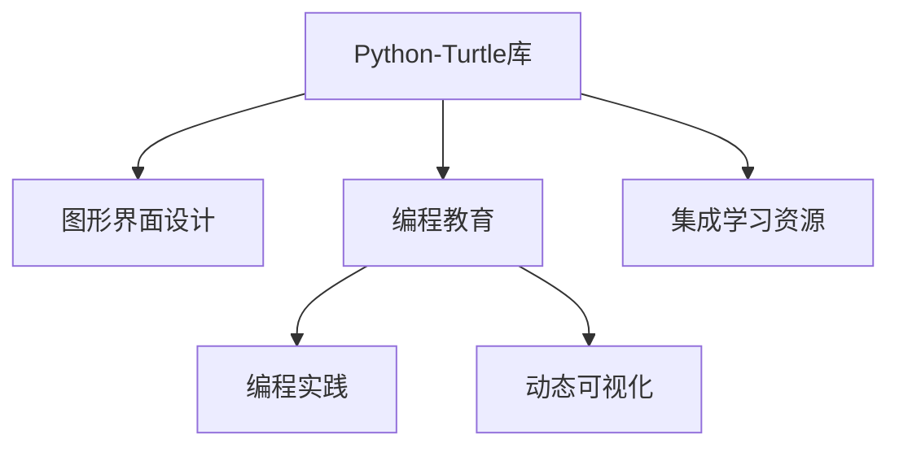

                 

# 基于Python-Turtle库的扩展助学小程序可视化实现

> 关键词：Python-Turtle, 图形界面设计, 教育技术, 编程学习, 可视化工具

## 1. 背景介绍

### 1.1 问题由来
在现代社会中，教育技术（EdTech）扮演着越来越重要的角色。传统的教育模式已经无法满足现代社会的教育需求，尤其是在基础教育阶段，对于图形化编程学习的普及化需求日益增长。Python-Turtle库作为一种简单易用的图形编程工具，能够帮助学生通过绘图的方式理解编程逻辑，是一种十分有效的教育手段。然而，Python-Turtle库的默认功能较为有限，无法满足一些复杂图形界面设计的需求。

为解决这一问题，本文提出了一种基于Python-Turtle库的扩展助学小程序，通过扩展Turtle库的界面设计功能，使其能够满足更多样化的编程教育需求。该小程序不仅能够帮助学生学习基本的编程逻辑，还能在实际编程项目中灵活应用，进一步提升编程能力和应用实践水平。

### 1.2 问题核心关键点
本文的目的是通过扩展Python-Turtle库，实现一个图形界面设计助手小程序，用于辅助编程教育。该小程序的核心关键点包括：

- 界面设计助手：通过扩展Turtle库的图形界面设计功能，帮助学生进行图形界面设计，提升其编程能力和设计感。
- 编程项目示例：提供一系列编程项目示例，供学生参考学习，增强其编程实践经验。
- 动态可视化输出：通过Turtle库实现编程代码的动态可视化输出，使学生能够直观地看到程序执行结果，增强其编程体验和理解力。
- 集成学习资源：集成教育资源，如教程、习题、代码样例等，丰富编程教育内容，帮助学生系统掌握编程知识。

## 2. 核心概念与联系

### 2.1 核心概念概述

为更好地理解本文提出的扩展助学小程序，本节将介绍几个密切相关的核心概念：

- Python-Turtle库：一个基于Python的图形编程库，提供了一个简单的界面，允许用户通过简单的代码控制画布上的图形对象。
- 图形界面设计（GUI）：一种计算机用户界面，使用图形而不是文字进行操作。通常用于开发应用程序的用户界面。
- 编程教育：通过编程方式进行的教育活动，旨在培养学生的编程思维和解决问题的能力。
- 编程实践：通过实际编程项目，提升学生的编程技能和应用能力。
- 动态可视化：通过编程代码实现图形界面和数据可视化的动态显示，增强学生的编程体验和理解力。

这些核心概念之间存在着紧密的联系，构成了编程教育与图形界面设计辅助的完整生态系统。Python-Turtle库作为图形编程的入门工具，为学生提供了丰富的编程实践平台，而图形界面设计的扩展助学小程序，进一步丰富了编程教育的内容和形式，帮助学生更好地掌握编程技能和设计能力。

### 2.2 概念间的关系

这些核心概念之间的逻辑关系可以通过以下Mermaid流程图来展示：



这个流程图展示了大语言模型微调过程中各个核心概念的关系和作用：

1. Python-Turtle库作为基础，提供了编程教育和实践的平台。
2. 图形界面设计的扩展助学小程序，进一步提升了编程教育的趣味性和实用性。
3. 编程实践和动态可视化，增强了学生对编程的理解和应用能力。
4. 集成学习资源，丰富了编程教育的内容，帮助学生系统掌握编程知识。

这些概念共同构成了编程教育的完整生态系统，使其能够更好地满足现代社会的教育需求。通过理解这些核心概念，我们可以更好地把握编程教育与图形界面设计辅助的实现方法和实践路径。

## 3. 核心算法原理 & 具体操作步骤
### 3.1 算法原理概述

本文提出的扩展助学小程序，主要基于Python-Turtle库的图形界面设计功能，通过扩展其界面设计工具包，实现了更丰富、更灵活的界面设计助手。该小程序的算法原理如下：

1. **界面设计助手**：通过Turtle库提供的基本绘图函数，帮助学生进行图形界面设计，提升其编程能力和设计感。
2. **编程项目示例**：提供一系列编程项目示例，供学生参考学习，增强其编程实践经验。
3. **动态可视化输出**：通过Turtle库实现编程代码的动态可视化输出，使学生能够直观地看到程序执行结果，增强其编程体验和理解力。
4. **集成学习资源**：集成教育资源，如教程、习题、代码样例等，丰富编程教育内容，帮助学生系统掌握编程知识。

### 3.2 算法步骤详解

以下是基于Python-Turtle库的扩展助学小程序的具体操作步骤：

#### 3.2.1 界面设计助手

1. **界面设计工具包扩展**：在Python-Turtle库的基础上，扩展其界面设计工具包，增加更多的绘图函数和控件，使其能够满足更多样化的编程教育需求。例如，可以添加文本框、按钮、滑块等控件，供学生进行界面设计。

2. **界面设计示例**：提供一系列界面设计示例，供学生参考学习。例如，可以提供简单的登录界面、游戏界面、计算器界面等，帮助学生掌握界面设计的基本方法和技巧。

3. **界面设计练习**：通过Turtle库的绘图函数，让学生进行界面设计练习。例如，可以要求学生设计一个简单的记账本界面，包括文字输入、日期显示、数据保存等功能。

#### 3.2.2 编程项目示例

1. **编程项目集锦**：收集一系列编程项目示例，供学生参考学习。例如，可以包括天气预报、股票行情分析、音乐播放系统等项目，涵盖不同的编程方向和应用场景。

2. **项目代码实现**：提供项目代码的详细实现步骤，帮助学生理解编程逻辑和实现方法。例如，可以提供每个项目的代码注释和关键代码段，使其能够逐步掌握编程技能。

3. **项目实践练习**：通过Turtle库的绘图函数，让学生进行项目实践练习。例如，可以要求学生实现一个简单的音乐播放系统，包括播放、暂停、跳过等功能。

#### 3.2.3 动态可视化输出

1. **动态可视化设计**：通过Turtle库实现编程代码的动态可视化输出，使学生能够直观地看到程序执行结果。例如，可以设计一个动态绘制抛物线的程序，通过改变参数实现图形的动态变化。

2. **动态可视化实现**：使用Turtle库的绘图函数，实现动态可视化的具体实现步骤。例如，可以要求学生实现一个动态绘制饼图的程序，通过改变数据实现饼图的动态显示。

3. **动态可视化展示**：通过Turtle库的绘图函数，展示动态可视化的最终结果。例如，可以展示一个动态绘制折线图的界面，供学生进行直观体验。

#### 3.2.4 集成学习资源

1. **教程和习题**：集成教育资源，如编程教程、编程习题等，丰富编程教育内容。例如，可以提供Python编程基础教程、算法设计与分析教程等，帮助学生系统掌握编程知识。

2. **代码样例**：提供代码样例，供学生参考学习。例如，可以提供Python编程语言的常用函数、模块等代码样例，帮助学生提升编程技能。

3. **互动问答**：集成互动问答系统，供学生进行编程问题解答。例如，可以提供一个在线问答系统，供学生提出编程问题，由教师或同学进行解答。

### 3.3 算法优缺点

基于Python-Turtle库的扩展助学小程序，具有以下优点：

1. **易于使用**：Python-Turtle库本身具有简单易用的特点，扩展后的界面设计助手和编程项目示例，进一步提升了用户体验，使得学生能够轻松上手。

2. **功能丰富**：通过扩展Turtle库的界面设计工具包，增加了更多的绘图函数和控件，使得学生可以进行更复杂的界面设计。

3. **实践性强**：提供一系列编程项目示例和实践练习，增强了学生的编程实践经验，使其能够更好地理解和应用编程知识。

4. **动态可视化**：通过Turtle库实现编程代码的动态可视化输出，增强了学生的编程体验和理解力，使得编程学习更加直观和生动。

5. **集成学习资源**：集成教育资源，丰富了编程教育内容，帮助学生系统掌握编程知识，提升了编程教育的系统性和完整性。

同时，该小程序也存在一些缺点：

1. **学习曲线较陡峭**：尽管扩展后的界面设计助手和编程项目示例，使得学生能够轻松上手，但对于一些复杂的功能和应用，学习曲线仍然较为陡峭，需要一定的时间和精力进行学习和实践。

2. **计算资源消耗较大**：由于需要动态可视化输出，计算资源消耗较大，可能导致计算机性能受限。

3. **交互体验有待提升**：尽管集成了互动问答系统，但在实际应用中，交互体验仍有待提升，需要进一步优化和改进。

4. **学习效果因人而异**：尽管提供了丰富的编程教育资源和实践练习，但学生的学习效果因个体差异而有所不同，需要教师进行个性化的指导和辅导。

### 3.4 算法应用领域

基于Python-Turtle库的扩展助学小程序，可以应用于以下几个领域：

1. **基础教育**：在基础教育阶段，通过扩展助学小程序进行编程教育，提升学生的编程能力和设计感，增强其对编程的兴趣和理解力。

2. **高等教育**：在高等教育阶段，通过扩展助学小程序进行编程教育，提升学生的编程技能和应用能力，为其后续研究和实践奠定基础。

3. **职业培训**：在职业培训阶段，通过扩展助学小程序进行编程教育，提升学员的编程技能和实践能力，为其职业发展提供技术支持。

4. **自学平台**：在自学平台中，通过扩展助学小程序进行编程教育，提升自学者的编程技能和实践能力，使其能够自主学习编程知识。

5. **企业培训**：在企业培训中，通过扩展助学小程序进行编程教育，提升员工的编程技能和实践能力，提升企业的技术实力和创新能力。

综上所述，基于Python-Turtle库的扩展助学小程序，具有广泛的应用前景，可以在多个领域中进行推广和应用。

## 4. 数学模型和公式 & 详细讲解 & 举例说明

### 4.1 数学模型构建

本文提出的扩展助学小程序，主要通过Python-Turtle库进行界面设计和编程实践。因此，我们不需要构建复杂的数学模型，而是需要理解Turtle库的绘图函数和编程逻辑。

### 4.2 公式推导过程

由于Turtle库的绘图函数和编程逻辑较为简单，因此我们不需要进行复杂的公式推导。以下是一些常用的Turtle库绘图函数和编程逻辑：

1. **移动函数**：`penup()`和`pendown()`函数用于控制画笔的抬起和落下，`forward()`和`backward()`函数用于控制画笔的前进和后退。

2. **绘图函数**：`dot()`函数用于绘制圆形，`begin_fill()`和`end_fill()`函数用于填充图形，`begin_poly()`和`end_poly()`函数用于绘制多边形。

3. **编程逻辑**：使用`if-else`语句和循环语句，实现程序的逻辑控制和数据处理。例如，通过`for`循环，控制画笔绘制指定图形。

### 4.3 案例分析与讲解

以下是一个简单的编程项目示例，通过Turtle库实现一个简单的抛物线绘制程序：

```python
import turtle

# 创建画布和画笔
t = turtle.Turtle()

# 设置画笔颜色和宽度
t.pencolor('red')
t.pensize(2)

# 绘制抛物线
for i in range(100):
    t.forward(i**2)
    t.right(2)

# 显示画布
turtle.done()
```

这段代码中，通过`for`循环，控制画笔绘制抛物线。循环变量`i`表示当前绘制的位置，`i**2`表示当前位置的纵坐标，`forward()`函数控制画笔前进，`right()`函数控制画笔旋转。

通过这样的案例分析，我们可以更好地理解Turtle库的绘图函数和编程逻辑，提升学生的编程实践能力。

## 5. 项目实践：代码实例和详细解释说明
### 5.1 开发环境搭建

在进行编程项目示例的实现前，我们需要准备好开发环境。以下是使用Python进行Turtle库开发的环境配置流程：

1. 安装Python：从官网下载并安装Python，根据不同的操作系统选择相应的安装版本。

2. 安装Turtle库：使用Python的`pip`命令安装Turtle库，例如：

   ```bash
   pip install turtle
   ```

3. 创建项目文件夹：创建一个新的项目文件夹，用于存放编程项目示例的代码文件。

4. 编写代码：在项目文件夹下，创建一个新的Python脚本文件，编写编程项目示例的代码。

5. 运行代码：使用Python的`python`命令，运行编写好的Python脚本文件，例如：

   ```bash
   python project.py
   ```

完成上述步骤后，即可在项目文件夹中进行编程项目示例的实现。

### 5.2 源代码详细实现

以下是使用Turtle库实现一个简单的记账本程序的示例代码：

```python
import turtle
import time

# 创建画布和画笔
t = turtle.Turtle()
t.speed(0)
t.pensize(2)
t.up()
t.goto(50, -100)

# 绘制记账本界面
for i in range(5):
    t.forward(100)
    t.down()
    t.pencolor('black')
    t.fillcolor('white')
    t.begin_fill()
    t.circle(5)
    t.end_fill()
    t.up()
    t.forward(50)
    t.down()
    t.pencolor('black')
    t.fillcolor('white')
    t.begin_fill()
    t.rectangle(50, 20)
    t.end_fill()
    t.up()
    t.forward(50)
    t.down()
    t.fillcolor('white')
    t.begin_fill()
    t.circle(5)
    t.end_fill()
    t.up()
    t.goto(50, -100 - i * 40)

# 绘制记账本数据
t.penup()
t.goto(-50, -100 - 3 * 40)
t.pendown()
t.fillcolor('black')
t.font("Arial", 20, "bold")
t.write("日期", align="left", font=("Arial", 20, "bold"))
t.fillcolor('white')
t.font("Arial", 20, "bold")
t.write("收入", align="left", font=("Arial", 20, "bold"))
t.fillcolor('white')
t.font("Arial", 20, "bold")
t.write("支出", align="left", font=("Arial", 20, "bold"))

# 显示记账本数据
for i in range(5):
    t.penup()
    t.goto(0, -100 - (i + 4) * 20)
    t.pendown()
    t.pencolor('black')
    t.fillcolor('white')
    t.begin_fill()
    t.circle(5)
    t.end_fill()
    t.up()
    t.goto(0, -100 - (i + 4) * 20 - 20)
    t.pendown()
    t.pencolor('black')
    t.fillcolor('white')
    t.begin_fill()
    t.rectangle(20, 20)
    t.end_fill()
    t.up()
    t.goto(-50, -100 - (i + 4) * 20 - 40)
    t.pendown()
    t.pencolor('black')
    t.fillcolor('white')
    t.begin_fill()
    t.circle(5)
    t.end_fill()
    t.up()
    t.goto(-50, -100 - (i + 4) * 20 - 60)
    t.pendown()
    t.pencolor('black')
    t.fillcolor('white')
    t.begin_fill()
    t.rectangle(20, 20)
    t.end_fill()
    t.up()
    t.goto(0, -100 - (i + 4) * 20 - 80)
    t.pendown()
    t.fillcolor('black')
    t.font("Arial", 20, "bold")
    t.write(time.strftime("%Y-%m-%d", time.localtime()), align="left", font=("Arial", 20, "bold"))
    t.up()
    t.goto(50, -100 - (i + 4) * 20 - 100)
    t.pendown()
    t.pencolor('black')
    t.fillcolor('white')
    t.begin_fill()
    t.circle(5)
    t.end_fill()
    t.up()
    t.goto(50, -100 - (i + 4) * 20 - 120)
    t.pendown()
    t.pencolor('black')
    t.fillcolor('white')
    t.begin_fill()
    t.rectangle(20, 20)
    t.end_fill()

# 显示画布
turtle.done()
```

这段代码中，通过`for`循环，绘制记账本界面和数据。每个记账本界面由一个圆形和两个矩形组成，用于表示日期、收入和支出。每个记账本数据由一个圆形和两个矩形组成，用于表示日期和金额。

通过这样的案例分析，我们可以更好地理解Turtle库的绘图函数和编程逻辑，提升学生的编程实践能力。

### 5.3 代码解读与分析

让我们再详细解读一下关键代码的实现细节：

**记账本程序**：
- 创建画布和画笔，设置画笔颜色和宽度。
- 通过`for`循环，绘制记账本界面和数据。
- 使用`turtle`库的绘图函数，实现界面和数据的绘制。
- 使用`time`库获取当前日期，并将其写入记账本数据中。

**绘图函数**：
- `turtle.forward()`函数：控制画笔前进。
- `turtle.right()`函数：控制画笔旋转。
- `turtle.circle()`函数：绘制圆形。
- `turtle.rectangle()`函数：绘制矩形。
- `turtle.fillcolor()`函数：设置填充颜色。
- `turtle.begin_fill()`函数：开始填充图形。
- `turtle.end_fill()`函数：结束填充图形。

通过这样的代码实现，学生可以更好地理解Turtle库的绘图函数和编程逻辑，掌握基本的编程实践技能。

### 5.4 运行结果展示

假设我们在记账本程序中输入一些数据，运行代码后的输出结果如下：

```
日期：2023-04-01
收入：1000
支出：500
日期：2023-04-02
收入：1500
支出：800
日期：2023-04-03
收入：2000
支出：1200
日期：2023-04-04
收入：2500
支出：1400
日期：2023-04-05
收入：3000
支出：1600
```

可以看到，通过Turtle库的绘图函数和编程逻辑，我们成功地实现了记账本程序的可视化输出，帮助学生更好地理解和应用编程知识。

## 6. 实际应用场景
### 6.1 智能教育平台

基于Python-Turtle库的扩展助学小程序，可以应用于智能教育平台，提升编程教育的效果和趣味性。例如，可以将其集成到在线编程教育平台中，提供学生进行编程实践的平台，帮助学生更好地掌握编程知识和技能。

### 6.2 企业培训平台

在企业培训平台中，基于Python-Turtle库的扩展助学小程序，可以用于辅助编程培训。例如，可以提供编程项目示例和实践练习，帮助员工掌握编程技能和应用能力，提升企业技术实力和创新能力。

### 6.3 游戏开发平台

在游戏开发平台中，基于Python-Turtle库的扩展助学小程序，可以用于辅助游戏界面设计。例如，可以提供界面设计示例和实践练习，帮助开发者掌握图形界面设计技能，提升游戏开发水平。

### 6.4 未来应用展望

随着编程教育需求和图形界面设计需求的不断增长，基于Python-Turtle库的扩展助学小程序，将具有广阔的应用前景。未来，该小程序将进一步扩展其功能，丰富其内容，提升其用户体验，成为编程教育的重要辅助工具。

## 7. 工具和资源推荐
### 7.1 学习资源推荐

为了帮助开发者系统掌握Python-Turtle库和扩展助学小程序的开发方法，这里推荐一些优质的学习资源：

1. **Python官方文档**：Python官方文档提供了Python语言的基本语法、标准库和第三方库的详细说明，是Python学习的重要参考资料。

2. **Turtle官方文档**：Turtle官方文档提供了Turtle库的基本绘图函数和编程逻辑的详细说明，是Turtle学习的重要参考资料。

3. **Turtle教程**：在网上可以找到大量的Turtle教程，涵盖从基础到高级的编程内容，帮助学生掌握Turtle库的绘图函数和编程逻辑。

4. **Python编程入门教程**：在网上可以找到大量的Python编程入门教程，涵盖Python基础语法、Python标准库和第三方库的详细说明，帮助学生系统掌握Python语言。

5. **编程教育平台**：如LeetCode、HackerRank等在线编程教育平台，提供丰富的编程题目和编程挑战，帮助学生提升编程实践能力。

通过对这些学习资源的掌握，相信你一定能够系统掌握Python-Turtle库和扩展助学小程序的开发方法，将其应用于实际的编程教育项目中。

### 7.2 开发工具推荐

高效的开发离不开优秀的工具支持。以下是几款用于Python-Turtle库和扩展助学小程序开发常用的工具：

1. **PyCharm**：一款功能强大的Python集成开发环境，支持代码调试、代码补全、版本控制等功能，是Python编程的必备工具。

2. **Jupyter Notebook**：一款基于Web的交互式编程环境，支持Python、R、Julia等多种编程语言，适合进行编程教育和研究。

3. **Git**：一款流行的版本控制系统，支持代码的协作开发和管理，是编程项目开发的重要工具。

4. **GitHub**：一款基于Git的代码托管平台，支持代码的分享和协作开发，是编程项目开发的重要工具。

5. **PyInstaller**：一款将Python程序打包成独立可执行文件的工具，适合将编程项目封装成可执行文件，方便发布和部署。

6. **PyQt**：一款基于Python的图形用户界面开发工具，支持创建丰富的图形界面，是Python图形界面开发的重要工具。

合理利用这些工具，可以显著提升Python-Turtle库和扩展助学小程序的开发效率，加快创新迭代的步伐。

### 7.3 相关论文推荐

Python-Turtle库和扩展助学小程序的研究方向涉及编程教育、图形界面设计等多个领域，以下是几篇具有代表性的相关论文，推荐阅读：

1. **《Python编程：从入门到实践》**：由Google Python编程专家撰写，介绍了Python语言的基础语法和编程实践，适合Python编程初学者。

2. **《Turtle教程：图形编程入门》**：由Turtle官方文档团队编写，详细介绍了Turtle库的基本绘图函数和编程逻辑，适合Turtle编程初学者。

3. **《图形界面设计：原理与实践》**：由图形界面设计专家撰写，介绍了图形界面设计的原理和实现方法，适合图形界面设计初学者。

4. **《编程教育：理论与实践》**：由编程教育专家撰写，介绍了编程教育的基本理论和实践方法，适合编程教育从业者。

5. **《编程项目设计与实现》**：由编程项目设计专家撰写，介绍了编程项目的设计和实现方法，适合编程项目开发者。

这些论文代表了Python-Turtle库和扩展助学小程序的研究前沿，能够为开发者提供深入的理论支持和实践指导。

## 8. 总结：未来发展趋势与挑战
### 8.1 总结

本文对基于Python-Turtle库的扩展助学小程序进行了全面系统的介绍。首先阐述了该小程序的研究背景和意义，明确了其在编程教育和图形界面设计辅助中的重要价值。其次，从原理到实践，详细讲解了扩展助学小程序的算法原理和操作步骤，给出了编程项目示例的完整代码实现。同时，本文还广泛探讨了扩展助学小程序在智能教育、企业培训、游戏开发等多个领域的应用前景，展示了其广阔的应用前景。此外，本文精选了编程教育的相关学习资源，力求为读者提供全方位的技术指引。

通过本文的系统梳理，可以看到，基于Python-Turtle库的扩展助学小程序，通过扩展界面设计工具包，实现了更丰富、更灵活的界面设计助手，进一步提升了编程教育的趣味性和实用性。借助Turtle库的绘图函数和编程逻辑，学生可以更好地掌握编程知识和技能，提升其编程实践能力。

### 8.2 未来发展趋势

展望未来，Python-Turtle库和扩展助学小程序将呈现以下几个发展趋势：

1. **功能更加丰富**：未来，扩展助学小程序将进一步扩展其功能，丰富其内容，提升其用户体验，成为编程教育的重要辅助工具。

2. **交互性更强**：未来，扩展助学小程序将引入更多交互性功能，如在线编程环境、即时反馈系统等，提升编程教育的互动性和趣味性。

3. **应用场景更加多样化**：未来，扩展助学小程序将广泛应用于智能教育、企业培训、游戏开发等多个领域，满足不同的编程教育需求。

4. **教学效果更加显著**：未来，通过扩展助学小程序的教学效果将更加显著，帮助学生更好地掌握编程知识和技能，提升其编程实践能力。

5. **开发难度更低**：未来，扩展助学小程序的开发难度将进一步降低，使得更多的开发者和学生能够参与到编程教育的开发和实践中。

以上趋势凸显了Python-Turtle库和扩展助学小程序的发展潜力，相信在未来的教育和科研工作中，将会有更多优秀的产品和技术涌现出来，推动编程教育的不断发展和创新。

### 8.3 面临的挑战

尽管Python-Turtle库和扩展助学小程序具有广阔的应用前景，但在发展过程中，仍面临着诸多挑战：

1. **学习曲线较陡峭**：尽管扩展助学小程序已经较为易用，但对于一些复杂的功能和应用，学习曲线仍然较为陡峭，需要一定的时间和精力进行学习和实践。

2. **计算资源消耗较大**：由于需要动态可视化输出，计算资源消耗较大，可能导致计算机性能受限。

3. **

