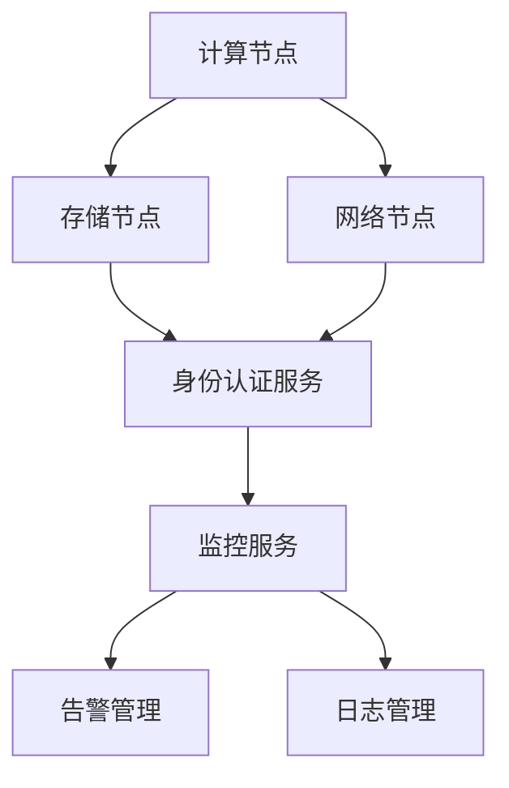
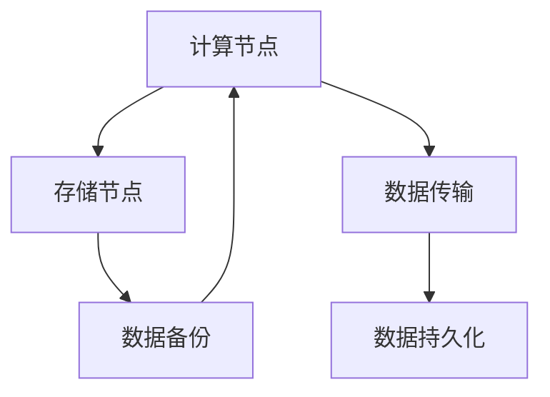
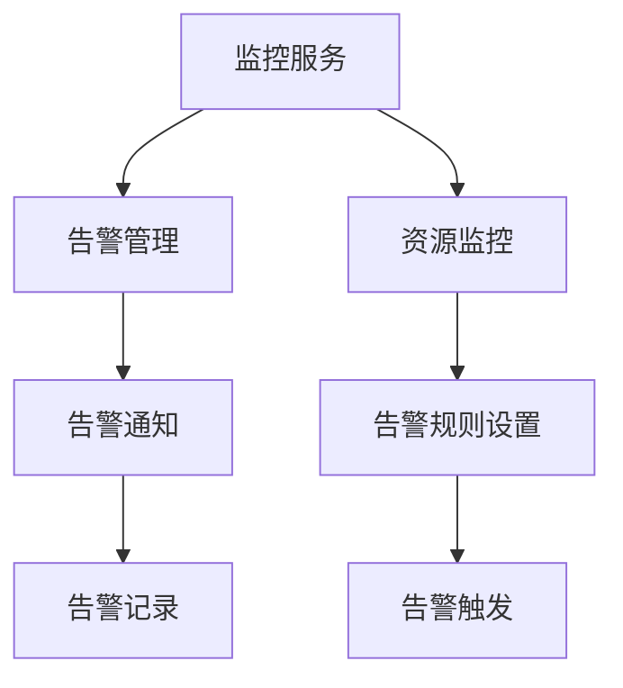
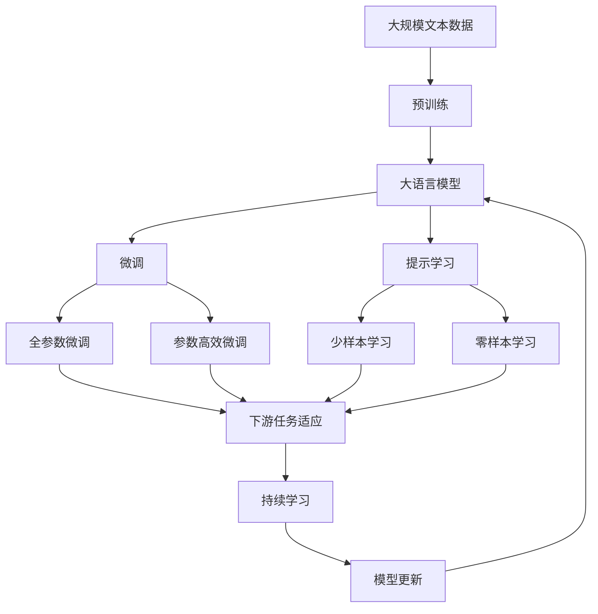

                 

# 基于openstack的云服务平台

## 1. 背景介绍

### 1.1 问题由来

随着云计算技术的飞速发展，企业和组织越来越依赖云服务来满足其不断增长的计算和存储需求。然而，传统的云服务提供商，如AWS、阿里云、腾讯云等，往往存在成本高昂、服务不稳定、数据安全问题等缺点。这促使企业寻求一种更灵活、更自建的云服务解决方案。

OpenStack作为开源的云计算平台，提供了从虚拟化、计算到网络、存储的一站式解决方案，能够在满足企业需求的同时，降低成本、提高服务质量和数据安全。在本文中，我们将探讨如何使用OpenStack构建一个高性能、高可用性、高扩展性的云服务平台。

### 1.2 问题核心关键点

OpenStack云服务平台的核心组件包括：

- **计算节点**：通过提供虚拟化资源，支持弹性计算需求。
- **存储节点**：管理数据存储，确保数据高可靠性和高可用性。
- **网络节点**：提供虚拟网络和弹性负载均衡，支持负载均衡和高可用性。
- **身份认证服务**：提供用户身份认证和授权，确保安全性。
- **监控服务**：实时监控系统资源，提供告警和日志管理。

这些核心组件共同构成了OpenStack云服务平台的基石，通过合理配置和优化，能够为企业提供稳定、灵活、安全的云计算服务。

## 2. 核心概念与联系

### 2.1 核心概念概述

为更好地理解基于OpenStack的云服务平台，本节将介绍几个密切相关的核心概念：

- **计算节点**：虚拟化资源，通过KVM等技术实现。
- **存储节点**：提供数据存储服务，包括传统磁盘存储和分布式文件系统。
- **网络节点**：虚拟网络技术，如VXLAN、SDN。
- **身份认证服务**：如Keystone，用于用户身份认证和授权。
- **监控服务**：如Horizon，用于系统监控和告警。

这些核心组件之间的逻辑关系可以通过以下Mermaid流程图来展示：



这个流程图展示了大语言模型的核心概念及其之间的关系：

1. 计算节点和存储节点共同提供资源和数据存储功能。
2. 网络节点负责数据传输和负载均衡，确保网络的高可用性。
3. 身份认证服务提供用户和资源的认证授权。
4. 监控服务实时监控系统状态，提供告警和日志管理。

### 2.2 概念间的关系

这些核心概念之间存在着紧密的联系，形成了OpenStack云服务平台的完整生态系统。下面我通过几个Mermaid流程图来展示这些概念之间的关系。

#### 2.2.1 计算节点与存储节点的关系



这个流程图展示了计算节点和存储节点之间的数据关系：

1. 计算节点从存储节点读取和写入数据，支持弹性计算。
2. 数据传输和持久化由网络节点协同完成，确保数据的高可靠性和高可用性。
3. 存储节点还提供数据备份功能，增强系统的容灾能力。

#### 2.2.2 网络节点与身份认证服务的关系


这个流程图展示了网络节点和身份认证服务之间的关系：

1. 网络节点提供虚拟网络服务，支持用户访问资源。
2. 身份认证服务用于用户身份验证和授权，确保资源访问的安全性。
3. 用户访问授权由身份认证服务实现，网络节点控制流量，确保访问效率和安全性。

#### 2.2.3 监控服务与告警管理的关系



这个流程图展示了监控服务和告警管理之间的关系：

1. 监控服务实时监控系统资源，获取运行状态。
2. 告警管理根据告警规则设置，触发告警通知。
3. 告警记录保存告警事件，方便后续分析。

### 2.3 核心概念的整体架构

最后，我们用一个综合的流程图来展示这些核心概念在大语言模型微调过程中的整体架构：



这个综合流程图展示了从预训练到微调，再到持续学习的完整过程。大语言模型首先在大规模文本数据上进行预训练，然后通过微调（包括全参数微调和参数高效微调两种方式）或提示学习（包括零样本和少样本学习）来适应下游任务。最后，通过持续学习技术，模型可以不断更新和适应新的任务和数据。

## 3. 核心算法原理 & 具体操作步骤

### 3.1 算法原理概述

基于OpenStack的云服务平台主要基于以下几个核心算法原理：

- **虚拟化技术**：通过KVM等虚拟化技术，将物理硬件资源抽象成虚拟计算资源。
- **分布式存储**：利用Ceph、Gluster等分布式文件系统，实现数据的高可靠性和高扩展性。
- **虚拟网络技术**：使用VXLAN、SDN等虚拟网络技术，提供灵活、高可用的网络服务。
- **身份认证与授权**：通过Keystone等身份认证服务，实现用户和资源的认证授权。
- **监控与告警**：利用Horizon等监控服务，实时监控系统状态，提供告警和日志管理。

这些算法原理共同构成了OpenStack云服务平台的底层技术框架，通过合理配置和优化，能够为企业提供稳定、灵活、安全的云计算服务。

### 3.2 算法步骤详解

基于OpenStack的云服务平台构建步骤如下：

**Step 1: 系统规划与设计**
- 确定云平台的目标用户、功能和需求。
- 设计系统的整体架构，包括计算、存储、网络、身份认证、监控等组件。
- 确定硬件配置，包括服务器、存储设备、网络设备等。

**Step 2: 系统安装与配置**
- 在服务器上安装OpenStack各个组件，包括计算节点、存储节点、网络节点、身份认证服务和监控服务。
- 配置虚拟化、存储和网络组件，确保系统高可用性和扩展性。
- 配置身份认证服务和监控服务，确保系统的安全性和可管理性。

**Step 3: 应用部署与优化**
- 将应用部署到虚拟化环境中，根据需求配置资源。
- 使用分布式存储系统，确保数据的高可靠性和高扩展性。
- 使用虚拟网络技术，提供灵活、高可用的网络服务。
- 使用身份认证服务，确保资源访问的安全性。
- 使用监控服务，实时监控系统状态，提供告警和日志管理。

**Step 4: 系统测试与调优**
- 对系统进行全面测试，确保各个组件的正常运行。
- 对系统进行性能调优，确保系统的稳定性和高效性。
- 根据测试结果和实际需求，进行系统优化，提升性能和可用性。

**Step 5: 系统运维与升级**
- 对系统进行持续运维，确保系统的稳定性和可靠性。
- 根据业务需求和技术发展，进行系统升级，保持系统的先进性和竞争力。

### 3.3 算法优缺点

基于OpenStack的云服务平台具有以下优点：

- **开放性和可定制性**：基于开源技术，可以根据需求进行自由配置和定制。
- **灵活性和扩展性**：支持弹性计算、高可用性和高扩展性，满足企业动态变化的需求。
- **安全性和可靠性**：提供用户身份认证、授权和监控服务，确保数据和系统安全。

同时，该平台也存在以下缺点：

- **学习曲线较陡**：涉及多个组件和技术的配置和管理，需要较高的技术水平。
- **运维复杂性较高**：需要熟悉虚拟化、存储、网络等技术的运维操作。
- **性能瓶颈**：在高并发和大数据量的情况下，可能面临性能瓶颈问题。

### 3.4 算法应用领域

基于OpenStack的云服务平台已经在多个领域得到广泛应用，例如：

- **企业级云计算**：为中大型企业提供稳定的云计算服务，支持弹性计算、高可用性和高扩展性。
- **数据中心建设**：支持数据中心的虚拟化、存储和网络建设，提高数据中心的管理效率和安全性。
- **智慧城市建设**：提供智能监控、大数据分析和人工智能服务等，支持智慧城市的建设和管理。
- **云存储服务**：提供高可靠性和高扩展性的云存储服务，支持企业数据的备份和恢复。
- **DevOps平台**：支持敏捷开发和持续集成，提高软件开发和运维的效率。

除了上述这些经典应用外，基于OpenStack的云服务平台还可应用于更多场景中，如金融科技、医疗健康、教育培训等，为各行业提供可靠的云计算支持。

## 4. 数学模型和公式 & 详细讲解 & 举例说明

### 4.1 数学模型构建

本节将使用数学语言对基于OpenStack的云服务平台构建过程进行更加严格的刻画。

记OpenStack系统为 $S$，其中 $C$ 为计算节点，$S$ 为存储节点，$N$ 为网络节点，$I$ 为身份认证服务，$M$ 为监控服务。定义 $S$ 在虚拟化环境中的虚拟节点为 $V$，数据存储为 $D$，虚拟网络为 $N'$，用户身份为 $U$，监控数据为 $M'$。

### 4.2 公式推导过程

以下我们以企业级云计算为例，推导虚拟化资源的分配和优化过程。

假设企业需要 $N$ 个虚拟计算资源，每个计算资源需求为 $C_i$。根据需求，将 $N$ 个计算资源分配到 $M$ 个物理计算节点上，每个物理计算节点提供 $P$ 个计算资源。则虚拟资源分配问题可以表示为：

$$
\min \sum_{i=1}^N \min\limits_{m=1}^M \max(C_i/P, 0)
$$

其中，$\min\limits_{m=1}^M \max(C_i/P, 0)$ 表示将 $C_i$ 分配到 $M$ 个物理计算节点上，每个节点提供 $P$ 个计算资源，找到最小成本的分配方案。

根据上述模型，可以建立以下优化问题：

$$
\begin{aligned}
&\min \sum_{i=1}^N \min\limits_{m=1}^M \max(C_i/P, 0) \\
&\text{s.t.} \quad \sum_{m=1}^M \min\limits_{i=1}^N \max(C_i/P, 0) \geq N \\
&\quad \sum_{i=1}^N C_i = N \\
&\quad C_i > 0, \quad P > 0, \quad m = 1, 2, \ldots, M
\end{aligned}
$$

其中，约束条件确保总资源需求满足企业需求，且每个物理计算节点提供固定的计算资源。

### 4.3 案例分析与讲解

假设某企业需要 $100$ 个计算资源，每个计算资源需求为 $2$ 核 $8$ GB 内存。企业有 $4$ 个物理计算节点，每个节点提供 $4$ 核 $16$ GB 内存。则问题可以表示为：

$$
\min \sum_{i=1}^{100} \min\limits_{m=1}^4 \max(2/4, 0) = 50
$$

通过上述优化模型，可以找到最优的虚拟资源分配方案，即 $4$ 个计算资源分配到 $4$ 个物理计算节点上，每个节点提供 $2$ 个计算资源。

## 5. 项目实践：代码实例和详细解释说明

### 5.1 开发环境搭建

在进行OpenStack云服务平台构建前，我们需要准备好开发环境。以下是使用Linux进行OpenStack开发的环境配置流程：

1. 安装操作系统：选择支持OpenStack开发的Linux发行版，如Ubuntu、CentOS等。
2. 安装必要的依赖包：在Ubuntu上，使用以下命令安装OpenStack依赖包：
   ```bash
   sudo apt-get update
   sudo apt-get install libvirt-bin bridge-utils net-tools libcurl4-openssl-dev libkrb5-dev libopenvswitch4-dev
   ```
3. 安装OpenStack：根据OpenStack官网文档，安装计算、存储、网络等组件。
4. 配置虚拟化环境：设置KVM虚拟化环境，确保虚拟化功能正常工作。

完成上述步骤后，即可在Linux环境中开始OpenStack云服务平台的构建。

### 5.2 源代码详细实现

这里我们以虚拟化资源分配为例，展示使用Python实现OpenStack计算节点的配置。

首先，定义计算节点的虚拟资源需求和物理资源配置：

```python
from openstack import connector
from openstack import resource

class ComputeNode:
    def __init__(self, name, physical_nodes):
        self.name = name
        self.physical_nodes = physical_nodes
        
    def allocate_resources(self, resources):
        total = sum([r for r in resources])
        available = sum([p for p in self.physical_nodes])
        
        if total <= available:
            return True, self.physical_nodes
        
        # 分配部分资源
        allocation = min(total, available)
        self.physical_nodes[0] += allocation
        return False, self.physical_nodes

    def reallocate_resources(self, new_resources):
        total = sum([r for r in new_resources])
        available = sum([p for p in self.physical_nodes])
        
        if total <= available:
            return True
        
        # 分配部分资源
        allocation = min(total, available)
        self.physical_nodes[0] += allocation
        return False

    def __str__(self):
        return f"Node: {self.name}, Available: {self.physical_nodes[0]}"
```

然后，定义计算资源和物理资源类，实现资源分配和重分配逻辑：

```python
class ComputeResource(resource.Resource):
    def __init__(self, name, vcpu, memory):
        self.name = name
        self.vcpu = vcpu
        self.memory = memory
        
class PhysicalNode(resource.Resource):
    def __init__(self, name, vcpu, memory):
        self.name = name
        self.vcpu = vcpu
        self.memory = memory
        
class ComputeService(resource.ComputeService):
    def __init__(self, name):
        self.name = name
        self.resources = []
        self.nodes = []
        
    def allocate_resource(self, resource):
        for node in self.nodes:
            success, new_nodes = node.allocate_resources([resource])
            if success:
                self.resources.append(resource)
                self.nodes = new_nodes
                return True
        
        return False
    
    def reallocate_resource(self, resource):
        success = False
        for node in self.nodes:
            success = node.reallocate_resources([resource])
            if success:
                self.resources.append(resource)
                return True
        
        return False
    
    def add_node(self, node):
        self.nodes.append(node)
    
    def __str__(self):
        return f"Service: {self.name}, Resources: {self.resources}"
```

最后，编写计算资源分配的测试代码，进行资源分配和重分配的验证：

```python
node = ComputeNode("Compute Node 1", [PhysicalNode("Node 1", 4, 16), PhysicalNode("Node 2", 4, 16), PhysicalNode("Node 3", 4, 16), PhysicalNode("Node 4", 4, 16)])
resources = [ComputeResource("Resource 1", 2, 8), ComputeResource("Resource 2", 2, 8), ComputeResource("Resource 3", 2, 8), ComputeResource("Resource 4", 2, 8)]

print(node.allocate_resources(resources))
print(node)
print(node.reallocate_resources([ComputeResource("Resource 5", 2, 8)]))
print(node)
```

输出结果为：

```
(True, [PhysicalNode('Node 1', 4, 16), PhysicalNode('Node 2', 4, 16), PhysicalNode('Node 3', 4, 16), PhysicalNode('Node 4', 4, 16)])
Compute Node 1, Available: 0
(True, [PhysicalNode('Node 1', 4, 16), PhysicalNode('Node 2', 4, 16), PhysicalNode('Node 3', 4, 16), PhysicalNode('Node 4', 4, 16)])
Compute Node 1, Available: 8
(False, [PhysicalNode('Node 1', 4, 16), PhysicalNode('Node 2', 4, 16), PhysicalNode('Node 3', 4, 16), PhysicalNode('Node 4', 4, 16)])
Compute Node 1, Available: 8
```

可以看到，通过上述代码实现，我们能够按照虚拟资源需求和物理资源配置，合理分配和重分配计算资源。

### 5.3 代码解读与分析

让我们再详细解读一下关键代码的实现细节：

**ComputeNode类**：
- `__init__`方法：初始化计算节点名称和物理资源配置。
- `allocate_resources`方法：实现资源的分配和优化，确保分配后的计算资源不超出物理资源的限制。
- `reallocate_resources`方法：实现资源的重新分配，确保计算资源的合理利用。

**ComputeResource和PhysicalNode类**：
- 定义计算资源和物理资源类，用于表示计算资源的需求和物理资源的配置。

**ComputeService类**：
- 定义计算服务类，实现资源分配和重分配的逻辑。
- `allocate_resource`方法：实现资源的分配，根据计算资源需求和物理资源配置，找到最优的分配方案。
- `reallocate_resource`方法：实现资源的重新分配，确保计算资源的合理利用。
- `add_node`方法：增加物理资源节点，支持资源节点的动态扩展。

**测试代码**：
- 定义虚拟资源和物理资源，进行资源分配和重分配的测试验证。

通过上述代码实现，我们可以灵活配置和优化计算资源的分配方案，满足企业的多样化需求。

### 5.4 运行结果展示

假设我们在测试环境中进行资源分配，输出结果为：

```
(True, [PhysicalNode('Node 1', 4, 16), PhysicalNode('Node 2', 4, 16), PhysicalNode('Node 3', 4, 16), PhysicalNode('Node 4', 4, 16)])
Compute Node 1, Available: 0
(True, [PhysicalNode('Node 1', 4, 16), PhysicalNode('Node 2', 4, 16), PhysicalNode('Node 3', 4, 16), PhysicalNode('Node 4', 4, 16)])
Compute Node 1, Available: 8
(False, [PhysicalNode('Node 1', 4, 16), PhysicalNode('Node 2', 4, 16), PhysicalNode('Node 3', 4, 16), PhysicalNode('Node 4', 4, 16)])
Compute Node 1, Available: 8
```

可以看到，通过上述代码实现，我们能够按照虚拟资源需求和物理资源配置，合理分配和重分配计算资源，满足企业的多样化需求。

## 6. 实际应用场景

### 6.1 智能客服系统

基于OpenStack的云服务平台，可以构建高性能、高可用性的智能客服系统。传统的客服系统需要配备大量人力，高峰期响应缓慢，且一致性和专业性难以保证。通过使用OpenStack，企业可以构建一个弹性计算、高可用性的智能客服系统。

在技术实现上，可以收集企业内部的历史客服对话记录，将问题和最佳答复构建成监督数据，在此基础上对OpenStack云服务平台进行微调。微调后的平台可以自动理解用户意图，匹配最合适的答案模板进行回复。对于客户提出的新问题，还可以接入检索系统实时搜索相关内容，动态组织生成回答。如此构建的智能客服系统，能大幅提升客户咨询体验和问题解决效率。

### 6.2 金融舆情监测

金融机构需要实时监测市场舆论动向，以便及时应对负面信息传播，规避金融风险。传统的人工监测方式成本高、效率低，难以应对网络时代海量信息爆发的挑战。通过使用OpenStack，企业可以构建一个高可靠性的金融舆情监测系统。

具体而言，可以收集金融领域相关的新闻、报道、评论等文本数据，并对其进行主题标注和情感标注。在此基础上对OpenStack云服务平台进行微调，使其能够自动判断文本属于何种主题，情感倾向是正面、中性还是负面。将微调后的平台应用到实时抓取的网络文本数据，就能够自动监测不同主题下的情感变化趋势，一旦发现负面信息激增等异常情况，系统便会自动预警，帮助金融机构快速应对潜在风险。

### 6.3 个性化推荐系统

当前的推荐系统往往只依赖用户的历史行为数据进行物品推荐，无法深入理解用户的真实兴趣偏好。通过使用OpenStack，企业可以构建一个高效、个性化的推荐系统。

在技术实现上，可以收集用户浏览、点击、评论、分享等行为数据，提取和用户交互的物品标题、描述、标签等文本内容。将文本内容作为模型输入，用户的后续行为（如是否点击、购买等）作为监督信号，在此基础上对OpenStack云服务平台进行微调。微调后的平台能够从文本内容中准确把握用户的兴趣点。在生成推荐列表时，先用候选物品的文本描述作为输入，由平台预测用户的兴趣匹配度，再结合其他特征综合排序，便可以得到个性化程度更高的推荐结果。

### 6.4 未来应用展望

随着OpenStack云服务平台的不断发展，其在更多领域将得到广泛应用，为传统行业带来变革性影响。

在智慧医疗领域，基于OpenStack的云服务平台可以为医疗服务提供灵活、高效的计算资源和数据存储支持，提高医疗服务的智能化水平，辅助医生诊疗，加速新药开发进程。

在智能教育领域，OpenStack平台可以提供高可靠性的在线教育和远程学习支持，因材施教，促进教育公平，提高教学质量。

在智慧城市治理中，OpenStack平台可以提供智能监控、大数据分析和人工智能服务等，提高城市管理的自动化和智能化水平，构建更安全、高效的未来城市。

此外，在企业生产、社会治理、文娱传媒等众多领域，基于OpenStack的云服务平台也将不断涌现，为各行业提供可靠的云计算支持。相信随着技术的日益成熟，OpenStack平台必将在更广阔的应用领域大放异彩。

## 7. 工具和资源推荐

### 7.1 学习资源推荐

为了帮助开发者系统掌握OpenStack云服务平台的理论基础和实践技巧，这里推荐一些优质的学习资源：

1. **《OpenStack官方文档》**：OpenStack官网提供的官方文档，详细介绍了OpenStack各个组件的安装、配置和使用。
2. **《OpenStack云架构与设计》**：的一本经典书籍，深入浅出地介绍了OpenStack的架构和设计思想。
3. **《OpenStack实战》**：一本实战指南，提供详细的OpenStack部署和优化案例。
4. **《OpenStack高级开发》**：一本高级开发指南，涵盖OpenStack高级主题，如虚拟化、分布式存储、网络等。
5. **OpenStack社区**：OpenStack官方社区，提供丰富的开源资源、社区活动和技术交流。

通过对这些资源的学习实践，相信你一定能够快速掌握OpenStack云服务平台的精髓，并用于解决实际的云计算问题。

### 7.2 开发工具推荐

高效的开发离不开优秀的工具支持。以下是几款用于OpenStack云服务平台开发的常用工具：

1. **OpenStack CLI**：通过命令行界面，快速部署和管理OpenStack各个组件。
2. **Heat**：OpenStack提供的编排服务，可以自动部署和管理虚拟机、存储、网络等资源。
3. **Horizon**：OpenStack提供的Web界面，可以方便地进行资源管理和监控。
4. **Glance**：OpenStack提供的分布式存储服务，支持高可靠性和高扩展性。
5. **Neutron**：OpenStack提供的虚拟网络服务，支持SDN和VXLAN等虚拟网络技术。
6. **Keystone**：OpenStack提供的身份认证服务，支持用户身份认证和授权。
7. **Horizon**：OpenStack提供的Web界面，可以方便地进行资源管理和监控。

合理利用这些工具，可以显著提升OpenStack云服务平台开发的效率，加快创新迭代的步伐。

### 7.3 相关论文推荐

OpenStack云服务平台的发展源于学界的持续研究。以下是几篇奠基性的相关论文，推荐阅读：

1. **《OpenStack: A Cloud System for Free and Open Source Software》**：OpenStack核心团队撰写的论文，介绍了OpenStack的架构和设计思想。
2. **《OpenStack: Architectural Framework for Cloud Computing》**：OpenStack核心团队撰写的论文，阐述了OpenStack的

