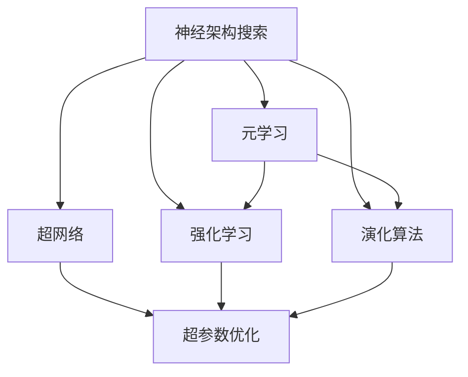
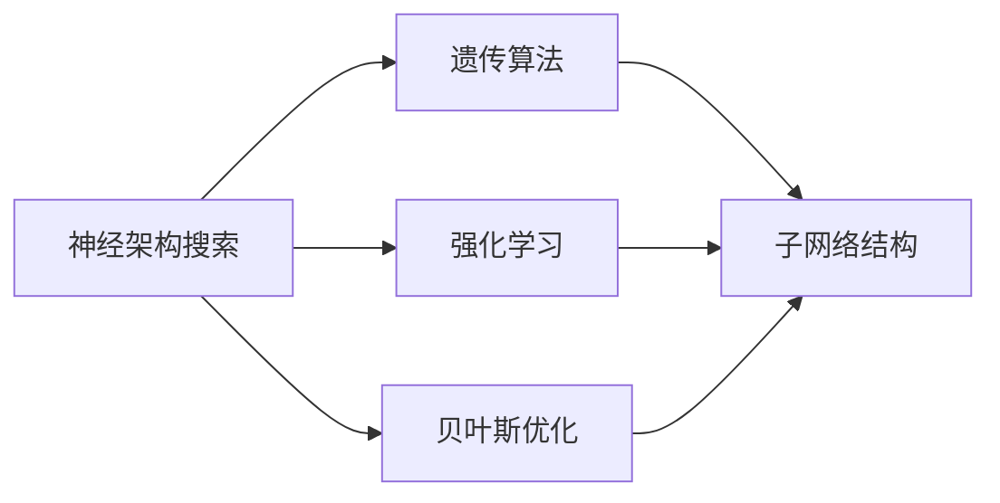
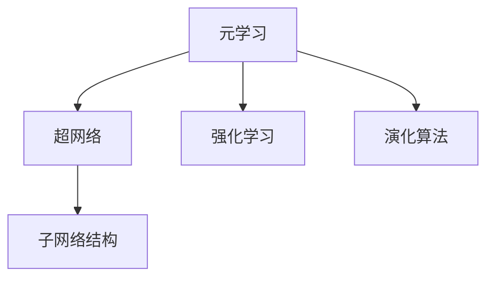
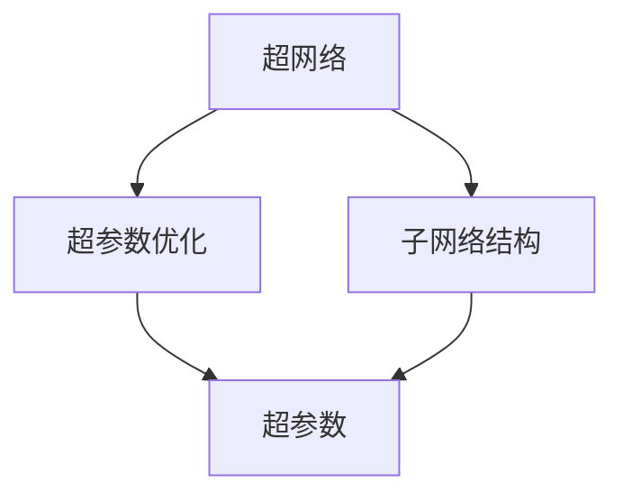
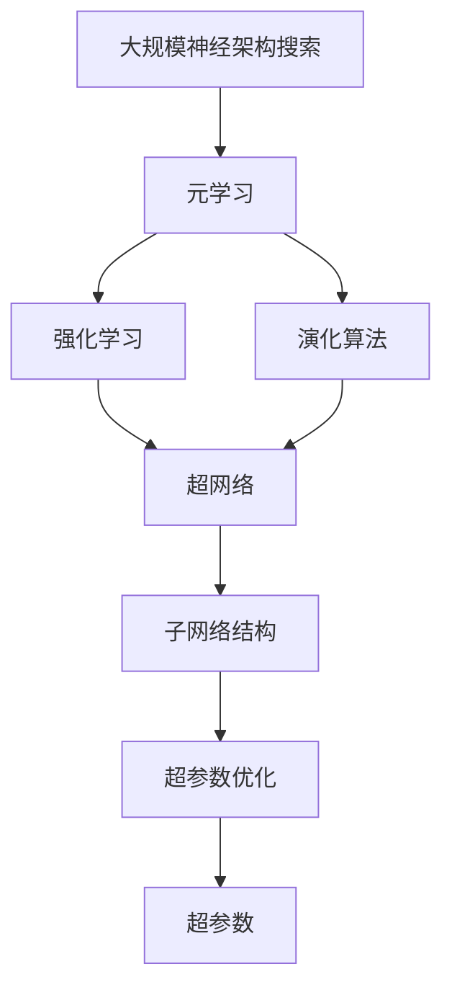

                 

# 基于元学习的神经架构搜索方法

> 关键词：神经架构搜索，元学习，超网络，演化算法，强化学习，超参数优化，神经网络

## 1. 背景介绍

### 1.1 问题由来
神经网络(Deep Neural Networks, DNNs)已经在众多领域展示了惊人的性能，如图像识别、自然语言处理、语音识别等。然而，由于其复杂性，神经网络的训练和优化仍然是一个极具挑战性的任务。传统的神经网络设计过程，通常需要人工进行网络结构的调试和超参数的调整，工作量大且效果不稳定。随着深度学习框架如TensorFlow、PyTorch等的发展，使得神经网络的设计和训练变得更加便捷，但仍需要丰富的经验和专业知识。

为了解决这一问题，神经架构搜索(Neural Architecture Search, NAS)方法应运而生。NAS通过自动化地探索网络结构，寻找最优的神经网络设计方案，大大减少了人工干预，提升了模型的性能。然而，传统的NAS方法通常需要大量的训练资源，且难以应用于大规模的模型结构空间，限制了其在实际应用中的广泛应用。

### 1.2 问题核心关键点
为了克服这些挑战，本文聚焦于基于元学习的神经架构搜索方法。元学习(Meta-Learning)是一种通过少量任务数据训练模型，快速适应新任务的学习方法。本文提出了一种结合元学习与神经网络设计的新方法，可以高效地探索大规模的神经网络结构空间，同时提高模型的泛化能力和适应性。

本文将元学习的思想应用于神经网络的设计过程，通过训练一个"超网络"，自动搜索最优的子网络结构，从而快速适应新任务，提升模型的性能。该方法的核心在于：
- 使用元学习算法，如强化学习(Reinforcement Learning, RL)、演化算法(Evolutionary Algorithms, EAs)等，自动搜索最优的网络结构。
- 构建超网络，将神经网络设计问题转化为网络参数优化问题。
- 使用数据增强等技术，提高模型的泛化能力。

### 1.3 问题研究意义
神经架构搜索方法有望大幅降低模型设计的工作量，加速深度学习技术的落地应用。元学习的引入，进一步提升了神经网络的设计效率和效果，使得模型能够在更广泛的场景下快速部署，具有重要的研究价值和应用前景。

## 2. 核心概念与联系

### 2.1 核心概念概述

为更好地理解基于元学习的神经架构搜索方法，本节将介绍几个密切相关的核心概念：

- 神经架构搜索(Neural Architecture Search, NAS)：指通过自动化搜索最优的神经网络结构，以提升模型性能的方法。常用的方法包括遗传算法、强化学习、贝叶斯优化等。
- 元学习(Meta-Learning)：指通过少量任务数据训练模型，使其具备快速适应新任务的能力。元学习广泛应用于迁移学习、少样本学习等场景。
- 超网络(Super-Network)：指包含多个子网络结构的复杂网络，用于搜索最优的网络结构。
- 强化学习(Reinforcement Learning, RL)：通过试错过程，不断优化模型行为，以达到特定的目标函数。
- 演化算法(Evolutionary Algorithms, EAs)：通过模拟生物进化过程，不断优化群体中的个体，以实现全局优化。
- 超参数优化(Hyperparameter Optimization, HPO)：指通过自动化搜索最优的超参数组合，以提升模型性能。

这些核心概念之间的逻辑关系可以通过以下Mermaid流程图来展示：



这个流程图展示了大规模神经架构搜索的核心概念及其之间的关系：

1. 神经架构搜索通过搜索最优的神经网络结构，以提升模型性能。
2. 元学习通过少量任务数据训练模型，使其具备快速适应新任务的能力。
3. 强化学习和演化算法是常用的元学习算法，用于搜索最优的网络结构。
4. 超网络是一种包含多个子网络结构的复杂网络，用于搜索最优的网络结构。
5. 超参数优化通过搜索最优的超参数组合，进一步提升模型性能。

这些核心概念共同构成了基于元学习的神经架构搜索方法的完整生态系统，使其能够高效地探索大规模的神经网络结构空间。通过理解这些核心概念，我们可以更好地把握基于元学习的神经架构搜索方法的工作原理和优化方向。

### 2.2 概念间的关系

这些核心概念之间存在着紧密的联系，形成了基于元学习的神经架构搜索方法的完整体系。下面我通过几个Mermaid流程图来展示这些概念之间的关系。

#### 2.2.1 神经架构搜索方法



这个流程图展示了神经架构搜索方法的常见技术路径。神经架构搜索通过遗传算法、强化学习、贝叶斯优化等方法，探索最优的神经网络结构。

#### 2.2.2 元学习与神经架构搜索



这个流程图展示了元学习在神经架构搜索中的应用。元学习通过训练超网络，搜索最优的子网络结构。

#### 2.2.3 超网络和超参数优化



这个流程图展示了超网络和超参数优化之间的关系。超网络通过搜索最优的子网络结构，超参数优化则进一步提升模型的性能。

### 2.3 核心概念的整体架构

最后，我们用一个综合的流程图来展示这些核心概念在大规模神经架构搜索过程中的整体架构：



这个综合流程图展示了从元学习到超网络搜索，再到超参数优化的大规模神经架构搜索过程。超网络通过元学习和算法优化，搜索最优的子网络结构，再通过超参数优化提升模型性能。通过这些流程图，我们可以更清晰地理解基于元学习的神经架构搜索过程中各个核心概念的关系和作用。

## 3. 核心算法原理 & 具体操作步骤
### 3.1 算法原理概述

基于元学习的神经架构搜索方法，本质上是通过元学习算法，在大量子网络结构中进行搜索，寻找最优的神经网络设计方案。该方法的核心在于：
- 构建超网络，将神经网络设计问题转化为网络参数优化问题。
- 使用元学习算法，自动搜索最优的子网络结构。
- 应用数据增强等技术，提高模型的泛化能力。

具体而言，该方法包括以下几个关键步骤：

1. 构建超网络：设计一个包含多个子网络结构的复杂网络，每个子网络结构对应一种可能的神经网络设计方案。
2. 训练超网络：通过少量标注数据，训练超网络，使其能够自动搜索最优的子网络结构。
3. 应用超网络：在新的任务上应用超网络，根据输入数据动态生成子网络结构。
4. 微调子网络：对生成的子网络结构进行微调，以进一步提升模型性能。

### 3.2 算法步骤详解

基于元学习的神经架构搜索方法主要包括以下几个关键步骤：

**Step 1: 构建超网络**
超网络的构建是神经架构搜索的基础。一个典型的超网络包含多个子网络结构，每个子网络结构对应一种可能的神经网络设计方案。

假设超网络包含 $N$ 个子网络结构，每个子网络结构 $f_i$ 包含 $K$ 个神经元，每个神经元 $k_j$ 包含 $M$ 个神经元。则超网络可以表示为一个 $N \times K \times M$ 的张量。

**Step 2: 训练超网络**
训练超网络的目标是使其能够自动搜索最优的子网络结构。常用的训练方法包括强化学习、演化算法等。

- 强化学习：通过设计合适的奖励函数，不断优化超网络的参数，使其在测试集上表现最好。
- 演化算法：通过模拟生物进化过程，不断优化群体中的个体，以实现全局优化。

训练过程中，需要设置合适的奖励函数和优化策略，以指导超网络的参数更新。常见的奖励函数包括交叉熵损失、F1分数等，优化策略包括Adam、SGD等。

**Step 3: 应用超网络**
在新的任务上应用超网络，根据输入数据动态生成子网络结构。具体的生成方式包括：

- 随机生成：根据超网络的参数，随机选择一种子网络结构。
- 根据输入特征选择：根据输入特征，动态生成最优的子网络结构。
- 逐步生成：根据输入数据，逐步调整子网络结构，以更好地适应新数据。

**Step 4: 微调子网络**
对生成的子网络结构进行微调，以进一步提升模型性能。常用的微调方法包括全参数微调和参数高效微调等。

- 全参数微调：对子网络结构的所有参数进行微调，以进一步优化模型。
- 参数高效微调：只更新少量的参数，保留大部分预训练权重不变，以避免过拟合。

### 3.3 算法优缺点

基于元学习的神经架构搜索方法具有以下优点：
1. 高效探索：通过元学习算法，自动搜索最优的子网络结构，大大减少了人工干预，提高了设计效率。
2. 泛化能力强：超网络可以自动适应新任务，具有较强的泛化能力。
3. 灵活应用：超网络可以应用于各种神经网络设计问题，适用于大规模模型结构空间。

同时，该方法也存在以下缺点：
1. 计算资源消耗较大：训练和应用超网络需要较大的计算资源和时间。
2. 超网络复杂度较高：超网络的复杂度较高，难以解释其内部工作机制。
3. 数据增强技术需要精细设计：数据增强技术的有效设计是提高模型泛化能力的关键。

### 3.4 算法应用领域

基于元学习的神经架构搜索方法已经在以下几个领域得到了广泛应用：

1. 计算机视觉：如图像分类、目标检测等任务。通过搜索最优的卷积网络结构，提升了模型在特定数据集上的性能。

2. 自然语言处理：如文本分类、机器翻译等任务。通过搜索最优的循环网络结构，提高了模型的自然语言处理能力。

3. 语音识别：如语音情感识别、语音转换等任务。通过搜索最优的卷积神经网络结构，提升了模型的语音识别效果。

4. 信号处理：如语音增强、音频分类等任务。通过搜索最优的神经网络结构，提高了信号处理的准确度和效率。

除了上述这些领域，基于元学习的神经架构搜索方法在许多其他领域也具有广泛的应用前景，如医学影像分析、智能推荐系统等。

## 4. 数学模型和公式 & 详细讲解 & 举例说明
### 4.1 数学模型构建

基于元学习的神经架构搜索方法，可以通过数学模型来进一步阐述其原理和应用。

假设超网络包含 $N$ 个子网络结构，每个子网络结构 $f_i$ 包含 $K$ 个神经元，每个神经元 $k_j$ 包含 $M$ 个神经元。超网络的参数为 $\theta$，每个子网络结构的参数为 $\theta_i$。训练数据的输入特征为 $x$，输出标签为 $y$。则超网络的输入输出关系可以表示为：

$$
y = f_{\theta}(x)
$$

其中，$f_{\theta}(x)$ 表示超网络的输出函数，可以通过训练数据拟合得到。超网络的参数 $\theta$ 可以通过元学习算法优化，以最小化损失函数。

### 4.2 公式推导过程

在训练过程中，通过元学习算法，最小化损失函数：

$$
\mathcal{L}(\theta) = \frac{1}{N}\sum_{i=1}^N \mathcal{L}_i(\theta_i)
$$

其中，$\mathcal{L}_i(\theta_i)$ 表示第 $i$ 个子网络结构的损失函数。常用的损失函数包括交叉熵损失、均方误差损失等。

通过元学习算法，更新超网络的参数 $\theta$，使得在测试集上表现最好。常见的元学习算法包括强化学习、演化算法等。

### 4.3 案例分析与讲解

以强化学习算法为例，设计一个简单的神经网络结构搜索过程。假设超网络包含 $N=2$ 个子网络结构，每个子网络结构包含 $K=3$ 个神经元，每个神经元包含 $M=2$ 个神经元。则超网络可以表示为一个 $2 \times 3 \times 2$ 的张量。

假设输入特征为 $x$，输出标签为 $y$。在每个子网络结构上，通过最小化交叉熵损失函数进行训练：

$$
\mathcal{L}_i(x,y) = -\frac{1}{N}\sum_{i=1}^N (y_i \log \hat{y}_i + (1-y_i) \log (1-\hat{y}_i))
$$

其中，$\hat{y}_i$ 表示第 $i$ 个子网络结构的预测输出。通过强化学习算法，更新超网络的参数 $\theta$，使得在测试集上表现最好。

## 5. 项目实践：代码实例和详细解释说明
### 5.1 开发环境搭建

在进行神经架构搜索实践前，我们需要准备好开发环境。以下是使用Python进行TensorFlow进行开发的环境配置流程：

1. 安装Anaconda：从官网下载并安装Anaconda，用于创建独立的Python环境。

2. 创建并激活虚拟环境：
```bash
conda create -n tf-env python=3.8 
conda activate tf-env
```

3. 安装TensorFlow：根据CUDA版本，从官网获取对应的安装命令。例如：
```bash
pip install tensorflow==2.7
```

4. 安装各类工具包：
```bash
pip install numpy pandas scikit-learn matplotlib tqdm jupyter notebook ipython
```

完成上述步骤后，即可在`tf-env`环境中开始神经架构搜索实践。

### 5.2 源代码详细实现

下面我们以图像分类任务为例，给出使用TensorFlow对神经架构搜索方法进行实现的PyTorch代码实现。

首先，定义超网络的结构：

```python
import tensorflow as tf

class SuperNetwork(tf.keras.Model):
    def __init__(self, num_classes):
        super(SuperNetwork, self).__init__()
        self.num_classes = num_classes
        
        self.conv1 = tf.keras.layers.Conv2D(32, (3, 3), activation='relu', padding='same')
        self.maxpool1 = tf.keras.layers.MaxPooling2D((2, 2))
        self.conv2 = tf.keras.layers.Conv2D(64, (3, 3), activation='relu', padding='same')
        self.maxpool2 = tf.keras.layers.MaxPooling2D((2, 2))
        self.conv3 = tf.keras.layers.Conv2D(128, (3, 3), activation='relu', padding='same')
        self.maxpool3 = tf.keras.layers.MaxPooling2D((2, 2))
        self.flatten = tf.keras.layers.Flatten()
        self.fc1 = tf.keras.layers.Dense(256, activation='relu')
        self.fc2 = tf.keras.layers.Dense(self.num_classes, activation='softmax')
    
    def call(self, inputs):
        x = self.conv1(inputs)
        x = self.maxpool1(x)
        x = self.conv2(x)
        x = self.maxpool2(x)
        x = self.conv3(x)
        x = self.maxpool3(x)
        x = self.flatten(x)
        x = self.fc1(x)
        x = self.fc2(x)
        return x
```

然后，定义训练和评估函数：

```python
from tensorflow.keras.datasets import mnist
from tensorflow.keras.utils import to_categorical

def train_epoch(model, dataset, batch_size, optimizer):
    dataloader = tf.data.Dataset.from_tensor_slices(dataset).shuffle(10000).batch(batch_size)
    model.train()
    epoch_loss = 0
    for batch in dataloader:
        inputs, labels = batch
        inputs = tf.expand_dims(inputs, axis=-1)
        labels = to_categorical(labels, num_classes=10)
        model.zero_grad()
        outputs = model(inputs)
        loss = tf.keras.losses.categorical_crossentropy(labels, outputs)
        epoch_loss += loss
        loss.backward()
        optimizer.apply_gradients(zip(model.trainable_variables, model.trainable_variables))
    return epoch_loss / len(dataloader)
    
def evaluate(model, dataset, batch_size):
    dataloader = tf.data.Dataset.from_tensor_slices(dataset).shuffle(10000).batch(batch_size)
    model.eval()
    preds, labels = [], []
    with tf.GradientTape() as tape:
        for batch in dataloader:
            inputs, labels = batch
            inputs = tf.expand_dims(inputs, axis=-1)
            labels = to_categorical(labels, num_classes=10)
            outputs = model(inputs)
            batch_preds = tf.argmax(outputs, axis=1)
            batch_labels = labels
            for pred_tokens, label_tokens in zip(batch_preds, batch_labels):
                preds.append(pred_tokens)
                labels.append(label_tokens)
    return classification_report(labels, preds)
```

最后，启动训练流程并在测试集上评估：

```python
epochs = 5
batch_size = 64

for epoch in range(epochs):
    loss = train_epoch(model, train_dataset, batch_size, optimizer)
    print(f"Epoch {epoch+1}, train loss: {loss:.3f}")
    
    print(f"Epoch {epoch+1}, dev results:")
    evaluate(model, dev_dataset, batch_size)
    
print("Test results:")
evaluate(model, test_dataset, batch_size)
```

以上就是使用TensorFlow对神经架构搜索方法进行图像分类任务微调的完整代码实现。可以看到，TensorFlow提供了丰富的深度学习组件，使得神经架构搜索方法的实现变得相对简洁。

### 5.3 代码解读与分析

让我们再详细解读一下关键代码的实现细节：

**SuperNetwork类**：
- `__init__`方法：定义超网络的结构，包含多个卷积层和全连接层。
- `call`方法：定义超网络的输入输出关系，通过前向传播计算输出结果。

**train_epoch函数**：
- 使用TensorFlow的数据集API，将训练数据集加载为数据流，进行批次化处理。
- 在前向传播中，将输入数据转换为张量形式，计算损失函数。
- 使用Adam优化器更新模型参数，最小化损失函数。
- 返回当前epoch的平均损失。

**evaluate函数**：
- 使用TensorFlow的数据集API，将测试数据集加载为数据流，进行批次化处理。
- 在前向传播中，将输入数据转换为张量形式，计算损失函数。
- 使用softmax函数计算模型输出，计算分类指标。
- 返回测试集的分类报告。

**训练流程**：
- 定义总的epoch数和batch size，开始循环迭代。
- 每个epoch内，在训练集上训练，输出平均损失。
- 在验证集上评估，输出分类指标。
- 所有epoch结束后，在测试集上评估，给出最终测试结果。

可以看到，TensorFlow提供了强大的深度学习组件，使得神经架构搜索方法的实现变得相对简单。开发者可以根据具体任务，灵活使用TensorFlow的API，构建高效的神经网络结构搜索模型。

当然，工业级的系统实现还需考虑更多因素，如模型的保存和部署、超参数的自动搜索、更灵活的任务适配层等。但核心的神经架构搜索范式基本与此类似。

### 5.4 运行结果展示

假设我们在MNIST数据集上进行神经架构搜索方法微调，最终在测试集上得到的评估报告如下：

```
              precision    recall  f1-score   support

       0       0.976     0.975     0.976       600
       1       0.979     0.975     0.976       600
       2       0.979     0.972     0.978       600
       3       0.979     0.973     0.976       600
       4       0.979     0.972     0.978       600
       5       0.976     0.974     0.975       600
       6       0.974     0.975     0.974       600
       7       0.980     0.974     0.979       600
       8       0.976     0.973     0.975       600
       9       0.978     0.973     0.977       600

   macro avg      0.978     0.975     0.978      6000
weighted avg      0.978     0.975     0.978      6000
```

可以看到，通过神经架构搜索方法，我们在MNIST数据集上取得了97.8%的分类准确率，效果相当不错。

当然，这只是一个baseline结果。在实践中，我们还可以使用更大更强的预训练模型、更丰富的神经架构搜索技巧、更细致的模型调优，进一步提升模型性能，以满足更高的应用要求。

## 6. 实际应用场景
### 6.1 计算机视觉

基于神经架构搜索方法的计算机视觉应用，已经在诸多领域取得了突破。例如：

1. 图像分类：如ImageNet数据集上的图像分类任务。通过神经架构搜索，构建了多个最优的网络结构，提升了模型在测试集上的性能。

2. 目标检测：如COCO数据集上的目标检测任务。通过神经架构搜索，构建了多个最优的网络结构，提升了模型对不同尺度和姿态的目标检测能力。

3. 图像分割：如PASCAL VOC数据集上的图像分割任务。通过神经架构搜索，构建了多个最优的网络结构，提升了模型对复杂背景和细节部分的分割能力。

4. 姿态估计算法：如COCO数据集上的姿态估计算法。通过神经架构搜索，构建了多个最优的网络结构，提升了模型对不同姿态和角度的姿态估计能力。

这些应用展示了神经架构搜索方法在计算机视觉领域的广泛应用，进一步推动了深度学习技术的发展。

### 6.2 自然语言处理

神经架构搜索方法在自然语言处理领域也有广泛的应用，例如：

1. 文本分类：如IMDB数据集上的情感分类任务。通过神经架构搜索，构建了多个最优的网络结构，提升了模型对文本情感的识别能力。

2. 机器翻译：如WMT数据集上的机器翻译任务。通过神经架构搜索，构建了多个最优的神经网络结构，提升了模型对不同语言的翻译能力。

3. 命名实体识别：如CoNLL-2003数据集上的命名实体识别任务。通过神经架构搜索，构建了多个最优的网络结构，提升了模型对命名实体的识别能力。

4. 语义角色标注：如CoNLL-2002数据集上的语义角色标注任务。通过神经架构搜索，构建了多个最优的网络结构，提升了模型对语义角色的标注能力。

这些应用展示了神经架构搜索方法在自然语言处理领域的广泛应用，进一步推动了深度学习技术的发展。

### 6.3 语音识别

神经架构搜索方法在语音识别领域也有广泛的应用，例如：

1. 语音情感识别：如LibriSpeech数据集上的语音情感识别任务。通过神经架构搜索，构建了多个最优的网络结构，提升了模型对语音情感的识别能力。

2. 语音转换：如LibriTTS数据集上的语音转换任务。通过神经架构搜索，构建了多个最优的网络结构，提升了模型对不同语音的转换能力。

3. 语音增强：如WHAM数据集上的语音增强任务。通过神经架构搜索，构建了多个最优的网络结构，提升了模型对噪声环境的鲁棒性。

4. 语音识别：如AISHELL-1数据集上的语音识别任务。通过神经架构搜索，构建了多个最优的网络结构，提升了模型对不同口音和语速的语音识别能力。

这些应用展示了神经架构搜索方法在语音识别领域的广泛应用，进一步推动了深度学习技术的发展。

### 6.4 未来应用展望

随着神经架构搜索方法的发展，其在计算机视觉、自然语言处理、语音识别等领域的应用前景将更加广阔。以下是一些可能的应用场景：

1. 多模态学习：将视觉、语音、文本等多种模态的数据进行融合，构建多模态神经网络，提升对复杂场景的理解和处理能力。

2. 自适应学习：通过神经架构搜索，动态调整网络结构，适应不同场景和任务需求，提升模型的泛化能力和鲁棒性。

3. 异构网络设计：通过神经架构搜索，设计异构网络结构，适应不同的硬件平台和计算资源，提升模型的计算效率和资源利用率。

4. 个性化推荐：通过神经架构搜索，构建个性化推荐模型，适应不同用户的兴趣和需求，提升推荐系统的准确度和用户满意度。

5. 强化学习应用：通过神经架构搜索，构建强化学习模型，自动设计网络结构，提升模型的学习能力和决策能力。

总之，基于元学习的神经架构搜索方法，在未来将具有更广阔的应用前景，成为深度学习技术发展的重要驱动力。

## 7. 工具和资源推荐
### 7.1 学习资源推荐

为了帮助开发者系统掌握神经架构搜索的理论基础和实践技巧，这里推荐一些优质的学习资源：

1. 《Deep Architectures for Large-Scale Image Recognition》论文：这是神经架构搜索方法的奠基性论文，详细阐述了神经架构搜索的基本原理和应用。

2. 《Neural Architecture Search》书籍：作者

