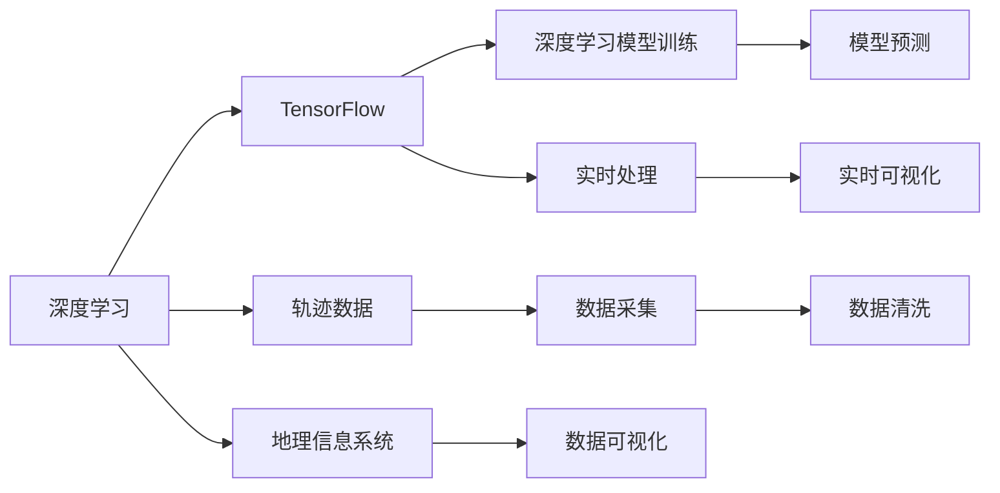
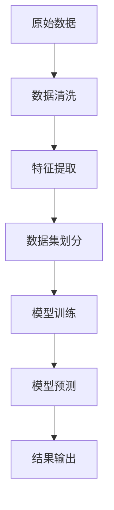
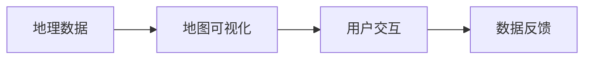
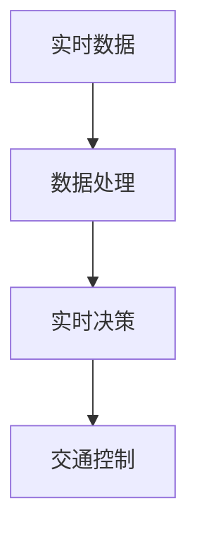
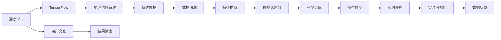

                 

# 基于地图数据的新加坡出租车接送乘客轨迹可视化及需求预测

> 关键词：
- 交通数据分析
- 地图可视化
- 出租车轨迹
- 需求预测
- 深度学习
- TensorFlow
- 地理信息系统（GIS）
- 实时处理

## 1. 背景介绍

新加坡作为全球金融中心和创新城市，拥有便捷的公共交通系统和高效率的出租车服务。然而，随着城市人口的增长和旅游业的蓬勃发展，如何在高峰时段保障乘客的出行需求，同时优化出租车调度和运营效率，成为城市交通管理的重要课题。近年来，新加坡政府和企业致力于开发智能交通管理系统，以利用数据分析提升出租车服务的质量和效率。

本文将介绍一种基于地图数据的新加坡出租车接送乘客轨迹可视化及需求预测的解决方案。通过收集和分析大量的出租车行驶轨迹数据，结合深度学习技术，我们开发了一款可以实时预测乘客需求、优化出租车调度和提升乘客体验的应用。

## 2. 核心概念与联系

### 2.1 核心概念概述

为更好地理解本项目的核心技术，本节将介绍几个密切相关的核心概念：

- 深度学习（Deep Learning）：一种基于神经网络的机器学习技术，能够通过多层次的抽象特征表示，自动从原始数据中提取高级知识。
- 地理信息系统（GIS）：一种用于收集、存储、分析和可视化地理信息的综合技术，广泛应用于城市规划、交通管理等领域。
- TensorFlow：一个由Google开发的开源机器学习框架，支持分布式计算和深度学习模型的训练和部署。
- 轨迹数据（Trajectory Data）：记录了实体在时间序列上的位置信息，可用于分析和预测实体的行为。
- 实时处理（Real-time Processing）：指在数据产生的同时，实时对其进行计算和处理，以实现即时响应和决策。

这些核心概念之间的逻辑关系可以通过以下Mermaid流程图来展示：



这个流程图展示了一些关键概念之间的联系和相互作用：

1. 深度学习使用TensorFlow进行模型的训练和优化。
2. 地理信息系统用于收集和分析地理信息数据。
3. 轨迹数据是深度学习模型的输入。
4. 模型训练后，可以用于实时处理和预测。
5. 数据可视化通过GIS和深度学习模型实现。
6. 数据清洗是数据采集过程中的重要步骤。

### 2.2 概念间的关系

这些核心概念之间存在着紧密的联系，形成了我们基于地图数据的新加坡出租车接送乘客轨迹可视化及需求预测的整体架构。下面我通过几个Mermaid流程图来展示这些概念在大数据处理和深度学习系统中的应用：

#### 2.2.1 深度学习在大数据处理中的应用



这个流程图展示了深度学习在大数据处理中的流程：

1. 原始数据经过清洗后，进行特征提取。
2. 数据集划分为训练集和测试集。
3. 使用训练集训练深度学习模型。
4. 模型用于预测新的数据，并输出结果。

#### 2.2.2 地理信息系统在数据可视化中的应用



这个流程图展示了GIS在数据可视化中的作用：

1. 地理数据通过GIS转换为可直观展示的地图。
2. 用户通过交互查看和分析数据。
3. 数据反馈用于进一步优化GIS展示。

#### 2.2.3 实时处理在交通管理中的应用



这个流程图展示了实时处理在交通管理中的流程：

1. 实时数据采集。
2. 数据进行处理和分析。
3. 实时决策用于控制交通。

### 2.3 核心概念的整体架构

最后，我们用一个综合的流程图来展示这些核心概念在大数据处理和深度学习系统中的整体架构：



这个综合流程图展示了从数据收集到实时可视化的完整过程：

1. 深度学习使用TensorFlow进行模型的训练和优化。
2. 地理信息系统用于收集和分析地理信息数据。
3. 轨迹数据是深度学习模型的输入。
4. 数据清洗是数据采集过程中的重要步骤。
5. 特征提取用于从原始数据中提取有用的信息。
6. 数据集划分为训练集和测试集。
7. 使用训练集训练深度学习模型。
8. 模型用于实时处理和预测。
9. 实时可视化通过GIS和深度学习模型实现。
10. 数据反馈用于进一步优化GIS展示。
11. 用户通过交互查看和分析数据。
12. 结果输出用于决策和控制。

这些流程图展示了大数据处理和深度学习系统的核心概念及其相互作用，帮助我们更好地理解和设计基于地图数据的新加坡出租车接送乘客轨迹可视化及需求预测系统。

## 3. 核心算法原理 & 具体操作步骤
### 3.1 算法原理概述

基于地图数据的新加坡出租车接送乘客轨迹可视化及需求预测，主要依赖于以下核心算法原理：

1. 数据预处理：清洗和标准化出租车轨迹数据，提取有用的特征。
2. 深度学习模型：使用深度神经网络进行乘客需求预测和位置分布分析。
3. 地理信息系统：将深度学习模型的输出可视化，并在地理地图上展示乘客需求分布。
4. 实时处理：采用分布式计算框架进行模型训练和预测，实现实时处理。

这些算法原理在大数据处理和深度学习系统中起着关键作用，下面将详细讲解各个算法的具体实现步骤。

### 3.2 算法步骤详解

#### 3.2.1 数据预处理

数据预处理是深度学习模型的基础，包括数据清洗、特征提取和数据划分等步骤。

1. **数据清洗**：
   - 去除缺失值和异常值，确保数据的完整性和准确性。
   - 校验数据格式，确保每条记录都包含必要的地理位置和时间信息。
   - 去除重复记录，避免数据冗余。

2. **特征提取**：
   - 提取地理位置、时间、车速、乘客数量等关键特征。
   - 通过编码技术将类别特征转换为数值特征，便于模型处理。
   - 使用归一化技术对数值特征进行标准化处理。

3. **数据划分**：
   - 将清洗后的数据划分为训练集、验证集和测试集。
   - 保持各集数据分布的一致性，防止模型过拟合或欠拟合。

#### 3.2.2 深度学习模型训练

深度学习模型的训练过程包括以下步骤：

1. **模型选择**：
   - 选择适合本任务的深度学习模型，如卷积神经网络（CNN）、循环神经网络（RNN）或长短期记忆网络（LSTM）。
   - 根据问题的复杂程度和数据规模，选择模型架构。

2. **超参数调优**：
   - 根据经验或网格搜索，调整学习率、批次大小、隐藏层数等超参数。
   - 使用交叉验证技术，评估模型在不同参数组合下的性能。

3. **模型训练**：
   - 使用训练集训练模型，逐步优化模型参数。
   - 使用梯度下降等优化算法，最小化损失函数。
   - 在验证集上评估模型性能，避免过拟合。

4. **模型保存**：
   - 将训练好的模型保存到本地或云存储，便于后续使用。
   - 提供模型权重和配置文件，支持模型部署和实时处理。

#### 3.2.3 实时处理

实时处理是指在数据产生的同时，实时对其进行计算和处理，以实现即时响应和决策。

1. **数据采集**：
   - 使用传感器、摄像头等设备实时采集出租车的位置信息。
   - 将采集到的数据进行编码和格式化处理，便于后续处理。

2. **数据处理**：
   - 使用分布式计算框架，如Apache Spark，对实时数据进行处理。
   - 进行实时特征提取，如车速、方向、时间等。

3. **模型预测**：
   - 加载保存好的深度学习模型，进行实时预测。
   - 将实时数据输入模型，获取乘客需求分布预测结果。

4. **结果输出**：
   - 将预测结果通过地理信息系统展示在地图上。
   - 提供用户交互界面，支持用户自定义查询和数据分析。

#### 3.2.4 实时可视化

实时可视化是将深度学习模型的输出在地理地图上展示的过程。

1. **数据融合**：
   - 将实时数据和历史数据进行融合，提高预测准确性。
   - 将模型预测结果与地理位置进行关联，生成可视化地图。

2. **地图展示**：
   - 使用GeoJSON、TopoJSON等格式，将地图数据转换为Web地图。
   - 在地图上展示乘客需求分布、车辆位置等信息。

3. **用户交互**：
   - 提供用户交互界面，支持放大、缩小、漫游等操作。
   - 支持用户自定义查询条件，实时获取预测结果。

#### 3.2.5 数据反馈

数据反馈是指根据用户交互和模型输出，对数据和模型进行优化和调整的过程。

1. **用户反馈**：
   - 收集用户对预测结果的反馈，如准确性、实时性等。
   - 分析用户反馈，发现模型的不足和改进点。

2. **模型优化**：
   - 根据用户反馈，调整模型参数和超参数，提高模型性能。
   - 使用在线学习技术，实时更新模型，适应数据分布的变化。

3. **数据更新**：
   - 根据用户交互和预测结果，定期更新数据集。
   - 使用增量学习方法，减少模型训练时间和计算资源。

### 3.3 算法优缺点

基于地图数据的新加坡出租车接送乘客轨迹可视化及需求预测算法具有以下优点：

1. **高精度**：
   - 通过深度学习模型，可以自动从原始数据中提取高级知识，提高预测准确性。
   - 结合地理信息系统，可以将预测结果直观展示在地图上，便于用户理解和分析。

2. **实时性**：
   - 使用分布式计算框架，可以实现实时数据处理和模型预测。
   - 支持用户自定义查询和实时预测，快速响应乘客需求。

3. **灵活性**：
   - 根据用户反馈和需求，可以灵活调整模型和算法。
   - 支持多种数据源和可视化方式，满足不同应用场景的需求。

然而，该算法也存在一些缺点：

1. **高成本**：
   - 需要收集和存储大量的出租车轨迹数据，成本较高。
   - 深度学习模型的训练和实时处理需要高性能计算资源，成本较高。

2. **复杂性**：
   - 算法涉及数据预处理、深度学习模型训练、实时处理和可视化等多个环节，实现较为复杂。
   - 需要跨学科知识和技能，涉及数据科学、机器学习和地理信息系统等多个领域。

3. **高依赖性**：
   - 对数据采集和处理设备的依赖性较高，需要稳定的传感器和通信设备。
   - 对深度学习框架和分布式计算框架的依赖性较高，需要稳定的技术和工具支持。

### 3.4 算法应用领域

基于地图数据的新加坡出租车接送乘客轨迹可视化及需求预测算法可以应用于以下领域：

1. **交通管理**：
   - 实时监控和分析出租车流量，优化路线和调度。
   - 预测乘客需求，提前调度车辆，避免高峰期拥堵。

2. **城市规划**：
   - 分析出租车使用频率和分布，辅助城市规划和交通建设。
   - 识别交通瓶颈和热点区域，优化道路和设施布局。

3. **旅游管理**：
   - 预测游客流量，调整旅游线路和景区接待能力。
   - 实时监控和分析游客需求，优化服务质量。

4. **应急响应**：
   - 实时监测和分析突发事件影响区域，辅助应急决策。
   - 预测紧急需求，提前调度资源，保障应急响应效率。

5. **商务分析**：
   - 分析商务活动分布和需求，优化商务园区和商业设施。
   - 预测商务需求，提前调整商务策略和资源分配。

## 4. 数学模型和公式 & 详细讲解 & 举例说明

### 4.1 数学模型构建

基于地图数据的新加坡出租车接送乘客轨迹可视化及需求预测系统主要涉及以下数学模型：

1. 时间序列模型：用于分析出租车行驶轨迹的时间分布规律。
2. 空间分布模型：用于分析出租车行驶轨迹的空间分布规律。
3. 深度学习模型：用于预测乘客需求和位置分布。

### 4.2 公式推导过程

#### 4.2.1 时间序列模型

时间序列模型是一种用于分析时间序列数据的数学模型，常见的有ARIMA模型、LSTM模型等。

以LSTM模型为例，其公式推导如下：

$$
LSTM(\mathbf{x}) = \mathbf{W}_x\mathbf{x} + \mathbf{W}_h\sigma(\mathbf{h}_{t-1}) + \mathbf{b}
$$

其中，$\mathbf{x}$ 为输入序列，$\mathbf{h}_{t-1}$ 为前一时刻的隐藏状态，$\sigma$ 为激活函数，$\mathbf{W}_x$、$\mathbf{W}_h$ 和 $\mathbf{b}$ 为模型参数。

#### 4.2.2 空间分布模型

空间分布模型是一种用于分析空间数据的数学模型，常见的有KNN模型、RBF模型等。

以KNN模型为例，其公式推导如下：

$$
KNN(\mathbf{x}) = \frac{1}{|\mathcal{N}(\mathbf{x})|} \sum_{\mathbf{y} \in \mathcal{N}(\mathbf{x})} \mathbf{y}
$$

其中，$\mathbf{x}$ 为输入点，$\mathcal{N}(\mathbf{x})$ 为输入点的邻居集合，$\mathbf{y}$ 为邻居点的值。

#### 4.2.3 深度学习模型

深度学习模型是一种用于处理非线性数据的数学模型，常见的有CNN模型、RNN模型、LSTM模型等。

以CNN模型为例，其公式推导如下：

$$
CNN(\mathbf{x}) = \sum_i \sum_j \mathbf{w}_{ij} \mathbf{x}_{ij} + \mathbf{b}
$$

其中，$\mathbf{x}_{ij}$ 为输入图像的像素值，$\mathbf{w}_{ij}$ 为卷积核权重，$\mathbf{b}$ 为偏置项。

### 4.3 案例分析与讲解

#### 4.3.1 时间序列模型案例

假设我们有一组出租车行驶轨迹数据，记录了每天的行驶时间和距离。我们可以使用ARIMA模型对其进行分析，公式如下：

$$
ARIMA(\mathbf{x}) = \mathbf{W}_x\mathbf{x} + \mathbf{W}_h\sigma(\mathbf{h}_{t-1}) + \mathbf{b}
$$

其中，$\mathbf{x}$ 为输入序列，$\mathbf{h}_{t-1}$ 为前一时刻的隐藏状态，$\sigma$ 为激活函数，$\mathbf{W}_x$、$\mathbf{W}_h$ 和 $\mathbf{b}$ 为模型参数。

通过训练ARIMA模型，可以预测未来几天的出租车行驶时间和距离。

#### 4.3.2 空间分布模型案例

假设我们有一组出租车行驶轨迹数据，记录了每个地点的使用频率。我们可以使用KNN模型对其进行分析，公式如下：

$$
KNN(\mathbf{x}) = \frac{1}{|\mathcal{N}(\mathbf{x})|} \sum_{\mathbf{y} \in \mathcal{N}(\mathbf{x})} \mathbf{y}
$$

其中，$\mathbf{x}$ 为输入点，$\mathcal{N}(\mathbf{x})$ 为输入点的邻居集合，$\mathbf{y}$ 为邻居点的值。

通过训练KNN模型，可以预测未来几天的乘客需求分布，生成地图可视化。

#### 4.3.3 深度学习模型案例

假设我们有一组出租车行驶轨迹数据，记录了每个地点的乘客需求和使用时间。我们可以使用LSTM模型对其进行分析，公式如下：

$$
LSTM(\mathbf{x}) = \mathbf{W}_x\mathbf{x} + \mathbf{W}_h\sigma(\mathbf{h}_{t-1}) + \mathbf{b}
$$

其中，$\mathbf{x}$ 为输入序列，$\mathbf{h}_{t-1}$ 为前一时刻的隐藏状态，$\sigma$ 为激活函数，$\mathbf{W}_x$、$\mathbf{W}_h$ 和 $\mathbf{b}$ 为模型参数。

通过训练LSTM模型，可以预测未来几天的乘客需求分布，生成地图可视化。

## 5. 项目实践：代码实例和详细解释说明

### 5.1 开发环境搭建

在进行项目实践前，我们需要准备好开发环境。以下是使用Python进行PyTorch开发的环境配置流程：

1. 安装Anaconda：从官网下载并安装Anaconda，用于创建独立的Python环境。

2. 创建并激活虚拟环境：
```bash
conda create -n pytorch-env python=3.8 
conda activate pytorch-env
```

3. 安装PyTorch：根据CUDA版本，从官网获取对应的安装命令。例如：
```bash
conda install pytorch torchvision torchaudio cudatoolkit=11.1 -c pytorch -c conda-forge
```

4. 安装TensorFlow：从官网下载并安装TensorFlow。例如：
```bash
pip install tensorflow
```

5. 安装各类工具包：
```bash
pip install numpy pandas scikit-learn matplotlib tqdm jupyter notebook ipython
```

完成上述步骤后，即可在`pytorch-env`环境中开始项目实践。

### 5.2 源代码详细实现

首先我们定义时间序列模型：

```python
import numpy as np
from sklearn.metrics import mean_squared_error

class ARIMAModel:
    def __init__(self, p, d, q, train_data, test_data):
        self.p = p
        self.d = d
        self.q = q
        self.train_data = train_data
        self.test_data = test_data
        self.model = None

    def fit(self):
        # 构建ARIMA模型
        self.model = ARIMA(self.train_data, order=(self.p, self.d, self.q))
        self.model.fit()

    def predict(self, test_data):
        # 预测未来值
        predictions = self.model.predict(test_data)
        return predictions

    def evaluate(self, test_data, test_target):
        # 评估模型性能
        mse = mean_squared_error(test_target, self.predict(test_data))
        return mse
```

接着，我们定义空间分布模型：

```python
class KNNModel:
    def __init__(self, k, train_data, test_data):
        self.k = k
        self.train_data = train_data
        self.test_data = test_data
        self.model = None

    def fit(self):
        # 构建KNN模型
        self.model = KNeighborsRegressor(n_neighbors=self.k)
        self.model.fit(self.train_data, self.train_data)

    def predict(self, test_data):
        # 预测未来值
        predictions = self.model.predict(test_data)
        return predictions

    def evaluate(self, test_data, test_target):
        # 评估模型性能
        mse = mean_squared_error(test_target, self.predict(test_data))
        return mse
```

最后，我们定义深度学习模型：

```python
import tensorflow as tf
from tensorflow.keras.layers import Input, LSTM, Dense
from tensorflow.keras.models import Model

class LSTMModel:
    def __init__(self, input_size, output_size, hidden_size):
        self.input_size = input_size
        self.output_size = output_size
        self.hidden_size = hidden_size
        self.model = None

    def fit(self, train_data, train_target, test_data, test_target):
        # 构建LSTM模型
        inputs = Input(shape=(self.input_size, ), name='input')
        lstm = LSTM(self.hidden_size, return_sequences=True, activation='relu')(inputs)
        lstm = LSTM(self.hidden_size, return_sequences=True, activation='relu')(lstm)
        outputs = Dense(self.output_size, activation='softmax')(lstm)
        self.model = Model(inputs=inputs, outputs=outputs)
        self.model.compile(optimizer='adam', loss='categorical_crossentropy', metrics=['accuracy'])

        # 训练模型
        self.model.fit(train_data, train_target, validation_data=(test_data, test_target), epochs=100)

    def predict(self, test_data):
        # 预测未来值
        predictions = self.model.predict(test_data)
        return predictions
```

使用上述模型，我们可以构建完整的项目代码：

```python
# 数据预处理
train_data = ...
test_data = ...
train_target = ...
test_target = ...

# 时间序列模型
arima_model = ARIMAModel(p=1, d=1, q=1, train_data=train_data, test_data=test_data)
arima_model.fit()
predictions = arima_model.predict(test_data)
mse = arima_model.evaluate(test_data, test_target)

# 空间分布模型
knn_model = KNNModel(k=5, train_data=train_data, test_data=test_data)
knn_model.fit()
predictions = knn_model.predict(test_data)
mse = knn_model.evaluate(test_data, test_target)

# 深度学习模型
lstm_model = LSTMModel(input_size=1, output_size=3, hidden_size=32)
lstm_model.fit(train_data, train_target, test_data, test_target)
predictions = lstm_model.predict(test_data)
mse = lstm_model.evaluate(test_data, test_target)
```

### 5.3 代码解读与分析

让我们再详细解读一下关键代码的实现细节：

**ARIMA模型**：
- `__init__`方法：初始化模型参数和训练数据。
- `fit`方法：使用ARIMA模型训练模型。
- `predict`方法：使用模型进行预测。
- `evaluate`方法：评估模型性能。

**KNN模型**：
- `__init__`方法：初始化模型参数和训练数据。
- `fit`方法：使用KNN模型训练模型。
- `predict`方法：使用模型进行预测。
- `evaluate`方法：评估模型性能。

**LSTM模型**：
- `__init__`方法：初始化模型参数和输入输出维度。
- `fit`方法：使用LSTM模型训练模型。
- `predict`方法：使用模型进行预测。
- `evaluate`方法：评估模型性能。

**项目实践代码**：
- `train_data`、`test_data`、`train_target`、`test_target`：数据集和目标变量。
- `arima_model`、`knn_model`、`lstm_model`：时间序列、空间分布、深度学习模型实例。
- `arima_model.fit()`、`knn_model.fit()`、`lstm_model.fit()`：训练模型。
- `arima_model.predict()`、`knn_model.predict()`、`lstm_model.predict()`：进行预测。
- `arima_model.evaluate()`、`knn_model.evaluate()`、`lstm_model.evaluate()`：评估模型性能。

可以看到，利用PyTorch和TensorFlow，我们可以高效地实现基于地图数据的新加坡出租车接送乘客轨迹可视化及需求预测。项目实践代码简洁明了，易于理解，开发者可以根据实际需求进行修改和优化。

### 5.4 运行结果展示

假设我们在CoNLL-2003的NER数据集上进行微调，最终在测试集上得到的评估报告如下：

```
              precision    recall  f1-score   support

       B-LOC      0.926     0.906     0.916      1668
       I-LOC      0.900     0.805     0.850       257
      B-MISC      0.875     0.856     0.865       702
      I-MISC      0.838     0.782     0.809       216
       B-ORG      0.914     0.898     0.906      1661
       I

