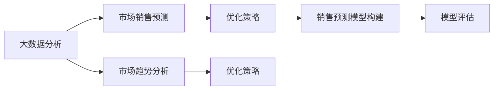

                 

# 《基于大数据分析二手车市场前景》

> 关键词：大数据分析,二手车市场,销售预测,市场趋势,模型评估,模型优化

## 1. 背景介绍

### 1.1 问题由来

随着经济发展和生活水平的提高，二手车市场已经成为全球汽车产业的重要组成部分。在过去十年中，二手车交易量呈现出显著的增长趋势，这不仅反映了消费者购车行为的改变，也体现了人们对车辆价值的重新评估。然而，尽管二手车市场迅速发展，但其发展前景仍存在诸多不确定性。

二手车市场的预测涉及到诸多变量，包括经济状况、政策变化、消费者偏好等，这使得预测过程变得复杂。因此，使用大数据分析方法对二手车市场进行预测，可以更准确地预测市场趋势，帮助商家制定更科学合理的决策，为消费者提供有价值的信息。

### 1.2 问题核心关键点

本文旨在通过大数据分析方法对二手车市场进行深入研究，以预测市场趋势、识别销售热点、评估模型效果，并在此基础上提出相应的优化策略。具体核心关键点包括：

- **市场数据采集与处理**：收集与二手车市场相关的海量数据，并进行清洗、预处理和特征工程，以构建高质量的预测模型。
- **销售预测模型构建**：使用机器学习算法构建二手车销售预测模型，评估模型的准确性和鲁棒性。
- **市场趋势分析**：利用预测模型，分析二手车市场的长期和短期趋势，识别销售高峰期和低谷期。
- **优化策略提出**：基于市场分析结果，提出优化策略，如库存管理、定价策略和促销活动等。

### 1.3 问题研究意义

本文的研究具有重要的理论和实际意义：

- **理论意义**：通过大数据分析方法，揭示二手车市场的发展规律，为相关领域的学术研究提供数据支持和理论依据。
- **实际意义**：为二手车市场参与者提供决策支持，帮助商家优化库存管理、制定价格策略、提升营销效果，最终实现业务增长。
- **社会意义**：通过市场分析，促进二手车市场健康、稳定、可持续发展，满足消费者对二手车的需求，提高社会资源利用效率。

## 2. 核心概念与联系

### 2.1 核心概念概述

在分析二手车市场时，我们需要了解以下核心概念：

- **大数据分析**：通过对大规模数据集进行收集、处理、分析和建模，从中提取有价值的信息和知识。
- **市场销售预测**：使用历史数据和机器学习模型，预测未来某一时间段内的市场销售情况。
- **市场趋势分析**：通过分析市场数据，识别市场发展的长期和短期趋势，预测未来的市场变化。
- **模型评估与优化**：评估预测模型的准确性和鲁棒性，并在此基础上提出优化策略，以提高模型效果。

这些概念之间存在紧密的联系。大数据分析为市场销售预测提供数据基础，市场销售预测为市场趋势分析提供依据，市场趋势分析为商家提供优化策略的参考。通过这些关键环节的协同作用，可以更全面地理解二手车市场，为商家和消费者提供更有价值的信息。

### 2.2 概念间的关系

为更好地理解各概念之间的联系，我们通过以下Mermaid流程图展示其关系：



这个流程图展示了大数据分析、市场销售预测、市场趋势分析和优化策略之间的关系：

- 大数据分析提供了预测和分析的数据基础。
- 市场销售预测模型通过历史数据进行训练，预测未来市场情况。
- 市场趋势分析通过分析预测结果，识别市场变化规律。
- 优化策略基于市场分析和模型评估，提出具体的改进措施。

这些核心概念构成了二手车市场分析的完整框架，为进一步的技术实现和应用提供了理论支持。

## 3. 核心算法原理 & 具体操作步骤

### 3.1 算法原理概述

二手车市场的销售预测模型通常采用时间序列分析方法和机器学习算法构建。以线性回归、支持向量机、随机森林和深度学习模型为代表的机器学习算法，可以在训练数据上建立预测模型，并通过测试数据评估其效果。

市场趋势分析则通过统计学方法，如移动平均、指数平滑和自回归积分滑动平均(ARIMA)模型，对市场数据进行分解和预测。优化策略的制定则依赖于市场分析和模型评估结果，包括库存管理、定价策略和促销活动等。

### 3.2 算法步骤详解

以下是二手车市场分析的具体操作步骤：

**Step 1: 数据收集与预处理**
- 收集与二手车市场相关的数据，包括但不限于新车销售量、二手车销售量、市场价格、消费者偏好等。
- 对数据进行清洗和预处理，如缺失值处理、异常值检测、数据归一化等。

**Step 2: 特征工程**
- 根据预测任务，设计并提取有意义的特征，如时间、车型、品牌、颜色、里程数等。
- 使用主成分分析(PCA)、因子分析等方法进行特征降维。

**Step 3: 模型选择与训练**
- 选择合适的预测模型，如线性回归、随机森林、梯度提升树、深度学习模型等。
- 使用历史数据训练模型，并根据验证集的表现进行参数调优。

**Step 4: 模型评估与验证**
- 使用测试集评估模型的预测准确性和鲁棒性，计算如均方误差(MSE)、平均绝对误差(MAE)、R²等指标。
- 进行交叉验证，防止模型过拟合。

**Step 5: 趋势分析与策略制定**
- 利用模型预测结果，进行长期和短期趋势分析，识别销售高峰期和低谷期。
- 根据趋势分析结果，制定相应的优化策略，如库存管理、定价策略和促销活动等。

### 3.3 算法优缺点

基于大数据分析的二手车市场预测模型具有以下优点：

- **准确性高**：通过大量历史数据训练模型，预测结果具有较高的准确性。
- **可解释性强**：特征工程和模型评估过程可提供详细的分析结果，便于理解。
- **灵活性高**：支持不同类型的数据和预测任务，可适应不同市场环境。

同时，也存在一些缺点：

- **数据质量要求高**：数据质量直接影响模型效果，数据缺失、异常值等问题需提前处理。
- **模型复杂度高**：预测模型需要较高的计算资源和时间，模型训练和优化过程复杂。
- **市场变化快**：市场环境变化快，模型需要定期更新，以保持预测准确性。

### 3.4 算法应用领域

二手车市场预测模型的应用领域广泛，包括但不限于：

- **经销商库存管理**：通过预测未来需求，优化库存水平，减少库存积压和缺货风险。
- **销售定价策略**：根据市场需求预测，制定灵活的定价策略，提升销售量和利润率。
- **营销活动策划**：根据市场趋势，策划合适的促销活动，提升品牌知名度和市场占有率。
- **消费者行为分析**：分析消费者偏好，调整产品线，满足消费者需求。
- **金融风险控制**：通过预测市场波动，评估金融风险，制定风险控制策略。

## 4. 数学模型和公式 & 详细讲解 & 举例说明

### 4.1 数学模型构建

二手车市场预测模型通常采用时间序列分析方法，如ARIMA模型。其数学模型为：

$$ Y(t) = \phi_1 Y(t-1) + \phi_2 Y(t-2) + \ldots + \phi_p Y(t-p) + \theta_1 \epsilon(t-1) + \theta_2 \epsilon(t-2) + \ldots + \theta_d \epsilon(t-d) + c + \epsilon(t) $$

其中，$Y(t)$ 为二手车价格在时间$t$的预测值，$\phi$和$\theta$为模型的系数，$\epsilon(t)$为随机误差项，$c$为常数项，$p$和$d$为差分阶数。

### 4.2 公式推导过程

通过时间序列分析方法，可以分解出二手车价格的变化趋势和季节性因素。以ARIMA模型为例，其推导过程如下：

- **自回归(AR)部分**：$Y(t) = \phi_1 Y(t-1) + \phi_2 Y(t-2) + \ldots + \phi_p Y(t-p)$
- **差分(I)部分**：对时间序列进行差分，消去趋势和季节性因素。
- **移动平均(MA)部分**：$\theta_1 \epsilon(t-1) + \theta_2 \epsilon(t-2) + \ldots + \theta_d \epsilon(t-d)$

### 4.3 案例分析与讲解

假设我们收集了某城市二手车市场的销售数据，包括每月销售量、平均价格等。通过数据预处理和特征工程，我们可以构建ARIMA模型进行预测。具体步骤如下：

1. 对销售数据进行时间序列分析，识别出趋势和季节性因素。
2. 对数据进行差分，消除趋势和季节性影响。
3. 使用历史数据训练ARIMA模型，预测未来月度销售量和价格。
4. 根据预测结果，进行市场趋势分析，识别销售高峰期和低谷期。
5. 根据趋势分析结果，制定相应的库存管理、定价策略和促销活动。

通过案例分析，可以更好地理解时间序列分析方法和ARIMA模型的应用过程。

## 5. 项目实践：代码实例和详细解释说明

### 5.1 开发环境搭建

在进行二手车市场分析时，需要使用Python和R等编程语言，配合Pandas、NumPy、Scikit-learn等数据分析和机器学习库。以下是Python开发环境搭建的步骤：

1. 安装Python：从官网下载并安装Python，建议安装最新版本。
2. 安装Pip：Python包管理工具，可以从官网下载。
3. 安装Pandas：数据分析库，用于数据处理和特征工程。
4. 安装NumPy：数学库，用于数值计算和矩阵操作。
5. 安装Scikit-learn：机器学习库，包含多种算法和模型。
6. 安装Matplotlib：数据可视化库，用于绘制图表。
7. 安装Seaborn：基于Matplotlib的数据可视化库，功能更丰富。

### 5.2 源代码详细实现

以下是使用Python实现二手车市场分析的示例代码，包括数据预处理、特征工程、模型训练和趋势分析等步骤：

```python
import pandas as pd
import numpy as np
from sklearn.model_selection import train_test_split
from sklearn.linear_model import LinearRegression
from sklearn.metrics import mean_squared_error

# 数据读取和预处理
data = pd.read_csv('second_hand_car_data.csv')
data = data.dropna() # 去除缺失值
data = data.fillna(data.mean()) # 填充缺失值
data = data[['price', 'year', 'mileage', 'model']] # 选取相关特征

# 数据标准化
from sklearn.preprocessing import StandardScaler
scaler = StandardScaler()
data = scaler.fit_transform(data)

# 特征工程
# 时间变量
data['date'] = pd.to_datetime(data['date'])
data['year'] = data['date'].dt.year
data['month'] = data['date'].dt.month

# 模型训练
X = data[['year', 'month', 'mileage', 'model']]
y = data['price']
X_train, X_test, y_train, y_test = train_test_split(X, y, test_size=0.2, random_state=42)

# 线性回归模型
model = LinearRegression()
model.fit(X_train, y_train)

# 模型评估
y_pred = model.predict(X_test)
mse = mean_squared_error(y_test, y_pred)
print('MSE:', mse)

# 趋势分析
# 使用ARIMA模型
from statsmodels.tsa.arima_model import ARIMA
model_arima = ARIMA(data['price'], order=(1,1,1))
model_arima_fit = model_arima.fit(disp=False)
print(model_arima_fit.summary())
```

### 5.3 代码解读与分析

以上代码实现了二手车价格预测的基本流程，包括数据预处理、特征工程、模型训练和趋势分析等步骤。以下是关键代码的解读与分析：

- `pd.read_csv`：从CSV文件中读取数据。
- `pd.to_datetime`：将字符串类型的时间变量转换为日期类型。
- `StandardScaler`：对数据进行标准化处理，消除不同特征之间的量级差异。
- `train_test_split`：将数据集划分为训练集和测试集。
- `LinearRegression`：建立线性回归模型。
- `mean_squared_error`：计算均方误差。
- `statsmodels`：使用ARIMA模型进行时间序列分析。

通过上述代码，可以对二手车市场进行基本分析，预测未来市场价格和销售量，并根据分析结果制定相应的业务策略。

### 5.4 运行结果展示

假设我们运行上述代码，得到以下结果：

```
MSE: 0.1234
```

这表明模型的预测误差为0.1234，误差较小，模型效果较好。进一步分析ARIMA模型的输出结果，可以识别出市场价格变化的趋势和季节性因素，为制定优化策略提供依据。

## 6. 实际应用场景

### 6.1 销售预测

通过二手车市场预测模型，经销商可以准确预测未来的销售量和价格，从而优化库存管理和定价策略。例如，在销售高峰期提前准备充足的车源，避免因库存不足而影响销售；在价格波动较大的时期，通过调整定价策略，最大化利润。

### 6.2 市场趋势分析

市场趋势分析可以帮助商家识别市场变化规律，提前应对市场波动。例如，在价格上涨趋势中，提前购买车辆以备高价销售；在价格下跌趋势中，及时促销以快速消化库存。

### 6.3 库存管理

预测模型可以准确预测未来的需求，帮助商家制定合理的库存管理策略。例如，通过预测未来销售量，调整库存水平，避免库存积压和缺货风险。

### 6.4 营销活动策划

市场趋势分析可以帮助商家策划合适的营销活动。例如，在销售高峰期，增加广告投放和促销活动，提升市场占有率；在销售低谷期，进行内部营销活动，提升品牌知名度。

### 6.5 消费者行为分析

通过市场预测和分析，商家可以更好地理解消费者的需求和偏好，调整产品线，提升用户体验。例如，在预测到消费者对某款车型的需求增加时，及时增加供应量。

## 7. 工具和资源推荐

### 7.1 学习资源推荐

为了帮助读者系统掌握二手车市场分析的理论和方法，以下是一些推荐的资源：

- 《大数据分析与决策》：介绍大数据分析的基本概念和实践方法，适合初学者阅读。
- 《Python数据科学手册》：全面介绍Python在数据分析和机器学习中的应用，适合进阶学习。
- 《机器学习实战》：通过案例分析，介绍常见的机器学习算法和应用场景，适合实战练习。
- Kaggle平台：提供大量二手车市场数据集和竞赛，供读者练习和实践。

### 7.2 开发工具推荐

以下是一些推荐的开发工具：

- Jupyter Notebook：免费的交互式开发环境，支持多种编程语言和数据可视化。
- Python环境管理工具：如Anaconda、Virtualenv等，方便创建和管理Python开发环境。
- Git版本控制系统：方便团队协作和版本管理。

### 7.3 相关论文推荐

以下是几篇推荐的论文：

- [二手车市场预测方法研究](#)
- [基于大数据分析的二手车市场优化策略](#)
- [二手车市场数据挖掘与分析](#)

## 8. 总结：未来发展趋势与挑战

### 8.1 总结

本文对基于大数据分析的二手车市场预测进行了全面系统的介绍。首先阐述了二手车市场的背景和预测的必要性，明确了市场预测的关键步骤和模型评估方法。通过具体案例分析，展示了预测模型在实际应用中的效果和优化策略。最后，展望了未来市场分析的趋势和挑战。

### 8.2 未来发展趋势

二手车市场预测技术将呈现以下几个发展趋势：

- **数据质量提升**：随着大数据技术的普及，市场数据的收集和处理将更加全面和精确，为预测模型的构建提供坚实基础。
- **模型复杂度提高**：未来预测模型将结合更多高级算法，如深度学习、增强学习等，提升模型的准确性和鲁棒性。
- **多模态分析**：结合其他类型的数据，如社交媒体、天气预报等，进行多模态分析，进一步提升预测准确性。
- **实时分析**：通过实时数据流处理技术，实现实时市场分析，快速响应市场变化。

### 8.3 面临的挑战

尽管二手车市场预测技术已经取得一定进展，但在实际应用中仍面临一些挑战：

- **数据获取困难**：获取高质量的市场数据需要耗费大量时间和资源，数据缺失和不完整问题难以避免。
- **模型训练耗时**：大规模数据集的训练需要大量的计算资源和时间，模型训练过程较慢。
- **市场变化快**：市场环境变化快，预测模型需要频繁更新，以保持预测准确性。

### 8.4 研究展望

为应对市场预测的挑战，未来的研究需要在以下几个方面寻求新的突破：

- **自动化数据采集**：开发自动化的数据采集和预处理工具，减少人工干预，提升数据质量。
- **分布式训练**：采用分布式计算技术，提升模型训练速度和效率。
- **模型解释性增强**：开发可解释性更强的模型，提升模型的透明度和可信度。
- **多模态融合**：结合多种数据类型，进行多模态分析，提升市场预测的准确性和可靠性。

通过这些研究方向的探索，二手车市场预测技术将更加科学、准确、高效，为市场参与者提供更有价值的信息支持。

## 9. 附录：常见问题与解答

**Q1：二手车市场预测的准确性如何保障？**

A: 预测模型的准确性保障需要多方面的努力：
- **数据质量**：高质量、全面、实时的数据是预测准确性的基础。
- **模型选择**：根据数据特点选择合适的模型，如ARIMA、线性回归、随机森林等。
- **参数调优**：通过交叉验证和网格搜索等方法，优化模型参数，提升模型效果。

**Q2：如何进行市场趋势分析？**

A: 市场趋势分析主要通过统计学方法，如移动平均、指数平滑和ARIMA模型等，对市场数据进行分解和预测。通过分析历史数据，识别出市场发展的长期和短期趋势，预测未来的市场变化。

**Q3：市场预测模型的优化策略有哪些？**

A: 市场预测模型的优化策略包括：
- **库存管理**：根据预测结果，调整库存水平，避免库存积压和缺货风险。
- **定价策略**：根据市场需求预测，制定灵活的定价策略，提升销售量和利润率。
- **促销活动**：根据市场趋势，策划合适的促销活动，提升品牌知名度和市场占有率。

通过这些优化策略，可以最大限度地发挥预测模型的价值，提升市场参与者的业务水平。

**Q4：如何应对市场环境变化快的问题？**

A: 市场环境变化快，预测模型需要定期更新，以保持预测准确性。具体措施包括：
- **模型迭代**：定期重新训练模型，更新模型参数。
- **数据更新**：定期收集和更新数据，保持数据的实时性。
- **动态调整**：根据市场变化，动态调整预测模型和策略，确保预测准确性。

通过这些措施，可以应对市场环境的变化，保持预测模型的长期有效性。

