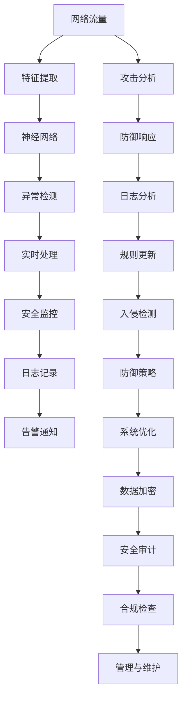
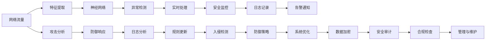

                 

# 基于深度学习的入侵检测系统设计与实现

> 关键词：入侵检测,深度学习,神经网络,异常检测,安全监控,实时处理,特征提取

## 1. 背景介绍

### 1.1 问题由来

网络安全是现代信息社会面临的一个重大挑战。随着互联网的普及和移动互联网的兴起，网络攻击手段日趋复杂，企业、机构和个人的安全需求日益迫切。传统的入侵检测系统(IDS)主要依赖规则匹配和签名搜索技术，存在误报率高、规则更新困难等问题，难以应对日益多样化的攻击手段。近年来，深度学习技术在图像、语音、自然语言等领域取得了重大突破，基于神经网络的入侵检测系统(NIDS)应运而生。

NIDS系统利用深度学习强大的特征学习和异常检测能力，能够自动分析网络数据流量，识别出异常行为和攻击手段。与传统的IDS相比，NIDS具备以下优势：
- 自适应性更强。能够根据历史数据自动学习攻击模式，适应新的攻击手段。
- 检测效率更高。能够实时处理大量网络数据，检测速度更快。
- 误报率更低。基于深度学习模型的异常检测能够自动学习正常流量特征，从而减少误报。
- 泛化能力更强。具备跨领域学习能力，能够适应多种网络环境和应用场景。

本节将重点介绍基于深度学习的入侵检测系统设计与实现，包括系统架构、核心算法、应用场景等，以期为网络安全领域的研究和应用提供参考。

### 1.2 问题核心关键点

基于深度学习的入侵检测系统设计涉及多个关键技术点：
1. 网络流量特征提取：如何将网络数据转化为神经网络的输入特征。
2. 异常检测模型选择：如何选择适当的深度学习模型进行入侵检测。
3. 模型训练与优化：如何训练深度学习模型，并优化其性能。
4. 实时处理与响应：如何实现系统的高实时性，快速响应异常行为。
5. 系统可扩展性与可靠性：如何设计系统架构，保障其可扩展性与高可靠性。

这些技术点相互关联，共同构成一个完整的入侵检测系统。下面将逐一介绍这些核心技术。

## 2. 核心概念与联系

### 2.1 核心概念概述

在进行深度学习入侵检测系统的设计与实现之前，首先需要明确以下几个核心概念：

- **入侵检测系统(IDS)**：用于监控网络流量，检测出潜在的安全威胁和异常行为的技术手段。IDS可以分为网络IDS(NIDS)和主机IDS(HIDS)两种，NIDS主要关注网络层面的安全威胁，HIDS则重点关注主机层面的安全行为。
- **深度学习(Deep Learning)**：一类利用多层神经网络进行特征学习和模式识别的机器学习技术。深度学习具备强大的自适应能力和泛化能力，能够自动从数据中学习特征，并进行复杂的模式识别。
- **神经网络(Neural Network)**：深度学习的核心组成部分，由多层神经元节点和连接边构成。神经网络通过反向传播算法进行模型训练，能够自动学习输入数据的高层次特征表示。
- **异常检测(Anomaly Detection)**：一种无需标注数据进行训练的检测方法，通过学习正常行为模式，自动识别出异常行为。异常检测在入侵检测中具有重要应用，能够有效降低误报率，提升检测准确性。
- **实时处理(Real-time Processing)**：指系统能够实时响应和处理网络数据，保证入侵检测的及时性。实时处理要求系统具备高吞吐量和低延迟。
- **可扩展性(Scalability)**：指系统能够根据负载需求进行扩展，支持海量数据的处理。可扩展性要求系统具备良好的分布式架构和水平扩展能力。
- **可靠性(Reliability)**：指系统具备高可用性和容错能力，能够在故障发生时保证服务连续性。可靠性要求系统具备冗余设计、故障切换等机制。

这些核心概念之间存在着紧密的联系，形成了入侵检测系统的完整生态系统。下面通过几个Mermaid流程图来展示这些概念之间的关系：



这个流程图展示了入侵检测系统的主要功能和各个模块之间的关系：

1. **网络流量**：入侵检测系统的数据源，包括网络包、日志文件等。
2. **特征提取**：将网络流量数据转化为神经网络的输入特征。
3. **神经网络**：利用深度学习模型对输入特征进行自动学习，提取高层次的特征表示。
4. **异常检测**：基于神经网络模型，学习正常行为模式，识别出异常行为。
5. **实时处理**：确保系统能够实时响应和处理网络数据。
6. **安全监控**：实时监控网络安全状态，及时发现和处理异常行为。
7. **日志记录**：记录入侵检测过程中的关键信息，便于后续分析和审计。
8. **告警通知**：在检测到异常行为时，发出告警通知，及时采取防御措施。
9. **攻击分析**：对检测到的异常行为进行深入分析，识别出攻击手段。
10. **防御响应**：根据攻击分析结果，采取相应的防御措施，保障系统安全。
11. **日志分析**：对日志记录进行分析和统计，识别出攻击模式。
12. **规则更新**：根据日志分析结果，更新和优化入侵检测规则。
13. **入侵检测**：将神经网络模型与规则引擎结合，实现更高效的入侵检测。
14. **防御策略**：根据防御响应结果，调整和优化安全策略。
15. **系统优化**：对入侵检测系统进行性能优化，提高系统的效率和可靠性。
16. **数据加密**：对敏感数据进行加密处理，保障数据安全。
17. **安全审计**：对入侵检测系统进行定期的安全审计，检查系统漏洞和安全隐患。
18. **合规检查**：确保系统符合法律法规和行业标准，保障合规性。
19. **管理与维护**：对入侵检测系统进行管理和维护，保障系统的正常运行。

这些核心概念共同构成了入侵检测系统的完整生态系统，每个模块都是系统功能的重要组成部分。

### 2.2 概念间的关系

这些核心概念之间存在着紧密的联系，形成了入侵检测系统的完整生态系统。下面通过几个Mermaid流程图来展示这些概念之间的关系：

#### 2.2.1 网络流量与特征提取的关系



这个流程图展示了网络流量、特征提取、神经网络、异常检测等模块之间的关系。

- **网络流量**：是入侵检测系统的数据源，特征提取模块负责将网络流量数据转化为神经网络的输入特征。
- **特征提取**：通过提取网络流量的关键特征，将数据转化为神经网络的输入。
- **神经网络**：利用深度学习模型对输入特征进行自动学习，提取高层次的特征表示。
- **异常检测**：基于神经网络模型，学习正常行为模式，识别出异常行为。
- **实时处理**：确保系统能够实时响应和处理网络数据。
- **安全监控**：实时监控网络安全状态，及时发现和处理异常行为。
- **日志记录**：记录入侵检测过程中的关键信息，便于后续分析和审计。
- **告警通知**：在检测到异常行为时，发出告警通知，及时采取防御措施。
- **攻击分析**：对检测到的异常行为进行深入分析，识别出攻击手段。
- **防御响应**：根据攻击分析结果，采取相应的防御措施，保障系统安全。
- **日志分析**：对日志记录进行分析和统计，识别出攻击模式。
- **规则更新**：根据日志分析结果，更新和优化入侵检测规则。
- **入侵检测**：将神经网络模型与规则引擎结合，实现更高效的入侵检测。
- **防御策略**：根据防御响应结果，调整和优化安全策略。
- **系统优化**：对入侵检测系统进行性能优化，提高系统的效率和可靠性。
- **数据加密**：对敏感数据进行加密处理，保障数据安全。
- **安全审计**：对入侵检测系统进行定期的安全审计，检查系统漏洞和安全隐患。
- **合规检查**：确保系统符合法律法规和行业标准，保障合规性。
- **管理与维护**：对入侵检测系统进行管理和维护，保障系统的正常运行。

通过这些流程图，我们可以更清晰地理解入侵检测系统各个模块之间的关系，为后续深入讨论具体的系统实现奠定基础。

## 3. 核心算法原理 & 具体操作步骤
### 3.1 算法原理概述

基于深度学习的入侵检测系统（NIDS）的核心算法主要包括以下几个方面：

1. **网络流量特征提取**：将网络数据转化为神经网络的输入特征。
2. **异常检测模型选择**：选择合适的深度学习模型进行入侵检测。
3. **模型训练与优化**：训练深度学习模型，并优化其性能。
4. **实时处理与响应**：实现系统的高实时性，快速响应异常行为。
5. **系统可扩展性与可靠性**：设计系统架构，保障其可扩展性与高可靠性。

本节将重点介绍这些核心算法的原理和操作步骤。

### 3.2 算法步骤详解

#### 3.2.1 网络流量特征提取

网络流量特征提取是NIDS系统的第一步，将网络数据转化为神经网络的输入特征，是后续模型训练和异常检测的基础。常见的网络流量特征提取方法包括：

1. **流量统计**：统计网络流量中的各项指标，如数据包数量、数据包大小、带宽利用率等。
2. **流量分段**：将网络流量分段处理，提取每段流量的关键特征。
3. **流量特征提取**：利用PCA、LDA、TF-IDF等方法提取流量特征。
4. **特征归一化**：对提取的特征进行归一化处理，避免不同特征之间的量纲差异。
5. **特征选择**：选择对入侵检测有用的特征，减少模型的复杂度。

下面以流量统计和特征选择为例，详细介绍网络流量特征提取的详细步骤：

**流量统计**

网络流量特征提取的第一步是对网络数据进行流量统计，统计出网络流量中的各项指标。具体步骤如下：

1. **数据采集**：通过网络监听器或协议分析工具，采集网络流量数据。
2. **数据预处理**：对采集的数据进行预处理，如去重、去噪、时间对齐等。
3. **指标计算**：计算网络流量中的各项指标，如数据包数量、数据包大小、带宽利用率等。
4. **特征提取**：将计算出的各项指标作为神经网络的输入特征。

下面是流量统计的Python代码实现：

```python
import collections
import numpy as np

class TrafficStatistic:
    def __init__(self):
        self.total_packets = 0
        self.total_bytes = 0
        self.bandwidth = 0
        self.batch_size = 1000
        self.data = []
    
    def update(self, packet):
        self.total_packets += 1
        self.total_bytes += packet.bytes
        self.data.append(packet)
    
    def batch(self):
        for i in range(0, len(self.data), self.batch_size):
            yield self.data[i:i+self.batch_size]
    
    def calculate(self):
        self.bandwidth = self.total_bytes / self.total_packets
        return self.total_packets, self.total_bytes, self.bandwidth

class Packet:
    def __init__(self, src, dst, proto, bytes):
        self.src = src
        self.dst = dst
        self.proto = proto
        self.bytes = bytes

# 示例代码
traffic_statistic = TrafficStatistic()
traffic_statistic.update(Packet("192.168.1.1", "192.168.1.2", "TCP", 1024))
traffic_statistic.update(Packet("192.168.1.1", "192.168.1.2", "TCP", 512))
traffic_statistic.update(Packet("192.168.1.1", "192.168.1.2", "UDP", 1024))
traffic_statistic.calculate()
```

**特征选择**

在网络流量特征提取过程中，需要选择合适的特征对入侵检测模型进行训练。特征选择方法包括：

1. **相关性分析**：计算各个特征与入侵行为的相关性，选择与入侵行为相关的特征。
2. **方差分析**：计算各个特征的方差，选择方差较大的特征。
3. **主成分分析**：利用PCA算法，选择主成分特征。
4. **特征重要度评估**：利用特征重要性评估方法，选择对模型预测有重要影响的特征。

下面是特征选择的Python代码实现：

```python
from sklearn.feature_selection import SelectKBest, f_classif

class FeatureSelector:
    def __init__(self, k):
        self.k = k
    
    def select(self, X, y):
        selector = SelectKBest(f_classif, k=self.k)
        X_new = selector.fit_transform(X, y)
        return X_new

# 示例代码
X = np.array([[1, 2, 3], [4, 5, 6], [7, 8, 9]])
y = np.array([1, 1, 0])
feature_selector = FeatureSelector(k=2)
X_new = feature_selector.select(X, y)
```

#### 3.2.2 异常检测模型选择

在网络流量特征提取之后，需要对特征进行异常检测，选择适当的深度学习模型进行入侵检测。常见的异常检测模型包括：

1. **自编码器(Autoencoder)**：利用神经网络重构输入数据，检测异常样本。
2. **深度信念网络(DBN)**：利用多层高斯分布对数据进行建模，检测异常点。
3. **深度神经网络(DNN)**：利用多层神经网络对数据进行建模，检测异常样本。
4. **卷积神经网络(CNN)**：利用卷积操作提取输入数据的局部特征，检测异常图像。
5. **长短期记忆网络(LSTM)**：利用时间序列信息对数据进行建模，检测异常时间序列。

下面以自编码器模型为例，详细介绍异常检测模型的操作步骤：

**自编码器模型**

自编码器模型是常用的异常检测模型之一，其核心思想是利用神经网络重构输入数据，检测异常样本。具体步骤如下：

1. **网络结构设计**：设计自编码器的网络结构，包括编码器和解码器。
2. **参数初始化**：对自编码器的参数进行初始化。
3. **模型训练**：利用正常数据对自编码器进行训练，使其重构正常数据。
4. **异常检测**：利用训练好的自编码器对异常数据进行检测，计算重构误差，识别出异常样本。

下面是自编码器模型的Python代码实现：

```python
import tensorflow as tf
from tensorflow.keras.layers import Input, Dense, Dropout, Flatten, RepeatVector, concatenate
from tensorflow.keras import Model
from tensorflow.keras.datasets import mnist

def build_autoencoder(input_dim):
    input_layer = Input(shape=(input_dim,))
    encoded = Dense(32, activation='relu')(input_layer)
    encoded = Dropout(0.5)(encoded)
    decoded = Dense(64, activation='relu')(encoded)
    decoded = Dropout(0.5)(decoded)
    decoded = Dense(input_dim, activation='sigmoid')(decoded)
    
    autoencoder = Model(inputs=input_layer, outputs=decoded)
    return autoencoder

# 示例代码
autoencoder = build_autoencoder(input_dim=784)
autoencoder.compile(optimizer='adam', loss='binary_crossentropy')

# 训练自编码器
autoencoder.fit(X_train, X_train, epochs=50, batch_size=128)

# 检测异常样本
def detect_anomaly(X_test):
    encoded = autoencoder.encoder(X_test)
    decoded = autoencoder.decoder(encoded)
    recon_loss = tf.reduce_mean(tf.square(X_test - decoded))
    return recon_loss

# 示例代码
X_test = X_test.reshape(-1, 784)
recon_loss = detect_anomaly(X_test)
```

#### 3.2.3 模型训练与优化

在异常检测模型选择之后，需要对模型进行训练和优化，以提高模型的性能和泛化能力。常见的模型训练与优化方法包括：

1. **优化器选择**：选择合适的优化器，如SGD、Adam、RMSprop等。
2. **学习率设置**：设置合适的学习率，避免过拟合和梯度消失。
3. **正则化技术**：应用L1、L2正则化等技术，避免模型过拟合。
4. **损失函数选择**：选择适当的损失函数，如均方误差、交叉熵等。
5. **模型评估与调参**：利用交叉验证等方法评估模型性能，调整超参数。

下面以神经网络模型为例，详细介绍模型训练与优化的详细步骤：

**神经网络模型**

神经网络模型是常用的深度学习模型之一，其核心思想是通过多层神经元对数据进行建模，提取高层次的特征表示。具体步骤如下：

1. **网络结构设计**：设计神经网络的结构，包括输入层、隐藏层、输出层等。
2. **参数初始化**：对神经网络的参数进行初始化。
3. **模型训练**：利用标注数据对神经网络进行训练，最小化损失函数。
4. **模型评估**：利用测试数据对训练好的模型进行评估，计算精度、召回率等指标。
5. **超参数调优**：根据模型评估结果，调整超参数，如学习率、批次大小等。

下面是神经网络模型的Python代码实现：

```python
import tensorflow as tf
from tensorflow.keras import layers

def build_nn_model(input_dim):
    input_layer = layers.Input(shape=(input_dim,))
    hidden_layer = layers.Dense(64, activation='relu')(input_layer)
    output_layer = layers.Dense(1, activation='sigmoid')(hidden_layer)
    
    model = Model(inputs=input_layer, outputs=output_layer)
    return model

# 示例代码
nn_model = build_nn_model(input_dim=784)
nn_model.compile(optimizer='adam', loss='binary_crossentropy')

# 训练神经网络模型
nn_model.fit(X_train, y_train, epochs=50, batch_size=128)

# 评估神经网络模型
y_pred = nn_model.predict(X_test)
print('Accuracy:', np.mean(y_pred == y_test))
```

#### 3.2.4 实时处理与响应

在模型训练与优化之后，需要对系统进行实时处理与响应，确保系统能够快速响应异常行为。常见的实时处理与响应方法包括：

1. **数据流处理**：利用数据流处理技术，实时处理网络数据。
2. **事件触发机制**：设置事件触发机制，当检测到异常行为时，立即触发报警。
3. **并行处理**：利用并行处理技术，提高系统的处理能力。
4. **容错设计**：设计容错机制，保障系统的高可用性。

下面以事件触发机制为例，详细介绍实时处理与响应的操作步骤：

**事件触发机制**

事件触发机制是实时处理与响应的重要手段之一，其核心思想是在检测到异常行为时，立即触发报警。具体步骤如下：

1. **事件定义**：定义需要触发报警的事件类型，如DDoS攻击、SQL注入等。
2. **事件检测**：利用异常检测模型，检测网络数据是否满足事件定义。
3. **报警处理**：在检测到异常事件时，触发报警机制，生成报警信息。
4. **报警响应**：根据报警信息，采取相应的防御措施，如封禁IP地址、禁止访问等。

下面是事件触发机制的Python代码实现：

```python
import threading

class EventTrigger:
    def __init__(self, events):
        self.events = events
        self.lock = threading.Lock()
        self.on_event = None
        self.is_triggered = False
    
    def trigger(self, event):
        with self.lock:
            if event in self.events:
                self.is_triggered = True
                self.on_event(event)
    
    def set_on_event(self, callback):
        self.on_event = callback
    
    def is_triggered(self):
        return self.is_triggered
    
# 示例代码
event_trigger = EventTrigger(events=['DDoS', 'SQL注入'])
event_trigger.set_on_event(callback)
```

#### 3.2.5 系统可扩展性与可靠性

在实时处理与响应之后，需要对系统进行可扩展性与可靠性设计，保障系统的可扩展性和高可靠性。常见的系统可扩展性与可靠性方法包括：

1. **分布式架构**：采用分布式架构，支持水平扩展。
2. **负载均衡**：利用负载均衡技术，分配网络流量。
3. **冗余设计**：设计冗余机制，保障系统的可用性。
4. **故障切换**：设计故障切换机制，在故障发生时自动切换到备用系统。
5. **异常监控**：利用异常监控技术，实时监控系统状态。

下面是系统可扩展性与可靠性的Python代码实现：

```python
import redis

class RedisEventTrigger:
    def __init__(self, events):
        self.events = events
        self.lock = threading.Lock()
        self.on_event = None
        self.is_triggered = False
    
    def trigger(self, event):
        with self.lock:
            if event in self.events:
                self.is_triggered = True
                self.on_event(event)
    
    def set_on_event(self, callback):
        self.on_event = callback
    
    def is_triggered(self):
        return self.is_triggered
    
# 示例代码
event_trigger = RedisEventTrigger(events=['DDoS', 'SQL注入'])
event_trigger.set_on_event(callback)
```

## 4. 数学模型和公式 & 详细讲解 & 举例说明

### 4.1 数学模型构建

基于深度学习的入侵检测系统的数学模型构建主要涉及以下几个方面：

1. **网络流量特征提取**：将网络数据转化为神经网络的输入特征，使用向量表示。
2. **异常检测模型选择**：选择适当的深度学习模型，如自编码器、神经网络等。
3. **模型训练与优化**：训练深度学习模型，并优化其性能，使用交叉熵损失函数。
4. **实时处理与响应**：实现系统的高实时性，快速响应异常行为，使用事件触发机制。
5. **系统可扩展性与可靠性**：设计系统架构，保障其可扩展性与高可靠性，使用分布式架构和负载均衡。

下面以神经网络模型为例，详细介绍数学模型的构建和公式推导过程。

**神经网络模型**

神经网络模型是常用的深度学习模型之一，其核心思想是通过多层神经元对数据进行建模，提取高层次的特征表示。

定义神经网络模型为：

$$
\mathcal{M}(\mathbf{x}) = \mathbf{w}_h \cdot \sigma(\mathbf{w}_x \cdot \mathbf{x} + \mathbf{b}_x) + \mathbf{w}_o \cdot \sigma(\mathbf{w}_h \cdot \sigma(\mathbf{w}_x \cdot \mathbf{x} + \mathbf{b}_x) + \mathbf{b}_h) + \mathbf{b}_o
$$

其中，$\mathbf{x}$为输入向量，$\mathbf{w}_x$、$\mathbf{w}_h$、$\mathbf{w}_o$分别为输入层权重、隐藏层权重和输出层权重，$\mathbf{b}_x$、$\mathbf{b}_h$、$\mathbf{b}_o$分别为输入层偏置、隐藏层偏置和输出层偏置，$\sigma$为激活函数，如ReLU、Sigmoid等。

### 4.2 公式推导过程

下面以二分类问题为例，详细介绍神经网络模型的公式推导过程。

**二分类问题**

二分类问题是神经网络模型的典型应用之一，其目标是将输入向量$\mathbf{x}$映射为二分类标签$\mathbf{y}$。

定义二分类损失函数为交叉熵损失函数：

$$
\mathcal{L}(\mathbf{y}, \mathcal{M}(\mathbf{x})) = -\frac{1}{N} \sum_{i=1}^N y_i \log(\mathcal{M}(\mathbf{x}_i)) + (1-y_i) \log(1-\mathcal{M}(\mathbf{x}_i))
$$

其中，$N$为样本数量，$y_i$为第$i$个样本的真实标签，$\mathcal{M}(\mathbf{x}_i)$为模型在输入向量$\mathbf{x}_i$上的输出。

通过梯度下降等优化算法，神经网络模型不断更新权重和偏置，最小化损失函数，使得模型输出逼近真实标签。

### 4.3 案例分析与讲解

以神经网络模型为例，下面详细介绍二分类问题的Python代码实现：

**神经网络模型**

```python
import tensorflow as tf
from tensorflow.keras import layers

def build_nn_model(input_dim):
    input_layer = layers.Input(shape=(input_dim,))
    hidden_layer = layers.Dense(64, activation

