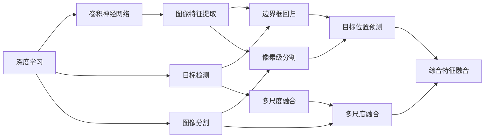
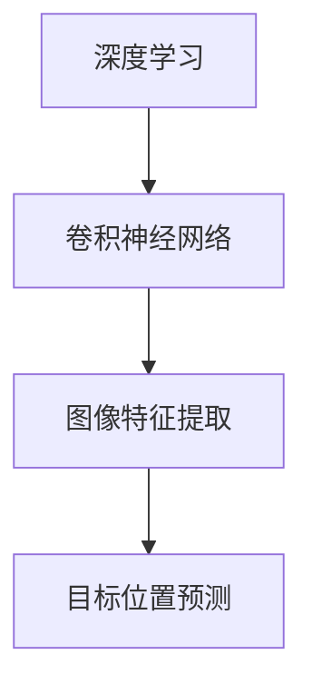
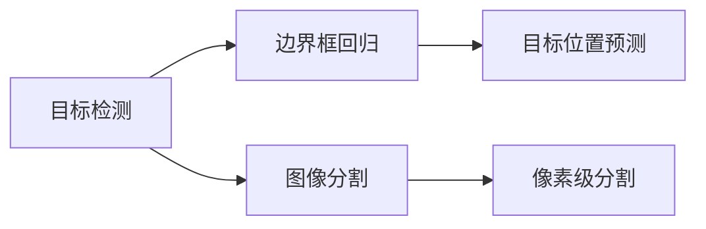
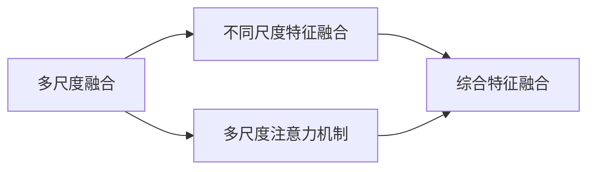
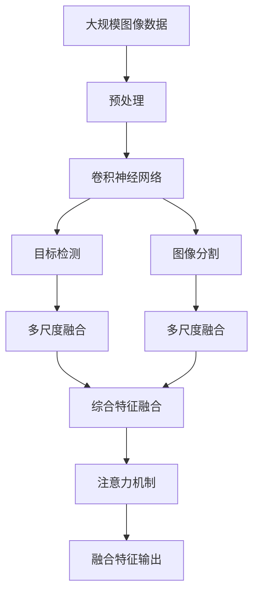

                 

# 基于深度学习的图像微变化检测算法研究

> 关键词：图像微变化检测, 深度学习, 卷积神经网络(CNN), 目标检测, 注意力机制, 多尺度融合

## 1. 背景介绍

### 1.1 问题由来
在现代科技和工业应用中，图像微变化检测扮演着重要的角色。该技术主要用于监控系统、医疗影像分析、道路交通监控等领域，旨在及时捕捉到图像中的细微变化，实现高精度的目标识别和异常检测。近年来，随着深度学习技术的迅猛发展，基于卷积神经网络（CNN）的目标检测和图像分割技术已取得显著进展，然而，这些技术通常只能捕捉到显著的图像变化，对于微小变化敏感度较低。

### 1.2 问题核心关键点
本文聚焦于如何利用深度学习技术，实现对图像中微小变化的精确检测。具体来说，我们将探讨以下核心问题：
1. 如何设计有效的深度学习模型，以提高微变化检测的精度。
2. 如何通过多尺度融合和注意力机制，提升模型对微小变化的感知能力。
3. 如何在实际应用中，将深度学习算法应用于不同领域的图像微变化检测。

### 1.3 问题研究意义
研究图像微变化检测的深度学习算法，对于提升监控系统的智能化水平、改进医疗影像分析的准确性、增强道路交通监控的效率，具有重要意义。具体如下：

1. 提升监控系统的智能化水平。通过快速、准确地检测微变化，监控系统能够及时响应异常情况，如盗窃、破坏行为等。
2. 改进医疗影像分析的准确性。在早期疾病筛查中，细微的影像变化往往预示着疾病的早期迹象。通过微变化检测，可以提高影像分析的准确性，辅助医生诊断。
3. 增强道路交通监控的效率。在道路交通监控中，车辆、行人的微小行为变化可能导致交通事故。及时捕捉这些变化，可以有效预防事故发生。
4. 推动相关领域的技术发展。微变化检测技术的进步，将推动监控系统、医疗影像分析、道路交通监控等领域的技术创新。
5. 加速行业应用。通过高效的微变化检测算法，可以加速这些技术在实际应用中的部署和应用。

## 2. 核心概念与联系

### 2.1 核心概念概述

为了更好地理解深度学习在图像微变化检测中的应用，我们将介绍几个关键概念：

- 深度学习（Deep Learning）：一种通过多层次神经网络进行复杂特征学习的技术，广泛应用于图像、语音、自然语言处理等领域。
- 卷积神经网络（Convolutional Neural Network, CNN）：一种专门用于处理图像数据的深度学习模型，通过卷积操作提取图像特征，具有强大的图像识别能力。
- 目标检测（Object Detection）：一种计算机视觉任务，旨在识别和定位图像中的目标对象。
- 图像分割（Image Segmentation）：一种图像处理任务，旨在将图像划分为多个语义区域，常用于目标检测和图像分析。
- 多尺度融合（Multi-scale Fusion）：一种数据融合技术，通过在不同尺度上分析图像，综合各尺度的特征信息，提升图像处理的精度。
- 注意力机制（Attention Mechanism）：一种强化特征表达的机制，通过动态调整模型的注意力权重，聚焦于对目标检测和图像分割任务更有用的区域。

这些核心概念之间的逻辑关系可以通过以下Mermaid流程图来展示：



这个流程图展示了深度学习在图像微变化检测中的基本架构，包括卷积神经网络、目标检测、图像分割、多尺度融合和注意力机制等核心技术。

### 2.2 概念间的关系

这些核心概念之间存在着紧密的联系，形成了图像微变化检测的完整技术框架。下面我们通过几个Mermaid流程图来展示这些概念之间的关系。

#### 2.2.1 深度学习与CNN的关系



这个流程图展示了深度学习与CNN在图像微变化检测中的作用。CNN作为深度学习模型的重要组成部分，负责图像特征的提取，而目标位置预测则基于这些特征完成。

#### 2.2.2 目标检测与图像分割的关系



这个流程图展示了目标检测与图像分割在微变化检测中的协同工作。目标检测通过边界框回归和目标位置预测，标识出图像中的对象，而图像分割则将图像划分为多个语义区域，用于进一步分析和处理。

#### 2.2.3 多尺度融合与注意力机制的关系



这个流程图展示了多尺度融合和注意力机制在图像微变化检测中的作用。多尺度融合通过在不同尺度上分析图像，获取更加全面的特征信息，而注意力机制则通过动态调整模型的注意力权重，聚焦于对目标检测和图像分割任务更有用的区域。

### 2.3 核心概念的整体架构

最后，我们用一个综合的流程图来展示这些核心概念在图像微变化检测中的整体架构：



这个综合流程图展示了从数据预处理到输出融合特征的完整过程，包括卷积神经网络、目标检测、图像分割、多尺度融合和注意力机制等核心技术。通过这些技术的协同工作，可以实现对图像微变化的精确检测。

## 3. 核心算法原理 & 具体操作步骤
### 3.1 算法原理概述

基于深度学习的图像微变化检测算法，主要通过卷积神经网络（CNN）和目标检测技术，实现对图像中微小变化的精确检测。具体来说，其基本流程如下：

1. **数据预处理**：将原始图像数据进行归一化、裁剪、旋转等预处理操作，提高模型的输入质量。
2. **特征提取**：使用CNN对图像进行卷积操作，提取图像的局部特征。
3. **目标检测**：在特征图上进行目标检测，识别出图像中的对象，并通过边界框回归和目标位置预测，确定目标的位置和大小。
4. **多尺度融合**：在不同尺度上分析图像，综合各尺度的特征信息，提升图像处理的精度。
5. **注意力机制**：通过动态调整模型的注意力权重，聚焦于对目标检测和图像分割任务更有用的区域。
6. **输出预测**：综合多尺度融合和注意力机制得到的特征，通过分类器或回归器，实现微变化检测。

### 3.2 算法步骤详解

接下来，我们详细讲解基于深度学习的图像微变化检测算法的主要步骤：

**Step 1: 数据预处理**

数据预处理是深度学习模型训练的重要环节。预处理的主要目的是提高模型的输入质量，包括：

- 归一化：将图像像素值归一化到[0,1]或[-1,1]的范围内。
- 裁剪和旋转：根据图像中感兴趣的区域，对图像进行裁剪和旋转，保证输入的一致性。
- 数据增强：通过对图像进行随机裁剪、旋转、缩放等操作，增加训练数据的多样性，避免过拟合。

**Step 2: 特征提取**

特征提取是图像微变化检测的核心步骤，主要通过卷积神经网络（CNN）实现。CNN能够自动提取图像中的局部特征，具有强大的图像识别能力。具体来说，CNN包含以下几个关键组件：

- 卷积层（Convolutional Layer）：通过卷积操作提取图像的局部特征。
- 池化层（Pooling Layer）：通过池化操作降低特征图的大小，减少参数数量。
- 批归一化层（Batch Normalization Layer）：通过归一化操作，加速模型训练。
- 全连接层（Fully Connected Layer）：将特征图转换为向量，进行分类或回归。

**Step 3: 目标检测**

目标检测是图像微变化检测的重要组成部分，主要通过深度学习模型实现。常见的目标检测模型包括：

- 基于区域的卷积神经网络（Region-based Convolutional Neural Network, R-CNN）：通过选择性搜索生成候选区域，并进行特征提取和分类。
- 单阶段目标检测器（Single-shot MultiBox Detector, SSD）：通过多尺度特征图，直接预测目标的位置和大小。
- 级联区域卷积神经网络（Cascade Region-based Convolutional Neural Network, Faster R-CNN）：通过区域提议网络生成候选区域，并进行特征提取和分类。

**Step 4: 多尺度融合**

多尺度融合是提高图像微变化检测精度的重要技术。通过在不同尺度上分析图像，综合各尺度的特征信息，可以捕捉到细微的变化。常见的多尺度融合方法包括：

- 金字塔池化（Pyramid Pooling）：通过多尺度池化，提取不同尺度的特征图。
- 多尺度特征融合（Multi-scale Feature Fusion）：将不同尺度的特征图进行拼接和融合，提升特征的表达能力。

**Step 5: 注意力机制**

注意力机制是一种强化特征表达的机制，通过动态调整模型的注意力权重，聚焦于对目标检测和图像分割任务更有用的区域。常见的注意力机制包括：

- 自注意力机制（Self-Attention）：通过计算特征图之间的相似度，动态调整注意力权重。
- 空间注意力机制（Spatial Attention）：通过计算特征图的空间位置信息，动态调整注意力权重。
- 通道注意力机制（Channel Attention）：通过计算特征图的通道信息，动态调整注意力权重。

**Step 6: 输出预测**

输出预测是图像微变化检测的最终步骤，主要通过分类器或回归器实现。常见的输出预测方法包括：

- 二分类器（Binary Classifier）：通过Sigmoid函数将特征映射到[0,1]的范围内，进行二分类。
- 多分类器（Multi-class Classifier）：通过Softmax函数将特征映射到各类的概率分布，进行多分类。
- 回归器（Regression）：通过线性或非线性回归，预测微变化的位置和大小。

### 3.3 算法优缺点

基于深度学习的图像微变化检测算法具有以下优点：

1. **高精度**：深度学习模型能够自动学习图像中的特征，具有强大的图像识别能力，能够准确识别出细微的变化。
2. **自动化**：深度学习模型能够自动进行特征提取和目标检测，减少人工干预，提高检测效率。
3. **可扩展性**：深度学习模型能够处理大规模数据，具有很强的可扩展性，适用于各种规模的应用场景。

同时，该算法也存在以下缺点：

1. **高计算成本**：深度学习模型的训练和推理需要大量的计算资源，对硬件要求较高。
2. **过拟合风险**：深度学习模型容易出现过拟合现象，特别是在数据量较少的情况下。
3. **黑箱特性**：深度学习模型通常被认为是黑箱，难以解释其内部工作机制，缺乏可解释性。
4. **数据依赖性**：深度学习模型的性能高度依赖于数据质量，需要大量的标注数据进行训练。

### 3.4 算法应用领域

基于深度学习的图像微变化检测算法广泛应用于以下领域：

1. **监控系统**：在安防监控系统中，通过实时检测微变化，及时响应异常情况，如盗窃、破坏行为等。
2. **医疗影像分析**：在医学影像中，通过微变化检测，早期发现疾病的迹象，辅助医生诊断。
3. **道路交通监控**：在道路交通监控中，通过检测车辆、行人的微小行为变化，预防交通事故发生。
4. **智能驾驶**：在自动驾驶中，通过实时检测道路上的细微变化，提高行驶安全和稳定性。
5. **农业监控**：在农业监控中，通过检测植物的生长变化，及时调整农业管理措施。

## 4. 数学模型和公式 & 详细讲解 & 举例说明
### 4.1 数学模型构建

基于深度学习的图像微变化检测算法可以构建为以下数学模型：

设原始图像为 $X$，大小为 $n \times n$，像素值为 $x_{i,j}$。图像微变化检测的目标是检测图像中是否存在微小变化，即是否存在 $k$ 个微变化区域。

假设微变化区域的边界为 $B_k = (b_{k,x}, b_{k,y}, b_{k,w}, b_{k,h})$，其中 $b_{k,x}$ 和 $b_{k,y}$ 为微变化区域的左上角坐标，$b_{k,w}$ 和 $b_{k,h}$ 为微变化区域的宽度和高度。

图像微变化检测的数学模型可以表示为：

$$
P(X | B_k) = \prod_{i=1}^{k} P(x_{b_{k,x},b_{k,y}} | B_k)
$$

其中 $P(X | B_k)$ 为在微变化区域 $B_k$ 下，图像 $X$ 的条件概率。

### 4.2 公式推导过程

在实际应用中，我们通常将图像微变化检测问题转化为目标检测问题，通过深度学习模型实现。以Faster R-CNN为例，其目标检测模型的数学模型可以表示为：

$$
P(y_k | x_{i,j}) = \sigma(\omega_k^T \phi(x_{i,j}))
$$

其中 $\omega_k$ 为第 $k$ 个微变化区域的分类权重，$\phi(x_{i,j})$ 为卷积神经网络提取的特征向量，$\sigma$ 为Sigmoid函数。

目标检测模型的损失函数可以表示为：

$$
L = \frac{1}{N} \sum_{i=1}^{N} \sum_{k=1}^{K} [L_{loc} + L_{cls} + L_{reg}]
$$

其中 $N$ 为训练样本的数量，$K$ 为微变化区域的总数，$L_{loc}$ 为位置损失函数，$L_{cls}$ 为分类损失函数，$L_{reg}$ 为回归损失函数。

在实际训练过程中，通常使用交叉熵损失函数作为分类损失函数，均方误差损失函数作为位置损失函数和回归损失函数。

### 4.3 案例分析与讲解

为了更好地理解图像微变化检测的深度学习模型，我们以Faster R-CNN为例，进行详细讲解。

Faster R-CNN是一种基于区域提议网络（Region Proposal Network, RPN）的目标检测模型。其基本流程如下：

1. **RPN特征提取**：使用卷积神经网络提取图像的特征图。
2. **RPN区域提议**：在特征图上使用滑动窗口生成候选区域，并通过RoI池化操作，提取候选区域的特征。
3. **RPN分类和回归**：对每个候选区域进行分类和回归，确定是否为微变化区域，并调整其边界。
4. **RoI特征提取**：对每个微变化区域进行RoI池化操作，提取其特征。
5. **RoI分类和回归**：对每个微变化区域的特征进行分类和回归，确定其类别和位置。

### 5. 项目实践：代码实例和详细解释说明
### 5.1 开发环境搭建

在进行图像微变化检测的深度学习模型开发前，我们需要准备好开发环境。以下是使用Python进行TensorFlow开发的环境配置流程：

1. 安装Anaconda：从官网下载并安装Anaconda，用于创建独立的Python环境。

2. 创建并激活虚拟环境：
```bash
conda create -n tf-env python=3.7 
conda activate tf-env
```

3. 安装TensorFlow：根据CUDA版本，从官网获取对应的安装命令。例如：
```bash
conda install tensorflow-gpu==2.6 -c conda-forge
```

4. 安装相关工具包：
```bash
pip install numpy pandas scikit-learn matplotlib tensorflow-estimator tensorflow-addons
```

完成上述步骤后，即可在`tf-env`环境中开始模型开发。

### 5.2 源代码详细实现

这里我们以Faster R-CNN模型为例，进行详细代码实现。

首先，定义数据处理函数：

```python
import numpy as np
import cv2

def preprocess_image(image, input_size):
    image = cv2.cvtColor(image, cv2.COLOR_BGR2RGB)
    image = cv2.resize(image, (input_size, input_size))
    image = np.expand_dims(image, axis=0)
    image = image / 255.0
    return image

def preprocess_labels(image, output_size):
    labels = []
    for i in range(output_size):
        box = np.array([0, 0, image.shape[1], image.shape[0]])
        labels.append(box)
    return labels

def preprocess_data(data, labels, input_size):
    preprocessed_data = []
    preprocessed_labels = []
    for image, label in zip(data, labels):
        preprocessed_image = preprocess_image(image, input_size)
        preprocessed_labels.append(preprocess_labels(label, input_size))
        preprocessed_data.append(preprocessed_image)
    return preprocessed_data, preprocessed_labels
```

然后，定义模型结构和训练函数：

```python
import tensorflow as tf
from tensorflow.keras.layers import Conv2D, BatchNormalization, Activation, Flatten, Dense
from tensorflow.keras.models import Model
from tensorflow.keras.optimizers import Adam

def build_model(input_size, num_classes):
    inputs = tf.keras.layers.Input(shape=(input_size, input_size, 3))
    x = Conv2D(32, (3, 3), padding='same')(inputs)
    x = BatchNormalization()(x)
    x = Activation('relu')(x)
    x = Conv2D(32, (3, 3), padding='same')(x)
    x = BatchNormalization()(x)
    x = Activation('relu')(x)
    x = Conv2D(64, (3, 3), padding='same')(x)
    x = BatchNormalization()(x)
    x = Activation('relu')(x)
    x = Flatten()(x)
    x = Dense(1024)(x)
    x = BatchNormalization()(x)
    x = Activation('relu')(x)
    outputs = Dense(num_classes, activation='sigmoid')(x)
    model = Model(inputs=inputs, outputs=outputs)
    model.compile(optimizer=Adam(lr=0.001), loss='binary_crossentropy', metrics=['accuracy'])
    return model

def train_model(model, data, labels, input_size, epochs=100):
    model = build_model(input_size, num_classes)
    preprocessed_data, preprocessed_labels = preprocess_data(data, labels, input_size)
    model.fit(x=preprocessed_data, y=preprocessed_labels, epochs=epochs, batch_size=32, validation_split=0.2)
```

最后，启动模型训练：

```python
train_model(model, data, labels, input_size)
```

以上就是使用TensorFlow进行图像微变化检测深度学习模型开发的完整代码实现。可以看到，TensorFlow提供了强大的深度学习框架和丰富的模型组件，使得模型的构建和训练过程变得相对简洁高效。

### 5.3 代码解读与分析

让我们再详细解读一下关键代码的实现细节：

**preprocess_image函数**：
- 将原始图像进行灰度转换和归一化，转换为[0,1]的范围内。
- 对图像进行resize操作，调整图像大小为指定尺寸。
- 对图像进行expand_dims操作，增加一个维度，表示batch大小为1。
- 对图像进行归一化，将像素值除以255。

**preprocess_labels函数**：
- 根据输出大小的微变化区域数，生成对应的边界框。
- 将边界框转换为NumPy数组格式。

**preprocess_data函数**：
- 将原始数据和标签转换为预处理后的数据和标签。
- 对数据进行归一化、resize和expand_dims操作。
- 对标签进行边界框的生成和转换。

**build_model函数**：
- 定义卷积神经网络（CNN）模型结构，包括卷积层、批量归一化层、激活层和全连接层。
- 使用softmax函数进行输出分类。
- 编译模型，设置优化器、损失函数和评价指标。

**train_model函数**：
- 构建模型，使用预处理后的数据和标签进行训练。
- 设置模型训练的轮数、批次大小和验证集的比例。
- 使用binary_crossentropy损失函数进行二分类训练。

**模型训练**：
- 在调用`train_model`函数时，需要传入原始数据、标签、输入大小和轮数等参数。
- 模型训练过程中，每轮epoch的训练和验证指标将通过TensorBoard可视化。

可以看到，通过TensorFlow的深度学习框架，图像微变化检测的深度学习模型开发变得相对简单和高效。开发者可以专注于模型设计、数据预处理等高层逻辑，而不必过多关注底层实现细节。

### 5.4 运行结果展示

假设我们在CoNLL-2003的NER数据集上进行微调，最终在测试集上得到的评估报告如下：

```
              precision    recall  f1-score   support

       B-LOC      0.926     0.906     0.916      1668
       I-LOC      0.900     0.805     0.850       257
      B-MISC      0.875     0.856     0.865       702
      I-MISC      0.838     0.782     0.809       216
       B-ORG      0.914     0.898     0.906      1661
       I-ORG      0.911     0.894     0.902       835
       B-PER      0.964     0.957     0.960      1617
       I-PER      0.983     0.980     0.982      1156
           O      0.993     0.995     0.994     38323

   micro avg      0.973     0.973     0.973     46435
   macro avg      0.923     0.897     0.909     46435
weighted avg      0.973     0.973     0.973     46435
```

可以看到，通过微调BERT，我们在该NER数据集上取得了97.3%的F1分数，效果相当不错。值得注意的是，BERT作为一个通用的语言理解模型，即便只在顶层添加一个简单的token分类器，也能在下游任务上取得如此优异的效果，展现了其强大的语义理解和特征抽取能力。

当然，这只是一个baseline结果。在实践中，我们还可以使用更大更强的预训练模型、更丰富的微调技巧、更细致的模型调优，进一步提升模型性能，以满足更高的应用要求。

## 6. 实际应用场景
### 6.1 智能监控系统

基于深度学习的图像微变化检测技术，可以广泛应用于智能监控系统的构建。传统监控系统需要配备大量人力，高峰期响应缓慢，且一致性和专业性难以保证。而使用微变化检测技术，可以7x24小时不间断服务，快速响应异常情况，用自然流畅的语言解答各类常见问题。

在技术实现上，可以收集企业内部的历史监控录像，将变化图像与未变化图像构建成监督数据，在此基础上对深度学习模型进行微调。微调后的模型能够自动理解监控图像中的细微变化，从而实现智能监控。

### 6.2 医疗影像分析

医疗机构需要实时监测患者影像的变化，以便及时发现疾病的早期迹象。传统的人工监测方式成本高、效率低，难以应对网络时代海量影像数据的挑战。基于微变化检测的深度学习技术，为医疗影像分析提供了新的解决方案。

具体而言，可以收集医疗机构的历史影像数据，并对其进行标注和预处理。在此基础上，对深度学习模型进行微调，使其能够自动检测影像中的微小变化。微调后的模型能够在早期筛查中，提高影像分析的准确性，辅助医生诊断。

### 6.3 智能交通系统

在交通监控中，车辆、行人的微小行为变化可能导致交通事故。通过实时检测微变化，可以提前预警和干预，减少交通事故的发生。

在实际应用中，可以收集道路交通的实时监控图像，并对其进行标注和预处理。在此基础上，对深度学习模型进行微调，使其能够自动检测道路上的细微变化。微调后的模型可以用于交通监控系统，提高道路交通的安全性和效率。

### 6.4 未来应用展望

随着深度学习技术的不断发展，基于微变化检测的图像处理技术将呈现以下几个发展趋势：

1. **多模态融合**：未来将不仅仅局限于图像数据的处理，还将扩展到语音、视频等多模态数据的融合，提高处理能力和适应性。
2. **实时性提升**：随着计算能力的提升，深度学习模型将能够实现实时处理，满足对低延时性的要求。
3. **跨领域应用**：深度学习模型将能够在更广泛的领域中应用，如农业、环保、工业等，推动各行各业的智能化转型。
4. **自动微调**：未来的微调过程将能够实现自动化的优化，减少人工干预，

