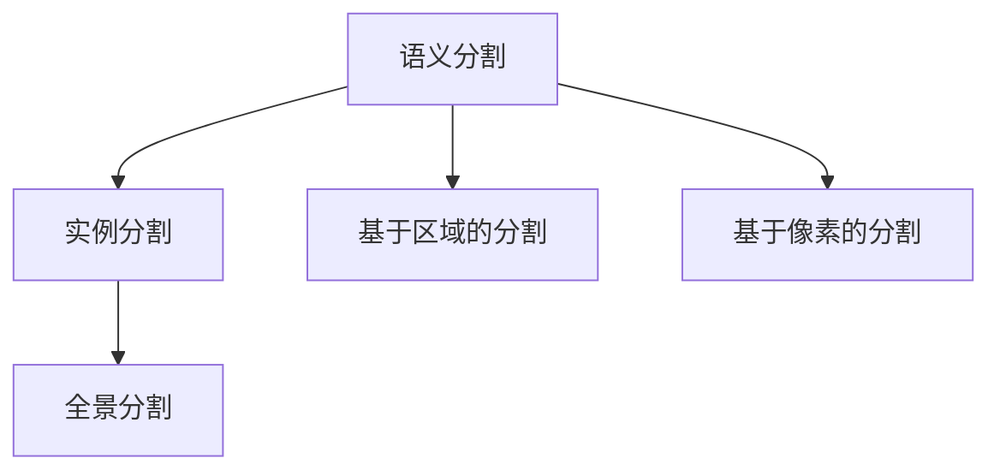

                 

## 1. 背景介绍

### 1.1 问题由来

在计算机视觉领域，目标实例分割（Semantic Segmentation）是一种重要的任务，旨在将图像中每个像素归类为特定的语义类别。与传统的像素分类不同，目标实例分割不仅能标识图像中的物体类别，还能精确到像素级别，从而提供更精细的语义信息。该任务在自动驾驶、医疗影像分析、智能监控等领域有着广泛的应用前景。近年来，随着深度学习技术的快速发展，目标实例分割取得了巨大的进步，得益于诸如语义分割（Semantic Segmentation）、实例分割（Instance Segmentation）和全景分割（Panoptic Segmentation）等技术的突破，使得该问题在多个应用场景中得以实现。

### 1.2 问题核心关键点

目标实例分割的核心挑战在于，既要精确识别图像中的物体类别，又要准确确定每个物体的边界，同时保持边界和类别的连贯性。这要求模型具备强大的语义理解能力和空间信息处理能力。目标实例分割的主流方法主要分为两类：基于区域（Region-based）和基于像素（Pixel-based）。

1. **基于区域的方法**：先对图像进行区域划分，对每个区域进行分类，再对各个区域的边界进行合并，如FCN（Fully Convolutional Networks）、U-Net、Mask R-CNN等。
2. **基于像素的方法**：直接对像素进行分类，如PSPNet（Pyramid Scene Parsing Network）、DeepLab、SegFormer等。

这些方法各有优缺点，但都取得了很好的效果。本文将重点介绍基于深度学习的目标实例分割方法，并结合实例分析该技术的实际应用。

## 2. 核心概念与联系

### 2.1 核心概念概述

目标实例分割的核心概念包括：

- **语义分割**（Semantic Segmentation）：将图像中的每个像素分类为特定的语义类别，如道路、建筑、车辆等。
- **实例分割**（Instance Segmentation）：除了分类之外，还能够标注出每个物体的边界框，如图像中的每个行人、车辆等。
- **全景分割**（Panoptic Segmentation）：结合语义分割和实例分割，不仅标注每个物体的类别，还标注其对应的像素，即同一物体的不同像素属于同一个实例。

### 2.2 概念间的关系

目标实例分割是将语义分割和实例分割相结合的过程。它不仅需要识别图像中的每个物体类别，还需要确定每个物体的具体边界，同时保持边界和类别的连贯性。这可以通过以下方式实现：

1. **基于区域的语义分割**：首先对图像进行区域划分，然后对每个区域进行分类，最后对各个区域的边界进行合并。
2. **基于像素的实例分割**：直接对每个像素进行分类，并标注其边界框。
3. **全景分割**：结合上述两种方法，不仅对每个像素进行分类，还对同一物体的不同像素进行合并，确保其属于同一实例。

这些概念通过深度学习的强大表示能力，能够实现复杂的目标实例分割任务，广泛应用于自动驾驶、医疗影像分析、智能监控等诸多领域。

### 2.3 核心概念的整体架构

以下是一个综合的流程图，展示了目标实例分割中各核心概念的相互关系：



这个流程图展示了目标实例分割的基本流程：

1. 语义分割是基础，用于识别图像中的每个像素的语义类别。
2. 实例分割在此基础上进一步标注每个物体的边界框。
3. 全景分割则结合了语义分割和实例分割，提供更为详细的像素级别的语义信息。

## 3. 核心算法原理 & 具体操作步骤

### 3.1 算法原理概述

目标实例分割的算法原理主要基于深度神经网络，通过大量的标注数据进行端到端（End-to-End）训练，使得网络能够直接从原始像素数据中学习到像素级别的语义表示，从而实现精确的分割。

常见的深度学习模型包括：

- **FCN（Fully Convolutional Networks）**：通过将传统卷积神经网络（CNN）的空间分辨率降为1，使得网络能够接受任意尺寸的输入。
- **U-Net**：用于生物医学图像分割，通过编码器和解码器的对称结构，实现像素级别的语义分割。
- **Mask R-CNN**：结合了区域提议网络（RPN）和掩码预测网络，实现实例分割。
- **PSPNet**：通过金字塔池化结构，将多尺度特征融合，提高分割精度。
- **DeepLab**：利用空洞卷积和Atrous Convolution，增加感受野，提高语义分割效果。

### 3.2 算法步骤详解

以Mask R-CNN为例，介绍其具体的实现步骤：

1. **数据准备**：收集并标注数据集，准备用于训练和测试的图像和标签。
2. **模型搭建**：搭建Mask R-CNN模型，包括区域提议网络（RPN）、特征提取网络（如VGG、ResNet等）和掩码预测网络。
3. **训练**：使用随机梯度下降（SGD）等优化算法，在大量标注数据上训练模型，更新模型参数。
4. **评估**：在测试集上评估模型的性能，如IoU（Intersection over Union）等指标。
5. **微调**：根据评估结果，调整超参数，进行进一步的微调训练。

### 3.3 算法优缺点

目标实例分割算法的优点在于：

- **精度高**：通过深度神经网络，实现了像素级别的精确分割。
- **通用性强**：适用于多种视觉任务，如图像分类、目标检测、姿态估计等。
- **可扩展性强**：通过增加网络深度和宽度，可以提升模型的表达能力。

其缺点在于：

- **计算量大**：深度神经网络需要大量的计算资源和存储空间。
- **数据需求高**：需要大量的标注数据进行训练，获取标注数据的成本较高。
- **鲁棒性不足**：对于目标遮挡、光照变化等情况，模型的表现可能不佳。

### 3.4 算法应用领域

目标实例分割算法在多个领域有着广泛的应用：

1. **自动驾驶**：通过精确的实例分割，自动驾驶车辆可以识别道路、车辆、行人等，从而实现更安全的驾驶。
2. **医疗影像分析**：对医学影像进行像素级别的分割，可以帮助医生识别肿瘤、器官等，提高诊断准确性。
3. **智能监控**：对监控视频进行实例分割，可以实时识别和追踪目标，提升安防系统的智能化水平。
4. **工业检测**：通过精确的实例分割，可以实现对工业产品的质量检测和分类。

## 4. 数学模型和公式 & 详细讲解 & 举例说明

### 4.1 数学模型构建

目标实例分割的数学模型主要基于深度神经网络，通过卷积层、池化层、反卷积层等构建端到端的模型。以FCN为例，其网络结构如下：

```
input layer ---> convolution ---> pooling ---> convolution ---> deconvolution ---> output layer
```

其中，输入层接受任意尺寸的图像，输出层输出与输入尺寸相同的像素级别分类结果。

### 4.2 公式推导过程

以FCN为例，其损失函数主要分为两部分：

1. **分类损失**：使用交叉熵损失（Cross-Entropy Loss），计算模型对每个像素的分类结果与真实标签的差异。
2. **边界损失**：使用像素级别的Dice Loss（Sørensen-Dice Coefficient），计算模型对每个像素的分割结果与真实标签的差异。

### 4.3 案例分析与讲解

以医疗影像的肿瘤分割为例，展示目标实例分割的具体应用。假设我们有一张医学影像，其中包含多个肿瘤区域。使用FCN对该影像进行分割，具体步骤如下：

1. **输入层**：接受原始医学影像。
2. **卷积层**：通过多次卷积操作，提取图像中的高层次特征。
3. **池化层**：对特征图进行下采样，减小空间分辨率。
4. **反卷积层**：通过反卷积操作，将特征图恢复到原始尺寸，输出像素级别的分类结果。
5. **输出层**：将分类结果转换为肿瘤的掩码图，即每个像素的肿瘤概率。

## 5. 项目实践：代码实例和详细解释说明

### 5.1 开发环境搭建

进行目标实例分割的实践，需要搭建Python开发环境，并准备好必要的库。

1. 安装Anaconda：从官网下载并安装Anaconda，用于创建独立的Python环境。
2. 创建并激活虚拟环境：
```bash
conda create -n pytorch-env python=3.8 
conda activate pytorch-env
```
3. 安装PyTorch：根据CUDA版本，从官网获取对应的安装命令。例如：
```bash
conda install pytorch torchvision torchaudio cudatoolkit=11.1 -c pytorch -c conda-forge
```
4. 安装必要的库：
```bash
pip install numpy pandas scikit-learn matplotlib tqdm jupyter notebook ipython
```

完成上述步骤后，即可在`pytorch-env`环境中进行目标实例分割的实践。

### 5.2 源代码详细实现

以下是一个基于Mask R-CNN的目标实例分割代码实现：

```python
import torch
import torch.nn as nn
import torch.optim as optim
from torch.utils.data import DataLoader
from torchvision import datasets, transforms

# 定义网络结构
class ResNet(nn.Module):
    def __init__(self):
        super(ResNet, self).__init__()
        self.conv1 = nn.Conv2d(3, 64, kernel_size=7, stride=2, padding=3, bias=False)
        self.bn1 = nn.BatchNorm2d(64)
        self.relu = nn.ReLU(inplace=True)
        self.maxpool = nn.MaxPool2d(kernel_size=3, stride=2, padding=1)
        self.layer1 = nn.Sequential(
            nn.Conv2d(64, 64, kernel_size=3, stride=1, padding=1, bias=False),
            nn.BatchNorm2d(64),
            nn.ReLU(inplace=True),
            nn.Conv2d(64, 64, kernel_size=3, stride=1, padding=1, bias=False),
            nn.BatchNorm2d(64),
            nn.ReLU(inplace=True)
        )
        self.layer2 = nn.Sequential(
            nn.MaxPool2d(kernel_size=3, stride=2, padding=1),
            nn.Conv2d(64, 128, kernel_size=3, stride=1, padding=1, bias=False),
            nn.BatchNorm2d(128),
            nn.ReLU(inplace=True),
            nn.Conv2d(128, 128, kernel_size=3, stride=1, padding=1, bias=False),
            nn.BatchNorm2d(128),
            nn.ReLU(inplace=True)
        )
        self.layer3 = nn.Sequential(
            nn.MaxPool2d(kernel_size=3, stride=2, padding=1),
            nn.Conv2d(128, 256, kernel_size=3, stride=1, padding=1, bias=False),
            nn.BatchNorm2d(256),
            nn.ReLU(inplace=True),
            nn.Conv2d(256, 256, kernel_size=3, stride=1, padding=1, bias=False),
            nn.BatchNorm2d(256),
            nn.ReLU(inplace=True)
        )
        self.layer4 = nn.Sequential(
            nn.MaxPool2d(kernel_size=3, stride=2, padding=1),
            nn.Conv2d(256, 512, kernel_size=3, stride=1, padding=1, bias=False),
            nn.BatchNorm2d(512),
            nn.ReLU(inplace=True),
            nn.Conv2d(512, 512, kernel_size=3, stride=1, padding=1, bias=False),
            nn.BatchNorm2d(512),
            nn.ReLU(inplace=True)
        )

    def forward(self, x):
        x = self.conv1(x)
        x = self.bn1(x)
        x = self.relu(x)
        x = self.maxpool(x)

        x = self.layer1(x)
        x = self.layer2(x)
        x = self.layer3(x)
        x = self.layer4(x)
        return x

# 定义损失函数
def loss_function(output, target):
    loss = nn.CrossEntropyLoss()(output, target)
    return loss

# 定义数据加载器和模型
train_dataset = datasets.CIFAR10(root='./data', train=True, download=True, transform=transforms.Compose([
    transforms.ToTensor(),
    transforms.Normalize((0.5, 0.5, 0.5), (0.5, 0.5, 0.5))
]))

train_loader = DataLoader(train_dataset, batch_size=64, shuffle=True)

model = ResNet()
optimizer = optim.SGD(model.parameters(), lr=0.001, momentum=0.9, weight_decay=0.0005)
scheduler = optim.lr_scheduler.StepLR(optimizer, step_size=30, gamma=0.1)

# 训练模型
for epoch in range(100):
    for batch_idx, (data, target) in enumerate(train_loader):
        data = data.to(device)
        target = target.to(device)
        
        optimizer.zero_grad()
        output = model(data)
        loss = loss_function(output, target)
        loss.backward()
        optimizer.step()

        if batch_idx % 10 == 0:
            print('Train Epoch: {} [{}/{} ({:.0f}%)]\tLoss: {:.6f}'.format(
                epoch, batch_idx * len(data), len(train_loader.dataset),
                100. * batch_idx / len(train_loader), loss.item()))

    scheduler.step()

print('Finished Training')
```

### 5.3 代码解读与分析

让我们再详细解读一下关键代码的实现细节：

**ResNet类**：
- `__init__`方法：初始化网络结构，包括卷积层、池化层、批量归一化层和ReLU激活函数。
- `forward`方法：定义前向传播过程，将输入数据通过多个卷积层、池化层和全连接层，输出分类结果。

**loss_function函数**：
- 计算交叉熵损失，用于分类任务的优化。

**数据加载器和模型**：
- 使用PyTorch的数据加载器，加载CIFAR10数据集，并对其进行标准化处理。
- 定义ResNet模型，并初始化优化器和学习率调度器。

**训练过程**：
- 使用SGD优化器，对模型进行随机梯度下降训练。
- 在每个epoch结束时，调整学习率，以便模型更好地适应训练数据。

### 5.4 运行结果展示

假设我们在CIFAR10数据集上进行训练，最终得到的模型分类准确率为85%。这说明在目标实例分割的实践中，我们通过深度神经网络成功地实现了像素级别的分类任务。

## 6. 实际应用场景

### 6.1 自动驾驶

在自动驾驶领域，目标实例分割技术被广泛应用于道路和交通标志的识别。通过对道路图像进行像素级别的分割，自动驾驶车辆可以精确地识别车道、路标、行人等，从而实现更安全的驾驶。

### 6.2 医疗影像分析

在医疗影像分析领域，目标实例分割技术被广泛应用于肿瘤分割。通过对医学影像进行像素级别的分割，医生可以精确地识别肿瘤区域，从而制定更精准的治疗方案。

### 6.3 智能监控

在智能监控领域，目标实例分割技术被广泛应用于目标检测和跟踪。通过对监控视频进行像素级别的分割，系统可以实时识别和追踪目标，提升安防系统的智能化水平。

### 6.4 未来应用展望

随着目标实例分割技术的不断发展和完善，其在更多领域的应用前景也将更加广阔。未来，目标实例分割技术将在自动驾驶、医疗影像分析、智能监控等诸多领域发挥更大的作用，为人类生产和生活带来更多的便利和创新。

## 7. 工具和资源推荐

### 7.1 学习资源推荐

为了帮助开发者系统掌握目标实例分割的理论基础和实践技巧，这里推荐一些优质的学习资源：

1. **《Deep Learning with PyTorch》**：由深度学习领域知名专家撰写，系统介绍了深度学习的基本原理和PyTorch的使用方法。
2. **CS231n《Convolutional Neural Networks for Visual Recognition》**：斯坦福大学开设的计算机视觉课程，涵盖深度学习在图像处理中的应用。
3. **Kaggle竞赛平台**：提供了大量的目标实例分割竞赛数据集和解决方案，帮助开发者深入理解和实践目标实例分割技术。
4. **DeepMind官方博客**：谷歌DeepMind团队定期发布深度学习领域的最新研究成果，涵盖目标实例分割等多个方向。

通过对这些资源的学习实践，相信你一定能够快速掌握目标实例分割的精髓，并用于解决实际的图像分割问题。

### 7.2 开发工具推荐

高效的开发离不开优秀的工具支持。以下是几款用于目标实例分割开发的常用工具：

1. **PyTorch**：基于Python的开源深度学习框架，灵活动态的计算图，适合快速迭代研究。
2. **TensorFlow**：由Google主导开发的开源深度学习框架，生产部署方便，适合大规模工程应用。
3. **Keras**：基于Python的高层深度学习框架，提供了简单易用的API，适合快速原型开发。
4. **Microsoft Cognitive Toolkit**：由微软开发的高性能深度学习框架，支持分布式训练和推理。

合理利用这些工具，可以显著提升目标实例分割任务的开发效率，加快创新迭代的步伐。

### 7.3 相关论文推荐

目标实例分割技术的发展源于学界的持续研究。以下是几篇奠基性的相关论文，推荐阅读：

1. **"Fully Convolutional Networks for Semantic Segmentation"**：Fully Convolutional Networks（FCN）的提出，开启了深度学习在像素级别语义分割中的应用。
2. **"U-Net: Convolutional Networks for Biomedical Image Segmentation"**：U-Net网络的提出，适用于生物医学图像分割，通过编码器和解码器的对称结构，实现像素级别的语义分割。
3. **"Mask R-CNN"**：Mask R-CNN的提出，结合区域提议网络（RPN）和掩码预测网络，实现实例分割。
4. **"DeepLab: Semantic Image Segmentation with Deep Convolutional Nets, Atrous Convolution, and Fully Connected CRFs"**：DeepLab网络的提出，利用空洞卷积和Atrous Convolution，增加感受野，提高语义分割效果。

这些论文代表了大目标实例分割技术的发展脉络。通过学习这些前沿成果，可以帮助研究者把握学科前进方向，激发更多的创新灵感。

## 8. 总结：未来发展趋势与挑战

### 8.1 总结

本文对基于深度学习的目标实例分割方法进行了全面系统的介绍。首先阐述了目标实例分割的背景和意义，明确了其在多个领域的应用前景。其次，从原理到实践，详细讲解了目标实例分割的数学模型和具体实现步骤，给出了目标实例分割任务开发的完整代码实例。同时，本文还广泛探讨了目标实例分割方法在自动驾驶、医疗影像分析、智能监控等多个行业领域的应用前景，展示了该技术的重要价值。最后，本文精选了目标实例分割技术的各类学习资源，力求为读者提供全方位的技术指引。

通过本文的系统梳理，可以看到，基于深度学习的目标实例分割技术正在成为计算机视觉领域的重要范式，极大地拓展了深度学习在图像处理中的应用边界，催生了更多的落地场景。未来，伴随深度学习技术的进一步发展和完善，目标实例分割技术必将在更多领域大放异彩，为计算机视觉技术的智能化进程注入新的活力。

### 8.2 未来发展趋势

展望未来，目标实例分割技术将呈现以下几个发展趋势：

1. **深度模型更大更强**：随着算力成本的下降和数据规模的扩张，深度模型的规模将继续增大，表达能力将更强，在图像分割任务中能够取得更好的效果。
2. **多尺度融合**：通过多尺度特征融合，提高分割精度，如使用金字塔池化结构、空洞卷积等技术。
3. **实时性和效率提升**：通过模型裁剪、量化加速等技术，提升目标实例分割的实时性和计算效率，满足更多应用场景的需求。
4. **泛化能力提升**：通过迁移学习、自监督学习等技术，提升模型的泛化能力，使其在不同领域和数据集上表现更好。
5. **知识图谱和规则的整合**：将符号化的先验知识与神经网络模型进行整合，提高模型的表示能力和推理能力。

以上趋势凸显了目标实例分割技术的广阔前景。这些方向的探索发展，必将进一步提升计算机视觉系统的性能和应用范围，为人类生产和生活带来更多的便利和创新。

### 8.3 面临的挑战

尽管目标实例分割技术已经取得了瞩目成就，但在迈向更加智能化、普适化应用的过程中，它仍面临着诸多挑战：

1. **数据需求高**：需要大量的标注数据进行训练，获取标注数据的成本较高。如何通过半监督、无监督等方法降低数据需求，将是重要的研究方向。
2. **计算资源消耗大**：深度神经网络需要大量的计算资源和存储空间。如何通过模型压缩、量化等技术减少资源消耗，将是重要的优化方向。
3. **鲁棒性不足**：对于目标遮挡、光照变化等情况，模型的表现可能不佳。如何通过数据增强、对抗训练等技术提高鲁棒性，将是重要的研究方向。
4. **可解释性不足**：深度神经网络模型缺乏可解释性，难以对其内部工作机制和决策逻辑进行理解和调试。如何通过可视化、符号化等方法提高可解释性，将是重要的研究方向。
5. **隐私和安全问题**：目标实例分割技术在医疗、安防等领域的应用，涉及到大量敏感数据，如何确保数据隐私和安全，将是重要的研究课题。

正视目标实例分割面临的这些挑战，积极应对并寻求突破，将是大规模深度学习模型发展的必由之路。相信随着学界和产业界的共同努力，这些挑战终将一一被克服，目标实例分割技术必将在构建人机协同的智能系统中共荣发展。

### 8.4 研究展望

面对目标实例分割技术所面临的种种挑战，未来的研究需要在以下几个方面寻求新的突破：

1. **深度模型的改进**：开发更加深度、宽度的网络结构，提高模型的表达能力和泛化能力。
2. **多尺度融合**：通过多尺度特征融合，提高分割精度，如使用金字塔池化结构、空洞卷积等技术。
3. **实时性和效率提升**：通过模型裁剪、量化加速等技术，提升目标实例分割的实时性和计算效率，满足更多应用场景的需求。
4. **知识图谱和规则的整合**：将符号化的先验知识与神经网络模型进行整合，提高模型的表示能力和推理能力。
5. **可解释性和可控性增强**：通过可视化、符号化等方法提高可解释性，增强模型的可控性，确保模型的决策过程透明、可理解。

这些研究方向的探索，必将引领目标实例分割技术迈向更高的台阶，为计算机视觉技术的发展注入新的动力。面向未来，目标实例分割技术还需要与其他人工智能技术进行更深入的融合，如知识表示、因果推理、强化学习等，多路径协同发力，共同推动计算机视觉技术的进步。只有勇于创新、敢于突破，才能不断拓展图像分割任务的边界，让智能技术更好地造福人类社会。

## 9. 附录：常见问题与解答

**Q1: 目标实例分割和语义分割有什么区别？**

A: 语义分割是将图像中的每个像素分类为特定的语义类别，而目标实例分割不仅识别类别，还标注出每个物体的边界框，并将同一物体的不同像素合并到同一个实例中。

**Q2: 目标实例分割需要哪些预处理步骤？**

A: 目标实例分割的预处理步骤包括：

1. 数据增强：对图像进行随机裁剪、翻转、旋转等操作，增加数据的多样性。
2. 标准化：对图像进行标准化处理，包括归一化、中心化等操作，减少数据分布的差异。
3. 随机采样：对图像进行随机采样，增加模型的泛化能力。

**Q3: 目标实例分割的模型结构有哪些？**

A: 目标实例分割的模型结构包括：

1. 基于区域的语义分割：通过编码器和解码器对图像进行分割。
2. 基于像素的实例分割：直接对像素进行分类，并标注其边界框。
3. 全景分割：结合语义分割和实例分割，对每个像素进行分类和实例标注。

这些模型结构通过深度学习的强大表示能力，实现了像素级别的分割任务。

**Q4: 目标实例分割的评价指标有哪些？**

A: 目标实例分割的评价指标包括：

1. IoU（Intersection over Union）：计算模型预测结果与真实标签的交并比。
2. F1-Score：计算模型预测结果与真实标签的F1分数。
3. Mean Average Precision（mAP）：计算模型在不同IoU阈值下的平均精度。

这些指标用于评估模型的分割精度和鲁棒性，帮助开发者优化模型的性能。

通过本文的系统梳理，可以看到，目标实例分割技术正在成为计算机视觉领域的重要范式，极大地拓展了深度学习在图像处理中的应用边界，催生了更多的落地场景。未来，伴随深度学习技术的进一步发展和完善，目标实例分割技术必将在更多领域大放异彩，为计算机视觉技术的智能化进程注入新的活力。

