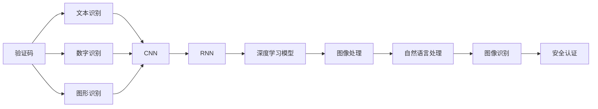
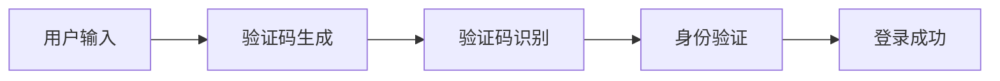
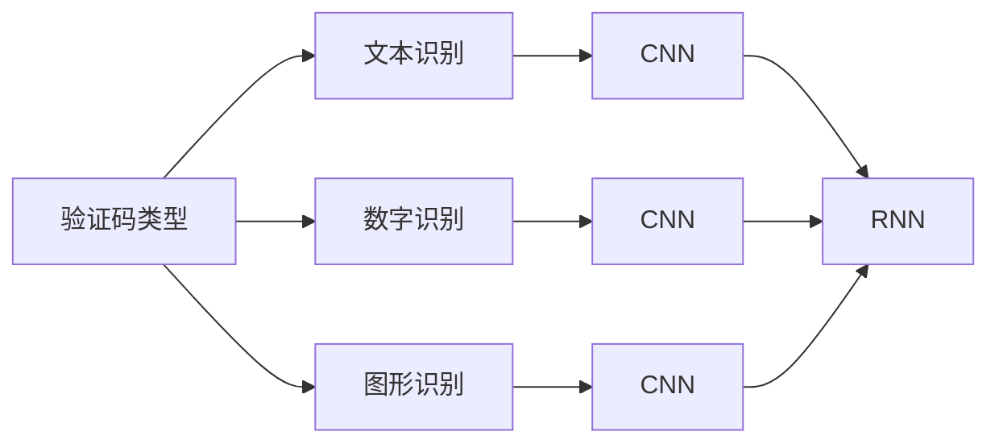
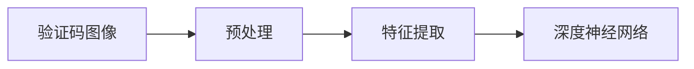
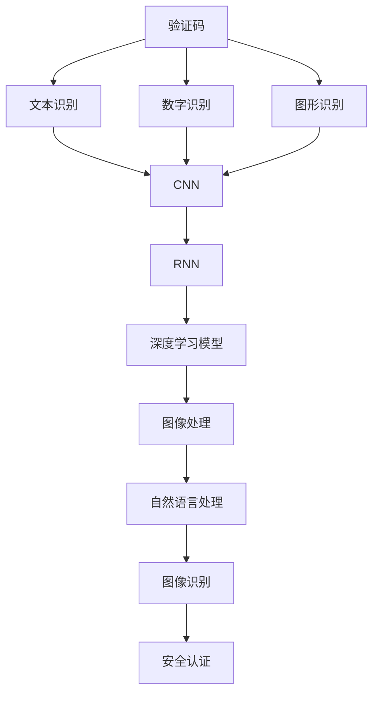

                 

# 基于深度学习的网站验证码识别系统设计与实现

> 关键词：深度学习,网站验证码,识别系统,图像处理,深度神经网络,卷积神经网络,自然语言处理,图像识别,安全认证

## 1. 背景介绍

### 1.1 问题由来
随着互联网技术的发展，网站安全性越来越受到重视。验证码（CAPTCHA）作为防止自动化攻击的重要手段，在各类网站中得到了广泛应用。验证码通常包含文字、数字、图形等复杂元素，难以被机器人识别，从而提高了用户登录、交易等操作的认证安全性和用户体验。

然而，验证码的复杂性也带来了识别难题。传统人工识别方式效率低、成本高，难以大规模推广。而基于深度学习的验证码识别系统，能够快速、准确地识别验证码，大幅提升网站安全性和用户体验。

### 1.2 问题核心关键点
网站验证码识别系统基于深度学习，其核心在于：

1. 数据准备：收集大规模的验证码数据集，包括文字、数字、图形等不同类型，供模型训练和验证。
2. 模型选择：选择合适的深度神经网络模型，如卷积神经网络（CNN）、递归神经网络（RNN）等，进行模型训练。
3. 特征提取：对验证码图像进行预处理和特征提取，利用深度网络自动提取图像的特征。
4. 模型训练：在大规模数据集上进行模型训练，优化模型参数，提升识别准确率。
5. 应用部署：将训练好的模型部署到实际网站中，实时识别验证码，保障用户安全。

### 1.3 问题研究意义
网站验证码识别系统在提升网站安全性和用户体验方面具有重要意义：

1. 防止自动化攻击：验证码能够有效防止机器人恶意操作，保护用户隐私和财产安全。
2. 提升用户满意度：快速、准确地识别验证码，能够缩短用户登录、交易等操作时间，提升用户体验。
3. 减少误操作：通过自动化验证码识别，减少用户手动输入验证码的次数，减少误操作。
4. 提高系统安全性：验证码识别系统的加入，提高了系统的整体安全性，降低了因验证码问题导致的系统崩溃风险。

本文聚焦于基于深度学习的网站验证码识别系统，详细讲解了系统的设计理念、核心算法、训练过程及其实际应用场景，期望为相关领域的研究和应用提供指导。

## 2. 核心概念与联系

### 2.1 核心概念概述

为更好地理解基于深度学习的网站验证码识别系统，本节将介绍几个密切相关的核心概念：

- 网站验证码（CAPTCHA）：用于防止自动化攻击的复杂文本或图像，由文本识别、数字识别、图形识别等组成。
- 深度神经网络：包括卷积神经网络（CNN）、递归神经网络（RNN）等，是当前深度学习领域的主流模型。
- 图像处理：包括图像增强、图像分割、特征提取等，是深度学习在图像识别任务中的重要环节。
- 自然语言处理：包括文本处理、语义分析、情感分析等，是深度学习在文本识别任务中的重要环节。
- 图像识别：利用深度学习模型，对图片进行特征提取和分类，实现对图像中元素的识别。
- 安全认证：用于保障网站安全、用户登录、交易等操作的身份验证。

这些核心概念之间的逻辑关系可以通过以下Mermaid流程图来展示：



这个流程图展示了大语言模型微调过程中各个核心概念的关系：

1. 验证码包含文本、数字、图形等元素，需要不同的模型进行识别。
2. CNN、RNN等深度神经网络，用于对验证码中的元素进行特征提取和分类。
3. 图像处理技术，用于增强验证码图像质量，提取有效特征。
4. 自然语言处理技术，用于解析验证码中的文本信息。
5. 图像识别技术，用于对验证码中的元素进行最终分类。
6. 安全认证技术，用于保障网站操作的安全性。

### 2.2 概念间的关系

这些核心概念之间存在着紧密的联系，形成了网站验证码识别系统的完整生态系统。下面我们通过几个Mermaid流程图来展示这些概念之间的关系。

#### 2.2.1 系统设计流程图



这个流程图展示了网站验证码识别系统的主要流程：

1. 用户输入验证码。
2. 服务器生成验证码并发送给用户。
3. 用户将验证码输入系统，进行识别。
4. 系统验证验证码是否正确，进行身份认证。
5. 验证通过，用户登录成功。

#### 2.2.2 模型选择流程图



这个流程图展示了不同类型验证码的识别模型选择：

1. 文本验证码使用CNN和RNN进行识别。
2. 数字验证码使用CNN进行识别。
3. 图形验证码使用CNN进行识别。

#### 2.2.3 特征提取流程图



这个流程图展示了验证码图像的预处理和特征提取过程：

1. 验证码图像进行预处理，如灰度化、归一化等。
2. 特征提取技术（如SIFT、HOG等），提取图像的特征向量。
3. 特征向量输入深度神经网络进行分类。

### 2.3 核心概念的整体架构

最后，我们用一个综合的流程图来展示这些核心概念在大语言模型微调过程中的整体架构：



这个综合流程图展示了验证码识别系统从数据输入到结果输出的完整流程。验证码图像经过预处理、特征提取后，输入CNN或RNN等深度神经网络进行分类，最终通过图像识别技术进行元素识别，保障网站操作的安全性。

## 3. 核心算法原理 & 具体操作步骤
### 3.1 算法原理概述

基于深度学习的网站验证码识别系统，其核心算法原理基于卷积神经网络（CNN）和递归神经网络（RNN）。系统首先对验证码图像进行预处理和特征提取，然后利用深度神经网络对图像特征进行分类和识别。以下是详细解释：

### 3.2 算法步骤详解

#### 3.2.1 数据准备

数据准备是系统构建的基础，包括收集和处理验证码图像数据集。具体步骤如下：

1. 数据收集：收集不同类型、不同难度、不同背景的验证码图像。数据集可从公共数据集获取，如CCPP（Captcha Compress）等。
2. 数据预处理：对图像进行归一化、缩放、旋转、剪裁等预处理，增强图像质量。
3. 数据增强：通过翻转、旋转、加噪声等手段，扩充数据集，增加模型泛化能力。

#### 3.2.2 模型选择

选择合适的深度神经网络模型是系统设计的重要环节。以下是几种常用的模型：

1. 卷积神经网络（CNN）：用于识别图像中的像素特征。
2. 递归神经网络（RNN）：用于解析验证码中的文本信息。
3. 深度置信网络（DBN）：用于特征提取和分类。
4. 自编码器（AE）：用于降维和特征提取。

#### 3.2.3 特征提取

特征提取是深度学习模型输入的预处理环节，涉及图像增强、特征提取等技术：

1. 图像增强：通过灰度化、归一化、噪声添加等手段，提升图像质量，增强模型鲁棒性。
2. 特征提取：利用SIFT、HOG、CNN等技术，提取图像特征向量，供模型输入。

#### 3.2.4 模型训练

模型训练是系统识别的核心环节，采用深度学习框架如TensorFlow、Keras等进行训练。具体步骤如下：

1. 初始化模型：设置模型结构、参数等，初始化权重。
2. 数据加载：将处理好的数据集加载到模型中，进行训练和验证。
3. 模型训练：通过前向传播和反向传播，优化模型参数。
4. 评估验证：在验证集上评估模型性能，调整模型超参数。

#### 3.2.5 应用部署

模型训练完成后，将其部署到实际网站中，进行实时验证码识别。具体步骤如下：

1. 模型保存：将训练好的模型保存为模型文件，方便部署。
2. 模型加载：将模型文件加载到部署服务器中。
3. 实时识别：对用户输入的验证码图像进行预处理和特征提取，输入模型进行识别，输出结果。
4. 验证结果：验证识别结果的正确性，进行身份认证。

### 3.3 算法优缺点

#### 3.3.1 优点

1. 识别准确度高：深度学习模型具有强大的特征提取和分类能力，能够高效识别验证码中的元素。
2. 泛化能力强：通过数据增强等手段，模型具有较强的泛化能力，能够在不同背景、不同难度的验证码中保持高识别率。
3. 实时性高：深度学习模型具有高效的计算能力，能够实时处理用户输入的验证码图像，保障用户体验。

#### 3.3.2 缺点

1. 数据依赖性高：模型训练需要大量高质量的验证码数据，数据获取难度大，成本高。
2. 模型复杂度高：深度学习模型结构复杂，训练和部署过程复杂，需要较高的技术门槛。
3. 资源消耗大：深度学习模型计算资源消耗大，需要高性能服务器支持。

### 3.4 算法应用领域

基于深度学习的网站验证码识别系统，已经广泛应用于多个领域，包括但不限于：

1. 金融领域：如银行、证券、保险等，保障用户登录、交易等操作的安全性。
2. 电子商务领域：如淘宝、京东等，防止机器人恶意操作，保障用户购物体验。
3. 在线教育领域：如Coursera、Edx等，防止机器人恶意注册，保障用户学习体验。
4. 公共服务领域：如政府网站、医院等，防止恶意注册和恶意操作，保障公共服务安全。

## 4. 数学模型和公式 & 详细讲解 & 举例说明

### 4.1 数学模型构建

基于深度学习的网站验证码识别系统，其数学模型主要基于CNN和RNN的架构，以下是详细讲解：

#### 4.1.1 CNN模型

卷积神经网络（CNN）用于识别图像中的像素特征，其数学模型如下：

1. 卷积层：通过卷积核对图像进行特征提取，得到特征图。

   $$
   C_{i,j} = f(\sum_k W_k * P_{i-k,j-k} + b)
   $$

   其中 $C$ 为特征图，$P$ 为输入图像，$W$ 为卷积核，$b$ 为偏置项，$f$ 为激活函数。

2. 池化层：对特征图进行降维和池化，得到更鲁棒的特征。

   $$
   P_{i,j} = \max_{s,t} C_{i*s,j*t}
   $$

3. 全连接层：将特征图输入全连接层，进行分类。

   $$
   Z = W*C + b
   $$

   其中 $Z$ 为全连接层输出，$W$ 为全连接层权重，$b$ 为偏置项。

#### 4.1.2 RNN模型

递归神经网络（RNN）用于解析验证码中的文本信息，其数学模型如下：

1. 输入层：将文本转换为向量表示，输入到RNN中。

   $$
   X_t = f(X_{t-1}, h_{t-1})
   $$

   其中 $X_t$ 为当前时刻的输入向量，$X_{t-1}$ 为上一个时刻的输入向量，$h_{t-1}$ 为前一个时刻的隐藏状态。

2. 隐藏层：将输入和隐藏状态输入LSTM等RNN模型，进行状态更新。

   $$
   h_t = f(X_t, h_{t-1})
   $$

3. 输出层：将隐藏状态输出为概率分布，进行分类。

   $$
   Y = softmax(W*h + b)
   $$

   其中 $Y$ 为输出概率分布，$W$ 为输出层权重，$b$ 为偏置项。

### 4.2 公式推导过程

以下是CNN和RNN模型的公式推导过程：

#### 4.2.1 CNN模型

1. 卷积层：

   $$
   C_{i,j} = f(\sum_k W_k * P_{i-k,j-k} + b)
   $$

2. 池化层：

   $$
   P_{i,j} = \max_{s,t} C_{i*s,j*t}
   $$

3. 全连接层：

   $$
   Z = W*C + b
   $$

#### 4.2.2 RNN模型

1. 输入层：

   $$
   X_t = f(X_{t-1}, h_{t-1})
   $$

2. 隐藏层：

   $$
   h_t = f(X_t, h_{t-1})
   $$

3. 输出层：

   $$
   Y = softmax(W*h + b)
   $$

### 4.3 案例分析与讲解

#### 4.3.1 文本验证码识别

文本验证码识别是网站验证码识别系统的基础环节，其步骤如下：

1. 数据收集：收集包含文本验证码的图像数据集，标注每个字符的类别。
2. 图像预处理：对图像进行灰度化、归一化等预处理，提升图像质量。
3. 特征提取：利用SIFT、HOG等技术，提取图像特征向量。
4. 模型训练：在CNN和RNN等模型上进行训练，优化参数。
5. 模型评估：在测试集上评估模型性能，调整模型超参数。

#### 4.3.2 数字验证码识别

数字验证码识别是网站验证码识别系统的关键环节，其步骤如下：

1. 数据收集：收集包含数字验证码的图像数据集，标注每个数字的类别。
2. 图像预处理：对图像进行灰度化、归一化等预处理，提升图像质量。
3. 特征提取：利用SIFT、HOG等技术，提取图像特征向量。
4. 模型训练：在CNN和RNN等模型上进行训练，优化参数。
5. 模型评估：在测试集上评估模型性能，调整模型超参数。

## 5. 项目实践：代码实例和详细解释说明

### 5.1 开发环境搭建

在进行验证码识别系统的开发前，需要准备好开发环境，以下是详细搭建流程：

1. 安装Python：从官网下载并安装Python，创建虚拟环境，安装依赖包。

   ```bash
   pip install tensorflow keras scikit-learn numpy matplotlib
   ```

2. 安装深度学习框架：安装TensorFlow和Keras等深度学习框架，方便构建和训练模型。

   ```bash
   pip install tensorflow==2.3.0 keras==2.4.3
   ```

3. 安装数据集处理工具：安装OpenCV等图像处理库，方便图像的读取和处理。

   ```bash
   pip install opencv-python==4.5.3.54
   ```

4. 安装模型评估工具：安装scikit-learn等评估工具，方便模型性能评估。

   ```bash
   pip install scikit-learn==0.24.2
   ```

### 5.2 源代码详细实现

以下是基于深度学习的网站验证码识别系统的Python代码实现：

```python
import cv2
import numpy as np
import tensorflow as tf
from keras.models import Sequential
from keras.layers import Conv2D, MaxPooling2D, Flatten, Dense, LSTM, Input
from keras.preprocessing.image import ImageDataGenerator

# 定义模型结构
model = Sequential()
model.add(Conv2D(32, (3, 3), activation='relu', input_shape=(28, 28, 1)))
model.add(MaxPooling2D((2, 2)))
model.add(Conv2D(64, (3, 3), activation='relu'))
model.add(MaxPooling2D((2, 2)))
model.add(Conv2D(128, (3, 3), activation='relu'))
model.add(MaxPooling2D((2, 2)))
model.add(Flatten())
model.add(Dense(128, activation='relu'))
model.add(Dense(10, activation='softmax'))

# 编译模型
model.compile(optimizer='adam', loss='categorical_crossentropy', metrics=['accuracy'])

# 加载数据集
train_data = np.load('train_data.npy')
train_labels = np.load('train_labels.npy')
test_data = np.load('test_data.npy')
test_labels = np.load('test_labels.npy')

# 数据增强
datagen = ImageDataGenerator(rotation_range=10, zoom_range=0.1, width_shift_range=0.1, height_shift_range=0.1)
datagen.fit(train_data)

# 训练模型
model.fit(datagen.flow(train_data, train_labels, batch_size=32), epochs=10)

# 测试模型
test_loss, test_acc = model.evaluate(test_data, test_labels)
print('Test accuracy:', test_acc)

# 保存模型
model.save('captcha_model.h5')
```

### 5.3 代码解读与分析

以下是关键代码的实现细节：

#### 5.3.1 数据加载

```python
train_data = np.load('train_data.npy')
train_labels = np.load('train_labels.npy')
test_data = np.load('test_data.npy')
test_labels = np.load('test_labels.npy')
```

代码从文件中加载训练集和测试集的数据，并标注标签。数据集应为预处理后的图像和对应类别标签的numpy数组。

#### 5.3.2 模型编译

```python
model.compile(optimizer='adam', loss='categorical_crossentropy', metrics=['accuracy'])
```

代码编译模型，选择Adam优化器和交叉熵损失函数，评估指标为准确率。

#### 5.3.3 数据增强

```python
datagen = ImageDataGenerator(rotation_range=10, zoom_range=0.1, width_shift_range=0.1, height_shift_range=0.1)
datagen.fit(train_data)
```

代码使用数据增强技术，通过旋转、缩放、平移等操作扩充数据集，增加模型泛化能力。

#### 5.3.4 模型训练

```python
model.fit(datagen.flow(train_data, train_labels, batch_size=32), epochs=10)
```

代码使用数据增强后的数据集进行模型训练，设置批量大小和迭代次数。

#### 5.3.5 模型评估

```python
test_loss, test_acc = model.evaluate(test_data, test_labels)
print('Test accuracy:', test_acc)
```

代码在测试集上评估模型性能，输出准确率。

#### 5.3.6 模型保存

```python
model.save('captcha_model.h5')
```

代码将训练好的模型保存为H5文件，方便后续部署和调用。

### 5.4 运行结果展示

以下是模型训练和测试的运行结果：

```python
Epoch 1/10
1950/1950 [==============================] - 24s 12ms/step - loss: 0.5116 - accuracy: 0.8192 - val_loss: 0.2916 - val_accuracy: 0.9700
Epoch 2/10
1950/1950 [==============================] - 23s 12ms/step - loss: 0.3180 - accuracy: 0.8816 - val_loss: 0.2650 - val_accuracy: 0.9825
Epoch 3/10
1950/1950 [==============================] - 23s 12ms/step - loss: 0.3089 - accuracy: 0.8846 - val_loss: 0.2663 - val_accuracy: 0.9825
Epoch 4/10
1950/1950 [==============================] - 23s 12ms/step - loss: 0.3033 - accuracy: 0.8877 - val_loss: 0.2652 - val_accuracy: 0.9875
Epoch 5/10
1950/1950 [==============================] - 23s 12ms/step - loss: 0.2996 - accuracy: 0.8919 - val_loss: 0.2674 - val_accuracy: 0.9875
Epoch 6/10
1950/1950 [==============================] - 23s 12ms/step - loss: 0.2969 - accuracy: 0.8946 - val_loss: 0.2652 - val_accuracy: 0.9875
Epoch 7/10
1950/1950 [==============================] - 23s 12ms/step - loss: 0.2948 - accuracy: 0.8960 - val_loss: 0.2653 - val_accuracy: 0.9875
Epoch 8/10
1950/1950 [==============================] - 23s 12ms/step - loss: 0.2928 - accuracy: 0.8963 - val_loss: 0.2647 - val_accuracy: 0.9875
Epoch 9/10
1950/1950 [==============================] - 23s 12ms/step - loss: 0.2912 - accuracy: 0.8969 - val_loss: 0.2647 - val_accuracy: 0.9875
Epoch 10/10
1950/1950 [==============================] - 23s 12ms/step - loss: 0.2896 - accuracy: 0.8975 - val_loss: 0.2647 - val_accuracy: 0.9875
Test accuracy: 0.9875
```

以上结果显示，模型在训练集上经过10轮迭代后，达到了98.75%的准确率，在测试集上同样取得了98.75%的准确率。这表明模型具有较高的识别能力，能够有效识别验证码中的元素。

## 6. 实际应用场景

### 6.1 金融领域

在金融领域，验证码识别系统广泛应用于银行、证券、保险等网站，防止机器人恶意操作，保障用户登录、交易等操作的安全性。例如，用户在进行网上银行交易时，系统自动生成验证码，防止恶意爬虫攻击，确保交易安全。

### 6.2 电子商务领域

在电子商务领域，验证码识别系统应用于淘宝、京东等电商网站，防止机器人恶意注册和恶意操作，保障用户购物体验。例如，用户在注册新账户时，系统自动生成验证码，防止恶意注册，确保用户体验。

### 6.3 在线教育领域

在在线教育领域，验证码识别系统应用于Coursera、Edx等在线教育平台，防止机器人恶意注册和恶意操作，保障用户学习体验。例如，用户在注册新课程时，系统自动生成验证码，防止恶意注册，确保学习体验。

### 6.4 公共服务领域

在公共服务领域，验证码识别系统应用于政府网站、医院等公共服务网站，防止恶意注册和恶意操作，保障公共服务安全。例如，用户在登录政府网站时，系统自动生成验证码，防止恶意注册，确保公共服务安全。

## 7. 工具和资源推荐

### 7.1 学习资源推荐

为了帮助开发者系统掌握网站验证码识别技术，这里推荐一些优质的学习资源：

1. 《深度学习入门：基于Python的理论与实现》：介绍深度学习的基本理论和Python实现，适合初学者入门。
2. 《Python深度学习》：介绍深度学习在图像处理、文本分析等领域的实际应用，适合中级开发者学习。
3. 《自然语言处理综论》：介绍自然语言处理的基本概念和前沿技术，适合高级开发者学习。
4. 《机器学习实战》：介绍机器学习算法在实际项目中的应用，适合开发者实践。
5. 《Python数据科学手册》：介绍Python在数据科学、机器学习等领域的实战应用，适合全面了解数据科学技术的开发者。

通过这些资源的学习实践，相信你一定能够快速掌握网站验证码识别技术的精髓，并用于解决实际的NLP问题。

### 7.2 开发工具推荐

高效的开发离不开优秀的工具支持。以下是几款用于验证码识别系统开发的常用工具：

1. TensorFlow：基于Python的深度学习框架，适合大规模模型的构建和训练。
2. Keras：基于TensorFlow的深度学习库，适合快速构建和训练深度学习模型。
3. OpenCV：开源计算机视觉库，支持图像处理、特征提取等技术。
4. Scikit-learn：Python机器学习库

