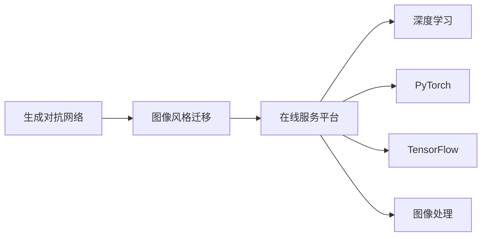

                 

# 基于生成对抗网络的图像风格迁移在线服务平台开发

> 关键词：
1. 生成对抗网络(GANs)
2. 图像风格迁移
3. 在线服务平台
4. 深度学习
5. PyTorch
6. TensorFlow
7. 图像处理

## 1. 背景介绍

图像风格迁移（Image Style Transfer）是计算机视觉领域的热门研究方向之一，旨在将一张图像的风格迁移到另一张图像上，而保留其内容。这项技术不仅具有显著的艺术效果，还在诸如增强图像质量、提高图像可解释性等方面有着广泛的应用。近年来，随着深度学习技术的发展，生成对抗网络（GANs）成为了图像风格迁移的主要手段。

生成对抗网络是由一个生成器（Generator）和一个判别器（Discriminator）两部分组成的，两者相互对抗训练，使得生成器可以生成逼真的图像，而判别器可以区分真实和生成的图像。通过不断迭代训练，生成器逐步提升其生成能力，从而实现将源图像风格迁移到目标图像的效果。

随着深度学习技术在实际应用中的不断拓展，许多企业和研究机构开始探索基于生成对抗网络的图像风格迁移技术如何更好地服务于用户。在线服务平台成为了一个热门的实现方式，通过网络化部署，使得用户可以随时随地使用这项技术。

本文将聚焦于基于生成对抗网络的图像风格迁移在线服务平台的开发，系统介绍其核心概念、算法原理、实现步骤以及相关的开发工具和资源，最后讨论未来发展趋势和面临的挑战。

## 2. 核心概念与联系

### 2.1 核心概念概述

在进行图像风格迁移在线服务平台开发前，首先需要理解以下几个核心概念：

- **生成对抗网络(GANs)**：GANs是由生成器和判别器两部分组成的深度神经网络，生成器负责生成逼真的图像，判别器负责判断图像是真实的还是生成的。两者通过对抗训练不断提升生成器生成图像的质量。

- **图像风格迁移**：图像风格迁移是将一张图像的风格迁移到另一张图像上，使得目标图像看起来像是使用某种特定的风格绘制的。这一过程通常通过调整生成器的参数来实现。

- **在线服务平台**：在线服务平台是基于互联网的应用，通过浏览器或客户端提供图像处理服务。它通常包括前端界面和后端逻辑，允许用户上传图像、选择风格并进行迁移操作。

- **深度学习**：深度学习是机器学习的一种，通过多层神经网络学习数据的复杂表示，广泛应用于图像、语音、自然语言处理等领域。

- **PyTorch**和**TensorFlow**：这两个深度学习框架是目前最流行的深度学习框架之一，提供了丰富的API和工具，支持构建、训练和部署深度神经网络模型。

- **图像处理**：图像处理是对图像进行分析和改造的过程，包括图像滤波、增强、分割等。

### 2.2 核心概念间的联系

这些核心概念间的关系可以通过以下Mermaid流程图来展示：



这个流程图展示了几大核心概念之间的联系：

- 生成对抗网络（GANs）是图像风格迁移的核心技术之一。
- 图像风格迁移是通过深度学习中的生成对抗网络实现的。
- 在线服务平台是图像风格迁移应用的主要方式。
- 深度学习框架PyTorch和TensorFlow提供了必要的工具和API，支持深度神经网络模型的构建和训练。
- 图像处理是图像风格迁移的基础，通过图像处理技术，可以实现对图像的预处理和后处理。

## 3. 核心算法原理 & 具体操作步骤

### 3.1 算法原理概述

基于生成对抗网络的图像风格迁移算法，主要包括以下几个步骤：

1. **数据准备**：准备源图像和目标图像，以及用于训练生成器的伪样本数据。
2. **生成器训练**：使用生成器将源图像转换为具有目标图像风格的图像。
3. **判别器训练**：使用判别器区分生成的图像和目标图像，并不断优化生成器参数，提升生成器的生成能力。
4. **风格迁移**：使用训练好的生成器，将源图像的风格迁移到目标图像上。

### 3.2 算法步骤详解

#### 3.2.1 数据准备

首先需要准备源图像和目标图像。这里可以使用网络上的公开数据集，如COCO数据集，也可以使用用户上传的图像。此外，还需要准备一些用于训练生成器的伪样本数据。

生成器的输入是源图像，输出是具有目标图像风格的图像。在训练过程中，生成器会不断地生成伪样本数据，这些伪样本数据被送入判别器中进行判断。

#### 3.2.2 生成器训练

生成器的训练过程分为两个阶段：

- **初始化阶段**：生成器从随机噪声向量开始生成图像，将其送入判别器进行判断。判别器会将生成的图像判断为假的图像，然后将其标记为噪声向量。生成器的损失函数是判别器的误判损失和梯度惩罚损失之和。
- **优化阶段**：生成器通过反向传播算法，使用梯度下降方法不断优化其参数，使得生成的图像越来越逼真。同时，判别器也会不断地学习如何更好地区分真实图像和生成的图像。

#### 3.2.3 判别器训练

判别器的训练过程同样分为两个阶段：

- **初始化阶段**：判别器首先使用真实图像进行训练，逐步提升其对真实图像的判断能力。然后，使用生成器生成的伪样本数据进行训练，逐步提升其对生成图像的判断能力。
- **优化阶段**：判别器通过反向传播算法，使用梯度下降方法不断优化其参数，使得判别器能够更好地区分真实图像和生成的图像。

#### 3.2.4 风格迁移

在生成器和判别器训练完成后，使用训练好的生成器将源图像的风格迁移到目标图像上。具体步骤为：

1. **预处理**：将源图像和目标图像进行预处理，如裁剪、调整大小等。
2. **生成**：使用生成器将源图像转换为具有目标图像风格的图像。
3. **后处理**：对生成的图像进行后处理，如增强、调整色彩等，得到最终的风格迁移结果。

### 3.3 算法优缺点

#### 3.3.1 算法优点

1. **强大的生成能力**：GANs能够生成高质量的逼真图像，满足图像风格迁移的需求。
2. **可解释性**：通过不断迭代训练，生成器可以逐步提升其生成能力，使得生成的图像更加符合期望。
3. **高效性**：与传统的图像处理技术相比，GANs具有更高的效率，能够在较短的时间内完成风格迁移。

#### 3.3.2 算法缺点

1. **训练难度大**：GANs的训练过程较为复杂，需要大量的计算资源和时间，且容易陷入局部最优解。
2. **模型不稳定**：GANs的生成器与判别器相互对抗训练，模型不稳定，容易出现模式崩溃等问题。
3. **数据需求高**：GANs需要大量的数据进行训练，且数据质量对训练结果有较大影响。

### 3.4 算法应用领域

图像风格迁移技术可以应用于多个领域，如：

- **艺术创作**：将不同类型的艺术风格应用于照片或视频，产生独特的艺术效果。
- **广告设计**：使用广告风格迁移技术，将广告素材转换为更具吸引力的风格。
- **医学影像**：通过风格迁移技术，将医学影像转换为更加清晰的图像，帮助医生进行诊断。
- **游戏开发**：在游戏开发中，使用风格迁移技术将游戏中的场景和角色转换为更具艺术感的风格。

## 4. 数学模型和公式 & 详细讲解

### 4.1 数学模型构建

在基于GANs的图像风格迁移中，可以使用如下的数学模型进行表示：

- **生成器**：
$$
G(z) = \mu + \sigma \cdot N(0,1) \cdot W_G
$$
其中，$G(z)$表示生成器生成的图像，$z$表示随机噪声向量，$W_G$表示生成器的权重矩阵。

- **判别器**：
$$
D(x) = W_D \cdot x + b_D
$$
其中，$D(x)$表示判别器对图像$x$的判别结果，$W_D$和$b_D$分别表示判别器的权重矩阵和偏置项。

### 4.2 公式推导过程

#### 4.2.1 生成器的训练公式

生成器的损失函数由两个部分组成：判别器的误判损失和梯度惩罚损失。

- **判别器的误判损失**：
$$
L_D = -\frac{1}{m} \sum_{i=1}^m D(G(z_i)) + \frac{1}{n} \sum_{i=1}^n D(x_i)
$$
其中，$m$表示生成的图像数量，$n$表示真实图像数量，$x_i$表示真实图像，$G(z_i)$表示生成的图像。

- **梯度惩罚损失**：
$$
L_G = -\frac{1}{m} \sum_{i=1}^m D(G(z_i))
$$

#### 4.2.2 判别器的训练公式

判别器的损失函数同样由两个部分组成：生成器的误判损失和真实图像的判别损失。

- **生成器的误判损失**：
$$
L_G = -\frac{1}{m} \sum_{i=1}^m D(G(z_i))
$$
其中，$m$表示生成的图像数量，$G(z_i)$表示生成的图像。

- **真实图像的判别损失**：
$$
L_D = \frac{1}{n} \sum_{i=1}^n D(x_i)
$$
其中，$n$表示真实图像数量，$x_i$表示真实图像。

### 4.3 案例分析与讲解

以一张图片的风格迁移为例，分析其生成和训练过程：

- **生成器**：使用一张源图片和一个随机噪声向量，通过生成器生成一张具有目标风格的图片。
- **判别器**：将生成的图片和源图片一起送入判别器，判别器将生成的图片标记为假，将源图片标记为真。
- **反向传播**：根据判别器的输出，计算生成器和判别器的损失函数，使用梯度下降算法更新生成器和判别器的参数。
- **迭代训练**：重复上述过程，直到生成器的输出逼近目标风格的图片。

## 5. 项目实践：代码实例和详细解释说明

### 5.1 开发环境搭建

在进行图像风格迁移在线服务平台的开发前，需要先搭建好开发环境。这里以Python为基础，使用PyTorch框架进行开发。

1. 安装Python：确保系统中已安装Python 3.6以上版本。
2. 安装PyTorch：使用pip安装PyTorch，并指定相应的GPU/TPU版本。
3. 安装TensorFlow：使用pip安装TensorFlow，并指定相应的GPU/TPU版本。
4. 安装OpenCV：使用pip安装OpenCV，用于图像处理。

### 5.2 源代码详细实现

#### 5.2.1 数据处理

- **数据加载**：使用PyTorch的数据加载器，从本地存储或网络获取源图像和目标图像。
- **数据预处理**：对图像进行裁剪、调整大小等预处理，确保图像尺寸一致。

#### 5.2.2 生成器模型

- **生成器结构**：使用PyTorch定义生成器的神经网络结构，包括卷积层、池化层、全连接层等。
- **模型训练**：使用PyTorch的优化器和损失函数训练生成器，使其能够生成具有目标风格的图片。

#### 5.2.3 判别器模型

- **判别器结构**：使用PyTorch定义判别器的神经网络结构，包括卷积层、全连接层等。
- **模型训练**：使用PyTorch的优化器和损失函数训练判别器，使其能够区分真实图像和生成的图像。

#### 5.2.4 风格迁移

- **预处理**：对源图像和目标图像进行预处理，确保图像尺寸一致。
- **生成**：使用训练好的生成器，将源图像转换为具有目标风格的图片。
- **后处理**：对生成的图片进行后处理，如增强、调整色彩等，得到最终的风格迁移结果。

### 5.3 代码解读与分析

#### 5.3.1 数据加载

使用PyTorch的数据加载器，可以方便地从本地存储或网络获取数据。

```python
import torch
import torchvision.datasets as datasets
import torchvision.transforms as transforms

# 定义数据加载器
train_dataset = datasets.ImageFolder('train_dir', transforms.ToTensor())
train_loader = torch.utils.data.DataLoader(train_dataset, batch_size=32, shuffle=True)
```

#### 5.3.2 生成器模型

定义生成器的神经网络结构，包括卷积层、池化层、全连接层等。

```python
import torch.nn as nn

class Generator(nn.Module):
    def __init__(self):
        super(Generator, self).__init__()
        self.conv1 = nn.Conv2d(3, 64, kernel_size=3, stride=1, padding=1)
        self.conv2 = nn.Conv2d(64, 128, kernel_size=3, stride=2, padding=1)
        self.conv3 = nn.Conv2d(128, 256, kernel_size=3, stride=2, padding=1)
        self.conv4 = nn.Conv2d(256, 512, kernel_size=3, stride=2, padding=1)
        self.conv5 = nn.Conv2d(512, 3, kernel_size=3, stride=1, padding=1)
    
    def forward(self, x):
        x = self.conv1(x)
        x = nn.functional.relu(x)
        x = self.conv2(x)
        x = nn.functional.relu(x)
        x = self.conv3(x)
        x = nn.functional.relu(x)
        x = self.conv4(x)
        x = nn.functional.relu(x)
        x = self.conv5(x)
        x = nn.functional.relu(x)
        return x
```

#### 5.3.3 判别器模型

定义判别器的神经网络结构，包括卷积层、全连接层等。

```python
class Discriminator(nn.Module):
    def __init__(self):
        super(Discriminator, self).__init__()
        self.conv1 = nn.Conv2d(3, 64, kernel_size=3, stride=1, padding=1)
        self.conv2 = nn.Conv2d(64, 128, kernel_size=3, stride=2, padding=1)
        self.conv3 = nn.Conv2d(128, 256, kernel_size=3, stride=2, padding=1)
        self.conv4 = nn.Conv2d(256, 512, kernel_size=3, stride=2, padding=1)
        self.fc = nn.Linear(512, 1)
    
    def forward(self, x):
        x = self.conv1(x)
        x = nn.functional.relu(x)
        x = self.conv2(x)
        x = nn.functional.relu(x)
        x = self.conv3(x)
        x = nn.functional.relu(x)
        x = self.conv4(x)
        x = nn.functional.relu(x)
        x = x.view(x.size(0), -1)
        x = self.fc(x)
        return x
```

#### 5.3.4 风格迁移

将训练好的生成器和判别器应用到图像风格迁移中，具体步骤如下：

- **预处理**：对源图像和目标图像进行预处理，确保图像尺寸一致。
- **生成**：使用训练好的生成器，将源图像转换为具有目标风格的图片。
- **后处理**：对生成的图片进行后处理，如增强、调整色彩等，得到最终的风格迁移结果。

```python
import torchvision.transforms as transforms
import torchvision.transforms.functional as TF

# 定义预处理
preprocess = transforms.Compose([
    transforms.ToTensor(),
    transforms.Normalize(mean=[0.5, 0.5, 0.5], std=[0.5, 0.5, 0.5])
])

# 预处理源图像和目标图像
source_image = preprocess(source_image)
target_image = preprocess(target_image)

# 使用训练好的生成器进行风格迁移
generated_image = generator(source_image)

# 后处理，如增强、调整色彩等
postprocess = transforms.Compose([
    transforms.ToPILImage(),
    TF.adjust_brightness,
    TF.adjust_contrast,
    TF.adjust_hue,
    TF.adjust_saturation
])
final_image = postprocess(generated_image)
```

### 5.4 运行结果展示

完成图像风格迁移后，可以将生成的图像保存并展示出来。

```python
import matplotlib.pyplot as plt
from matplotlib import patches
import numpy as np

# 将图像保存为PNG格式
save_image(final_image, 'style_transfer.png')

# 展示生成的图像
plt.imshow(final_image.numpy())
plt.show()
```

## 6. 实际应用场景

图像风格迁移在线服务平台的应用场景非常广泛，以下是几个典型的应用场景：

### 6.1 艺术创作

艺术家可以使用图像风格迁移技术，将各种艺术风格应用于照片或视频，产生独特的艺术效果。例如，将梵高的《星夜》风格应用于普通风景照片，可以产生如画般的效果。

### 6.2 广告设计

广告公司可以使用图像风格迁移技术，将广告素材转换为更具吸引力的风格。例如，将高端产品的照片转换为名画风格，可以提升广告的视觉冲击力。

### 6.3 医学影像

医疗行业可以使用图像风格迁移技术，将医学影像转换为更加清晰的图像，帮助医生进行诊断。例如，将模糊的医学影像转换为清晰的图像，可以显著提高医生的诊断效率和准确性。

### 6.4 游戏开发

游戏开发可以使用图像风格迁移技术，将游戏中的场景和角色转换为更具艺术感的风格。例如，将游戏中的角色转换为卡通风格，可以增加游戏的趣味性和视觉吸引力。

## 7. 工具和资源推荐

### 7.1 学习资源推荐

为了更好地学习图像风格迁移在线服务平台的开发，以下是一些推荐的学习资源：

1. **PyTorch官方文档**：PyTorch官方文档提供了丰富的教程和示例代码，适合初学者和进阶开发者。
2. **TensorFlow官方文档**：TensorFlow官方文档提供了深度学习的详细说明和示例代码，适合深度学习从业者。
3. **OpenCV官方文档**：OpenCV官方文档提供了图像处理的详细说明和示例代码，适合图像处理从业者。
4. **GANs的论文和博客**：GANs领域的经典论文和博客，如Image Style Transfer by Deep Learning、CycleGAN等，可以帮助理解GANs的原理和应用。

### 7.2 开发工具推荐

开发图像风格迁移在线服务平台，需要使用一些常用的开发工具。以下是推荐的开发工具：

1. **PyTorch**：PyTorch是一个基于Python的深度学习框架，提供了丰富的API和工具，适合构建和训练深度神经网络模型。
2. **TensorFlow**：TensorFlow是Google开发的深度学习框架，提供了丰富的API和工具，适合构建和训练深度神经网络模型。
3. **Jupyter Notebook**：Jupyter Notebook是一个交互式的编程环境，适合编写和调试深度学习代码。
4. **VSCode**：VSCode是一个功能强大的代码编辑器，支持Python、PyTorch和TensorFlow等框架。

### 7.3 相关论文推荐

为了深入了解图像风格迁移在线服务平台的开发，以下是一些推荐的论文：

1. **Image Style Transfer Using a Generative Adversarial Network**：这是一篇经典的GANs论文，提出了使用GANs进行图像风格迁移的方法。
2. **CycleGAN: Learning to Translate Images with Conditional Adversarial Networks**：这篇论文提出了CycleGAN算法，用于图像域转换和风格迁移。
3. **Adversarial Networks and Adversarial Training**：这篇论文介绍了生成对抗网络的基本原理和训练方法，适合理解GANs的原理和应用。

## 8. 总结：未来发展趋势与挑战

### 8.1 研究成果总结

基于生成对抗网络的图像风格迁移在线服务平台，具有以下优点：

1. **生成能力强大**：GANs能够生成高质量的逼真图像，满足图像风格迁移的需求。
2. **可解释性**：通过不断迭代训练，生成器可以逐步提升其生成能力，使得生成的图像更加符合期望。
3. **高效性**：与传统的图像处理技术相比，GANs具有更高的效率，能够在较短的时间内完成风格迁移。

但GANs也存在一些缺点：

1. **训练难度大**：GANs的训练过程较为复杂，需要大量的计算资源和时间，且容易陷入局部最优解。
2. **模型不稳定**：GANs的生成器与判别器相互对抗训练，模型不稳定，容易出现模式崩溃等问题。
3. **数据需求高**：GANs需要大量的数据进行训练，且数据质量对训练结果有较大影响。

### 8.2 未来发展趋势

未来的图像风格迁移在线服务平台，将呈现以下几个发展趋势：

1. **多任务学习**：未来的平台将支持多个任务，如图像风格迁移、图像修复、图像去噪等，提供更加丰富的功能。
2. **实时处理**：未来的平台将实现实时处理，使得用户可以实时查看风格迁移的结果。
3. **跨平台部署**：未来的平台将支持多种平台，如Web、Android、iOS等，满足不同用户的需求。
4. **AI增强**：未来的平台将引入AI技术，如自然语言处理、语音识别等，提供更加智能化的服务。

### 8.3 面临的挑战

尽管图像风格迁移在线服务平台已经取得了一定的进展，但在实际应用中，仍然面临一些挑战：

1. **模型训练复杂**：GANs的训练过程较为复杂，需要大量的计算资源和时间，且容易陷入局部最优解。
2. **模型稳定性差**：GANs的生成器与判别器相互对抗训练，模型不稳定，容易出现模式崩溃等问题。
3. **数据质量要求高**：GANs需要大量的数据进行训练，且数据质量对训练结果有较大影响。
4. **模型泛化能力差**：GANs的模型泛化能力较差，容易过拟合，导致在实际应用中表现不佳。

### 8.4 研究展望

为了应对这些挑战，未来的研究需要在以下几个方面进行探索：

1. **优化模型训练**：通过优化模型结构、使用更好的优化器等方法，降低模型训练难度，提高训练效率。
2. **提高模型稳定性**：通过改进生成器和判别器的设计，提高模型的稳定性，避免模式崩溃等问题。
3. **提升数据质量**：通过数据增强、数据预处理等方法，提高数据质量，提升模型性能。
4. **增强模型泛化能力**：通过迁移学习、对抗训练等方法，增强模型的泛化能力，提高模型的应用效果。

总之，图像风格迁移在线服务平台的开发需要不断探索和创新，只有不断解决技术瓶颈，才能实现更加稳定、高效、智能化的服务。相信在未来的研究中，这些问题将会逐步被克服，图像风格迁移技术将迎来更加广阔的应用前景。

## 9. 附录：常见问题与解答

**Q1：GANs的训练过程为什么容易陷入局部最优解？**

A: GANs的训练过程分为生成器和判别器的训练过程，两者相互对抗。在训练过程中，生成器和判别器都会不断优化自己的参数，使得对方难以进行有效的攻击。这种相互对抗的训练过程容易导致生成器和判别器陷入局部最优解，从而影响模型的性能。

**Q2：GANs的生成能力为什么这么强大？**

A: GANs的生成能力强大是因为其训练过程中，生成器和判别器相互对抗，使得生成器能够不断优化自己的参数，生成高质量的图像。同时，判别器也能够不断优化自己的参数，提升对生成图像的判别能力，从而形成了一个相互促进的训练过程，使得GANs的生成能力不断提升。

**Q3：GANs的模型为什么容易过拟合？**

A: GANs的模型容易过拟合是因为其训练过程中，生成器和判别器的参数更新速度不一致。在训练初期，判别器通常会很快收敛，而生成器则需要更长时间来优化其参数。这种不一致的参数更新速度容易导致生成器过拟合，使得生成的图像在测试集上表现不佳。

**Q4：GANs的模型为什么容易模式崩溃？**

A: GANs的模型容易模式崩溃是因为其生成器和判别器之间的对抗过程不稳定。在训练过程中，生成器和判别器之间的对抗关系可能会发生变化，导致模型陷入不稳定状态。此外，GANs的训练过程中，生成器和判别器之间的对抗关系可能会发生改变，导致模型性能下降，甚至崩溃。

**Q5：GANs的模型为什么需要大量的数据进行训练？**

A: GANs的模型需要大量的数据进行训练是因为其生成器需要从随机噪声向量中生成高质量的图像，而判别器需要判断图像的真实性。为了提高生成器和判别器的性能，需要大量的数据进行训练，使得模型能够更好地适应各种数据分布，提升生成图像的质量。

总之，GANs的训练过程较为复杂，需要不断优化模型结构和训练方法，才能提升其性能和稳定性。只有不断探索和创新，才能实现更加稳定、高效、智能化的图像风格迁移在线服务平台。

---

作者：禅与计算机程序设计艺术 / Zen and the Art of Computer Programming

