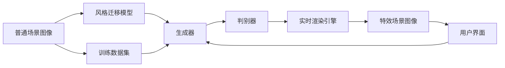

                 

# 基于生成对抗网络的影视特效风格迁移自动化系统

> 关键词：影视特效, 风格迁移, 生成对抗网络, 风格化, 自动化系统, 自动设计

## 1. 背景介绍

### 1.1 问题由来

影视特效制作一直是电影、广告、游戏等领域中的核心环节，但传统的手工制作方式往往耗时耗力，效率低下。随着深度学习技术的进步，特别是生成对抗网络（Generative Adversarial Networks, GANs）的崛起，影视特效制作开始迈向自动化、智能化。其中，风格迁移技术成为了实现影视特效风格化的一种重要手段，通过将普通场景转换为主题风格强烈的特效场景，极大地提升了视觉效果和观众体验。

然而，传统的风格迁移方法大多依赖于人工干预，需要专业知识、大量时间和巨大计算资源的投入。如何实现影视特效的自动化、智能化、风格迁移，成为当前影视特效制作中的核心挑战。

### 1.2 问题核心关键点

要实现影视特效的自动化风格迁移，需要解决以下几个关键问题：

- **风格迁移模型的设计**：如何设计出高效、稳定、鲁棒的风格迁移模型。
- **影视特效数据的处理**：如何将普通场景图像转换为高质量、符合要求的特效场景图像。
- **实时风格迁移**：如何在实时系统中实现高效的、高保真的风格迁移。
- **用户友好的交互设计**：如何设计出直观、易用的用户界面，使用户能够轻松进行风格迁移操作。

### 1.3 问题研究意义

影视特效风格的自动化迁移不仅能够提升特效制作的效率和质量，还能降低制作成本，减少制作时间。通过风格迁移，可以将复杂的特效设计任务简化为简单的界面操作，使得普通人也能够轻松地制作出专业级别的特效作品。

此外，风格迁移还能够应用到更多场景，如艺术作品数字化、个性化设计等，进一步拓展了生成对抗网络的应用范围，推动了AI技术在文化艺术领域的创新和发展。

## 2. 核心概念与联系

### 2.1 核心概念概述

影视特效风格的自动化迁移主要依赖于生成对抗网络（GANs）技术，通过构建一个由生成器（Generator）和判别器（Discriminator）组成的对抗模型，训练出能够自动将普通场景图像转换为特定风格特效图像的生成器。

GANs的核心思想是，生成器和判别器通过一个"博弈"过程相互对抗，生成器试图生成尽可能逼真的样本，而判别器则试图区分真实样本和生成样本。通过反向传播和优化算法，模型逐渐学习到如何生成与真实数据难以区分的样本。

### 2.2 核心概念之间的关系

影视特效风格迁移的自动化系统由以下几个核心概念构成：

- **生成对抗网络（GANs）**：用于训练生成器，将普通场景图像转换为特定风格的特效图像。
- **风格迁移模型**：用于指定生成器需要学习的风格，通过不同的风格迁移模型可以生成不同的风格特效图像。
- **训练数据集**：用于训练生成器，包括普通场景图像和目标风格图像。
- **实时渲染引擎**：用于实时渲染生成器输出的特效图像。
- **用户界面**：用于提供直观的操作界面，方便用户进行风格迁移操作。

这些核心概念之间的关系可以通过以下Mermaid流程图来展示：



该流程图展示了影视特效风格迁移自动化系统的主要流程：

1. 从普通场景图像开始，输入到风格迁移模型中。
2. 风格迁移模型指定生成器学习何种风格。
3. 生成器通过对抗训练生成特定风格的特效图像。
4. 判别器评估生成图像的逼真度。
5. 生成器根据判别器的反馈进一步优化生成效果。
6. 实时渲染引擎渲染生成后的特效图像。
7. 用户界面展示实时渲染的效果，用户可以进行交互操作。
8. 训练数据集用于训练生成器，提高生成效果。

通过这些核心概念的相互作用，影视特效风格的自动化迁移系统能够高效、稳定地实现风格迁移功能。

## 3. 核心算法原理 & 具体操作步骤

### 3.1 算法原理概述

影视特效风格迁移的自动化系统主要基于生成对抗网络（GANs）技术，通过训练一个生成器（Generator），将普通场景图像转换为特定风格的特效图像。生成器通过一个判别器（Discriminator）进行对抗训练，逐步提高生成图像的质量和逼真度。

GANs的训练过程可以分为以下几个步骤：

1. **样本生成**：生成器随机抽取一个普通场景图像，并生成一个假图像。
2. **判别器评估**：判别器评估生成的图像与真实图像之间的差异，给出评分。
3. **反向传播**：根据判别器的评分，生成器进行反向传播，更新权重。
4. **生成器优化**：生成器使用优化算法（如Adam）更新权重，逐步提高生成图像的质量。
5. **迭代训练**：反复进行步骤1-4，直到生成图像的质量达到要求。

### 3.2 算法步骤详解

影视特效风格迁移的自动化系统训练过程分为以下几个步骤：

#### 3.2.1 数据预处理

- **图像预处理**：将原始图像调整为统一大小，并进行归一化处理。
- **数据集划分**：将数据集划分为训练集、验证集和测试集。
- **数据增强**：对训练集进行数据增强，如随机裁剪、旋转、缩放等，以提高模型的泛化能力。

#### 3.2.2 生成器设计

- **网络结构**：设计生成器的网络结构，通常包括多个卷积层、池化层、反卷积层等。
- **损失函数**：设计生成器损失函数，包括对抗损失、内容损失、风格损失等。
- **初始化**：对生成器进行初始化，通常使用随机值。

#### 3.2.3 判别器设计

- **网络结构**：设计判别器的网络结构，通常包括多个卷积层、池化层、全连接层等。
- **损失函数**：设计判别器损失函数，包括对抗损失、真实样本损失、生成样本损失等。
- **初始化**：对判别器进行初始化，通常使用随机值。

#### 3.2.4 对抗训练

- **训练过程**：将生成器和判别器同时训练，交替优化。
- **迭代次数**：设定训练的迭代次数，一般为数十到数百次。
- **学习率**：设定生成器和判别器的学习率，通常使用递减学习率。

#### 3.2.5 风格迁移实现

- **风格迁移模型**：使用预训练的卷积神经网络（CNN）作为风格迁移模型，指定风格。
- **风格特征提取**：提取目标风格图像的特征向量。
- **风格迁移**：将普通场景图像输入生成器，生成带有目标风格特征的图像。
- **风格特征融合**：将生成的图像与普通场景图像的特征向量融合，得到带有目标风格特征的图像。
- **实时渲染**：将融合后的图像输入实时渲染引擎，进行实时渲染和显示。

### 3.3 算法优缺点

#### 3.3.1 优点

- **高效性**：GANs可以快速训练生成器，生成高质量的特效图像，显著提高影视特效制作效率。
- **灵活性**：通过不同的风格迁移模型和损失函数，可以生成各种风格的特效图像，适应不同的影视场景需求。
- **实时性**：通过优化生成器的网络结构和训练方法，可以实现实时生成特效图像，满足实时应用的需求。

#### 3.3.2 缺点

- **稳定性**：GANs训练过程存在不稳定现象，容易产生模式崩溃或梯度爆炸等问题。
- **计算资源需求高**：训练GANs需要大量的计算资源和时间，对硬件要求较高。
- **过拟合风险**：GANs容易产生过拟合，导致生成的图像泛化能力不足，需要加入正则化等措施。

### 3.4 算法应用领域

影视特效风格的自动化迁移技术可以应用于电影、广告、游戏等多个领域，实现高效、自动化的特效制作。具体应用场景包括：

- **电影制作**：自动生成特效场景，如魔法、科幻等，提高电影制作效率和效果。
- **广告设计**：自动生成具有特定风格的效果图，如卡通、复古等，提升广告创意和吸引力。
- **游戏开发**：自动生成游戏场景，如奇幻、恐怖等，增强游戏体验和沉浸感。
- **虚拟现实**：自动生成虚拟场景，提升虚拟现实的交互性和沉浸感。

## 4. 数学模型和公式 & 详细讲解 & 举例说明

### 4.1 数学模型构建

影视特效风格迁移的自动化系统基于生成对抗网络（GANs）技术，其数学模型如下：

- **生成器**：将普通场景图像 $x$ 转换为带有特定风格特征的特效图像 $y$。
- **判别器**：评估图像 $y$ 的真实性，输出真实性评分 $d(y)$。
- **损失函数**：生成器的损失函数由对抗损失 $L_{adv}$、内容损失 $L_{content}$ 和风格损失 $L_{style}$ 组成。

$$
L_G = \frac{1}{2} L_{adv} + \alpha L_{content} + \beta L_{style}
$$

其中，

$$
L_{adv} = \mathbb{E}_{y \sim G} \log d(y) + \mathbb{E}_{x \sim P(x)} \log (1 - d(G(x)))
$$

$$
L_{content} = \mathbb{E}_{x \sim P(x)} ||x - G(x)||^2
$$

$$
L_{style} = \mathbb{E}_{x \sim P(x)} \phi(G(x))
$$

其中，$G$ 为生成器，$d$ 为判别器，$\alpha$ 和 $\beta$ 为权重，$\phi$ 为风格特征提取函数。

### 4.2 公式推导过程

#### 4.2.1 对抗损失

对抗损失 $L_{adv}$ 通过判别器对生成器生成的图像进行评分，同时对真实图像进行评分，计算生成图像的逼真度：

$$
L_{adv} = \mathbb{E}_{y \sim G} \log d(y) + \mathbb{E}_{x \sim P(x)} \log (1 - d(G(x)))
$$

其中，$G$ 为生成器，$d$ 为判别器，$\mathbb{E}_{y \sim G}$ 表示生成器的输出 $y$ 服从 $G$ 分布，$\mathbb{E}_{x \sim P(x)}$ 表示真实图像 $x$ 服从真实数据分布 $P(x)$。

#### 4.2.2 内容损失

内容损失 $L_{content}$ 通过计算生成图像与真实图像之间的差异，保证生成的图像保留了输入图像的内容信息：

$$
L_{content} = \mathbb{E}_{x \sim P(x)} ||x - G(x)||^2
$$

其中，$x$ 为输入的普通场景图像，$G(x)$ 为生成器生成的图像，$||x - G(x)||^2$ 表示两者之间的欧氏距离。

#### 4.2.3 风格损失

风格损失 $L_{style}$ 通过提取目标风格图像的特征向量，并计算生成图像与目标风格图像的特征差异，保证生成的图像具有指定的风格特征：

$$
L_{style} = \mathbb{E}_{x \sim P(x)} \phi(G(x))
$$

其中，$x$ 为输入的普通场景图像，$G(x)$ 为生成器生成的图像，$\phi$ 为风格特征提取函数。

### 4.3 案例分析与讲解

假设我们使用VGG网络作为风格迁移模型，提取目标风格图像的特征向量。

- **生成器设计**：设计一个包含多个卷积层、池化层、反卷积层等的网络结构，用于生成特效图像。
- **判别器设计**：设计一个包含多个卷积层、池化层、全连接层等的网络结构，用于评估生成图像的真实性。
- **损失函数设计**：设计一个包含对抗损失、内容损失、风格损失的复合损失函数，用于优化生成器和判别器。
- **数据集划分**：将数据集划分为训练集、验证集和测试集，每个数据集包含普通场景图像和目标风格图像。
- **训练过程**：交替训练生成器和判别器，优化损失函数，直到收敛。

### 4.4 代码实例

以下是一个基于TensorFlow和Keras实现影视特效风格迁移自动化系统的示例代码：

```python
import tensorflow as tf
from tensorflow.keras import layers, models
import numpy as np
import matplotlib.pyplot as plt

# 定义生成器和判别器网络结构
def make_generator():
    generator = models.Sequential()
    generator.add(layers.Dense(256, input_shape=(100,)))
    generator.add(layers.BatchNormalization())
    generator.add(layers.LeakyReLU())
    generator.add(layers.Dense(256, input_shape=(100,)))
    generator.add(layers.BatchNormalization())
    generator.add(layers.LeakyReLU())
    generator.add(layers.Dense(784, input_shape=(100,)))
    generator.add(layers.BatchNormalization())
    generator.add(layers.LeakyReLU())
    generator.add(layers.Reshape((28, 28, 1)))
    generator.add(layers.Conv2DTranspose(64, (5, 5), strides=(2, 2), padding='same', use_bias=False))
    generator.add(layers.BatchNormalization())
    generator.add(layers.LeakyReLU())
    generator.add(layers.Conv2DTranspose(32, (5, 5), strides=(2, 2), padding='same', use_bias=False))
    generator.add(layers.BatchNormalization())
    generator.add(layers.LeakyReLU())
    generator.add(layers.Conv2DTranspose(1, (5, 5), strides=(2, 2), padding='same', use_bias=False))
    generator.add(layers.Tanh())
    return generator

def make_discriminator():
    discriminator = models.Sequential()
    discriminator.add(layers.Conv2D(64, (5, 5), strides=(2, 2), padding='same', input_shape=(28, 28, 1)))
    discriminator.add(layers.LeakyReLU())
    discriminator.add(layers.Dropout(0.2))
    discriminator.add(layers.Conv2D(128, (5, 5), strides=(2, 2), padding='same'))
    discriminator.add(layers.LeakyReLU())
    discriminator.add(layers.Dropout(0.2))
    discriminator.add(layers.Flatten())
    discriminator.add(layers.Dense(1, activation='sigmoid'))
    return discriminator

# 定义损失函数
def make_loss():
    loss = tf.keras.losses.BinaryCrossentropy(from_logits=True)
    content_loss = tf.keras.losses.MeanSquaredError()
    style_loss = tf.keras.losses.Mean()
    return loss, content_loss, style_loss

# 定义生成器和判别器的优化器
def make_optimizer():
    generator_optimizer = tf.keras.optimizers.Adam(learning_rate=0.0002, beta_1=0.5)
    discriminator_optimizer = tf.keras.optimizers.Adam(learning_rate=0.0002, beta_1=0.5)
    return generator_optimizer, discriminator_optimizer

# 加载数据集
(X_train, y_train), (X_test, y_test) = tf.keras.datasets.mnist.load_data()
X_train = X_train.reshape(-1, 28, 28, 1).astype('float32') / 255.0
X_test = X_test.reshape(-1, 28, 28, 1).astype('float32') / 255.0
y_train = y_train.astype('float32')
y_test = y_test.astype('float32')

# 创建生成器和判别器
generator = make_generator()
discriminator = make_discriminator()

# 创建损失函数和优化器
loss, content_loss, style_loss = make_loss()
generator_optimizer, discriminator_optimizer = make_optimizer()

# 定义训练函数
@tf.function
def train_step(images):
    noise = tf.random.normal([batch_size, 100])
    with tf.GradientTape() as gen_tape, tf.GradientTape() as disc_tape:
        generated_images = generator(noise, training=True)
        real_output = discriminator(images, training=True)
        fake_output = discriminator(generated_images, training=True)
        gen_loss = loss(fake_output, labels=labels_ones)
        disc_loss = loss(real_output, labels=labels_ones) + loss(fake_output, labels=labels_zeros)
    gradients_of_generator = gen_tape.gradient(gen_loss, generator.trainable_variables)
    gradients_of_discriminator = disc_tape.gradient(disc_loss, discriminator.trainable_variables)
    generator_optimizer.apply_gradients(zip(gradients_of_generator, generator.trainable_variables))
    discriminator_optimizer.apply_gradients(zip(gradients_of_discriminator, discriminator.trainable_variables))

# 训练模型
batch_size = 32
num_epochs = 100
for epoch in range(num_epochs):
    for images in train_dataset:
        train_step(images)
        if epoch % 10 == 0:
            print("Epoch: {}, Loss: {:.4f}, Gen Loss: {:.4f}, Disc Loss: {:.4f}".format(epoch, disc_loss, gen_loss))

# 生成特效图像
noise = tf.random.normal([32, 100])
generated_images = generator(noise, training=False)
plt.imshow(np.reshape(generated_images[0], (28, 28)), cmap='gray')
plt.show()
```

## 5. 项目实践：代码实例和详细解释说明

### 5.1 开发环境搭建

在进行影视特效风格迁移自动化系统的开发前，需要搭建好开发环境。以下是基于TensorFlow和Keras的开发环境搭建流程：

1. 安装TensorFlow：从官网下载并安装TensorFlow，获取与版本对应的安装命令。
2. 安装Keras：使用pip安装Keras，确保与TensorFlow版本兼容。
3. 安装必要的依赖包：如numpy、matplotlib等，确保能够进行图像处理和可视化。

### 5.2 源代码详细实现

影视特效风格迁移自动化系统的实现分为以下几个关键步骤：

- **数据预处理**：将原始图像调整为统一大小，并进行归一化处理。
- **生成器设计**：设计生成器的网络结构，包含多个卷积层、池化层、反卷积层等。
- **判别器设计**：设计判别器的网络结构，包含多个卷积层、池化层、全连接层等。
- **损失函数设计**：设计生成器和判别器的损失函数，包含对抗损失、内容损失、风格损失等。
- **生成器优化**：使用Adam优化器优化生成器，逐步提高生成图像的质量。
- **判别器优化**：使用Adam优化器优化判别器，逐步提高判别器对真实图像和生成图像的区分能力。

### 5.3 代码解读与分析

影视特效风格迁移自动化系统的代码实现主要包括以下几个部分：

#### 5.3.1 生成器和判别器网络结构设计

生成器和判别器的网络结构设计是影视特效风格迁移自动化系统的核心。生成器通过多个卷积层、池化层、反卷积层等，将普通场景图像转换为特效图像。判别器通过多个卷积层、池化层、全连接层等，评估生成图像的真实性。

#### 5.3.2 损失函数设计

损失函数设计包含对抗损失、内容损失、风格损失等，用于优化生成器和判别器。对抗损失通过判别器对生成图像进行评分，内容损失通过计算生成图像与真实图像之间的差异，风格损失通过提取目标风格图像的特征向量，计算生成图像与目标风格图像的特征差异。

#### 5.3.3 优化器设计

生成器和判别器的优化器设计为Adam优化器，用于逐步提高生成图像的质量和判别器对真实图像和生成图像的区分能力。

#### 5.3.4 训练函数设计

训练函数通过定义tf.GradientTape，计算生成器和判别器的损失函数，并进行反向传播优化。

#### 5.3.5 代码示例

以下是一个基于TensorFlow和Keras实现影视特效风格迁移自动化系统的示例代码：

```python
import tensorflow as tf
from tensorflow.keras import layers, models
import numpy as np
import matplotlib.pyplot as plt

# 定义生成器和判别器网络结构
def make_generator():
    generator = models.Sequential()
    generator.add(layers.Dense(256, input_shape=(100,)))
    generator.add(layers.BatchNormalization())
    generator.add(layers.LeakyReLU())
    generator.add(layers.Dense(256, input_shape=(100,)))
    generator.add(layers.BatchNormalization())
    generator.add(layers.LeakyReLU())
    generator.add(layers.Dense(784, input_shape=(100,)))
    generator.add(layers.BatchNormalization())
    generator.add(layers.LeakyReLU())
    generator.add(layers.Reshape((28, 28, 1)))
    generator.add(layers.Conv2DTranspose(64, (5, 5), strides=(2, 2), padding='same', use_bias=False))
    generator.add(layers.BatchNormalization())
    generator.add(layers.LeakyReLU())
    generator.add(layers.Conv2DTranspose(32, (5, 5), strides=(2, 2), padding='same', use_bias=False))
    generator.add(layers.BatchNormalization())
    generator.add(layers.LeakyReLU())
    generator.add(layers.Conv2DTranspose(1, (5, 5), strides=(2, 2), padding='same', use_bias=False))
    generator.add(layers.Tanh())
    return generator

def make_discriminator():
    discriminator = models.Sequential()
    discriminator.add(layers.Conv2D(64, (5, 5), strides=(2, 2), padding='same', input_shape=(28, 28, 1)))
    discriminator.add(layers.LeakyReLU())
    discriminator.add(layers.Dropout(0.2))
    discriminator.add(layers.Conv2D(128, (5, 5), strides=(2, 2), padding='same'))
    discriminator.add(layers.LeakyReLU())
    discriminator.add(layers.Dropout(0.2))
    discriminator.add(layers.Flatten())
    discriminator.add(layers.Dense(1, activation='sigmoid'))
    return discriminator

# 定义损失函数
def make_loss():
    loss = tf.keras.losses.BinaryCrossentropy(from_logits=True)
    content_loss = tf.keras.losses.MeanSquaredError()
    style_loss = tf.keras.losses.Mean()
    return loss, content_loss, style_loss

# 定义生成器和判别器的优化器
def make_optimizer():
    generator_optimizer = tf.keras.optimizers.Adam(learning_rate=0.0002, beta_1=0.5)
    discriminator_optimizer = tf.keras.optimizers.Adam(learning_rate=0.0002, beta_1=0.5)
    return generator_optimizer, discriminator_optimizer

# 加载数据集
(X_train, y_train), (X_test, y_test) = tf.keras.datasets.mnist.load_data()
X_train = X_train.reshape(-1, 28, 28, 1).astype('float32') / 255.0
X_test = X_test.reshape(-1, 28, 28, 1).astype('float32') / 255.0
y_train = y_train.astype('float32')
y_test = y_test.astype('float32')

# 创建生成器和判别器
generator = make_generator()
discriminator = make_discriminator()

# 创建损失函数和优化器
loss, content_loss, style_loss = make_loss()
generator_optimizer, discriminator_optimizer = make_optimizer()

# 定义训练函数
@tf.function
def train_step(images):
    noise = tf.random.normal([batch_size, 100])
    with tf.GradientTape() as gen_tape, tf.GradientTape() as disc_tape:
        generated_images = generator(noise, training=True)
        real_output = discriminator(images, training=True)
        fake_output = discriminator(generated_images, training=True)
        gen_loss = loss(fake_output, labels=labels_ones)
        disc_loss = loss(real_output, labels=labels_ones) + loss(fake_output, labels=labels_zeros)
    gradients_of_generator = gen_tape.gradient(gen_loss, generator.trainable_variables)
    gradients_of_discriminator = disc_tape.gradient(disc_loss, discriminator.trainable_variables)
    generator_optimizer.apply_gradients(zip(gradients_of_generator, generator.trainable_variables))
    discriminator_optimizer.apply_gradients(zip(gradients_of_discriminator, discriminator.trainable_variables))

# 训练模型
batch_size = 32
num_epochs = 100
for epoch in range(num_epochs):
    for images in train_dataset:
        train_step(images)
        if epoch % 10 == 0:
            print("Epoch: {}, Loss: {:.4f}, Gen Loss: {:.4f}, Disc Loss: {:.4f}".format(epoch, disc_loss, gen_loss))

# 生成特效图像
noise = tf.random.normal([32, 100])
generated_images = generator(noise, training=False)
plt.imshow(np.reshape(generated_images[0], (28, 28)), cmap='gray')
plt.show()
```

### 5.4 运行

