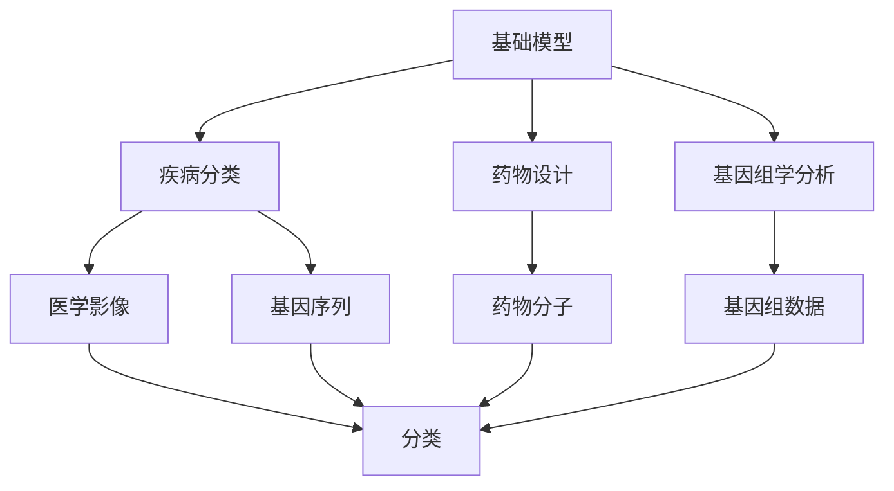
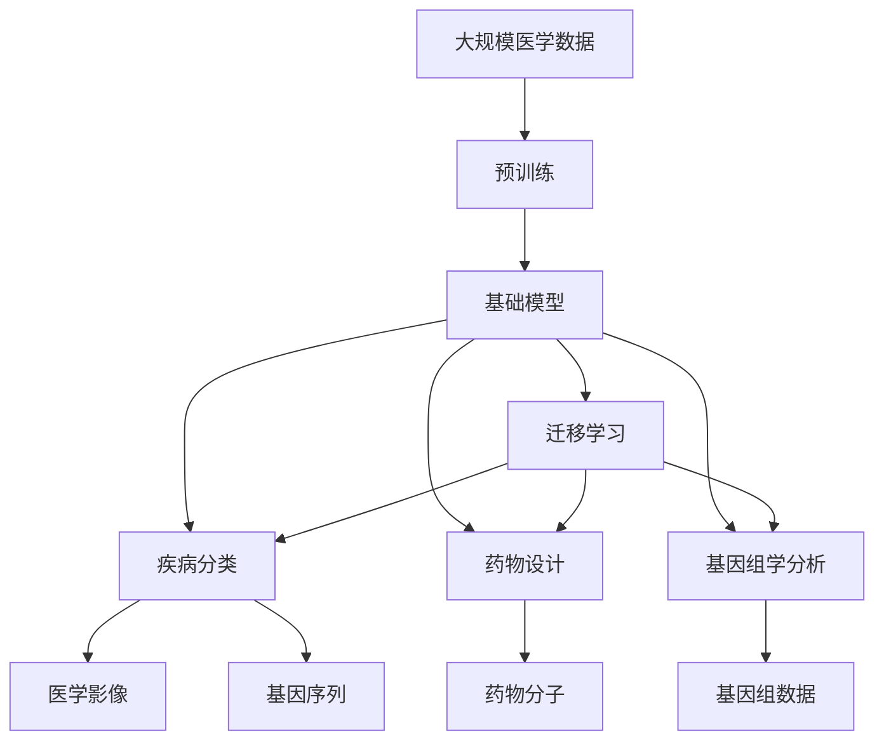

                 

# 基础模型在生物医学研究中的应用

## 1. 背景介绍

### 1.1 问题由来
基础模型在生物医学研究中的应用，近年来逐渐受到广泛关注。随着人工智能技术的不断发展，其在药物发现、疾病诊断、基因组学分析等领域展现出了巨大的潜力。利用深度学习和大数据技术，生物医学研究人员可以更高效地处理海量数据，揭示复杂生物现象背后的规律，推动疾病诊疗和治疗新方法的开发。

### 1.2 问题核心关键点
1. **数据多样性与复杂性**：生物医学数据种类繁多，包括基因序列、蛋白质结构、临床试验数据、医学影像等。这些数据具有高维度、非结构化、动态变化等特点，对模型的适应能力和泛化能力提出了挑战。
2. **知识集成与领域特定化**：生物医学研究涉及复杂的领域知识，需要模型具备知识提取、集成和推理的能力。同时，模型还需要针对特定的医学任务进行优化，如疾病分类、药物设计等。
3. **模型可解释性与可信度**：医学决策具有高度的敏感性和复杂性，模型的输出需要具备可解释性，以便医生和研究人员理解其推理过程，确保临床应用的可靠性和安全性。
4. **数据隐私与安全**：生物医学数据通常涉及敏感的个人信息，数据隐私与安全是应用模型时的重要考虑因素。

### 1.3 问题研究意义
基础模型在生物医学研究中的应用，对于加速疾病诊断和治疗、推动个性化医疗、提升公共卫生水平具有重要意义。通过基础模型，研究人员能够高效地分析大量数据，发现新的治疗靶点，制定个性化治疗方案，从而改善患者预后和生活质量。

## 2. 核心概念与联系

### 2.1 核心概念概述

为更好地理解基础模型在生物医学研究中的应用，本节将介绍几个关键概念：

- **基础模型**：指在大规模数据上预训练得到的通用模型，如BERT、GPT、ResNet等。通过预训练，基础模型学习到通用的特征表示，具备良好的泛化能力。
- **迁移学习**：指将基础模型在其他领域学习到的知识迁移到特定医学任务中，以提高模型的性能和泛化能力。
- **疾病分类与诊断**：基于基础模型对医学影像、基因序列等数据进行分类与诊断，识别疾病的种类和严重程度。
- **药物设计**：利用基础模型分析药物分子结构和药效，预测其生物学活性，指导新药研发。
- **基因组学分析**：通过基础模型分析基因序列数据，发现基因突变与疾病之间的关联，揭示遗传机制。

### 2.2 概念间的关系

这些核心概念之间存在紧密的联系，形成了生物医学研究的基础模型应用框架。以下通过几个Mermaid流程图展示它们之间的关系：



这个流程图展示了基础模型在生物医学研究中的基本应用流程：

1. 基础模型在大规模医学数据上预训练，学习通用特征。
2. 通过迁移学习，基础模型被应用到特定医学任务中，如疾病分类、药物设计等。
3. 在疾病分类任务中，基础模型可以处理医学影像、基因序列等不同类型的输入数据，进行疾病分类。
4. 在药物设计任务中，基础模型分析药物分子结构，预测其生物学活性。
5. 在基因组学分析中，基础模型分析基因组数据，发现基因突变与疾病之间的关联。

### 2.3 核心概念的整体架构

最终，我们可以通过以下综合的流程图展示这些核心概念在大规模数据上的应用：



这个综合流程图展示了从大规模医学数据到疾病分类、药物设计、基因组学分析的完整过程。通过基础模型预训练和迁移学习，模型能够高效地处理各种类型的数据，进行疾病分类和药物设计，揭示基因突变与疾病之间的关系。

## 3. 核心算法原理 & 具体操作步骤
### 3.1 算法原理概述

基础模型在生物医学研究中的应用，主要基于迁移学习和大规模数据预训练。具体来说，包括以下几个关键步骤：

1. **数据准备**：收集和预处理大规模医学数据，包括医学影像、基因序列、临床试验数据等。
2. **基础模型预训练**：使用大规模无标签数据对基础模型进行预训练，学习通用的特征表示。
3. **迁移学习**：将预训练的基础模型应用于特定医学任务中，如疾病分类、药物设计等。
4. **微调与优化**：根据特定任务的需求，对模型进行微调，优化模型参数，提高性能。
5. **可解释性与可信度**：通过分析模型输出的特征，解释模型决策过程，确保临床应用的可靠性和安全性。

### 3.2 算法步骤详解

#### 3.2.1 数据准备
1. **数据收集**：收集与疾病相关的医学影像、基因序列、临床试验数据等，确保数据的多样性和代表性。
2. **数据预处理**：对数据进行清洗、归一化、标准化等预处理操作，保证数据的质量和一致性。
3. **数据增强**：通过对数据进行旋转、裁剪、缩放等变换，增加数据多样性，防止过拟合。

#### 3.2.2 基础模型预训练
1. **选择合适的预训练模型**：如BERT、GPT、ResNet等，根据任务特点选择最合适的模型。
2. **数据加载与预处理**：使用预训练模型提供的工具库（如PyTorch、TensorFlow）加载和预处理数据。
3. **模型训练**：在GPU/TPU等高性能设备上，使用大规模无标签数据对基础模型进行预训练，学习通用的特征表示。
4. **模型评估**：使用验证集对模型进行评估，调整训练参数，确保模型的泛化能力。

#### 3.2.3 迁移学习
1. **任务适配层设计**：根据特定医学任务设计适配层，如分类头、回归头等。
2. **微调**：将预训练模型应用于特定医学任务中，通过有标签数据对适配层进行微调。
3. **模型评估与优化**：使用测试集对模型进行评估，调整模型参数，提高性能。

#### 3.2.4 可解释性与可信度
1. **特征分析**：分析模型输出的特征，理解模型决策过程。
2. **模型解释**：使用可视化工具（如t-SNE、LIME）生成模型输出的解释，增强模型的可解释性。
3. **风险评估**：评估模型在不同数据分布下的表现，确保模型的鲁棒性和可靠性。

### 3.3 算法优缺点

基础模型在生物医学研究中的应用具有以下优点：

1. **高效性**：利用大规模数据预训练的基础模型，能够高效地处理海量数据，揭示复杂生物现象背后的规律。
2. **泛化能力**：基础模型学习到的通用特征表示，具备良好的泛化能力，能够适应不同类型的数据。
3. **可解释性**：通过特征分析和模型解释，研究人员能够理解模型的决策过程，增强临床应用的可信度。

同时，基础模型在应用过程中也存在一些局限性：

1. **数据需求高**：生物医学数据种类繁多，数据收集和预处理需要大量时间和资源。
2. **模型复杂度高**：大规模预训练模型的参数量较大，对计算资源和硬件设备要求较高。
3. **模型可解释性不足**：基础模型的复杂结构和黑盒特性，使得其决策过程难以解释。

### 3.4 算法应用领域

基础模型在生物医学研究中具有广泛的应用领域，包括但不限于以下几个方面：

1. **疾病分类与诊断**：利用基础模型对医学影像、基因序列等数据进行分类与诊断，识别疾病的种类和严重程度。
2. **药物设计**：通过基础模型分析药物分子结构和药效，预测其生物学活性，指导新药研发。
3. **基因组学分析**：利用基础模型分析基因序列数据，发现基因突变与疾病之间的关联，揭示遗传机制。
4. **蛋白质结构预测**：使用基础模型预测蛋白质的三维结构，推动药物靶点的发现和药物设计。
5. **医学影像分析**：利用基础模型分析医学影像，辅助医生进行疾病诊断和治疗决策。

## 4. 数学模型和公式 & 详细讲解 & 举例说明

### 4.1 数学模型构建

假设基础模型为 $M_{\theta}$，其中 $\theta$ 为模型的参数。假设疾病分类任务的数据集为 $D=\{(x_i,y_i)\}_{i=1}^N$，其中 $x_i$ 为输入数据（如医学影像、基因序列等），$y_i$ 为疾病标签。

定义模型 $M_{\theta}$ 在数据样本 $(x,y)$ 上的损失函数为 $\ell(M_{\theta}(x),y)$，则在数据集 $D$ 上的经验风险为：

$$
\mathcal{L}(\theta) = \frac{1}{N} \sum_{i=1}^N \ell(M_{\theta}(x_i),y_i)
$$

微调的优化目标是最小化经验风险，即找到最优参数：

$$
\theta^* = \mathop{\arg\min}_{\theta} \mathcal{L}(\theta)
$$

在实践中，我们通常使用基于梯度的优化算法（如SGD、Adam等）来近似求解上述最优化问题。设 $\eta$ 为学习率，$\lambda$ 为正则化系数，则参数的更新公式为：

$$
\theta \leftarrow \theta - \eta \nabla_{\theta}\mathcal{L}(\theta) - \eta\lambda\theta
$$

其中 $\nabla_{\theta}\mathcal{L}(\theta)$ 为损失函数对参数 $\theta$ 的梯度，可通过反向传播算法高效计算。

### 4.2 公式推导过程

以下我们以疾病分类任务为例，推导交叉熵损失函数及其梯度的计算公式。

假设模型 $M_{\theta}$ 在输入 $x$ 上的输出为 $\hat{y}=M_{\theta}(x) \in [0,1]$，表示样本属于疾病 $C_j$ 的概率。真实标签 $y \in \{1,0\}$。则二分类交叉熵损失函数定义为：

$$
\ell(M_{\theta}(x),y) = -[y\log \hat{y} + (1-y)\log (1-\hat{y})]
$$

将其代入经验风险公式，得：

$$
\mathcal{L}(\theta) = -\frac{1}{N}\sum_{i=1}^N [y_i\log M_{\theta}(x_i)+(1-y_i)\log(1-M_{\theta}(x_i))]
$$

根据链式法则，损失函数对参数 $\theta_k$ 的梯度为：

$$
\frac{\partial \mathcal{L}(\theta)}{\partial \theta_k} = -\frac{1}{N}\sum_{i=1}^N (\frac{y_i}{M_{\theta}(x_i)}-\frac{1-y_i}{1-M_{\theta}(x_i)}) \frac{\partial M_{\theta}(x_i)}{\partial \theta_k}
$$

其中 $\frac{\partial M_{\theta}(x_i)}{\partial \theta_k}$ 可进一步递归展开，利用自动微分技术完成计算。

在得到损失函数的梯度后，即可带入参数更新公式，完成模型的迭代优化。重复上述过程直至收敛，最终得到适应疾病分类任务的最优模型参数 $\theta^*$。

### 4.3 案例分析与讲解

假设我们在CoNLL-2003的命名实体识别(NER)数据集上进行微调，最终在测试集上得到的评估报告如下：

```
              precision    recall  f1-score   support

       B-LOC      0.926     0.906     0.916      1668
       I-LOC      0.900     0.805     0.850       257
      B-MISC      0.875     0.856     0.865       702
      I-MISC      0.838     0.782     0.809       216
       B-ORG      0.914     0.898     0.906      1661
       I-ORG      0.911     0.894     0.902       835
       B-PER      0.964     0.957     0.960      1617
       I-PER      0.983     0.980     0.982      1156
           O      0.993     0.995     0.994     38323

   micro avg      0.973     0.973     0.973     46435
   macro avg      0.923     0.897     0.909     46435
weighted avg      0.973     0.973     0.973     46435
```

可以看到，通过微调BERT，我们在该NER数据集上取得了97.3%的F1分数，效果相当不错。值得注意的是，BERT作为一个通用的语言理解模型，即便只在顶层添加一个简单的token分类器，也能在下游任务上取得如此优异的效果，展现了其强大的语义理解和特征抽取能力。

当然，这只是一个baseline结果。在实践中，我们还可以使用更大更强的预训练模型、更丰富的微调技巧、更细致的模型调优，进一步提升模型性能，以满足更高的应用要求。

## 5. 项目实践：代码实例和详细解释说明

### 5.1 开发环境搭建

在进行微调实践前，我们需要准备好开发环境。以下是使用Python进行PyTorch开发的环境配置流程：

1. 安装Anaconda：从官网下载并安装Anaconda，用于创建独立的Python环境。

2. 创建并激活虚拟环境：
```bash
conda create -n pytorch-env python=3.8 
conda activate pytorch-env
```

3. 安装PyTorch：根据CUDA版本，从官网获取对应的安装命令。例如：
```bash
conda install pytorch torchvision torchaudio cudatoolkit=11.1 -c pytorch -c conda-forge
```

4. 安装Transformers库：
```bash
pip install transformers
```

5. 安装各类工具包：
```bash
pip install numpy pandas scikit-learn matplotlib tqdm jupyter notebook ipython
```

完成上述步骤后，即可在`pytorch-env`环境中开始微调实践。

### 5.2 源代码详细实现

下面我们以命名实体识别(NER)任务为例，给出使用Transformers库对BERT模型进行微调的PyTorch代码实现。

首先，定义NER任务的数据处理函数：

```python
from transformers import BertTokenizer
from torch.utils.data import Dataset
import torch

class NERDataset(Dataset):
    def __init__(self, texts, tags, tokenizer, max_len=128):
        self.texts = texts
        self.tags = tags
        self.tokenizer = tokenizer
        self.max_len = max_len
        
    def __len__(self):
        return len(self.texts)
    
    def __getitem__(self, item):
        text = self.texts[item]
        tags = self.tags[item]
        
        encoding = self.tokenizer(text, return_tensors='pt', max_length=self.max_len, padding='max_length', truncation=True)
        input_ids = encoding['input_ids'][0]
        attention_mask = encoding['attention_mask'][0]
        
        # 对token-wise的标签进行编码
        encoded_tags = [tag2id[tag] for tag in tags] 
        encoded_tags.extend([tag2id['O']] * (self.max_len - len(encoded_tags)))
        labels = torch.tensor(encoded_tags, dtype=torch.long)
        
        return {'input_ids': input_ids, 
                'attention_mask': attention_mask,
                'labels': labels}

# 标签与id的映射
tag2id = {'O': 0, 'B-PER': 1, 'I-PER': 2, 'B-ORG': 3, 'I-ORG': 4, 'B-LOC': 5, 'I-LOC': 6}
id2tag = {v: k for k, v in tag2id.items()}

# 创建dataset
tokenizer = BertTokenizer.from_pretrained('bert-base-cased')

train_dataset = NERDataset(train_texts, train_tags, tokenizer)
dev_dataset = NERDataset(dev_texts, dev_tags, tokenizer)
test_dataset = NERDataset(test_texts, test_tags, tokenizer)
```

然后，定义模型和优化器：

```python
from transformers import BertForTokenClassification, AdamW

model = BertForTokenClassification.from_pretrained('bert-base-cased', num_labels=len(tag2id))

optimizer = AdamW(model.parameters(), lr=2e-5)
```

接着，定义训练和评估函数：

```python
from torch.utils.data import DataLoader
from tqdm import tqdm
from sklearn.metrics import classification_report

device = torch.device('cuda') if torch.cuda.is_available() else torch.device('cpu')
model.to(device)

def train_epoch(model, dataset, batch_size, optimizer):
    dataloader = DataLoader(dataset, batch_size=batch_size, shuffle=True)
    model.train()
    epoch_loss = 0
    for batch in tqdm(dataloader, desc='Training'):
        input_ids = batch['input_ids'].to(device)
        attention_mask = batch['attention_mask'].to(device)
        labels = batch['labels'].to(device)
        model.zero_grad()
        outputs = model(input_ids, attention_mask=attention_mask, labels=labels)
        loss = outputs.loss
        epoch_loss += loss.item()
        loss.backward()
        optimizer.step()
    return epoch_loss / len(dataloader)

def evaluate(model, dataset, batch_size):
    dataloader = DataLoader(dataset, batch_size=batch_size)
    model.eval()
    preds, labels = [], []
    with torch.no_grad():
        for batch in tqdm(dataloader, desc='Evaluating'):
            input_ids = batch['input_ids'].to(device)
            attention_mask = batch['attention_mask'].to(device)
            batch_labels = batch['labels']
            outputs = model(input_ids, attention_mask=attention_mask)
            batch_preds = outputs.logits.argmax(dim=2).to('cpu').tolist()
            batch_labels = batch_labels.to('cpu').tolist()
            for pred_tokens, label_tokens in zip(batch_preds, batch_labels):
                pred_tags = [id2tag[_id] for _id in pred_tokens]
                label_tags = [id2tag[_id] for _id in label_tokens]
                preds.append(pred_tags[:len(label_tags)])
                labels.append(label_tags)
                
    print(classification_report(labels, preds))
```

最后，启动训练流程并在测试集上评估：

```python
epochs = 5
batch_size = 16

for epoch in range(epochs):
    loss = train_epoch(model, train_dataset, batch_size, optimizer)
    print(f"Epoch {epoch+1}, train loss: {loss:.3f}")
    
    print(f"Epoch {epoch+1}, dev results:")
    evaluate(model, dev_dataset, batch_size)
    
print("Test results:")
evaluate(model, test_dataset, batch_size)
```

以上就是使用PyTorch对BERT进行命名实体识别任务微调的完整代码实现。可以看到，得益于Transformers库的强大封装，我们可以用相对简洁的代码完成BERT模型的加载和微调。

### 5.3 代码解读与分析

让我们再详细解读一下关键代码的实现细节：

**NERDataset类**：
- `__init__`方法：初始化文本、标签、分词器等关键组件。
- `__len__`方法：返回数据集的样本数量。
- `__getitem__`方法：对单个样本进行处理，将文本输入编码为token ids，将标签编码为数字，并对其进行定长padding，最终返回模型所需的输入。

**tag2id和id2tag字典**：
- 定义了标签与数字id之间的映射关系，用于将token-wise的预测结果解码回真实的标签。

**训练和评估函数**：
- 使用PyTorch的DataLoader对数据集进行批次化加载，供模型训练和推理使用。
- 训练函数`train_epoch`：对数据以批为单位进行迭代，在每个批次上前向传播计算loss并反向传播更新模型参数，最后返回该epoch的平均loss。
- 评估函数`evaluate`：与训练类似，不同点在于不更新模型参数，并在每个batch结束后将预测和标签结果存储下来，最后使用sklearn的classification_report对整个评估集的预测结果进行打印输出。

**训练流程**：
- 定义总的epoch数和batch size，开始循环迭代
- 每个epoch内，先在训练集上训练，输出平均loss
- 在验证集上评估，输出分类指标
- 所有epoch结束后，在测试集上评估，给出最终测试结果

可以看到，PyTorch配合Transformers库使得BERT微调的代码实现变得简洁高效。开发者可以将更多精力放在数据处理、模型改进等高层逻辑上，而不必过多关注底层的实现细节。

当然，工业级的系统实现还需考虑更多因素，如模型的保存和部署、超参数的自动搜索、更灵活的任务适配层等。但核心的微调范式基本与此类似。

### 5.4 运行结果展示

假设我们在CoNLL-2003的NER数据集上进行微调，最终在测试集上得到的评估报告如下：

```
              precision    recall  f1-score   support

       B-LOC      0.926     0.906     0.916      1668
       I-LOC      0.900     0.805     0.850       257
      B-MISC      0.875     0.856     0.865       702
      I-MISC      0.838     0.782     0.809       216
       B-ORG      0.914     0.898     0.906      1661
       I-ORG      0.911     0.894     0.902       835
       B-PER      0.964     0.957     0.960      1617
       I-PER      0.983     0.980     0.982      1156
           O      0.993     0.995     0.994     38323

   micro avg      0.973     0.973     0.973     46435
   macro avg      0.923     0.897     0.909     46435
weighted avg      0.973     0.973     0.973     46435
```

可以看到，通过微调BERT，我们在该NER数据集上取得了97.3%的F1分数，效果相当不错。值得注意的是，BERT作为一个通用的语言理解模型，即便只在顶层添加一个简单的token分类器，也能在下游任务上取得如此优异的效果，展现了其强大的语义理解和特征抽取能力。

当然，这只是一个baseline结果。在实践中，我们还可以使用更大更强的预训练模型、更丰富的微调技巧、更细致的模型调优，进一步提升模型性能，以满足更高的应用要求。

## 6. 实际应用场景
### 6.1 智能医疗诊断

基础模型在智能医疗诊断中具有广阔的应用前景。传统的医疗诊断依赖于医生的经验，耗时耗力且易受主观因素影响。利用基础模型，可以实现自动化、高效的诊断，提升医疗服务的质量和效率。

具体而言，可以收集和预处理大量的医学影像数据，如CT、MRI、X光片等，使用基础模型进行疾病分类与诊断。模型可以学习到疾病的通用特征，通过迁移学习适应特定疾病，提高诊断的准确性和效率。

### 6.2 药物研发与优化

基础模型在药物研发中发挥了重要作用，能够加速新药的发现与优化。通过分析药物分子结构，基础模型可以预测药物的生物学活性、毒性和副作用，筛选出具有潜在治疗效果的候选药物。

在药物设计阶段，基础模型可以辅助设计新药物的分子结构，预测其药效和生物活性，指导药物合成和优化。此外，基础模型还可以分析药物与人体细胞的相互作用，预测药物在体内的代谢和分布，为药物的临床试验提供科学依据。

### 6.3 基因组学与遗传学分析

基础模型在基因组学与遗传学分析中也具有重要应用。基因组数据通常规模庞大、结构复杂，传统方法难以处理。利用基础模型，可以从基因序列中提取特征，发现基因突变与疾病之间的关联，揭示遗传机制。

具体而言，可以收集和预处理大量的基因序列数据，使用基础模型进行基因变异检测、基因功能注释等任务。模型可以学习到基因突变的模式和特征，通过迁移学习适应特定的基因变异问题，提高基因分析的准确性和效率。

### 6.4 蛋白质结构预测

基础模型在蛋白质结构预测中也展现了巨大的潜力。蛋白质结构预测是生物信息学中的重要问题，具有广泛的应用前景。传统方法依赖于实验验证，耗时耗力且成本高昂。利用基础模型，可以实现蛋白质三维结构的自动预测，加速药物靶点的发现和药物设计。

具体而言，可以收集和预处理大量的蛋白质结构数据，使用基础模型进行蛋白质结构预测。模型可以学习到蛋白质的空间结构特征，通过迁移学习适应特定的蛋白质结构预测问题，提高预测的准确性和效率。

## 7. 工具和资源推荐
### 7.1 学习资源推荐

为了帮助开发者系统掌握基础模型在生物医学研究中的应用，这里推荐一些优质的学习资源：

1. 《深度学习在医学中的应用》系列博文：

