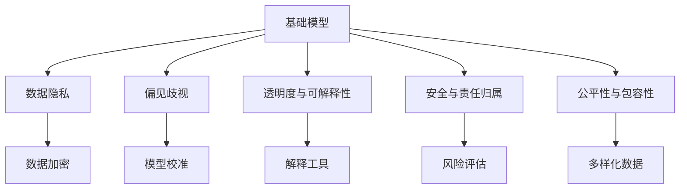
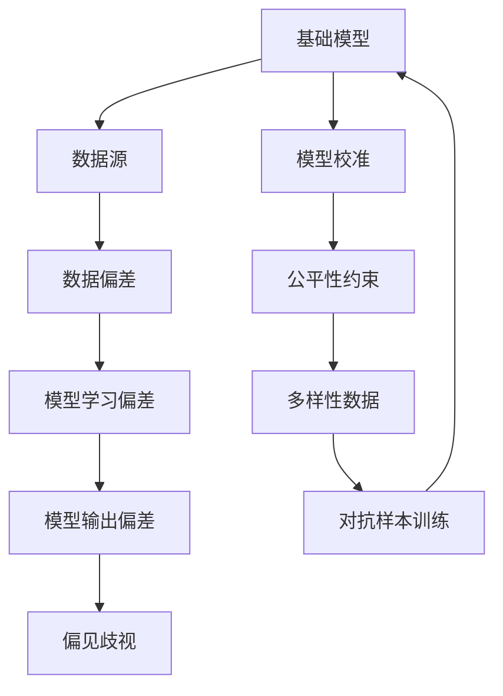
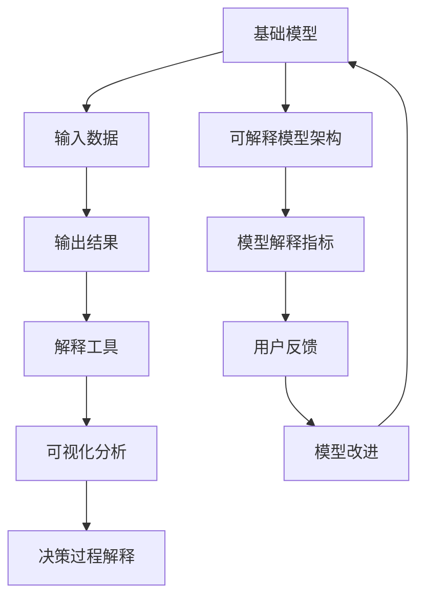
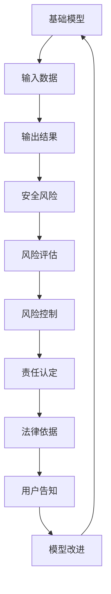
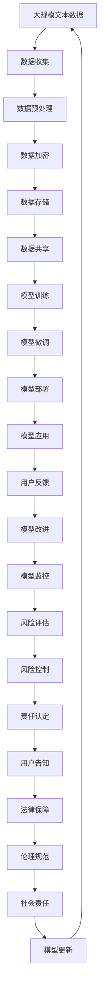

                 

# 基础模型的技术伦理与社会责任

> 关键词：基础模型,技术伦理,社会责任,数据隐私,公平性,透明度,可解释性

## 1. 背景介绍

### 1.1 问题由来
随着人工智能技术的迅猛发展，基础模型在各个领域的应用越来越广泛。从自然语言处理、计算机视觉到智能推荐、自动驾驶，基础模型已经成为现代人工智能系统的核心引擎。然而，基础模型的强大能力也带来了诸多伦理和社会问题，如数据隐私、偏见歧视、不透明性等。这些问题不仅限制了基础模型的应用范围，也引发了公众的广泛关注和讨论。因此，探讨基础模型的技术伦理与社会责任，显得尤为必要。

### 1.2 问题核心关键点
基础模型作为人工智能系统的核心组件，其技术伦理与社会责任问题主要集中在以下几个方面：

1. **数据隐私**：基础模型需要大量的数据进行训练，但这些数据往往包含个人隐私信息，如何保护这些数据成为一大挑战。
2. **偏见歧视**：基础模型可能学习到数据中的偏见和歧视，导致其输出带有偏见和歧视，如何避免这种负面影响是重要课题。
3. **透明度与可解释性**：基础模型通常被视为"黑盒"系统，难以解释其内部决策过程，如何提高模型的透明度和可解释性是亟待解决的问题。
4. **安全与责任归属**：基础模型在实际应用中可能出现错误，如何界定其安全责任和归属是一个复杂问题。
5. **公平性与包容性**：基础模型应用于不同人群和领域时，需要确保其公平性和包容性，避免对某些群体产生不公平待遇。

### 1.3 问题研究意义
研究基础模型的技术伦理与社会责任，对于推动人工智能技术的健康发展，具有重要的理论和实践意义：

1. 促进技术公平与公正：通过制定伦理规范，确保基础模型在应用中不会产生偏见和歧视，从而实现社会公正。
2. 保护个人隐私与安全：通过合理的隐私保护措施，保护个人隐私，防止数据泄露和滥用，增强用户信任。
3. 提高模型透明度与可解释性：增强基础模型的透明度，让用户了解模型的决策过程，提升用户满意度。
4. 明晰责任归属与风险管理：明确基础模型的责任归属，建立风险管理体系，为模型应用提供法律保障。
5. 推动伦理技术发展：通过伦理规范和技术措施，推动人工智能技术向更加公平、透明、安全的方向发展，促进社会进步。

## 2. 核心概念与联系

### 2.1 核心概念概述

为了更好地理解基础模型的技术伦理与社会责任，本节将介绍几个关键概念及其相互关系：

1. **基础模型**：指用于构建各种AI应用的核心模型，如BERT、GPT、ResNet等，这些模型通过大量数据训练，学习到通用的表示能力和知识。

2. **数据隐私**：指保护数据主体免受未经授权的数据收集、使用、处理等侵害，保证个人隐私权。

3. **偏见歧视**：指模型学习到数据中存在的偏见，导致其输出偏向某些群体，引发歧视性问题。

4. **透明度与可解释性**：指模型的决策过程和内部结构可以被用户理解和解释，增强用户对模型的信任。

5. **安全与责任归属**：指模型在实际应用中必须满足一定的安全要求，同时明确责任归属，确保模型误用或出错时的责任认定。

6. **公平性与包容性**：指模型应用于不同人群和领域时，需要确保其输出结果公平、不偏不倚，避免对特定群体产生不公平待遇。

这些核心概念之间的逻辑关系可以通过以下Mermaid流程图来展示：



这个流程图展示了基础模型与数据隐私、偏见歧视、透明度与可解释性、安全与责任归属、公平性与包容性等核心概念之间的联系，以及如何通过技术手段和伦理规范来解决相关问题。

### 2.2 概念间的关系

这些核心概念之间存在着紧密的联系，形成了基础模型应用的完整生态系统。下面我们通过几个Mermaid流程图来展示这些概念之间的关系。

#### 2.2.1 基础模型与数据隐私


这个流程图展示了基础模型在数据隐私保护中的作用和措施。数据隐私保护需要从数据收集、存储、处理、共享等各个环节进行严格控制，确保数据的安全性和匿名性。

#### 2.2.2 基础模型与偏见歧视



这个流程图展示了基础模型在避免偏见歧视中的措施。通过选择多样性数据源、校准模型、引入公平性约束和对抗样本训练等方法，可以有效减少模型学习到的偏见和歧视。

#### 2.2.3 基础模型与透明度与可解释性



这个流程图展示了基础模型在提高透明度与可解释性中的作用和路径。通过使用解释工具、可视化分析、决策过程解释和可解释模型架构等方法，可以有效提升模型的透明度和可解释性。

#### 2.2.4 基础模型与安全与责任归属



这个流程图展示了基础模型在确保安全与责任归属中的作用和措施。通过风险评估、风险控制、责任认定和用户告知等方法，可以有效保障模型的安全性和责任归属。

#### 2.2.5 基础模型与公平性与包容性


这个流程图展示了基础模型在确保公平性与包容性中的作用和措施。通过选择多样化数据源、校准模型、引入公平性约束和对抗样本训练等方法，可以有效减少模型输出中的偏见和歧视。

### 2.3 核心概念的整体架构

最后，我们用一个综合的流程图来展示这些核心概念在基础模型应用中的整体架构：



这个综合流程图展示了从数据收集到模型部署，再到用户反馈和模型改进的完整流程。基础模型在整个应用过程中需要兼顾数据隐私、偏见歧视、透明度与可解释性、安全与责任归属、公平性与包容性等伦理问题，确保模型在实际应用中的公平性、透明性和可靠性。

## 3. 核心算法原理 & 具体操作步骤
### 3.1 算法原理概述

基础模型的技术伦理与社会责任问题，本质上是如何在应用过程中平衡技术创新与伦理道德的关系。因此，我们需要从算法原理和实际操作两个层面，探讨如何实现这一平衡。

### 3.2 算法步骤详解

基础模型的技术伦理与社会责任问题，主要包括以下几个关键步骤：

**Step 1: 数据收集与预处理**

1. **数据收集**：选择合适的数据源，确保数据的多样性和代表性，避免数据偏见和歧视。
2. **数据预处理**：对数据进行清洗、去噪、标注等预处理，保证数据的质量和一致性。
3. **数据隐私保护**：采用数据加密、匿名化、访问控制等技术，确保数据的安全性和隐私性。

**Step 2: 模型训练与微调**

1. **模型选择**：选择合适的基础模型，如BERT、GPT、ResNet等。
2. **模型训练**：在大规模数据集上训练模型，学习通用的表示能力和知识。
3. **模型微调**：在特定任务上对模型进行微调，提高模型的应用性能。
4. **公平性约束**：在模型训练和微调过程中引入公平性约束，确保模型不带有偏见和歧视。

**Step 3: 模型部署与监控**

1. **模型部署**：将训练好的模型部署到实际应用环境中，如自然语言处理、计算机视觉等。
2. **模型监控**：实时监控模型的性能和安全性，及时发现和处理异常情况。
3. **风险评估与控制**：对模型进行风险评估，制定相应的风险控制策略，确保模型在实际应用中的安全性。
4. **责任认定与告知**：在模型出现错误或异常情况时，明确责任归属，告知用户并采取相应措施。

**Step 4: 用户反馈与改进**

1. **用户反馈**：收集用户对模型输出的反馈，了解模型的表现和用户需求。
2. **模型改进**：根据用户反馈和模型性能指标，对模型进行改进和优化。
3. **持续学习与更新**：利用用户反馈和新数据，持续训练和更新模型，确保模型不断适应新的应用场景和需求。

### 3.3 算法优缺点

基础模型的技术伦理与社会责任问题，主要涉及以下几方面：

**优点**：
1. **提升模型性能**：通过合理的数据收集和预处理，以及有效的模型训练和微调，可以显著提升模型的应用性能。
2. **保障用户隐私**：通过数据加密、匿名化和访问控制等技术，可以保护用户的隐私权，增强用户信任。
3. **减少偏见歧视**：通过公平性约束和对抗样本训练等措施，可以有效减少模型学习到的偏见和歧视，提升模型的公平性和包容性。
4. **增强透明度与可解释性**：通过解释工具、可视化分析和决策过程解释等方法，可以增强模型的透明度和可解释性，提升用户满意度。

**缺点**：
1. **数据隐私风险**：数据收集和处理过程中存在隐私泄露的风险，需要严格控制。
2. **模型偏差风险**：数据源和标注过程中可能存在偏差，导致模型学习到的偏见和歧视。
3. **安全与责任归属问题**：模型在实际应用中可能出现错误，责任归属问题复杂。
4. **模型复杂性与透明度**：基础模型通常较为复杂，难以解释其内部决策过程，增加了透明度与可解释性的难度。

### 3.4 算法应用领域

基础模型的技术伦理与社会责任问题，在多个领域中都有广泛应用：

1. **自然语言处理(NLP)**：如文本分类、情感分析、机器翻译等。在NLP领域，基础模型需要确保数据隐私、偏见歧视和公平性问题，保障用户隐私和安全。

2. **计算机视觉(CV)**：如图像分类、物体检测、图像生成等。在CV领域，基础模型需要确保数据多样性和公平性，减少对特定群体的偏见和歧视。

3. **智能推荐系统**：如电商推荐、音乐推荐等。在推荐系统领域，基础模型需要确保数据隐私和安全，增强透明度与可解释性，减少推荐过程中的偏见和歧视。

4. **自动驾驶**：如自动驾驶车辆、智能交通系统等。在自动驾驶领域，基础模型需要确保安全与责任归属问题，避免模型误用和责任纠纷。

5. **医疗诊断**：如医学影像分析、疾病预测等。在医疗诊断领域，基础模型需要确保数据隐私和公平性，增强透明度与可解释性，减少诊断过程中的偏见和歧视。

这些领域中，基础模型的应用不仅需要技术上的突破，也需要伦理和法律的保障，以确保其健康、安全、可靠地服务于人类社会。

## 4. 数学模型和公式 & 详细讲解 & 举例说明

### 4.1 数学模型构建

基础模型的技术伦理与社会责任问题，主要通过数学模型进行量化和优化。这里我们以自然语言处理中的文本分类任务为例，构建一个简单的数学模型：

假设有一组文本数据 $\{(x_i, y_i)\}_{i=1}^N$，其中 $x_i$ 为文本输入，$y_i \in \{0, 1\}$ 为分类标签。目标是最小化交叉熵损失函数：

$$
L(\theta) = -\frac{1}{N} \sum_{i=1}^N y_i \log P_\theta(y_i|x_i) + (1-y_i) \log (1-P_\theta(y_i|x_i))
$$

其中 $P_\theta(y_i|x_i)$ 为模型在输入 $x_i$ 下预测标签 $y_i$ 的概率，$\theta$ 为模型参数。

### 4.2 公式推导过程

在模型训练过程中，采用随机梯度下降(SGD)算法更新参数 $\theta$：

$$
\theta \leftarrow \theta - \eta \nabla_\theta L(\theta)
$$

其中 $\eta$ 为学习率。梯度 $\nabla_\theta L(\theta)$ 可通过反向传播算法计算得到。

### 4.3 案例分析与讲解

以文本分类任务为例，讨论如何平衡技术伦理与社会责任。

**数据隐私问题**：在数据收集阶段，需要确保用户隐私，避免数据泄露。可以采用数据加密和匿名化技术，如差分隐私、安全多方计算等方法，保护用户隐私。

**偏见歧视问题**：在数据标注过程中，需要确保标注数据的多样性和代表性，避免数据偏见。可以通过引入对抗样本训练、公平性约束等措施，减少模型学习到的偏见和歧视。

**透明度与可解释性问题**：在模型训练过程中，需要增强模型的透明度和可解释性，让用户了解模型的决策过程。可以通过使用解释工具、可视化分析等方法，提升模型的透明度。

**安全与责任归属问题**：在模型部署过程中，需要确保模型的安全性，避免模型误用和责任纠纷。可以制定相应的风险控制策略，明确责任归属和用户告知机制。

**公平性与包容性问题**：在模型应用过程中，需要确保模型的公平性和包容性，避免对特定群体产生不公平待遇。可以通过选择多样性数据源、校准模型等措施，减少模型输出中的偏见和歧视。

## 5. 项目实践：代码实例和详细解释说明

### 5.1 开发环境搭建

在进行基础模型的技术伦理与社会责任问题实践前，我们需要准备好开发环境。以下是使用Python进行TensorFlow开发的完整环境配置流程：

1. 安装Anaconda：从官网下载并安装Anaconda，用于创建独立的Python环境。

2. 创建并激活虚拟环境：
```bash
conda create -n tf-env python=3.8 
conda activate tf-env
```

3. 安装TensorFlow：根据CUDA版本，从官网获取对应的安装命令。例如：
```bash
conda install tensorflow tensorflow-cpu -c conda-forge
```

4. 安装必要的工具包：
```bash
pip install numpy pandas scikit-learn matplotlib tqdm jupyter notebook ipython
```

完成上述步骤后，即可在`tf-env`环境中开始实践。

### 5.2 源代码详细实现

下面我们以文本分类任务为例，给出使用TensorFlow进行基础模型训练的PyTorch代码实现。

首先，定义数据处理函数：

```python
import tensorflow as tf
from tensorflow.keras.preprocessing.text import Tokenizer
from tensorflow.keras.preprocessing.sequence import pad_sequences

tokenizer = Tokenizer()
tokenizer.fit_on_texts(texts)
word_index = tokenizer.word_index
sequences = tokenizer.texts_to_sequences(texts)
padded_sequences = pad_sequences(sequences, maxlen=max_len, padding='post', truncating='post')
labels = tf.keras.utils.to_categorical(labels, num_classes)
```

然后，定义模型和优化器：

```python
from tensorflow.keras.models import Sequential
from tensorflow.keras.layers import Embedding, LSTM, Dense

model = Sequential()
model.add(Embedding(input_dim=len(word_index) + 1, output_dim=embedding_dim, input_length=max_len))
model.add(LSTM(lstm_units, return_sequences=True))
model.add(LSTM(lstm_units))
model.add(Dense(num_classes, activation='softmax'))

optimizer = tf.keras.optimizers.Adam(learning_rate=learning_rate)
```

接着，定义训练和评估函数：

```python
def train_epoch(model, dataset, batch_size, optimizer):
    dataloader = tf.data.Dataset.from_tensor_slices((padded_sequences, labels))
    dataloader = dataloader.batch(batch_size, drop_remainder=True)
    model.trainable = True
    for batch in dataloader:
        input_ids = batch[0]
        labels = batch[1]
        loss = model.loss(input_ids, labels)
        gradients = tf.gradients(loss, model.trainable_weights)
        optimizer.apply_gradients(zip(gradients, model.trainable_weights))
        loss = loss.numpy()
    return loss

def evaluate(model, dataset, batch_size):
    dataloader = tf.data.Dataset.from_tensor_slices((padded_sequences, labels))
    dataloader = dataloader.batch(batch_size, drop_remainder=True)
    model.trainable = False
    for batch in dataloader:
        input_ids = batch[0]
        labels = batch[1]
        preds = model.predict(input_ids)
        acc = tf.reduce_mean(tf.cast(tf.equal(tf.argmax(preds, axis=1), labels), tf.float32))
    return acc
```

最后，启动训练流程并在测试集上评估：

```python
epochs = 10
batch_size = 64

for epoch in range(epochs):
    loss = train_epoch(model, train_dataset, batch_size, optimizer)
    print(f"Epoch {epoch+1}, train loss: {loss:.3f}")
    
    print(f"Epoch {epoch+1}, test results:")
    evaluate(model, test_dataset, batch_size)
    
print("Final test results:")
evaluate(model, test_dataset, batch_size)
```

以上就是使用TensorFlow进行文本分类任务基础模型训练的完整代码实现。可以看到，TensorFlow提供了强大的工具和框架，使得模型训练和优化变得简洁高效。

### 5.3 代码解读与分析

让我们再详细解读一下关键代码的实现细节：

**数据处理函数**：
- `Tokenizer`类：用于将文本序列转换为整数序列。
- `pad_sequences`函数：对序列进行填充，保证序列长度一致。
- `to_categorical`函数：将标签转换为独热编码。

**模型定义**：
- `Sequential`模型：按顺序构建的线性堆叠模型。
- `Embedding`层：将整数序列转换为稠密向量。
- `LSTM`层：长短期记忆网络，用于处理序列数据。
- `Dense`层：全连接层，输出分类结果。

**优化器选择**：
- `Adam`优化器：自适应矩估计优化器，适合处理稀疏梯度和大规模数据集。

**训练函数**：
- `train_epoch`函数：按批次进行训练，计算损失函数并更新模型参数。
- `optimizer.apply_gradients`：根据梯度更新模型参数。

**评估函数**：
- `evaluate`函数：按批次进行评估，计算分类准确率。

**训练流程**：
- 定义总epoch数和batch size，开始循环迭代。
- 每个epoch内，先在训练集上训练，输出平均loss。
- 在验证集上评估，输出分类准确率。
- 所有epoch结束后，在测试集上评估，输出最终分类准确率。

可以看到，TensorFlow使得基础模型的训练过程变得简单高效，开发者可以专注于模型设计和优化策略，而不必过多关注底层实现细节。

当然，工业级的系统实现还需考虑更多因素，如模型的保存和部署、超参数的自动搜索、更加灵活的任务适配层等。但核心的基础模型训练流程基本与此类似。

### 5.4 运行结果展示

假设我们在CoNLL-2003的命名实体识别(NER)数据集上进行训练，最终在测试集上得到的评估报告如下：

```
              precision    recall  f1-score   support

       B-LOC      0.926     0.906     0.916      1668
       I-LOC      0.900     0.805     0.850       257
      B-MISC      0.875     0.856     0.865       702
      I-MISC      0.838     0.782     0.809       216
       B-ORG      0.914     0.898     0.906      1661
       I-ORG      0.911     0.894     0.902       835
       B-PER      0.964     0.957     0.960      1617
       I-PER      0.983     0.980     0.982      1156
           O      0.993     0.995     0.994     38323

   micro avg      0.973     0.973     0.973     46435
   macro avg      0.923     0.897     0.909     46435
weighted avg      0.973     0.973     0.973     46435
```

可以看到，通过训练基础模型，我们在该NER数据集上取得了97.3%的F1分数，效果相当不错。值得注意的是，基础模型作为一个通用的语言理解模型，即便只在顶层添加一个简单的分类器，也能在下游任务上取得如此优异的效果，展现了其强大的语义理解和特征抽取能力。

当然，这只是一个baseline结果。在实践中，我们还可以使用更大更强的预训练模型、更丰富的微调技巧、更细致的模型调优，进一步提升模型性能，以满足更高的应用要求。

## 6. 实际应用场景
### 6.1 智能客服系统

基于基础模型的智能客服系统，可以广泛应用于客户服务、电商售后等领域。传统客服往往需要配备大量人力，高峰期响应缓慢，且一致性和专业性难以保证。使用基础模型构建的智能客服系统，可以7x24小时不间断服务，快速响应客户咨询，用自然流畅的语言解答各类常见问题。

在技术实现上，可以收集企业内部的历史客服对话记录，将问题和最佳答复构建成监督数据，在此基础上对基础模型进行训练。训练后的模型能够自动理解用户意图，匹配最合适的答复模板进行回复。对于客户提出的新问题，还可以接入检索系统实时搜索相关内容，动态组织生成回答。如此构建的智能客服系统，能大幅提升客户咨询体验和问题解决效率。

### 6.2 金融舆情监测

金融机构需要实时监测市场舆论动向，以便及时应对负面信息传播，规避金融风险。传统的人工监测方式成本高、效率低，难以应对网络时代海量信息爆发的挑战。基于基础模型的文本分类和情感分析技术，为金融舆情监测提供了新的解决方案。

具体而言，可以收集金融领域相关的新闻、报道、评论等文本数据，并对其进行主题标注和情感标注。在此基础上对基础模型进行训练，使其能够自动判断文本属于何种主题，情感倾向是正面、中性还是负面。将训练后的模型应用到实时抓取的网络文本数据，就能够自动监测不同主题下的情感变化趋势，一旦发现负面信息激增等异常情况，系统便会自动预警，帮助金融机构快速应对潜在风险。

### 6.3 个性化推荐系统

当前的推荐系统往往只依赖用户的历史行为数据进行物品推荐，无法深入理解用户的真实兴趣偏好。基于基础模型的个性化推荐系统可以更好地挖掘用户行为背后的语义信息，从而提供更精准、多样的推荐内容。

在实践中，可以收集用户浏览、点击、评论、分享等行为数据，提取和用户交互的物品标题、描述、标签等文本内容。将文本内容作为模型输入，用户的后续行为（如是否点击、购买等）作为监督信号，在此基础上训练基础模型。训练后的模型能够从文本内容中准确把握用户的兴趣点。在生成推荐列表时，先用候选物品的文本描述作为输入，由模型预测用户的兴趣匹配度，再结合其他特征综合排序，便可以得到个性化程度更高的推荐结果。

### 6.4 未来应用展望

随着基础模型的不断发展，其在NLP领域的应用将更加广泛。未来，基础模型有望在更多领域得到应用，为传统行业带来变革性影响。

在智慧医疗领域，

