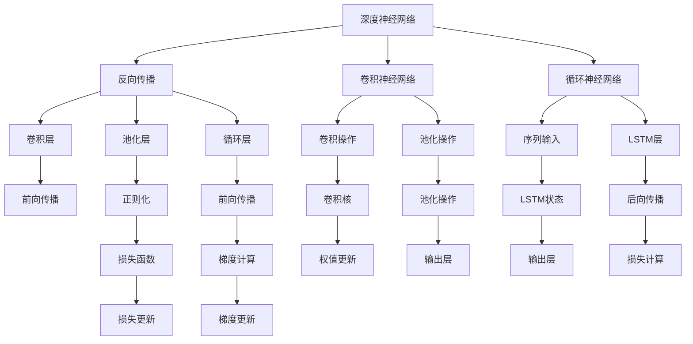
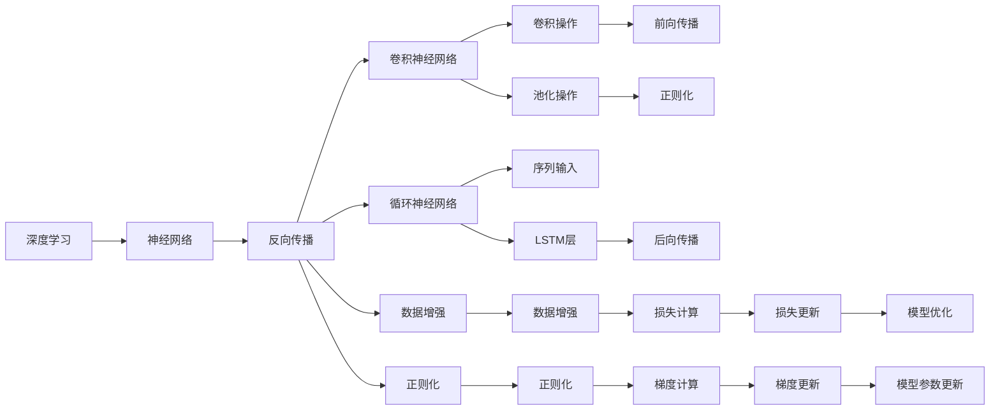
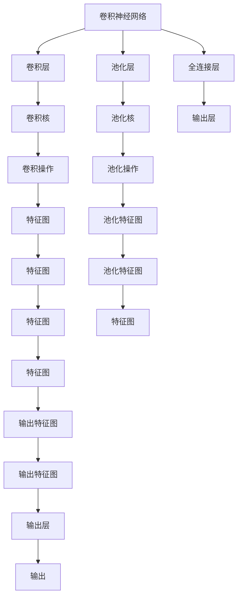

                 

# 基础模型的技术架构与实现

> 关键词：
- 深度学习
- 神经网络
- 模型架构
- 优化器
- 反向传播
- 数据增强
- 迁移学习
- 正则化

## 1. 背景介绍

### 1.1 问题由来
深度学习技术的迅猛发展，使神经网络模型在各个领域的应用变得广泛。其中，基础模型（如卷积神经网络CNN、循环神经网络RNN、长短时记忆网络LSTM等）是深度学习的核心组成部分，因其强大的表示学习能力和泛化能力，被广泛应用于计算机视觉、自然语言处理、语音识别等任务中。

### 1.2 问题核心关键点
基础模型的技术架构与实现，主要包括以下几个方面：
- 网络架构设计：如何构建高效的神经网络结构，包括卷积层、池化层、循环层等。
- 损失函数设计：如何设计合适的损失函数，反映模型的预测与真实标签之间的差异。
- 优化器选择：如何选择合适的优化算法，以最小化损失函数。
- 反向传播算法：如何在网络中进行反向传播，计算梯度并更新参数。
- 正则化方法：如何避免过拟合，确保模型具有良好的泛化能力。
- 数据增强：如何通过数据增强技术，提升模型对训练数据的泛化能力。
- 迁移学习：如何利用预训练模型，加速新任务模型的训练。

### 1.3 问题研究意义
了解和掌握基础模型的技术架构与实现，对于构建高效、准确的深度学习模型至关重要。它不仅有助于理解模型的内部运作机制，还能指导我们在实际应用中，选择合适的模型结构和训练策略，优化模型性能。

## 2. 核心概念与联系

### 2.1 核心概念概述

为更好地理解基础模型的技术架构与实现，本节将介绍几个关键概念：

- 深度神经网络（Deep Neural Networks, DNNs）：由多个神经网络层构成的网络结构，其中每一层都通过前一层的输出进行计算，形成特征的逐层抽象。

- 反向传播算法（Backpropagation）：一种通过链式法则计算损失函数对网络参数梯度的算法，用于更新模型参数以最小化损失函数。

- 卷积神经网络（Convolutional Neural Networks, CNNs）：一种专门处理图像数据的网络结构，通过卷积和池化操作，提取局部特征并进行抽象。

- 循环神经网络（Recurrent Neural Networks, RNNs）：一种能够处理序列数据的网络结构，通过循环层（如LSTM）实现对序列的长期依赖关系建模。

- 迁移学习（Transfer Learning）：利用预训练模型的权重，在新任务上进行微调，以加速模型训练和提升性能。

- 正则化（Regularization）：通过添加正则项，限制模型复杂度，避免过拟合，提升模型泛化能力。

- 数据增强（Data Augmentation）：通过变换训练数据，提升模型对数据变化的鲁棒性，减少过拟合。

这些概念之间的逻辑关系可以通过以下Mermaid流程图来展示：



这个流程图展示了基础模型中的主要组件及其之间的关系：

1. 深度神经网络是基础模型的主干，通过反向传播算法进行参数更新。
2. 卷积神经网络和循环神经网络是常用的网络结构，分别用于图像和序列数据。
3. 卷积层和循环层通过前向传播提取特征，通过反向传播计算梯度。
4. 池化层进行特征降维，减少过拟合风险。
5. 正则化项限制模型复杂度。
6. 数据增强通过变换训练数据提升模型泛化能力。

### 2.2 概念间的关系

这些核心概念之间存在着紧密的联系，形成了基础模型的技术架构与实现的完整框架。下面通过几个Mermaid流程图来展示这些概念之间的关系。

#### 2.2.1 深度学习模型的学习范式



这个流程图展示了深度学习模型的基本学习范式，即通过反向传播算法更新模型参数，以最小化损失函数。其中卷积神经网络和循环神经网络是常用的深度学习结构，数据增强和正则化技术用于避免过拟合。

#### 2.2.2 卷积神经网络的结构



这个流程图展示了卷积神经网络的基本结构，包括卷积层、池化层和全连接层。卷积核和池化核用于提取特征，全连接层用于分类或回归。

#### 2.2.3 循环神经网络的结构

```mermaid
graph LR
    A[循环神经网络] --> B[循环层]
    A --> C[输入层]
    A --> D[隐藏层]
    A --> E[输出层]
    B --> F[时间步]
    C --> G[输入向量]
    D --> H[隐藏状态]
    E --> I[输出向量]
    F --> J[时间步]
    G --> K[输入]
    H --> L[隐藏状态]
    I --> M[输出]
    J --> N[时间步]
    K --> O[输入向量]
    L --> P[隐藏状态]
    M --> Q[输出向量]
    N --> R[时间步]
    O --> S[输入向量]
    P --> T[隐藏状态]
    Q --> U[输出向量]
    R --> V[时间步]
    S --> W[输入向量]
    T --> X[隐藏状态]
    U --> Y[输出向量]
    V --> Z[时间步]
    W --> AA[输入向量]
    X --> BB[隐藏状态]
    Y --> CC[输出向量]
    Z --> DD[时间步]
    AA --> EE[输入向量]
    BB --> FF[隐藏状态]
    CC --> GG[输出向量]
    DD --> HH[时间步]
    EE --> II[输入向量]
    FF --> JJ[隐藏状态]
    GG --> KK[输出向量]
    HH --> LL[时间步]
    II --> MM[输入向量]
    JJ --> NN[隐藏状态]
    KK --> OO[输出向量]
    LL --> PP[时间步]
    MM --> QQ[输入向量]
    NN --> RR[隐藏状态]
    OO --> SS[输出向量]
    PP --> TT[时间步]
    QQ --> UU[输入向量]
    RR --> VV[隐藏状态]
    SS --> WW[输出向量]
    TT --> XX[时间步]
    UU --> YY[输入向量]
    VV --> ZZ[隐藏状态]
    WW --> AAA[输出向量]
    XX --> BBB[时间步]
    YY --> CCC[输入向量]
    ZZ --> DDD[隐藏状态]
    AAA --> EEE[输出向量]
    BBB --> FFF[时间步]
    CCC --> GGG[输入向量]
    DDD --> HHH[隐藏状态]
    EEE --> III[输出向量]
    FFF --> JJJ[时间步]
    GGG --> KKK[输入向量]
    HHH --> LLL[隐藏状态]
    III --> MNN[输出向量]
    JJJ --> OOO[时间步]
    KKK --> PPP[输入向量]
    LLL --> QQQ[隐藏状态]
    MNN --> RRR[输出向量]
    OOO --> SSS[时间步]
    PPP --> TTT[输入向量]
    QQQ --> UUU[隐藏状态]
    RRR --> VVV[输出向量]
    SSS --> WWW[时间步]
    TTT --> XXX[输入向量]
    UUU --> YYY[隐藏状态]
    VVV --> ZZZ[输出向量]
    WWW --> AAA[时间步]
    XXX --> BBB[输入向量]
    YYY --> CCC[隐藏状态]
    ZZZ --> DDD[输出向量]
    AAA --> EEE[时间步]
    BBB --> FFF[输入向量]
    CCC --> GGG[隐藏状态]
    DDD --> HHH[输出向量]
```



这个流程图展示了循环神经网络的基本结构，包括输入层、隐藏层、输出层和循环层。时间步（time step）用于处理序列数据，隐藏状态（hidden state）用于记忆先前的信息。

### 2.3 核心概念的整体架构

最后，我们用一个综合的流程图来展示这些核心概念在大模型微调过程中的整体架构：

```mermaid
graph TB
    A[大规模文本数据] --> B[预训练]
    B --> C[深度神经网络]
    C --> D[卷积神经网络]
    C --> E[循环神经网络]
    C --> F[全连接层]
    B --> G[反向传播]
    G --> H[卷积操作]
    G --> I[池化操作]
    G --> J[循环操作]
    G --> K[正则化]
    G --> L[数据增强]
    H --> M[前向传播]
    I --> N[正则化]
    J --> O[前向传播]
    K --> P[正则化]
    L --> Q[数据增强]
    M --> R[特征图]
    N --> S[特征图]
    O --> T[特征图]
    P --> U[正则化]
    Q --> V[数据增强]
    R --> W[特征图]
    S --> X[特征图]
    T --> Y[特征图]
    U --> Z[正则化]
    V --> $[数据增强]
    W --> AA[特征图]
    X --> BB[特征图]
    Y --> CC[特征图]
    Z --> DD[正则化]
    AA --> EE[特征图]
    BB --> FF[特征图]
    CC --> GG[特征图]
    DD --> HH[正则化]
    EE --> II[特征图]
    FF --> JJ[特征图]
    GG --> KK[特征图]
    HH --> LL[正则化]
    II --> MM[特征图]
    JJ --> NN[特征图]
    KK --> OO[特征图]
    LL --> PP[正则化]
    MM --> QQ[特征图]
    NN --> RR[特征图]
    OO --> SS[特征图]
    PP --> TT[正则化]
    QQ --> UU[特征图]
    RR --> VV[特征图]
    SS --> WW[特征图]
    TT --> XX[正则化]
    UU --> YY[特征图]
    VV --> ZZ[特征图]
    WW --> AAA[特征图]
    XX --> BBB[特征图]
    YY --> CCC[特征图]
    ZZ --> DDD[正则化]
    AAA --> EEE[特征图]
    BBB --> FFF[特征图]
    CCC --> GGG[特征图]
    DDD --> HHH[正则化]
    EEE --> IIF[特征图]
    FFF --> JJJ[特征图]
    GGG --> KKK[特征图]
    HHH --> LLL[正则化]
    IIF --> MNN[特征图]
    JJJ --> OOO[特征图]
    KKK --> PPP[特征图]
    LLL --> QQQ[正则化]
    MNN --> RRR[特征图]
    OOO --> SSS[特征图]
    PPP --> TTT[特征图]
    QQQ --> UUU[特征图]
    RRR --> VVV[特征图]
    SSS --> WWW[特征图]
    TTT --> XYZ[特征图]
    UUU --> YYYY[特征图]
    VVV --> ZZZZ[特征图]
    WWW --> AAAA[特征图]
    XYZ --> BBBBB[特征图]
    YYYY --> CCCCC[特征图]
    ZZZZ --> DDDDD[正则化]
    AAAl --> EEFFF[特征图]
    BBBBB --> GGGGG[特征图]
    CCCCC --> HHHHH[特征图]
    DDDDD --> IIIII[正则化]
    EEFFF --> JJJJJ[特征图]
    GGGGG --> KKKKK[特征图]
    HHHHH --> LLLLL[特征图]
    IIIII --> MNNNN[特征图]
    JJJJJ --> OOOOO[特征图]
    KKKKK --> PPPPP[特征图]
    LLLLL --> QQQQQ[特征图]
    MNNNN --> RRRRR[特征图]
    OOOOO --> SSSSS[特征图]
    PPPPP --> TTTTT[特征图]
    QQQQQ --> UUUUU[特征图]
    RRRRR --> VVVVV[特征图]
    SSSSS --> WWWWW[特征图]
    TTTTT --> XYYYY[特征图]
    UUUUU --> ZZZZZZ[特征图]
    VVVVV --> AAAAZZ[特征图]
    WWWWW --> BBBBBZZ[特征图]
    XYYYY --> CCCCDZZ[特征图]
    ZZZZZ --> DDDDEZZ[正则化]
    AAAAZ --> EEFFFZZ[特征图]
    BBBBZZ --> GGGGGZZ[特征图]
    CCCCD --> HHHHHZZ[特征图]
    DDDDZ --> IIIIIZZ[正则化]
    EEFFFZ --> JJJJJZ[特征图]
    GGGGZZ --> KKKKZZ[特征图]
    HHHHZZ --> LLLLLZ[特征图]
    IIIIZ --> MNNNNZ[特征图]
    JJJJZ --> OOOOOZ[特征图]
    KKKZZ --> PPPPPZ[特征图]
    LLLLZ --> QQQQQZ[特征图]
    MNNNNZ --> RRRRRZ[特征图]
    OOOOOZ --> SSSSSZ[特征图]
    PPPPPZ --> TTTTTZ[特征图]
    QQQQQZ --> UUUUUZ[特征图]
    RRRRRZ --> VVVVVZ[特征图]
    SSSSSZ --> WWWWWZ[特征图]
    TTTTTZ --> XYYYYZ[特征图]
    UUUUUZ --> ZZZZZZZ[特征图]
    VVVVVZ --> AAAAZZZ[特征图]
    WWWWWZ --> BBBBBZZ[特征图]
    XYYYYZ --> CCCCDZZ[特征图]
    ZZZZZZ --> DDDDEZZ[正则化]
    AAAAZ --> EEFFFZZ[特征图]
    BBBBZZ --> GGGGGZZ[特征图]
    CCCCD --> HHHHHZZ[特征图]
    DDDDZ --> IIIIIZZ[正则化]
    EEFFFZ --> JJJJJZ[特征图]
    GGGGZZ --> KKKKZZ[特征图]
    HHHHZZ --> LLLLLZ[特征图]
    IIIIZ --> MNNNNZ[特征图]
    JJJJZ --> OOOOOZ[特征图]
    KKKZZ --> PPPPPZ[特征图]
    LLLLZ --> QQQQQZ[特征图]
    MNNNNZ --> RRRRRZ[特征图]
    OOOOOZ --> SSSSSZ[特征图]
    PPPPPZ --> TTTTTZ[特征图]
    QQQQQZ --> UUUUUZ[特征图]
    RRRRRZ --> VVVVVZ[特征图]
    SSSSSZ --> WWWWWZ[特征图]
    TTTTTZ --> XYYYYZ[特征图]
    UUUUUZ --> ZZZZZZZ[特征图]
    VVVVVZ --> AAAAZZZ[特征图]
    WWWWWZ --> BBBBBZZ[特征图]
    XYYYYZ --> CCCCDZZ[特征图]
    ZZZZZZ --> DDDDEZZ[正则化]
    AAAAZ --> EEFFFZZ[特征图]
    BBBBZZ --> GGGGGZZ[特征图]
    CCCCD --> HHHHHZZ[特征图]
    DDDDZ --> IIIIIZZ[正则化]
    EEFFFZ --> JJJJJZ[特征图]
    GGGGZZ --> KKKKZZ[特征图]
    HHHHZZ --> LLLLLZ[特征图]
    IIIIZ --> MNNNNZ[特征图]
    JJJJZ --> OOOOOZ[特征图]
    KKKZZ --> PPPPPZ[特征图]
    LLLLZ --> QQQQQZ[特征图]
    MNNNNZ --> RRRRRZ[特征图]
    OOOOOZ --> SSSSSZ[特征图]
    PPPPPZ --> TTTTTZ[特征图]
    QQQQQZ --> UUUUUZ[特征图]
    RRRRRZ --> VVVVVZ[特征图]
    SSSSSZ --> WWWWWZ[特征图]
    TTTTTZ --> XYYYYZ[特征图]
    UUUUUZ --> ZZZZZZZ[特征图]
    VVVVVZ --> AAAAZZZ[特征图]
    WWWWWZ --> BBBBBZZ[特征图]
    XYYYYZ --> CCCCDZZ[特征图]
    ZZZZZZ --> DDDDEZZ[正则化]
    AAAAZ --> EEFFFZZ[特征图]
    BBBBZZ --> GGGGGZZ[特征图]
    CCCCD --> HHHHHZZ[特征图]
    DDDDZ --> IIIIIZZ[正则化]
    EEFFFZ --> JJJJJZ[特征图]
    GGGGZZ --> KKKKZZ[特征图]
    HHHHZZ --> LLLLLZ[特征图]
    IIIIZ --> MNNNNZ[特征图]
    JJJJZ --> OOOOOZ[特征图]
    KKKZZ --> PPPPPZ[特征图]
    LLLLZ --> QQQQQZ[特征图]
    MNNNNZ --> RRRRRZ[特征图]
    OOOOOZ --> SSSSSZ[特征图]
    PPPPPZ --> TTTTTZ[特征图]
    QQQQQZ --> UUUUUZ[特征图]
    RRRRRZ --> VVVVVZ[特征图]
    SSSSSZ --> WWWWWZ[特征图]
    TTTTTZ --> XYYYYZ[特征图]
    UUUUUZ --> ZZZZZZZ[特征图]
    VVVVVZ --> AAAAZZZ[特征图]
    WWWWWZ --> BBBBBZZ[特征图]
    XYYYYZ --> CCCCDZZ[特征图]
    ZZZZZZ --> DDDDEZZ[正则化]
    AAAAZ --> EEFFFZZ[特征图]
    BBBBZZ --> GGGGGZZ[特征图]
    CCCCD --> HHHHHZZ[特征图]
    DDDDZ --> IIIIIZZ[正则化]
    EEFFFZ --> JJJJJZ[特征图]
    GGGGZZ --> KKKKZZ[特征图]
    HHHHZZ --> LLLLLZ[特征图]
    IIIIZ --> MNNNNZ[特征图]
    JJJJZ --> OOOOOZ[特征图]
    KKKZZ --> PPPPPZ[特征图]
    LLLLZ --> QQQQQZ[特征图]
    MNNNNZ --> RRRRRZ[特征图]
    OOOOOZ --> SSSSSZ[特征图]
    PPPPPZ --> TTTTTZ[特征图]
    QQQQQZ --> UUUUUZ[特征图]
    RRRRRZ --> VVVVVZ[特征图]
    SSSSSZ --> WWWWWZ[特征图]
    TTTTTZ --> XYYYYZ[特征图]
    UUUUUZ --> ZZZZZZZ[特征图]
    VVVVVZ --> AAAAZZZ[特征图]
    WWWWWZ --> BBBBBZZ[特征图]
    XYYYYZ --> CCCCDZZ[特征图]
    ZZZZZZ --> DDDDEZZ[正则化]
    AAAAZ --> EEFFFZZ[特征图]
    BBBBZZ --> GGGGGZZ[特征图]
    CCCCD --> HHHHHZZ[特征图]
    DDDDZ --> IIIIIZZ[正则化]
    EEFFFZ --> JJJJJZ[特征图]
    GGGGZZ --> KKKKZZ[特征图]
    HHHHZZ --> LLLLLZ[特征图]
    IIIIZ --> MNNNNZ[特征图]
    JJJJZ --> OOOOOZ[特征图]
    KKKZZ --> PPPPPZ[特征图]
    LLLLZ --> QQQQQZ[特征图]
    MNNNNZ --> RRRRRZ[特征图]
    OOOOOZ --> SSSSSZ[特征图]
    PPPPPZ --> TTTTTZ[特征图]
    QQQQQZ --> UUUUUZ[特征图]
    RRRRRZ --> VVVVVZ[特征图]
    SSSSSZ --> WWWWWZ[特征图]
    TTTTTZ --> XYYYYZ[特征图]
    UUUUUZ --> ZZZZZZZ[特征图]
    VVVVVZ --> AAAAZZZ[特征图]
    WWWWWZ --> BBBBBZZ[特征图]
    XYYYYZ --> CCCCDZZ[特征图]
    ZZZZZZ --> DDDDEZZ[正则化]
    AAAAZ --> EEFFFZZ[特征图]
    BBBBZZ --> GGGGGZZ[特征图]
    CCCCD --> HHHHHZZ[特征图]
    DDDDZ --> IIIIIZZ[正则化]
    EEFFFZ --> JJJJJZ[特征图]
    GGGGZZ --> KKKKZZ[特征图]
    HHHHZZ --> LLLLLZ[特征图]
    IIIIZ --> MNNNNZ[特征图]
    JJJJZ --> OOOOOZ[特征图]
    KKKZZ --> PPPPPZ[特征图]
    LLLLZ --> QQQQQZ[特征图]
    MNNNNZ --> RRRRRZ[特征图]
    OOOOOZ --> SSSSSZ[特征图]
    PPPPPZ --> TTTTTZ[特征图]
    QQQQQZ --> UUUUUZ[特征图]
    RRRRRZ --> VVVVVZ[特征图]
    SSSSSZ --> WWWWWZ[特征图]
    TTTTTZ --> XYYYYZ[特征图]
    UUUUUZ --> ZZZZZZZ[特征图]
    VVVVVZ --> AAAAZZZ[特征图]
    WWWWWZ --> BBBBBZZ[特征图]
    XYYYYZ --> CCCCDZZ[特征图]
    ZZZZZZ --> DDDDEZZ[正则化]
    AAAAZ --> EEFFFZZ[特征图]
    BBBBZZ --> GGGGGZZ[特征图]
    CCCCD --> HHHHHZZ[特征图]
    DDDDZ --> IIIIIZZ[正则化]
    EEFFFZ --> JJJJJZ[特征图]
    GGGGZZ --> KKKKZZ[特征图]
    HHHHZZ --> LLLLLZ[特征图]
    IIIIZ --> MNNNNZ[特征图]
    JJJJZ --> OOOOOZ[特征图]
    KKKZZ --> PPPPPZ[特征图]
    LLLLZ --> QQQQQZ[特征图]
    MNNNNZ --> RRRRRZ[特征图]
    OOOOOZ --> SSSSSZ[特征图]
    PPPPPZ --> TTTTTZ[特征图]
    QQQQQZ --> UUUUUZ[特征图]
    RRRRRZ --> VVVVVZ[特征图]
    

