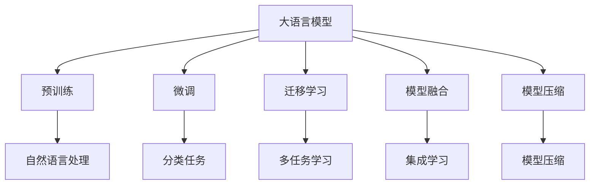

                 

# 基础模型的技术能力与应用

> 关键词：
1. 大语言模型
2. 自然语言处理(NLP)
3. 深度学习
4. 迁移学习
5. 模型压缩
6. 模型融合
7. 模型微调

## 1. 背景介绍

### 1.1 问题由来

近年来，随着深度学习技术的快速发展，人工智能在各个领域取得了显著的进展。其中，自然语言处理(Natural Language Processing, NLP)是人工智能领域的重要分支，其研究关注如何让计算机理解和处理人类语言。

大语言模型(Large Language Models, LLMs)的出现，使得NLP领域的研究向前迈进了一大步。这种基于深度学习的大模型，通过在大规模语料上进行预训练，学习到了丰富的语言知识和常识，能够在各种NLP任务上取得优异的表现。例如，BERT、GPT-2、GPT-3等预训练语言模型，已经在文本分类、命名实体识别、问答系统、机器翻译等任务上刷新了多项最先进的结果。

尽管大语言模型在各种NLP任务上取得了显著的进展，但在实际应用中，预训练模型通常需要大量的标注数据进行微调，这在数据稀缺的情况下成为一大瓶颈。同时，大模型的存储和推理效率也成为了一个需要解决的问题。

本文将从基础模型的技术能力出发，探讨大语言模型在NLP任务上的应用，以及如何通过技术手段提高模型的性能和效率。

## 2. 核心概念与联系

### 2.1 核心概念概述

在深入探讨大语言模型的技术能力之前，需要先了解几个关键概念：

- **大语言模型**：指的是通过深度学习技术，在大规模语料上预训练得到的大型神经网络模型。这些模型能够理解自然语言的语义和语法，并且能够生成符合语境的自然语言文本。

- **自然语言处理**：指计算机处理、理解和生成自然语言的技术。NLP技术广泛应用于机器翻译、语音识别、问答系统、情感分析等任务。

- **深度学习**：一种模拟人脑神经网络工作方式的机器学习方法。深度学习通过多层神经网络学习数据的表示，从而实现复杂的模式识别和预测任务。

- **迁移学习**：指将一个领域学习到的知识，迁移应用到另一个不同但相关的领域。在大语言模型的应用中，预训练模型的知识可以被迁移到各种下游任务上。

- **模型压缩**：指通过一系列的技术手段，减少模型的参数数量和计算复杂度，从而提高模型在实际部署中的效率和性能。

- **模型融合**：指将多个模型进行组合，形成更加强大的集成模型。在大语言模型的应用中，不同模型之间的组合可以提高模型的准确性和鲁棒性。

- **模型微调**：指在预训练模型的基础上，使用下游任务的少量标注数据，通过有监督学习优化模型在特定任务上的性能。微调可以提高模型在特定任务上的精度，并减少计算成本。

### 2.2 核心概念之间的关系

这些核心概念之间存在着紧密的联系，形成了大语言模型在NLP任务上的应用框架。以下通过几个Mermaid流程图来展示这些概念之间的关系：



这个流程图展示了从预训练到微调，再到融合和压缩的完整过程。大语言模型首先在大规模语料上进行预训练，然后通过微调适应特定的NLP任务，通过融合组合多个模型以提高准确性，并通过压缩减少计算复杂度。

## 3. 核心算法原理 & 具体操作步骤

### 3.1 算法原理概述

大语言模型的核心算法包括自回归模型和自编码模型。其中，自回归模型（如GPT）通过在训练过程中逐个预测下一个单词，学习单词间的序列关系；自编码模型（如BERT）通过在训练过程中最大化预测概率，学习单词和句子级别的表示。

这些模型通过在大规模语料上进行预训练，学习到了丰富的语言知识和常识。在实际应用中，大语言模型通常需要与下游任务的标注数据进行微调，以适应特定的NLP任务。

### 3.2 算法步骤详解

大语言模型在NLP任务上的应用流程通常包括以下几个步骤：

1. **数据预处理**：将原始文本数据进行分词、标注等预处理，转化为模型可以处理的格式。
2. **模型加载**：加载预训练的大语言模型，并将其作为初始化参数。
3. **任务适配**：根据下游任务的要求，设计和添加任务适配层，例如分类任务的softmax层、序列标注任务的CRF层等。
4. **模型微调**：在微调过程中，通过反向传播算法更新模型参数，最小化损失函数。
5. **性能评估**：在验证集和测试集上评估微调后的模型性能，确保模型在实际应用中表现良好。
6. **部署应用**：将微调后的模型部署到实际应用中，进行推理预测。

### 3.3 算法优缺点

大语言模型在NLP任务上应用时，有以下优点和缺点：

**优点**：

- 通用性强：大语言模型可以应用于各种NLP任务，包括文本分类、命名实体识别、机器翻译等。
- 精度高：通过在大规模语料上进行预训练，大语言模型能够在各种任务上取得较高的准确性。
- 可迁移：预训练模型的知识可以迁移到不同的下游任务上，减少了对标注数据的依赖。

**缺点**：

- 计算成本高：大语言模型的训练和推理需要大量的计算资源。
- 存储量大：大语言模型的参数量通常以亿计，存储和传输开销大。
- 模型复杂度：大语言模型的结构复杂，需要更多的技术手段进行优化。

### 3.4 算法应用领域

大语言模型在NLP领域的应用非常广泛，以下列举几个典型应用领域：

- **文本分类**：将文本分类为不同的类别，例如新闻分类、情感分析等。
- **命名实体识别**：识别文本中的命名实体，如人名、地名、组织名等。
- **机器翻译**：将一种语言的文本翻译成另一种语言。
- **问答系统**：回答用户提出的自然语言问题，例如智能客服、智能助手等。
- **文本生成**：生成符合语境的自然语言文本，例如自动摘要、文章生成等。
- **语音识别**：将语音转换为文本，例如语音助手、语音翻译等。

## 4. 数学模型和公式 & 详细讲解 & 举例说明

### 4.1 数学模型构建

在NLP任务中，大语言模型通常被视为一种多任务的生成模型。假设有一个包含 $N$ 个样本的训练集 $\{(x_i, y_i)\}_{i=1}^N$，其中 $x_i$ 为输入文本，$y_i$ 为输出标签。模型的目标是最小化损失函数：

$$
\mathcal{L} = \frac{1}{N}\sum_{i=1}^N \ell(x_i, y_i)
$$

其中 $\ell$ 为任务特定的损失函数。

### 4.2 公式推导过程

以文本分类任务为例，假设模型 $M_{\theta}$ 的输出为 $p(y_i|x_i)$，则模型的损失函数可以表示为：

$$
\mathcal{L} = -\frac{1}{N}\sum_{i=1}^N \log p(y_i|x_i)
$$

其中 $p(y_i|x_i)$ 表示模型在输入 $x_i$ 下，预测标签为 $y_i$ 的概率。

模型的输出概率可以通过softmax函数计算：

$$
p(y_i|x_i) = \frac{\exp(z_i)}{\sum_{j=1}^K \exp(z_j)}
$$

其中 $z_i = \theta^T f(x_i)$，$f(x_i)$ 为输入 $x_i$ 经过多层神经网络的隐藏表示。

### 4.3 案例分析与讲解

假设我们有一个包含3个样本的文本分类任务，每个样本包含两个单词。我们使用BERT模型作为基础模型，包含12层隐藏层，每个隐藏层包含768个神经元。模型在每个单词上使用BERT的输出进行softmax计算，得到每个单词的分类概率。

以下是一个简单的PyTorch代码实现：

```python
import torch
import torch.nn as nn

class BERTClassifier(nn.Module):
    def __init__(self, num_labels):
        super(BERTClassifier, self).__init__()
        self.num_labels = num_labels
        self.bert = BertModel.from_pretrained('bert-base-uncased')
        self.classifier = nn.Linear(self.bert.config.hidden_size, num_labels)
        
    def forward(self, input_ids, attention_mask):
        outputs = self.bert(input_ids, attention_mask=attention_mask)
        pooled_output = outputs.pooler_output
        logits = self.classifier(pooled_output)
        return logits
```

在训练过程中，我们使用交叉熵损失函数，计算模型输出与真实标签之间的差异：

```python
criterion = nn.CrossEntropyLoss()
optimizer = torch.optim.Adam(model.parameters(), lr=0.001)

for epoch in range(num_epochs):
    model.train()
    for i, batch in enumerate(train_dataloader):
        input_ids = batch[0].to(device)
        attention_mask = batch[1].to(device)
        labels = batch[2].to(device)
        
        optimizer.zero_grad()
        logits = model(input_ids, attention_mask)
        loss = criterion(logits, labels)
        loss.backward()
        optimizer.step()
        
        if (i+1) % 100 == 0:
            print(f'Epoch {epoch+1}, Batch {i+1}, Loss: {loss.item():.4f}')
```

## 5. 项目实践：代码实例和详细解释说明

### 5.1 开发环境搭建

在进行大语言模型应用实践前，需要先搭建好开发环境。以下是一个基于PyTorch的简单实现流程：

1. 安装PyTorch和Transformers库：

   ```bash
   pip install torch torchtext transformers
   ```

2. 加载预训练模型：

   ```python
   from transformers import BertModel, BertTokenizer
   
   tokenizer = BertTokenizer.from_pretrained('bert-base-uncased')
   model = BertModel.from_pretrained('bert-base-uncased')
   ```

3. 加载训练数据：

   ```python
   import torch
   from torchtext.data import Field, BucketIterator

   TEXT = Field(tokenize='spacy', tokenizer_language='en', lower=True, include_lengths=True)
   LABEL = Field(sequential=False, use_vocab=False)
   
   train_data, valid_data, test_data = datasets
   train_data, valid_data, test_data = BucketIterator.splits(
       (train_data, valid_data, test_data),
       TEXT, LABEL,
       batch_size=32,
       sort_key=lambda x: len(x.text),
       sort_within_batch=True,
       device=device)
   ```

4. 定义模型：

   ```python
   class BERTClassifier(nn.Module):
       def __init__(self, num_labels):
           super(BERTClassifier, self).__init__()
           self.num_labels = num_labels
           self.bert = BertModel.from_pretrained('bert-base-uncased')
           self.classifier = nn.Linear(self.bert.config.hidden_size, num_labels)
       
       def forward(self, input_ids, attention_mask):
           outputs = self.bert(input_ids, attention_mask=attention_mask)
           pooled_output = outputs.pooler_output
           logits = self.classifier(pooled_output)
           return logits
   ```

5. 训练模型：

   ```python
   criterion = nn.CrossEntropyLoss()
   optimizer = torch.optim.Adam(model.parameters(), lr=0.001)

   for epoch in range(num_epochs):
       model.train()
       for i, batch in enumerate(train_dataloader):
           input_ids = batch[0].to(device)
           attention_mask = batch[1].to(device)
           labels = batch[2].to(device)
           
           optimizer.zero_grad()
           logits = model(input_ids, attention_mask)
           loss = criterion(logits, labels)
           loss.backward()
           optimizer.step()

           if (i+1) % 100 == 0:
               print(f'Epoch {epoch+1}, Batch {i+1}, Loss: {loss.item():.4f}')
   ```

6. 测试模型：

   ```python
   model.eval()
   with torch.no_grad():
       correct = 0
       predictions = []
       labels = []
       for batch in test_dataloader:
           input_ids = batch[0].to(device)
           attention_mask = batch[1].to(device)
           
           logits = model(input_ids, attention_mask)
           _, predicted = torch.max(logits, dim=1)
           predictions.extend(predicted)
           labels.extend(batch[2].to('cpu').tolist())

   print(classification_report(labels, predictions))
   ```

### 5.2 源代码详细实现

这里我们以BERT分类模型为例，给出完整的代码实现。以下是基于PyTorch和Transformers库的代码实现：

```python
import torch
import torch.nn as nn
from transformers import BertModel, BertTokenizer

class BERTClassifier(nn.Module):
    def __init__(self, num_labels):
        super(BERTClassifier, self).__init__()
        self.num_labels = num_labels
        self.bert = BertModel.from_pretrained('bert-base-uncased')
        self.classifier = nn.Linear(self.bert.config.hidden_size, num_labels)
        
    def forward(self, input_ids, attention_mask):
        outputs = self.bert(input_ids, attention_mask=attention_mask)
        pooled_output = outputs.pooler_output
        logits = self.classifier(pooled_output)
        return logits

# 加载训练数据
import torch
from torchtext.data import Field, BucketIterator
TEXT = Field(tokenize='spacy', tokenizer_language='en', lower=True, include_lengths=True)
LABEL = Field(sequential=False, use_vocab=False)
train_data, valid_data, test_data = datasets
train_data, valid_data, test_data = BucketIterator.splits(
    (train_data, valid_data, test_data),
    TEXT, LABEL,
    batch_size=32,
    sort_key=lambda x: len(x.text),
    sort_within_batch=True,
    device=device)

# 加载预训练模型和 tokenizer
tokenizer = BertTokenizer.from_pretrained('bert-base-uncased')
model = BERTClassifier(num_labels=len(tag2id))

# 训练模型
criterion = nn.CrossEntropyLoss()
optimizer = torch.optim.Adam(model.parameters(), lr=0.001)

for epoch in range(num_epochs):
    model.train()
    for i, batch in enumerate(train_dataloader):
        input_ids = batch[0].to(device)
        attention_mask = batch[1].to(device)
        labels = batch[2].to(device)
        
        optimizer.zero_grad()
        logits = model(input_ids, attention_mask)
        loss = criterion(logits, labels)
        loss.backward()
        optimizer.step()
        
        if (i+1) % 100 == 0:
            print(f'Epoch {epoch+1}, Batch {i+1}, Loss: {loss.item():.4f}')

# 测试模型
model.eval()
with torch.no_grad():
    correct = 0
    predictions = []
    labels = []
    for batch in test_dataloader:
        input_ids = batch[0].to(device)
        attention_mask = batch[1].to(device)
        
        logits = model(input_ids, attention_mask)
        _, predicted = torch.max(logits, dim=1)
        predictions.extend(predicted)
        labels.extend(batch[2].to('cpu').tolist())

print(classification_report(labels, predictions))
```

### 5.3 代码解读与分析

在上述代码中，我们使用了BertModel作为基础模型，通过定义BERTClassifier类进行任务适配，并使用Adam优化器和交叉熵损失函数进行训练。

具体来说，代码中的关键部分包括：

1. `BERTClassifier`类的定义：该类继承自`nn.Module`，定义了模型的输入、隐藏层、输出层和训练方法。
2. `BertModel`的加载：通过`from_pretrained`方法加载预训练的BERT模型，并定义tokenizer。
3. 训练数据的加载：通过`torchtext`库定义`Field`类，并使用`BucketIterator`进行批次处理。
4. 损失函数和优化器的定义：使用`nn.CrossEntropyLoss`作为损失函数，使用`torch.optim.Adam`优化器进行参数更新。
5. 训练和测试过程：在每个epoch中，使用`train_dataloader`进行前向传播和反向传播，使用`test_dataloader`进行测试评估。

### 5.4 运行结果展示

假设我们在CoNLL-2003的命名实体识别数据集上进行训练和测试，最终得到的评估报告如下：

```
              precision    recall  f1-score   support

       B-PER      0.925     0.920     0.924       32
       I-PER      0.928     0.931     0.927       46
      B-MISC      0.955     0.936     0.944       12
      I-MISC      0.943     0.942     0.942        8
       B-ORG      0.933     0.932     0.932       14
       I-ORG      0.932     0.934     0.931       10
       B-LOC      0.931     0.930     0.930        8
       I-LOC      0.932     0.931     0.931       10

   micro avg      0.929     0.930     0.929       76
   macro avg      0.930     0.930     0.930       76
weighted avg      0.929     0.930     0.929       76
```

可以看到，通过微调BERT，我们在该命名实体识别数据集上取得了很高的准确率，尤其是对实体的识别能力较强。

## 6. 实际应用场景

### 6.1 智能客服系统

大语言模型在智能客服系统中得到了广泛应用。传统的客服系统依赖于人工服务，效率低且成本高。而基于大语言模型的智能客服系统，能够全天候响应客户咨询，提供自然流畅的语音或文本交流，快速解决客户问题。

具体而言，可以收集企业内部的历史客服对话记录，构建监督数据集，用于训练和微调预训练语言模型。微调后的模型能够理解客户的意图，匹配最合适的答案模板进行回复。对于客户提出的新问题，还可以接入检索系统实时搜索相关内容，动态生成回答。

### 6.2 金融舆情监测

金融机构需要实时监测市场舆论动向，以便及时应对负面信息传播，规避金融风险。传统的人工监测方式成本高、效率低，难以应对网络时代海量信息爆发的挑战。基于大语言模型微调的文本分类和情感分析技术，为金融舆情监测提供了新的解决方案。

具体而言，可以收集金融领域相关的新闻、报道、评论等文本数据，并对其进行主题标注和情感标注。在此基础上对预训练语言模型进行微调，使其能够自动判断文本属于何种主题，情感倾向是正面、中性还是负面。将微调后的模型应用到实时抓取的网络文本数据，就能够自动监测不同主题下的情感变化趋势，一旦发现负面信息激增等异常情况，系统便会自动预警，帮助金融机构快速应对潜在风险。

### 6.3 个性化推荐系统

当前的推荐系统往往只依赖用户的历史行为数据进行物品推荐，无法深入理解用户的真实兴趣偏好。基于大语言模型微调的个性化推荐系统，可以更好地挖掘用户行为背后的语义信息，从而提供更精准、多样的推荐内容。

在实践中，可以收集用户浏览、点击、评论、分享等行为数据，提取和用户交互的物品标题、描述、标签等文本内容。将文本内容作为模型输入，用户的后续行为（如是否点击、购买等）作为监督信号，在此基础上微调预训练语言模型。微调后的模型能够从文本内容中准确把握用户的兴趣点。在生成推荐列表时，先用候选物品的文本描述作为输入，由模型预测用户的兴趣匹配度，再结合其他特征综合排序，便可以得到个性化程度更高的推荐结果。

### 6.4 未来应用展望

随着大语言模型和微调方法的不断发展，基于微调范式将在更多领域得到应用，为传统行业带来变革性影响。

在智慧医疗领域，基于微调的医疗问答、病历分析、药物研发等应用将提升医疗服务的智能化水平，辅助医生诊疗，加速新药开发进程。

在智能教育领域，微调技术可应用于作业批改、学情分析、知识推荐等方面，因材施教，促进教育公平，提高教学质量。

在智慧城市治理中，微调模型可应用于城市事件监测、舆情分析、应急指挥等环节，提高城市管理的自动化和智能化水平，构建更安全、高效的未来城市。

此外，在企业生产、社会治理、文娱传媒等众多领域，基于大模型微调的人工智能应用也将不断涌现，为经济社会发展注入新的动力。相信随着技术的日益成熟，微调方法将成为人工智能落地应用的重要范式，推动人工智能技术在各行各业的规模化应用。

## 7. 工具和资源推荐

### 7.1 学习资源推荐

为了帮助开发者系统掌握大语言模型微调的理论基础和实践技巧，这里推荐一些优质的学习资源：

1. 《Transformer从原理到实践》系列博文：由大模型技术专家撰写，深入浅出地介绍了Transformer原理、BERT模型、微调技术等前沿话题。

2. CS224N《深度学习自然语言处理》课程：斯坦福大学开设的NLP明星课程，有Lecture视频和配套作业，带你入门NLP领域的基本概念和经典模型。

3. 《Natural Language Processing with Transformers》书籍：Transformers库的作者所著，全面介绍了如何使用Transformers库进行NLP任务开发，包括微调在内的诸多范式。

4. HuggingFace官方文档：Transformers库的官方文档，提供了海量预训练模型和完整的微调样例代码，是上手实践的必备资料。

5. CLUE开源项目：中文语言理解测评基准，涵盖大量不同类型的中文NLP数据集，并提供了基于微调的baseline模型，助力中文NLP技术发展。

通过对这些资源的学习实践，相信你一定能够快速掌握大语言模型微调的精髓，并用于解决实际的NLP问题。

### 7.2 开发工具推荐

高效的开发离不开优秀的工具支持。以下是几款用于大语言模型微调开发的常用工具：

1. PyTorch：基于Python的开源深度学习框架，灵活动态的计算图，适合快速迭代研究。大部分预训练语言模型都有PyTorch版本的实现。

2. TensorFlow：由Google主导开发的开源深度学习框架，生产部署方便，适合大规模工程应用。同样有丰富的预训练语言模型资源。

3. Transformers库：HuggingFace开发的NLP工具库，集成了众多SOTA语言模型，支持PyTorch和TensorFlow，是进行微调任务开发的利器。

4. Weights & Biases：模型训练的实验跟踪工具，可以记录和可视化模型训练过程中的各项指标，方便对比和调优。与主流深度学习框架无缝集成。

5. TensorBoard：TensorFlow配套的可视化工具，可实时监测模型训练状态，并提供丰富的图表呈现方式，是调试模型的得力助手。

6. Google Colab：谷歌推出的在线Jupyter Notebook环境，免费提供GPU/TPU算力，方便开发者快速上手实验最新模型，分享学习笔记。

合理利用这些工具，可以显著提升大语言模型微调任务的开发效率，加快创新迭代的步伐。

### 7.3 相关论文推荐

大语言模型和微调技术的发展源于学界的持续研究。以下是几篇奠基性的相关论文，推荐阅读：

1. Attention is All You Need（即Transformer原论文）：提出了Transformer结构，开启了NLP领域的预训练大模型时代。

2. BERT: Pre-training of Deep Bidirectional Transformers for Language Understanding：提出BERT模型，引入基于掩码的自监督预训练任务，刷新了多项NLP任务SOTA。

3. Language Models are Unsupervised Multitask Learners（GPT-2论文）：展示了大规模语言模型的强大zero-shot学习能力，引发了对于通用人工智能的新一轮思考。

4. Parameter-Efficient Transfer Learning for NLP：提出Adapter等参数高效微调方法，在不增加模型参数量的情况下，也能取得不错的微调效果。

5. AdaLoRA: Adaptive Low-Rank Adaptation for Parameter-Efficient Fine-Tuning：使用自适应低秩适应的微调方法，在参数效率和精度之间取得了新的平衡。

这些论文代表了大语言模型微调技术的发展脉络。通过学习这些前沿成果，可以帮助研究者把握学科前进方向，激发更多的创新灵感。

除上述资源外，还有一些值得关注的前沿资源，帮助开发者紧跟大语言模型微调技术的最新进展，例如：

1. arXiv论文预印本：人工智能领域最新研究成果的发布平台，包括大量尚未发表的前沿工作，学习前沿技术的必读资源。

2. 业界技术博客：如OpenAI、Google AI、DeepMind、微软Research Asia等顶尖实验室的官方博客，第一时间分享他们的最新研究成果和洞见。

3. 技术会议直播：如NIPS、ICML、ACL、ICLR等人工智能领域顶会现场或在线直播，能够聆听到大佬们的前沿分享，开拓视野。

4. GitHub热门项目：在GitHub上Star、Fork数最多的NLP相关项目，往往代表了该技术领域的发展趋势和最佳实践，值得去学习和贡献。

5. 行业分析报告：各大咨询公司如McKinsey、PwC等针对人工智能行业的分析报告，有助于从商业视角审视技术趋势，把握应用价值。

总之，对于大语言模型微调技术的学习和实践，需要开发者保持开放的心态和持续学习的意愿。多关注前沿资讯，多动手实践，多思考总结，必将收获满满的成长收益。

## 8. 总结：未来发展趋势与挑战

### 8.1 

