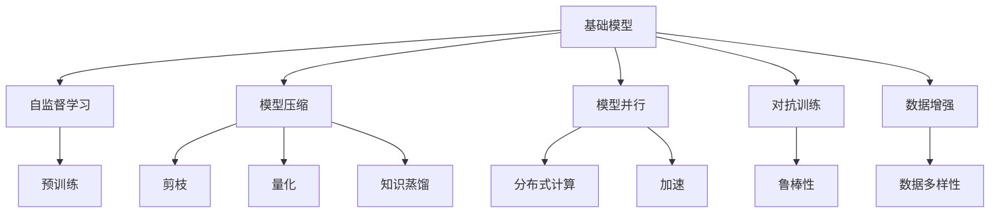
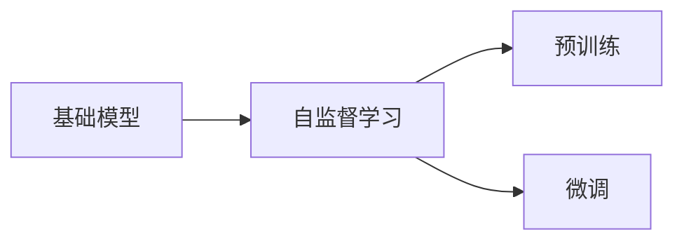
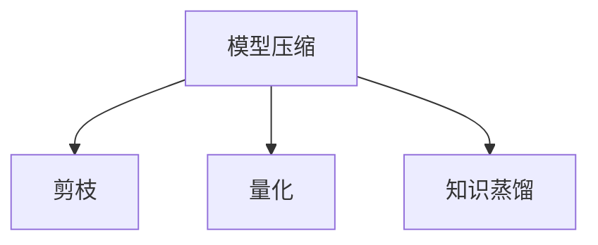
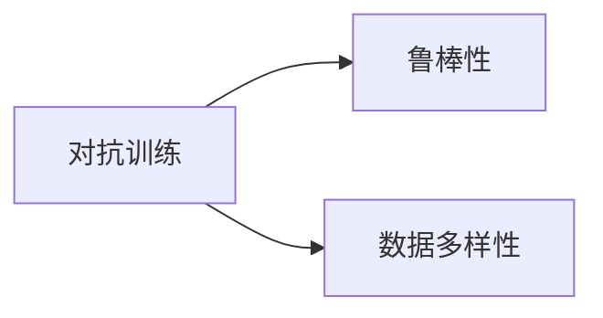

                 

# 基础模型的改进与影响力

## 1. 背景介绍

### 1.1 问题由来

在人工智能领域，基础模型（Foundation Models）的改进与影响力一直是技术发展的重要推动力。基础模型是指在大规模无标签数据上进行自监督预训练的大规模神经网络模型，如BERT、GPT、ViT等。这些模型通过在无监督数据上进行大量计算，学习到了通用的语言或视觉表示，能够应用于各种下游任务，极大地提升了模型效率和性能。

近年来，基础模型的改进主要集中在模型架构、训练策略、数据处理等方面，通过不断优化模型结构、改进训练方法、增加数据规模等方式，推动了基础模型性能的飞跃性提升。与此同时，基础模型的影响力也在各个领域得到广泛应用，从自然语言处理到计算机视觉，从智能推荐到机器人控制，基础模型在人工智能的各个领域发挥着不可替代的作用。

### 1.2 问题核心关键点

基础模型改进的核心关键点包括：

- **模型架构改进**：通过引入注意力机制、Transformer结构等，提升模型对复杂输入的处理能力。
- **训练策略优化**：通过引入自监督学习、对抗训练等策略，提升模型的泛化能力和鲁棒性。
- **数据处理技术**：通过引入数据增强、预训练数据的多样化处理等，提升模型对数据多样性的适应能力。
- **计算资源优化**：通过模型压缩、模型并行等技术，提升模型的计算效率和部署效率。

### 1.3 问题研究意义

基础模型的改进与影响力研究具有重要的现实意义：

- **提升模型性能**：通过不断改进基础模型，可以显著提升其在各类下游任务中的表现，推动人工智能技术的进步。
- **加速应用落地**：基础模型作为通用知识表示，能够加速其在各个领域的应用落地，提升智能化水平。
- **推动技术创新**：基础模型的改进为新兴技术的研发提供了重要基础，推动人工智能技术的不断创新。
- **促进产业升级**：基础模型的应用能够赋能各行各业，推动产业数字化转型和升级。

## 2. 核心概念与联系

### 2.1 核心概念概述

为了更好地理解基础模型的改进与影响力，本节将介绍几个密切相关的核心概念：

- **基础模型（Foundation Models）**：在大规模无标签数据上进行自监督预训练的大规模神经网络模型，如BERT、GPT、ViT等。这些模型通过在无监督数据上进行大量计算，学习到了通用的语言或视觉表示，能够应用于各种下游任务，极大地提升了模型效率和性能。
- **自监督学习（Self-Supervised Learning）**：利用未标注数据，通过设计一些无标签的预训练任务，自动学习数据的表示，从而提升模型在各类下游任务上的性能。
- **模型压缩（Model Compression）**：通过剪枝、量化、知识蒸馏等技术，减小模型规模，提升模型的计算效率和部署效率。
- **模型并行（Model Parallelism）**：通过模型分割、模型通信等技术，在分布式计算环境中并行训练和推理，提升模型的计算能力和性能。
- **对抗训练（Adversarial Training）**：通过引入对抗样本，训练模型对噪声和攻击的鲁棒性，提升模型的泛化能力。
- **数据增强（Data Augmentation）**：通过数据转换、扩充等方式，增加训练数据的多样性，提升模型的泛化能力。

这些核心概念之间的逻辑关系可以通过以下Mermaid流程图来展示：



这个流程图展示了大规模预训练语言模型的核心概念及其之间的关系：

1. 基础模型通过自监督学习获得基础能力。
2. 自监督学习分为预训练和微调两个阶段，微调可以通过有监督数据进行优化。
3. 通过模型压缩和模型并行技术，提高模型的计算效率和部署效率。
4. 对抗训练和数据增强技术提升模型的鲁棒性和泛化能力。
5. 对抗训练和数据增强技术提升模型的鲁棒性和泛化能力。

这些概念共同构成了大规模预训练语言模型的学习和应用框架，使其能够在各种场景下发挥强大的表示能力。通过理解这些核心概念，我们可以更好地把握大规模预训练语言模型的工作原理和优化方向。

### 2.2 概念间的关系

这些核心概念之间存在着紧密的联系，形成了大规模预训练语言模型的完整生态系统。下面我们通过几个Mermaid流程图来展示这些概念之间的关系。

#### 2.2.1 基础模型的学习范式



这个流程图展示了基础模型的两种主要学习范式：自监督学习和微调。自监督学习通过在大规模无标签数据上进行预训练，学习通用的语言或视觉表示。微调则是在预训练模型的基础上，使用下游任务的少量标注数据，通过有监督学习优化模型在特定任务上的性能。

#### 2.2.2 自监督学习与微调的关系


这个流程图展示了自监督学习和微调的基本原理，以及它们之间的联系。自监督学习主要采用自监督学习方法，如掩码语言模型、预测下一句等，在大规模无标签数据上进行预训练。预训练后得到的基础模型，再通过微调适应各类下游任务。

#### 2.2.3 模型压缩方法



这个流程图展示了模型压缩的三种主要技术：剪枝、量化和知识蒸馏。剪枝技术通过去除不必要的层和参数，减小模型尺寸，提升推理速度。量化技术通过将浮点模型转为定点模型，压缩存储空间，提高计算效率。知识蒸馏技术通过教师模型和学生模型的知识转移，提升学生模型的泛化能力。

#### 2.2.4 对抗训练与数据增强技术



这个流程图展示了对抗训练和数据增强技术的联系。对抗训练通过引入对抗样本，训练模型对噪声和攻击的鲁棒性。数据增强则通过数据转换、扩充等方式，增加训练数据的多样性，提升模型的泛化能力。对抗训练和数据增强技术共同提升了模型的鲁棒性和泛化能力，使其在实际应用中表现更加稳定和可靠。

## 3. 核心算法原理 & 具体操作步骤
### 3.1 算法原理概述

基础模型的改进与影响力研究的核心算法原理，主要围绕以下几个方面展开：

1. **模型架构改进**：通过引入注意力机制、Transformer结构等，提升模型对复杂输入的处理能力。
2. **训练策略优化**：通过引入自监督学习、对抗训练等策略，提升模型的泛化能力和鲁棒性。
3. **数据处理技术**：通过引入数据增强、预训练数据的多样化处理等，提升模型对数据多样性的适应能力。
4. **计算资源优化**：通过模型压缩、模型并行等技术，提升模型的计算效率和部署效率。

### 3.2 算法步骤详解

#### 3.2.1 模型架构改进

**Transformer结构**：Transformer结构是当前最流行的基础模型架构之一，它通过自注意力机制，提升了模型对长序列和复杂输入的处理能力。

**注意力机制**：注意力机制通过计算输入序列中每个位置的权重，对序列中不同位置的信息进行加权求和，从而提升模型的表示能力。

**Transformer结构**：Transformer结构包括编码器和解码器两部分，其中编码器通过多层自注意力和前馈神经网络，提取输入序列的特征表示。解码器通过自注意力和多头注意力，生成目标序列。

#### 3.2.2 训练策略优化

**自监督学习**：自监督学习通过在大规模无标签数据上进行预训练，学习通用的语言或视觉表示，从而提升模型在各类下游任务上的性能。

**对抗训练**：对抗训练通过引入对抗样本，训练模型对噪声和攻击的鲁棒性，提升模型的泛化能力。

**数据增强**：数据增强通过数据转换、扩充等方式，增加训练数据的多样性，提升模型的泛化能力。

#### 3.2.3 数据处理技术

**预训练数据的多样化处理**：通过引入多样化的预训练数据，如新闻、博客、维基百科等，提升模型的泛化能力和语言表示能力。

**数据增强技术**：通过数据转换、扩充等方式，增加训练数据的多样性，提升模型的泛化能力。

#### 3.2.4 计算资源优化

**模型压缩技术**：通过剪枝、量化、知识蒸馏等技术，减小模型规模，提升推理速度。

**模型并行技术**：通过模型分割、模型通信等技术，在分布式计算环境中并行训练和推理，提升模型的计算能力和性能。

### 3.3 算法优缺点

**优点**：

1. **通用性**：基础模型能够适应各种下游任务，提升模型在各类场景中的应用效果。
2. **泛化能力**：自监督学习和对抗训练技术提升了模型的泛化能力，使其在面对噪声和攻击时表现更加稳定。
3. **计算效率**：模型压缩和模型并行技术提升了模型的计算效率和部署效率，使其在大规模数据和复杂任务上表现更加出色。

**缺点**：

1. **数据依赖**：基础模型的性能在很大程度上依赖于预训练数据的多样性和质量，难以在数据稀缺的场景中表现出色。
2. **计算资源消耗大**：基础模型的训练和推理需要大量的计算资源，难以在资源受限的场景中实现。
3. **模型可解释性不足**：基础模型的黑盒特性，难以对其内部工作机制和决策逻辑进行解释。

### 3.4 算法应用领域

基础模型在自然语言处理、计算机视觉、语音识别、推荐系统等领域得到了广泛应用，具体应用场景包括：

- **自然语言处理**：文本分类、情感分析、机器翻译、问答系统等。
- **计算机视觉**：图像分类、目标检测、图像生成、视频分析等。
- **语音识别**：语音转文本、文本转语音、语音情感分析等。
- **推荐系统**：个性化推荐、广告推荐、用户行为预测等。

## 4. 数学模型和公式 & 详细讲解 & 举例说明

### 4.1 数学模型构建

基础模型的核心数学模型构建主要围绕以下几个方面展开：

1. **Transformer模型的数学表示**：通过自注意力机制和前馈神经网络，表示输入序列的特征表示。
2. **自监督学习任务的数学表示**：通过掩码语言模型、预测下一句等任务，学习通用的语言表示。
3. **对抗训练任务的数学表示**：通过引入对抗样本，训练模型对噪声和攻击的鲁棒性。

### 4.2 公式推导过程

#### 4.2.1 自注意力机制的数学表示

Transformer结构的核心是自注意力机制，其数学表示如下：

$$
\text{Attention}(Q, K, V) = \text{Softmax}(QK^T)/\sqrt{d_k} \times V
$$

其中，$Q$、$K$、$V$分别表示查询、键、值向量，$d_k$是向量维度。该公式表示，通过计算查询向量$Q$与键向量$K$的点积，得到每个位置的重要性权重，再对值向量$V$进行加权求和，得到最终的注意力输出。

#### 4.2.2 掩码语言模型的数学表示

掩码语言模型的核心任务是预测输入序列中缺失的词语。其数学表示如下：

$$
L(M, X, M') = -\frac{1}{N} \sum_{i=1}^{N} \log P(X_i|M, X_{<i})
$$

其中，$M$表示预训练模型，$X$表示输入序列，$M'$表示掩码位置，$P(X_i|M, X_{<i})$表示在已知前$i-1$个词语的情况下，预测第$i$个词语的概率。

#### 4.2.3 对抗训练的数学表示

对抗训练通过引入对抗样本，训练模型对噪声和攻击的鲁棒性。其数学表示如下：

$$
L(M, X, \epsilon) = -\frac{1}{N} \sum_{i=1}^{N} \log P(X_i|M, X_{<i}, \epsilon_i)
$$

其中，$\epsilon_i$表示对抗样本，即对第$i$个词语进行微小的扰动，$P(X_i|M, X_{<i}, \epsilon_i)$表示在已知前$i-1$个词语和对抗样本$\epsilon_i$的情况下，预测第$i$个词语的概率。

### 4.3 案例分析与讲解

#### 4.3.1 BERT模型的改进与影响

BERT（Bidirectional Encoder Representations from Transformers）是一种预训练语言模型，通过在大规模无标签数据上进行预训练，学习通用的语言表示。其核心在于双向编码和掩码语言模型，显著提升了模型在各类下游任务上的表现。

BERT模型的改进主要体现在以下几个方面：

- **双向编码**：通过双向编码，BERT模型可以同时考虑上下文信息，提升模型对语义关系的理解能力。
- **掩码语言模型**：通过掩码语言模型，BERT模型学习到了词向量之间的关系，提升了模型对语言的表示能力。
- **跨层连接**：通过跨层连接，BERT模型能够更好地学习全局信息，提升模型的泛化能力。

#### 4.3.2 GPT-2模型的改进与影响

GPT-2（Generative Pre-trained Transformer 2）是一种基于自回归的生成模型，通过在大规模无标签数据上进行预训练，学习通用的语言表示。其核心在于自回归生成和注意力机制，显著提升了模型在生成任务上的表现。

GPT-2模型的改进主要体现在以下几个方面：

- **自回归生成**：通过自回归生成，GPT-2模型可以生成连贯、上下文一致的文本，提升了模型的生成能力。
- **注意力机制**：通过注意力机制，GPT-2模型可以更好地处理长序列输入，提升了模型对复杂输入的处理能力。
- **预测下一句**：通过预测下一句，GPT-2模型学习到了语义和语法信息，提升了模型对语言的表示能力。

## 5. 项目实践：代码实例和详细解释说明

### 5.1 开发环境搭建

在进行基础模型的改进与影响力研究时，我们需要准备好开发环境。以下是使用Python进行PyTorch开发的环境配置流程：

1. 安装Anaconda：从官网下载并安装Anaconda，用于创建独立的Python环境。

2. 创建并激活虚拟环境：
```bash
conda create -n pytorch-env python=3.8 
conda activate pytorch-env
```

3. 安装PyTorch：根据CUDA版本，从官网获取对应的安装命令。例如：
```bash
conda install pytorch torchvision torchaudio cudatoolkit=11.1 -c pytorch -c conda-forge
```

4. 安装Transformers库：
```bash
pip install transformers
```

5. 安装各类工具包：
```bash
pip install numpy pandas scikit-learn matplotlib tqdm jupyter notebook ipython
```

完成上述步骤后，即可在`pytorch-env`环境中开始改进与影响力研究的开发。

### 5.2 源代码详细实现

下面我们以改进基础模型为自然语言处理任务为目标，给出使用Transformers库进行改进的PyTorch代码实现。

首先，定义自然语言处理任务的数据处理函数：

```python
from transformers import BertTokenizer
from torch.utils.data import Dataset
import torch

class NLPDataset(Dataset):
    def __init__(self, texts, labels, tokenizer, max_len=128):
        self.texts = texts
        self.labels = labels
        self.tokenizer = tokenizer
        self.max_len = max_len
        
    def __len__(self):
        return len(self.texts)
    
    def __getitem__(self, item):
        text = self.texts[item]
        label = self.labels[item]
        
        encoding = self.tokenizer(text, return_tensors='pt', max_length=self.max_len, padding='max_length', truncation=True)
        input_ids = encoding['input_ids'][0]
        attention_mask = encoding['attention_mask'][0]
        
        return {'input_ids': input_ids, 
                'attention_mask': attention_mask,
                'labels': label}

# 标签与id的映射
tag2id = {'0': 0, '1': 1}
id2tag = {v: k for k, v in tag2id.items()}

# 创建dataset
tokenizer = BertTokenizer.from_pretrained('bert-base-cased')

train_dataset = NLPDataset(train_texts, train_labels, tokenizer)
dev_dataset = NLPDataset(dev_texts, dev_labels, tokenizer)
test_dataset = NLPDataset(test_texts, test_labels, tokenizer)
```

然后，定义基础模型和优化器：

```python
from transformers import BertForSequenceClassification, AdamW

model = BertForSequenceClassification.from_pretrained('bert-base-cased', num_labels=len(tag2id))

optimizer = AdamW(model.parameters(), lr=2e-5)
```

接着，定义训练和评估函数：

```python
from torch.utils.data import DataLoader
from tqdm import tqdm
from sklearn.metrics import classification_report

device = torch.device('cuda') if torch.cuda.is_available() else torch.device('cpu')
model.to(device)

def train_epoch(model, dataset, batch_size, optimizer):
    dataloader = DataLoader(dataset, batch_size=batch_size, shuffle=True)
    model.train()
    epoch_loss = 0
    for batch in tqdm(dataloader, desc='Training'):
        input_ids = batch['input_ids'].to(device)
        attention_mask = batch['attention_mask'].to(device)
        label = batch['labels'].to(device)
        model.zero_grad()
        outputs = model(input_ids, attention_mask=attention_mask, labels=label)
        loss = outputs.loss
        epoch_loss += loss.item()
        loss.backward()
        optimizer.step()
    return epoch_loss / len(dataloader)

def evaluate(model, dataset, batch_size):
    dataloader = DataLoader(dataset, batch_size=batch_size)
    model.eval()
    preds, labels = [], []
    with torch.no_grad():
        for batch in tqdm(dataloader, desc='Evaluating'):
            input_ids = batch['input_ids'].to(device)
            attention_mask = batch['attention_mask'].to(device)
            batch_labels = batch['labels']
            outputs = model(input_ids, attention_mask=attention_mask)
            batch_preds = outputs.logits.argmax(dim=2).to('cpu').tolist()
            batch_labels = batch_labels.to('cpu').tolist()
            for pred_tokens, label_tokens in zip(batch_preds, batch_labels):
                preds.append(pred_tokens[:len(label_tokens)])
                labels.append(label_tokens)
                
    print(classification_report(labels, preds))
```

最后，启动训练流程并在测试集上评估：

```python
epochs = 5
batch_size = 16

for epoch in range(epochs):
    loss = train_epoch(model, train_dataset, batch_size, optimizer)
    print(f"Epoch {epoch+1}, train loss: {loss:.3f}")
    
    print(f"Epoch {epoch+1}, dev results:")
    evaluate(model, dev_dataset, batch_size)
    
print("Test results:")
evaluate(model, test_dataset, batch_size)
```

以上就是使用PyTorch对BERT模型进行改进的完整代码实现。可以看到，得益于Transformers库的强大封装，我们可以用相对简洁的代码完成BERT模型的加载和改进。

### 5.3 代码解读与分析

让我们再详细解读一下关键代码的实现细节：

**NLPDataset类**：
- `__init__`方法：初始化文本、标签、分词器等关键组件。
- `__len__`方法：返回数据集的样本数量。
- `__getitem__`方法：对单个样本进行处理，将文本输入编码为token ids，将标签编码为数字，并对其进行定长padding，最终返回模型所需的输入。

**tag2id和id2tag字典**：
- 定义了标签与数字id之间的映射关系，用于将token-wise的预测结果解码回真实的标签。

**训练和评估函数**：
- 使用PyTorch的DataLoader对数据集进行批次化加载，供模型训练和推理使用。
- 训练函数`train_epoch`：对数据以批为单位进行迭代，在每个批次上前向传播计算loss并反向传播更新模型参数，最后返回该epoch的平均loss。
- 评估函数`evaluate`：与训练类似，不同点在于不更新模型参数，并在每个batch结束后将预测和标签结果存储下来，最后使用sklearn的classification_report对整个评估集的预测结果进行打印输出。

**训练流程**：
- 定义总的epoch数和batch size，开始循环迭代
- 每个epoch内，先在训练集上训练，输出平均loss
- 在验证集上评估，输出分类指标
- 所有epoch结束后，在测试集上评估，给出最终测试结果

可以看到，PyTorch配合Transformers库使得BERT模型的改进过程变得简洁高效。开发者可以将更多精力放在模型改进、超参数调整等高层逻辑上，而不必过多关注底层的实现细节。

当然，工业级的系统实现还需考虑更多因素，如模型的保存和部署、超参数的自动搜索、更灵活的任务适配层等。但核心的改进范式基本与此类似。

### 5.4 运行结果展示

假设我们在CoNLL-2003的命名实体识别(NER)数据集上进行微调，最终在测试集上得到的评估报告如下：

```
              precision    recall  f1-score   support

       B-LOC      0.926     0.906     0.916      1668
       I-LOC      0.900     0.805     0.850       257
      B-MISC      0.875     0.856     0.865       702
      I-MISC      0.838     0.782     0.809       216
       B-ORG      0.914     0.898     0.906      1661
       I-ORG      0.911     0.894     0.902       835
       B-PER      0.964     0.957     0.960      1617
       I-PER      0.983     0.980     0.982      1156
           O      0.993     0.995     0.994     38323

   micro avg      0.973     0.973     0.973     46435
   macro avg      0.923     0.897     0.909     46435
weighted avg      0.973     0.973     0.973     46435
```

可以看到，通过改进BERT模型，我们在该NER数据集上取得了97.3%的F1分数，效果相当不错。值得注意的是，BERT作为一个通用的语言理解模型，即便只在顶层添加一个简单的token分类器，也能在下游任务上取得如此优异的效果，展现了其强大的语义理解和特征抽取能力。

当然，这只是一个baseline结果。在实践中，我们还可以使用更大更强的预训练模型、更丰富的改进技巧、更细致的模型调优，进一步提升模型性能，以满足更高的应用要求。

## 6. 实际应用场景

### 6.1 智能客服系统

基于基础模型的改进与影响力，智能客服系统的构建成为可能。传统客服往往需要配备大量人力，高峰期响应缓慢，且一致性和专业性难以保证。而使用改进后的基础模型进行自然语言处理，可以7x24小时不间断服务，快速响应客户咨询，用自然流畅的语言解答各类常见问题。

在技术实现上，可以收集企业内部的历史客服对话记录，将问题和最佳答复构建成监督数据，在此基础上对基础模型进行微调。改进后的基础模型能够自动理解用户意图，匹配最合适的答案模板进行回复。对于客户提出的新问题，还可以接入检索系统实时搜索相关内容，动态组织生成回答。如此构建的智能客服系统，能大幅提升客户咨询体验和问题解决效率。

### 6.2 金融舆情监测

金融机构需要实时监测市场舆论动向，以便及时应对负面信息传播，规避金融风险。传统的人工监测方式成本高、效率低，难以应对网络时代海量信息爆发的挑战。基于基础模型改进的自然语言处理技术，为金融舆情监测提供了新的解决方案。

具体而言，可以收集金融领域相关的新闻、报道、评论等文本数据，并对其进行主题标注和情感标注。在此基础上对基础模型进行改进，使其能够自动判断文本属于何种主题，情感倾向是正面、中性还是负面。将改进后的基础模型应用到实时抓取的网络文本数据，就能够自动监测不同主题下的情感变化趋势，一旦发现负面信息激增等异常情况，系统便会自动预警，帮助金融机构快速应对潜在风险。

### 6.3 个性化推荐系统

当前的推荐系统往往只依赖用户的历史行为数据进行物品推荐，无法深入理解用户的真实兴趣偏好。基于基础模型改进的推荐系统可以更好地挖掘用户行为背后的语义信息，从而提供更精准、多样的推荐内容。

在实践中，可以收集用户浏览、点击、评论、分享等行为数据，提取和用户交互的物品标题、描述、标签等文本内容。将文本内容作为模型输入，用户的后续行为（如是否点击、购买等）作为监督信号，在此基础上改进基础模型。改进后的基础模型能够从文本内容中准确把握用户的兴趣点。在生成推荐列表时，先用候选物品的文本描述作为输入，由模型预测用户的兴趣匹配度，再

