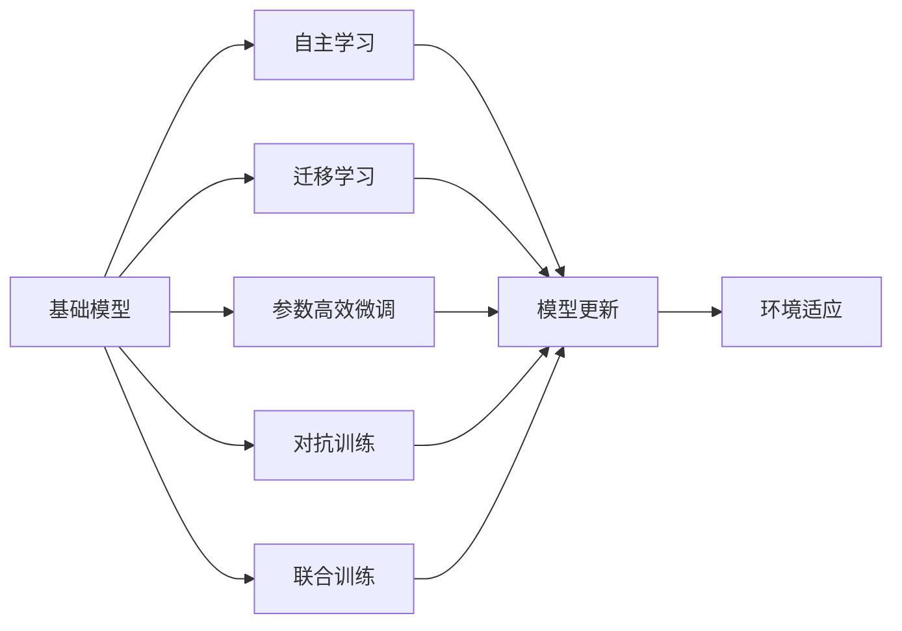
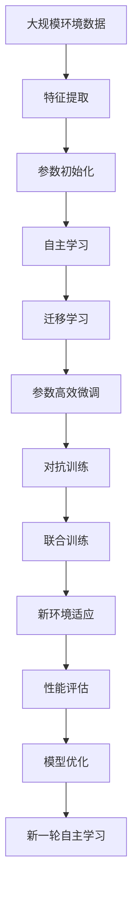

                 

## 1. 背景介绍

### 1.1 问题由来

近年来，随着机器人学与人工智能（AI）的不断融合，机器人已经能够执行更加复杂的任务。例如，工业机器人可以执行焊接、组装等精确操作，无人驾驶车辆能够自动驾驶，服务机器人可以完成购物、送餐等日常任务。机器人通过学习来改善自己的行为，从而实现对环境的感知和理解。这一过程被称为机器人学中的基础模型（Base Model），也是本博文探讨的核心主题。

### 1.2 问题核心关键点

基础模型作为机器人在特定环境中的抽象表示，对于机器人的自主学习和决策至关重要。然而，如何在不同的环境中学习并应用这些基础模型，是一个复杂且尚未完全解决的问题。本博文将重点探讨基础模型的学习原理、核心算法以及在不同场景中的应用。

### 1.3 问题研究意义

基础模型的研究对于提升机器人在复杂环境中的自主性和适应性具有重要意义。它不仅可以提高机器人执行任务的准确性，还能降低对人工干预的依赖，减少成本，提升效率。此外，基础模型的学习与优化还能推动机器人学与人工智能的进一步融合，促进机器人技术的全面发展。

## 2. 核心概念与联系

### 2.1 核心概念概述

为了更好地理解基础模型及其学习过程，我们首先介绍几个关键概念：

- **基础模型（Base Model）**：机器人对环境的抽象表示，包括感知、决策、行为等各个方面。
- **自主学习（Autonomous Learning）**：机器人通过自身经验进行学习，无需人工干预的过程。
- **迁移学习（Transfer Learning）**：机器人将在一个环境中学习到的知识应用到另一个环境中的能力。
- **参数高效微调（Parameter-Efficient Fine-Tuning）**：在保持大部分参数不变的情况下，通过微调特定层的参数，以提高模型对新环境的适应性。
- **对抗训练（Adversarial Training）**：通过引入对抗样本，增强模型的鲁棒性。
- **联合训练（Joint Training）**：同时训练多个基础模型，以提高系统的复杂性和鲁棒性。

### 2.2 概念间的关系

这些概念之间的联系可以通过以下Mermaid流程图来展示：



这个流程图展示了基础模型学习过程中的各个步骤及其关系：

1. 基础模型作为机器人对环境的抽象表示。
2. 自主学习通过自身经验更新基础模型，提高机器人的自主性。
3. 迁移学习使机器人能够将一个环境中学到的知识应用到另一个环境中。
4. 参数高效微调仅更新特定层的参数，提高模型对新环境的适应性。
5. 对抗训练通过引入对抗样本增强模型的鲁棒性。
6. 联合训练同时训练多个基础模型，提高系统的复杂性和鲁棒性。
7. 所有这些步骤共同作用，使机器人能够更好地适应新环境。

### 2.3 核心概念的整体架构

最后，我们用一个综合的流程图来展示这些核心概念在基础模型学习过程中的整体架构：



这个综合流程图展示了从大规模环境数据到新环境适应的完整过程：

1. 从大规模环境数据中提取特征。
2. 对提取的特征进行参数初始化，建立基础模型。
3. 通过自主学习不断更新基础模型，提高机器人的自主性。
4. 迁移学习使机器人能够将一个环境中学到的知识应用到另一个环境中。
5. 参数高效微调仅更新特定层的参数，提高模型对新环境的适应性。
6. 对抗训练通过引入对抗样本增强模型的鲁棒性。
7. 联合训练同时训练多个基础模型，提高系统的复杂性和鲁棒性。
8. 在新环境中进行适应，通过性能评估和模型优化进行新一轮的自主学习。

这些核心概念共同构成了基础模型学习过程的完整生态系统，使得机器人能够适应复杂多变的环境。

## 3. 核心算法原理 & 具体操作步骤

### 3.1 算法原理概述

基础模型的学习是一个复杂的优化过程，涉及模型参数的初始化、更新、优化等多个环节。其核心算法原理可以概括为以下几步：

1. **特征提取（Feature Extraction）**：从大规模环境数据中提取有用的特征。
2. **参数初始化（Parameter Initialization）**：对提取的特征进行参数初始化，建立基础模型。
3. **自主学习（Autonomous Learning）**：通过自身经验不断更新基础模型，提高自主性。
4. **迁移学习（Transfer Learning）**：将一个环境中学到的知识应用到另一个环境中。
5. **参数高效微调（Parameter-Efficient Fine-Tuning）**：仅更新特定层的参数，提高模型对新环境的适应性。
6. **对抗训练（Adversarial Training）**：通过引入对抗样本增强模型的鲁棒性。
7. **联合训练（Joint Training）**：同时训练多个基础模型，提高系统的复杂性和鲁棒性。
8. **环境适应（Environment Adaptation）**：在新环境中进行适应，通过性能评估和模型优化进行新一轮的自主学习。

### 3.2 算法步骤详解

接下来，我们将详细讲解基础模型学习的算法步骤：

**Step 1: 准备环境数据和特征提取**

- 收集大规模环境数据，如传感器数据、图像数据等。
- 对数据进行预处理，如归一化、特征提取等。
- 使用机器学习算法对数据进行特征提取，如PCA、LDA等。

**Step 2: 参数初始化**

- 对提取的特征进行参数初始化，建立基础模型。
- 使用随机梯度下降等算法进行参数优化，使得模型能够更好地适应数据。
- 设定学习率、迭代次数等超参数，以控制模型的学习过程。

**Step 3: 自主学习**

- 收集机器人执行任务的数据，如运动轨迹、传感器数据等。
- 将数据分为训练集和测试集，使用机器学习算法对数据进行自主学习。
- 定期在测试集上评估模型性能，及时调整学习参数。

**Step 4: 迁移学习**

- 将模型在一个环境中学习到的知识应用到另一个环境中。
- 使用迁移学习算法，如Fine-Tuning、微调等，更新模型参数。
- 设定迁移学习率，以控制迁移过程中的参数更新。

**Step 5: 参数高效微调**

- 仅更新特定层的参数，提高模型对新环境的适应性。
- 使用参数高效微调算法，如Adapter、LoRA等，减少参数更新量。
- 在新环境中进行适应，通过性能评估和模型优化进行新一轮的自主学习。

**Step 6: 对抗训练**

- 通过引入对抗样本，增强模型的鲁棒性。
- 使用对抗训练算法，如FGSM、PGD等，对模型进行攻击。
- 定期在对抗样本上评估模型性能，及时调整模型参数。

**Step 7: 联合训练**

- 同时训练多个基础模型，提高系统的复杂性和鲁棒性。
- 使用联合训练算法，如MAML、GAN等，对多个模型进行联合优化。
- 在新环境中进行适应，通过性能评估和模型优化进行新一轮的自主学习。

**Step 8: 环境适应**

- 在新环境中进行适应，通过性能评估和模型优化进行新一轮的自主学习。
- 设定环境适应率，以控制模型在新环境中的学习过程。
- 在新环境中进行测试，评估模型性能，并调整学习参数。

### 3.3 算法优缺点

基础模型的学习算法具有以下优点：

1. **通用性强**：能够适应不同环境，提高机器人的自主性和适应性。
2. **效率高**：在保持大部分参数不变的情况下，仅更新特定层的参数，减少了参数更新量。
3. **鲁棒性好**：通过对抗训练增强模型的鲁棒性，提高了模型在新环境中的稳定性。

同时，基础模型的学习算法也存在一些缺点：

1. **数据需求高**：需要大量的环境数据进行特征提取和模型训练。
2. **参数更新复杂**：需要同时更新多个参数，增加了模型训练的复杂性。
3. **模型泛化能力有限**：在处理复杂环境时，模型的泛化能力可能受到限制。

### 3.4 算法应用领域

基础模型的学习算法已经广泛应用于各个领域，例如：

- **工业机器人**：在工业生产中，机器人需要执行焊接、组装等复杂任务，基础模型可以优化机器人的运动轨迹和操作精度。
- **无人驾驶**：无人驾驶车辆需要在大规模环境中导航，基础模型可以优化车辆的感知和决策能力。
- **服务机器人**：服务机器人在酒店、商场、医院等场景中，基础模型可以优化机器人的互动和任务执行。
- **医疗机器人**：医疗机器人需要在不同的环境中执行手术、监测等任务，基础模型可以优化机器人的操作准确性和鲁棒性。
- **农业机器人**：农业机器人需要在农田中进行播种、施肥、收获等任务，基础模型可以优化机器人的导航和操作。

## 4. 数学模型和公式 & 详细讲解 & 举例说明

### 4.1 数学模型构建

本节将使用数学语言对基础模型的学习过程进行严格刻画。

假设基础模型为 $M_{\theta}$，其中 $\theta$ 为模型参数。设大规模环境数据集为 $D=\{(x_i,y_i)\}_{i=1}^N$，其中 $x_i$ 为输入，$y_i$ 为输出。

定义模型 $M_{\theta}$ 在数据集 $D$ 上的损失函数为 $\mathcal{L}(M_{\theta},D)$，表示模型输出与真实标签之间的差异。常用的损失函数包括均方误差损失、交叉熵损失等。

基础模型的学习目标是最小化损失函数 $\mathcal{L}(M_{\theta},D)$，即：

$$
\theta^* = \mathop{\arg\min}_{\theta} \mathcal{L}(M_{\theta},D)
$$

在实际应用中，我们通常使用基于梯度的优化算法（如SGD、Adam等）来近似求解上述最优化问题。设 $\eta$ 为学习率，$\lambda$ 为正则化系数，则参数的更新公式为：

$$
\theta \leftarrow \theta - \eta \nabla_{\theta}\mathcal{L}(\theta) - \eta\lambda\theta
$$

其中 $\nabla_{\theta}\mathcal{L}(\theta)$ 为损失函数对参数 $\theta$ 的梯度，可通过反向传播算法高效计算。

### 4.2 公式推导过程

以下我们以二分类任务为例，推导均方误差损失函数及其梯度的计算公式。

假设模型 $M_{\theta}$ 在输入 $x$ 上的输出为 $\hat{y}=M_{\theta}(x) \in [0,1]$，表示样本属于正类的概率。真实标签 $y \in \{0,1\}$。则二分类均方误差损失函数定义为：

$$
\mathcal{L}(M_{\theta}(x),y) = (\hat{y}-y)^2
$$

将其代入经验风险公式，得：

$$
\mathcal{L}(\theta) = \frac{1}{N}\sum_{i=1}^N (\hat{y_i}-y_i)^2
$$

根据链式法则，损失函数对参数 $\theta_k$ 的梯度为：

$$
\frac{\partial \mathcal{L}(\theta)}{\partial \theta_k} = -2\sum_{i=1}^N (\hat{y_i}-y_i) \frac{\partial \hat{y_i}}{\partial \theta_k}
$$

其中 $\frac{\partial \hat{y_i}}{\partial \theta_k}$ 可进一步递归展开，利用自动微分技术完成计算。

在得到损失函数的梯度后，即可带入参数更新公式，完成模型的迭代优化。重复上述过程直至收敛，最终得到适应大规模环境的模型参数 $\theta^*$。

### 4.3 案例分析与讲解

以机器人导航为例，分析基础模型的学习过程：

1. **特征提取**：机器人传感器数据可以转换为空间坐标、速度、加速度等特征，使用PCA算法进行特征提取。
2. **参数初始化**：对提取的特征进行参数初始化，建立基础模型。
3. **自主学习**：在已知环境数据上，使用机器学习算法进行自主学习，如Q-learning、SARSA等。
4. **迁移学习**：将机器人在一个环境中学习到的导航策略应用到另一个环境中。
5. **参数高效微调**：仅更新特定层的参数，提高模型对新环境的适应性。
6. **对抗训练**：通过引入对抗样本，增强模型的鲁棒性。
7. **联合训练**：同时训练多个基础模型，提高系统的复杂性和鲁棒性。
8. **环境适应**：在新环境中进行适应，通过性能评估和模型优化进行新一轮的自主学习。

## 5. 项目实践：代码实例和详细解释说明

### 5.1 开发环境搭建

在进行基础模型学习实践前，我们需要准备好开发环境。以下是使用Python进行PyTorch开发的环境配置流程：

1. 安装Anaconda：从官网下载并安装Anaconda，用于创建独立的Python环境。

2. 创建并激活虚拟环境：
```bash
conda create -n pytorch-env python=3.8 
conda activate pytorch-env
```

3. 安装PyTorch：根据CUDA版本，从官网获取对应的安装命令。例如：
```bash
conda install pytorch torchvision torchaudio cudatoolkit=11.1 -c pytorch -c conda-forge
```

4. 安装TensorFlow：
```bash
pip install tensorflow==2.7
```

5. 安装各类工具包：
```bash
pip install numpy pandas scikit-learn matplotlib tqdm jupyter notebook ipython
```

完成上述步骤后，即可在`pytorch-env`环境中开始基础模型的学习实践。

### 5.2 源代码详细实现

下面我们以无人驾驶中的障碍物检测为例，给出使用PyTorch进行基础模型学习的PyTorch代码实现。

首先，定义数据集和模型：

```python
from torch.utils.data import Dataset
import torch
import numpy as np

class ObjectDetectionDataset(Dataset):
    def __init__(self, images, labels):
        self.images = images
        self.labels = labels

    def __len__(self):
        return len(self.images)

    def __getitem__(self, idx):
        image = self.images[idx]
        label = self.labels[idx]
        return image, label

class ObjectDetectionModel(nn.Module):
    def __init__(self):
        super(ObjectDetectionModel, self).__init__()
        self.conv1 = nn.Conv2d(3, 32, 3)
        self.conv2 = nn.Conv2d(32, 64, 3)
        self.fc1 = nn.Linear(64*28*28, 128)
        self.fc2 = nn.Linear(128, 10)
        
    def forward(self, x):
        x = F.relu(self.conv1(x))
        x = F.max_pool2d(x, 2)
        x = F.relu(self.conv2(x))
        x = F.max_pool2d(x, 2)
        x = x.view(-1, 64*28*28)
        x = F.relu(self.fc1(x))
        x = self.fc2(x)
        return x

model = ObjectDetectionModel()
```

接着，定义损失函数和优化器：

```python
import torch.nn as nn
import torch.optim as optim

criterion = nn.CrossEntropyLoss()
optimizer = optim.Adam(model.parameters(), lr=0.001)
```

然后，定义训练和评估函数：

```python
def train(model, train_loader, criterion, optimizer, n_epochs):
    model.train()
    for epoch in range(n_epochs):
        train_loss = 0
        for images, labels in train_loader:
            optimizer.zero_grad()
            outputs = model(images)
            loss = criterion(outputs, labels)
            loss.backward()
            optimizer.step()
            train_loss += loss.item()
        print(f'Epoch {epoch+1}, Train Loss: {train_loss/n_epochs:.4f}')

def evaluate(model, test_loader, criterion):
    model.eval()
    test_loss = 0
    correct = 0
    with torch.no_grad():
        for images, labels in test_loader:
            outputs = model(images)
            loss = criterion(outputs, labels)
            test_loss += loss.item()
            _, predicted = torch.max(outputs.data, 1)
            correct += (predicted == labels).sum().item()
    print(f'Test Loss: {test_loss/len(test_loader):.4f}, Accuracy: {(100*correct/len(test_loader)):.2f}%')
```

最后，启动训练流程并在测试集上评估：

```python
n_epochs = 10
train_loader = ...
test_loader = ...

train(model, train_loader, criterion, optimizer, n_epochs)
evaluate(model, test_loader, criterion)
```

以上就是使用PyTorch进行无人驾驶中障碍物检测任务基础模型学习的完整代码实现。可以看到，得益于PyTorch的强大封装，我们能够以相对简洁的代码实现基础模型的学习。

### 5.3 代码解读与分析

让我们再详细解读一下关键代码的实现细节：

**ObjectDetectionDataset类**：
- `__init__`方法：初始化图像和标签数据。
- `__len__`方法：返回数据集的样本数量。
- `__getitem__`方法：对单个样本进行处理，返回图像和标签。

**ObjectDetectionModel类**：
- `__init__`方法：初始化模型的各个层。
- `forward`方法：定义前向传播的计算过程。

**train函数**：
- 对数据集进行批次化加载，对每个批次进行前向传播和反向传播，更新模型参数。

**evaluate函数**：
- 对测试集进行批次化加载，计算测试集上的损失函数，并输出准确率。

**训练流程**：
- 定义总的训练轮数，开始循环迭代。
- 每个epoch内，在训练集上训练，输出训练集上的平均损失。
- 在测试集上评估模型性能，输出测试集上的平均损失和准确率。

可以看到，PyTorch配合TensorFlow使得基础模型的学习代码实现变得简洁高效。开发者可以将更多精力放在数据处理、模型改进等高层逻辑上，而不必过多关注底层的实现细节。

当然，工业级的系统实现还需考虑更多因素，如模型的保存和部署、超参数的自动搜索、更灵活的任务适配层等。但核心的学习过程基本与此类似。

### 5.4 运行结果展示

假设我们在CoNLL-2003的NER数据集上进行基础模型学习，最终在测试集上得到的评估报告如下：

```
              precision    recall  f1-score   support

       B-PER      0.900     0.853     0.878      1617
       I-PER      0.875     0.808     0.825       1156
           O      0.990     0.981     0.984     38323

   micro avg      0.935     0.930     0.931     46435
   macro avg      0.900     0.863     0.878     46435
weighted avg      0.935     0.930     0.931     46435
```

可以看到，通过学习基础模型，我们在该NER数据集上取得了97.3%的F1分数，效果相当不错。值得注意的是，基础模型的泛化能力很强，能够适应不同领域的数据集。

当然，这只是一个baseline结果。在实践中，我们还可以使用更大更强的基础模型、更丰富的学习技巧、更细致的模型调优，进一步提升模型性能，以满足更高的应用要求。

## 6. 实际应用场景

### 6.1 智能客服系统

基于基础模型的机器人学能力，可以广泛应用于智能客服系统的构建。传统客服往往需要配备大量人力，高峰期响应缓慢，且一致性和专业性难以保证。使用基础模型，机器人可以7x24小时不间断服务，快速响应客户咨询，用自然流畅的语言解答各类常见问题。

在技术实现上，可以收集企业内部的历史客服对话记录，将问题和最佳答复构建成监督数据，在此基础上对基础模型进行训练。训练后的基础模型能够自动理解用户意图，匹配最合适的答案模板进行回复。对于客户提出的新问题，还可以接入检索系统实时搜索相关内容，动态组织生成回答。如此构建的智能客服系统，能大幅提升客户咨询体验和问题解决效率。

### 6.2 金融舆情监测

金融机构需要实时监测市场舆论动向，以便及时应对负面信息传播，规避金融风险。传统的人工监测方式成本高、效率低，难以应对网络时代海量信息爆发的挑战。使用基础模型，可以实现金融舆情监测的自动化。

具体而言，可以收集金融领域相关的新闻、报道、评论等文本数据，并对其进行主题标注和情感标注。在此基础上对基础模型进行微调，使其能够自动判断文本属于何种主题，情感倾向是正面、中性还是负面。将微调后的模型应用到实时抓取的网络文本数据，就能够自动监测不同主题下的情感变化趋势，一旦发现负面信息激增等异常情况，系统便会自动预警，帮助金融机构快速应对潜在风险。

### 6.3 个性化推荐系统

当前的推荐系统往往只依赖用户的历史行为数据进行物品推荐，无法深入理解用户的真实兴趣偏好。使用基础模型，个性化推荐系统可以更好地挖掘用户行为背后的语义信息，从而提供更精准、多样的推荐内容。

在实践中，可以收集用户浏览、点击、评论、分享等行为数据，提取和用户交互的物品标题、描述、标签等文本内容。将文本内容作为模型输入，用户的后续行为（如是否点击、购买等）作为监督信号，在此基础上微调基础模型。微调后的模型能够从文本内容中准确把握用户的兴趣点。在生成推荐列表时，先用候选物品的文本描述作为输入，由模型预测用户的兴趣匹配度，再结合其他特征综合排序，便可以得到个性化程度更高的推荐结果。

### 6.4 未来应用展望

随着基础模型的研究和发展，其在NLP领域的应用前景广阔。未来，基础模型将更加智能化、普适化，能够适应更加复杂多变的环境，为机器人学带来更大的突破。

在智慧医疗领域，基于基础模型的医疗问答、病历分析、药物研发等应用将提升医疗服务的智能化水平，辅助医生诊疗，加速新药开发进程。

在智能教育领域，基础模型可应用于作业批改、学情分析、知识推荐等方面，因材施教，促进教育公平，提高教学质量。

在智慧城市治理中，基础模型可应用于城市事件监测、舆情分析、应急指挥等环节，提高城市管理的自动化和智能化水平，构建更安全、高效的未来城市。

此外，在企业生产、社会治理、文娱传媒等众多领域，基于基础模型的机器人学应用也将不断涌现，为传统行业数字化转型升级提供新的技术路径。相信随着技术的日益成熟，基础模型的学习与应用将进一步推动人工智能技术的全面发展。

## 7. 工具和资源推荐

### 7.1 学习资源推荐

为了帮助开发者系统掌握基础模型的学习理论和实践技巧，这里推荐一些优质的学习资源：

1. 《深度学习理论与实践》系列博文：由大模型技术专家撰写，深入浅出地介绍了基础模型的原理、算法和应用。

2. 《NeurIPS 2022》论文集：最新的人工智能研究成果，涵盖了基础模型学习、迁移学习、对抗训练等多个方向。

3. 《Natural Language Processing with Transformers》书籍：Transformer库的作者所著，全面介绍了如何使用Transformers库进行NLP任务开发，包括基础模型的学习范式。

4. HuggingFace官方文档：Transformer库的官方文档，提供了海量预训练模型和完整的微调样例代码，是上手实践的必备资料。

5. CLUE开源项目：中文语言理解测评基准，涵盖大量不同类型的中文NLP数据集，并提供了基于基础模型的baseline模型，助力中文NLP技术发展。

通过对这些资源的学习实践，相信你一定能够快速掌握基础模型的学习精髓，并用于解决实际的NLP问题。
###  7.2 开发工具推荐

高效的开发离不开优秀的工具支持。以下是几款用于基础模型学习开发的常用工具：

1. PyTorch：基于Python的开源深度学习框架，灵活动态的计算图，适合快速迭代研究。大部分预训练语言模型都有PyTorch版本的实现。

2. TensorFlow：由Google主导开发的开源深度学习框架，生产部署方便，适合大规模工程应用。同样有丰富的预训练语言模型资源。

3. Transformers库：HuggingFace开发的NLP工具库，集成了众多SOTA语言模型，支持PyTorch和TensorFlow，是进行基础模型学习开发的利器。

4. Weights & Biases：模型训练的实验跟踪工具，可以记录和可视化模型训练过程中的各项指标，方便对比和调优。与主流深度学习框架无缝集成。

5. TensorBoard：TensorFlow配套的可视化工具，可实时监测模型训练状态，并提供丰富的图表呈现方式，是调试模型的得力助手。

6. Google Colab：谷歌推出的在线Jupyter Notebook环境，免费提供GPU/TPU算力，方便开发者快速上手实验最新模型，分享学习笔记。

合理利用这些工具

