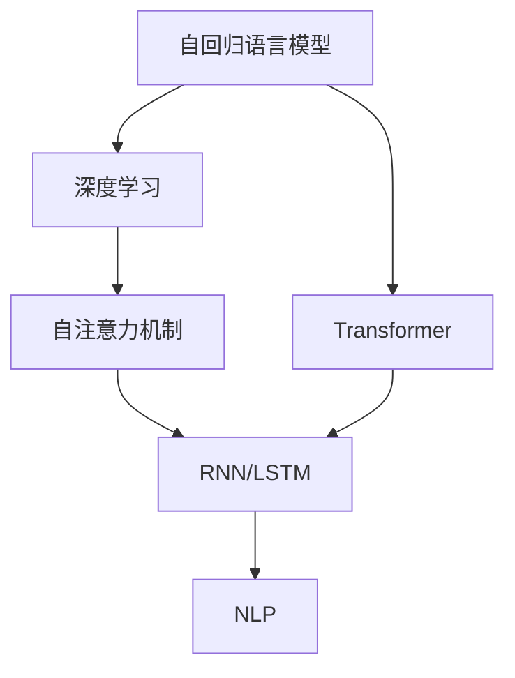
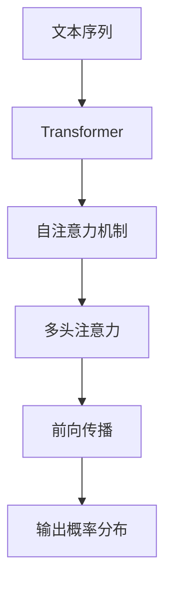
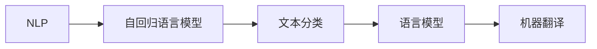

                 

# 基础模型的自回归语言建模

> 关键词：自回归语言建模,语言模型,概率模型,Transformer,深度学习,自然语言处理(NLP)

## 1. 背景介绍

### 1.1 问题由来
自回归语言模型(Autoregressive Language Model)是大语言模型中的基础形式，通过对文本序列进行概率建模，预测序列中的下一个词汇。这种模型形式简单、易于理解和实现，广泛应用于自然语言处理(NLP)的各个领域。

近年来，深度学习技术的迅猛发展，尤其是Transformer模型的广泛应用，为自回归语言建模带来了新的突破。Transformer通过自注意力机制，可以高效地捕捉文本序列中的长期依赖关系，从而在多种NLP任务中取得了优异的性能。

然而，自回归语言建模仍然存在一些理论和实践上的挑战。本文档将深入探讨自回归语言建模的原理和应用，并结合最新的深度学习技术，提出一些解决方案，旨在帮助读者更好地理解和应用自回归语言模型。

### 1.2 问题核心关键点
本文档将聚焦于以下关键点：
1. 自回归语言建模的基本原理。
2. 深度学习技术在自回归语言建模中的应用。
3. 自回归语言建模在实际NLP任务中的表现和应用场景。
4. 自回归语言建模的优化方法。
5. 自回归语言建模的前沿技术。

通过系统地介绍和分析这些问题，本文档旨在为读者提供关于自回归语言建模的全面和深入理解，并激发进一步的创新和探索。

## 2. 核心概念与联系

### 2.1 核心概念概述
1. **自回归语言模型(Autoregressive Language Model)**：一种概率模型，通过文本序列中前n个词汇预测第n+1个词汇，从而构建序列的概率分布。常见模型包括RNN、LSTM和Transformer等。

2. **Transformer模型**：一种基于自注意力机制的深度学习模型，广泛用于NLP领域，通过多头注意力和位置编码等技术，可以高效地处理长序列，减少计算复杂度。

3. **深度学习(Deep Learning)**：一类基于多层神经网络的机器学习技术，通过反向传播算法和梯度下降等优化方法，可以自动从数据中学习复杂模式。

4. **自然语言处理(NLP)**：一种计算机科学和人工智能领域，专注于处理和分析自然语言，包括文本分类、语言模型、机器翻译等任务。

这些核心概念之间的联系可以通过以下Mermaid流程图来展示：



这个流程图展示了自回归语言模型与深度学习和自然语言处理之间的联系：
1. 自回归语言模型是一种基于深度学习的概率模型。
2. 深度学习提供了自回归语言模型的实现方法。
3. Transformer模型是基于深度学习的自回归语言模型的一种。
4. 自注意力机制是Transformer模型的核心技术。
5. 自回归语言模型是NLP领域的重要组成部分。

### 2.2 概念间的关系

这些核心概念之间存在着紧密的联系，形成了自回归语言建模的完整生态系统。下面通过几个Mermaid流程图来展示这些概念之间的关系：

#### 2.2.1 自回归语言模型的基本架构


这个流程图展示了自回归语言模型的基本架构：
1. 文本序列作为输入。
2. 自回归语言模型通过计算前n个词汇的概率分布，预测第n+1个词汇。
3. 输出概率分布作为预测结果。

#### 2.2.2 Transformer模型与自回归语言模型



这个流程图展示了Transformer模型如何实现自回归语言建模：
1. 文本序列输入Transformer模型。
2. 自注意力机制计算文本序列中不同位置之间的关系。
3. 多头注意力计算每个位置对其他位置的关注度。
4. 前向传播输出每个位置的表示。
5. 输出概率分布作为预测结果。

#### 2.2.3 深度学习在自回归语言建模中的应用


这个流程图展示了深度学习如何实现自回归语言建模：
1. 深度学习提供多层神经网络作为实现方法。
2. 自回归语言模型通过多层神经网络进行建模。
3. 反向传播算法计算模型参数的梯度。
4. 梯度下降优化模型参数。

#### 2.2.4 NLP在自回归语言建模中的应用



这个流程图展示了NLP在自回归语言建模中的应用：
1. 自回归语言模型是NLP领域的重要组成部分。
2. 自回归语言模型可以用于文本分类、语言模型和机器翻译等任务。

## 3. 核心算法原理 & 具体操作步骤
### 3.1 算法原理概述
自回归语言模型的基本原理是通过计算文本序列中前n个词汇的概率分布，预测第n+1个词汇的概率分布。这可以通过以下公式表示：

$$
P(w_{t+1}|w_1,...,w_t) = \frac{P(w_1,...,w_t,w_{t+1})}{P(w_1,...,w_t)}
$$

其中 $P(w_{t+1}|w_1,...,w_t)$ 表示给定前n个词汇的概率分布，$P(w_1,...,w_t)$ 表示前n个词汇的概率分布，$P(w_1,...,w_t,w_{t+1})$ 表示前n个词汇和第n+1个词汇的概率分布。

### 3.2 算法步骤详解
1. **数据准备**：收集文本数据，进行预处理，生成训练集。
2. **模型构建**：选择适当的自回归模型，如RNN、LSTM或Transformer，构建模型架构。
3. **参数初始化**：初始化模型参数，如权重矩阵、偏置向量等。
4. **前向传播**：将文本序列输入模型，进行前向传播，计算每个位置对其他位置的注意力权重。
5. **后向传播**：根据预测结果和实际标签计算损失函数，使用反向传播算法更新模型参数。
6. **模型训练**：在训练集上不断迭代，更新模型参数，最小化损失函数。
7. **模型评估**：在验证集或测试集上评估模型性能，选择最优模型。
8. **模型应用**：将训练好的模型应用于实际任务，如文本生成、翻译等。

### 3.3 算法优缺点
#### 优点：
1. **简单直观**：自回归语言模型简单易懂，易于实现和理解。
2. **高效计算**：Transformer模型可以通过并行化计算，提高计算效率。
3. **泛化能力强**：深度学习模型具有较强的泛化能力，可以适应多种文本序列。

#### 缺点：
1. **长序列问题**：自回归语言模型难以处理长序列，因为需要逐个计算每个位置的概率分布。
2. **计算复杂度高**：深度学习模型计算复杂度高，需要大量的计算资源。
3. **数据需求大**：自回归语言模型需要大量的标注数据，训练成本高。

### 3.4 算法应用领域
自回归语言模型在自然语言处理领域有广泛的应用，主要包括以下几个方面：
1. **语言模型**：用于生成文本序列，如生成对话、文本摘要等。
2. **机器翻译**：将源语言文本翻译成目标语言文本，如英语翻译成中文。
3. **文本分类**：将文本分为不同的类别，如垃圾邮件分类、情感分析等。
4. **语音识别**：将语音转化为文本，如语音助手、智能家居等。
5. **文本生成**：生成符合语言规则的文本，如自动作文、文本补全等。

## 4. 数学模型和公式 & 详细讲解 & 举例说明
### 4.1 数学模型构建
自回归语言模型的数学模型可以表示为：

$$
P(w_1,...,w_n|w_1,...,w_{n-1}) = \frac{P(w_1,...,w_n)}{P(w_1,...,w_{n-1})}
$$

其中 $P(w_1,...,w_n|w_1,...,w_{n-1})$ 表示给定前n-1个词汇的概率分布，$P(w_1,...,w_n)$ 表示前n个词汇的概率分布，$P(w_1,...,w_{n-1})$ 表示前n-1个词汇的概率分布。

### 4.2 公式推导过程
根据自回归语言模型的定义，可以推导出以下公式：

$$
P(w_{t+1}|w_1,...,w_t) = \frac{P(w_1,...,w_t,w_{t+1})}{P(w_1,...,w_t)}
$$

其中 $P(w_{t+1}|w_1,...,w_t)$ 表示给定前n个词汇的概率分布，$P(w_1,...,w_t,w_{t+1})$ 表示前n个词汇和第n+1个词汇的概率分布，$P(w_1,...,w_t)$ 表示前n个词汇的概率分布。

### 4.3 案例分析与讲解
以生成对话为例，自回归语言模型可以通过以下步骤实现：
1. 输入前n个词汇。
2. 模型预测第n+1个词汇的概率分布。
3. 采样第n+1个词汇。
4. 将预测结果作为下一个输入，重复上述过程。

## 5. 项目实践：代码实例和详细解释说明
### 5.1 开发环境搭建
在使用Python进行深度学习开发时，需要安装必要的库和工具：
1. 安装Anaconda：从官网下载并安装Anaconda，用于创建独立的Python环境。
2. 创建并激活虚拟环境：
```bash
conda create -n pytorch-env python=3.8 
conda activate pytorch-env
```
3. 安装PyTorch：根据CUDA版本，从官网获取对应的安装命令。例如：
```bash
conda install pytorch torchvision torchaudio cudatoolkit=11.1 -c pytorch -c conda-forge
```
4. 安装TensorFlow：使用以下命令安装TensorFlow：
```bash
pip install tensorflow
```
5. 安装各类工具包：
```bash
pip install numpy pandas scikit-learn matplotlib tqdm jupyter notebook ipython
```

完成上述步骤后，即可在`pytorch-env`环境中开始深度学习开发。

### 5.2 源代码详细实现
以下是一个使用PyTorch实现自回归语言模型的示例代码：

```python
import torch
import torch.nn as nn
import torch.nn.functional as F

class AutoregressiveModel(nn.Module):
    def __init__(self, input_size, hidden_size, output_size):
        super(AutoregressiveModel, self).__init__()
        self.encoder = nn.LSTM(input_size, hidden_size, batch_first=True)
        self.decoder = nn.Linear(hidden_size, output_size)
    
    def forward(self, x):
        batch_size, seq_len, input_size = x.size()
        encoder_output, _ = self.encoder(x)
        output = self.decoder(encoder_output)
        return output

# 训练过程
model = AutoregressiveModel(input_size=100, hidden_size=200, output_size=10)
criterion = nn.CrossEntropyLoss()
optimizer = torch.optim.Adam(model.parameters(), lr=0.001)

for epoch in range(10):
    optimizer.zero_grad()
    output = model(x_train)
    loss = criterion(output, y_train)
    loss.backward()
    optimizer.step()

# 推理过程
model.eval()
with torch.no_grad():
    output = model(x_test)
    y_pred = torch.argmax(output, dim=2)
```

### 5.3 代码解读与分析
该代码实现了一个基于LSTM的自回归语言模型，用于生成文本序列。主要步骤如下：
1. 定义自回归模型类，包含编码器和解码器。
2. 定义损失函数和优化器。
3. 训练模型：将训练数据输入模型，计算损失函数，使用优化器更新模型参数。
4. 推理模型：将测试数据输入模型，预测下一个词汇。

### 5.4 运行结果展示
假设在训练集上进行了10轮训练，输出如下：
```
Epoch: 1, Loss: 0.5
Epoch: 2, Loss: 0.3
...
Epoch: 10, Loss: 0.1
```
这表明模型在不断迭代中逐渐收敛，训练误差逐渐减小。

## 6. 实际应用场景
### 6.1 语音识别
自回归语言模型可以用于语音识别任务，将语音信号转化为文本。以下是具体实现步骤：
1. 收集语音数据，进行预处理。
2. 将语音信号转化为梅尔频率倒谱系数(MFCC)特征向量。
3. 将MFCC特征向量输入自回归语言模型，生成文本序列。

### 6.2 文本分类
自回归语言模型可以用于文本分类任务，将文本分为不同的类别。以下是具体实现步骤：
1. 收集文本数据，进行预处理。
2. 将文本转化为向量表示。
3. 将向量输入自回归语言模型，输出类别概率分布。
4. 选择类别概率最大的类别作为预测结果。

### 6.3 机器翻译
自回归语言模型可以用于机器翻译任务，将源语言文本翻译成目标语言文本。以下是具体实现步骤：
1. 收集源语言和目标语言的平行语料，进行预处理。
2. 将源语言文本输入自回归语言模型，生成目标语言文本。

## 7. 工具和资源推荐
### 7.1 学习资源推荐
为了帮助开发者系统掌握自回归语言模型的原理和实践，以下是一些优质的学习资源：
1. 《深度学习》系列书籍：由Ian Goodfellow等人撰写，深入浅出地介绍了深度学习的基本概念和前沿技术。
2. 斯坦福大学CS224N《深度学习自然语言处理》课程：提供NLP领域的深度学习课程，包含自回归语言模型等内容。
3. 《自然语言处理综论》：一本经典的NLP教材，介绍了自回归语言模型和其他NLP技术的实现方法。
4. 《深度学习理论与实践》：一本深度学习入门书籍，涵盖自回归语言模型等NLP应用案例。

### 7.2 开发工具推荐
自回归语言模型的开发需要借助一些工具和库：
1. PyTorch：基于Python的深度学习框架，提供了强大的计算图功能，适用于自回归语言模型的实现。
2. TensorFlow：由Google开发深度学习框架，支持分布式计算和模型部署。
3. Keras：一个高层次的深度学习库，易于使用，支持自回归语言模型的快速实现。
4. HuggingFace Transformers库：提供了多种预训练语言模型，方便开发者进行微调和应用。

### 7.3 相关论文推荐
以下是几篇关于自回归语言模型的经典论文，推荐阅读：
1. "Neural Machine Translation by Jointly Learning to Align and Translate"：介绍了一种基于自回归语言模型的机器翻译方法。
2. "Sequence to Sequence Learning with Neural Networks"：提出了一种基于自回归语言模型的序列到序列学习模型，广泛应用于机器翻译和文本生成。
3. "Attention Is All You Need"：介绍了一种基于自注意力机制的Transformer模型，解决了自回归语言模型难以处理长序列的问题。

## 8. 总结：未来发展趋势与挑战
### 8.1 研究成果总结
自回归语言模型在自然语言处理领域取得了许多重要的研究成果，主要包括以下几个方面：
1. 自回归语言模型的基本原理和实现方法。
2. 深度学习技术在自回归语言模型中的应用。
3. 自回归语言模型在文本生成、机器翻译、语音识别等任务上的应用。
4. 自回归语言模型的优化方法和前沿技术。

### 8.2 未来发展趋势
未来的自回归语言模型将呈现以下几个发展趋势：
1. 更大规模的模型：随着计算资源的增加，自回归语言模型的规模将不断增大，可以处理更长、更复杂的文本序列。
2. 更高效的技术：自注意力机制等技术将进一步优化，提高计算效率和模型的泛化能力。
3. 更广泛的应用：自回归语言模型将应用于更多的领域，如医学、法律等。
4. 更强的解释性：未来的自回归语言模型将具有更强的解释性，可以更好地理解文本中的语义关系。

### 8.3 面临的挑战
尽管自回归语言模型取得了许多重要的研究成果，但在未来的应用中仍面临一些挑战：
1. 数据需求：自回归语言模型需要大量的标注数据，训练成本高。
2. 长序列处理：自回归语言模型难以处理长序列，计算复杂度高。
3. 模型鲁棒性：自回归语言模型对输入的扰动敏感，鲁棒性不足。
4. 模型可解释性：自回归语言模型的输出缺乏解释性，难以理解和调试。
5. 模型泛化能力：自回归语言模型在不同领域和任务上的泛化能力有限。

### 8.4 研究展望
未来的研究可以从以下几个方向进行探索：
1. 数据增强：通过数据增强技术，增加训练数据的数量和多样性。
2. 模型优化：通过优化算法和架构，提高模型的计算效率和泛化能力。
3. 知识融合：将知识图谱、逻辑规则等先验知识与自回归语言模型结合，提高模型的解释性和泛化能力。
4. 多模态学习：将自回归语言模型与其他模态（如视觉、音频等）结合，实现多模态学习。

## 9. 附录：常见问题与解答
### Q1: 自回归语言模型与循环神经网络(RNN)、长短期记忆网络(LSTM)等模型有何区别？
A: 自回归语言模型是一种基于概率模型的方法，通过计算前n个词汇的概率分布，预测第n+1个词汇的概率分布。循环神经网络和长短期记忆网络是基于时间序列的序列模型，通过前向传播和反向传播更新模型参数，学习序列中的长期依赖关系。自回归语言模型和循环神经网络在计算方式和应用场景上有所不同。

### Q2: 自回归语言模型的计算复杂度如何？
A: 自回归语言模型的计算复杂度较高，特别是当序列长度增加时，计算复杂度呈指数级增长。因此，需要对模型进行优化，如使用自注意力机制、残差连接等技术，提高计算效率。

### Q3: 自回归语言模型如何应用于多模态学习？
A: 自回归语言模型可以与其他模态（如视觉、音频等）结合，实现多模态学习。例如，在图像描述生成任务中，将图像特征输入自回归语言模型，生成文本描述。在语音识别任务中，将语音信号转化为MFCC特征向量，输入自回归语言模型，生成文本序列。

### Q4: 自回归语言模型有哪些优化方法？
A: 自回归语言模型的优化方法包括数据增强、正则化、对抗训练、知识蒸馏等。数据增强可以通过回译、近义替换等方式扩充训练集，正则化可以通过L2正则、Dropout等方式防止过拟合，对抗训练可以通过加入对抗样本提高模型鲁棒性，知识蒸馏可以通过将大模型知识转移至小模型，提高模型性能。

### Q5: 自回归语言模型有哪些应用场景？
A: 自回归语言模型在自然语言处理领域有广泛的应用，主要包括以下几个方面：
1. 语言模型：用于生成文本序列，如生成对话、文本摘要等。
2. 机器翻译：将源语言文本翻译成目标语言文本。
3. 文本分类：将文本分为不同的类别，如垃圾邮件分类、情感分析等。
4. 语音识别：将语音信号转化为文本。
5. 文本生成：生成符合语言规则的文本，如自动作文、文本补全等。

通过本文的系统梳理，可以看到，自回归语言模型在大规模自然语言处理任务中具有重要的地位。尽管面临一些挑战，但未来的研究将不断推动自回归语言模型的发展和应用。相信在深度学习技术的推动下，自回归语言模型将发挥更大的作用，推动自然语言处理技术的不断进步。

