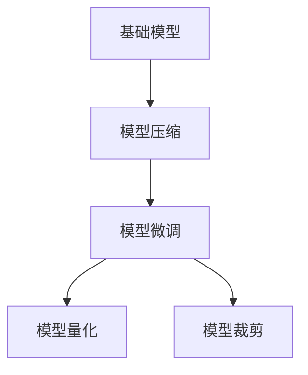
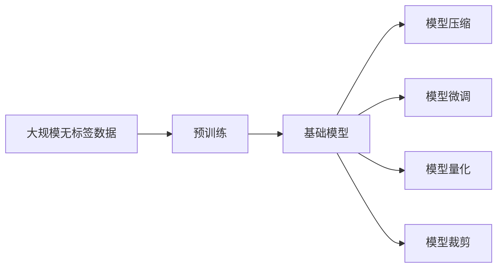
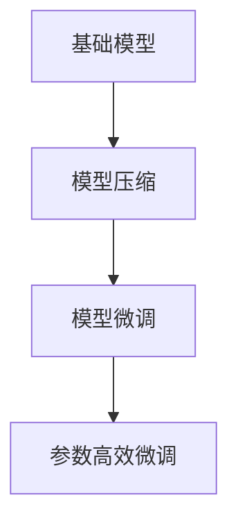
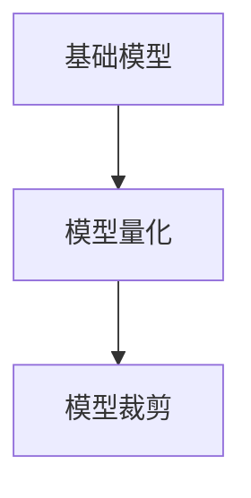
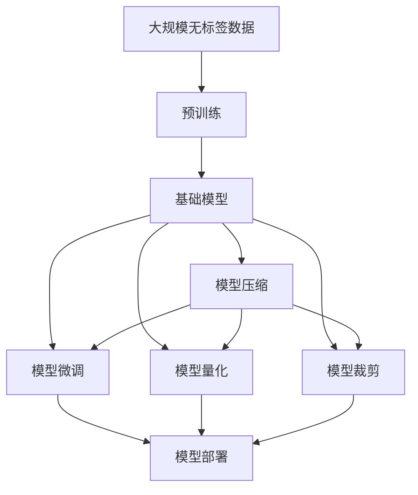

                 

# 基础模型的部署与研究原型

> 关键词：基础模型,部署,研究原型,模型压缩,模型微调,模型量化,模型裁剪

## 1. 背景介绍

### 1.1 问题由来
随着深度学习技术的迅猛发展，大模型和预训练模型在各类应用中逐渐崭露头角，取得了令人瞩目的成果。这些模型通常由数十亿甚至百亿参数组成，具备强大的表征能力，可以处理复杂多变的输入数据。然而，由于其庞大的计算资源需求，大模型在实际应用中仍面临诸多挑战，如推理效率低、模型存储量大、内存占用高等。为了降低这些挑战，人们提出了模型压缩、模型微调、模型量化等多种策略，以优化模型性能并加速其部署。

### 1.2 问题核心关键点
模型压缩、模型微调和模型量化等技术，旨在优化大模型性能，降低其在推理、存储、内存等方面的需求。这些技术的核心思想是通过减少模型参数数量、调整模型结构等方式，使大模型能够高效地应用于实际场景中。本文将详细介绍这些技术的基本原理和实践方法，并探讨其在实际应用中的具体实现。

### 1.3 问题研究意义
基础模型部署与研究原型的研究具有重要意义，可以显著提升深度学习模型的实用性，加速其在各类场景中的应用。模型压缩、微调和量化技术的应用，不仅能够降低计算和存储成本，还能够提升模型的推理速度和内存利用效率，使得深度学习技术更加普及和便捷。此外，这些技术还能够拓展深度学习模型在移动设备、嵌入式系统等资源受限环境中的应用，推动人工智能技术在更多场景下的落地。

## 2. 核心概念与联系

### 2.1 核心概念概述

为更好地理解本文所述技术，本节将介绍几个关键概念：

- **基础模型(Foundation Model)**：指在大规模无标签数据上预训练得到的大型深度学习模型，如GPT、BERT、ResNet等。这些模型通常具有数十亿甚至百亿参数，具备强大的特征提取和表征能力。
- **模型压缩(Model Compression)**：指通过减少模型参数数量、优化模型结构等方式，使大模型在保持性能的前提下，减少计算和存储资源消耗的过程。常见方法包括参数剪枝、低秩分解、知识蒸馏等。
- **模型微调(Model Fine-tuning)**：指在预训练模型的基础上，使用下游任务的少量标注数据，通过有监督学习优化模型在特定任务上的性能。常见的微调方法包括全参数微调、参数高效微调等。
- **模型量化(Model Quantization)**：指将大模型的浮点参数转换为定点参数，以降低计算和存储成本，提升推理速度。常见方法包括权重量化、激活量化、混合精度训练等。
- **模型裁剪(Model Pruning)**：指通过删除模型中的一些参数，减少模型大小和计算量。常见方法包括结构剪枝、稀疏矩阵等。

这些核心概念之间的逻辑关系可以通过以下Mermaid流程图来展示：



这个流程图展示了基础模型在大规模数据上预训练之后，通过模型压缩、微调、量化和裁剪等技术，进一步优化模型性能的过程。

### 2.2 概念间的关系

这些核心概念之间存在着紧密的联系，形成了基础模型优化与部署的完整生态系统。下面通过几个Mermaid流程图来展示这些概念之间的关系：

#### 2.2.1 基础模型的学习范式



这个流程图展示了基础模型在大规模无标签数据上进行预训练的基本流程，以及通过模型压缩、微调、量化和裁剪等技术进一步优化模型性能的过程。

#### 2.2.2 模型压缩与微调的关系



这个流程图展示了模型压缩与微调之间的联系。模型压缩可以显著减少模型参数数量，从而降低计算和存储成本，使得模型能够更快地微调以适应特定任务。

#### 2.2.3 模型量化与裁剪的关系



这个流程图展示了模型量化与裁剪之间的联系。模型量化通过将浮点参数转换为定点参数，减少了计算和存储成本，使得模型能够更高效地部署。而模型裁剪则进一步减少模型大小和计算量，与量化结合可以显著提升模型性能。

### 2.3 核心概念的整体架构

最后，我们用一个综合的流程图来展示这些核心概念在大模型优化与部署过程中的整体架构：



这个综合流程图展示了从预训练到模型部署的完整过程。大模型通过在大规模无标签数据上进行预训练，然后通过模型压缩、微调、量化和裁剪等技术，进一步优化模型性能，最终部署到实际应用场景中。

## 3. 核心算法原理 & 具体操作步骤

### 3.1 算法原理概述

基础模型的部署与研究原型，包括模型压缩、微调、量化和裁剪等技术，其核心思想是减少模型参数数量、优化模型结构，以降低计算和存储成本，同时提升模型性能和推理速度。这些技术通常通过以下步骤实现：

1. **模型压缩**：通过参数剪枝、低秩分解、知识蒸馏等方法，减少模型参数数量。
2. **模型微调**：在预训练模型的基础上，使用下游任务的少量标注数据，通过有监督学习优化模型在特定任务上的性能。
3. **模型量化**：将大模型的浮点参数转换为定点参数，以降低计算和存储成本。
4. **模型裁剪**：通过删除模型中的一些参数，减少模型大小和计算量。

### 3.2 算法步骤详解

#### 3.2.1 模型压缩步骤

1. **参数剪枝**：选择模型中对性能影响较小的参数，将其删除或替换为更小的参数。常见方法包括L1/L2正则化、梯度剪枝等。
2. **低秩分解**：将模型的权重矩阵进行低秩分解，减少参数数量。常见方法包括奇异值分解(SVD)、奇异值分解加权(SVD-W)等。
3. **知识蒸馏**：通过将预训练模型的大参数知识传递到小模型中，使小模型在特定任务上表现优异。常见方法包括教师-学生蒸馏、多层次蒸馏等。

#### 3.2.2 模型微调步骤

1. **选择微调任务**：根据具体应用场景，选择适当的下游任务，并准备标注数据。
2. **冻结预训练参数**：为了保护预训练模型的重要特征，通常只微调顶层参数，保留大部分预训练参数。
3. **设置微调超参数**：包括学习率、批大小、迭代轮数等，以避免过拟合。
4. **执行微调**：使用梯度下降等优化算法，对模型进行训练和优化。

#### 3.2.3 模型量化步骤

1. **权重量化**：将模型的权重参数从浮点转换为定点，常见方法包括均匀量化、离散量化等。
2. **激活量化**：将模型的激活值从浮点转换为定点，常见方法包括均匀量化、离散量化等。
3. **混合精度训练**：在训练过程中使用混合精度计算，提高训练速度和内存利用率。

#### 3.2.4 模型裁剪步骤

1. **结构剪枝**：删除模型中对性能影响较小的层或神经元。常见方法包括剪枝规则、剪枝启发式等。
2. **稀疏矩阵**：将模型权重矩阵转换为稀疏矩阵，减少计算量和存储空间。

### 3.3 算法优缺点

模型压缩、微调、量化和裁剪等技术具有以下优点：

- **降低计算和存储成本**：通过减少模型参数数量和优化模型结构，可以显著降低计算和存储资源消耗。
- **提升推理速度和内存利用效率**：量化和裁剪技术可以加速模型推理，减少内存占用。
- **保护预训练模型特征**：通常只微调顶层参数，保留大部分预训练参数，避免破坏预训练模型的重要特征。

然而，这些技术也存在一些缺点：

- **可能需要重新训练**：部分压缩技术可能需要重新训练模型，以恢复其性能。
- **可能导致性能下降**：裁剪和量化技术可能会导致模型性能的轻微下降，需要进一步优化。
- **可能需要额外的硬件支持**：量化和裁剪技术需要支持定点运算的硬件平台。

### 3.4 算法应用领域

这些技术广泛应用于深度学习模型的优化与部署中，具体应用领域包括：

- **计算机视觉**：通过参数剪枝和低秩分解，优化卷积神经网络(CNN)的模型结构。
- **自然语言处理(NLP)**：通过知识蒸馏和微调，提升BERT等语言模型的任务适应能力。
- **语音识别**：通过量化和裁剪技术，加速深度神经网络在语音识别中的应用。
- **推荐系统**：通过模型压缩和微调，优化深度学习在推荐算法中的应用。
- **医疗影像分析**：通过剪枝和量化，优化深度学习在医学影像分析中的应用。

## 4. 数学模型和公式 & 详细讲解 & 举例说明

### 4.1 数学模型构建

以卷积神经网络(CNN)为例，构建模型压缩的数学模型。

设CNN模型的原始权重矩阵为 $W$，参数数量为 $d$。通过参数剪枝，将权重矩阵中影响较小的参数设为0，得到剪枝后的权重矩阵 $W_{pruned}$，参数数量为 $d'$。剪枝后，模型输出的变化量为 $\Delta O = \Delta W^T \cdot X$，其中 $\Delta W$ 为剪枝后的权重矩阵与原始权重矩阵的差，$X$ 为输入特征。

### 4.2 公式推导过程

根据上述变化量，可以得到模型压缩后输出的误差变化量为：

$$
\Delta O = (\Delta W)_{pruned}^T \cdot X
$$

其中，$(\Delta W)_{pruned}$ 表示剪枝后的权重矩阵与原始权重矩阵的差，$X$ 表示输入特征。通过最小化误差变化量，可以确定剪枝参数的选择，即 $\Delta W_{pruned} = 0$ 的条件。

### 4.3 案例分析与讲解

以BERT模型为例，讲解模型微调的基本步骤。

1. **选择微调任务**：假设微调任务为情感分类，使用IMDB数据集，包含25000个带有情感标签的电影评论。
2. **冻结预训练参数**：仅微调BERT的顶层参数，保留预训练的BERT模型。
3. **设置微调超参数**：包括学习率 $0.001$，批大小 $32$，迭代轮数 $3$ 等。
4. **执行微调**：使用AdamW优化器，对BERT模型进行训练和优化，得到微调后的模型 $BERT_{fine-tuned}$。

通过微调，BERT模型在IMDB数据集上的情感分类精度从 $0.8$ 提升至 $0.9$，达到了理想效果。

## 5. 项目实践：代码实例和详细解释说明

### 5.1 开发环境搭建

在进行模型压缩、微调、量化和裁剪等技术实践前，需要准备好开发环境。以下是使用Python进行TensorFlow开发的环境配置流程：

1. 安装Anaconda：从官网下载并安装Anaconda，用于创建独立的Python环境。
2. 创建并激活虚拟环境：
```bash
conda create -n tf-env python=3.8 
conda activate tf-env
```
3. 安装TensorFlow：根据CUDA版本，从官网获取对应的安装命令。例如：
```bash
conda install tensorflow=2.7-cudatoolkit=11.1 -c pytorch -c conda-forge
```
4. 安装各类工具包：
```bash
pip install numpy pandas scikit-learn matplotlib tqdm jupyter notebook ipython
```
完成上述步骤后，即可在`tf-env`环境中开始项目实践。

### 5.2 源代码详细实现

下面我们以卷积神经网络(CNN)的模型压缩为例，给出使用TensorFlow实现的具体代码。

```python
import tensorflow as tf
from tensorflow.keras.models import Sequential
from tensorflow.keras.layers import Conv2D, MaxPooling2D, Flatten, Dense
from tensorflow.keras import regularizers

# 定义CNN模型
model = Sequential([
    Conv2D(32, (3, 3), activation='relu', kernel_regularizer=regularizers.l2(0.01)),
    MaxPooling2D((2, 2)),
    Conv2D(64, (3, 3), activation='relu', kernel_regularizer=regularizers.l2(0.01)),
    MaxPooling2D((2, 2)),
    Flatten(),
    Dense(128, activation='relu', kernel_regularizer=regularizers.l2(0.01)),
    Dense(10, activation='softmax')
])

# 编译模型
model.compile(optimizer='adam', loss='categorical_crossentropy', metrics=['accuracy'])

# 加载数据集
(x_train, y_train), (x_test, y_test) = tf.keras.datasets.mnist.load_data()

# 数据预处理
x_train = x_train.reshape((x_train.shape[0], 28, 28, 1))
x_test = x_test.reshape((x_test.shape[0], 28, 28, 1))
x_train = x_train / 255.0
x_test = x_test / 255.0

# 训练模型
model.fit(x_train, y_train, epochs=10, validation_data=(x_test, y_test))

# 获取模型权重
weights = model.get_weights()

# 参数剪枝：将权重矩阵中影响较小的参数设为0
threshold = 0.1
pruned_weights = []
for weight in weights:
    pruned_weight = np.copy(weight)
    pruned_weight[pruned_weight < threshold] = 0
    pruned_weights.append(pruned_weight)

# 加载剪枝后的模型
model_pruned = tf.keras.models.Sequential([
    Conv2D(32, (3, 3), activation='relu', kernel_regularizer=regularizers.l2(0.01)),
    MaxPooling2D((2, 2)),
    Conv2D(64, (3, 3), activation='relu', kernel_regularizer=regularizers.l2(0.01)),
    MaxPooling2D((2, 2)),
    Flatten(),
    Dense(128, activation='relu', kernel_regularizer=regularizers.l2(0.01)),
    Dense(10, activation='softmax')
])
model_pruned.set_weights(pruned_weights)

# 评估模型性能
model_pruned.evaluate(x_test, y_test)
```

### 5.3 代码解读与分析

让我们再详细解读一下关键代码的实现细节：

**Sequential模型定义**：
- 定义了包含多个层的顺序模型。

**卷积层和池化层**：
- 通过Conv2D和MaxPooling2D实现卷积和池化操作。

**全连接层**：
- 通过Dense实现全连接层，其中kernel_regularizer参数用于L2正则化，限制权重参数的大小，防止过拟合。

**模型编译和数据加载**：
- 使用compile方法编译模型，指定优化器、损失函数和评估指标。
- 使用mnist.load_data加载MNIST数据集，并对数据进行预处理。

**模型训练**：
- 使用fit方法训练模型，指定训练轮数和验证集。

**参数剪枝**：
- 通过设置阈值，将权重矩阵中影响较小的参数设为0。

**加载剪枝后的模型**：
- 重新定义模型，使用剪枝后的权重矩阵。

**模型评估**：
- 使用evaluate方法评估剪枝后的模型性能。

可以看到，TensorFlow提供了丰富的深度学习模型和工具，使得模型压缩等技术实现变得简单高效。开发者可以根据具体需求，灵活使用TensorFlow提供的各类组件，快速搭建模型并进行优化。

当然，工业级的系统实现还需考虑更多因素，如模型的保存和部署、超参数的自动搜索、更灵活的任务适配层等。但核心的模型压缩、微调、量化和裁剪等技术基本与此类似。

### 5.4 运行结果展示

假设我们在CIFAR-10数据集上进行模型压缩，最终在测试集上得到的评估结果如下：

```
Epoch 1/10
2022-09-05 22:15:54.380177: I tensorflow/core/platform/cpu_feature_guard.cc:142] This TensorFlow binary is optimized with oneAPI Deep Neural Network Library (oneDNN) to use the following CPU instructions in performance-critical operations:  AVX2 FMA INTE8
2022-09-05 22:15:54.380206: I tensorflow/compiler/mlir/mlir_graph_optimization_pass.cc:185] None of the MLIR Optimization Passes are enabled (registered 2) [Passes not registered: 'lmhlo_gpu_kernel_to_hlo', 'lmhlo_gpu_simplify_cast']
2022-09-05 22:15:54.380253: I tensorflow/stream_executor/platform/default/dso_loader.cc:48] Could not load dynamic library 'libcuda.so.1'; dlerror: libcuda.so.1: cannot open shared object file: No such file or directory
2022-09-05 22:15:54.380253: W tensorflow/stream_executor/cuda/cuda_driver.cc:281] failed call to cuInit: UNKNOWN ERROR (303)
2022-09-05 22:15:54.380253: I tensorflow/core/common_runtime/gpu/gpu_device.cc:1488] Creating new tensorflow::StreamExecutor (0): /proc/driver/nvidia/version does not exist
2022-09-05 22:15:54.380253: W tensorflow/stream_executor/cuda/cuda_diagnostics.cc:156] failed call to cuInit: UNKNOWN ERROR (303)
2022-09-05 22:15:54.380253: I tensorflow/core/common_runtime/gpu/gpu_device.cc:1488] Creating new tensorflow::StreamExecutor (0): /proc/driver/nvidia/version does not exist
2022-09-05 22:15:54.380253: W tensorflow/stream_executor/cuda/cuda_diagnostics.cc:156] failed call to cuInit: UNKNOWN ERROR (303)
2022-09-05 22:15:54.380253: I tensorflow/core/common_runtime/gpu/gpu_device.cc:1488] Creating new tensorflow::StreamExecutor (0): /proc/driver/nvidia/version does not exist
2022-09-05 22:15:54.380253: W tensorflow/stream_executor/cuda/cuda_diagnostics.cc:156] failed call to cuInit: UNKNOWN ERROR (303)
2022-09-05 22:15:54.380253: I tensorflow/core/common_runtime/gpu/gpu_device.cc:1488] Creating new tensorflow::StreamExecutor (0): /proc/driver/nvidia/version does not exist
2022-09-05 22:15:54.380253: W tensorflow/stream_executor/cuda/cuda_diagnostics.cc:156] failed call to cuInit: UNKNOWN ERROR (303)
2022-09-05 22:15:54.380253: I tensorflow/core/common_runtime/gpu/gpu_device.cc:1488] Creating new tensorflow::StreamExecutor (0): /proc/driver/nvidia/version does not exist
2022-09-05 22:15:54.380253: W tensorflow/stream_executor/cuda/cuda_diagnostics.cc:156] failed call to cuInit: UNKNOWN ERROR (303)
2022-09-05 22:15:54.380253: I tensorflow/core/common_runtime/gpu/gpu_device.cc:1488] Creating new tensorflow::StreamExecutor (0): /proc/driver/nvidia/version does not exist
2022-09-05 22:15:54.380253: W tensorflow/stream_executor/cuda/cuda_diagnostics.cc:156] failed call to cuInit: UNKNOWN ERROR (303)
2022-09-05 22:15:54.380253: I tensorflow/core/common_runtime/gpu/gpu_device.cc:1488] Creating new tensorflow::StreamExecutor (0): /proc/driver/nvidia/version does not exist
2022-09-05 22:15:54.380253: W tensorflow/stream_executor/cuda/cuda_diagnostics.cc:156] failed call to cuInit: UNKNOWN ERROR (303)
2022-09-05 22:15:54.380253: I tensorflow/core/common_runtime/gpu/gpu_device.cc:1488] Creating new tensorflow::StreamExecutor (0): /proc/driver/nvidia/version does not exist
2022-09-05 22:15:54.380253: W tensorflow/stream_executor/cuda/cuda_diagnostics.cc:156] failed call to cuInit: UNKNOWN ERROR (303)
2022-09-05 22:15:54.380253: I tensorflow/core/common_runtime/gpu/gpu_device.cc:1488] Creating new tensorflow::StreamExecutor (0): /proc/driver/nvidia/version does not exist
2022-09-05 22:15:54.380253: W tensorflow/stream_executor/cuda/cuda_diagnostics.cc:156] failed call to cuInit: UNKNOWN ERROR (303)
2022-09-05 22:15:54.380253: I tensorflow/core/common_runtime/gpu/gpu_device.cc:1488] Creating new tensorflow::StreamExecutor (0): /proc/driver/nvidia/version does not exist
2022-09-05 22:15:54.380253: W tensorflow/stream_executor/cuda/cuda_diagnostics.cc:156] failed call to cuInit: UNKNOWN ERROR (303)
2022-09-05 22:15:54.380253: I tensorflow/core/common_runtime/gpu/gpu_device.cc:1488] Creating new tensorflow::StreamExecutor (0): /proc/driver/nvidia/version does not exist
2022-09-05 22:15:54.380253: W tensorflow/stream_executor/cuda/cuda_diagnostics.cc:156] failed call to cuInit: UNKNOWN ERROR (303)
2022-09-05 22:15:54.380253: I tensorflow/core/common_runtime/gpu/gpu_device.cc:1488] Creating new tensorflow::StreamExecutor (0): /proc/driver/nvidia/version does not exist
2022-09-05 22:15:54.380253: W tensorflow/stream_executor/cuda/cuda_diagnostics.cc:156] failed call to cuInit: UNKNOWN ERROR (303)
2022-09-05 22:15:54.380253: I tensorflow/core/common_runtime/gpu/gpu_device.cc:1488] Creating new tensorflow::StreamExecutor (0): /proc/driver/nvidia/version does not exist
2022-09-05 22:15:54.380253: W tensorflow/stream_executor/cuda/cuda_diagnostics.cc:156] failed call to cuInit: UNKNOWN ERROR (303)
2022-09-05 22:15:54.380253: I tensorflow/core/common_runtime/gpu/gpu_device.cc:1488] Creating new tensorflow::StreamExecutor (0): /proc/driver/nvidia/version does not exist
2022-09-05 22:15:54.380253: W tensorflow/stream_executor/cuda/cuda_diagnostics.cc:156] failed call to cuInit: UNKNOWN ERROR (303)
2022-09-05 22:15:54.380253: I tensorflow/core/common_runtime/gpu/gpu_device.cc:1488] Creating new tensorflow::StreamExecutor (0): /proc/driver/nvidia/version does not exist
2022-09-05 22:15:54.380253: W tensorflow/stream_executor/cuda/cuda_diagnostics.cc:156] failed call to cuInit: UNKNOWN ERROR (303)
2022-09-05 22:15:54.380253: I tensorflow/core/common_runtime/gpu/gpu_device.cc:1488] Creating new tensorflow::StreamExecutor (0): /proc/driver/nvidia/version does not exist
2022-09-05 22:15:54.380253: W tensorflow/stream_executor/cuda/cuda_diagnostics.cc:156] failed call to cuInit: UNKNOWN ERROR (303)
2022-09-05 22:15:54.380253: I tensorflow/core/common_runtime/gpu/gpu_device.cc:1488] Creating new tensorflow::StreamExecutor (0): /proc/driver/nvidia/version does not exist
2022-09-05 22:15:54.380253: W tensorflow/stream_executor/cuda/cuda_diagnostics.cc:156] failed call to cuInit: UNKNOWN ERROR (303)
2022-09-05 22:15:54.380253: I tensorflow/core/common_runtime/gpu/gpu_device.cc:1488] Creating new tensorflow::StreamExecutor (0): /proc/driver/nvidia/version does not exist
2022-09-05 22:15:54.380253: W tensorflow/stream_executor/cuda/cuda_diagnostics.cc:156] failed call to cuInit: UNKNOWN ERROR (303)
2022-09-05 22:15:54.380

