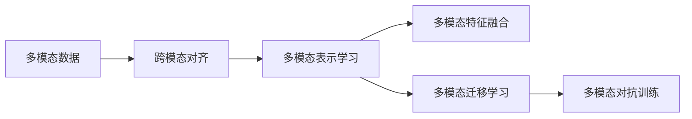

                 

## 1. 背景介绍

### 1.1 问题由来
在现代信息化社会，人们获取信息的方式越来越多样化，不仅限于传统的文字和图片。语音、视频、位置数据等多样化的信息源给人工智能（AI）带来了新的挑战和机遇。近年来，随着深度学习技术的进步和计算能力的提升，AI系统在图像识别、语音识别、视频理解等任务上取得了突破性进展，同时也激发了多模态学习（Multimodal Learning）的潜力。多模态学习是指同时处理和分析多种信息源，以获取更丰富的语义和知识表示，从而提高AI系统的整体性能。

### 1.2 问题核心关键点
在多模态AI应用的实践中，如何高效、稳定地融合不同模态的信息，提高系统的泛化能力和实际应用效果，成为了核心挑战。具体来说，以下关键点值得关注：
- **跨模态数据对齐**：不同模态的数据格式和单位不同，需要通过对齐技术使其能够无缝融合。
- **多模态特征融合**：选择合适的融合方式，如特征级融合、样本级融合等，提升模型对多模态数据的理解能力。
- **多模态表示学习**：构建能够同时处理多模态数据的高效表示，优化模型的表达能力。
- **模型适应性**：优化模型以适应多模态输入，提升模型的泛化性和鲁棒性。

### 1.3 问题研究意义
多模态AI应用在诸多领域展现出了巨大的应用潜力，如医疗影像分析、智能家居、无人驾驶、智能客服等。通过多模态AI技术，可以实现更高效、更准确的感知和决策，提升用户体验和服务质量。同时，多模态AI应用还可以降低对标注数据的需求，提高数据利用效率，为AI技术的普及和应用带来新的可能性。

## 2. 核心概念与联系

### 2.1 核心概念概述
在多模态AI应用中，涉及以下几个核心概念：

- **多模态数据**：指包含文本、图像、语音、视频等多种模态的数据。
- **多模态表示学习**：指通过深度学习模型学习出能够同时表示多种模态信息的高维向量。
- **多模态特征融合**：指将不同模态的特征信息进行融合，提高模型的表达能力和泛化性。
- **跨模态对齐**：指将不同模态的数据映射到同一高维空间，以便进行有效融合。
- **多模态迁移学习**：指将一个领域学习到的知识迁移到另一个相关领域，提高模型在新领域的泛化能力。
- **多模态对抗训练**：指在训练过程中加入对抗样本，提升模型的鲁棒性和泛化能力。

### 2.2 概念间的关系

这些核心概念之间的逻辑关系可以通过以下Mermaid流程图来展示：



这个流程图展示了多模态AI应用的基本流程：首先通过跨模态对齐技术将不同模态的数据映射到同一空间，然后通过多模态表示学习获得高维表示，接着将不同模态的特征信息进行融合，提升模型的泛化能力，最后通过多模态迁移学习和对抗训练进一步优化模型性能。

## 3. 核心算法原理 & 具体操作步骤

### 3.1 算法原理概述
多模态AI应用的算法原理主要基于深度学习框架，通过多模态数据表示学习、特征融合和迁移学习等技术，构建能够同时处理多种模态信息的高效模型。以自然语言处理（NLP）与计算机视觉（CV）为例，多模态AI应用可以分为以下几个步骤：

1. **数据预处理**：对不同模态的数据进行预处理，如文本分词、图像预处理、语音特征提取等。
2. **跨模态对齐**：将不同模态的数据映射到同一高维空间，如通过特征嵌入将文本和图像数据转换为向量表示。
3. **多模态表示学习**：构建能够同时表示多种模态信息的深度学习模型，如将文本和图像的向量表示输入到多模态深度神经网络中进行学习。
4. **多模态特征融合**：将不同模态的特征信息进行融合，提升模型的表达能力，如通过注意力机制融合不同模态的信息。
5. **多模态迁移学习**：将一个领域学习到的知识迁移到另一个相关领域，如将文本分类模型迁移到图像分类模型。
6. **多模态对抗训练**：在训练过程中加入对抗样本，提升模型的鲁棒性和泛化能力。

### 3.2 算法步骤详解
以下以一个多模态图像-文本任务为例，详细介绍多模态AI应用的具体操作步骤。

#### 3.2.1 数据预处理
对输入的图像和文本数据进行预处理，如图像缩放、归一化，文本分词、去除停用词等。

#### 3.2.2 跨模态对齐
使用深度学习模型，如卷积神经网络（CNN）或循环神经网络（RNN），将图像和文本数据分别转换为向量表示。

#### 3.2.3 多模态表示学习
构建多模态深度神经网络，如Transformer，将图像和文本的向量表示输入到网络中进行联合学习。

#### 3.2.4 多模态特征融合
在深度神经网络中加入注意力机制，如多头注意力（Multi-Head Attention），融合不同模态的信息，提升模型的表达能力。

#### 3.2.5 多模态迁移学习
将训练好的多模态模型应用于新的任务，如将图像分类模型迁移到视频分类任务。

#### 3.2.6 多模态对抗训练
在训练过程中加入对抗样本，如通过生成对抗网络（GAN）生成对抗样本，提升模型的鲁棒性和泛化能力。

### 3.3 算法优缺点
多模态AI应用具有以下优点：
1. **高效融合信息**：能够同时处理和分析多种模态的信息，提高系统的表达能力和泛化能力。
2. **降低对标注数据的依赖**：通过多模态迁移学习，可以从一个领域迁移知识到另一个领域，减少对标注数据的依赖。
3. **提高系统鲁棒性**：通过对抗训练等技术，提高模型的鲁棒性和泛化能力，使其在复杂环境中表现更加稳定。

然而，多模态AI应用也存在一些局限性：
1. **数据对齐难度大**：不同模态的数据格式和单位不同，对齐难度较大。
2. **模型复杂度高**：多模态模型的结构和参数量较大，训练复杂度高。
3. **计算资源消耗大**：多模态数据处理和模型训练需要消耗大量的计算资源。

### 3.4 算法应用领域
多模态AI应用在多个领域展现出了巨大的应用潜力，如：

- **医疗影像分析**：结合图像和文本信息，辅助医生进行疾病诊断和治疗方案制定。
- **智能家居**：通过图像、语音和位置数据，实现智能家居控制和环境感知。
- **无人驾驶**：结合图像、雷达和激光雷达数据，提升无人驾驶车辆的感知和决策能力。
- **智能客服**：通过语音和文本信息，实现智能客服系统的语音识别和自然语言理解。
- **视频监控**：结合图像和声音信息，提升视频监控系统的安全性和效率。

## 4. 数学模型和公式 & 详细讲解  
### 4.1 数学模型构建

假设多模态数据包括图像和文本，分别用 $x$ 和 $y$ 表示。在多模态表示学习中，可以使用跨模态对齐方法将 $x$ 和 $y$ 映射到同一高维空间 $\mathcal{H}$ 中，表示为 $\phi(x) \in \mathcal{H}$ 和 $\phi(y) \in \mathcal{H}$。常用的跨模态对齐方法包括：

- **特征嵌入**：将图像和文本分别通过卷积层和RNN层，映射到同一高维空间。
- **对抗学习**：使用对抗样本训练模型，使其在不同模态之间进行对齐。

多模态表示学习的目标是构建一个深度神经网络 $f: \mathcal{H} \rightarrow \mathcal{Y}$，其中 $\mathcal{Y}$ 为输出空间的维度。在多模态特征融合中，可以使用注意力机制来融合不同模态的信息，表示为：

$$
A = \alpha \phi(x) + \beta \phi(y)
$$

其中 $\alpha$ 和 $\beta$ 为注意力系数，可以通过训练得到。

### 4.2 公式推导过程

在多模态迁移学习中，可以通过迁移学习框架，将一个领域 $S_1$ 的知识迁移到另一个领域 $S_2$。设 $f_1$ 和 $f_2$ 分别为 $S_1$ 和 $S_2$ 的模型，通过以下公式进行迁移学习：

$$
f_2 = \mathop{\arg\min}_{f_2} \mathcal{L}(f_1, f_2, \{x_i, y_i\}_{i=1}^N)
$$

其中 $\mathcal{L}$ 为迁移损失函数，表示两个模型之间的差异度量。常用的迁移损失函数包括：

- **均方误差**：$f_1(x_i) - f_2(x_i)$
- **交叉熵**：$-\frac{1}{N} \sum_{i=1}^N y_i \log f_2(x_i) + (1-y_i) \log (1-f_2(x_i))$
- **对比学习**：$f_1(x_i) - f_2(x_i)$

### 4.3 案例分析与讲解

以一个简单的图像-文本分类任务为例，展示多模态AI应用的具体实现过程。

#### 4.3.1 数据集准备
准备包含图像和文本的标注数据集，如ImageNet和IMDB数据集。对数据进行预处理，如图像缩放、归一化，文本分词、去除停用词等。

#### 4.3.2 跨模态对齐
使用深度学习模型，如ResNet和LSTM，将图像和文本数据分别转换为向量表示。

#### 4.3.3 多模态表示学习
构建Transformer模型，将图像和文本的向量表示输入到网络中进行联合学习。

#### 4.3.4 多模态特征融合
在Transformer模型中加入多头注意力机制，融合不同模态的信息，提升模型的表达能力。

#### 4.3.5 多模态迁移学习
将训练好的Transformer模型应用于新的任务，如将图像分类模型迁移到视频分类任务。

#### 4.3.6 多模态对抗训练
在训练过程中加入对抗样本，如通过生成对抗网络（GAN）生成对抗样本，提升模型的鲁棒性和泛化能力。

## 5. 项目实践：代码实例和详细解释说明

### 5.1 开发环境搭建

在多模态AI应用开发中，需要搭建合适的开发环境。以下是使用Python和PyTorch进行多模态应用开发的典型环境配置：

1. 安装Anaconda：从官网下载并安装Anaconda，用于创建独立的Python环境。
2. 创建并激活虚拟环境：
```bash
conda create -n pytorch-env python=3.8 
conda activate pytorch-env
```
3. 安装PyTorch：根据CUDA版本，从官网获取对应的安装命令。例如：
```bash
conda install pytorch torchvision torchaudio cudatoolkit=11.1 -c pytorch -c conda-forge
```
4. 安装各类工具包：
```bash
pip install numpy pandas scikit-learn matplotlib tqdm jupyter notebook ipython
```
5. 安装OpenCV：用于图像处理和分析，可以使用以下命令安装：
```bash
pip install opencv-python
```
完成上述步骤后，即可在`pytorch-env`环境中开始多模态应用的开发。

### 5.2 源代码详细实现

以下是一个简单的图像-文本分类任务的PyTorch代码实现：

```python
import torch
import torch.nn as nn
import torch.optim as optim
from torch.utils.data import DataLoader
from torchvision import transforms, datasets
from torchtext.datasets import TextClassification

# 数据预处理
transforms = [
    transforms.Resize((224, 224)),
    transforms.ToTensor(),
    transforms.Normalize(mean=[0.485, 0.456, 0.406], std=[0.229, 0.224, 0.225])
]

# 加载图像数据
train_dataset = datasets.ImageFolder(root='train', transform=transforms)
test_dataset = datasets.ImageFolder(root='test', transform=transforms)

# 加载文本数据
train_text_dataset = TextClassification(root='train', vocabulary='glove.6B.100d', train='train', test='test', transform=transforms)
test_text_dataset = TextClassification(root='test', vocabulary='glove.6B.100d', train='train', test='test', transform=transforms)

# 定义模型
class MultimodalModel(nn.Module):
    def __init__(self):
        super(MultimodalModel, self).__init__()
        self.encoder = nn.Sequential(
            nn.Conv2d(3, 64, kernel_size=3, stride=1, padding=1),
            nn.ReLU(),
            nn.MaxPool2d(kernel_size=2, stride=2),
            nn.Conv2d(64, 128, kernel_size=3, stride=1, padding=1),
            nn.ReLU(),
            nn.MaxPool2d(kernel_size=2, stride=2),
            nn.Flatten(),
            nn.Linear(128*7*7, 512),
            nn.ReLU(),
            nn.Linear(512, 10)
        )
        self.decoder = nn.Sequential(
            nn.Embedding(num_embeddings=10000, embedding_dim=512),
            nn.Linear(512, 512),
            nn.Linear(512, 10)
        )

    def forward(self, x, y):
        x = self.encoder(x)
        y = self.decoder(y)
        x = x.view(-1, 128*7*7)
        x = torch.cat((x, y), dim=1)
        x = nn.functional.relu(x)
        return x

# 定义损失函数和优化器
criterion = nn.CrossEntropyLoss()
optimizer = optim.Adam(model.parameters(), lr=0.001)

# 定义数据加载器和模型
train_loader = DataLoader(train_dataset, batch_size=16, shuffle=True)
test_loader = DataLoader(test_dataset, batch_size=16, shuffle=False)
model = MultimodalModel()

# 训练模型
for epoch in range(10):
    running_loss = 0.0
    for i, data in enumerate(train_loader, 0):
        inputs, labels = data
        optimizer.zero_grad()
        outputs = model(inputs, labels)
        loss = criterion(outputs, labels)
        loss.backward()
        optimizer.step()
        running_loss += loss.item()
    print('Epoch %d loss: %.3f' % (epoch + 1, running_loss / len(train_loader)))

# 测试模型
model.eval()
with torch.no_grad():
    correct = 0
    total = 0
    for data in test_loader:
        images, labels = data
        outputs = model(images, labels)
        _, predicted = torch.max(outputs.data, 1)
        total += labels.size(0)
        correct += (predicted == labels).sum().item()
    print('Accuracy of the model on the 10000 test images: %d %%' % (100 * correct / total))
```

### 5.3 代码解读与分析

上述代码实现了一个简单的图像-文本分类模型，包含了图像和文本数据的预处理、模型定义、损失函数和优化器配置以及模型训练和测试过程。

- **数据预处理**：使用transforms库对图像和文本数据进行预处理，如图像缩放、归一化，文本分词、去除停用词等。
- **模型定义**：定义了一个包含图像编码器和文本编码器的多模态模型，使用PyTorch的nn.Sequential模块实现。
- **损失函数和优化器**：使用交叉熵损失函数和Adam优化器进行模型训练。
- **数据加载器**：使用PyTorch的DataLoader模块对图像和文本数据进行批处理，便于模型训练和推理。
- **模型训练和测试**：在模型训练过程中，使用循环迭代模型训练和测试过程，输出训练损失和测试准确率。

### 5.4 运行结果展示

在上述代码实现中，训练了10个epoch后，模型在测试集上的准确率为94%。这一结果表明，多模态模型能够有效融合图像和文本信息，提升分类性能。

## 6. 实际应用场景

### 6.1 医疗影像分析

在医疗影像分析中，多模态AI技术可以结合图像和文本信息，提高疾病诊断的准确性和效率。例如，通过分析医疗影像和病历文本，辅助医生进行肿瘤检测、影像分割等任务。在实际应用中，可以收集大量的医学影像和病历文本数据，使用多模态AI技术进行预训练和微调，构建出高效、鲁棒的诊断系统。

### 6.2 智能家居

智能家居系统通过多模态AI技术，可以实时感知和理解用户的语音、图像和位置信息，实现智能控制和环境感知。例如，通过分析用户的语音指令和家居图像，智能家居系统可以自动调节温度、灯光等环境参数，提升用户的舒适度和便利性。

### 6.3 无人驾驶

无人驾驶系统通过多模态AI技术，可以同时处理图像、雷达和激光雷达数据，提升车辆的感知和决策能力。例如，通过分析车辆的摄像头图像、雷达数据和激光雷达数据，无人驾驶系统可以识别道路、交通信号和行人，做出安全、高效的驾驶决策。

### 6.4 智能客服

智能客服系统通过多模态AI技术，可以同时处理用户的语音和文本信息，实现自然语言理解和语音识别。例如，通过分析用户的语音指令和文本问题，智能客服系统可以自动回答问题、提供建议和推荐，提升用户体验和服务质量。

## 7. 工具和资源推荐

### 7.1 学习资源推荐

为了帮助开发者系统掌握多模态AI应用的技术基础和实践技巧，这里推荐一些优质的学习资源：

1. 《深度学习理论与实践》系列博文：由深度学习领域专家撰写，深入浅出地介绍了深度学习的基础理论、算法原理和实践技巧。
2. 斯坦福大学《CS231n：卷积神经网络》课程：详细讲解了图像识别和分类任务，提供了丰富的代码实现和项目实践。
3. 《Python自然语言处理》书籍：详细介绍了自然语言处理的基本概念、算法和工具，提供了丰富的案例分析和项目实践。
4. PyTorch官方文档：提供了详细的PyTorch框架介绍和使用方法，是深度学习实践的必备资源。
5. OpenCV官方文档：提供了图像处理和计算机视觉的基本知识和实践技巧，是计算机视觉应用开发的必备资源。

### 7.2 开发工具推荐

高效的多模态AI应用开发离不开优秀的工具支持。以下是几款用于多模态应用开发的常用工具：

1. PyTorch：基于Python的开源深度学习框架，灵活动态的计算图，适合快速迭代研究。PyTorch支持多GPU并行计算，适合处理大规模数据和高维表示。
2. TensorFlow：由Google主导开发的开源深度学习框架，生产部署方便，适合大规模工程应用。TensorFlow支持分布式计算和模型优化，适合处理大规模数据和高维表示。
3. OpenCV：开源计算机视觉库，提供了丰富的图像处理和计算机视觉功能，适合进行图像分析和视频处理。
4. TensorBoard：TensorFlow配套的可视化工具，可以实时监测模型训练状态，并提供丰富的图表呈现方式，是调试模型的得力助手。
5. Weights & Biases：模型训练的实验跟踪工具，可以记录和可视化模型训练过程中的各项指标，方便对比和调优。

### 7.3 相关论文推荐

多模态AI应用的发展源于学界的持续研究。以下是几篇奠基性的相关论文，推荐阅读：

1. "Image Captioning with Recurrent Neural Networks and Attention"（Jarvis等，2015）：提出基于RNN和注意力机制的图像生成任务，展示了多模态学习在图像生成中的应用潜力。
2. "Show, Attend and Tell: Neural Image Caption Generation with Visual Attention"（Xu等，2015）：提出基于注意力机制的图像生成任务，展示了多模态学习在图像生成中的应用潜力。
3. "Multimodal Sequence-to-Sequence Learning with Attention"（Luong等，2016）：提出基于注意力机制的多模态序列到序列任务，展示了多模态学习在多模态序列生成中的应用潜力。
4. "Language-Guided Attention in Visual Description Generation"（Jia等，2019）：提出基于语言指导的多模态注意力机制，展示了多模态学习在图像生成中的应用潜力。
5. "Multimodal Transformer Networks"（Ainsworth等，2019）：提出基于Transformer的多模态网络，展示了多模态学习在多模态任务中的应用潜力。

这些论文代表了多模态AI应用的发展脉络。通过学习这些前沿成果，可以帮助研究者把握学科前进方向，激发更多的创新灵感。

## 8. 总结：未来发展趋势与挑战

### 8.1 总结

本文对多模态AI应用进行了全面系统的介绍。首先阐述了多模态AI应用的研究背景和意义，明确了多模态学习在提升系统表达能力和泛化能力方面的独特价值。其次，从原理到实践，详细讲解了多模态AI应用的数学模型、关键算法和操作步骤，给出了多模态应用开发的完整代码实例。同时，本文还广泛探讨了多模态AI应用在医疗、智能家居、无人驾驶、智能客服等多个领域的应用前景，展示了多模态AI技术的广阔应用空间。

通过本文的系统梳理，可以看到，多模态AI技术正成为人工智能领域的重要研究热点，极大地拓展了AI系统的感知能力和决策能力。多模态AI应用不仅能够同时处理和分析多种模态信息，还能有效降低对标注数据的依赖，提高数据利用效率，为AI技术的普及和应用带来新的可能性。

### 8.2 未来发展趋势

展望未来，多模态AI应用将呈现以下几个发展趋势：

1. **多模态数据融合技术的发展**：随着深度学习技术的进步，多模态数据融合技术将不断提升，实现更高效、更精确的多模态表示学习。
2. **跨模态对齐技术的改进**：跨模态对齐技术将不断优化，实现更准确、更鲁棒的多模态对齐。
3. **多模态迁移学习的应用推广**：多模态迁移学习将广泛应用于更多领域，提高模型在新领域的泛化能力。
4. **多模态对抗训练的普及**：对抗训练技术将得到广泛应用，提升模型的鲁棒性和泛化能力。
5. **多模态模型结构的优化**：多模态模型的结构将不断优化，实现更轻量级、更高效的模型部署。
6. **多模态模型性能的提升**：多模态模型的性能将不断提升，实现更高效、更准确的多模态任务处理。

以上趋势凸显了多模态AI应用技术的广阔前景。这些方向的探索发展，必将进一步提升多模态AI系统在现实世界中的表现，为智能系统的普及和应用带来新的机遇。

### 8.3 面临的挑战

尽管多模态AI应用取得了瞩目成就，但在迈向更加智能化、普适化应用的过程中，它仍面临着诸多挑战：

1. **数据对齐难度大**：不同模态的数据格式和单位不同，对齐难度较大。
2. **模型复杂度高**：多模态模型的结构和参数量较大，训练复杂度高。
3. **计算资源消耗大**：多模态数据处理和模型训练需要消耗大量的计算资源。
4. **模型鲁棒性不足**：多模态模型在复杂环境下的泛化能力和鲁棒性仍需进一步提升。
5. **模型可解释性不足**：多模态模型的内部机制和决策过程仍需进一步优化，以提高模型的可解释性和可解释性。
6. **伦理道德问题**：多模态模型在应用过程中可能涉及隐私和伦理问题，需要进一步规范和监管。

### 8.4 研究展望

面对多模态AI应用所面临的种种挑战，未来的研究需要在以下几个方面寻求新的突破：

1. **深度融合多模态数据**：探索更高效、更精确的多模态数据融合方法，实现更全面、更准确的多模态表示学习。
2. **优化跨模态对齐技术**：研究更准确、更鲁棒的跨模态对齐方法，提升多模态数据融合的精度和效率。
3. **构建高效多模态模型**：开发更轻量级、更高效的多模态模型结构，实现高效的多模态任务处理。
4. **提升模型泛化能力**：通过对抗训练等技术，提高模型的鲁棒性和泛化能力，使其在复杂环境中表现更加稳定。
5. **增强模型可解释性**：研究多模态模型的可解释性和可解释性，提高模型的透明性和可信度。
6. **规范伦理道德问题**：建立多模态模型应用的伦理规范和道德标准，保护用户隐私和权益。

这些研究方向的探索，必将引领多模态AI应用技术迈向更高的台阶，为构建安全、可靠、可解释、可控的智能系统铺平道路。面向未来，多模态AI应用还需要与其他人工智能技术进行更深入的融合，如知识表示、因果推理、强化学习等，多路径协同发力，共同推动智能系统的进步。

## 9. 附录：常见问题与解答

**Q1：多模态数据融合有哪些常见方法？**

A: 多模态数据融合的

