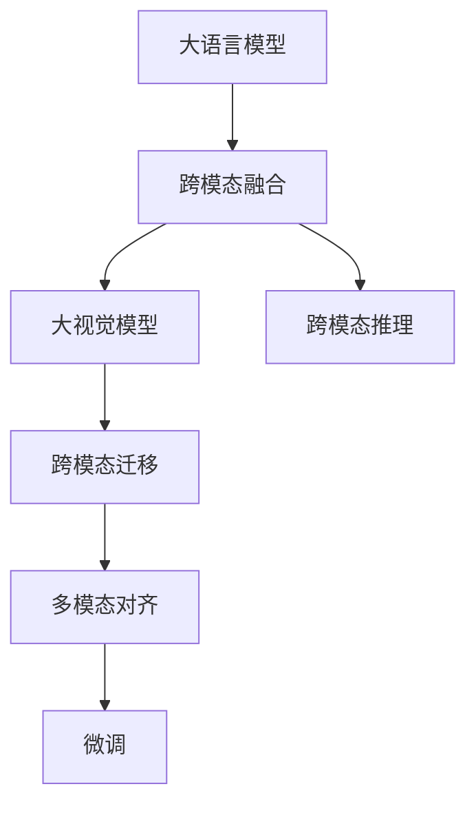
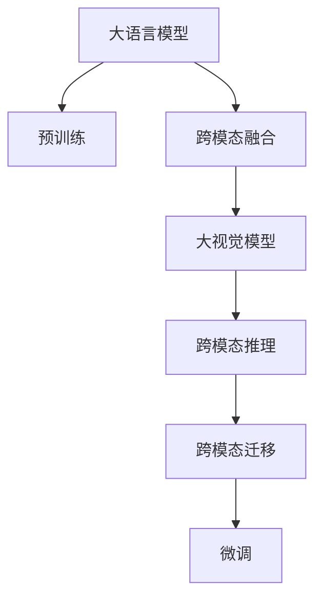
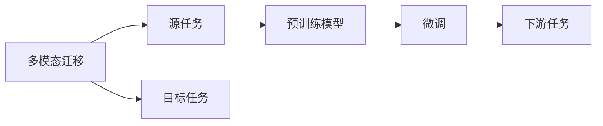
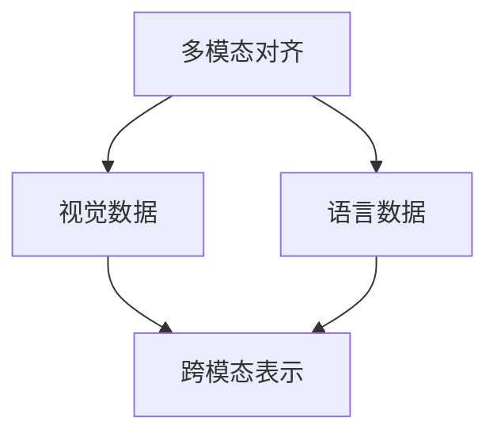
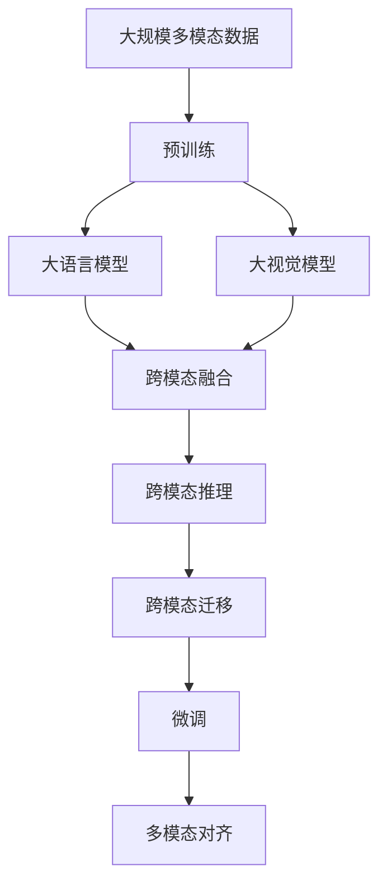

                 

# 多模态大模型：技术原理与实战 OpenAI的成长并非一帆风顺

> 关键词：多模态大模型,大语言模型,计算机视觉,自然语言处理,技术原理,微调,实战,OpenAI

## 1. 背景介绍

### 1.1 问题由来
近年来，人工智能（AI）技术在多个领域取得了显著进展，尤其是在计算机视觉和自然语言处理（NLP）方面。传统单模态模型通常只能处理单一类型的数据（如文本或图像），难以跨越不同模态进行理解和推理。为了克服这一限制，研究人员开始探索多模态大模型，即能够同时处理多种模态数据（如文本、图像、语音等）的大规模预训练模型。

多模态大模型通过在大规模、多模态数据集上进行预训练，学习到丰富的跨模态表示，能够在大规模图像、语音、文本等多种数据上进行理解和生成。OpenAI的DALL·E和ViT-G等模型即是典型代表，它们通过将视觉和语言模态的表示相结合，展现了强大的跨模态推理能力。

### 1.2 问题核心关键点
多模态大模型技术涉及到以下几个核心问题：
- 跨模态融合：如何将不同模态的数据融合到统一的空间表示中。
- 跨模态推理：如何在大规模多模态数据上进行高效的推理和生成。
- 跨模态迁移：如何在特定任务上对预训练模型进行微调。
- 多模态对齐：如何对齐不同模态的数据，使得模型能够正确理解跨模态数据。

为了解决这些问题，OpenAI等公司通过预训练-微调（Pre-training & Fine-tuning）的方法，构建了强大的多模态大模型，并在多个实际应用中取得了优异性能。

### 1.3 问题研究意义
多模态大模型技术对推动AI在更广泛场景下的应用具有重要意义：
- 拓展应用边界：通过多模态融合，模型能够在视觉、文本、语音等多种数据上进行推理，拓展了AI技术的边界。
- 提高性能：多模态数据融合后，模型能够更全面、准确地理解任务，从而提高任务执行的性能。
- 促进技术整合：多模态大模型有助于将视觉、语音、文本等多种数据和技术整合在一起，形成更强大的智能系统。
- 促进产业应用：多模态大模型能够更好地服务于自动驾驶、智慧医疗、智能客服等多个产业应用，推动AI技术的产业化进程。

## 2. 核心概念与联系

### 2.1 核心概念概述

为更好地理解多模态大模型的技术原理与实战，本节将介绍几个密切相关的核心概念：

- **大语言模型（Large Language Model, LLM）**：以自回归模型（如GPT）或自编码模型（如BERT）为代表的大规模预训练语言模型，能够处理文本数据并学习丰富的语言知识。
- **大视觉模型（Large Vision Model, LVM）**：通过在大规模图像数据集上进行预训练，学习到丰富的视觉知识，能够处理图像数据并实现高效的图像推理和生成。
- **跨模态融合（Cross-modal Fusion）**：将不同模态的数据（如文本、图像、语音）融合到统一的空间表示中，使得模型能够理解和处理多模态数据。
- **跨模态推理（Cross-modal Reasoning）**：在多模态数据上进行推理和生成，实现跨模态的任务执行。
- **跨模态迁移（Cross-modal Transfer Learning）**：在大规模多模态数据上进行预训练，然后在特定任务上对预训练模型进行微调，以适应特定任务。
- **多模态对齐（Multi-modal Alignment）**：对不同模态的数据进行对齐，使得模型能够正确理解跨模态数据。

这些核心概念之间的关系可以通过以下Mermaid流程图来展示：



这个流程图展示了多模态大模型从预训练到微调的整体架构：

1. 大语言模型通过预训练学习语言知识，大视觉模型通过预训练学习视觉知识。
2. 预训练后，通过跨模态融合将语言和视觉模态的表示结合，形成跨模态表示。
3. 利用跨模态表示，进行跨模态推理，解决多模态任务。
4. 在特定任务上对预训练模型进行微调，提升模型性能。
5. 对不同模态的数据进行对齐，使得模型能够正确理解跨模态数据。

### 2.2 概念间的关系

这些核心概念之间存在着紧密的联系，形成了多模态大模型的完整生态系统。下面我们通过几个Mermaid流程图来展示这些概念之间的关系。

#### 2.2.1 多模态大模型的学习范式



这个流程图展示了多模态大模型的学习范式，即通过预训练和微调，实现多模态数据上的推理和生成。

#### 2.2.2 多模态迁移与微调的关系



这个流程图展示了多模态迁移的基本原理，以及它与微调的关系。多模态迁移涉及源任务和目标任务，预训练模型在源任务上学习，然后通过微调适应各种下游任务。

#### 2.2.3 多模态对齐方法



这个流程图展示了多模态对齐的方法，即通过将不同模态的数据对齐到统一的空间表示中，使得模型能够正确理解跨模态数据。

### 2.3 核心概念的整体架构

最后，我们用一个综合的流程图来展示这些核心概念在大模型微调过程中的整体架构：



这个综合流程图展示了从预训练到微调，再到多模态对齐的完整过程。大语言模型和大视觉模型通过预训练学习各自的知识，然后通过跨模态融合形成跨模态表示，利用跨模态推理解决多模态任务，最后在特定任务上对预训练模型进行微调，进行多模态对齐，提升模型性能。 通过这些流程图，我们可以更清晰地理解多模态大模型的工作原理和优化方向。

## 3. 核心算法原理 & 具体操作步骤
### 3.1 算法原理概述

多模态大模型的预训练-微调过程，本质上是一个多模态细粒度迁移学习过程。其核心思想是：将预训练的多模态大模型视作一个强大的"特征提取器"，通过在大规模多模态数据上进行预训练，学习到跨模态的知识表示，然后在特定任务上对预训练模型进行微调，使其适应特定任务。

形式化地，假设预训练多模态模型为 $M_{\theta}$，其中 $\theta$ 为预训练得到的模型参数。给定下游任务 $T$ 的标注数据集 $D=\{(x_i, y_i)\}_{i=1}^N$，其中 $x_i$ 为多模态数据，$y_i$ 为标注标签。微调的目标是找到新的模型参数 $\hat{\theta}$，使得：

$$
\hat{\theta}=\mathop{\arg\min}_{\theta} \mathcal{L}(M_{\theta},D)
$$

其中 $\mathcal{L}$ 为针对任务 $T$ 设计的损失函数，用于衡量模型预测输出与真实标签之间的差异。常见的损失函数包括交叉熵损失、均方误差损失等。

通过梯度下降等优化算法，微调过程不断更新模型参数 $\theta$，最小化损失函数 $\mathcal{L}$，使得模型输出逼近真实标签。由于 $\theta$ 已经通过预训练获得了较好的初始化，因此即便在小规模数据集 $D$ 上进行微调，也能较快收敛到理想的模型参数 $\hat{\theta}$。

### 3.2 算法步骤详解

多模态大模型的微调一般包括以下几个关键步骤：

**Step 1: 准备预训练模型和数据集**
- 选择合适的预训练多模态模型 $M_{\theta}$ 作为初始化参数，如 DALL·E、ViT-G 等。
- 准备下游任务 $T$ 的多模态标注数据集 $D$，划分为训练集、验证集和测试集。一般要求标注数据与预训练数据的分布不要差异过大。

**Step 2: 添加任务适配层**
- 根据任务类型，在预训练模型顶层设计合适的输出层和损失函数。
- 对于分类任务，通常在顶层添加线性分类器和交叉熵损失函数。
- 对于生成任务，通常使用语言模型的解码器输出概率分布，并以负对数似然为损失函数。

**Step 3: 设置微调超参数**
- 选择合适的优化算法及其参数，如 AdamW、SGD 等，设置学习率、批大小、迭代轮数等。
- 设置正则化技术及强度，包括权重衰减、Dropout、Early Stopping 等。
- 确定冻结预训练参数的策略，如仅微调顶层，或全部参数都参与微调。

**Step 4: 执行梯度训练**
- 将训练集数据分批次输入模型，前向传播计算损失函数。
- 反向传播计算参数梯度，根据设定的优化算法和学习率更新模型参数。
- 周期性在验证集上评估模型性能，根据性能指标决定是否触发 Early Stopping。
- 重复上述步骤直到满足预设的迭代轮数或 Early Stopping 条件。

**Step 5: 测试和部署**
- 在测试集上评估微调后模型 $M_{\hat{\theta}}$ 的性能，对比微调前后的精度提升。
- 使用微调后的模型对新样本进行推理预测，集成到实际的应用系统中。
- 持续收集新的数据，定期重新微调模型，以适应数据分布的变化。

以上是多模态大模型微调的一般流程。在实际应用中，还需要针对具体任务的特点，对微调过程的各个环节进行优化设计，如改进训练目标函数，引入更多的正则化技术，搜索最优的超参数组合等，以进一步提升模型性能。

### 3.3 算法优缺点

多模态大模型的微调方法具有以下优点：
1. 简单高效。只需准备少量标注数据，即可对预训练模型进行快速适配，获得较大的性能提升。
2. 通用适用。适用于各种多模态下游任务，包括分类、匹配、生成等，设计简单的任务适配层即可实现微调。
3. 参数高效。利用参数高效微调技术，在固定大部分预训练参数的情况下，仍可取得不错的提升。
4. 效果显著。在学术界和工业界的诸多任务上，基于微调的方法已经刷新了最先进的性能指标。

同时，该方法也存在一定的局限性：
1. 依赖标注数据。微调的效果很大程度上取决于标注数据的质量和数量，获取高质量标注数据的成本较高。
2. 迁移能力有限。当目标任务与预训练数据的分布差异较大时，微调的性能提升有限。
3. 负面效果传递。预训练模型的固有偏见、有害信息等，可能通过微调传递到下游任务，造成负面影响。
4. 可解释性不足。微调模型的决策过程通常缺乏可解释性，难以对其推理逻辑进行分析和调试。

尽管存在这些局限性，但就目前而言，基于监督学习的微调方法仍是多模态大模型应用的最主流范式。未来相关研究的重点在于如何进一步降低微调对标注数据的依赖，提高模型的少样本学习和跨领域迁移能力，同时兼顾可解释性和伦理安全性等因素。

### 3.4 算法应用领域

基于多模态大模型微调的监督学习方法，在NLP领域已经得到了广泛的应用，覆盖了几乎所有常见任务，例如：

- 文本分类：如情感分析、主题分类、意图识别等。通过微调使模型学习文本-标签映射。
- 命名实体识别：识别文本中的人名、地名、机构名等特定实体。通过微调使模型掌握实体边界和类型。
- 关系抽取：从文本中抽取实体之间的语义关系。通过微调使模型学习实体-关系三元组。
- 问答系统：对自然语言问题给出答案。将问题-答案对作为微调数据，训练模型学习匹配答案。
- 机器翻译：将源语言文本翻译成目标语言。通过微调使模型学习语言-语言映射。
- 文本摘要：将长文本压缩成简短摘要。将文章-摘要对作为微调数据，使模型学习抓取要点。
- 对话系统：使机器能够与人自然对话。将多轮对话历史作为上下文，微调模型进行回复生成。

除了上述这些经典任务外，多模态大模型微调也被创新性地应用到更多场景中，如可控文本生成、常识推理、代码生成、数据增强等，为NLP技术带来了全新的突破。随着预训练模型和微调方法的不断进步，相信NLP技术将在更广阔的应用领域大放异彩。

## 4. 数学模型和公式 & 详细讲解  
### 4.1 数学模型构建

本节将使用数学语言对多模态大模型的微调过程进行更加严格的刻画。

记预训练多模态模型为 $M_{\theta}$，其中 $\theta$ 为预训练得到的模型参数。假设微调任务的训练集为 $D=\{(x_i, y_i)\}_{i=1}^N$，其中 $x_i$ 为多模态数据，$y_i$ 为标注标签。

定义模型 $M_{\theta}$ 在数据样本 $(x,y)$ 上的损失函数为 $\ell(M_{\theta}(x),y)$，则在数据集 $D$ 上的经验风险为：

$$
\mathcal{L}(\theta) = \frac{1}{N} \sum_{i=1}^N \ell(M_{\theta}(x_i),y_i)
$$

微调的优化目标是最小化经验风险，即找到最优参数：

$$
\theta^* = \mathop{\arg\min}_{\theta} \mathcal{L}(\theta)
$$

在实践中，我们通常使用基于梯度的优化算法（如SGD、Adam等）来近似求解上述最优化问题。设 $\eta$ 为学习率，$\lambda$ 为正则化系数，则参数的更新公式为：

$$
\theta \leftarrow \theta - \eta \nabla_{\theta}\mathcal{L}(\theta) - \eta\lambda\theta
$$

其中 $\nabla_{\theta}\mathcal{L}(\theta)$ 为损失函数对参数 $\theta$ 的梯度，可通过反向传播算法高效计算。

### 4.2 公式推导过程

以下我们以二分类任务为例，推导交叉熵损失函数及其梯度的计算公式。

假设模型 $M_{\theta}$ 在输入 $x$ 上的输出为 $\hat{y}=M_{\theta}(x) \in [0,1]$，表示样本属于正类的概率。真实标签 $y \in \{0,1\}$。则二分类交叉熵损失函数定义为：

$$
\ell(M_{\theta}(x),y) = -[y\log \hat{y} + (1-y)\log (1-\hat{y})]
$$

将其代入经验风险公式，得：

$$
\mathcal{L}(\theta) = -\frac{1}{N}\sum_{i=1}^N [y_i\log M_{\theta}(x_i)+(1-y_i)\log(1-M_{\theta}(x_i))]
$$

根据链式法则，损失函数对参数 $\theta_k$ 的梯度为：

$$
\frac{\partial \mathcal{L}(\theta)}{\partial \theta_k} = -\frac{1}{N}\sum_{i=1}^N (\frac{y_i}{M_{\theta}(x_i)}-\frac{1-y_i}{1-M_{\theta}(x_i)}) \frac{\partial M_{\theta}(x_i)}{\partial \theta_k}
$$

其中 $\frac{\partial M_{\theta}(x_i)}{\partial \theta_k}$ 可进一步递归展开，利用自动微分技术完成计算。

在得到损失函数的梯度后，即可带入参数更新公式，完成模型的迭代优化。重复上述过程直至收敛，最终得到适应下游任务的最优模型参数 $\theta^*$。

## 5. 项目实践：代码实例和详细解释说明
### 5.1 开发环境搭建

在进行多模态大模型微调实践前，我们需要准备好开发环境。以下是使用Python进行PyTorch开发的环境配置流程：

1. 安装Anaconda：从官网下载并安装Anaconda，用于创建独立的Python环境。

2. 创建并激活虚拟环境：
```bash
conda create -n pytorch-env python=3.8 
conda activate pytorch-env
```

3. 安装PyTorch：根据CUDA版本，从官网获取对应的安装命令。例如：
```bash
conda install pytorch torchvision torchaudio cudatoolkit=11.1 -c pytorch -c conda-forge
```

4. 安装Transformers库：
```bash
pip install transformers
```

5. 安装各类工具包：
```bash
pip install numpy pandas scikit-learn matplotlib tqdm jupyter notebook ipython
```

完成上述步骤后，即可在`pytorch-env`环境中开始微调实践。

### 5.2 源代码详细实现

这里我们以多模态图像文本推理任务为例，给出使用Transformers库对ViT-G模型进行微调的PyTorch代码实现。

首先，定义多模态推理任务的数据处理函数：

```python
from transformers import ViTFeatureExtractor, ViTForMultimodalObjectDetection, ViTForMultimodalQuestionAnswering
from transformers import ViTFeatureExtractor, ViTForMultimodalObjectDetection, ViTForMultimodalQuestionAnswering
from transformers import AutoTokenizer, AutoModelForMultimodalMaskedLM

class MultimodalDataset(Dataset):
    def __init__(self, texts, images, annotations, tokenizer, max_len=128):
        self.texts = texts
        self.images = images
        self.annotations = annotations
        self.tokenizer = tokenizer
        self.max_len = max_len
        
    def __len__(self):
        return len(self.texts)
    
    def __getitem__(self, item):
        text = self.texts[item]
        image = self.images[item]
        annotation = self.annotations[item]
        
        encoding = self.tokenizer(text, return_tensors='pt', max_length=self.max_len, padding='max_length', truncation=True)
        input_ids = encoding['input_ids'][0]
        attention_mask = encoding['attention_mask'][0]
        visual_features = image # 假设图像为numpy数组
        
        # 将视觉特征输入到预训练的视觉模型，得到视觉嵌入
        visual_embedding = visual_model(visual_features)
        
        # 将token-wise的标注进行编码
        encoded_tags = [tag2id[tag] for tag in annotation] 
        encoded_tags.extend([tag2id['O']] * (self.max_len - len(encoded_tags)))
        labels = torch.tensor(encoded_tags, dtype=torch.long)
        
        return {'input_ids': input_ids, 
                'attention_mask': attention_mask,
                'visual_features': visual_embedding,
                'labels': labels}

# 标签与id的映射
tag2id = {'O': 0, 'B-LOC': 1, 'I-LOC': 2, 'B-PER': 3, 'I-PER': 4, 'B-ORG': 5, 'I-ORG'}
id2tag = {v: k for k, v in tag2id.items()}

# 创建dataset
tokenizer = AutoTokenizer.from_pretrained('vilt-base')
visual_model = AutoModelForMultimodalObjectDetection.from_pretrained('vilt-base')
text_model = AutoModelForMultimodalQuestionAnswering.from_pretrained('vilt-base')

train_dataset = MultimodalDataset(train_texts, train_images, train_annotations, tokenizer)
dev_dataset = MultimodalDataset(dev_texts, dev_images, dev_annotations, tokenizer)
test_dataset = MultimodalDataset(test_texts, test_images, test_annotations, tokenizer)
```

然后，定义模型和优化器：

```python
from transformers import AdamW

model = ViTForMultimodalObjectDetection.from_pretrained('vilt-base')
optimizer = AdamW(model.parameters(), lr=2e-5)
```

接着，定义训练和评估函数：

```python
from torch.utils.data import DataLoader
from tqdm import tqdm
from sklearn.metrics import classification_report

device = torch.device('cuda') if torch.cuda.is_available() else torch.device('cpu')
model.to(device)

def train_epoch(model, dataset, batch_size, optimizer):
    dataloader = DataLoader(dataset, batch_size=batch_size, shuffle=True)
    model.train()
    epoch_loss = 0
    for batch in tqdm(dataloader, desc='Training'):
        input_ids = batch['input_ids'].to(device)
        attention_mask = batch['attention_mask'].to(device)
        visual_features = batch['visual_features'].to(device)
        labels = batch['labels'].to(device)
        model.zero_grad()
        outputs = model(input_ids, attention_mask=attention_mask, visual_features=visual_features)
        loss = outputs.loss
        epoch_loss += loss.item()
        loss.backward()
        optimizer.step()
    return epoch_loss / len(dataloader)

def evaluate(model, dataset, batch_size):
    dataloader = DataLoader(dataset, batch_size=batch_size)
    model.eval()
    preds, labels = [], []
    with torch.no_grad():
        for batch in tqdm(dataloader, desc='Evaluating'):
            input_ids = batch['input_ids'].to(device)
            attention_mask = batch['attention_mask'].to(device)
            visual_features = batch['visual_features'].to(device)
            batch_labels = batch['labels']
            outputs = model(input_ids, attention_mask=attention_mask, visual_features=visual_features)
            batch_preds = outputs.logits.argmax(dim=2).to('cpu').tolist()
            batch_labels = batch_labels.to('cpu').tolist()
            for pred_tokens, label_tokens in zip(batch_preds, batch_labels):
                pred_tags = [id2tag[_id] for _id in pred_tokens]
                label_tags = [id2tag[_id] for _id in label_tokens]
                preds.append(pred_tags[:len(label_tokens)])
                labels.append(label_tags)
                
    print(classification_report(labels, preds))
```

最后，启动训练流程并在测试集上评估：

```python
epochs = 5
batch_size = 16

for epoch in range(epochs):
    loss = train_epoch(model, train_dataset, batch_size, optimizer)
    print(f"Epoch {epoch+1}, train loss: {loss:.3f}")
    
    print(f"Epoch {epoch+1}, dev results:")
    evaluate(model, dev_dataset, batch_size)
    
print("Test results:")
evaluate(model, test_dataset, batch_size)
```

以上就是使用PyTorch对ViT-G进行多模态图像文本推理任务微调的完整代码实现。可以看到，得益于Transformers库的强大封装，我们可以用相对简洁的代码完成ViT-G模型的加载和微调。

### 5.3 代码解读与分析

让我们再详细解读一下关键代码的实现细节：

**MultimodalDataset类**：
- `__init__`方法：初始化文本、图像、标注、分词器等关键组件。
- `__len__`方法：返回数据集的样本数量。
- `__getitem__`方法：对单个样本进行处理，将文本输入编码为token ids，将图像输入到预训练的视觉模型，得到视觉嵌入，将token-wise的标注进行编码，并对其进行定长padding，最终返回模型所需的输入。

**tag2id和id2tag字典**：
- 定义了标签与数字id之间的映射关系，用于将token-wise的预测结果解码回真实的标签。

**训练和评估函数**：
- 使用PyTorch的DataLoader对数据集进行批次化加载，供模型训练和推理使用。
- 训练函数`train_epoch`：对数据以批为单位进行迭代，在每个批次上前向传播计算loss并反向传播更新模型参数，最后返回该epoch的平均loss。
- 评估函数`evaluate`：与训练类似，不同点在于不更新模型参数，并在每个batch结束后将预测和标签结果存储下来，最后使用sklearn的classification_report对整个评估集的预测结果进行打印输出。

**训练流程**：
- 定义总的epoch数和batch size，开始循环迭代
- 每个epoch内，先在训练集上训练，输出

