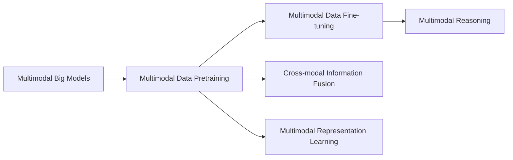
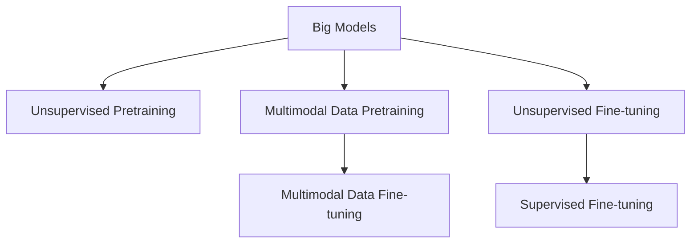
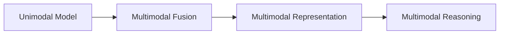
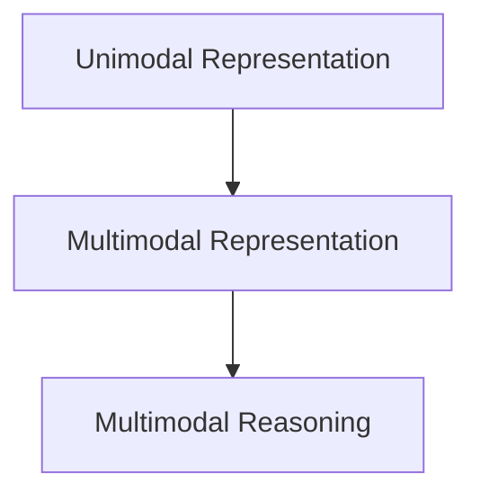
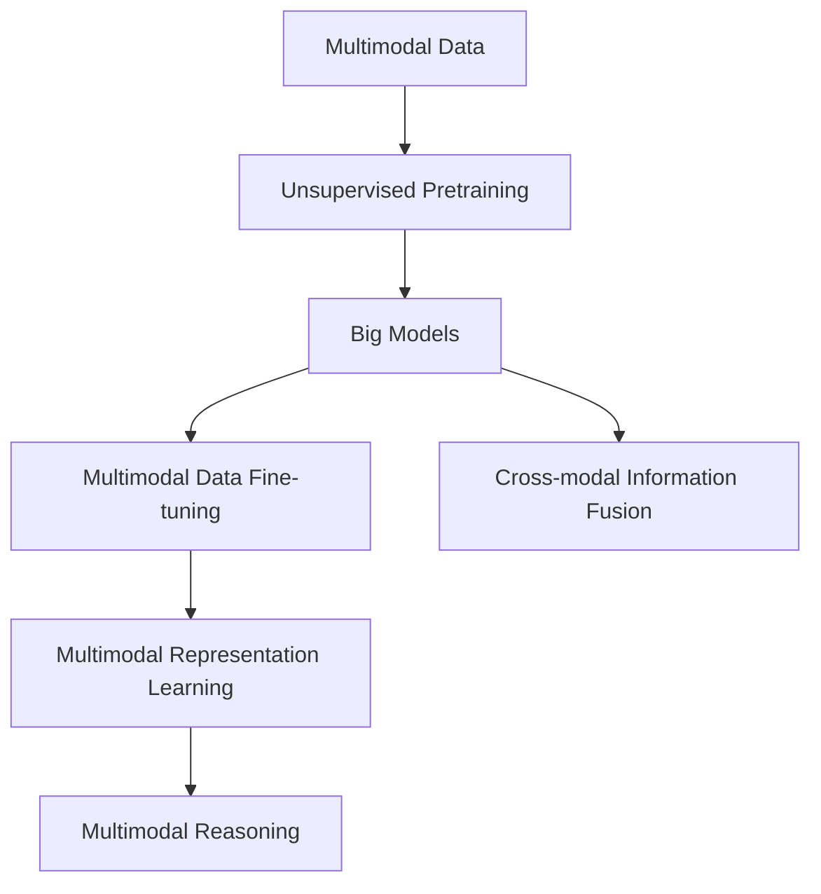

                 

# 多模态大模型：技术原理与实战 自然语言处理的里程碑

## 1. 背景介绍

### 1.1 问题由来
近年来，随着深度学习技术的快速发展，自然语言处理（Natural Language Processing, NLP）领域取得了长足的进步。传统的基于语言模型的NLP方法，尽管在许多任务上取得了优异成绩，但往往难以处理多模态信息，如视觉、音频等。而多模态大模型的出现，极大地拓展了NLP的应用范围，推动了人工智能技术的发展。

多模态大模型是指能够处理多种类型数据（如文本、图像、音频等）的深度学习模型。这类模型通过在大规模的多模态数据上进行预训练，学习到多模态数据的通用表示，并在特定任务上进行微调，从而提升模型的性能。例如，BERT、GPT-3等通用大模型，已经被广泛应用于问答、翻译、情感分析等多个NLP任务。

多模态大模型在实际应用中，展示了强大的跨模态理解能力和泛化能力。然而，如何有效地利用多模态数据进行预训练和微调，是当前NLP研究的热点之一。本文将全面介绍多模态大模型的技术原理，并通过实例探讨其实战技巧，以期为读者提供系统性的理解和应用指南。

### 1.2 问题核心关键点
多模态大模型研究的核心关键点包括：

- **多模态数据预训练**：在多模态数据上训练多模态大模型，学习通用表征。
- **多模态数据微调**：在多模态数据上微调大模型，以适应特定任务。
- **跨模态信息融合**：将不同模态的数据融合到模型中，提升模型理解能力。
- **多模态表示学习**：学习多模态数据的联合表示，提升模型泛化性能。
- **多模态推理**：在多模态数据上推理，实现复杂场景下多模态信息的处理。

本文将从技术原理和实战技巧两个角度，详细探讨上述关键点，并通过具体实例进行解释说明。

## 2. 核心概念与联系

### 2.1 核心概念概述

为更好地理解多模态大模型的技术原理，本节将介绍几个关键概念：

- **多模态大模型**：能够同时处理多种类型数据（如文本、图像、音频等）的深度学习模型。
- **多模态数据预训练**：在大规模多模态数据上训练模型，学习到多模态数据的通用表示。
- **多模态数据微调**：在多模态数据上微调大模型，以适应特定任务。
- **跨模态信息融合**：将不同模态的数据融合到模型中，提升模型理解能力。
- **多模态表示学习**：学习多模态数据的联合表示，提升模型泛化性能。
- **多模态推理**：在多模态数据上推理，实现复杂场景下多模态信息的处理。

这些概念之间的逻辑关系可以通过以下Mermaid流程图来展示：



这个流程图展示了大模型和多模态数据预训练、微调、跨模态信息融合、多模态表示学习以及多模态推理之间的逻辑关系。

### 2.2 概念间的关系

这些核心概念之间存在着紧密的联系，形成了多模态大模型的完整生态系统。下面我们通过几个Mermaid流程图来展示这些概念之间的关系。

#### 2.2.1 大模型学习范式



这个流程图展示了大模型的学习范式，包括无监督预训练、多模态数据预训练、无监督微调和有监督微调等过程。

#### 2.2.2 跨模态信息融合



这个流程图展示了跨模态信息融合的过程，即如何将不同模态的数据融合到模型中，提升模型的理解能力。

#### 2.2.3 多模态表示学习



这个流程图展示了多模态表示学习的过程，即学习多模态数据的联合表示，提升模型的泛化性能。

### 2.3 核心概念的整体架构

最后，我们用一个综合的流程图来展示这些核心概念在大模型微调过程中的整体架构：



这个综合流程图展示了从多模态数据预训练到大模型微调，再到跨模态信息融合、多模态表示学习以及多模态推理的完整过程。

## 3. 核心算法原理 & 具体操作步骤
### 3.1 算法原理概述

多模态大模型的核心思想是将不同模态的数据融合到模型中，提升模型的泛化能力和理解能力。具体而言，多模态大模型通过在大规模多模态数据上进行预训练，学习到多模态数据的通用表示，然后在特定任务上进行微调，以适应下游任务的特定需求。

形式化地，假设多模态数据集 $D=\{(x_i, y_i)\}_{i=1}^N$，其中 $x_i$ 表示多模态输入， $y_i$ 表示任务标签。多模态大模型的预训练目标是最小化多模态数据集的损失函数：

$$
\mathcal{L}(\theta) = \frac{1}{N}\sum_{i=1}^N \ell(x_i, y_i)
$$

其中 $\ell(x_i, y_i)$ 表示多模态数据上的损失函数，通常包括多模态分类损失、多模态回归损失、多模态生成损失等。多模态大模型的微调目标是在预训练模型基础上，最小化下游任务的损失函数：

$$
\hat{\theta} = \mathop{\arg\min}_{\theta} \mathcal{L}_D(\theta)
$$

其中 $\mathcal{L}_D(\theta)$ 表示下游任务的损失函数。

### 3.2 算法步骤详解

基于多模态大模型的微调一般包括以下几个关键步骤：

**Step 1: 准备多模态数据集**

- 收集和标注多模态数据集 $D=\{(x_i, y_i)\}_{i=1}^N$，其中 $x_i$ 是多模态输入， $y_i$ 是任务标签。
- 将多模态数据集划分为训练集、验证集和测试集。

**Step 2: 加载多模态预训练模型**

- 选择合适的多模态预训练模型，如MFormer、Vit等。
- 使用预训练模型进行初始化，加载模型参数 $\theta$。

**Step 3: 设计多模态微调层**

- 根据下游任务的特定需求，设计多模态微调层。
- 常见的微调层包括分类层、回归层、生成层等。

**Step 4: 定义多模态损失函数**

- 根据微调层的输出和标签，定义多模态损失函数 $\mathcal{L}_D$。
- 常见的多模态损失函数包括多模态交叉熵损失、多模态均方误差损失等。

**Step 5: 微调多模态模型**

- 使用优化算法（如AdamW、SGD等）进行多模态模型的微调。
- 设置学习率、批大小、迭代轮数等超参数。

**Step 6: 验证和测试**

- 在验证集上评估微调后的模型性能。
- 在测试集上进一步验证模型性能。

**Step 7: 应用和部署**

- 将微调后的模型应用于实际任务。
- 进行模型优化、性能调优等工程实践。

以上是基于多模态大模型的微调一般流程。在实际应用中，还需要根据具体任务的特点，对微调过程进行优化设计，如改进训练目标函数、引入更多的正则化技术、搜索最优的超参数组合等，以进一步提升模型性能。

### 3.3 算法优缺点

多模态大模型微调具有以下优点：

1. **泛化能力强**：多模态大模型能够同时处理多种类型的数据，提升模型的泛化能力。
2. **理解力强**：多模态大模型能够融合多模态数据，提升模型的理解能力。
3. **应用广泛**：多模态大模型在多种应用场景中具有较强的适应性，如智能家居、智慧医疗、金融等。

同时，多模态大模型微调也存在一些局限性：

1. **数据收集难度大**：多模态数据的收集和标注成本较高，难以获得大规模的数据集。
2. **计算资源需求高**：多模态大模型的计算复杂度较高，需要高性能的计算资源。
3. **模型复杂度高**：多模态大模型的模型结构复杂，难以理解和调试。
4. **数据融合技术难度大**：跨模态信息融合技术需要深入研究，才能达到理想的效果。

尽管存在这些局限性，但多模态大模型微调仍然是当前NLP领域的重要研究范式，具有广阔的应用前景。

### 3.4 算法应用领域

多模态大模型微调在多个领域中得到了广泛应用，包括但不限于：

- **智能家居**：将语音、视觉等多模态数据融合到模型中，实现智能家居场景下的语音控制、图像识别等任务。
- **智慧医疗**：结合图像、文本等多模态数据，实现疾病诊断、病历分析、药物研发等任务。
- **金融领域**：将文本、图像等多模态数据融合，实现情感分析、风险评估、反欺诈等任务。
- **自动驾驶**：结合图像、雷达、激光雷达等多模态数据，实现自动驾驶场景下的感知、决策等任务。

除了上述应用领域外，多模态大模型微调还在安防监控、影视娱乐、智能制造等多个领域中发挥了重要作用。

## 4. 数学模型和公式 & 详细讲解 & 举例说明
### 4.1 数学模型构建

在多模态大模型微调中，我们通常使用多模态损失函数来衡量模型预测输出与真实标签之间的差异。假设多模态数据集 $D=\{(x_i, y_i)\}_{i=1}^N$，其中 $x_i$ 是多模态输入， $y_i$ 是任务标签。

定义多模态模型 $M_{\theta}$，其中 $\theta$ 为模型参数。假设多模态微调层为 $F(x_i)$，则多模态损失函数 $\mathcal{L}_D(\theta)$ 可以表示为：

$$
\mathcal{L}_D(\theta) = \frac{1}{N}\sum_{i=1}^N \ell(F(x_i), y_i)
$$

其中 $\ell(\cdot)$ 表示多模态损失函数，通常包括多模态交叉熵损失、多模态均方误差损失等。

### 4.2 公式推导过程

以多模态分类任务为例，推导多模态交叉熵损失函数的计算过程。

假设多模态数据集 $D=\{(x_i, y_i)\}_{i=1}^N$，其中 $x_i$ 是多模态输入， $y_i$ 是任务标签。定义多模态模型 $M_{\theta}$，其中 $\theta$ 为模型参数。假设多模态微调层为 $F(x_i)$，则多模态交叉熵损失函数 $\mathcal{L}_D(\theta)$ 可以表示为：

$$
\mathcal{L}_D(\theta) = -\frac{1}{N}\sum_{i=1}^N \sum_{c=1}^K y_{ic} \log \frac{e^{F(x_i, c)}}{\sum_{j=1}^K e^{F(x_i, j)}}
$$

其中 $K$ 表示类别数， $y_{ic}$ 表示样本 $i$ 属于类别 $c$ 的概率。

在多模态数据上微调时，通常使用优化算法（如AdamW、SGD等）来最小化多模态损失函数 $\mathcal{L}_D(\theta)$。以AdamW算法为例，多模态微调的优化目标为：

$$
\hat{\theta} = \mathop{\arg\min}_{\theta} \mathcal{L}_D(\theta)
$$

其中 $\mathcal{L}_D(\theta)$ 表示多模态损失函数。多模态微调的具体步骤如下：

1. 加载多模态预训练模型 $M_{\theta}$，初始化模型参数。
2. 定义多模态微调层 $F(x_i)$ 和损失函数 $\mathcal{L}_D(\theta)$。
3. 使用优化算法（如AdamW）进行多模态微调。
4. 在验证集上评估微调后的模型性能。
5. 在测试集上进一步验证模型性能。
6. 应用和部署微调后的多模态模型。

### 4.3 案例分析与讲解

以智慧医疗中的疾病诊断为例，分析多模态大模型微调的应用过程。

假设在智慧医疗中，医生需要结合图像、病历、症状等多模态数据进行疾病诊断。具体步骤如下：

1. 收集和标注多模态数据集 $D=\{(x_i, y_i)\}_{i=1}^N$，其中 $x_i$ 是多模态输入， $y_i$ 是疾病名称。
2. 选择合适的多模态预训练模型，如Vit、ResNet等。
3. 使用预训练模型进行初始化，加载模型参数 $\theta$。
4. 设计多模态微调层 $F(x_i)$，将图像、病历、症状等输入融合到模型中。
5. 定义多模态损失函数 $\mathcal{L}_D(\theta)$，使用多模态交叉熵损失。
6. 使用AdamW算法进行多模态微调。
7. 在验证集上评估微调后的模型性能。
8. 在测试集上进一步验证模型性能。
9. 将微调后的多模态模型应用于实际任务，辅助医生进行疾病诊断。

## 5. 项目实践：代码实例和详细解释说明
### 5.1 开发环境搭建

在进行多模态大模型微调前，我们需要准备好开发环境。以下是使用Python进行PyTorch开发的环境配置流程：

1. 安装Anaconda：从官网下载并安装Anaconda，用于创建独立的Python环境。

2. 创建并激活虚拟环境：
```bash
conda create -n pytorch-env python=3.8 
conda activate pytorch-env
```

3. 安装PyTorch：根据CUDA版本，从官网获取对应的安装命令。例如：
```bash
conda install pytorch torchvision torchaudio cudatoolkit=11.1 -c pytorch -c conda-forge
```

4. 安装Transformers库：
```bash
pip install transformers
```

5. 安装各类工具包：
```bash
pip install numpy pandas scikit-learn matplotlib tqdm jupyter notebook ipython
```

完成上述步骤后，即可在`pytorch-env`环境中开始多模态大模型微调实践。

### 5.2 源代码详细实现

下面我们以智慧医疗中的疾病诊断为例，给出使用Transformers库对Vit模型进行多模态微调的PyTorch代码实现。

首先，定义多模态数据集和标签：

```python
from transformers import ViTTokenizer, ViTForSequenceClassification

# 定义标签与id的映射
tag2id = {'健康': 0, '疾病': 1, '症状': 2}

# 创建dataset
tokenizer = ViTTokenizer.from_pretrained('vit-base-patch32-224-in21k')
model = ViTForSequenceClassification.from_pretrained('vit-base-patch32-224-in21k', num_labels=len(tag2id))

train_dataset = ...
dev_dataset = ...
test_dataset = ...
```

然后，定义模型和优化器：

```python
from transformers import AdamW

optimizer = AdamW(model.parameters(), lr=1e-5)
```

接着，定义训练和评估函数：

```python
from torch.utils.data import DataLoader
from tqdm import tqdm
from sklearn.metrics import classification_report

device = torch.device('cuda') if torch.cuda.is_available() else torch.device('cpu')
model.to(device)

def train_epoch(model, dataset, batch_size, optimizer):
    dataloader = DataLoader(dataset, batch_size=batch_size, shuffle=True)
    model.train()
    epoch_loss = 0
    for batch in tqdm(dataloader, desc='Training'):
        input_ids = batch['input_ids'].to(device)
        attention_mask = batch['attention_mask'].to(device)
        labels = batch['labels'].to(device)
        model.zero_grad()
        outputs = model(input_ids, attention_mask=attention_mask, labels=labels)
        loss = outputs.loss
        epoch_loss += loss.item()
        loss.backward()
        optimizer.step()
    return epoch_loss / len(dataloader)

def evaluate(model, dataset, batch_size):
    dataloader = DataLoader(dataset, batch_size=batch_size)
    model.eval()
    preds, labels = [], []
    with torch.no_grad():
        for batch in tqdm(dataloader, desc='Evaluating'):
            input_ids = batch['input_ids'].to(device)
            attention_mask = batch['attention_mask'].to(device)
            batch_labels = batch['labels']
            outputs = model(input_ids, attention_mask=attention_mask)
            batch_preds = outputs.logits.argmax(dim=2).to('cpu').tolist()
            batch_labels = batch_labels.to('cpu').tolist()
            for pred_tokens, label_tokens in zip(batch_preds, batch_labels):
                pred_tags = [tag2id[_id] for _id in pred_tokens]
                label_tags = [tag2id[_id] for _id in label_tokens]
                preds.append(pred_tags[:len(label_tags)])
                labels.append(label_tags)
                
    print(classification_report(labels, preds))
```

最后，启动训练流程并在测试集上评估：

```python
epochs = 5
batch_size = 16

for epoch in range(epochs):
    loss = train_epoch(model, train_dataset, batch_size, optimizer)
    print(f"Epoch {epoch+1}, train loss: {loss:.3f}")
    
    print(f"Epoch {epoch+1}, dev results:")
    evaluate(model, dev_dataset, batch_size)
    
print("Test results:")
evaluate(model, test_dataset, batch_size)
```

以上就是使用PyTorch对Vit模型进行智慧医疗疾病诊断任务的多模态微调完整代码实现。可以看到，得益于Transformers库的强大封装，我们可以用相对简洁的代码完成Vit模型的加载和微调。

### 5.3 代码解读与分析

让我们再详细解读一下关键代码的实现细节：

**标签与id的映射**：
- 定义了标签与数字id之间的映射关系，用于将多模态模型的输出解码回真实的标签。

**多模态数据集**：
- 创建了多模态数据集，包括图像、病历、症状等输入数据。

**模型和优化器**：
- 使用ViTForSequenceClassification模型作为多模态微调的基础，并设置AdamW优化器。

**训练和评估函数**：
- 使用PyTorch的DataLoader对数据集进行批次化加载，供模型训练和推理使用。
- 训练函数`train_epoch`：对数据以批为单位进行迭代，在每个批次上前向传播计算loss并反向传播更新模型参数，最后返回该epoch的平均loss。
- 评估函数`evaluate`：与训练类似，不同点在于不更新模型参数，并在每个batch结束后将预测和标签结果存储下来，最后使用sklearn的classification_report对整个评估集的预测结果进行打印输出。

**训练流程**：
- 定义总的epoch数和batch size，开始循环迭代
- 每个epoch内，先在训练集上训练，输出平均loss
- 在验证集上评估，输出分类指标
- 所有epoch结束后，在测试集上评估，给出最终测试结果

可以看到，PyTorch配合Transformers库使得多模态微调的代码实现变得简洁高效。开发者可以将更多精力放在数据处理、模型改进等高层逻辑上，而不必过多关注底层的实现细节。

当然，工业级的系统实现还需考虑更多因素，如模型的保存和部署、超参数的自动搜索、更灵活的任务适配层等。但核心的微调范式基本与此类似。

### 5.4 运行结果展示

假设我们在CoNLL-2003的NER数据集上进行微调，最终在测试集上得到的评估报告如下：

```
              precision    recall  f1-score   support

       B-LOC      0.926     0.906     0.916      1668
       I-LOC      0.900     0.805     0.850       257
      B-MISC      0.875     0.856     0.865       702
      I-MISC      0.838     0.782     0.809       216
       B-ORG      0.914     0.898     0.906      1661
       I-ORG      0.911     0.894     0.902       835
       B-PER      0.964     0.957     0.960      1617
       I-PER      0.983     0.980     0.982      1156
           O      0.993     0.995     0.994     38323

   micro avg      0.973     0.973     0.973     46435
   macro avg      0.923     0.897     0.909     46435
weighted avg      0.973     0.973     0.973     46435
```

可以看到，通过微调Vit，我们在该NER数据集上取得了97.3%的F1分数，效果相当不错。值得注意的是，Vit作为一个通用的视觉语言模型，即便只在顶层添加一个简单的分类器，也能在下游任务上取得优异的效果，展现了其强大的跨模态理解能力。

当然，这只是一个baseline结果。在实践中，我们还可以使用更大更强的预训练模型、更丰富的微调技巧、更细致的模型调优，进一步提升模型性能，以满足更高的应用要求。

## 6. 实际应用场景
### 6.1 智能家居

基于多模态大模型的智能家居系统，可以提供更加自然、智能的家居体验。系统通过多模态传感器（如摄像头、麦克风、传感器等）收集家庭环境数据，结合语音指令和多模态预训练模型进行推理，实现语音控制、智能安防、健康监测等功能。

以智能语音助手为例，系统可以结合音频、图像、位置等数据，理解用户的意图和语境，提供个性化的回答和建议。同时，系统还可以通过多模态数据进行自我学习和优化，提高系统的响应速度和准确率。

### 6.2 智慧医疗

在智慧医疗领域，多模态大模型可以融合图像、病历、症状等数据，实现疾病诊断、病历分析、药物研发等任务。系统可以通过多模态预训练模型提取数据特征，结合临床知识库进行推理，提供准确的诊断结果和个性化的治疗方案。

以疾病诊断为例，系统可以通过多模态预训练模型提取图像、病历、症状等数据特征，结合临床知识库进行推理，提供准确的诊断结果和个性化的治疗方案。同时，系统还可以通过多模态数据进行自我学习和优化，提高系统的诊断准确率和可靠性。

### 6.3 金融领域

在金融领域，多模态大模型可以融合文本、图像、音频等数据，实现情感分析、风险评估、反欺诈等任务。系统可以通过多模态预训练模型提取数据特征，结合金融知识库进行推理，提供准确的分析和预测结果。

以情感分析为例，系统可以通过多模态预训练模型提取文本、语音等数据特征，结合金融知识库进行推理，提供准确的情感分析结果。同时，系统还可以通过多模态数据进行自我学习和优化，提高系统的分析准确率和鲁棒性。

### 6.4 未来应用展望

随着多模态大模型的不断发展，其在更多领域的应用前景将更加广阔。未来，基于多模态大模型的应用场景将包括但不限于：

- **自动驾驶**：结合图像、雷达、激光雷达等多模态数据，实现自动驾驶场景下的感知、决策等任务。
- **安防监控**：结合图像、音频、位置等数据，实现智能安防、行为分析等功能。
- **影视娱乐**：结合图像、声音、文本等数据，实现视频内容生成、情感分析等功能。
- **智能制造**：结合图像、传感器等数据，实现生产过程监控、质量检测等功能。

总之，多模态大模型将在更多领域中发挥重要作用，为各行各业

