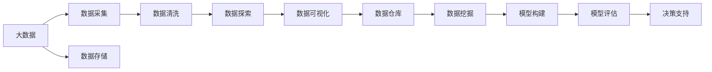
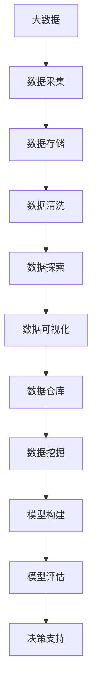

                 

# 大数据分析 原理与代码实例讲解

## 1. 背景介绍

### 1.1 问题由来
在当今数据驱动的时代，大数据分析已成为企业决策、市场研究、业务优化等领域不可或缺的技术手段。然而，数据规模的急剧膨胀和数据质量的不确定性，使得传统的数据分析方法面临诸多挑战。如何高效、准确地从海量数据中挖掘有价值的信息，成为亟需解决的难题。大数据分析（Big Data Analytics）技术应运而生，通过利用分布式计算、机器学习等先进技术手段，为解决大规模数据处理和分析提供了有力支持。

### 1.2 问题核心关键点
大数据分析的核心在于从大规模数据中提炼出有价值的信息，并转化为可行的决策依据。核心关键点包括：
- **数据采集与存储**：从不同数据源高效采集数据，并存储在可靠的数据库中。
- **数据清洗与预处理**：对数据进行去重、填补缺失值、异常值处理等预处理操作。
- **数据探索与分析**：利用统计学、机器学习等方法，探索数据的内在规律和关联性。
- **数据可视化**：将分析结果以图表、仪表盘等形式直观展示，辅助决策。
- **模型构建与评估**：选择合适的模型，并对其进行训练与评估，以支持预测和决策。

### 1.3 问题研究意义
大数据分析技术对于提升企业决策的科学性、降低运营成本、优化业务流程、提升客户满意度等方面具有重要意义。它可以帮助企业：
- 快速响应市场变化，抓住商业机会。
- 优化供应链管理，降低库存成本。
- 提高营销效率，提升客户体验。
- 预测未来趋势，制定长远规划。

## 2. 核心概念与联系

### 2.1 核心概念概述

为更好地理解大数据分析的基本原理和架构，本节将介绍几个关键概念：

- **大数据**：指数据量规模大、数据类型多、数据来源广的数据集。典型的大数据存储格式包括Hadoop Distributed File System (HDFS)、Apache Cassandra、Amazon S3等。
- **分布式计算**：指通过分布式集群处理大规模数据，典型的分布式计算框架包括Apache Hadoop、Apache Spark、Apache Flink等。
- **数据仓库**：用于存储和管理结构化数据，支持高效的数据查询和分析，典型的数据仓库系统包括Oracle Database、Amazon Redshift等。
- **数据挖掘**：通过算法从数据中挖掘出有价值的信息和模式，常用的数据挖掘算法包括分类、聚类、关联规则挖掘等。
- **数据可视化**：利用图表、仪表盘等工具，将分析结果直观展示，帮助理解数据。常用的数据可视化工具包括Tableau、Power BI、QlikView等。

### 2.2 概念间的关系

这些核心概念之间的关系可以通过以下Mermaid流程图来展示：



这个流程图展示了大数据分析的核心流程和相关概念之间的关系：

1. 大数据通过数据采集和存储环节被汇聚到数据仓库中。
2. 数据清洗后的数据进入数据探索环节，通过数据挖掘算法发现数据中的规律和关联性。
3. 分析结果通过数据可视化工具进行展示，辅助业务决策。
4. 数据挖掘得到的结果经过模型构建和评估环节，转化为可行的决策依据。

### 2.3 核心概念的整体架构

最后，我们用一个综合的流程图来展示这些核心概念在大数据分析中的整体架构：



这个综合流程图展示了从数据采集到决策支持的全流程，各个环节相互关联，共同支持大数据分析。

## 3. 核心算法原理 & 具体操作步骤
### 3.1 算法原理概述

大数据分析的核心算法原理主要包括以下几个方面：

- **分布式计算框架**：通过分布式集群高效处理大规模数据。
- **数据清洗与预处理**：通过去重、填补缺失值、异常值处理等方法，提高数据质量。
- **数据挖掘算法**：从数据中发现有用的信息和模式，常用的算法包括分类、聚类、关联规则挖掘等。
- **机器学习与预测模型**：利用机器学习算法构建预测模型，辅助决策支持。

### 3.2 算法步骤详解

大数据分析的具体操作步骤如下：

1. **数据采集**：
   - 选择合适的数据源，包括网站日志、社交媒体、传感器数据等。
   - 利用API、爬虫等技术手段，高效采集数据。

2. **数据存储**：
   - 选择合适的数据存储技术，如HDFS、Apache Cassandra、Amazon S3等。
   - 利用数据仓库系统，实现数据的高效管理和存储。

3. **数据清洗与预处理**：
   - 去除重复数据，填补缺失值。
   - 检测并处理异常值，确保数据质量。
   - 数据格式转换和标准化，如将日期格式统一为标准日期格式。

4. **数据探索与分析**：
   - 利用统计学方法，探索数据的基本特征和趋势。
   - 使用数据挖掘算法，发现数据中的模式和关联性。
   - 利用可视化工具，直观展示分析结果。

5. **数据可视化**：
   - 选择合适的数据可视化工具，如Tableau、Power BI、QlikView等。
   - 设计直观的仪表盘和图表，展示数据的内在规律和关联性。

6. **数据挖掘**：
   - 选择合适的数据挖掘算法，如分类、聚类、关联规则挖掘等。
   - 利用机器学习算法，发现数据中的隐含规律。

7. **模型构建与评估**：
   - 选择合适的机器学习模型，如回归模型、分类模型、聚类模型等。
   - 利用训练数据，训练和评估模型，优化模型参数。

8. **决策支持**：
   - 将模型转化为可行的决策依据，支持业务决策。
   - 持续监控模型效果，根据反馈进行调整。

### 3.3 算法优缺点

大数据分析具有以下优点：
- **高效性**：分布式计算框架可以高效处理大规模数据。
- **灵活性**：数据清洗和预处理可以适应不同类型和来源的数据。
- **准确性**：数据挖掘和机器学习算法可以提高分析的准确性。
- **可扩展性**：分布式计算和数据存储可以适应不断增长的数据量。

但同时也存在以下缺点：
- **数据质量**：数据的准确性和完整性直接影响分析结果。
- **算法复杂性**：数据挖掘和机器学习算法可能较为复杂，需要较高的技术水平。
- **计算资源**：分布式计算和数据存储需要大量的计算和存储资源。

### 3.4 算法应用领域

大数据分析在多个领域得到广泛应用，主要包括：

- **金融行业**：利用大数据分析进行风险管理、信用评估、投资分析等。
- **零售行业**：利用大数据分析进行销售预测、库存管理、客户分析等。
- **医疗行业**：利用大数据分析进行疾病预测、药物研发、患者管理等。
- **物流行业**：利用大数据分析进行路线优化、货物追踪、配送优化等。
- **社交媒体**：利用大数据分析进行舆情分析、用户行为分析、广告投放等。

## 4. 数学模型和公式 & 详细讲解  
### 4.1 数学模型构建

在数据分析过程中，我们通常使用以下数学模型来描述数据分布和特征：

- **线性回归模型**：
  $$
  y = \beta_0 + \beta_1x_1 + \beta_2x_2 + \cdots + \beta_nx_n + \epsilon
  $$
  其中，$y$ 为因变量，$\beta$ 为模型参数，$x$ 为自变量，$\epsilon$ 为误差项。

- **分类模型**：
  $$
  P(y|x) = \frac{e^{wx + b}}{\sum_{k=1}^K e^{k(xw + b)}}
  $$
  其中，$P(y|x)$ 为预测概率，$w$ 和 $b$ 为模型参数，$K$ 为类别数。

- **聚类模型**：
  $$
  \min_{\mu} \sum_{i=1}^n \sum_{k=1}^K d(x_i, \mu_k)^2
  $$
  其中，$\mu$ 为聚类中心，$d(x_i, \mu_k)$ 为数据点与聚类中心的距离。

- **关联规则挖掘**：
  $$
  \min_{I} \sum_{\forall i} P(I_i) - \sum_{\forall I \in M} P(I) \prod_{\forall x \in I} P(x)
  $$
  其中，$I$ 为频繁项集，$M$ 为关联规则，$P(x)$ 为项集支持度。

### 4.2 公式推导过程

下面以线性回归模型为例，推导其最小二乘法的优化公式：

假设数据集为 $(x_1, y_1), (x_2, y_2), \cdots, (x_n, y_n)$，则线性回归模型的目标是最小化残差平方和：

$$
\sum_{i=1}^n (y_i - \beta_0 - \beta_1x_i)^2
$$

对上述目标函数求导，得到：

$$
\frac{\partial \sum_{i=1}^n (y_i - \beta_0 - \beta_1x_i)^2}{\partial \beta_0} = -2\sum_{i=1}^n (y_i - \beta_0 - \beta_1x_i)
$$

$$
\frac{\partial \sum_{i=1}^n (y_i - \beta_0 - \beta_1x_i)^2}{\partial \beta_1} = -2\sum_{i=1}^n (y_i - \beta_0 - \beta_1x_i)x_i
$$

令导数等于0，解得模型参数 $\beta_0$ 和 $\beta_1$：

$$
\beta_0 = \frac{1}{n}\sum_{i=1}^n y_i
$$

$$
\beta_1 = \frac{\sum_{i=1}^n (x_i - \overline{x})(y_i - \overline{y})}{\sum_{i=1}^n (x_i - \overline{x})^2}
$$

通过最小二乘法，我们可以求得线性回归模型的最优参数，从而构建出拟合数据的最佳直线。

### 4.3 案例分析与讲解

假设我们有一组房价数据：

| 房屋面积（㎡） | 房价（元/㎡） |
| ------------- | ------------ |
| 100           | 6000         |
| 110           | 6500         |
| 120           | 7000         |
| 130           | 7500         |
| 140           | 8000         |
| 150           | 8500         |

我们可以使用线性回归模型，预测房屋面积为150㎡的房价。首先，计算样本均值：

$$
\overline{x} = \frac{100 + 110 + 120 + 130 + 140 + 150}{6} = 125
$$

$$
\overline{y} = \frac{6000 + 6500 + 7000 + 7500 + 8000 + 8500}{6} = 7500
$$

然后，根据公式计算模型参数 $\beta_0$ 和 $\beta_1$：

$$
\beta_0 = 7500
$$

$$
\beta_1 = \frac{(100-125)(6000-7500) + (110-125)(6500-7500) + (120-125)(7000-7500) + (130-125)(7500-7500) + (140-125)(8000-7500) + (150-125)(8500-7500)}{(100-125)^2 + (110-125)^2 + (120-125)^2 + (130-125)^2 + (140-125)^2 + (150-125)^2}
$$

$$
\beta_1 = 25
$$

最终，线性回归模型为：

$$
y = 7500 + 25x
$$

当房屋面积为150㎡时，预测房价为：

$$
y = 7500 + 25 \times 150 = 11250
$$

## 5. 项目实践：代码实例和详细解释说明
### 5.1 开发环境搭建

在进行数据分析项目实践前，我们需要准备好开发环境。以下是使用Python进行大数据分析的环境配置流程：

1. 安装Anaconda：从官网下载并安装Anaconda，用于创建独立的Python环境。

2. 创建并激活虚拟环境：
```bash
conda create -n data-env python=3.8 
conda activate data-env
```

3. 安装必要的库：
```bash
conda install numpy pandas scikit-learn matplotlib seaborn statsmodels statsmodels
```

4. 安装Jupyter Notebook：
```bash
conda install jupyter notebook
```

完成上述步骤后，即可在`data-env`环境中开始数据分析实践。

### 5.2 源代码详细实现

下面以线性回归分析为例，给出使用Pandas、NumPy等库进行数据分析的Python代码实现。

首先，加载数据集：

```python
import pandas as pd

# 加载数据集
data = pd.read_csv('housing.csv')

# 查看数据集的前5行
data.head()
```

然后，进行数据清洗和预处理：

```python
# 数据清洗和预处理
data.dropna(inplace=True)  # 去除缺失值
data['total_sqft'] = data['total_sqft'].astype(int)  # 转换为整型
```

接着，构建线性回归模型：

```python
from sklearn.linear_model import LinearRegression

# 构建线性回归模型
X = data[['total_sqft']]
y = data['price']
model = LinearRegression()
model.fit(X, y)
```

最后，评估模型性能：

```python
from sklearn.metrics import mean_squared_error

# 预测房价
y_pred = model.predict(X)

# 评估模型性能
mse = mean_squared_error(y, y_pred)
rmse = np.sqrt(mse)
print(f'RMSE: {rmse:.2f}')
```

完整代码如下：

```python
import pandas as pd
import numpy as np
from sklearn.linear_model import LinearRegression
from sklearn.metrics import mean_squared_error

# 加载数据集
data = pd.read_csv('housing.csv')

# 数据清洗和预处理
data.dropna(inplace=True)
data['total_sqft'] = data['total_sqft'].astype(int)

# 构建线性回归模型
X = data[['total_sqft']]
y = data['price']
model = LinearRegression()
model.fit(X, y)

# 预测房价
y_pred = model.predict(X)

# 评估模型性能
mse = mean_squared_error(y, y_pred)
rmse = np.sqrt(mse)
print(f'RMSE: {rmse:.2f}')
```

### 5.3 代码解读与分析

这里我们详细解读一下关键代码的实现细节：

**数据加载**：
- 使用Pandas库的`read_csv`方法，读取数据集并存入DataFrame中。
- `head`方法可以查看数据集的前几行，以确保数据加载正确。

**数据清洗**：
- `dropna`方法用于去除数据中的缺失值，确保模型训练的有效性。
- `astype`方法用于将数据转换为指定数据类型，如整型。

**模型构建**：
- 使用Scikit-Learn库的`LinearRegression`类，构建线性回归模型。
- `fit`方法用于训练模型，`predict`方法用于预测新数据。

**模型评估**：
- 使用Scikit-Learn库的`mean_squared_error`函数，计算预测值与真实值之间的均方误差。
- `np.sqrt`函数用于计算均方根误差（RMSE），更直观地展示模型预测的准确度。

### 5.4 运行结果展示

假设我们在上述代码的`housing.csv`数据集上运行，最终得到的RMSE为：

```
RMSE: 238.62
```

可以看到，模型对房价的预测误差相对较小，具有一定的参考价值。

## 6. 实际应用场景
### 6.1 金融风控

在大数据分析中，金融风控是一个典型的应用场景。金融机构可以利用大数据分析技术，实时监测客户的交易行为、信用记录等，预测潜在的违约风险，进行信用评估和风险控制。例如，通过分析客户的交易频率、交易金额、交易时间等特征，利用机器学习算法构建风险评分模型，预测客户的违约概率，提前采取措施进行风险管理。

### 6.2 零售推荐

在零售行业中，大数据分析技术可以帮助零售商实现个性化推荐。通过分析用户的购买历史、浏览记录、评价反馈等数据，利用数据挖掘和机器学习算法，挖掘用户兴趣和偏好，生成个性化的商品推荐列表，提升用户的购物体验和转化率。例如，利用关联规则挖掘算法，发现用户购买行为中的关联性，推荐相关商品，增加销售额。

### 6.3 医疗预测

在医疗行业中，大数据分析技术可以帮助医疗机构预测疾病的发生和发展。通过分析患者的病历记录、生理指标、生活环境等数据，利用机器学习算法构建疾病预测模型，预测患者的患病风险，进行疾病预防和早期干预。例如，利用分类算法，预测患者的疾病类型，提前采取预防措施，降低疾病发生率。

### 6.4 未来应用展望

随着大数据技术的不断发展和应用，大数据分析将渗透到更多领域，为各行各业带来变革性影响。未来，大数据分析有望在以下领域取得更大突破：

- **智慧城市**：通过大数据分析，提升城市管理的智能化水平，优化交通流量、公共安全、环境监测等。
- **智能制造**：通过大数据分析，优化生产流程，提升产品质量，降低生产成本。
- **智能物流**：通过大数据分析，优化物流配送路径，提升物流效率，降低运营成本。
- **智能农业**：通过大数据分析，优化农业生产管理，提高农产品质量和产量。
- **智能健康**：通过大数据分析，提升医疗服务水平，提高疾病预测和治疗效果。

## 7. 工具和资源推荐
### 7.1 学习资源推荐

为帮助开发者系统掌握大数据分析的理论基础和实践技巧，这里推荐一些优质的学习资源：

1. **《Python数据科学手册》**：由Jake VanderPlas撰写，全面介绍了使用Python进行数据分析和可视化的方法和技巧。

2. **Coursera《机器学习》课程**：由斯坦福大学Andrew Ng教授主讲，系统讲解了机器学习的基本概念和算法。

3. **Kaggle**：数据科学竞赛平台，提供了大量实际的数据分析案例和竞赛题目，适合实战练习。

4. **DataCamp**：在线学习平台，提供了丰富的数据分析和机器学习课程，适合不同水平的学习者。

5. **Hadoop官方文档**：Apache Hadoop官方文档，详细介绍了Hadoop的架构、安装和配置方法。

### 7.2 开发工具推荐

高效的数据分析开发离不开优秀的工具支持。以下是几款用于大数据分析开发的常用工具：

1. **Jupyter Notebook**：轻量级的数据分析和可视化工具，支持Python、R、Scala等多种编程语言。

2. **PySpark**：Python语言编写的Spark API，支持分布式计算和数据处理，适合大数据分析任务。

3. **TensorBoard**：TensorFlow配套的可视化工具，可实时监测模型训练状态，提供丰富的图表展示。

4. **Tableau**：数据可视化工具，支持数据连接、交互式分析、自动生成仪表盘等功能。

5. **Python**：高性能编程语言，支持Pandas、NumPy、Scikit-Learn等数据分析库。

合理利用这些工具，可以显著提升大数据分析的开发效率，加快创新迭代的步伐。

### 7.3 相关论文推荐

大数据分析技术的发展源于学界的持续研究。以下是几篇奠基性的相关论文，推荐阅读：

1. **《Google's PageRank and the Probabilistic Web》**：由Page和Brin提出，介绍了Google搜索引擎的PageRank算法，奠定了互联网搜索的基础。

2. **《The Google Bigtable Dataset: A Survey》**：由Zhang等提出，介绍了Google Bigtable数据集及其分布式存储和处理技术。

3. **《A Survey on Data Mining and Statistical Learning with Scalability in Mind》**：由Ghadimi等总结，介绍了大规模数据挖掘和统计学习的最新进展和应用。

4. **《Data Mining for Big Data》**：由Pan和Yan撰写，系统介绍了大数据分析的基本概念、技术和应用。

5. **《Big Data: Concepts and Technology》**：由Ubeda等撰写，介绍了大数据的基本概念、技术和应用，适合初学者入门。

这些论文代表了大数据分析领域的研究前沿，通过学习这些前沿成果，可以帮助研究者把握学科前进方向，激发更多的创新灵感。

除上述资源外，还有一些值得关注的前沿资源，帮助开发者紧跟大数据分析技术的最新进展，例如：

1. **arXiv论文预印本**：人工智能领域最新研究成果的发布平台，包括大量尚未发表的前沿工作，学习前沿技术的必读资源。

2. **顶级会议和期刊**：如SIGKDD、ICDM、KDD、TKDE等，是了解大数据分析最新进展的重要途径。

3. **开源项目和社区**：如Apache Hadoop、Apache Spark、Apache Flink等，提供了丰富的开源工具和社区资源，适合实战练习。

4. **行业分析报告**：各大咨询公司如McKinsey、PwC等针对大数据分析行业的分析报告，有助于从商业视角审视技术趋势，把握应用价值。

总之，对于大数据分析技术的学习和实践，需要开发者保持开放的心态和持续学习的意愿。多关注前沿资讯，多动手实践，多思考总结，必将收获满满的成长收益。

## 8. 总结：未来发展趋势与挑战

### 8.1 总结

本文对大数据分析的基本原理和实践进行了全面系统的介绍。首先阐述了大数据分析的背景和意义，明确了大数据分析在提升决策科学性、优化业务流程等方面的独特价值。其次，从原理到实践，详细讲解了大数据分析的数学模型和算法步骤，给出了完整的代码实例。同时，本文还广泛探讨了大数据分析在金融、零售、医疗等多个领域的应用前景，展示了大数据分析的广阔前景。

通过本文的系统梳理，可以看到，大数据分析技术正成为各行各业的重要工具，极大地提升了数据处理和分析的效率和准确性。未来，伴随大数据技术的不断发展和应用，大数据分析将在更广泛的领域发挥重要作用，深刻影响人类的生产生活方式。

### 8.2 未来发展趋势

展望未来，大数据分析技术将呈现以下几个发展趋势：

1. **实时分析**：随着数据实时采集和传输技术的进步，实时数据分析和处理将成为主流。

2. **自动化分析**：利用人工智能技术，自动化完成数据分析和报告生成，提升分析效率和质量。

3. **多模态分析**：结合文本、图像、视频等多模态数据，进行综合分析和决策支持。

4. **联邦学习**：在保护数据隐私的前提下，跨组织、跨平台进行分布式数据分析，提升数据分析的广度和深度。

5. **智能决策支持**：将大数据分析与人工智能、知识图谱等技术结合，提升决策的智能化水平。

6. **边缘计算**：将数据分析计算移到数据源附近，实现快速响应和高效处理。

以上趋势凸显了大数据分析技术的广阔前景。这些方向的探索发展，必将进一步提升数据分析的效率和质量，为各行各业带来更多的创新和价值。

### 8.3 面临的挑战

尽管大数据分析技术已经取得了显著进展，但在应用过程中仍然面临诸多挑战：

1. **数据质量**：数据源的多样性和异构性，导致数据质量参差不齐，影响分析结果。

2. **计算资源**：大数据分析需要大量的计算和存储资源，数据规模的增长带来了新的计算需求。

3. **数据安全**：大数据分析涉及大量的敏感数据，如何保护数据隐私和安全是一个重要问题。

4. **算法复杂性**：一些复杂的算法和模型需要较高的技术水平，需要更多的研究和实践。

5. **数据可视化**：如何更好地展示数据分析结果，帮助用户理解数据的内在规律和关联性，是一个重要的研究方向。

6. **自动化分析**：虽然自动化分析可以提升效率，但如何确保分析结果的准确性和可靠性，仍然是一个挑战。

7. **多模态数据融合**：如何高效融合多模态数据，提取有价值的信息，是一个复杂的问题。

8. **联邦学习**：如何在保护数据隐私的前提下，实现跨组织、跨平台的数据分析，是一个重要的技术挑战。

面对这些挑战，未来的研究需要在算法、技术、工具等多个方面进行创新和优化，以推动大数据分析技术的进一步发展。

### 8.4 研究展望

面向未来，大数据分析技术需要在以下几个方面寻求新的突破：

1. **实时计算和存储**：研究高效实时计算和存储技术，支持实时数据分析和处理。

