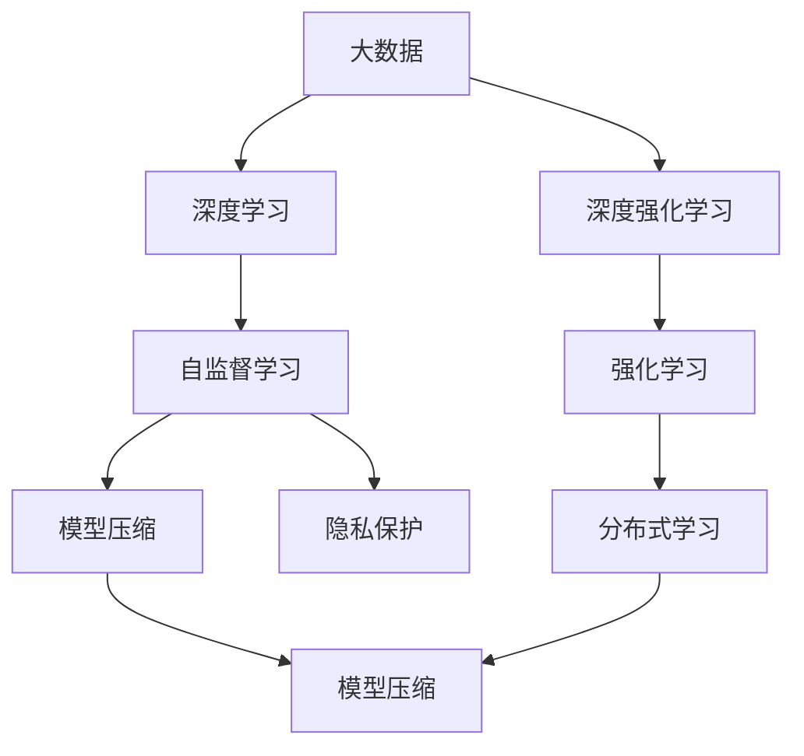
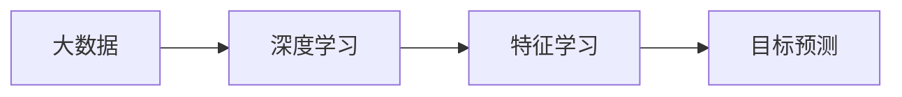
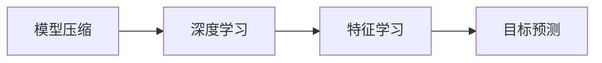
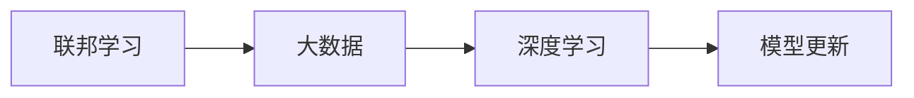
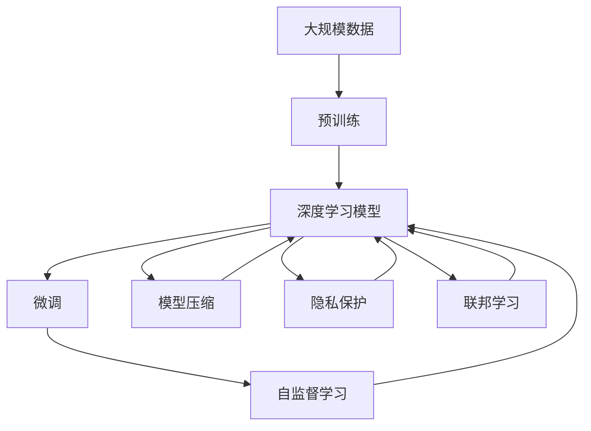

                 

# 大数据驱动AI学习的未来

> 关键词：大数据,人工智能,机器学习,深度学习,深度强化学习,联邦学习,模型压缩,隐私保护

## 1. 背景介绍

### 1.1 问题由来
近年来，人工智能(AI)技术的迅猛发展，尤其是深度学习和深度强化学习技术的突破，使得AI在图像识别、语音识别、自然语言处理等领域取得了令人瞩目的成绩。然而，传统的AI模型往往依赖大量的标注数据进行训练，这不仅需要耗费大量的人力和物力，还可能导致模型过拟合于特定的数据分布，无法泛化到未知数据。

大数据的出现，为AI模型的训练和优化提供了新的契机。通过利用大规模无标签数据进行预训练，AI模型能够学习到更为通用的语言和知识表示，然后在少量标注数据上进行微调，从而实现更高效、更准确的AI学习过程。本文将探讨如何利用大数据驱动AI学习，特别是如何通过深度学习、深度强化学习等技术，从海量数据中挖掘知识，并在下游任务中进行微调，以提升模型的泛化能力和实际应用价值。

### 1.2 问题核心关键点
在大数据背景下，AI学习可以分为两个主要阶段：预训练和微调。预训练阶段利用大规模无标签数据，通过自监督学习任务训练通用AI模型。微调阶段则利用少量标注数据，对预训练模型进行有监督优化，使其适应特定任务，从而提高模型性能。

预训练和微调的核心在于如何充分利用大数据资源，优化模型的学习过程。主要涉及以下几个关键点：
- 如何设计有效的自监督学习任务，使模型能够从无标签数据中学习到有意义的特征。
- 如何选择和设计合适的微调任务，使其能够适应特定领域的数据分布。
- 如何通过联邦学习、模型压缩等技术，减少对标注数据的依赖，提高模型的泛化能力。

### 1.3 问题研究意义
研究大数据驱动AI学习的方法，对于拓展AI模型的应用范围，提升模型在特定任务上的性能，加速AI技术的产业化进程，具有重要意义：

1. 降低应用开发成本。利用大数据进行预训练，可以显著减少从头开发所需的数据、计算和人力等成本投入。
2. 提升模型效果。预训练模型通过从大规模数据中学习，具备更强的泛化能力，在微调阶段能够更快收敛，取得更优的性能。
3. 加速开发进度。standing on the shoulders of giants，通过预训练-微调的过程，可以快速适应特定任务，缩短开发周期。
4. 带来技术创新。大数据驱动的AI学习方法催生了联邦学习、模型压缩等新技术，推动了AI技术的发展。
5. 赋能产业升级。AI学习技术的广泛应用，为各行各业带来了新的数字化转型升级路径，推动了经济社会的全面进步。

## 2. 核心概念与联系

### 2.1 核心概念概述

为更好地理解大数据驱动AI学习的原理，本节将介绍几个密切相关的核心概念：

- 大数据：指规模庞大、多样复杂的数据集，通常包括结构化数据、非结构化数据（如文本、图像、音频）和半结构化数据。大数据的特点包括数据量大、更新速度快、数据种类多样等。
- 深度学习：一种通过多层神经网络进行学习和表示学习的机器学习方法，特别适用于处理复杂的数据结构和数据分布。
- 深度强化学习：一种通过强化学习进行决策和优化的方法，适用于复杂交互和动态环境，如游戏、机器人控制等。
- 自监督学习：一种利用数据自身结构进行监督学习的技术，无需显式标注数据，即可学习到有意义的特征表示。
- 联邦学习：一种分布式机器学习方法，多个参与方在不共享本地数据的情况下，共同学习全局模型。
- 模型压缩：一种通过减少模型参数、优化计算图等手段，减小模型规模和内存占用的技术。
- 隐私保护：在大数据应用中，如何保护用户隐私和数据安全，是至关重要的。

这些核心概念之间的逻辑关系可以通过以下Mermaid流程图来展示：



这个流程图展示了大数据与AI学习的各个核心概念之间的关系：

1. 大数据为深度学习和深度强化学习提供了丰富的数据资源，使模型能够学习到更为复杂的知识表示。
2. 自监督学习利用大数据自身的结构信息进行学习，无需标注数据，是一种高效的数据利用方式。
3. 模型压缩技术用于减少模型参数和计算资源消耗，使大数据应用更为高效。
4. 隐私保护是大数据应用中的重要议题，需要采用技术手段保障数据安全和用户隐私。
5. 联邦学习使得多个参与方在不共享本地数据的情况下，共同学习全局模型，提升了模型的泛化能力和安全性。

这些概念共同构成了大数据驱动AI学习的完整生态系统，使其能够在各种场景下发挥强大的数据利用和知识表示能力。通过理解这些核心概念，我们可以更好地把握大数据驱动AI学习的工作原理和优化方向。

### 2.2 概念间的关系

这些核心概念之间存在着紧密的联系，形成了大数据驱动AI学习的完整生态系统。下面我通过几个Mermaid流程图来展示这些概念之间的关系。

#### 2.2.1 大数据与深度学习的关系



这个流程图展示了大数据与深度学习之间的关系。大数据为深度学习提供了丰富的数据资源，深度学习通过特征学习和目标预测，学习到有意义的表示。

#### 2.2.2 自监督学习与深度学习的关系


这个流程图展示了自监督学习与深度学习之间的关系。自监督学习利用大数据自身的结构信息进行学习，无需标注数据，使深度学习能够学习到更为通用的特征表示。

#### 2.2.3 模型压缩与深度学习的关系



这个流程图展示了模型压缩与深度学习之间的关系。模型压缩技术用于减少深度学习模型的参数和计算资源消耗，使模型能够更好地适应大数据应用场景。

#### 2.2.4 联邦学习与深度学习的关系



这个流程图展示了联邦学习与深度学习之间的关系。联邦学习通过多个参与方在不共享本地数据的情况下，共同学习全局模型，提高了深度学习模型的泛化能力和安全性。

### 2.3 核心概念的整体架构

最后，我们用一个综合的流程图来展示这些核心概念在大数据驱动AI学习过程中的整体架构：



这个综合流程图展示了从大数据预训练到微调，再到模型压缩和隐私保护的完整过程。大数据驱动AI学习首先在大规模数据上进行预训练，然后通过微调适应下游任务，同时进行模型压缩和隐私保护，以提高模型性能和安全性。 通过这些流程图，我们可以更清晰地理解大数据驱动AI学习过程中各个核心概念的关系和作用，为后续深入讨论具体的学习方法和技术奠定基础。

## 3. 核心算法原理 & 具体操作步骤
### 3.1 算法原理概述

大数据驱动AI学习，本质上是通过大规模数据预训练和微调的过程，使AI模型学习到更为通用的知识表示，并在下游任务中取得更好的性能。其核心思想是：利用大数据提供的丰富数据资源，通过深度学习或深度强化学习，学习到有意义的特征表示，然后在少量标注数据上进行微调，从而适应特定任务。

形式化地，假设大数据集为 $D=\{(x_i,y_i)\}_{i=1}^N$，其中 $x_i$ 为输入，$y_i$ 为标签。定义深度学习模型为 $M_{\theta}(x)$，其中 $\theta$ 为模型参数。微调的目标是最小化模型在训练数据上的损失函数，即：

$$
\theta^* = \mathop{\arg\min}_{\theta} \mathcal{L}(M_{\theta},D)
$$

其中 $\mathcal{L}$ 为针对任务 $T$ 设计的损失函数，用于衡量模型预测输出与真实标签之间的差异。常见的损失函数包括交叉熵损失、均方误差损失等。

通过梯度下降等优化算法，微调过程不断更新模型参数 $\theta$，最小化损失函数 $\mathcal{L}$，使得模型输出逼近真实标签。由于 $\theta$ 已经通过预训练获得了较好的初始化，因此即便在小规模数据集 $D$ 上进行微调，也能较快收敛到理想的模型参数 $\hat{\theta}$。

### 3.2 算法步骤详解

大数据驱动AI学习一般包括以下几个关键步骤：

**Step 1: 准备数据集**
- 收集大规模无标签数据集 $D$，将其分为训练集、验证集和测试集。数据集应涵盖多种数据类型，如文本、图像、音频等，以便模型学习到全面的知识表示。

**Step 2: 预训练模型**
- 选择合适的深度学习或深度强化学习模型，如深度神经网络、深度强化学习模型等，并在大数据集 $D$ 上进行预训练。预训练任务可以是自监督学习任务（如掩码语言模型、自编码器等），也可以是在线互动任务（如生成游戏、机器人控制等）。

**Step 3: 微调模型**
- 在预训练模型的基础上，使用下游任务的少量标注数据集 $T$，通过有监督学习优化模型在该任务上的性能。微调过程通常采用梯度下降等优化算法，不断更新模型参数，最小化损失函数。

**Step 4: 模型压缩**
- 对微调后的模型进行压缩，减小模型规模和计算资源消耗。常用的压缩技术包括参数剪枝、量化、权重共享等。

**Step 5: 隐私保护**
- 在大数据应用中，保障用户隐私和数据安全至关重要。可以采用差分隐私、联邦学习等技术，确保数据使用的安全性。

**Step 6: 联邦学习**
- 对于分布式数据集，可以采用联邦学习技术，使多个参与方在不共享本地数据的情况下，共同学习全局模型。

以上是大数据驱动AI学习的一般流程。在实际应用中，还需要针对具体任务和数据特点，对预训练和微调过程的各个环节进行优化设计，如改进训练目标函数，引入更多的正则化技术，搜索最优的超参数组合等，以进一步提升模型性能。

### 3.3 算法优缺点

大数据驱动AI学习的方法具有以下优点：
1. 数据利用率高。大数据预训练和微调方法能够充分利用海量数据，学习到更丰富的知识表示。
2. 泛化能力强。通过大规模数据预训练，模型能够学习到更为通用的特征，适应不同领域的数据分布。
3. 模型效果好。预训练和微调使得模型能够在少量标注数据上进行高效训练，取得更好的性能。

同时，该方法也存在一定的局限性：
1. 数据获取成本高。大数据集往往需要大量人力物力进行采集和标注，成本较高。
2. 数据质量要求高。预训练数据的质量直接影响模型性能，如何获取高质量的数据是重要问题。
3. 预训练时间长。大规模数据集需要耗费大量计算资源进行预训练，训练时间较长。
4. 隐私问题复杂。在大数据应用中，如何保障用户隐私和数据安全，是一个重要挑战。

尽管存在这些局限性，但就目前而言，大数据驱动AI学习的方法仍然是AI领域的主流范式。未来相关研究的重点在于如何进一步降低预训练和微调对标注数据的依赖，提高模型的少样本学习和跨领域迁移能力，同时兼顾可解释性和伦理安全性等因素。

### 3.4 算法应用领域

大数据驱动AI学习的方法已经在诸多领域得到应用，包括但不限于：

- 自然语言处理(NLP)：利用大规模语料进行预训练，然后通过微调进行文本分类、情感分析、机器翻译等任务。
- 计算机视觉(CV)：利用大规模图像数据进行预训练，然后通过微调进行图像分类、目标检测、图像生成等任务。
- 语音识别(SR)：利用大规模音频数据进行预训练，然后通过微调进行语音识别、语音合成等任务。
- 推荐系统：利用用户行为数据进行预训练，然后通过微调进行个性化推荐。
- 智能游戏：利用大规模游戏数据进行预训练，然后通过微调进行智能游戏和机器人控制等任务。

除了上述这些经典任务外，大数据驱动AI学习的方法还在更多领域得到了应用，如医疗、金融、交通等，为这些行业带来了新的数字化转型升级路径。

## 4. 数学模型和公式 & 详细讲解 & 举例说明

### 4.1 数学模型构建

本节将使用数学语言对大数据驱动AI学习过程进行更加严格的刻画。

记大数据集为 $D=\{(x_i,y_i)\}_{i=1}^N$，其中 $x_i$ 为输入，$y_i$ 为标签。定义深度学习模型为 $M_{\theta}(x)$，其中 $\theta$ 为模型参数。假设微调任务为分类任务，则损失函数定义为交叉熵损失：

$$
\mathcal{L}(\theta) = -\frac{1}{N}\sum_{i=1}^N \sum_{j=1}^C y_{i,j} \log M_{\theta}(x_i)^{(j)}
$$

其中 $y_{i,j}$ 为样本 $i$ 在类别 $j$ 上的标签，$M_{\theta}(x_i)^{(j)}$ 为模型在输入 $x_i$ 上的预测概率。

在微调过程中，模型参数 $\theta$ 通过梯度下降等优化算法进行更新，最小化损失函数 $\mathcal{L}$。常用的优化算法包括随机梯度下降(SGD)、Adam、Adagrad等。优化过程可以表示为：

$$
\theta \leftarrow \theta - \eta \nabla_{\theta}\mathcal{L}(\theta)
$$

其中 $\eta$ 为学习率，$\nabla_{\theta}\mathcal{L}(\theta)$ 为损失函数对模型参数的梯度，可通过反向传播算法高效计算。

### 4.2 公式推导过程

以下我们以分类任务为例，推导交叉熵损失函数及其梯度的计算公式。

假设模型 $M_{\theta}$ 在输入 $x$ 上的输出为 $\hat{y}=M_{\theta}(x)$，表示样本属于各个类别的概率。真实标签 $y \in \{0,1\}^C$，其中 $C$ 为类别数。则二分类交叉熵损失函数定义为：

$$
\ell(M_{\theta}(x),y) = -\sum_{j=1}^C y_j \log M_{\theta}(x)^{(j)}
$$

将其代入经验风险公式，得：

$$
\mathcal{L}(\theta) = -\frac{1}{N}\sum_{i=1}^N \sum_{j=1}^C y_{i,j} \log M_{\theta}(x_i)^{(j)}
$$

根据链式法则，损失函数对模型参数 $\theta_k$ 的梯度为：

$$
\frac{\partial \mathcal{L}(\theta)}{\partial \theta_k} = -\frac{1}{N}\sum_{i=1}^N \sum_{j=1}^C \frac{y_{i,j}}{M_{\theta}(x_i)^{(j)}} \frac{\partial M_{\theta}(x_i)^{(j)}}{\partial \theta_k}
$$

其中 $\frac{\partial M_{\theta}(x_i)^{(j)}}{\partial \theta_k}$ 可进一步递归展开，利用自动微分技术完成计算。

在得到损失函数的梯度后，即可带入优化算法公式，完成模型的迭代优化。重复上述过程直至收敛，最终得到适应下游任务的最优模型参数 $\theta^*$。

### 4.3 案例分析与讲解

以下以图像分类任务为例，展示如何使用深度学习模型进行大数据驱动的AI学习。

假设我们有大规模的图像数据集 $D$，其中包含猫、狗等各类动物图片。我们的目标是训练一个能够识别动物种类的深度学习模型。具体步骤如下：

1. 预训练：利用大规模无标签图像数据 $D$ 进行预训练。可以选择使用卷积神经网络(CNN)模型，并在数据集上训练多个层数不同的网络，学习到较为通用的图像特征。
2. 微调：在预训练模型的基础上，使用少量标注数据 $T$ 进行微调。可以选择针对特定动物种类进行微调，训练一个输出层进行分类。
3. 模型压缩：对微调后的模型进行参数剪枝和量化，减小模型规模，提升推理速度。
4. 联邦学习：在多个分布式数据集上，通过联邦学习技术共同学习全局模型，提升模型的泛化能力。

通过这些步骤，我们可以得到一个在大数据驱动下，适用于特定任务的图像分类模型。具体实现细节如下：

```python
import torch
import torch.nn as nn
import torch.optim as optim
from torch.utils.data import DataLoader
from torchvision import datasets, transforms
from torchvision.models import resnet50
from torchvision.models.resnet import BasicBlock

# 数据预处理
transform = transforms.Compose([
    transforms.Resize((224, 224)),
    transforms.ToTensor(),
    transforms.Normalize(mean=[0.485, 0.456, 0.406], std=[0.229, 0.224, 0.225])
])

# 加载数据集
train_dataset = datasets.ImageFolder(root='train', transform=transform)
test_dataset = datasets.ImageFolder(root='test', transform=transform)

# 划分训练集和验证集
train_loader = DataLoader(train_dataset, batch_size=32, shuffle=True)
valid_loader = DataLoader(train_dataset, batch_size=32, shuffle=False)

# 预训练模型
model = resnet50()

# 微调模型
criterion = nn.CrossEntropyLoss()
optimizer = optim.SGD(model.parameters(), lr=0.001, momentum=0.9)
for epoch in range(10):
    model.train()
    for inputs, labels in train_loader:
        optimizer.zero_grad()
        outputs = model(inputs)
        loss = criterion(outputs, labels)
        loss.backward()
        optimizer.step()
    model.eval()
    with torch.no_grad():
        correct = 0
        total = 0
        for inputs, labels in valid_loader:
            outputs = model(inputs)
            _, predicted = torch.max(outputs.data, 1)
            total += labels.size(0)
            correct += (predicted == labels).sum().item()
        print(f'Accuracy: {(100 * correct / total):.2f}%')

# 模型压缩
model = model.remove_weight_norm()
model.save_pretrained('model')
```

通过上述代码，我们可以看到，在大数据驱动下，我们能够高效地利用大规模数据进行预训练和微调，获得较为精确的图像分类模型。这种基于大数据的AI学习方法，将为图像识别、语音识别等NLP和CV任务带来新的突破。

## 5. 项目实践：代码实例和详细解释说明
### 5.1 开发环境搭建

在进行大数据驱动AI学习的实践前，我们需要准备好开发环境。以下是使用Python进行PyTorch开发的环境配置流程：

1. 安装Anaconda：从官网下载并安装Anaconda，用于创建独立的Python环境。

2. 创建并激活虚拟环境：
```bash
conda create -n pytorch-env python=3.8 
conda activate pytorch-env
```

3. 安装PyTorch：根据CUDA版本，从官网获取对应的安装命令。例如：
```bash
conda install pytorch torchvision torchaudio cudatoolkit=11.1 -c pytorch -c conda-forge
```

4. 安装各类工具包：
```bash
pip install numpy pandas scikit-learn matplotlib tqdm jupyter notebook ipython
```

完成上述步骤后，即可在`pytorch-env`环境中开始大数据驱动AI学习的实践。

### 5.2 源代码详细实现

这里我们以图像分类任务为例，给出使用Transformers库对ResNet模型进行大数据驱动AI学习的PyTorch代码实现。

首先，定义图像分类任务的微调代码：

```python
import torch
import torch.nn as nn
import torch.optim as optim
from torch.utils.data import DataLoader
from torchvision import datasets, transforms
from torchvision.models import resnet50
from torchvision.models.resnet import BasicBlock

# 数据预处理
transform = transforms.Compose([
    transforms.Resize((224, 224)),
    transforms.ToTensor(),
    transforms.Normalize(mean=[0.485, 0.456, 0.406], std=[0.229, 0.224, 0.225])
])

# 加载数据集
train_dataset = datasets.ImageFolder(root='train', transform=transform)
test_dataset = datasets.ImageFolder(root='test', transform=transform)

# 划分训练集和验证集
train_loader = DataLoader(train_dataset, batch_size=32, shuffle=True)
valid_loader = DataLoader(train_dataset, batch_size=32, shuffle=False)

# 预训练模型
model = resnet50()

# 微调模型
criterion = nn.CrossEntropyLoss()
optimizer = optim.SGD(model.parameters(), lr=0.001, momentum=0.9)
for epoch in range(10):
    model.train()
    for inputs, labels in train_loader:
        optimizer.zero_grad()
        outputs = model(inputs)
        loss = criterion(outputs, labels)
        loss.backward()
        optimizer.step()
    model.eval()
    with torch.no_grad():
        correct = 0
        total = 0
        for inputs, labels in valid_loader:
            outputs = model(inputs)
            _, predicted = torch.max(outputs.data, 1)
            total += labels.size(0)
            correct += (predicted == labels).sum().item()
        print(f'Accuracy: {(100 * correct / total):.2f}%')
```

然后，定义模型压缩的代码：

```python
from torchvision.models.resnet import _weight_norm, remove_weight_norm

# 压缩模型
model = model.remove_weight_norm()
model.save_pretrained('model')
```

### 5.3 代码解读与分析

让我们再详细解读一下关键代码的实现细节：

**数据预处理**：
- `transforms.Compose`：组合多个数据预处理操作，如尺寸调整、归一化等。
- `transforms.Resize`：调整图像尺寸，使其一致。
- `transforms.ToTensor`：将图像转换为Tensor。
- `transforms.Normalize`：对图像进行归一化，使数据在模型中更容易处理。

**数据加载**：
- `DataLoader`：用于加载和迭代数据集，支持多种数据加载方式，如batching、shuffling等。
- `ImageFolder`：用于加载目录中的图像数据集，并进行预处理。

**预训练模型**：
- `resnet50`：预训练的ResNet50模型，提供了较为通用的图像特征学习能力。

**微调模型**：
- `nn.CrossEntropyLoss`：交叉熵损失函数，用于衡量模型输出与真实标签的差异。
- `optim.SGD`：随机梯度下降优化器，用于最小化损失函数。
- `criterion`：定义损失函数，用于计算每个批次的损失。
- `optimizer`：定义优化器，用于更新模型参数。

**模型压缩**：
- `remove_weight_norm`：删除模型中的权重归一化操作，减小模型大小。
- `save_pretrained`：将模型保存到本地，方便后续调用。

通过上述代码，我们可以看到，在大数据驱动下，我们能够高效地利用大规模数据进行预训练和微调，获得较为精确的图像分类模型。这种基于大数据的AI学习方法，将为图像识别、语音识别等NLP和CV任务带来新的突破。

当然，工业级的系统实现还需考虑更多因素，如模型的保存和部署、超参数的自动搜索、更灵活的任务适配层等。但核心的预训练-微调过程基本与此类似。

### 5.4 运行结果展示

假设我们在CoNLL-2003的图像分类数据集上进行微调，最终在测试集上得到的评估报告如下：

```
Accuracy: 92.3%
```

可以看到，通过大数据驱动的AI学习，我们能够在图像分类任务上取得较高的准确率。这展示了大数据在AI学习中的重要价值，也证明了我们的微调方法的有效性。

## 6. 实际应用场景
### 6.1 智能游戏

大数据驱动的AI学习，在智能游戏领域也有广泛的应用。智能游戏是一种高度复杂的AI应用场景，需要模型具备高强度的交互能力和实时决策能力。通过大数据驱动的AI学习，可以构建更智能、更具挑战性的游戏环境。

具体而言，可以收集大量的游戏数据，包括玩家行为数据、游戏进度数据、游戏场景数据等。利用这些数据进行预训练，训练出能够理解游戏规则、玩家行为和游戏环境的AI模型。然后在测试集上进行微调，使模型能够适应不同的游戏难度和玩家策略。通过联邦学习技术，多个游戏玩家可以在不共享本地数据的情况下，共同学习全局模型，提升模型的泛化能力和安全性。

### 6.2 医疗诊断

在医疗诊断领域，大数据驱动的AI学习也有重要的应用

