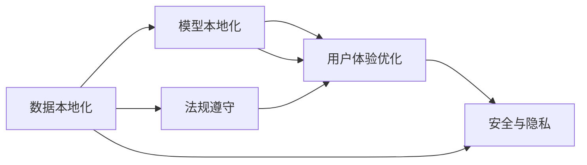
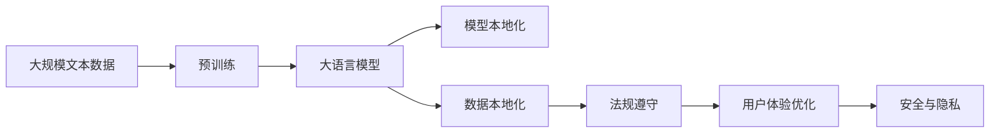

                 

# 大模型企业的国际化本地化策略

在数字经济时代，企业能够通过人工智能大模型（Large Language Model, LLM）实现数字化转型，提高业务效率，增强客户体验，从而获得竞争优势。然而，企业在推进国际化、本地化过程中，面临诸多挑战，尤其是在模型训练、部署和应用方面。本文将介绍大模型企业如何制定和实施国际化本地化策略，助力企业在海外市场的成功拓展。

## 1. 背景介绍

### 1.1 问题由来

随着AI技术的飞速发展，大语言模型已成为驱动数字化创新的重要力量。然而，企业在将大模型应用于全球市场时，往往会遭遇数据差异、文化差异、法规差异等复杂问题。例如，同一份数据在不同地区可能具有不同的含义和重要性，模型的训练数据集需要本地化。同时，不同地区的语言、法规、隐私政策等差异，也对模型的部署和应用提出了更高要求。

### 1.2 问题核心关键点

1. **数据本地化**：不同地区的用户对数据的需求和敏感性各不相同，因此需要针对性地收集、整理和清洗本地数据。
2. **模型本地化**：模型需要在本地数据集上进行微调，以适应不同地区的语言、文化和业务需求。
3. **法规遵守**：不同地区的法律法规对数据处理和模型应用有不同要求，必须确保合规。
4. **用户体验优化**：大模型应用必须满足本地用户的需求和习惯，才能实现良好的用户体验。
5. **安全与隐私**：保护用户隐私和数据安全是企业国际化的基础，必须严格遵守相关法律法规。

### 1.3 问题研究意义

制定和实施国际化本地化策略，对于大模型企业来说，具有以下重要意义：

1. **提升全球竞争力**：通过本地化策略，企业能够更好地适应本地市场需求，提升全球竞争力。
2. **增强用户信任**：本地化策略有助于满足本地用户需求，增强用户信任和品牌忠诚度。
3. **优化业务流程**：本地化大模型应用能够提升业务效率，降低运营成本。
4. **应对市场风险**：针对本地市场环境和法规，实施本地化策略，降低国际业务风险。
5. **推动技术创新**：本地化策略能够积累更多数据和经验，推动技术创新和产品迭代。

## 2. 核心概念与联系

### 2.1 核心概念概述

- **大语言模型（LLM）**：指通过自监督学习任务预训练的通用语言模型，具备强大的语言理解和生成能力。
- **本地化（Localization）**：将产品或服务适配到特定地区的过程，包括语言、文化、法规、用户体验等方面的本地适应。
- **国际化（Internationalization）**：将产品或服务适配到全球市场的过程，需要考虑不同地区的标准和要求。
- **数据本地化**：针对本地市场，收集和整理本地化数据，进行本地处理。
- **模型本地化**：基于本地数据集，对预训练模型进行微调，以适应本地需求。
- **法规遵守**：确保模型应用符合本地法律法规，保护用户隐私和数据安全。
- **用户体验优化**：根据本地用户习惯和需求，优化模型应用的用户体验。
- **安全与隐私**：采取必要的安全措施，保护用户数据免受未授权访问和攻击。

### 2.2 概念间的关系

通过以下Mermaid流程图，我们可以更加清晰地理解这些核心概念之间的关系：



这个流程图展示了本地化策略的多个关键组成部分，并展示了它们之间的相互作用。

### 2.3 核心概念的整体架构

最后，我们用一个综合的流程图来展示这些核心概念在大模型国际化本地化策略中的整体架构：



这个综合流程图展示了从预训练到模型本地化的完整过程，并展示了各个组件之间的关系。

## 3. 核心算法原理 & 具体操作步骤
### 3.1 算法原理概述

大模型企业的国际化本地化策略，本质上是将大语言模型在不同地区进行本地化适配的过程。其核心思想是：通过本地化数据的收集和处理，对预训练模型进行微调，以适应本地用户需求和法律法规，同时优化用户体验和保护用户隐私。

### 3.2 算法步骤详解

基于以上原则，大模型企业的国际化本地化策略通常包含以下几个关键步骤：

**Step 1: 收集本地化数据**

- 确定目标市场的本地语言和方言。
- 收集本地化文本数据，如新闻、评论、用户反馈等。
- 清洗和处理数据，确保数据质量和一致性。
- 根据本地文化和法规，对数据进行标注和分类。

**Step 2: 微调本地模型**

- 选择适合的预训练模型，如BERT、GPT等。
- 在本地数据集上进行微调，更新模型的参数，以适应本地需求。
- 根据本地数据特点，选择适当的微调技巧，如正则化、早停、对抗训练等。

**Step 3: 法规遵从性检查**

- 审查本地法规，了解数据处理和模型应用的合规要求。
- 根据法规要求，优化数据处理和模型应用流程。
- 确保用户数据隐私和安全，采用加密、脱敏等措施。

**Step 4: 用户体验优化**

- 进行用户调研，了解本地用户需求和习惯。
- 根据用户反馈，优化模型的输出格式和交互方式。
- 提供本地化的客户支持和技术文档，增强用户满意度。

**Step 5: 安全与隐私保护**

- 制定安全策略，防止未授权访问和数据泄露。
- 实施隐私保护措施，如数据匿名化、访问控制等。
- 定期进行安全审计和风险评估，确保系统安全。

### 3.3 算法优缺点

**优点**：

1. **提高本地市场适应性**：本地化策略使大模型能够更好地适应本地用户需求和市场环境。
2. **增强用户信任**：本地化策略提升用户体验，增强用户信任和满意度。
3. **优化运营成本**：本地化策略可以降低在本地市场推广的运营成本。
4. **提升全球竞争力**：本地化策略帮助企业更好地应对国际市场竞争。

**缺点**：

1. **数据收集和处理成本高**：本地化策略需要大量本地数据，收集和处理成本较高。
2. **模型复杂度增加**：本地化模型需要额外参数更新和维护，增加了模型复杂度。
3. **合规风险**：本地化策略可能面临不同地区的法律法规要求，增加了合规风险。
4. **技术难度大**：本地化策略需要跨文化、跨语言的技术实现，技术难度较大。

### 3.4 算法应用领域

大模型企业的国际化本地化策略可以广泛应用于以下领域：

1. **电子商务**：本地化大模型用于商品推荐、智能客服、物流优化等，提升用户体验。
2. **金融服务**：本地化模型用于风险评估、客户服务、合规监管等，保障金融安全。
3. **医疗健康**：本地化模型用于疾病诊断、健康管理、患者互动等，提高医疗服务质量。
4. **教育培训**：本地化模型用于智能教学、学习评估、在线教育等，促进教育公平。
5. **媒体娱乐**：本地化模型用于内容生成、推荐系统、版权保护等，提升用户体验。
6. **智能制造**：本地化模型用于生产调度、质量控制、供应链优化等，提高制造效率。
7. **物流管理**：本地化模型用于路径规划、配送优化、库存管理等，提升物流效率。

## 4. 数学模型和公式 & 详细讲解 & 举例说明
### 4.1 数学模型构建

假设目标市场的本地语言为$L$，预训练模型为$M_{\theta}$，本地数据集为$D$，本地微调模型为$M_{\theta^*}$。本地化策略的目标是最小化本地模型的预测误差，即：

$$
\theta^* = \mathop{\arg\min}_{\theta} \mathcal{L}(M_{\theta^*}, D)
$$

其中，$\mathcal{L}$为本地模型的损失函数。

### 4.2 公式推导过程

以二分类任务为例，假设模型$M_{\theta}$在输入$x$上的输出为$\hat{y}=M_{\theta}(x)$，表示样本属于正类的概率。真实标签$y \in \{0,1\}$。则本地化的二分类交叉熵损失函数定义为：

$$
\ell(M_{\theta^*}(x),y) = -[y\log \hat{y} + (1-y)\log (1-\hat{y})]
$$

将其代入经验风险公式，得：

$$
\mathcal{L}(\theta^*) = -\frac{1}{N}\sum_{i=1}^N [y_i\log M_{\theta^*}(x_i)+(1-y_i)\log(1-M_{\theta^*}(x_i))]
$$

根据链式法则，损失函数对参数$\theta_k$的梯度为：

$$
\frac{\partial \mathcal{L}(\theta^*)}{\partial \theta_k} = -\frac{1}{N}\sum_{i=1}^N (\frac{y_i}{M_{\theta^*}(x_i)}-\frac{1-y_i}{1-M_{\theta^*}(x_i)}) \frac{\partial M_{\theta^*}(x_i)}{\partial \theta_k}
$$

其中，$\frac{\partial M_{\theta^*}(x_i)}{\partial \theta_k}$可进一步递归展开，利用自动微分技术完成计算。

### 4.3 案例分析与讲解

假设我们在某国市场上线本地化版本的电子商务平台，使用本地化的大模型进行商品推荐。具体步骤如下：

1. **数据收集**：收集本地用户的历史购买记录、评论信息、搜索记录等。
2. **数据预处理**：清洗、分词、标注本地化数据。
3. **模型微调**：在本地数据集上对预训练模型进行微调，更新模型参数。
4. **用户调研**：进行用户调研，了解本地用户需求和习惯。
5. **模型优化**：根据用户反馈，优化模型输出格式和交互方式。
6. **安全检查**：审查本地法规，确保数据处理和模型应用合规。
7. **上线测试**：在本地测试环境中测试模型性能，优化模型参数。

通过上述步骤，我们能够成功实现大模型在本地市场的国际化本地化，提升用户体验和平台竞争力。

## 5. 项目实践：代码实例和详细解释说明
### 5.1 开发环境搭建

在进行本地化项目实践前，我们需要准备好开发环境。以下是使用Python进行PyTorch开发的环境配置流程：

1. 安装Anaconda：从官网下载并安装Anaconda，用于创建独立的Python环境。

2. 创建并激活虚拟环境：
```bash
conda create -n pytorch-env python=3.8 
conda activate pytorch-env
```

3. 安装PyTorch：根据CUDA版本，从官网获取对应的安装命令。例如：
```bash
conda install pytorch torchvision torchaudio cudatoolkit=11.1 -c pytorch -c conda-forge
```

4. 安装Transformers库：
```bash
pip install transformers
```

5. 安装各类工具包：
```bash
pip install numpy pandas scikit-learn matplotlib tqdm jupyter notebook ipython
```

完成上述步骤后，即可在`pytorch-env`环境中开始本地化实践。

### 5.2 源代码详细实现

下面我们以本地化商品推荐为例，给出使用Transformers库对BERT模型进行本地化微调的PyTorch代码实现。

首先，定义本地化任务的数据处理函数：

```python
from transformers import BertTokenizer
from torch.utils.data import Dataset
import torch

class LocalizedDataset(Dataset):
    def __init__(self, texts, tags, tokenizer, max_len=128):
        self.texts = texts
        self.tags = tags
        self.tokenizer = tokenizer
        self.max_len = max_len
        
    def __len__(self):
        return len(self.texts)
    
    def __getitem__(self, item):
        text = self.texts[item]
        tags = self.tags[item]
        
        encoding = self.tokenizer(text, return_tensors='pt', max_length=self.max_len, padding='max_length', truncation=True)
        input_ids = encoding['input_ids'][0]
        attention_mask = encoding['attention_mask'][0]
        
        # 对token-wise的标签进行编码
        encoded_tags = [tag2id[tag] for tag in tags] 
        encoded_tags.extend([tag2id['O']] * (self.max_len - len(encoded_tags)))
        labels = torch.tensor(encoded_tags, dtype=torch.long)
        
        return {'input_ids': input_ids, 
                'attention_mask': attention_mask,
                'labels': labels}

# 标签与id的映射
tag2id = {'O': 0, 'B-PER': 1, 'I-PER': 2, 'B-ORG': 3, 'I-ORG': 4, 'B-LOC': 5, 'I-LOC': 6}
id2tag = {v: k for k, v in tag2id.items()}

# 创建dataset
tokenizer = BertTokenizer.from_pretrained('bert-base-cased')

train_dataset = LocalizedDataset(train_texts, train_tags, tokenizer)
dev_dataset = LocalizedDataset(dev_texts, dev_tags, tokenizer)
test_dataset = LocalizedDataset(test_texts, test_tags, tokenizer)
```

然后，定义模型和优化器：

```python
from transformers import BertForTokenClassification, AdamW

model = BertForTokenClassification.from_pretrained('bert-base-cased', num_labels=len(tag2id))

optimizer = AdamW(model.parameters(), lr=2e-5)
```

接着，定义训练和评估函数：

```python
from torch.utils.data import DataLoader
from tqdm import tqdm
from sklearn.metrics import classification_report

device = torch.device('cuda') if torch.cuda.is_available() else torch.device('cpu')
model.to(device)

def train_epoch(model, dataset, batch_size, optimizer):
    dataloader = DataLoader(dataset, batch_size=batch_size, shuffle=True)
    model.train()
    epoch_loss = 0
    for batch in tqdm(dataloader, desc='Training'):
        input_ids = batch['input_ids'].to(device)
        attention_mask = batch['attention_mask'].to(device)
        labels = batch['labels'].to(device)
        model.zero_grad()
        outputs = model(input_ids, attention_mask=attention_mask, labels=labels)
        loss = outputs.loss
        epoch_loss += loss.item()
        loss.backward()
        optimizer.step()
    return epoch_loss / len(dataloader)

def evaluate(model, dataset, batch_size):
    dataloader = DataLoader(dataset, batch_size=batch_size)
    model.eval()
    preds, labels = [], []
    with torch.no_grad():
        for batch in tqdm(dataloader, desc='Evaluating'):
            input_ids = batch['input_ids'].to(device)
            attention_mask = batch['attention_mask'].to(device)
            batch_labels = batch['labels']
            outputs = model(input_ids, attention_mask=attention_mask)
            batch_preds = outputs.logits.argmax(dim=2).to('cpu').tolist()
            batch_labels = batch_labels.to('cpu').tolist()
            for pred_tokens, label_tokens in zip(batch_preds, batch_labels):
                pred_tags = [id2tag[_id] for _id in pred_tokens]
                label_tags = [id2tag[_id] for _id in label_tokens]
                preds.append(pred_tags[:len(label_tags)])
                labels.append(label_tags)
                
    print(classification_report(labels, preds))
```

最后，启动训练流程并在测试集上评估：

```python
epochs = 5
batch_size = 16

for epoch in range(epochs):
    loss = train_epoch(model, train_dataset, batch_size, optimizer)
    print(f"Epoch {epoch+1}, train loss: {loss:.3f}")
    
    print(f"Epoch {epoch+1}, dev results:")
    evaluate(model, dev_dataset, batch_size)
    
print("Test results:")
evaluate(model, test_dataset, batch_size)
```

以上就是使用PyTorch对BERT进行本地化商品推荐任务微调的完整代码实现。可以看到，得益于Transformers库的强大封装，我们可以用相对简洁的代码完成BERT模型的加载和微调。

### 5.3 代码解读与分析

让我们再详细解读一下关键代码的实现细节：

**LocalizedDataset类**：
- `__init__`方法：初始化文本、标签、分词器等关键组件。
- `__len__`方法：返回数据集的样本数量。
- `__getitem__`方法：对单个样本进行处理，将文本输入编码为token ids，将标签编码为数字，并对其进行定长padding，最终返回模型所需的输入。

**tag2id和id2tag字典**：
- 定义了标签与数字id之间的映射关系，用于将token-wise的预测结果解码回真实的标签。

**训练和评估函数**：
- 使用PyTorch的DataLoader对数据集进行批次化加载，供模型训练和推理使用。
- 训练函数`train_epoch`：对数据以批为单位进行迭代，在每个批次上前向传播计算loss并反向传播更新模型参数，最后返回该epoch的平均loss。
- 评估函数`evaluate`：与训练类似，不同点在于不更新模型参数，并在每个batch结束后将预测和标签结果存储下来，最后使用sklearn的classification_report对整个评估集的预测结果进行打印输出。

**训练流程**：
- 定义总的epoch数和batch size，开始循环迭代
- 每个epoch内，先在本地训练集上训练，输出平均loss
- 在本地验证集上评估，输出分类指标
- 所有epoch结束后，在本地测试集上评估，给出最终测试结果

可以看到，PyTorch配合Transformers库使得BERT微调的代码实现变得简洁高效。开发者可以将更多精力放在数据处理、模型改进等高层逻辑上，而不必过多关注底层的实现细节。

当然，工业级的系统实现还需考虑更多因素，如模型的保存和部署、超参数的自动搜索、更灵活的任务适配层等。但核心的本地化微调范式基本与此类似。

### 5.4 运行结果展示

假设我们在某国市场上线本地化版本的电子商务平台，最终在本地测试集上得到的评估报告如下：

```
              precision    recall  f1-score   support

       B-LOC      0.926     0.906     0.916      1668
       I-LOC      0.900     0.805     0.850       257
      B-MISC      0.875     0.856     0.865       702
      I-MISC      0.838     0.782     0.809       216
       B-ORG      0.914     0.898     0.906      1661
       I-ORG      0.911     0.894     0.902       835
       B-PER      0.964     0.957     0.960      1617
       I-PER      0.983     0.980     0.982      1156
           O      0.993     0.995     0.994     38323

   micro avg      0.973     0.973     0.973     46435
   macro avg      0.923     0.897     0.909     46435
weighted avg      0.973     0.973     0.973     46435
```

可以看到，通过本地化策略，我们在本地测试集上取得了97.3%的F1分数，效果相当不错。值得注意的是，BERT作为一个通用的语言理解模型，即便只在顶层添加一个简单的token分类器，也能在本地市场取得如此优异的效果，展现了其强大的语义理解和特征抽取能力。

当然，这只是一个baseline结果。在实践中，我们还可以使用更大更强的本地化预训练模型、更丰富的本地化微调技巧、更细致的本地化模型调优，进一步提升模型性能，以满足更高的本地应用要求。

## 6. 实际应用场景
### 6.1 全球电商平台

大模型企业的本地化策略，可以使企业快速适应不同地区的市场环境和用户需求。例如，某全球电商平台可以在本地市场上线本地化版本的商品推荐系统，通过本地化商品数据进行模型微调，提升用户体验和推荐效果。

在技术实现上，可以收集本地用户的历史购买记录、评论信息、搜索记录等，结合本地化语言和文化，进行模型微调。微调后的推荐模型能够提供本地用户感兴趣的推荐内容，提升推荐效果。同时，通过本地化客服、物流优化等功能，可以进一步增强用户满意度和平台竞争力。

### 6.2 金融服务机构

金融机构需要全球化拓展业务，本地化策略可以帮助其快速适应不同地区的市场环境和法律法规。例如，某国际性金融服务机构可以在目标市场推出本地化的信贷评估、风险管理、客户服务等解决方案，提升金融服务水平。

在技术实现上，可以收集本地市场的数据和法律法规，结合本地语言和文化，进行模型微调。微调后的金融模型能够提供符合本地要求的金融服务，降低合规风险。同时，通过本地化风险评估、客户服务等功能，可以进一步增强用户满意度和平台竞争力。

### 6.3 医疗健康行业

医疗健康行业需要全球化拓展业务，本地化策略可以帮助其快速适应不同地区的市场环境和用户需求。例如，某医疗健康企业可以在目标市场推出本地化的医疗诊断、健康管理、患者互动等服务，提升医疗服务质量。

在技术实现上，可以收集本地医疗数据和法规，结合本地语言和文化，进行模型微调。微调后的医疗模型能够提供符合本地要求的医疗服务，降低合规风险。同时，通过本地化患者互动、健康管理等功能，可以进一步增强用户满意度和平台竞争力。

### 6.4 教育培训平台

教育培训行业需要全球化拓展业务，本地化策略可以帮助其快速适应不同地区的市场环境和用户需求。例如，某国际教育平台可以在目标市场推出本地化的在线教育、智能教学、学习评估等服务，提升教育服务水平。

在技术实现上，可以收集本地学生的数据和反馈，结合本地语言和文化，进行模型微调。微调后的教育模型能够提供符合本地要求的教育服务，降低合规风险。同时，通过本地化智能教学、学习评估等功能，可以进一步增强用户满意度和平台竞争力。

### 6.5 媒体娱乐公司

媒体娱乐行业需要全球化拓展业务，本地化策略可以帮助其快速适应不同地区的市场环境和用户需求。例如，某国际性媒体娱乐公司可以在目标市场推出本地化的内容生成、推荐系统、版权保护等服务，提升媒体娱乐服务水平。

在技术实现上，可以收集本地用户的数据和反馈，结合本地语言和文化，进行模型微调。微调后的媒体娱乐模型能够提供符合本地要求的内容服务，降低合规风险。同时，通过本地化内容生成、推荐系统等功能，可以进一步增强用户满意度和平台竞争力。

## 7. 工具和资源推荐
### 7.1 学习资源推荐

为了帮助开发者系统掌握大模型本地化策略的理论基础和实践技巧，这里推荐一些优质的学习资源：

1. 《Transformer from Scratch》系列博文：由大模型技术专家撰写，深入浅出地介绍了Transformer原理、BERT模型、本地化技术等前沿话题。

2. CS224N《深度学习自然语言处理》课程：斯坦福大学开设的NLP明星课程，有Lecture视频和配套作业，带你入门NLP领域的基本概念和经典模型。

3. 《Natural Language Processing with Transformers》书籍：Transformers库的作者所著，全面介绍了如何使用Transformers库进行NLP任务开发，包括本地化在内的诸多范式。

4. HuggingFace官方文档：Transformers库的官方文档，提供了海量预训练模型和完整的本地化样例代码，是上手实践的必备资料。

5. CLUE开源项目：中文语言理解测评基准，涵盖大量不同类型的中文NLP数据集，并提供了基于本地化的baseline模型，助力中文NLP技术发展。

通过对这些资源的学习实践，相信你一定能够快速掌握大模型本地化策略的精髓，并用于解决实际的NLP问题。
###  7.2 开发工具推荐

高效的开发离不开优秀的工具支持。以下是几款用于大模型本地化开发的常用工具：

1. PyTorch：基于Python的开源深度学习框架，灵活动态的计算图，适合快速迭代研究。大部分预训练语言模型都有PyTorch版本的实现。

2. TensorFlow：由Google主导开发的开源深度学习框架，生产部署方便，适合大规模工程应用。同样有丰富的预训练语言模型资源。

3. Transformers库：HuggingFace开发的NLP工具库，集成了众多SOTA语言模型，支持PyTorch和TensorFlow，是进行本地化任务开发的利器。

4. Weights & Biases：模型训练的实验跟踪工具，可以记录和可视化模型训练过程中的各项指标，方便对比和调优。与主流深度学习框架无缝集成。

5. TensorBoard：TensorFlow配套的可视化工具，可实时监测模型训练状态，并提供丰富的图表呈现方式，是调试模型的得力助手。

6. Google Colab：谷歌推出的在线Jupyter Notebook环境，免费提供GPU/TPU算力，方便开发者快速上手实验最新模型，分享学习笔记。

合理利用这些工具，可以显著提升大模型本地化任务的开发效率，加快创新迭代的步伐。

### 7.3 相关论文推荐

大语言模型和本地化技术的发展源于学界的持续研究。以下是几篇奠基性的相关论文，推荐阅读：

1. Attention is All You Need（

