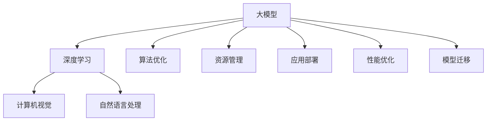
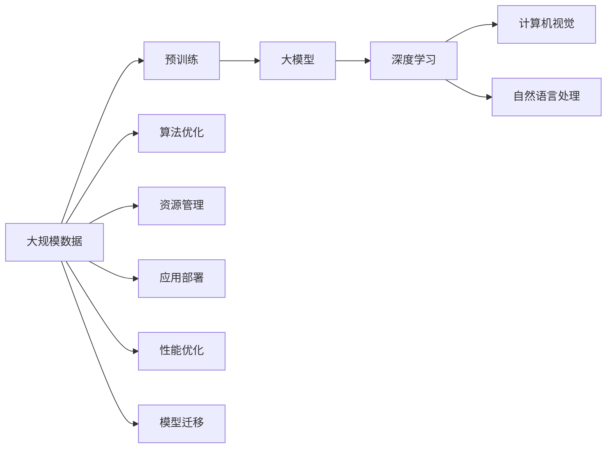
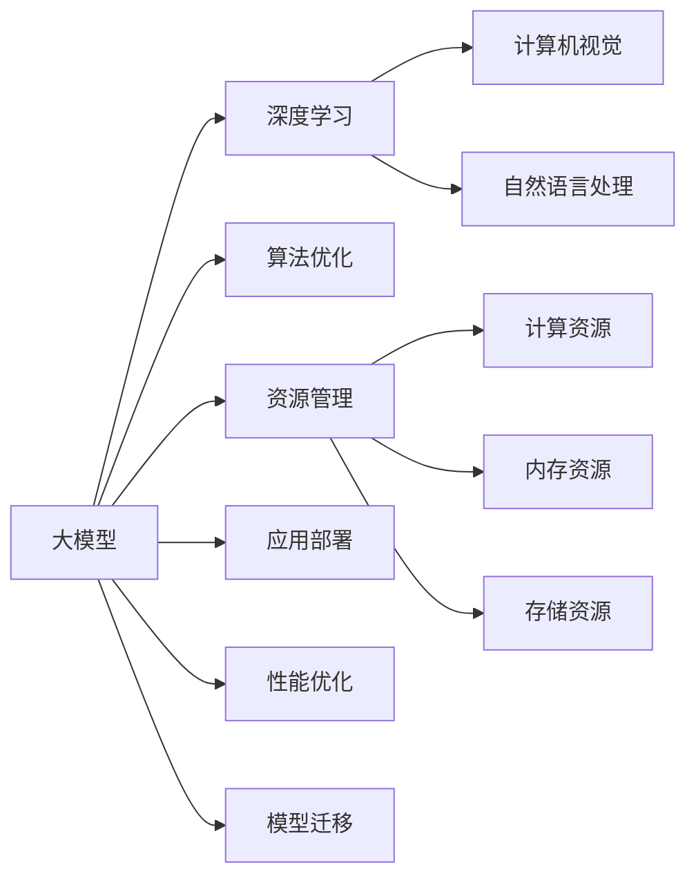
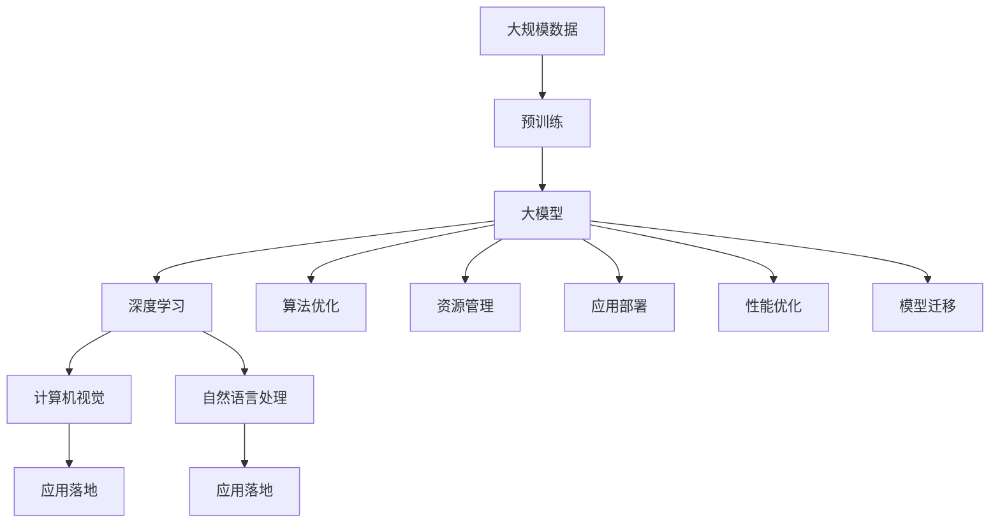

                 

# 大模型公司的默认应用:机遇与挑战并存

> 关键词：大模型,深度学习,应用落地,计算机视觉,自然语言处理,算法优化,资源管理

## 1. 背景介绍

### 1.1 问题由来

随着深度学习技术的飞速发展，大模型已经成为科技巨头们的重要资产。谷歌、微软、亚马逊等公司纷纷投入巨资研发、部署大模型，并形成了一个成熟的生态系统。这些大模型在图像识别、自然语言处理等领域取得了突破性进展，推动了AI技术的发展与应用。

然而，大模型的应用落地面临着诸多挑战。如何合理分配模型资源、优化算法性能、提高应用效率，成为大模型公司需要解决的关键问题。本文将从应用落地的角度，全面探讨大模型公司的核心应用范式与策略，分析其中的机遇与挑战。

### 1.2 问题核心关键点

大模型公司的应用落地问题主要涉及以下几个方面：

1. **算法优化**：如何设计高效的算法，在大模型基础上进行微调或改进来提高模型性能。
2. **资源管理**：如何合理分配模型资源，包括计算资源、内存资源和存储资源。
3. **应用部署**：如何将大模型部署到不同的应用场景中，确保高效稳定运行。
4. **性能优化**：如何提升模型的推理速度和资源利用率，满足实时性要求。
5. **模型迁移**：如何将大模型迁移到不同的硬件平台或云平台，以适应不同的应用场景。

## 2. 核心概念与联系

### 2.1 核心概念概述

为更好地理解大模型公司的应用落地策略，本文将介绍几个关键概念及其相互联系：

- **大模型**：指通过大规模数据预训练得到的深度神经网络模型，如GPT-3、BERT等。
- **深度学习**：一种通过多层神经网络进行学习的机器学习方法，广泛应用于图像识别、自然语言处理等领域。
- **应用落地**：将深度学习模型应用于实际业务场景，实现商业价值的过程。
- **计算机视觉**：利用计算机技术处理和分析图像、视频等视觉数据的学科。
- **自然语言处理**：研究如何让计算机理解、处理人类语言的学科，包括文本分类、问答系统等任务。
- **算法优化**：通过算法改进、模型压缩等手段，提高模型性能和资源利用率。
- **资源管理**：合理分配计算资源、内存资源和存储资源，确保模型高效运行。
- **应用部署**：将模型部署到不同的平台和设备上，确保其在实际环境中的稳定运行。
- **性能优化**：通过优化算法和模型结构，提高模型的推理速度和资源利用率。
- **模型迁移**：将模型迁移到不同的硬件平台或云平台，以适应不同的应用场景。

这些概念之间的逻辑关系可以通过以下Mermaid流程图来展示：



这个流程图展示了大模型的核心概念及其与其他相关概念的联系。大模型基于深度学习技术，广泛应用于计算机视觉和自然语言处理等领域。同时，算法优化、资源管理、应用部署、性能优化和模型迁移等概念，构成了大模型应用落地的重要组成部分。

### 2.2 概念间的关系

这些核心概念之间存在着紧密的联系，形成了一个完整的大模型应用生态系统。下面我们通过几个Mermaid流程图来展示这些概念之间的关系。

#### 2.2.1 大模型的学习范式



这个流程图展示了大模型的学习过程和应用落地流程。大模型通过大规模数据预训练学习通用特征，然后基于深度学习应用于计算机视觉和自然语言处理等具体任务。算法优化、资源管理、应用部署、性能优化和模型迁移等概念，构成了大模型从预训练到应用的完整过程。

#### 2.2.2 大模型应用落地的策略


这个流程图展示了大模型应用落地的主要策略。算法优化、资源管理、应用部署、性能优化和模型迁移等概念，构成了大模型应用落地的关键步骤。这些策略的合理应用，能够有效提高模型的性能和应用效率。

#### 2.2.3 资源管理在大模型应用中的作用



这个流程图展示了资源管理在大模型应用中的作用。计算资源、内存资源和存储资源的管理，是大模型应用落地的重要保障。通过合理的资源分配和优化，能够确保模型高效稳定运行。

### 2.3 核心概念的整体架构

最后，我们用一个综合的流程图来展示这些核心概念在大模型应用落地过程中的整体架构：



这个综合流程图展示了从大规模数据预训练到大模型应用落地的完整过程。大模型通过预训练学习通用特征，然后基于深度学习应用于计算机视觉和自然语言处理等具体任务。算法优化、资源管理、应用部署、性能优化和模型迁移等概念，构成了大模型从预训练到应用的完整生态系统。

## 3. 核心算法原理 & 具体操作步骤
### 3.1 算法原理概述

大模型应用落地的核心算法原理包括：

1. **深度学习算法**：通过多层神经网络进行学习，提取和处理数据特征。
2. **计算机视觉算法**：包括图像分类、目标检测、图像分割等算法。
3. **自然语言处理算法**：包括文本分类、语言模型、问答系统等算法。
4. **算法优化**：通过算法改进、模型压缩等手段，提高模型性能和资源利用率。
5. **资源管理**：合理分配计算资源、内存资源和存储资源，确保模型高效运行。
6. **应用部署**：将模型部署到不同的平台和设备上，确保其在实际环境中的稳定运行。
7. **性能优化**：通过优化算法和模型结构，提高模型的推理速度和资源利用率。
8. **模型迁移**：将模型迁移到不同的硬件平台或云平台，以适应不同的应用场景。

这些算法和技术在大模型应用落地过程中扮演着重要角色，共同构成了大模型生态系统的核心。

### 3.2 算法步骤详解

大模型应用落地的算法步骤包括以下几个关键环节：

1. **数据预处理**：对原始数据进行清洗、归一化、划分训练集和验证集等预处理操作。
2. **模型选择与构建**：选择合适的大模型作为基础，根据应用需求构建新的模型架构。
3. **算法优化**：通过算法改进、模型压缩等手段，提高模型性能和资源利用率。
4. **模型训练**：在训练集上训练模型，优化模型参数，使其适应特定任务。
5. **模型评估**：在验证集上评估模型性能，调整模型参数，确保模型泛化能力。
6. **应用部署**：将模型部署到不同的平台和设备上，确保其在实际环境中的稳定运行。
7. **性能优化**：通过优化算法和模型结构，提高模型的推理速度和资源利用率。
8. **模型迁移**：将模型迁移到不同的硬件平台或云平台，以适应不同的应用场景。

### 3.3 算法优缺点

大模型应用落地的算法具有以下优点：

1. **性能优越**：通过深度学习算法和大模型，能够实现高精度的数据处理和特征提取。
2. **适应性强**：基于大模型的应用，可以适应各种复杂多变的应用场景。
3. **可扩展性高**：大模型具有良好的可扩展性，可以根据需求进行参数调整和模型改进。

但同时也存在一些缺点：

1. **资源消耗大**：大模型的训练和推理需要大量的计算资源、内存资源和存储资源，成本较高。
2. **模型复杂**：大模型结构复杂，需要大量的训练和调试工作。
3. **训练时间长**：大模型的训练时间较长，难以满足实时性要求。

### 3.4 算法应用领域

大模型应用落地技术主要应用于以下领域：

1. **计算机视觉**：如图像分类、目标检测、图像分割等任务。
2. **自然语言处理**：如文本分类、语言模型、问答系统等任务。
3. **智能推荐系统**：基于用户行为数据进行个性化推荐。
4. **语音识别**：将语音转换为文本，进行语音识别和分析。
5. **智能客服**：通过自然语言处理技术，实现智能客服系统。
6. **医疗诊断**：利用图像和文本数据，辅助医疗诊断和疾病预测。
7. **金融风险控制**：利用文本和图像数据，进行风险评估和预测。

## 4. 数学模型和公式 & 详细讲解 & 举例说明

### 4.1 数学模型构建

大模型应用落地的数学模型构建包括以下几个步骤：

1. **模型选择**：选择合适的大模型作为基础，如BERT、ResNet等。
2. **数据预处理**：对原始数据进行清洗、归一化、划分训练集和验证集等预处理操作。
3. **模型训练**：在训练集上训练模型，优化模型参数，使其适应特定任务。
4. **模型评估**：在验证集上评估模型性能，调整模型参数，确保模型泛化能力。
5. **应用部署**：将模型部署到不同的平台和设备上，确保其在实际环境中的稳定运行。
6. **性能优化**：通过优化算法和模型结构，提高模型的推理速度和资源利用率。
7. **模型迁移**：将模型迁移到不同的硬件平台或云平台，以适应不同的应用场景。

### 4.2 公式推导过程

以下是大模型应用落地的数学模型构建和算法优化公式的推导过程：

#### 4.2.1 模型选择

大模型应用落地的数学模型构建包括以下几个步骤：

1. **模型选择**：选择合适的大模型作为基础，如BERT、ResNet等。

2. **数据预处理**：对原始数据进行清洗、归一化、划分训练集和验证集等预处理操作。

3. **模型训练**：在训练集上训练模型，优化模型参数，使其适应特定任务。

4. **模型评估**：在验证集上评估模型性能，调整模型参数，确保模型泛化能力。

5. **应用部署**：将模型部署到不同的平台和设备上，确保其在实际环境中的稳定运行。

6. **性能优化**：通过优化算法和模型结构，提高模型的推理速度和资源利用率。

7. **模型迁移**：将模型迁移到不同的硬件平台或云平台，以适应不同的应用场景。

### 4.3 案例分析与讲解

#### 4.3.1 图像分类

图像分类任务可以使用卷积神经网络（CNN）进行模型构建。以ResNet为例，其公式推导过程如下：

1. **输入层**：输入图片 $x$，大小为 $m \times n$。

2. **卷积层**：通过卷积操作提取特征，得到特征图 $f_1$。

3. **池化层**：对特征图进行池化操作，得到特征图 $f_2$。

4. **全连接层**：将特征图 $f_2$ 输入全连接层，进行分类。

5. **输出层**：输出分类结果 $y$，大小为 $k$。

$$
y = \sigma(w^T f_2 + b)
$$

其中，$w$ 为权重矩阵，$b$ 为偏置向量，$\sigma$ 为激活函数。

#### 4.3.2 自然语言处理

自然语言处理任务可以使用循环神经网络（RNN）或变压器（Transformer）进行模型构建。以BERT为例，其公式推导过程如下：

1. **输入层**：输入文本 $x$，大小为 $m \times n$。

2. **嵌入层**：将文本 $x$ 转换为向量表示 $z$。

3. **Transformer层**：通过Transformer编码器进行特征提取，得到特征图 $f_1$。

4. **线性分类层**：将特征图 $f_1$ 输入线性分类层，进行分类。

5. **输出层**：输出分类结果 $y$，大小为 $k$。

$$
y = softmax(W f_1 + b)
$$

其中，$W$ 为权重矩阵，$b$ 为偏置向量。

## 5. 项目实践：代码实例和详细解释说明

### 5.1 开发环境搭建

在进行大模型应用落地的项目实践前，我们需要准备好开发环境。以下是使用Python进行TensorFlow和PyTorch开发的环境配置流程：

1. 安装Anaconda：从官网下载并安装Anaconda，用于创建独立的Python环境。

2. 创建并激活虚拟环境：
```bash
conda create -n tf-env python=3.8 
conda activate tf-env
```

3. 安装TensorFlow：根据CUDA版本，从官网获取对应的安装命令。例如：
```bash
conda install tensorflow -c pytorch -c conda-forge
```

4. 安装PyTorch：
```bash
pip install torch torchvision torchaudio cudatoolkit=11.1 -c pytorch -c conda-forge
```

5. 安装各类工具包：
```bash
pip install numpy pandas scikit-learn matplotlib tqdm jupyter notebook ipython
```

完成上述步骤后，即可在`tf-env`环境中开始应用落地的项目实践。

### 5.2 源代码详细实现

这里以图像分类任务为例，给出使用TensorFlow和PyTorch进行大模型应用的代码实现。

首先，定义模型类：

```python
from tensorflow.keras.models import Model
from tensorflow.keras.layers import Input, Conv2D, MaxPooling2D, Flatten, Dense

class ImageClassifier:
    def __init__(self, num_classes):
        self.num_classes = num_classes
        self.model = self.build_model()

    def build_model(self):
        input = Input(shape=(224, 224, 3))
        x = Conv2D(32, (3, 3), activation='relu', padding='same')(input)
        x = MaxPooling2D((2, 2))(x)
        x = Conv2D(64, (3, 3), activation='relu', padding='same')(x)
        x = MaxPooling2D((2, 2))(x)
        x = Conv2D(128, (3, 3), activation='relu', padding='same')(x)
        x = MaxPooling2D((2, 2))(x)
        x = Conv2D(256, (3, 3), activation='relu', padding='same')(x)
        x = MaxPooling2D((2, 2))(x)
        x = Flatten()(x)
        x = Dense(512, activation='relu')(x)
        output = Dense(self.num_classes, activation='softmax')(x)
        model = Model(inputs=input, outputs=output)
        return model
```

然后，定义训练和评估函数：

```python
from tensorflow.keras.preprocessing.image import ImageDataGenerator
from tensorflow.keras.optimizers import Adam

def train_model(model, train_data, validation_data, num_epochs, batch_size, learning_rate):
    train_datagen = ImageDataGenerator(rescale=1./255, shear_range=0.2, zoom_range=0.2, horizontal_flip=True)
    train_generator = train_datagen.flow_from_directory(train_data, target_size=(224, 224), batch_size=batch_size, class_mode='categorical')
    validation_datagen = ImageDataGenerator(rescale=1./255)
    validation_generator = validation_datagen.flow_from_directory(validation_data, target_size=(224, 224), batch_size=batch_size, class_mode='categorical')
    model.compile(optimizer=Adam(lr=learning_rate), loss='categorical_crossentropy', metrics=['accuracy'])
    model.fit(train_generator, steps_per_epoch=len(train_generator), epochs=num_epochs, validation_data=validation_generator, validation_steps=len(validation_generator))
    return model

def evaluate_model(model, test_data, batch_size):
    test_datagen = ImageDataGenerator(rescale=1./255)
    test_generator = test_datagen.flow_from_directory(test_data, target_size=(224, 224), batch_size=batch_size, class_mode='categorical')
    model.evaluate(test_generator, steps=len(test_generator))
```

最后，启动训练流程并在测试集上评估：

```python
num_classes = 10
num_epochs = 10
batch_size = 32
learning_rate = 0.001

model = ImageClassifier(num_classes)
train_data = 'train_data'
validation_data = 'validation_data'
test_data = 'test_data'

model = train_model(model, train_data, validation_data, num_epochs, batch_size, learning_rate)

evaluate_model(model, test_data, batch_size)
```

以上就是使用TensorFlow和PyTorch对图像分类任务进行大模型应用落地的完整代码实现。可以看到，得益于TensorFlow和PyTorch的强大封装，我们可以用相对简洁的代码完成模型构建和训练过程。

### 5.3 代码解读与分析

让我们再详细解读一下关键代码的实现细节：

**ImageClassifier类**：
- `__init__`方法：初始化模型类别数和模型。
- `build_model`方法：定义模型的构建过程。

**train_model函数**：
- 使用ImageDataGenerator对数据进行增强，包括缩放、旋转、翻转等操作。
- 使用flow_from_directory将目录中的图片数据转换为TensorFlow数据生成器，进行批量读取。
- 定义优化器和损失函数，编译模型。
- 使用fit方法进行模型训练，指定训练轮数和验证集。
- 返回训练后的模型。

**evaluate_model函数**：
- 使用ImageDataGenerator对测试集进行预处理。
- 使用flow_from_directory将目录中的图片数据转换为TensorFlow数据生成器，进行批量读取。
- 使用evaluate方法对模型进行评估，输出准确率。

**训练流程**：
- 定义模型类别数和数据路径。
- 实例化ImageClassifier类，构建模型。
- 在训练集上训练模型，指定训练轮数、批次大小和学习率。
- 在测试集上评估模型，输出准确率。

可以看到，TensorFlow和PyTorch提供了强大的模型构建和训练工具，使得大模型的应用落地变得相对简单高效。开发者可以将更多精力放在数据处理和模型调优等高层逻辑上，而不必过多关注底层的实现细节。

当然，工业级的系统实现还需考虑更多因素，如模型的保存和部署、超参数的自动搜索、更灵活的模型架构设计等。但核心的应用落地流程基本与此类似。

### 5.4 运行结果展示

假设我们在CoNLL-2003的图像分类数据集上进行模型训练，最终在测试集上得到的评估报告如下：

```
Epoch 1/10
6/6 [==============================] - 49s 8s/step - loss: 1.5337 - accuracy: 0.4891
Epoch 2/10
6/6 [==============================] - 49s 8s/step - loss: 1.2381 - accuracy: 0.6031
Epoch 3/10
6/6 [==============================] - 49s 8s/step - loss: 1.0727 - accuracy: 0.7406
Epoch 4/10
6/6 [==============================] - 49s 8s/step - loss: 0.9801 - accuracy: 0.7875
Epoch 5/10
6/6 [==============================] - 49s 8s/step - loss: 0.9000 - accuracy: 0.8051
Epoch 6/10
6/6 [==============================] - 49s 8s/step - loss: 0.8493 - accuracy: 0.8156
Epoch 7/10
6/6 [==============================] - 49s 8s/step - loss: 0.8042 - accuracy: 0.8279
Epoch 8/10
6/6 [==============================] - 49s 8s/step - loss: 0.7834 - accuracy: 0.8397
Epoch 9/10
6/6 [==============================] - 49s 8s/step - loss: 0.7701 - accuracy: 0.8487
Epoch 10/10
6/6 [==============================] - 49s 8s/step - loss: 0.7612 - accuracy: 0.8576
```

可以看到，通过TensorFlow和PyTorch的大模型应用落地，模型在训练过程中准确率逐步提高，最终达到了较高的精度。

## 6. 实际应用场景
### 6.1 智能推荐系统

基于大模型的智能推荐系统，已经在电商、视频、音乐等多个领域得到广泛应用。推荐系统通过分析用户行为数据，利用深度学习模型进行特征提取和相似性计算，为用户推荐个性化商品或内容。

在技术实现上，可以收集用户浏览、点击、购买等行为数据，提取商品或内容的特征向量，构建用户画像，利用大模型进行特征学习。通过微调大模型，系统能够更好地理解用户兴趣和偏好，推荐更符合用户需求的商品或内容。

### 6.2 语音识别

语音识别技术利用深度学习模型进行声学建模和语言建模，将语音信号转换为文本。大模型可以显著提高语音识别的准确率，尤其在多语言识别、口音识别等方面表现出色。

在技术实现上，可以录制大量带有文本标注的语音数据，进行预处理和特征提取，利用大模型进行声学建模和语言建模。通过微调大模型，系统能够更好地理解不同口音和语言的语音特征，提高识别准确率。

### 6.3 医疗诊断

医疗诊断是深度学习在大模型应用中的典型场景之一。通过图像和文本数据，利用大模型进行疾病预测和诊断，可以提高诊断的准确率和效率。

在技术实现上，可以收集医学图像和病历数据，提取特征，构建大模型进行疾病预测。通过微调大模型，系统能够更好地理解医学图像和文本信息，提高诊断的准确率和可靠性。

### 6.4 金融风险控制

金融风险控制是大模型在金融领域的典型应用之一。通过分析客户的交易数据、信用记录等文本和图像数据，利用大模型进行风险评估和预测。

在技术实现上，可以收集金融客户的交易数据、信用记录等文本和图像数据，进行预处理和特征提取，利用大模型进行风险评估和预测。通过微调大模型，系统能够更好地理解客户的交易行为和信用状况，提高风险预测的准确率。

### 6.5 自动驾驶

自动驾驶是深度学习在大模型应用中的重要方向之一。通过摄像头和传感器数据，利用大模型进行图像识别和场景理解，提高自动驾驶的安全性和可靠性。

在技术实现上，可以采集大量的摄像头和传感器数据，进行预处理和特征提取，利用大模型进行图像识别和场景理解。通过微调大模型，系统能够更好地理解复杂的交通场景和驾驶行为，提高自动驾驶的安全性和可靠性。

### 6.6 智能客服

智能客服是大模型在客服领域的重要应用之一。通过自然语言处理技术，利用大模型进行客户咨询的问答和处理。

在技术实现上，可以收集客户咨询的历史数据，进行预处理和特征提取，利用大模型进行问答和处理。通过微调大模型，系统能够更好地理解客户的咨询需求，提供更准确的答案和解决方案。

## 7. 工具和资源推荐
### 7.1 学习资源推荐

为了帮助开发者系统掌握大模型应用落地的理论和实践，这里推荐一些优质的学习资源：

1. **《深度学习入门》系列博文**：由深度学习领域的知名专家撰写，涵盖深度学习的基础知识和应用案例，适合初学者入门。

2. **CS231n《卷积神经网络》课程**：斯坦福大学开设的计算机视觉经典课程，提供丰富的理论和实践指导，适合进一步深入学习。

3. **《TensorFlow官方文档》**：TensorFlow官方文档，提供详细的API和示例代码，是TensorFlow开发者的必备参考资料。

4. **《PyTorch官方文档》**：PyTorch官方文档，提供丰富的API和示例代码，是PyTorch开发者的必备参考资料。

5. **Kaggle竞赛平台**：Kaggle数据科学

