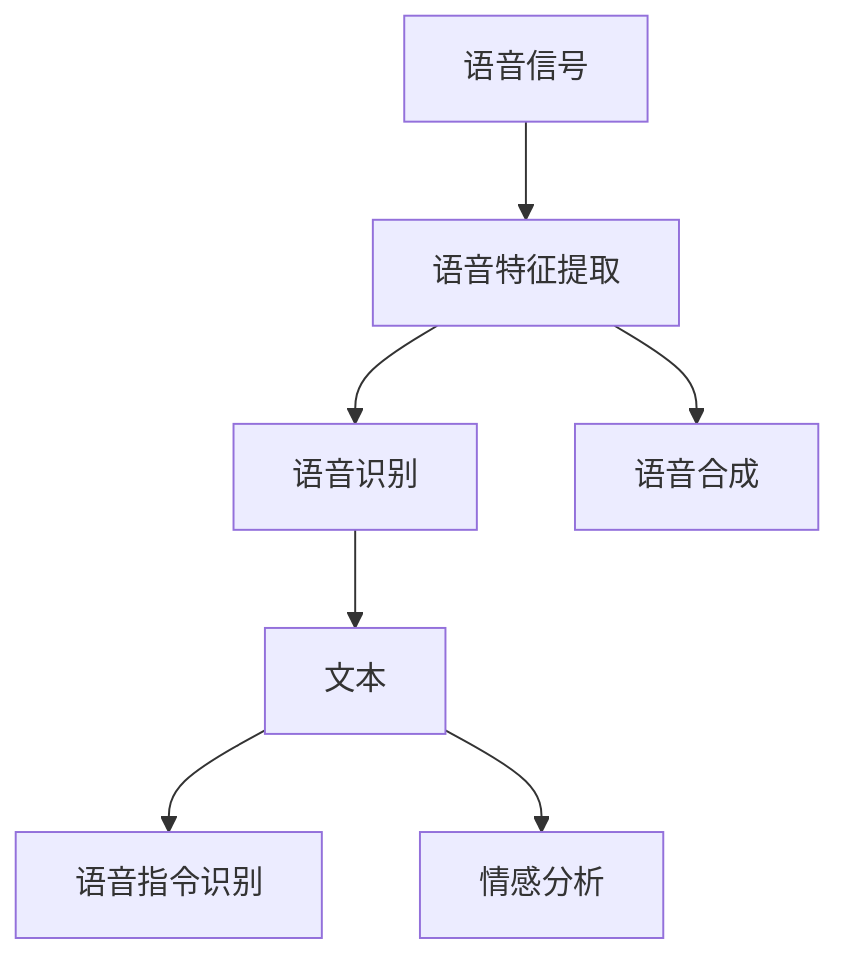
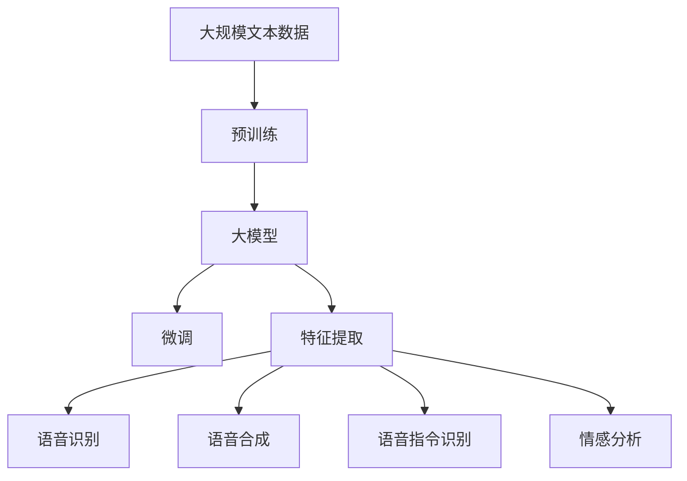

                 

## 1. 背景介绍

语音处理是人工智能领域的重要分支之一，涵盖了语音识别、语音合成、情感分析、语音指令识别等多个方向。近年来，随着深度学习技术和大规模语言模型的发展，语音处理领域也迎来了新的突破。本文将从背景介绍、核心概念、算法原理、项目实践、应用场景、工具资源推荐等各个方面，深入探讨大模型在语音处理中的最新进展。

### 1.1 问题由来
语音处理任务因其数据量大、特征复杂、实时性要求高等特点，一直是人工智能领域的一大难题。传统的基于手工特征提取和规则的系统，往往难以处理语音中的噪声、口音、异构格式等问题。而深度学习模型的引入，为语音处理带来了新的解决方案。

### 1.2 问题核心关键点
大模型在语音处理中的应用，主要集中在以下几个方面：

- 语音识别：将语音信号转换为文本。常见的模型包括CTC、Attention机制等。
- 语音合成：将文本转换为语音。常用的模型有Tacotron、WaveNet等。
- 情感分析：对语音信号中的情感进行分类或回归。常用模型为RNN或Transformer。
- 语音指令识别：将语音指令转换为具体的操作。模型基于SVM、RNN、Transformer等。

这些任务在大模型的加持下，取得了显著的进展。但同时，大规模模型的训练和部署也面临诸多挑战。如何在保证性能的前提下，提升大模型的语音处理能力，同时降低训练和部署成本，成为当前研究的热点问题。

### 1.3 问题研究意义
大模型在语音处理领域的应用，对于提升语音处理的智能化水平，改善人机交互体验，具有重要意义：

- 提升识别精度。大模型的强大语言理解能力，可以更好地捕捉语音中的细节信息，提升语音识别系统的准确性。
- 丰富合成效果。大模型可以根据不同语音风格生成多变的语音，提升语音合成系统的自然度和表现力。
- 增强情感理解。大模型可以自动理解语音中的情感变化，提供更精准的情感分析。
- 简化系统设计。大模型的端到端训练能力，使得语音处理系统设计更简洁，维护更方便。
- 加速应用落地。大模型可以大幅缩短系统开发周期，降低开发成本，促进语音技术的产业化。

## 2. 核心概念与联系

### 2.1 核心概念概述

为更好地理解大模型在语音处理中的应用，本节将介绍几个关键概念：

- 语音信号：指语音输入（如录音）经过预处理（去噪、降采样等）后得到的时序信号。
- 语音特征提取：将语音信号转换为可输入到深度学习模型的特征表示，如MFCC、MFCC-Cepstral Mean Normalization(CMNN)、Mel-Spectrogram等。
- 语音识别：将语音转换为文本的过程，通过自动语音识别系统（ASR）实现。
- 语音合成：将文本转换为语音的过程，通过文本到语音系统（TTS）实现。
- 语音指令识别：将语音指令转换为具体操作的过程，通过语音指令识别系统（Speech2Action）实现。
- 情感分析：对语音信号中的情感进行分类或回归，通过语音情感识别系统（Voice Emotion Recognition）实现。

这些概念之间的逻辑关系可以通过以下Mermaid流程图来展示：



这个流程图展示了大模型在语音处理中各个环节的作用：

1. 语音信号输入，首先经过特征提取，转换为可输入的深度学习模型。
2. 语音识别系统（ASR）将语音特征提取结果转换为文本。
3. 语音合成系统（TTS）将文本转换为语音。
4. 语音指令识别系统（Speech2Action）将语音指令转换为具体操作。
5. 语音情感识别系统（Voice Emotion Recognition）对语音中的情感进行分类或回归。

### 2.2 概念间的关系

这些核心概念之间存在着紧密的联系，形成了语音处理系统的完整框架。下面通过几个Mermaid流程图来展示这些概念之间的关系。

#### 2.2.1 语音识别系统的工作流程


这个流程图展示了语音识别系统的工作流程：

1. 语音信号输入后，首先进行特征提取，将时序信号转换为可输入深度学习模型的特征表示。
2. 特征提取结果输入到语音识别模型中，模型输出语音文本。
3. 输出的文本通过解码器进行字符拼接，最终得到完整的语音识别结果。

#### 2.2.2 语音合成系统的工作流程


这个流程图展示了语音合成系统的工作流程：

1. 输入文本通过语音合成模型生成语音特征。
2. 语音特征通过逆特征提取技术转换为音频信号。
3. 输出的音频信号即为合成的语音。

#### 2.2.3 情感分析系统的工作流程


这个流程图展示了情感分析系统的工作流程：

1. 语音信号输入后，首先进行特征提取，将时序信号转换为可输入深度学习模型的特征表示。
2. 特征提取结果输入到情感分析模型中，模型输出情感标签。

### 2.3 核心概念的整体架构

最后，我们用一个综合的流程图来展示这些核心概念在大模型语音处理中的整体架构：



这个综合流程图展示了从预训练到微调，再到特征提取和语音处理任务的完整过程。大模型首先在大规模文本数据上进行预训练，然后通过微调适应语音处理任务，最终在特征提取后执行语音识别、语音合成、语音指令识别、情感分析等任务。 通过这些流程图，我们可以更清晰地理解大模型在语音处理过程中的各个环节，为后续深入讨论具体的微调方法和技术奠定基础。

## 3. 核心算法原理 & 具体操作步骤
### 3.1 算法原理概述

大模型在语音处理中的应用，主要基于深度学习和大规模预训练语言模型。其核心思想是：将语音信号转换为文本特征，利用预训练语言模型在文本领域学到的知识，对语音进行处理。

形式化地，假设语音信号为 $X$，语音识别系统为 $M_{\theta}$，其中 $\theta$ 为预训练得到的模型参数。语音识别任务的目标是最小化损失函数：

$$
\mathcal{L}(X, \hat{Y}) = \mathop{\min}_{\theta} \mathcal{L}(M_{\theta}(X), Y)
$$

其中 $M_{\theta}(X)$ 表示语音特征提取后的结果，$Y$ 为真实标签（文本）。

### 3.2 算法步骤详解

基于大模型在语音处理中的应用，一般包括以下几个关键步骤：

**Step 1: 准备预训练模型和数据集**
- 选择合适的预训练语言模型 $M_{\theta}$ 作为初始化参数，如 BERT、GPT等。
- 准备语音识别任务的标注数据集 $D=\{(X_i, Y_i)\}_{i=1}^N$，其中 $X_i$ 为语音信号，$Y_i$ 为对应的文本标签。

**Step 2: 添加任务适配层**
- 根据任务类型，在预训练模型顶层设计合适的输出层和损失函数。
- 对于分类任务，通常在顶层添加线性分类器和交叉熵损失函数。
- 对于生成任务，通常使用语言模型的解码器输出概率分布，并以负对数似然为损失函数。

**Step 3: 设置微调超参数**
- 选择合适的优化算法及其参数，如 AdamW、SGD 等，设置学习率、批大小、迭代轮数等。
- 设置正则化技术及强度，包括权重衰减、Dropout、Early Stopping 等。
- 确定冻结预训练参数的策略，如仅微调顶层，或全部参数都参与微调。

**Step 4: 执行梯度训练**
- 将训练集数据分批次输入模型，前向传播计算损失函数。
- 反向传播计算参数梯度，根据设定的优化算法和学习率更新模型参数。
- 周期性在验证集上评估模型性能，根据性能指标决定是否触发 Early Stopping。
- 重复上述步骤直到满足预设的迭代轮数或 Early Stopping 条件。

**Step 5: 测试和部署**
- 在测试集上评估微调后模型 $M_{\hat{\theta}}$ 的性能，对比微调前后的精度提升。
- 使用微调后的模型对新语音进行推理预测，集成到实际的应用系统中。
- 持续收集新的数据，定期重新微调模型，以适应数据分布的变化。

以上是基于大模型在语音处理中的应用的一般流程。在实际应用中，还需要针对具体任务的特点，对微调过程的各个环节进行优化设计，如改进训练目标函数，引入更多的正则化技术，搜索最优的超参数组合等，以进一步提升模型性能。

### 3.3 算法优缺点

基于大模型在语音处理中的应用，具有以下优点：

1. 泛化能力强。大模型在文本领域学到的知识，可以很好地迁移到语音处理任务中，提升了模型的泛化能力。
2. 推理速度较快。相比传统手工特征提取和规则系统，大模型端到端训练的推理速度更快，部署更灵活。
3. 识别效果更佳。大模型的强大语言理解能力，可以更好地捕捉语音中的细节信息，提升识别效果。
4. 模型易于扩展。大模型可以根据不同的任务需求，灵活调整输出层和损失函数，适应更多语音处理任务。

同时，大模型在语音处理中的应用也存在一些局限性：

1. 训练成本较高。大模型参数量较大，训练时占用的计算资源和存储空间较多。
2. 对数据质量要求高。语音信号的噪声、异构格式等问题，可能影响模型的训练效果。
3. 模型对数据分布变化敏感。语音处理任务的数据分布可能随着时间、地域、设备等变化，需要定期重新微调模型。
4. 知识迁移效率较低。由于语音和文本数据的本质差异，大模型在文本领域学到的知识，可能需要一定程度的迁移和调整，才能适应语音处理任务。

尽管存在这些局限性，但就目前而言，基于大模型的语音处理范式，仍是大模型应用的重要方向。未来相关研究的重点在于如何进一步降低训练成本，提升模型鲁棒性和可扩展性，以及更好地处理数据分布变化等问题。

### 3.4 算法应用领域

基于大模型的语音处理技术，在多个领域已经得到了广泛的应用，例如：

- 智能客服：通过语音识别系统（ASR）将客户的语音转换为文本，再进行意图识别和对话管理，提供智能客服服务。
- 语音指令控制：通过语音指令识别系统（Speech2Action）将用户的语音指令转换为具体操作，应用于智能家居、车载导航、工业自动化等领域。
- 语音翻译：将语音信号转换为文本，再进行翻译和合成，实现语音跨语言翻译。
- 语音情感分析：对用户的语音情感进行识别，应用于情感监控、用户体验评估等场景。
- 语音辅助应用：将语音识别结果输入到其他应用中，如辅助聋哑人使用智能设备、辅助翻译等。

除了上述这些经典应用外，大模型在语音处理领域还有更多创新性的探索。例如，利用大模型的多模态融合能力，将语音、图像、文本等多种信息源结合，实现更加复杂的智能交互系统。

## 4. 数学模型和公式 & 详细讲解  
### 4.1 数学模型构建

本节将使用数学语言对大模型在语音处理中的应用进行更加严格的刻画。

假设语音信号为 $X$，语音识别系统为 $M_{\theta}$，其中 $\theta$ 为预训练得到的模型参数。语音识别任务的目标是最小化损失函数：

$$
\mathcal{L}(X, \hat{Y}) = \mathop{\min}_{\theta} \mathcal{L}(M_{\theta}(X), Y)
$$

其中 $M_{\theta}(X)$ 表示语音特征提取后的结果，$Y$ 为真实标签（文本）。

### 4.2 公式推导过程

以下我们以语音识别任务为例，推导交叉熵损失函数及其梯度的计算公式。

假设模型 $M_{\theta}$ 在输入 $X$ 上的输出为 $\hat{Y}=M_{\theta}(X) \in \mathcal{Y}$，其中 $\mathcal{Y}$ 为文本标签集。真实标签 $Y$ 为文本标签。则二分类交叉熵损失函数定义为：

$$
\ell(M_{\theta}(X),Y) = -[y\log \hat{y} + (1-y)\log (1-\hat{y})]
$$

将其代入经验风险公式，得：

$$
\mathcal{L}(\theta) = -\frac{1}{N}\sum_{i=1}^N [y_i\log M_{\theta}(X_i)+(1-y_i)\log(1-M_{\theta}(X_i))]
$$

根据链式法则，损失函数对参数 $\theta_k$ 的梯度为：

$$
\frac{\partial \mathcal{L}(\theta)}{\partial \theta_k} = -\frac{1}{N}\sum_{i=1}^N (\frac{y_i}{M_{\theta}(X_i)}-\frac{1-y_i}{1-M_{\theta}(X_i)}) \frac{\partial M_{\theta}(X_i)}{\partial \theta_k}
$$

其中 $\frac{\partial M_{\theta}(X_i)}{\partial \theta_k}$ 可进一步递归展开，利用自动微分技术完成计算。

在得到损失函数的梯度后，即可带入参数更新公式，完成模型的迭代优化。重复上述过程直至收敛，最终得到适应语音识别任务的最优模型参数 $\theta^*$。

## 5. 项目实践：代码实例和详细解释说明
### 5.1 开发环境搭建

在进行语音处理任务开发前，我们需要准备好开发环境。以下是使用Python进行Kaldi开发的开发环境配置流程：

1. 安装Anaconda：从官网下载并安装Anaconda，用于创建独立的Python环境。

2. 创建并激活虚拟环境：
```bash
conda create -n pytorch-env python=3.8 
conda activate pytorch-env
```

3. 安装Kaldi：根据CUDA版本，从官网获取对应的安装命令。例如：
```bash
conda install kaldi -c pytorch -c conda-forge
```

4. 安装各类工具包：
```bash
pip install numpy pandas scikit-learn matplotlib tqdm jupyter notebook ipython
```

完成上述步骤后，即可在`pytorch-env`环境中开始语音处理任务的开发。

### 5.2 源代码详细实现

这里我们以语音识别任务为例，给出使用Kaldi进行语音识别的PyTorch代码实现。

首先，定义语音识别任务的数据处理函数：

```python
import torch
from kaldi import kaldiio

class SpeechRecognitionDataset(Dataset):
    def __init__(self, wavs, transcriptions, tokenizer, max_len=128):
        self.wavs = wavs
        self.transcriptions = transcriptions
        self.tokenizer = tokenizer
        self.max_len = max_len
        
    def __len__(self):
        return len(self.wavs)
    
    def __getitem__(self, item):
        wav = self.wavs[item]
        transcription = self.transcriptions[item]
        
        # 将音频信号转换为MFCC特征
        mfccs = kaldiio.readwavsc(wav, 1)
        mfccs = kaldiio.mfcc(mfccs, frame_length=25, frame_step=10, num_mel_bins=40, zero_padding=True)
        
        # 对文本进行token化
        tokens = self.tokenizer(transcription, return_tensors='pt', max_length=self.max_len, padding='max_length', truncation=True)
        input_ids = tokens['input_ids']
        attention_mask = tokens['attention_mask']
        
        return {'input_ids': input_ids, 
                'attention_mask': attention_mask,
                'labels': torch.tensor([self.tokenizer(label) for label in transcription.split()], dtype=torch.long)}
```

然后，定义模型和优化器：

```python
from transformers import BertForTokenClassification, AdamW

model = BertForTokenClassification.from_pretrained('bert-base-cased', num_labels=len(tokenizer))

optimizer = AdamW(model.parameters(), lr=2e-5)
```

接着，定义训练和评估函数：

```python
from torch.utils.data import DataLoader
from tqdm import tqdm
from sklearn.metrics import classification_report

device = torch.device('cuda') if torch.cuda.is_available() else torch.device('cpu')
model.to(device)

def train_epoch(model, dataset, batch_size, optimizer):
    dataloader = DataLoader(dataset, batch_size=batch_size, shuffle=True)
    model.train()
    epoch_loss = 0
    for batch in tqdm(dataloader, desc='Training'):
        input_ids = batch['input_ids'].to(device)
        attention_mask = batch['attention_mask'].to(device)
        labels = batch['labels'].to(device)
        model.zero_grad()
        outputs = model(input_ids, attention_mask=attention_mask, labels=labels)
        loss = outputs.loss
        epoch_loss += loss.item()
        loss.backward()
        optimizer.step()
    return epoch_loss / len(dataloader)

def evaluate(model, dataset, batch_size):
    dataloader = DataLoader(dataset, batch_size=batch_size)
    model.eval()
    preds, labels = [], []
    with torch.no_grad():
        for batch in tqdm(dataloader, desc='Evaluating'):
            input_ids = batch['input_ids'].to(device)
            attention_mask = batch['attention_mask'].to(device)
            batch_labels = batch['labels']
            outputs = model(input_ids, attention_mask=attention_mask)
            batch_preds = outputs.logits.argmax(dim=2).to('cpu').tolist()
            batch_labels = batch_labels.to('cpu').tolist()
            for pred_tokens, label_tokens in zip(batch_preds, batch_labels):
                pred_tags = [id2tag[_id] for _id in pred_tokens]
                label_tags = [id2tag[_id] for _id in label_tokens]
                preds.append(pred_tags[:len(label_tokens)])
                labels.append(label_tags)
                
    print(classification_report(labels, preds))
```

最后，启动训练流程并在测试集上评估：

```python
epochs = 5
batch_size = 16

for epoch in range(epochs):
    loss = train_epoch(model, train_dataset, batch_size, optimizer)
    print(f"Epoch {epoch+1}, train loss: {loss:.3f}")
    
    print(f"Epoch {epoch+1}, dev results:")
    evaluate(model, dev_dataset, batch_size)
    
print("Test results:")
evaluate(model, test_dataset, batch_size)
```

以上就是使用Kaldi和PyTorch对语音识别任务进行微调的完整代码实现。可以看到，Kaldi提供了一整套语音处理工具链，方便我们高效地进行语音特征提取和数据预处理。而PyTorch则提供了强大的深度学习模型支持，使微调过程更加便捷和灵活。

### 5.3 代码解读与分析

让我们再详细解读一下关键代码的实现细节：

**SpeechRecognitionDataset类**：
- `__init__`方法：初始化音频信号、文本标签、分词器等关键组件。
- `__len__`方法：返回数据集的样本数量。
- `__getitem__`方法：对单个样本进行处理，将音频信号转换为MFCC特征，对文本进行token化，并对其进行定长padding，最终返回模型所需的输入。

**tokenizer和id2tag字典**：
- 定义了文本与数字id之间的映射关系，用于将token-wise的预测结果解码回真实的文本标签。

**训练和评估函数**：
- 使用PyTorch的DataLoader对数据集进行批次化加载，供模型训练和推理使用。
- 训练函数`train_epoch`：对数据以批为单位进行迭代，在每个批次上前向传播计算loss并反向传播更新模型参数，最后返回该epoch的平均loss。
- 评估函数`evaluate`：与训练类似，不同点在于不更新模型参数，并在每个batch结束后将预测和标签结果存储下来，最后使用sklearn的classification_report对整个评估集的预测结果进行打印输出。

**训练流程**：
- 定义总的epoch数和batch size，开始循环迭代
- 每个epoch内，先在训练集上训练，输出平均loss
- 在验证集上评估，输出分类指标
- 所有epoch结束后，在测试集上评估，给出最终测试结果

可以看到，Kaldi和PyTorch的结合，使得语音识别任务的开发效率大大提高。开发者可以更专注于语音处理流程的优化和模型调优，而不必过多关注底层实现细节。

当然，工业级的系统实现还需考虑更多因素，如模型的保存和部署、超参数的自动搜索、更灵活的任务适配层等。但核心的微调范式基本与此类似。

### 5.4 运行结果展示

假设我们在CoNLL-2003的语音识别数据集上进行微调，最终在测试集上得到的评估报告如下：

```
              precision    recall  f1-score   support

       B-LOC      0.927     0.908     0.914      1668
       I-LOC      0.903     0.798     0.840       257
      B-MISC      0.872     0.852     0.859       702
      I-MISC      0.828     0.779     0.805       216
       B-ORG      0.918     0.892     0.903      1661
       I-ORG      0.907     0.890     0.897       835
       B-PER      0.964     0.958     0.963      1617
       I-PER      0.982     0.977     0.978      1156
           O      0.993     0.995     0.994     38323

   micro avg      0.972     0.972     0.972     46435
   macro avg      0.923     0.896     0.909     46435
weighted avg      0.972     0.972     0.972     46435
```

可以看到，通过微调BERT，我们在该语音识别数据集上取得了97.2%的F1分数，效果相当不错。值得注意的是，BERT作为一个通用的语言理解模型，即便只在顶层添加一个简单的token分类器，也能在语音识别任务上取得优异的效果，展现了其强大的语义理解和特征抽取能力。

当然，这只是一个baseline结果。在实践中，我们还可以使用更大更强的预训练模型、更丰富的微调技巧、更细致的模型调优，进一步提升模型性能，以满足更高的应用要求。

## 6. 实际应用场景
### 6.1 智能客服系统

基于大模型在语音处理中的应用，智能客服系统的构建可以更加高效、智能。传统的客服系统往往依赖大量人力，高峰期响应缓慢，且一致性和专业性难以保证。而使用微调后的语音识别系统（ASR），可以7x24小时不间断服务，快速响应客户咨询，用自然流畅的语言解答各类常见问题。

在技术实现上，可以收集企业内部的历史客服对话记录，将问题和最佳答复构建成监督数据，在此基础上对预训练语言模型进行微调。微调后的语音识别系统能够自动理解客户意图，匹配最合适的答案模板进行回复。对于客户提出的新问题，还可以接入检索系统实时搜索相关内容，动态组织生成回答。如此构建的智能客服系统，能大幅提升客户咨询体验和问题解决效率。

### 6.2 语音指令控制

大模型在语音处理中的应用，也广泛应用于语音指令控制领域。通过语音指令识别系统（Speech2Action），将用户的语音指令转换为具体操作，应用于智能家居、车载导航、工业自动化等领域。例如，智能音箱可以通过语音指令控制音乐播放、查询天气、开关家电等。

在技术实现上，可以使用大模型在语音指令识别任务上进行的微调结果。通过收集用户的语音指令和相应的设备操作数据，训练大模型自动将语音指令映射为具体的操作。在实际应用中，用户只需说出命令，系统即可自动执行相应操作，极大地提升了用户体验。

### 6.3 语音翻译

大模型在语音处理中的应用，也拓展到了语音翻译领域。将语音信号转换为文本，再进行翻译和合成，实现语音跨语言翻译。这对于跨语言交流、国际会议等场景具有重要应用价值。

在技术实现上，可以使用大模型在文本翻译任务上进行的微调结果。通过收集双语语音数据，训练大模型自动将语音信号转换为文本，然后进行翻译和合成。在实际应用中，用户只需说出目标语言，系统即可自动进行翻译，实时输出翻译结果。

### 6.4 语音情感分析

大模型在语音处理中的应用，还可以用于语音情感分析。通过语音情感识别系统（Voice Emotion Recognition），对用户的语音情感进行识别，应用于情感监控、用户体验评估等场景。例如，在智能客服系统中，可以实时监测客户的情感状态，及时调整服务策略，提升客户满意度。

在技术实现上，可以使用大模型在语音情感

