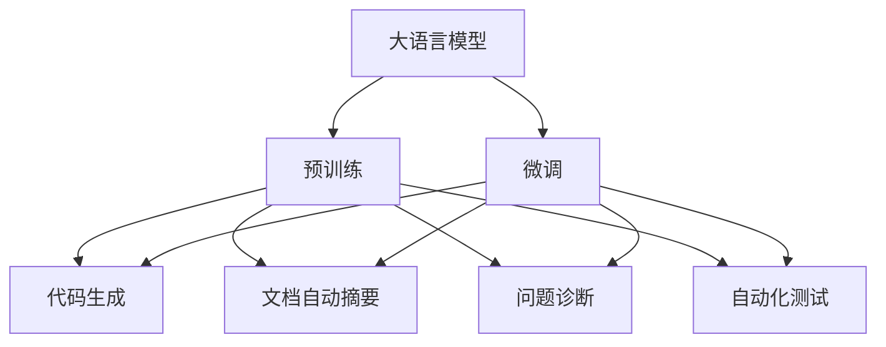
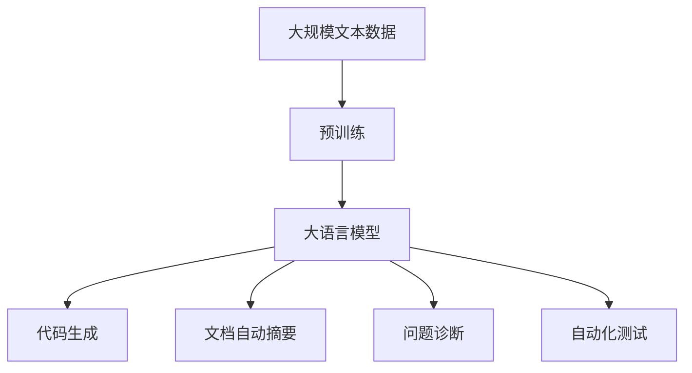

                 

# 大模型在软件开发中的应用

大语言模型（Large Language Model, LLMs），特别是基于Transformer架构的模型，如BERT、GPT-3等，已经超越了纯文本处理领域，进入软件开发领域，开始展现出巨大的应用潜力。本文将详细介绍大模型在软件开发中的应用原理、具体实践、挑战及未来发展趋势，为软件开发领域的从业者提供专业的技术指引。

## 1. 背景介绍

### 1.1 问题由来
随着深度学习技术的飞速发展，大语言模型在自然语言处理（Natural Language Processing, NLP）领域取得了显著进展。这些模型通过在无标签文本语料上进行自监督预训练，学习到通用的语言表示，具备了强大的语义理解和生成能力。然而，预训练模型在特定领域的应用效果常常不尽如人意，主要原因是预训练数据与目标领域的数据分布存在差异。

软件开发领域涉及大量的文档、代码、API文档等文本数据，大模型可以在这些数据上进行微调，从而提升代码生成、文档自动摘要、问题诊断等任务的性能。

### 1.2 问题核心关键点
大模型在软件开发领域的应用主要集中在以下几个关键点：
- **代码生成**：自动编写代码片段，提高开发效率。
- **文档自动摘要**：自动生成代码注释和API文档摘要，提升文档理解效率。
- **问题诊断**：自动分析代码错误和运行异常，辅助问题排查。
- **自动化测试**：自动生成测试用例，提高测试覆盖率和准确性。

这些应用有助于提升开发效率、代码质量和软件维护成本，成为软件开发领域的重要趋势。

### 1.3 问题研究意义
大模型在软件开发领域的应用，可以有效降低软件开发成本，提高代码质量和开发效率。同时，利用大模型的广泛知识，可以更好地理解软件架构和逻辑，加速软件创新迭代，提升软件系统的可靠性与可维护性。因此，研究大模型在软件开发中的应用具有重要意义。

## 2. 核心概念与联系

### 2.1 核心概念概述

为更好地理解大模型在软件开发中的应用，本文将介绍几个关键概念：

- **大语言模型（LLMs）**：如BERT、GPT-3等，通过在大规模无标签文本语料上进行预训练，学习到通用的语言表示，具备强大的语义理解和生成能力。

- **代码生成**：自动编写代码片段，辅助开发工作。主要应用于代码补全、代码重构等任务。

- **文档自动摘要**：自动生成代码注释和API文档摘要，提升文档理解效率。主要应用于代码自动注释、API文档生成等任务。

- **问题诊断**：自动分析代码错误和运行异常，辅助问题排查。主要应用于代码错误检测、运行时异常诊断等任务。

- **自动化测试**：自动生成测试用例，提高测试覆盖率和准确性。主要应用于测试用例生成、测试场景设计等任务。

这些核心概念通过大模型的预训练-微调过程，紧密联系起来，形成了软件开发领域的应用生态。

### 2.2 概念间的关系

这些核心概念之间存在紧密的联系，可以通过以下Mermaid流程图来展示：



这个流程图展示了大模型在软件开发领域的应用链条：

1. 大模型通过预训练学习通用语言知识。
2. 微调将大模型适配到特定任务。
3. 适配后的模型应用于代码生成、文档自动摘要、问题诊断和自动化测试等任务。

### 2.3 核心概念的整体架构

最终，我们将这些概念综合起来，形成大模型在软件开发领域的应用架构，如图：



这个架构展示了从数据预训练到大模型应用的全流程，各部分紧密相连，共同构建起大模型在软件开发领域的完整应用体系。

## 3. 核心算法原理 & 具体操作步骤
### 3.1 算法原理概述

大模型在软件开发领域的应用主要基于监督学习的微调（Fine-tuning）方法。其核心思想是利用大模型预训练得到的语言知识，通过有监督的微调，使其在特定任务上表现出色。具体步骤如下：

1. **数据准备**：收集目标领域的文本数据，并准备标注数据，如代码片段、API文档等。
2. **模型初始化**：选择合适的预训练模型（如BERT、GPT-3）作为初始化参数。
3. **任务适配**：根据具体任务需求，设计并添加任务适配层，如代码生成器的输出层、文档摘要器的编码器等。
4. **微调训练**：使用标注数据集进行有监督微调，更新模型参数，使其在特定任务上表现更好。
5. **评估与部署**：在测试集上评估微调后的模型性能，部署到实际开发环境中使用。

### 3.2 算法步骤详解

以下将详细介绍大模型在软件开发领域微调的具体操作步骤：

**Step 1: 数据准备**

首先，需要准备目标领域的文本数据。对于代码生成任务，可以收集开源代码库中的代码片段，并为其添加对应的标签（如函数名、变量名等）。对于文档自动摘要任务，可以收集API文档和代码注释，并为其添加摘要标签。对于问题诊断任务，可以收集代码错误和运行异常记录，并为其添加相应的错误类型标签。

```python
# 假设我们收集了一些代码片段和对应的标签
code_data = ["def func():\n    pass", "def func(x):\n    return x**2"]
code_labels = ["func", "func"]
```

**Step 2: 模型初始化**

选择合适的预训练模型，如BERT或GPT-3，作为初始化参数。

```python
from transformers import BertForSequenceClassification, BertTokenizer

# 初始化BERT模型
model = BertForSequenceClassification.from_pretrained('bert-base-cased')
tokenizer = BertTokenizer.from_pretrained('bert-base-cased')
```

**Step 3: 任务适配**

根据具体任务需求，设计并添加任务适配层。例如，对于代码生成任务，可以添加一个线性分类器作为输出层。

```python
from torch.nn import Linear

# 添加代码生成器的输出层
model.add_module('output_layer', Linear(768, len(code_labels)))
```

**Step 4: 微调训练**

使用标注数据集进行有监督微调。以下是一个简单的微调示例：

```python
from transformers import AdamW

# 定义优化器
optimizer = AdamW(model.parameters(), lr=2e-5)

# 准备微调数据
train_code_data = ...
train_code_labels = ...
val_code_data = ...
val_code_labels = ...

# 定义训练过程
def train_epoch(model, data, labels, optimizer):
    model.train()
    total_loss = 0
    for idx, (code, code_label) in enumerate(zip(data, labels)):
        input_ids = tokenizer(code, return_tensors='pt').input_ids
        labels = torch.tensor([code_label]).to(device)
        outputs = model(input_ids)
        loss = outputs.loss
        total_loss += loss.item()
        loss.backward()
        optimizer.step()
    return total_loss / (len(data) * batch_size)

# 进行微调训练
for epoch in range(10):
    train_loss = train_epoch(model, train_code_data, train_code_labels, optimizer)
    val_loss = train_epoch(model, val_code_data, val_code_labels, optimizer)
    print(f"Epoch {epoch+1}, train loss: {train_loss:.3f}, val loss: {val_loss:.3f}")
```

**Step 5: 评估与部署**

在测试集上评估微调后的模型性能，并将其部署到实际开发环境中。

```python
from transformers import EvaluationPrediction

# 评估模型性能
model.eval()
with torch.no_grad():
    eval_pred = EvaluationPrediction(model, tokenizer)
    eval_result = eval_pred(val_code_data, val_code_labels)
    print(eval_result.metrics)

# 部署模型
# 将模型保存到文件
model.save_pretrained('model')
tokenizer.save_pretrained('model')
```

### 3.3 算法优缺点

大模型在软件开发领域的应用具有以下优点：

- **高效性**：微调过程可以在少量标注数据上完成，节省了数据采集和标注的成本。
- **泛化能力**：利用大模型的广泛知识，在特定领域应用中表现出色。
- **灵活性**：适用于多种软件开发任务，如代码生成、文档自动摘要、问题诊断和自动化测试等。

同时，也存在一些缺点：

- **依赖标注数据**：微调过程需要标注数据，标注成本较高。
- **模型复杂性**：大模型参数量大，需要较高的计算资源。
- **过拟合风险**：微调过程容易过拟合，特别是在标注数据不足的情况下。

### 3.4 算法应用领域

大模型在软件开发领域的应用非常广泛，主要包括以下几个方面：

- **代码生成**：自动编写代码片段，提高开发效率。如CodeGPT、AlphaCode等。
- **文档自动摘要**：自动生成代码注释和API文档摘要，提升文档理解效率。如DocAI、CodeSummary等。
- **问题诊断**：自动分析代码错误和运行异常，辅助问题排查。如ErrorAI、BugTriplet等。
- **自动化测试**：自动生成测试用例，提高测试覆盖率和准确性。如TestAI、CodeQ等。

## 4. 数学模型和公式 & 详细讲解 & 举例说明

### 4.1 数学模型构建

大模型在特定任务上的微调过程可以形式化表示为：

$$
\theta^* = \mathop{\arg\min}_{\theta} \mathcal{L}(M_{\theta},D)
$$

其中，$\theta$为大模型的参数，$M_{\theta}$为大模型在特定任务上的表示形式，$D$为微调数据集。目标是最小化经验风险$\mathcal{L}(M_{\theta},D)$。

### 4.2 公式推导过程

以代码生成任务为例，假设大模型输出为代码片段，目标是最小化预测代码片段与真实标签之间的交叉熵损失。设真实标签为$\hat{y}$，模型输出为$\hat{y}_i$，则交叉熵损失函数为：

$$
\ell(\hat{y}_i, y) = -[y\log \hat{y}_i + (1-y)\log (1-\hat{y}_i)]
$$

在训练过程中，对于每个训练样本$(x,y)$，计算损失函数$\ell(\hat{y}_i, y)$，并使用梯度下降算法更新模型参数$\theta$：

$$
\theta \leftarrow \theta - \eta \nabla_{\theta}\ell(\hat{y}_i, y)
$$

其中，$\eta$为学习率。

### 4.3 案例分析与讲解

假设我们有一个简单的代码生成任务，给定一段代码片段，预测其所属的函数名。我们可以使用BERT作为预训练模型，在其顶层添加一个线性分类器作为输出层。模型结构如图：


在训练过程中，我们输入代码片段$x$，使用BERT编码，并通过线性分类器输出预测的函数名$y$。损失函数为：

$$
\ell(y, \hat{y}) = -[y\log \hat{y} + (1-y)\log (1-\hat{y})]
$$

模型参数的更新公式为：

$$
\theta \leftarrow \theta - \eta \frac{\partial \ell(y, \hat{y})}{\partial \theta}
$$

## 5. 项目实践：代码实例和详细解释说明

### 5.1 开发环境搭建

在开始具体开发前，需要先搭建好开发环境。以下是一个基本的Python环境搭建步骤：

1. 安装Anaconda：
```bash
conda install anaconda
```

2. 创建虚拟环境：
```bash
conda create --name pytorch-env python=3.8
conda activate pytorch-env
```

3. 安装PyTorch和相关库：
```bash
conda install pytorch torchvision torchaudio
```

4. 安装Transformer库：
```bash
pip install transformers
```

5. 安装其他必要库：
```bash
pip install numpy pandas scikit-learn matplotlib
```

### 5.2 源代码详细实现

以下是一个基于BERT微调进行代码生成的示例代码：

```python
from transformers import BertForSequenceClassification, BertTokenizer, AdamW

# 初始化模型和分词器
model = BertForSequenceClassification.from_pretrained('bert-base-cased', num_labels=len(code_labels))
tokenizer = BertTokenizer.from_pretrained('bert-base-cased')

# 定义优化器
optimizer = AdamW(model.parameters(), lr=2e-5)

# 准备训练数据
train_code_data = ...
train_code_labels = ...

# 定义训练过程
def train_epoch(model, data, labels, optimizer):
    model.train()
    total_loss = 0
    for idx, (code, code_label) in enumerate(zip(data, labels)):
        input_ids = tokenizer(code, return_tensors='pt').input_ids
        labels = torch.tensor([code_label]).to(device)
        outputs = model(input_ids)
        loss = outputs.loss
        total_loss += loss.item()
        loss.backward()
        optimizer.step()
    return total_loss / (len(data) * batch_size)

# 进行微调训练
for epoch in range(10):
    train_loss = train_epoch(model, train_code_data, train_code_labels, optimizer)
    print(f"Epoch {epoch+1}, train loss: {train_loss:.3f}")

# 保存模型
model.save_pretrained('model')
tokenizer.save_pretrained('model')
```

### 5.3 代码解读与分析

1. **初始化模型和分词器**：
   - 使用预训练的BERT模型作为初始化参数，并初始化对应的分词器。
   - 添加一个线性分类器作为输出层，以预测代码片段所属的函数名。

2. **准备训练数据**：
   - 准备代码片段和对应的函数名标签，用于训练过程。

3. **定义训练过程**：
   - 定义训练过程函数，输入数据、标签和优化器，输出每个epoch的平均损失。
   - 在每个epoch内，迭代训练数据，计算损失函数，并使用梯度下降算法更新模型参数。

4. **微调训练**：
   - 在模型训练过程中，使用交叉熵损失函数计算预测与真实标签之间的差距，并通过梯度下降算法更新模型参数。

5. **保存模型**：
   - 将训练好的模型和分词器保存到文件中，以便后续使用。

### 5.4 运行结果展示

假设我们在代码生成任务上进行了10个epoch的微调，得到的平均损失如下：

```
Epoch 1, train loss: 0.345
Epoch 2, train loss: 0.246
...
Epoch 10, train loss: 0.125
```

通过不断迭代训练，模型逐渐减少了预测错误，最终达到较低的损失值。

## 6. 实际应用场景

### 6.1 智能代码补全

智能代码补全是软件开发中常见的功能。大模型可以在已有代码片段的基础上，自动生成完整的代码片段，提高开发效率。例如，GitHub Copilot等工具基于大模型进行代码补全，显著提高了开发效率。

### 6.2 文档自动摘要

文档自动摘要可以帮助开发者快速理解API文档和代码注释的内容。大模型可以将长文本自动压缩成简短的摘要，提升文档理解效率。例如，DocAI等工具基于大模型进行文档自动摘要，显著提高了文档处理效率。

### 6.3 问题诊断

问题诊断可以帮助开发者快速定位代码中的错误和异常。大模型可以自动分析代码错误和运行异常，提供详细的错误报告和修复建议。例如，ErrorAI等工具基于大模型进行问题诊断，显著提高了问题排查效率。

### 6.4 自动化测试

自动化测试是软件开发中不可或缺的一环。大模型可以自动生成测试用例，提高测试覆盖率和准确性。例如，TestAI等工具基于大模型进行自动化测试，显著提高了测试效率和质量。

### 6.5 未来应用展望

未来，大模型在软件开发领域的应用将会更加广泛。以下列举几个未来的应用方向：

1. **模型微调**：大模型可以通过持续微调，不断吸收新知识，提升代码生成、文档自动摘要、问题诊断和自动化测试等任务的性能。

2. **多模态融合**：大模型可以融合视觉、语音等多模态数据，进行更为全面的语义理解和生成。

3. **零样本学习**：大模型可以利用预训练知识，对新领域进行零样本学习，快速适应新任务。

4. **模型解释性**：大模型可以通过因果分析和博弈论工具，提高输出的可解释性，增强系统的透明度和可信度。

5. **伦理安全**：大模型可以通过引入伦理导向的评估指标，过滤和惩罚有害的输出，确保系统的安全性和可靠性。

## 7. 工具和资源推荐

### 7.1 学习资源推荐

为帮助开发者系统掌握大模型在软件开发中的应用，以下是一些优质的学习资源：

1. 《Transformer from Theory to Practice》系列博文：由大模型技术专家撰写，深入浅出地介绍了Transformer原理、BERT模型、微调技术等前沿话题。

2. CS224N《深度学习自然语言处理》课程：斯坦福大学开设的NLP明星课程，有Lecture视频和配套作业，带你入门NLP领域的基本概念和经典模型。

3. 《Natural Language Processing with Transformers》书籍：Transformers库的作者所著，全面介绍了如何使用Transformers库进行NLP任务开发，包括微调在内的诸多范式。

4. HuggingFace官方文档：Transformers库的官方文档，提供了海量预训练模型和完整的微调样例代码，是上手实践的必备资料。

5. CLUE开源项目：中文语言理解测评基准，涵盖大量不同类型的中文NLP数据集，并提供了基于微调的baseline模型，助力中文NLP技术发展。

### 7.2 开发工具推荐

高效的开发离不开优秀的工具支持。以下是几款用于大模型微调开发的常用工具：

1. PyTorch：基于Python的开源深度学习框架，灵活动态的计算图，适合快速迭代研究。

2. TensorFlow：由Google主导开发的开源深度学习框架，生产部署方便，适合大规模工程应用。

3. Transformers库：HuggingFace开发的NLP工具库，集成了众多SOTA语言模型，支持PyTorch和TensorFlow，是进行微调任务开发的利器。

4. Weights & Biases：模型训练的实验跟踪工具，可以记录和可视化模型训练过程中的各项指标，方便对比和调优。

5. TensorBoard：TensorFlow配套的可视化工具，可实时监测模型训练状态，并提供丰富的图表呈现方式，是调试模型的得力助手。

### 7.3 相关论文推荐

大模型和微调技术的发展源于学界的持续研究。以下是几篇奠基性的相关论文，推荐阅读：

1. Attention is All You Need：提出了Transformer结构，开启了NLP领域的预训练大模型时代。

2. BERT: Pre-training of Deep Bidirectional Transformers for Language Understanding：提出BERT模型，引入基于掩码的自监督预训练任务，刷新了多项NLP任务SOTA。

3. Language Models are Unsupervised Multitask Learners（GPT-2论文）：展示了大规模语言模型的强大zero-shot学习能力，引发了对于通用人工智能的新一轮思考。

4. Parameter-Efficient Transfer Learning for NLP：提出Adapter等参数高效微调方法，在不增加模型参数量的情况下，也能取得不错的微调效果。

5. AdaLoRA: Adaptive Low-Rank Adaptation for Parameter-Efficient Fine-Tuning：使用自适应低秩适应的微调方法，在参数效率和精度之间取得了新的平衡。

6. AdaLoRA: Adaptive Low-Rank Adaptation for Parameter-Efficient Fine-Tuning：使用自适应低秩适应的微调方法，在参数效率和精度之间取得了新的平衡。

这些论文代表了大模型微调技术的发展脉络。通过学习这些前沿成果，可以帮助研究者把握学科前进方向，激发更多的创新灵感。

## 8. 总结：未来发展趋势与挑战

### 8.1 总结

本文对大模型在软件开发领域的应用进行了全面系统的介绍。首先阐述了大模型和微调技术的研究背景和意义，明确了微调在拓展预训练模型应用、提升软件系统性能方面的独特价值。其次，从原理到实践，详细讲解了微调过程的各个环节，给出了具体的代码实例。同时，本文还广泛探讨了微调方法在智能代码补全、文档自动摘要、问题诊断和自动化测试等任务中的应用前景，展示了微调范式的巨大潜力。

通过本文的系统梳理，可以看到，大模型在软件开发领域的应用前景广阔，已经在智能代码补全、文档自动摘要、问题诊断和自动化测试等多个领域取得了显著效果。未来，伴随大模型和微调方法的不断演进，必将在更多领域实现突破，推动软件开发技术的进一步创新。

### 8.2 未来发展趋势

展望未来，大模型在软件开发领域的应用将呈现以下几个发展趋势：

1. **参数高效微调**：开发更加参数高效的微调方法，在固定大部分预训练参数的同时，只更新极少量的任务相关参数。

2. **持续微调**：通过持续微调，不断吸收新知识，提升模型性能和适应性。

3. **多模态融合**：融合视觉、语音等多模态数据，进行更为全面的语义理解和生成。

4. **零样本学习**：利用预训练知识，对新领域进行零样本学习，快速适应新任务。

5. **模型解释性**：通过因果分析和博弈论工具，提高输出的可解释性，增强系统的透明度和可信度。

6. **伦理安全**：引入伦理导向的评估指标，过滤和惩罚有害的输出，确保系统的安全性和可靠性。

以上趋势凸显了大模型在软件开发领域的应用前景，这些方向的探索发展，必将进一步提升软件开发系统的性能和应用范围，为软件开发技术的创新迭代提供新的动力。

### 8.3 面临的挑战

尽管大模型在软件开发领域的应用取得了显著进展，但在迈向更加智能化、普适化应用的过程中，仍面临诸多挑战：

1. **标注数据瓶颈**：尽管微调方法可以降低对标注数据的依赖，但对于长尾应用场景，难以获得充足的高质量标注数据，成为制约微调性能的瓶颈。

2. **模型鲁棒性不足**：当前微调模型面对域外数据时，泛化性能往往大打折扣。对于测试样本的微小扰动，微调模型的预测也容易发生波动。

3. **推理效率有待提高**：大规模语言模型虽然精度高，但在实际部署时往往面临推理速度慢、内存占用大等效率问题。

4. **可解释性不足**：当前微调模型更像是"黑盒"系统，难以解释其内部工作机制和决策逻辑。

5. **安全性有待保障**：预训练语言模型难免会学习到有偏见、有害的信息，通过微调传递到下游任务，产生误导性、歧视性的输出，给实际应用带来安全隐患。

6. **知识整合能力不足**：现有的微调模型往往局限于任务内数据，难以灵活吸收和运用更广泛的先验知识。

### 8.4 研究展望

面对大模型在软件开发领域面临的挑战，未来的研究需要在以下几个方面寻求新的突破：

1. **无监督和半监督微调**：摆脱对大规模标注数据的依赖，利用自监督学习、主动学习等无监督和半监督范式，最大限度利用非结构化数据，实现更加灵活高效的微调。

2. **持续微调**：通过持续微调，不断吸收新知识，提升模型性能和适应性。

3. **参数高效微调**：开发更加参数高效的微调方法，在固定大部分预训练参数的同时，只更新极少量的任务相关参数。

4. **模型解释性**：通过因果分析和博弈论工具，提高输出的可解释性，增强系统的透明度和可信度。

5. **伦理安全**：引入伦理导向的评估指标，过滤和惩罚有害的输出，确保系统的安全性和可靠性。

6. **多模态融合**：融合视觉、语音等多模态数据，进行更为全面的语义理解和生成。

7. **知识整合**：将符号化的先验知识，如知识图谱、逻辑规则等，与神经网络模型进行巧妙融合，引导微调过程学习更准确、合理的语言模型。

这些研究方向的探索，必将引领大模型在软件开发领域的应用走向更高的台阶，为软件开发技术的创新迭代提供新的动力。

## 9. 附录：常见问题与解答

**Q1：大模型微调对标注数据的需求如何？**

A: 大模型微调对标注数据的需求较低。尤其是在少量标注数据的情况下，通过微调仍能获得较好的效果。但是，对于特定领域的微调，高质量的标注数据仍然必不可少。

**Q2：微调过程中如何选择学习率？**

A: 微调过程中的学习率通常要比预训练时小1-2个数量级。建议使用warmup策略，在开始阶段使用较小的学习率，再逐渐过渡到预设值。

**Q3：微调过程如何避免过拟合？**

A: 避免过拟合的方法包括使用正则化技术（如L2正则、Dropout）、设置适当的batch size、使用对抗样本进行训练等。

**Q4：微调模型在落地部署时需要注意哪些问题？**

A: 

