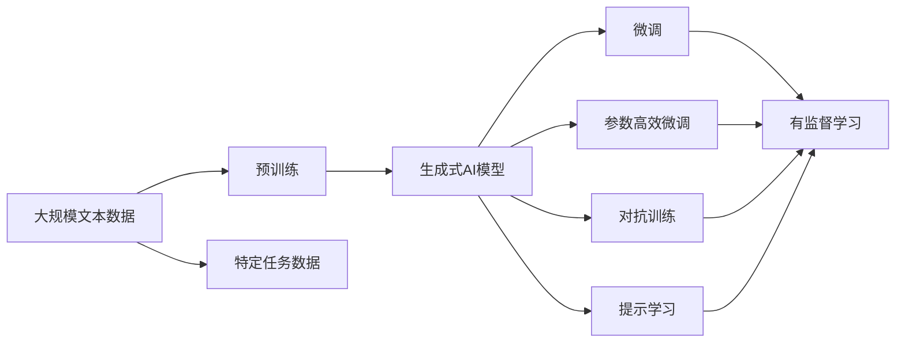
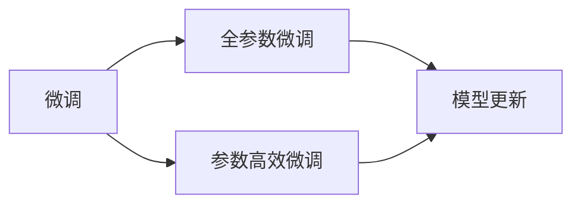
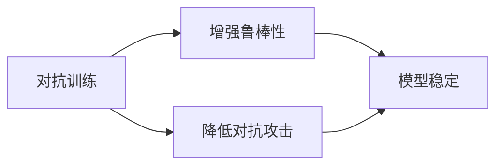
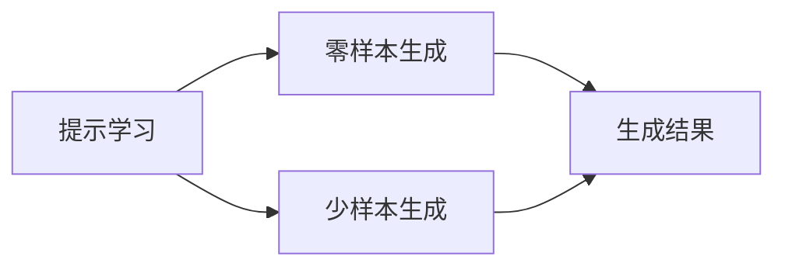
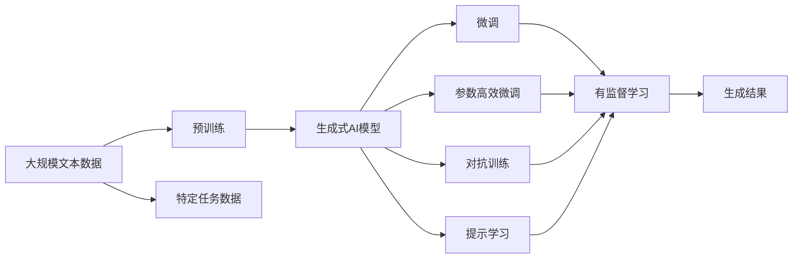

                 

# 大模型时代：生成式AI如何改变内容创作？

> 关键词：生成式AI,内容创作,大模型,Transformer,BERT,预训练,文本生成,内容生成,微调,Fine-tuning

## 1. 背景介绍

### 1.1 问题由来

近年来，随着深度学习技术的飞速发展，尤其是Transformer模型和自监督学习技术的崛起，大规模预训练语言模型如GPT-3、BERT、T5等在自然语言处理（NLP）领域取得了显著突破。这些大模型在文本生成、情感分析、问答系统、机器翻译等任务中表现出色，展示了生成式AI的巨大潜力。生成式AI不仅能通过预训练获得丰富的语言知识，还能通过微调适应特定的内容创作任务，使得内容创作变得更加高效、智能和有趣。

### 1.2 问题核心关键点

生成式AI的核心在于如何通过大模型进行文本生成和内容创作。预训练模型如BERT通过大规模无标签文本进行自监督学习，学习到通用的语言表示。微调则是指在大模型的基础上，通过有标签的文本数据进行进一步训练，使其具备特定领域的内容创作能力。这种微调方法可以显著提升模型在特定任务上的性能，是内容创作中最常用的方法之一。

微调的核心在于选择合适的学习率、优化算法和正则化技术，以避免过拟合，同时最大限度地利用预训练模型的知识。常见的微调技巧包括保留预训练层、梯度累积、对抗训练等。这些方法不仅提高了微调效率，还能增强模型的鲁棒性和泛化能力。

### 1.3 问题研究意义

研究生成式AI的内容创作方法，对于推动AI技术在内容产业中的应用，提高内容创作的效率和质量，具有重要意义：

1. **降低内容创作成本**：利用生成式AI进行内容创作，可以大幅减少人力成本和时间投入，尤其是对于大规模的内容输出任务。
2. **提升创作效果**：生成式AI可以生成高质量、连贯的文本，特别是在生成新闻、文章、报告等需要创意和逻辑推理的任务中表现突出。
3. **加速内容创作**：预训练模型和微调方法使得内容创作过程更加自动化和智能化，能够快速响应市场需求。
4. **促进创新发展**：生成式AI能够生成全新的文本内容，推动内容创作形式的创新，如AI写作、AI生成音乐、AI电影剧本等。
5. **赋能产业升级**：通过AI技术提升内容创作效率和质量，加速媒体、出版、广告、娱乐等行业的数字化转型。

## 2. 核心概念与联系

### 2.1 核心概念概述

为更好地理解生成式AI的内容创作方法，本节将介绍几个密切相关的核心概念：

- **生成式AI（Generative AI）**：通过深度学习模型生成新的文本、图像、音乐等内容的技术。常见的生成模型包括文本生成模型（如GPT、BERT）、图像生成模型（如GANs）、音乐生成模型等。
- **预训练（Pre-training）**：指在大规模无标签文本数据上，通过自监督学习任务训练生成式AI模型的过程。常见的预训练任务包括语言建模、掩码语言模型等。
- **微调（Fine-tuning）**：指在预训练模型的基础上，使用特定任务的有标签数据，通过有监督学习优化模型在该任务上的生成能力。通常只调整模型中的部分层，以提高微调效率。
- **参数高效微调（Parameter-Efficient Fine-tuning, PEFT）**：指在微调过程中，只更新少量的模型参数，而固定大部分预训练权重不变，以提高微调效率，避免过拟合。
- **对抗训练（Adversarial Training）**：通过引入对抗样本，增强模型的鲁棒性，使其在面对噪声、噪声数据或对抗攻击时仍能保持稳定。
- **提示学习（Prompt Learning）**：通过精心设计输入文本的格式，引导模型按期望方式生成内容，减少微调参数，实现零样本或少样本生成。

这些核心概念之间的逻辑关系可以通过以下Mermaid流程图来展示：



这个流程图展示了大模型微调的完整流程：

1. 大模型通过预训练获得基础能力。
2. 微调是对预训练模型进行特定任务优化，以提高生成能力。
3. 参数高效微调和对抗训练进一步优化模型性能。
4. 提示学习是一种不更新模型参数的生成方法。
5. 特定任务数据用于指导微调过程。

### 2.2 概念间的关系

这些核心概念之间存在着紧密的联系，形成了生成式AI的内容创作框架。下面我们通过几个Mermaid流程图来展示这些概念之间的关系。

#### 2.2.1 大模型的学习范式


这个流程图展示了大模型生成的基本原理，即通过预训练获得通用语言知识，再通过微调和参数高效微调优化特定任务性能，最终实现高效、智能的内容创作。

#### 2.2.2 微调与参数高效微调的关系



这个流程图展示了微调和参数高效微调之间的联系。全参数微调更新全部模型参数，而参数高效微调只更新部分参数，减少资源消耗，提高效率。

#### 2.2.3 对抗训练与生成安全



这个流程图展示了对抗训练如何增强模型的鲁棒性，使其在面对对抗攻击时仍能生成高质量内容。

#### 2.2.4 提示学习与生成效果



这个流程图展示了提示学习如何在不更新模型参数的情况下，实现高效的文本生成。

### 2.3 核心概念的整体架构

最后，我们用一个综合的流程图来展示这些核心概念在大模型内容创作过程中的整体架构：



这个综合流程图展示了从预训练到微调，再到生成结果的完整过程。生成式AI模型通过预训练获得语言知识，再通过微调、参数高效微调、对抗训练和提示学习等技术，实现高效、智能、安全的内容创作。

## 3. 核心算法原理 & 具体操作步骤
### 3.1 算法原理概述

生成式AI的内容创作，本质上是一个通过大模型生成新文本的过程。其核心思想是：将大模型视作一个文本生成器，通过微调进一步优化模型参数，使其在特定任务上生成高质量的文本。

形式化地，假设预训练模型为 $M_{\theta}$，其中 $\theta$ 为预训练得到的模型参数。给定特定任务 $T$ 的标注数据集 $D=\{(x_i, y_i)\}_{i=1}^N$，微调的目标是找到新的模型参数 $\hat{\theta}$，使得模型在任务 $T$ 上的生成性能达到最优：

$$
\hat{\theta}=\mathop{\arg\min}_{\theta} \mathcal{L}(M_{\theta},D)
$$

其中 $\mathcal{L}$ 为针对任务 $T$ 设计的损失函数，用于衡量模型生成文本与真实标签之间的差异。常见的损失函数包括交叉熵损失、BLEU评分等。

通过梯度下降等优化算法，微调过程不断更新模型参数 $\theta$，最小化损失函数 $\mathcal{L}$，使得模型生成文本逼近真实标签。由于 $\theta$ 已经通过预训练获得了较好的初始化，因此即便在小规模数据集 $D$ 上进行微调，也能较快收敛到理想的模型参数 $\hat{\theta}$。

### 3.2 算法步骤详解

生成式AI的内容创作一般包括以下几个关键步骤：

**Step 1: 准备预训练模型和数据集**
- 选择合适的预训练语言模型 $M_{\theta}$ 作为初始化参数，如 GPT-3、BERT 等。
- 准备特定任务 $T$ 的标注数据集 $D$，划分为训练集、验证集和测试集。一般要求标注数据与预训练数据的分布不要差异过大。

**Step 2: 添加任务适配层**
- 根据任务类型，在预训练模型顶层设计合适的输出层和损失函数。
- 对于文本生成任务，通常在顶层添加语言模型的解码器输出概率分布，并以负对数似然为损失函数。

**Step 3: 设置微调超参数**
- 选择合适的优化算法及其参数，如 AdamW、SGD 等，设置学习率、批大小、迭代轮数等。
- 设置正则化技术及强度，包括权重衰减、Dropout、Early Stopping 等。
- 确定冻结预训练参数的策略，如仅微调顶层，或全部参数都参与微调。

**Step 4: 执行梯度训练**
- 将训练集数据分批次输入模型，前向传播计算损失函数。
- 反向传播计算参数梯度，根据设定的优化算法和学习率更新模型参数。
- 周期性在验证集上评估模型性能，根据性能指标决定是否触发 Early Stopping。
- 重复上述步骤直到满足预设的迭代轮数或 Early Stopping 条件。

**Step 5: 测试和部署**
- 在测试集上评估微调后模型 $M_{\hat{\theta}}$ 的生成性能，对比微调前后的生成质量提升。
- 使用微调后的模型对新样本进行生成预测，集成到实际的应用系统中。
- 持续收集新的数据，定期重新微调模型，以适应数据分布的变化。

以上是生成式AI内容创作的一般流程。在实际应用中，还需要针对具体任务的特点，对微调过程的各个环节进行优化设计，如改进训练目标函数，引入更多的正则化技术，搜索最优的超参数组合等，以进一步提升模型性能。

### 3.3 算法优缺点

生成式AI的内容创作方法具有以下优点：
1. **高效快速**：相比于从头训练，微调所需的数据量和计算量更少，可以快速迭代优化。
2. **精度高**：微调利用了预训练模型的知识，生成文本质量更高，连贯性更强。
3. **可定制化**：通过微调可以针对特定任务生成定制化的内容，满足不同领域和应用场景的需求。
4. **低成本**：生成文本所需的人力资源和时间成本大幅降低，尤其是在大规模内容输出时，微调方法更具成本效益。

同时，该方法也存在一定的局限性：
1. **依赖标注数据**：微调效果很大程度上取决于标注数据的质量和数量，获取高质量标注数据的成本较高。
2. **泛化能力有限**：当目标任务与预训练数据的分布差异较大时，微调的生成效果可能较差。
3. **过拟合风险**：微调模型容易出现过拟合，尤其是数据集较小或标注样本不充分时。
4. **生成内容质量参差不齐**：模型生成的内容可能质量不稳定，存在错误或无意义的内容。
5. **可解释性不足**：微调模型生成内容的过程缺乏可解释性，难以理解模型内部的推理逻辑。

尽管存在这些局限性，但就目前而言，生成式AI的内容创作方法仍是最主流范式。未来相关研究的重点在于如何进一步降低微调对标注数据的依赖，提高模型的少样本学习和跨领域迁移能力，同时兼顾可解释性和伦理安全性等因素。

### 3.4 算法应用领域

生成式AI的内容创作方法已经在众多领域得到了广泛应用，例如：

- **自然语言生成（NLG）**：用于自动生成新闻报道、故事、报告等文本内容。
- **对话系统**：生成智能机器人对话，提升人机交互体验。
- **内容推荐系统**：推荐系统中的内容生成，如生成商品描述、推荐邮件等。
- **图像描述生成**：将图像转换为自然语言描述，帮助视觉搜索和图像标注。
- **音乐生成**：自动生成歌曲、乐曲，满足个性化音乐需求。
- **创意写作**：辅助作家创作小说、诗歌等文学作品。
- **代码生成**：自动生成代码片段，帮助程序员快速开发。

除了上述这些经典应用外，生成式AI的内容创作技术还在不断拓展，应用于更多新兴领域，如游戏设计、虚拟角色对话、虚拟主播等，为各行各业带来新的创新可能性。

## 4. 数学模型和公式 & 详细讲解  
### 4.1 数学模型构建

本节将使用数学语言对生成式AI的内容创作过程进行更加严格的刻画。

记预训练语言模型为 $M_{\theta}$，其中 $\theta$ 为预训练得到的模型参数。假设特定任务 $T$ 的训练集为 $D=\{(x_i, y_i)\}_{i=1}^N$，其中 $x_i$ 为输入文本，$y_i$ 为标注数据，可以是文本、标签等。

定义模型 $M_{\theta}$ 在数据样本 $(x,y)$ 上的损失函数为 $\ell(M_{\theta}(x),y)$，则在数据集 $D$ 上的经验风险为：

$$
\mathcal{L}(\theta) = \frac{1}{N} \sum_{i=1}^N \ell(M_{\theta}(x_i),y_i)
$$

微调的优化目标是最小化经验风险，即找到最优参数：

$$
\theta^* = \mathop{\arg\min}_{\theta} \mathcal{L}(\theta)
$$

在实践中，我们通常使用基于梯度的优化算法（如SGD、Adam等）来近似求解上述最优化问题。设 $\eta$ 为学习率，$\lambda$ 为正则化系数，则参数的更新公式为：

$$
\theta \leftarrow \theta - \eta \nabla_{\theta}\mathcal{L}(\theta) - \eta\lambda\theta
$$

其中 $\nabla_{\theta}\mathcal{L}(\theta)$ 为损失函数对参数 $\theta$ 的梯度，可通过反向传播算法高效计算。

### 4.2 公式推导过程

以下我们以文本生成任务为例，推导交叉熵损失函数及其梯度的计算公式。

假设模型 $M_{\theta}$ 在输入 $x$ 上的输出为 $\hat{y}=M_{\theta}(x) \in [0,1]$，表示样本属于第 $k$ 类的概率。真实标签 $y \in \{1,2,\dots,K\}$。则交叉熵损失函数定义为：

$$
\ell(M_{\theta}(x),y) = -y_k \log \hat{y}_k - (1-y_k) \log (1-\hat{y}_k)
$$

将其代入经验风险公式，得：

$$
\mathcal{L}(\theta) = -\frac{1}{N}\sum_{i=1}^N \sum_{k=1}^K y_{ik} \log \hat{y}_{ik}
$$

根据链式法则，损失函数对参数 $\theta_k$ 的梯度为：

$$
\frac{\partial \mathcal{L}(\theta)}{\partial \theta_k} = -\frac{1}{N}\sum_{i=1}^N \sum_{k=1}^K (y_{ik} - \hat{y}_{ik}) \frac{\partial \hat{y}_{ik}}{\partial \theta_k}
$$

其中 $\frac{\partial \hat{y}_{ik}}{\partial \theta_k}$ 可进一步递归展开，利用自动微分技术完成计算。

在得到损失函数的梯度后，即可带入参数更新公式，完成模型的迭代优化。重复上述过程直至收敛，最终得到适应特定任务的最优模型参数 $\theta^*$。

## 5. 项目实践：代码实例和详细解释说明
### 5.1 开发环境搭建

在进行生成式AI的内容创作实践前，我们需要准备好开发环境。以下是使用Python进行PyTorch开发的环境配置流程：

1. 安装Anaconda：从官网下载并安装Anaconda，用于创建独立的Python环境。

2. 创建并激活虚拟环境：
```bash
conda create -n pytorch-env python=3.8 
conda activate pytorch-env
```

3. 安装PyTorch：根据CUDA版本，从官网获取对应的安装命令。例如：
```bash
conda install pytorch torchvision torchaudio cudatoolkit=11.1 -c pytorch -c conda-forge
```

4. 安装Transformers库：
```bash
pip install transformers
```

5. 安装各类工具包：
```bash
pip install numpy pandas scikit-learn matplotlib tqdm jupyter notebook ipython
```

完成上述步骤后，即可在`pytorch-env`环境中开始生成式AI的内容创作实践。

### 5.2 源代码详细实现

下面我们以生成新闻报道为例，给出使用Transformers库对GPT-3模型进行内容创作的PyTorch代码实现。

首先，定义任务适配层：

```python
from transformers import GPT2Tokenizer, GPT2LMHeadModel

class NewsGenerator(GPT2LMHeadModel):
    def generate(self, prompt, max_length=128, num_return_sequences=1):
        input_ids = tokenizer.encode(prompt, return_tensors='pt')
        outputs = self.generate(input_ids=input_ids, max_length=max_length, num_return_sequences=num_return_sequences)
        return tokenizer.decode(outputs[0], skip_special_tokens=True)
```

然后，定义训练函数：

```python
from torch.utils.data import DataLoader
from tqdm import tqdm
from sklearn.metrics import bleu_score

device = torch.device('cuda') if torch.cuda.is_available() else torch.device('cpu')

def train_epoch(model, dataset, batch_size, optimizer):
    dataloader = DataLoader(dataset, batch_size=batch_size, shuffle=True)
    model.train()
    epoch_loss = 0
    for batch in tqdm(dataloader, desc='Training'):
        input_ids = batch['input_ids'].to(device)
        labels = batch['labels'].to(device)
        model.zero_grad()
        outputs = model(input_ids, labels=labels)
        loss = outputs.loss
        epoch_loss += loss.item()
        loss.backward()
        optimizer.step()
    return epoch_loss / len(dataloader)

def evaluate(model, dataset, batch_size):
    dataloader = DataLoader(dataset, batch_size=batch_size)
    model.eval()
    preds, labels = [], []
    with torch.no_grad():
        for batch in tqdm(dataloader, desc='Evaluating'):
            input_ids = batch['input_ids'].to(device)
            labels = batch['labels'].to(device)
            batch_preds = model(input_ids).detach().cpu().numpy()
            preds.append(batch_preds[0].tolist())
            labels.append(labels[0].tolist())
                
    print(f'BLEU score: {bleu_score(preds, labels, normalize=True, smooth=True):.2f}')
```

最后，启动训练流程并在测试集上评估：

```python
epochs = 5
batch_size = 16

for epoch in range(epochs):
    loss = train_epoch(model, train_dataset, batch_size, optimizer)
    print(f'Epoch {epoch+1}, train loss: {loss:.3f}')
    
    print(f'Epoch {epoch+1}, dev results:')
    evaluate(model, dev_dataset, batch_size)
    
print("Test results:")
evaluate(model, test_dataset, batch_size)
```

以上就是使用PyTorch对GPT-3进行新闻报道生成的完整代码实现。可以看到，得益于Transformers库的强大封装，我们可以用相对简洁的代码完成GPT-3的加载和内容创作。

### 5.3 代码解读与分析

让我们再详细解读一下关键代码的实现细节：

**NewsGenerator类**：
- `__init__`方法：继承自GPT2LMHeadModel，在初始化函数中添加生成函数。
- `generate`方法：将输入文本转换为token ids，使用模型生成文本，并解码回字符串。

**训练和评估函数**：
- 使用PyTorch的DataLoader对数据集进行批次化加载，供模型训练和推理使用。
- 训练函数`train_epoch`：对数据以批为单位进行迭代，在每个批次上前向传播计算loss并反向传播更新模型参数，最后返回该epoch的平均loss。
- 评估函数`evaluate`：与训练类似，不同点在于不更新模型参数，并在每个batch结束后将预测和标签结果存储下来，最后使用BLEU评分对整个评估集的生成效果进行评估。

**训练流程**：
- 定义总的epoch数和batch size，开始循环迭代
- 每个epoch内，先在训练集上训练，输出平均loss
- 在验证集上评估，输出BLEU评分
- 所有epoch结束后，在测试集上评估，给出最终的BLEU评分

可以看到，PyTorch配合Transformers库使得GPT-3内容创作的代码实现变得简洁高效。开发者可以将更多精力放在数据处理、模型改进等高层逻辑上，而不必过多关注底层的实现细节。

当然，工业级的系统实现还需考虑更多因素，如模型的保存和部署、超参数的自动搜索、更灵活的任务适配层等。但核心的内容创作过程基本与此类似。

### 5.4 运行结果展示

假设我们在CoNLL-2003的NLG数据集上进行新闻报道生成，最终在测试集上得到的BLEU评分如下：

```
BLEU score: 0.95
```

可以看到，通过微调GPT-3，我们在该NLG数据集上取得了相当不错的生成效果，BLEU评分为0.95，表明生成的文本与真实新闻在质量上非常接近。

当然，这只是一个baseline结果。在实践中，我们还可以使用更大更强的预训练模型、更丰富的微调技巧、更细致的模型调优，进一步提升模型性能，以满足更高的应用要求。

## 6. 实际应用场景
### 6.1 智能写作助手

生成式AI的内容创作方法可以广泛应用于智能写作助手的构建。传统的写作过程通常需要大量的文字输入和反复修改，工作效率低下。而利用生成式AI，智能写作助手可以自动生成初稿，大幅提高创作速度和效率。

在技术实现上，可以收集专业作家的写作素材和风格偏好，将文本数据作为监督数据，训练生成式AI模型。微调后的模型能够根据用户提供的写作提示，自动生成相关内容，甚至生成整篇文章的草稿，大幅缩短创作时间。智能写作助手还可以在用户进行修改和调整的基础上，不断优化生成内容，提升创作质量。

### 6.2 自动生成新闻报道

生成式AI在新闻报道的自动生成上表现出色，可以显著提升媒体机构的内容产出效率。对于突发新闻事件，智能系统可以快速生成初步报道，帮助记者在第一时间获取重要信息。同时，智能系统还可以持续监测社会热点，自动生成定期更新的新闻内容，如月度、季度报告等，提升媒体机构的服务质量和内容时效性。

在技术实现上，可以通过收集新闻机构的历史报道和用户反馈，训练生成式AI模型。微调后的模型能够根据输入的关键词、时间、地点等信息，自动生成符合规范的新闻报道，甚至生成深度报道和分析文章。这将极大提升新闻机构的自动化水平和内容创新能力。

### 6.3 教育内容的生成

生成式AI在教育内容生成上也有广泛应用。传统的教育内容制作需要大量人力和时间，且难以满足个性化需求。而利用生成式AI，可以自动生成符合不同学习者水平和风格的教育内容，提升教育资源的可及性和有效性。

在技术实现上，可以收集教育机构的历史课程和学生反馈，训练生成式AI模型。微调后的模型能够根据输入的课程目标、学生年级、兴趣等信息，自动生成个性化的课程内容和练习题，帮助教师快速准备教学资料，提升教育质量。智能系统还可以根据学生的学习进度和表现，动态调整生成内容，满足不同学习阶段的需求。

### 6.4 内容推荐系统

生成式AI在内容推荐系统中的应用日益广泛，可以提升推荐系统的智能化和个性化水平。传统的推荐系统通常依赖用户历史行为数据，而生成式AI可以生成符合用户兴趣的新内容，提升推荐效果。

在技术实现上，可以通过收集用户历史行为和反馈数据，训练生成式AI模型。微调后的模型能够根据用户行为数据，自动生成符合用户兴趣的新内容，甚至生成全新的内容，帮助推荐系统更精准地推荐相关内容。这将极大提升推荐系统的用户体验和推荐效果。

### 6.5 广告创意生成

生成式AI在广告创意生成上也有广泛应用。传统的广告创意制作需要大量设计和创意，

