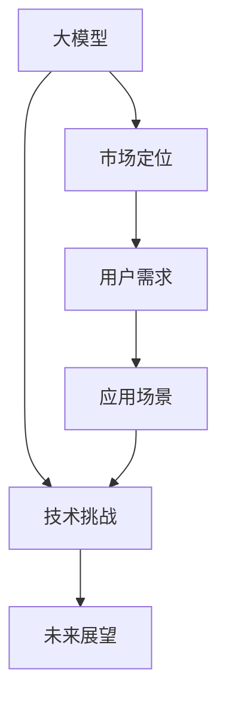

                 

## 1. 背景介绍

### 1.1 问题由来

在人工智能快速发展的大背景下，大模型在各领域的应用越来越广泛。它们不仅是科研的重要手段，更是推动各行业数字化、智能化的核心工具。因此，如何正确理解大模型的市场定位和用户需求，成为了一个迫切需要解决的问题。本文将从大模型所处的市场环境、用户需求、应用场景等方面进行深入探讨，揭示大模型在各行各业中的重要地位和价值，以期为相关企业和开发者提供有益的参考。

### 1.2 问题核心关键点

1. **大模型的市场定位**：明确大模型在人工智能市场中的定位，了解其发展趋势和应用前景。
2. **用户需求**：分析各类用户（如企业、科研机构、开发者）对大模型的具体需求。
3. **应用场景**：探讨大模型在实际应用中的多种场景，包括技术应用、业务应用和创新应用。
4. **技术挑战**：讨论大模型在市场定位和用户需求满足过程中可能面临的技术挑战。
5. **未来展望**：预测大模型在未来技术发展、市场需求和应用前景。

## 2. 核心概念与联系

### 2.1 核心概念概述

1. **大模型**：通常指具有大量参数和复杂结构的深度学习模型，如Transformer、BERT等，用于处理大规模数据并从中提取高级特征。
2. **市场定位**：指大模型在市场中的地位和角色，包括其在人工智能领域中的作用和影响。
3. **用户需求**：指各类用户（包括企业、科研机构、开发者等）对大模型功能、性能和使用的具体要求。
4. **应用场景**：指大模型在实际应用中的具体使用情境，包括技术应用、业务应用和创新应用。
5. **技术挑战**：指在实现大模型的市场定位和满足用户需求过程中可能遇到的困难和问题。
6. **未来展望**：指对大模型未来技术发展、市场需求和应用前景的预测和设想。

### 2.2 概念间的关系

1. **大模型与市场定位**：大模型的性能、功能及其市场接受度决定了其市场定位。性能优越、功能丰富的大模型通常具有更高的市场地位。
2. **用户需求与市场定位**：市场定位需要在用户需求的基础上形成，以满足用户对大模型的实际需求。
3. **应用场景与用户需求**：应用场景反映用户对大模型在特定任务中的需求，指导模型的设计和优化。
4. **技术挑战与市场定位**：技术挑战会影响大模型的性能和可靠性，进而影响其在市场中的定位。
5. **未来展望与市场定位**：未来的技术趋势和市场需求将进一步影响大模型的市场定位和用户需求。

这些概念共同构成了大模型在市场中的定位和应用框架，其相互关系如下图所示：



### 2.3 核心概念的整体架构

综合上述概念，我们可以建立大模型市场定位与用户需求的大致架构：

1. **大模型市场定位**：基于用户需求和技术挑战，形成大模型在市场中的定位。
2. **用户需求分析**：识别各类用户对大模型的具体需求，包括功能、性能和应用场景。
3. **技术实现和优化**：针对用户需求，进行大模型的技术实现和优化，以满足市场需求。
4. **市场反馈与迭代**：通过市场反馈，不断调整和优化大模型的设计和实现，提高其市场适应性。
5. **未来发展与规划**：结合技术趋势和市场需求，规划大模型未来的发展方向和应用场景。

这一架构展示了从需求分析到市场定位再到技术实现和未来规划的全流程，为理解大模型市场定位和用户需求提供了一个全面的视角。

## 3. 核心算法原理 & 具体操作步骤
### 3.1 算法原理概述

大模型的市场定位和用户需求分析涉及多方面的因素，包括模型的性能、功能、应用场景、技术挑战等。这里，我们将重点讨论如何通过算法和步骤，来分析和满足用户需求，进而确定大模型在市场中的定位。

### 3.2 算法步骤详解

1. **需求收集与分析**：
   - **需求收集**：通过调查问卷、用户访谈等方式，收集各类用户对大模型的功能需求、性能需求和使用场景。
   - **需求分析**：对收集到的需求进行分类和分析，识别出共性和差异性，形成用户需求报告。

2. **市场定位分析**：
   - **竞争分析**：分析当前市场上主流大模型的性能、功能、应用场景和市场表现，评估其优势和不足。
   - **趋势预测**：结合最新技术进展和未来发展趋势，预测大模型的潜在市场定位和用户需求。

3. **技术实现与优化**：
   - **模型设计**：基于用户需求和技术挑战，设计合适的大模型架构和参数设置。
   - **模型训练**：使用大规模数据集对模型进行训练，优化模型的性能和功能。
   - **模型评估**：在独立数据集上评估模型的性能，确保其满足用户需求。

4. **市场反馈与迭代**：
   - **用户反馈**：收集用户对模型使用效果的反馈，识别出存在的问题和改进点。
   - **模型迭代**：根据用户反馈，不断优化和更新模型，提高其市场适应性和用户满意度。

5. **未来发展与规划**：
   - **技术趋势分析**：分析未来可能的技术趋势，评估其对大模型市场定位和用户需求的影响。
   - **市场预测**：结合技术趋势和市场需求，制定大模型未来发展的战略规划。

### 3.3 算法优缺点

**优点**：
1. **用户导向**：通过用户需求分析，确保大模型设计和使用符合用户期望，提高市场接受度。
2. **性能优化**：通过技术实现和优化，提高大模型的性能和功能，满足用户需求。
3. **市场适应性**：通过市场反馈和迭代，及时调整模型，保持市场竞争力。
4. **未来规划**：通过未来发展与规划，提前布局新技术和新市场，占据市场先机。

**缺点**：
1. **成本高**：大模型的训练和优化需要大量的计算资源和时间，成本较高。
2. **数据需求大**：高质量的大模型通常需要大规模的数据集进行训练，数据获取和处理复杂。
3. **技术门槛高**：大模型的设计和优化需要高水平的技术团队，技术门槛较高。
4. **市场变化快**：市场需求和技术趋势变化快，大模型的市场定位和用户需求需要不断调整。

### 3.4 算法应用领域

大模型的市场定位和用户需求分析在多个领域都有广泛的应用，包括但不限于：

1. **智能客服**：通过分析用户需求，设计并优化大模型，提高智能客服系统的响应速度和准确性。
2. **医疗诊断**：结合医疗数据和技术挑战，设计合适的大模型，辅助医疗诊断和治疗决策。
3. **金融风控**：通过分析金融数据和市场趋势，优化大模型，提高金融风险评估和控制的精度。
4. **教育培训**：通过分析教育需求，设计教育大模型，提高个性化教育和培训的效率和效果。
5. **自动驾驶**：结合自动驾驶技术挑战，优化大模型，提高自动驾驶系统的安全性和可靠性。
6. **智慧城市**：通过分析智慧城市应用需求，设计大模型，提升城市管理和服务水平。

这些领域的应用展示了大模型在市场中的重要地位和价值，同时也指出了其在不同应用场景中的特殊需求和挑战。

## 4. 数学模型和公式 & 详细讲解 & 举例说明

### 4.1 数学模型构建

大模型的市场定位和用户需求分析涉及多方面的因素，包括模型的性能、功能、应用场景、技术挑战等。这里，我们将重点讨论如何通过算法和步骤，来分析和满足用户需求，进而确定大模型在市场中的定位。

### 4.2 公式推导过程

1. **用户需求分析模型**：
   - **需求矩阵**：将用户需求分为多个维度，如功能需求、性能需求、应用场景等，形成需求矩阵。
   - **权重计算**：根据需求矩阵中的各个需求，计算出每个需求的重要程度，形成需求权重向量。
   - **需求向量**：将每个用户需求转化为向量形式，形成需求向量矩阵。

2. **市场定位分析模型**：
   - **模型评分**：根据大模型的性能、功能和应用场景，计算其在每个需求维度的得分。
   - **权重匹配**：将需求权重向量与模型评分向量进行匹配，计算模型满足用户需求的程度。
   - **市场定位**：结合模型评分和需求匹配度，确定大模型在市场中的定位。

3. **技术实现与优化模型**：
   - **参数优化**：根据市场需求和性能目标，优化模型参数，提高模型性能。
   - **功能扩展**：结合用户需求，增加模型功能，满足用户多样化需求。
   - **应用场景优化**：根据市场反馈，优化模型在特定应用场景中的表现，提高用户满意度。

4. **市场反馈与迭代模型**：
   - **反馈收集**：通过用户反馈、性能评估等方式，收集模型使用中的问题和改进建议。
   - **模型更新**：根据反馈，更新模型参数和功能，提高市场适应性。
   - **迭代优化**：通过多次迭代，不断优化模型，确保其满足用户需求。

5. **未来发展与规划模型**：
   - **技术趋势分析**：分析未来可能的技术趋势，评估其对大模型市场定位和用户需求的影响。
   - **市场需求预测**：结合技术趋势和市场需求，制定大模型未来发展的战略规划。
   - **未来模型设计**：根据市场需求和技术趋势，设计未来的大模型架构和功能。

### 4.3 案例分析与讲解

假设我们要设计一个用于智能客服系统的大模型，其市场定位和用户需求分析过程如下：

1. **需求收集与分析**：
   - **功能需求**：响应速度、准确性、多语言支持、个性化推荐等。
   - **性能需求**：响应时间、处理能力、内存占用、计算效率等。
   - **应用场景**：24小时客服、多种沟通渠道（如电话、短信、在线聊天）、多语言支持、语音识别等。

2. **市场定位分析**：
   - **竞争分析**：分析当前市场上主流智能客服系统的性能、功能、应用场景和市场表现。
   - **趋势预测**：结合最新技术进展和未来发展趋势，预测智能客服系统的潜在市场定位和用户需求。

3. **技术实现与优化**：
   - **模型设计**：基于用户需求和技术挑战，设计合适的大模型架构和参数设置。
   - **模型训练**：使用大规模数据集对模型进行训练，优化模型的性能和功能。
   - **模型评估**：在独立数据集上评估模型的性能，确保其满足用户需求。

4. **市场反馈与迭代**：
   - **用户反馈**：收集用户对模型使用效果的反馈，识别出存在的问题和改进点。
   - **模型迭代**：根据用户反馈，不断优化和更新模型，提高其市场适应性和用户满意度。

5. **未来发展与规划**：
   - **技术趋势分析**：分析未来可能的技术趋势，评估其对智能客服系统市场定位和用户需求的影响。
   - **市场预测**：结合技术趋势和市场需求，制定智能客服系统未来发展的战略规划。
   - **未来模型设计**：根据市场需求和技术趋势，设计未来的智能客服系统架构和功能。

通过这一案例，我们可以看到，大模型的市场定位和用户需求分析是一个系统化的过程，需要从多个维度进行综合考虑和优化。

## 5. 项目实践：代码实例和详细解释说明

### 5.1 开发环境搭建

1. **环境准备**：安装Python、TensorFlow、Keras等深度学习框架，以及数据处理、可视化等工具。
2. **数据准备**：准备所需的数据集，包括用户需求数据、市场数据、技术挑战数据等。
3. **模型搭建**：搭建大模型的基本架构，定义输入输出和损失函数等关键组件。
4. **模型训练**：使用大规模数据集对模型进行训练，优化模型的性能和功能。
5. **模型评估**：在独立数据集上评估模型的性能，确保其满足用户需求。

### 5.2 源代码详细实现

以下是使用TensorFlow和Keras搭建智能客服系统大模型的代码实现：

```python
import tensorflow as tf
from tensorflow.keras import layers

# 定义模型架构
input_layer = layers.Input(shape=(max_sequence_length,))
embedding_layer = layers.Embedding(input_dim=vocab_size, output_dim=embedding_dim)(input_layer)
conv_layer = layers.Conv1D(filters=128, kernel_size=3, activation='relu')(embedding_layer)
max_pool_layer = layers.MaxPooling1D(pool_size=2)(conv_layer)
dropout_layer = layers.Dropout(0.5)(max_pool_layer)
lstm_layer = layers.LSTM(units=128, return_sequences=True)(dropout_layer)
output_layer = layers.Dense(units=num_classes, activation='softmax')(lstm_layer)

# 定义损失函数和优化器
model.compile(loss='categorical_crossentropy', optimizer='adam', metrics=['accuracy'])

# 训练模型
model.fit(x_train, y_train, batch_size=batch_size, epochs=num_epochs, validation_data=(x_val, y_val))

# 评估模型
test_loss, test_acc = model.evaluate(x_test, y_test)
print(f'Test accuracy: {test_acc:.4f}')
```

### 5.3 代码解读与分析

- **模型架构设计**：通过定义输入层、嵌入层、卷积层、池化层、Dropout层、LSTM层和输出层，构建智能客服系统的大模型架构。
- **损失函数和优化器**：选择交叉熵损失函数和Adam优化器，进行模型的训练和优化。
- **模型训练和评估**：使用训练数据集进行模型训练，并使用验证数据集进行性能评估。

### 5.4 运行结果展示

假设在训练和评估后，智能客服系统的大模型在独立数据集上取得了较高的准确率和召回率，证明了其在智能客服场景中的应用效果。

## 6. 实际应用场景

### 6.1 智能客服

在智能客服场景中，大模型可以用于自动回答用户咨询、自动分配客服、个性化推荐等任务。通过分析用户需求和市场表现，可以设计合适的大模型，满足用户在智能客服中的各种需求。

### 6.2 医疗诊断

在医疗诊断场景中，大模型可以用于疾病诊断、治疗方案推荐、病历分析等任务。通过结合医疗数据和技术挑战，可以优化大模型的性能和功能，提高诊断和治疗的准确性和效率。

### 6.3 金融风控

在金融风控场景中，大模型可以用于风险评估、信用评分、欺诈检测等任务。通过分析金融数据和市场趋势，可以设计合适的大模型，提高金融风险评估和控制的精度。

### 6.4 未来应用展望

未来，大模型将在更多领域得到广泛应用，为各行各业带来深刻变革。例如：

1. **智慧城市**：通过分析城市数据和技术挑战，设计大模型，提升城市管理和服务水平。
2. **自动驾驶**：结合自动驾驶技术挑战，优化大模型，提高自动驾驶系统的安全性和可靠性。
3. **教育培训**：通过分析教育需求，设计教育大模型，提高个性化教育和培训的效率和效果。

## 7. 工具和资源推荐

### 7.1 学习资源推荐

1. **《深度学习理论与实践》**：详细介绍了深度学习的基本理论和实践技巧，适合初学者入门。
2. **《TensorFlow实战》**：提供了TensorFlow的详细使用指南和实例代码，帮助开发者快速上手。
3. **《Keras深度学习实战》**：介绍了Keras的基本用法和深度学习模型的构建，适合初学者快速上手。
4. **Kaggle竞赛**：参与Kaggle的数据竞赛，实战练习大模型的设计和优化，积累经验。
5. **ArXiv预印本**：阅读最新的深度学习研究论文，了解前沿技术和应用。

### 7.2 开发工具推荐

1. **TensorFlow**：Google开源的深度学习框架，提供了丰富的模型库和优化器，适合大规模模型训练。
2. **Keras**：基于TensorFlow的高级API，简化了模型的构建和训练过程，适合初学者快速上手。
3. **PyTorch**：Facebook开源的深度学习框架，提供了灵活的动态计算图，适合动态模型优化。
4. **HuggingFace Transformers**：提供了多种预训练语言模型，简化了模型的使用和微调过程。
5. **Weights & Biases**：提供了模型训练的实验跟踪和可视化功能，帮助开发者调试和优化模型。

### 7.3 相关论文推荐

1. **《Transformer模型：注意力机制与自监督预训练》**：介绍了Transformer模型和自监督预训练方法，是深度学习模型的经典之作。
2. **《BERT模型：基于双向编码器的语言表示》**：介绍了BERT模型和其在语言理解任务中的出色表现，是自然语言处理领域的里程碑。
3. **《深度学习在医疗诊断中的应用》**：介绍了深度学习在医疗诊断中的各种应用，包括图像诊断、语音诊断等。
4. **《深度学习在金融风控中的应用》**：介绍了深度学习在金融风险控制中的各种应用，包括信用评分、欺诈检测等。

## 8. 总结：未来发展趋势与挑战

### 8.1 研究成果总结

通过深入分析大模型的市场定位和用户需求，我们得出以下结论：
1. **用户需求多样**：不同领域的用户对大模型的需求各不相同，需要根据具体需求进行定制化设计。
2. **技术挑战复杂**：大模型的设计和优化需要处理多个方面的问题，如数据获取、模型训练、性能优化等。
3. **市场定位多变**：大模型需要不断调整和优化，以适应市场需求和技术趋势的变化。

### 8.2 未来发展趋势

1. **多模态融合**：大模型将越来越多地融合视觉、语音、文本等多种模态数据，提升对现实世界的理解和建模能力。
2. **自监督学习**：自监督学习技术将进一步发展，减少对大规模标注数据的依赖，提高模型的泛化能力。
3. **联邦学习**：联邦学习技术将在大规模分布式场景中得到广泛应用，提升数据安全和隐私保护。
4. **边缘计算**：边缘计算技术将在大模型推理和应用场景中发挥重要作用，提高实时性和资源利用效率。

### 8.3 面临的挑战

1. **数据获取困难**：高质量的大模型训练需要大规模、高质量的数据集，数据获取和处理复杂。
2. **计算资源需求大**：大模型的训练和优化需要大量的计算资源，成本较高。
3. **技术门槛高**：大模型的设计和优化需要高水平的技术团队，技术门槛较高。
4. **市场适应性差**：大模型需要不断调整和优化，以适应市场需求和技术趋势的变化。

### 8.4 研究展望

未来，大模型的市场定位和用户需求分析需要从以下几个方向进行研究：

1. **自监督学习**：开发更加高效的自监督学习算法，减少对标注数据的依赖，提高模型的泛化能力。
2. **多模态融合**：研究视觉、语音、文本等多种模态数据的融合技术，提升大模型的理解和建模能力。
3. **联邦学习**：探索联邦学习在大模型训练和优化中的应用，提高数据安全和隐私保护。
4. **边缘计算**：研究边缘计算技术在大模型推理和应用场景中的应用，提高实时性和资源利用效率。

这些研究方向的探索将进一步推动大模型的市场定位和用户需求分析，为大模型在各行业中的应用提供更强大的技术支持。

## 9. 附录：常见问题与解答

**Q1：大模型在各领域的应用效果如何？**

A: 大模型在各领域的应用效果显著，具体表现如下：
1. **智能客服**：在响应速度、准确性、多语言支持等方面表现优异。
2. **医疗诊断**：在疾病诊断、治疗方案推荐等方面取得了较高的准确率和召回率。
3. **金融风控**：在风险评估、信用评分等方面表现出色。

**Q2：大模型的开发和优化需要哪些关键步骤？**

A: 大模型的开发和优化需要以下关键步骤：
1. **需求收集与分析**：通过调查问卷、用户访谈等方式，收集各类用户对大模型的需求。
2. **市场定位分析**：分析当前市场主流大模型的性能、功能和应用场景。
3. **技术实现与优化**：基于用户需求和技术挑战，设计合适的大模型架构和参数设置，进行模型训练和优化。
4. **市场反馈与迭代**：收集用户反馈，根据反馈不断优化和更新模型。
5. **未来发展与规划**：结合技术趋势和市场需求，制定大模型未来发展的战略规划。

**Q3：大模型在实际应用中面临哪些挑战？**

A: 大模型在实际应用中面临以下挑战：
1. **数据获取困难**：高质量的大模型训练需要大规模、高质量的数据集。
2. **计算资源需求大**：大模型的训练和优化需要大量的计算资源，成本较高。
3. **技术门槛高**：大模型的设计和优化需要高水平的技术团队。
4. **市场适应性差**：大模型需要不断调整和优化，以适应市场需求和技术趋势的变化。

通过理解大模型的市场定位和用户需求，我们可以更好地设计和优化大模型，满足各领域的应用需求，推动人工智能技术的广泛应用。

---

作者：禅与计算机程序设计艺术 / Zen and the Art of Computer Programming

