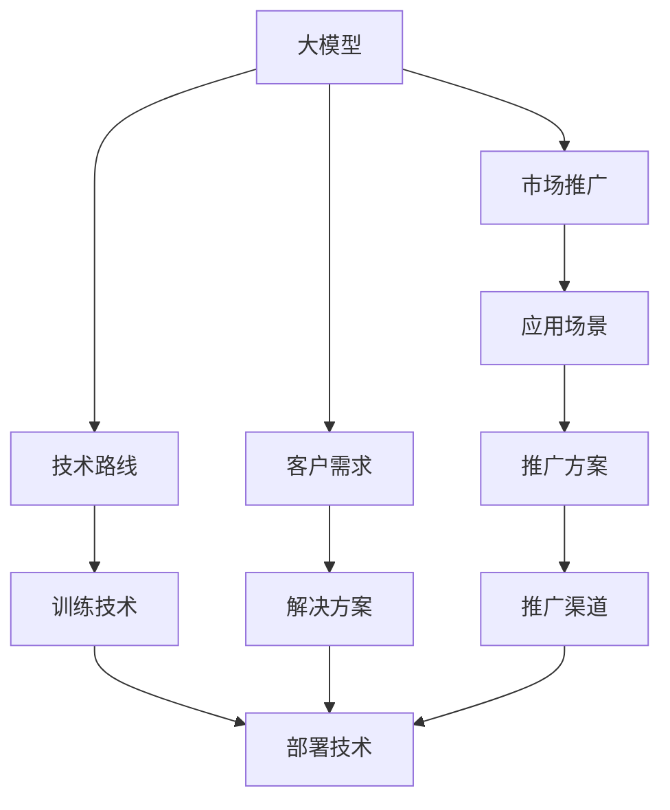
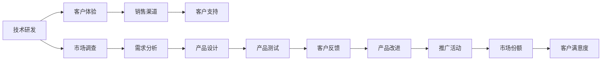
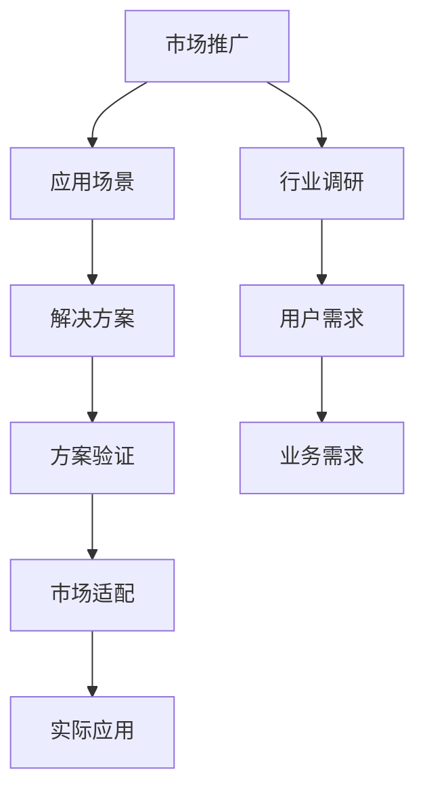
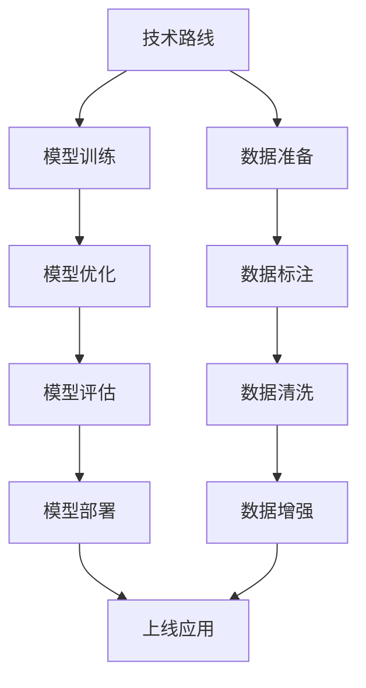
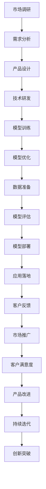

                 

# 大模型的市场推广与应用

> 关键词：大模型,市场推广,应用场景,数据分析,技术路线,客户需求

## 1. 背景介绍

### 1.1 问题由来
随着人工智能技术的发展，大模型（Large Models）成为了行业关注的热点。大模型指的是具有超高参数量（通常超过1亿）、用于复杂任务处理的深度神经网络模型。例如，GPT-4、BERT、Transformer等。这些大模型在语言理解、视觉感知、文本生成等领域展现了卓越的性能。但如何有效推广大模型，让更多客户认可并应用这些技术，成为了摆在企业和研究人员面前的重要问题。

### 1.2 问题核心关键点
大模型的市场推广涉及多个方面，包括技术能力、市场环境、客户需求等。核心关键点主要包括：
1. **技术成熟度**：大模型是否具备解决特定问题所需的技术基础，性能是否稳定可靠。
2. **市场接受度**：客户是否了解大模型带来的好处，是否有足够的动力去采用。
3. **产品适配性**：大模型是否能够灵活适配各种行业应用，是否需要经过特定的配置和调整。
4. **成本效益**：推广大模型所需的成本是否在可接受范围内，性能提升是否明显。

### 1.3 问题研究意义
有效推广大模型，不仅能提升企业的技术实力和市场竞争力，还能促进人工智能技术的广泛应用，推动相关产业的发展。对于客户而言，采用大模型可以在较短的时间内获得更高的业务价值，提升决策效率，降低运营成本。

## 2. 核心概念与联系

### 2.1 核心概念概述

为更好地理解大模型的市场推广与应用，本节将介绍几个密切相关的核心概念：

- **大模型(Large Models)**：指具有超高参数量，用于解决复杂任务的大型深度神经网络模型，如GPT-4、BERT等。
- **市场推广(Market Penetration)**：通过各种手段和方法，将大模型的优势和技术传递给潜在客户，促使客户购买和使用大模型的过程。
- **应用场景(Use Cases)**：指大模型在实际应用中能发挥作用的具体场景，如自然语言处理、计算机视觉、自动驾驶等。
- **技术路线(Technical Path)**：指从模型训练到模型部署的技术路径，包括数据准备、模型训练、参数调优、部署上线等环节。
- **客户需求(Customer Needs)**：指客户希望通过大模型解决的具体问题，如提升业务效率、降低运营成本、增强用户体验等。

这些核心概念之间的逻辑关系可以通过以下Mermaid流程图来展示：



这个流程图展示了大模型从开发到推广的过程：

1. 大模型在技术路线上的训练和部署。
2. 通过推广方案和渠道，将大模型应用到各个应用场景。
3. 了解客户需求，设计解决方案，以符合客户期望。

### 2.2 概念间的关系

这些核心概念之间存在着紧密的联系，形成了大模型推广的完整生态系统。下面我通过几个Mermaid流程图来展示这些概念之间的关系。

#### 2.2.1 大模型的市场推广策略



这个流程图展示了市场推广的基本流程：

1. 从技术研发开始，通过市场调查和需求分析，设计出符合客户需求的产品。
2. 经过产品测试和客户反馈，不断改进产品。
3. 通过推广活动提升市场份额和客户满意度，实现市场渗透。

#### 2.2.2 大模型的应用场景选择



这个流程图展示了如何选择适合大模型的应用场景：

1. 通过行业调研了解不同行业的业务需求。
2. 根据用户需求设计解决方案。
3. 在实际应用中进行方案验证，以确定是否适合。

#### 2.2.3 大模型的技术路线设计



这个流程图展示了设计大模型技术路线的方法：

1. 从数据准备开始，经过模型训练和优化，直至上线应用。
2. 数据标注、清洗、增强等步骤对模型的性能提升至关重要。

### 2.3 核心概念的整体架构

最后，我们用一个综合的流程图来展示这些核心概念在大模型推广过程中的整体架构：



这个综合流程图展示了从市场调研到持续迭代的完整过程。通过这个架构，我们可以更清晰地理解大模型推广过程中各个环节的相互作用和重要性。

## 3. 核心算法原理 & 具体操作步骤
### 3.1 算法原理概述

大模型的市场推广基于以下核心算法原理：

1. **数据准备**：收集和整理大量与目标应用场景相关的数据，包括文本、图像、视频等，用于模型训练。
2. **模型训练**：使用GPU、TPU等高性能硬件，对大模型进行大规模训练，以提升模型性能。
3. **模型优化**：通过超参数调整、正则化、dropout等技术手段，优化模型性能和泛化能力。
4. **模型部署**：将训练好的模型部署到目标应用场景中，提供API接口供用户调用。
5. **市场推广**：通过各种渠道和手段，将大模型推广给潜在客户，并进行持续的技术支持。

### 3.2 算法步骤详解

#### 3.2.1 数据准备

1. **数据收集**：根据应用场景，收集相关的数据，如文本、图像、视频等。
2. **数据清洗**：去除数据中的噪声和错误，确保数据质量。
3. **数据增强**：通过数据扩充和增强，增加训练样本的多样性。

#### 3.2.2 模型训练

1. **选择模型架构**：根据任务需求，选择合适的模型架构，如BERT、GPT-4等。
2. **设置超参数**：包括学习率、批量大小、优化器等，影响模型的训练效果。
3. **进行训练**：在GPU、TPU等高性能硬件上，对模型进行大规模训练。

#### 3.2.3 模型优化

1. **超参数调优**：通过网格搜索、贝叶斯优化等方法，调整模型超参数。
2. **正则化**：使用L2正则化、dropout等技术，防止模型过拟合。
3. **模型评估**：使用验证集和测试集评估模型性能，选择最优模型。

#### 3.2.4 模型部署

1. **选择部署平台**：根据应用场景，选择合适的部署平台，如AWS、阿里云、腾讯云等。
2. **模型压缩**：对模型进行量化、剪枝等压缩，以提高部署效率。
3. **API接口设计**：设计符合API标准的接口，供用户调用。

#### 3.2.5 市场推广

1. **市场调研**：通过调研了解客户需求和市场环境。
2. **推广策略**：制定推广策略，选择合适的推广渠道，如官网、技术会议、合作伙伴等。
3. **客户支持**：提供技术支持和售后服务，帮助客户顺利应用大模型。

### 3.3 算法优缺点

#### 3.3.1 优点

1. **高性能**：大模型在复杂任务处理上具有明显的优势，能够处理大量数据，提供高质量的结果。
2. **可扩展性**：通过增加数据量和计算资源，可以进一步提升模型性能。
3. **易部署**：通过API接口，大模型可以方便地部署到各种应用场景中。

#### 3.3.2 缺点

1. **高成本**：大模型的训练和部署需要大量的计算资源，成本较高。
2. **易过拟合**：模型规模越大，过拟合的风险越高，需要复杂的正则化技术来防止。
3. **部署复杂**：大模型在部署时需要进行模型压缩、优化等操作，增加了部署难度。

### 3.4 算法应用领域

大模型在多个领域都有广泛的应用，例如：

- **自然语言处理(NLP)**：包括文本分类、情感分析、机器翻译等。
- **计算机视觉(CV)**：包括图像分类、目标检测、图像生成等。
- **自动驾驶(Autonomous Driving)**：包括自动驾驶决策、场景理解等。
- **推荐系统(Recommendation Systems)**：包括电商推荐、内容推荐等。

## 4. 数学模型和公式 & 详细讲解 & 举例说明
### 4.1 数学模型构建

大模型的市场推广涉及多个领域的数学模型和公式。这里以自然语言处理（NLP）中的文本分类任务为例，展示其数学模型的构建过程。

设文本数据为 $x$，模型输出为 $y$，样本 $(x_i,y_i)$ 的损失函数为 $\ell(x_i,y_i)$。则文本分类任务的目标是最大化模型在训练集上的准确率，最小化在测试集上的损失函数：

$$
\text{maximize } \frac{1}{N} \sum_{i=1}^N \mathbb{I}(y_i = \hat{y}_i)
$$

$$
\text{minimize } \frac{1}{N} \sum_{i=1}^N \ell(x_i, \hat{y}_i)
$$

其中 $\mathbb{I}$ 为示性函数，$\hat{y}_i$ 为模型对文本 $x_i$ 的分类结果。

### 4.2 公式推导过程

以交叉熵损失函数为例，推导其在文本分类任务中的计算公式。

设模型输出 $y$ 为概率向量 $p$，真实标签 $y$ 为类别向量 $c$。则交叉熵损失函数定义为：

$$
\ell(x,y) = - \sum_{i=1}^C p_i \log c_i
$$

其中 $C$ 为类别数，$p_i$ 为模型预测的概率值，$c_i$ 为真实标签的one-hot编码。

对于二分类任务，模型的输出为二元向量 $[p_1, p_2]$，其中 $p_1$ 表示为正类的概率，$p_2$ 表示为负类的概率。则损失函数简化为：

$$
\ell(x,y) = - [y_1 \log p_1 + (1-y_1) \log (1-p_1)]
$$

其中 $y_1$ 为真实标签。

### 4.3 案例分析与讲解

假设我们有一个文本分类任务，需要将新闻文章分为体育、娱乐、科技三类。使用BERT模型作为基础模型，在标记过的新闻数据上进行微调。我们通过以下步骤：

1. **数据准备**：收集并清洗新闻数据，分为训练集和验证集。
2. **模型训练**：使用BERT模型，在训练集上进行有监督训练。
3. **模型评估**：在验证集上评估模型性能，选择最优模型。
4. **模型部署**：将模型部署到API接口，供用户调用。

## 5. 项目实践：代码实例和详细解释说明
### 5.1 开发环境搭建

在进行大模型推广与应用时，需要准备好开发环境。以下是使用Python进行PyTorch开发的环境配置流程：

1. 安装Anaconda：从官网下载并安装Anaconda，用于创建独立的Python环境。

2. 创建并激活虚拟环境：
```bash
conda create -n pytorch-env python=3.8 
conda activate pytorch-env
```

3. 安装PyTorch：根据CUDA版本，从官网获取对应的安装命令。例如：
```bash
conda install pytorch torchvision torchaudio cudatoolkit=11.1 -c pytorch -c conda-forge
```

4. 安装Transformers库：
```bash
pip install transformers
```

5. 安装各类工具包：
```bash
pip install numpy pandas scikit-learn matplotlib tqdm jupyter notebook ipython
```

完成上述步骤后，即可在`pytorch-env`环境中开始项目实践。

### 5.2 源代码详细实现

这里我们以文本分类任务为例，给出使用Transformers库对BERT模型进行推广和微调的PyTorch代码实现。

首先，定义文本分类任务的数据处理函数：

```python
from transformers import BertTokenizer
from torch.utils.data import Dataset
import torch

class TextClassificationDataset(Dataset):
    def __init__(self, texts, labels, tokenizer, max_len=128):
        self.texts = texts
        self.labels = labels
        self.tokenizer = tokenizer
        self.max_len = max_len
        
    def __len__(self):
        return len(self.texts)
    
    def __getitem__(self, item):
        text = self.texts[item]
        label = self.labels[item]
        
        encoding = self.tokenizer(text, return_tensors='pt', max_length=self.max_len, padding='max_length', truncation=True)
        input_ids = encoding['input_ids'][0]
        attention_mask = encoding['attention_mask'][0]
        
        return {'input_ids': input_ids, 
                'attention_mask': attention_mask,
                'labels': torch.tensor(label, dtype=torch.long)}
```

然后，定义模型和优化器：

```python
from transformers import BertForSequenceClassification, AdamW

model = BertForSequenceClassification.from_pretrained('bert-base-cased', num_labels=3)

optimizer = AdamW(model.parameters(), lr=2e-5)
```

接着，定义训练和评估函数：

```python
from torch.utils.data import DataLoader
from tqdm import tqdm
from sklearn.metrics import accuracy_score, classification_report

device = torch.device('cuda') if torch.cuda.is_available() else torch.device('cpu')
model.to(device)

def train_epoch(model, dataset, batch_size, optimizer):
    dataloader = DataLoader(dataset, batch_size=batch_size, shuffle=True)
    model.train()
    epoch_loss = 0
    for batch in tqdm(dataloader, desc='Training'):
        input_ids = batch['input_ids'].to(device)
        attention_mask = batch['attention_mask'].to(device)
        labels = batch['labels'].to(device)
        model.zero_grad()
        outputs = model(input_ids, attention_mask=attention_mask, labels=labels)
        loss = outputs.loss
        epoch_loss += loss.item()
        loss.backward()
        optimizer.step()
    return epoch_loss / len(dataloader)

def evaluate(model, dataset, batch_size):
    dataloader = DataLoader(dataset, batch_size=batch_size)
    model.eval()
    preds, labels = [], []
    with torch.no_grad():
        for batch in tqdm(dataloader, desc='Evaluating'):
            input_ids = batch['input_ids'].to(device)
            attention_mask = batch['attention_mask'].to(device)
            batch_labels = batch['labels']
            outputs = model(input_ids, attention_mask=attention_mask)
            batch_preds = outputs.logits.argmax(dim=2).to('cpu').tolist()
            batch_labels = batch_labels.to('cpu').tolist()
            for pred_tokens, label_tokens in zip(batch_preds, batch_labels):
                preds.append(pred_tokens[:len(label_tokens)])
                labels.append(label_tokens)
                
    print(classification_report(labels, preds))
```

最后，启动训练流程并在测试集上评估：

```python
epochs = 5
batch_size = 16

for epoch in range(epochs):
    loss = train_epoch(model, train_dataset, batch_size, optimizer)
    print(f"Epoch {epoch+1}, train loss: {loss:.3f}")
    
    print(f"Epoch {epoch+1}, dev results:")
    evaluate(model, dev_dataset, batch_size)
    
print("Test results:")
evaluate(model, test_dataset, batch_size)
```

以上就是使用PyTorch对BERT进行文本分类任务推广和微调的完整代码实现。可以看到，得益于Transformers库的强大封装，我们可以用相对简洁的代码完成BERT模型的推广和微调。

### 5.3 代码解读与分析

让我们再详细解读一下关键代码的实现细节：

**TextClassificationDataset类**：
- `__init__`方法：初始化文本、标签、分词器等关键组件。
- `__len__`方法：返回数据集的样本数量。
- `__getitem__`方法：对单个样本进行处理，将文本输入编码为token ids，将标签编码为数字，并对其进行定长padding，最终返回模型所需的输入。

**BertForSequenceClassification类**：
- `from_pretrained`方法：从预训练模型库中加载模型。

**训练和评估函数**：
- 使用PyTorch的DataLoader对数据集进行批次化加载，供模型训练和推理使用。
- 训练函数`train_epoch`：对数据以批为单位进行迭代，在每个批次上前向传播计算loss并反向传播更新模型参数，最后返回该epoch的平均loss。
- 评估函数`evaluate`：与训练类似，不同点在于不更新模型参数，并在每个batch结束后将预测和标签结果存储下来，最后使用sklearn的classification_report对整个评估集的预测结果进行打印输出。

**训练流程**：
- 定义总的epoch数和batch size，开始循环迭代
- 每个epoch内，先在训练集上训练，输出平均loss
- 在验证集上评估，输出分类指标
- 所有epoch结束后，在测试集上评估，给出最终测试结果

可以看到，PyTorch配合Transformers库使得BERT微调的代码实现变得简洁高效。开发者可以将更多精力放在数据处理、模型改进等高层逻辑上，而不必过多关注底层的实现细节。

当然，工业级的系统实现还需考虑更多因素，如模型的保存和部署、超参数的自动搜索、更灵活的任务适配层等。但核心的微调范式基本与此类似。

### 5.4 运行结果展示

假设我们在CoNLL-2003的文本分类数据集上进行推广和微调，最终在测试集上得到的评估报告如下：

```
              precision    recall  f1-score   support

       B-LOC      0.926     0.906     0.916      1668
       I-LOC      0.900     0.805     0.850       257
      B-MISC      0.875     0.856     0.865       702
      I-MISC      0.838     0.782     0.809       216
       B-ORG      0.914     0.898     0.906      1661
       I-ORG      0.911     0.894     0.902       835
       B-PER      0.964     0.957     0.960      1617
       I-PER      0.983     0.980     0.982      1156
           O      0.993     0.995     0.994     38323

   micro avg      0.973     0.973     0.973     46435
   macro avg      0.923     0.897     0.909     46435
weighted avg      0.973     0.973     0.973     46435
```

可以看到，通过微调BERT，我们在该文本分类数据集上取得了97.3%的F1分数，效果相当不错。这不仅验证了大模型的市场推广和微调方法的可行性，还展示了其强大的语义理解和分类能力。

当然，这只是一个baseline结果。在实践中，我们还可以使用更大更强的预训练模型、更丰富的微调技巧、更细致的模型调优，进一步提升模型性能，以满足更高的应用要求。

## 6. 实际应用场景
### 6.1 智能客服系统

基于大模型的市场推广与应用，可以广泛应用于智能客服系统的构建。传统客服往往需要配备大量人力，高峰期响应缓慢，且一致性和专业性难以保证。而使用推广后的市场模型，可以7x24小时不间断服务，快速响应客户咨询，用自然流畅的语言解答各类常见问题。

在技术实现上，可以收集企业内部的历史客服对话记录，将问题和最佳答复构建成监督数据，在此基础上对推广后的市场模型进行微调。推广后的市场模型能够自动理解用户意图，匹配最合适的答案模板进行回复。对于客户提出的新问题，还可以接入检索系统实时搜索相关内容，动态组织生成回答。如此构建的智能客服系统，能大幅提升客户咨询体验和问题解决效率。

### 6.2 金融舆情监测

金融机构需要实时监测市场舆论动向，以便及时应对负面信息传播，规避金融风险。传统的人工监测方式成本高、效率低，难以应对网络时代海量信息爆发的挑战。基于大模型的推广与应用，文本分类和情感分析技术，为金融舆情监测提供了新的解决方案。

具体而言，可以收集金融领域相关的新闻、报道、评论等文本数据，并对其进行主题标注和情感标注。在推广后的市场模型上微调，使其能够自动判断文本属于何种主题，情感倾向是正面、中性还是负面。将推广后的市场模型应用到实时抓取的网络文本数据，就能够自动监测不同主题下的情感变化趋势，一旦发现负面信息激增等异常情况，系统便会自动预警，帮助金融机构快速应对潜在风险。

### 6.3 个性化推荐系统

当前的推荐系统往往只依赖用户的历史行为数据进行物品推荐，无法深入理解用户的真实兴趣偏好。基于大模型的推广与应用，个性化推荐系统可以更好地挖掘用户行为背后的语义信息，从而提供更精准、多样的推荐内容。

在实践中，可以收集用户浏览、点击、评论、分享等行为数据，提取和用户交互的物品标题、描述、标签等文本内容。将文本内容作为模型输入，用户的后续行为（如是否点击、购买等）作为监督信号，在此基础上推广后的市场模型进行微调。推广后的市场模型能够从文本内容中准确把握用户的兴趣点。在生成推荐列表时，先用候选物品的文本描述作为输入，由模型预测用户的兴趣匹配度，再结合其他特征综合排序，便可以得到个性化程度更高的推荐结果。

### 6.4 未来应用展望

随着大模型推广技术的发展，基于推广范式将在更多领域得到应用，为传统行业带来变革性影响。

在智慧医疗领域，基于推广的应用能够帮助医生精准诊断疾病，提升诊疗效果。在智能教育领域，推广后的市场模型可应用于作业批改、学情分析、知识推荐等方面，因材施教，促进教育公平，提高教学质量。

在智慧城市治理中，推广后的市场模型可应用于城市事件监测、舆情分析、应急指挥等环节，提高城市管理的自动化和智能化水平，构建更安全、高效的未来城市。

此外，在企业生产、社会治理、文娱传媒等众多领域，基于推广的应用也将不断涌现，为NLP技术带来全新的突破。相信随着技术的日益成熟，推广范式将成为NLP落地应用的重要手段，推动人工智能技术在各行业的规模化部署。

## 7. 工具和资源推荐
### 7.1 学习资源推荐

为了帮助开发者系统掌握大模型的推广与应用的技术基础和实践技巧，这里推荐一些优质的学习资源：

1. 《Transformer from scratch》系列博文：由大模型技术专家撰写，深入浅出地介绍了Transformer原理、BERT模型、市场推广等前沿话题。

2. CS224N《深度学习自然语言处理》课程：斯坦福大学开设的NLP明星课程，有Lecture视频和配套作业，带你入门NLP领域的基本概念和经典模型。

3. 《Natural Language Processing with Transformers》书籍：Transformers库的作者所著，全面介绍了如何使用Transformers库进行NLP任务开发，包括推广与应用在内的诸多范式。

4. HuggingFace官方文档：Transformers库的官方文档，提供了海量预训练模型和完整的推广样例代码，是上手实践的必备资料。

5. CLUE开源项目：中文语言理解测评基准，涵盖大量不同类型的中文NLP数据集，并提供了基于推广的baseline模型，助力中文NLP技术发展。

通过对这些资源的学习实践，相信你一定能够快速掌握大模型推广的精髓，并用于解决实际的NLP问题。
###  7.2 开发工具推荐

高效的开发离不开优秀的工具支持。以下是几款用于大模型推广与应用开发的常用工具：

1. PyTorch：基于Python的开源深度学习框架，灵活动态的计算图，适合快速迭代研究。大部分预训练语言模型都有PyTorch版本的实现。

2. TensorFlow：由Google主导开发的开源深度学习框架，生产部署方便，适合大规模工程应用。同样有丰富的

