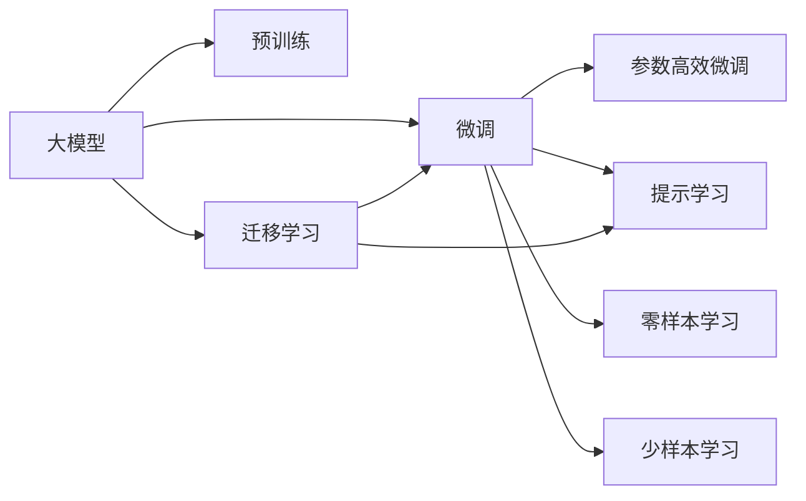

                 

# 大模型的市场需求与技术潜力

## 1. 背景介绍

### 1.1 问题由来

随着人工智能技术在各个行业的快速普及，企业对AI技术的需求也在不断增长。尤其是大模型，凭借其强大的处理能力、丰富的知识储备和灵活的适应性，已成为企业智能化转型的首选工具。然而，传统的大模型训练和部署周期长、成本高，且对数据、算力等资源要求严苛，企业在实际应用中面临着诸多挑战。如何降低大模型应用门槛，提升其市场竞争力，成为了当前研究的热点问题。

### 1.2 问题核心关键点

大模型在市场需求和技术潜力方面的研究，主要集中在以下几个关键点：

- **市场需求**：大模型如何满足企业需求，在实际应用中发挥最大效能，提升企业运营效率。
- **技术潜力**：大模型如何通过技术创新，解决现实中的问题，实现更广范围内的应用。
- **解决方案**：通过何种方式将大模型的优势转化为企业可用的产品或服务，满足不同行业的个性化需求。

### 1.3 问题研究意义

研究大模型的市场需求和技术潜力，对于推动人工智能技术的普及应用、提升企业智能化水平、促进产业数字化转型，具有重要意义：

1. **提升运营效率**：大模型可以自动化处理大量数据，为企业提供精准的决策支持，降低人力成本。
2. **拓展应用场景**：大模型凭借其通用性和可迁移性，可以在多个行业和场景中广泛应用，带来新的增长点。
3. **推动技术创新**：大模型的技术演进促进了人工智能领域的技术发展，推动了更多前沿技术的研究和应用。
4. **促进产业升级**：大模型为各行各业提供了智能化的解决方案，推动了传统行业的数字化转型和智能化升级。

## 2. 核心概念与联系

### 2.1 核心概念概述

为更好地理解大模型的市场需求和技术潜力，本节将介绍几个密切相关的核心概念：

- **大模型**：指通过大规模数据预训练得到的深度学习模型，如BERT、GPT等，具有强大的处理能力、丰富的知识储备和广泛的适用性。
- **预训练**：指在大规模数据上对模型进行无监督训练，学习通用特征，如语言理解、图像识别等。
- **微调**：指在预训练模型基础上，通过少量标注数据进行有监督训练，调整模型参数，使其适应特定任务。
- **迁移学习**：指将一个领域学到的知识迁移到另一个相关领域，提升模型的泛化能力和性能。
- **参数高效微调**：指在微调过程中只更新少量参数，避免过拟合，提高微调效率。
- **提示学习**：通过精心设计的输入模板，引导模型输出特定结果，减少微调参数。
- **零样本学习和少样本学习**：指模型在无标注或少量标注数据的情况下，通过输入模板进行推理和生成。

这些概念之间存在紧密联系，共同构成了大模型的市场需求和技术潜力框架。

### 2.2 概念间的关系

这些核心概念之间的逻辑关系可以通过以下Mermaid流程图来展示：



这个流程图展示了大模型的核心概念及其之间的关系：

1. 大模型通过预训练学习通用特征。
2. 微调使模型适应特定任务，提升性能。
3. 迁移学习将预训练知识应用于不同任务，增强泛化能力。
4. 参数高效微调和提示学习进一步提升模型效率和灵活性。
5. 零样本学习和少样本学习利用预训练知识，在少标注数据下也能进行推理和生成。

这些概念共同构成了大模型的市场需求和技术潜力生态系统，为其在各个行业的应用提供了坚实的基础。

## 3. 核心算法原理 & 具体操作步骤

### 3.1 算法原理概述

大模型的市场需求和技术潜力，主要依赖于其在多个领域的应用。大模型通过预训练学习通用知识，并在微调过程中适应特定任务，具有广泛的应用前景。其市场需求和技术潜力可以从以下几个方面进行详细阐述：

1. **市场需求**：大模型可以应用于图像识别、自然语言处理、语音识别等多个领域，解决实际问题，满足企业需求。
2. **技术潜力**：大模型通过技术创新，提升了数据处理能力、推理速度和模型的泛化能力。

### 3.2 算法步骤详解

大模型在市场需求和技术潜力方面的研究，主要包括以下几个步骤：

**Step 1: 数据收集与预处理**
- 收集与任务相关的数据集，包括训练集、验证集和测试集。
- 对数据进行清洗、标注和预处理，确保数据质量。

**Step 2: 模型选择与初始化**
- 选择合适的预训练模型作为初始化参数，如BERT、GPT等。
- 在预训练模型基础上，添加任务适配层，包括输出层和损失函数。

**Step 3: 微调过程**
- 使用标注数据进行微调，优化模型在特定任务上的性能。
- 选择合适的优化算法和超参数，如学习率、批大小、迭代轮数等。

**Step 4: 评估与优化**
- 在验证集上评估模型性能，调整模型参数和超参数。
- 使用少样本学习和提示学习等技术，减少标注数据需求。

**Step 5: 部署与应用**
- 将微调后的模型部署到实际应用场景中，进行推理和预测。
- 持续收集新数据，进行模型更新和优化。

### 3.3 算法优缺点

大模型在市场需求和技术潜力方面的研究，具有以下优点：

1. **广泛应用**：大模型具有通用性和可迁移性，可以应用于多个行业和场景。
2. **高效性**：大模型通过预训练和微调，可以显著提升数据处理能力和推理速度。
3. **适应性强**：大模型可以根据任务需求进行灵活微调，适应不同领域的特定需求。

同时，大模型也存在以下缺点：

1. **资源需求高**：大模型需要大量计算资源和存储空间，对硬件要求较高。
2. **标注成本高**：微调过程需要大量标注数据，标注成本较高。
3. **推理速度慢**：大模型推理速度较慢，在实时应用中可能存在延迟问题。

### 3.4 算法应用领域

大模型在市场需求和技术潜力方面的研究，主要应用于以下几个领域：

- **自然语言处理**：大模型在文本分类、情感分析、机器翻译等任务中表现优异，提升了NLP应用的效果。
- **计算机视觉**：大模型在图像识别、物体检测、图像生成等任务中具有优势，推动了计算机视觉技术的发展。
- **语音识别**：大模型在语音识别、语音合成等任务中取得了显著进展，提升了语音交互的体验。
- **医疗健康**：大模型在疾病诊断、医疗影像分析等任务中发挥了重要作用，提升了医疗服务的智能化水平。
- **金融服务**：大模型在风险评估、智能投顾等任务中表现出色，提高了金融服务的效率和精度。

## 4. 数学模型和公式 & 详细讲解  
### 4.1 数学模型构建

大模型的市场需求和技术潜力，主要依赖于其在多个领域的应用。大模型通过预训练学习通用知识，并在微调过程中适应特定任务，具有广泛的应用前景。其市场需求和技术潜力可以从以下几个方面进行详细阐述：

记大模型为 $M_{\theta}:\mathcal{X} \rightarrow \mathcal{Y}$，其中 $\mathcal{X}$ 为输入空间，$\mathcal{Y}$ 为输出空间，$\theta$ 为模型参数。假设任务 $T$ 的数据集为 $D=\{(x_i,y_i)\}_{i=1}^N$，其中 $x_i$ 为输入，$y_i$ 为标签。

定义模型 $M_{\theta}$ 在数据样本 $(x,y)$ 上的损失函数为 $\ell(M_{\theta}(x),y)$，则在数据集 $D$ 上的经验风险为：

$$
\mathcal{L}(\theta) = \frac{1}{N} \sum_{i=1}^N \ell(M_{\theta}(x_i),y_i)
$$

微调的优化目标是最小化经验风险，即找到最优参数：

$$
\theta^* = \mathop{\arg\min}_{\theta} \mathcal{L}(\theta)
$$

在实践中，我们通常使用基于梯度的优化算法（如SGD、Adam等）来近似求解上述最优化问题。设 $\eta$ 为学习率，$\lambda$ 为正则化系数，则参数的更新公式为：

$$
\theta \leftarrow \theta - \eta \nabla_{\theta}\mathcal{L}(\theta) - \eta\lambda\theta
$$

其中 $\nabla_{\theta}\mathcal{L}(\theta)$ 为损失函数对参数 $\theta$ 的梯度，可通过反向传播算法高效计算。

### 4.2 公式推导过程

以下我们以二分类任务为例，推导交叉熵损失函数及其梯度的计算公式。

假设模型 $M_{\theta}$ 在输入 $x$ 上的输出为 $\hat{y}=M_{\theta}(x) \in [0,1]$，表示样本属于正类的概率。真实标签 $y \in \{0,1\}$。则二分类交叉熵损失函数定义为：

$$
\ell(M_{\theta}(x),y) = -[y\log \hat{y} + (1-y)\log (1-\hat{y})]
$$

将其代入经验风险公式，得：

$$
\mathcal{L}(\theta) = -\frac{1}{N}\sum_{i=1}^N [y_i\log M_{\theta}(x_i)+(1-y_i)\log(1-M_{\theta}(x_i))]
$$

根据链式法则，损失函数对参数 $\theta_k$ 的梯度为：

$$
\frac{\partial \mathcal{L}(\theta)}{\partial \theta_k} = -\frac{1}{N}\sum_{i=1}^N (\frac{y_i}{M_{\theta}(x_i)}-\frac{1-y_i}{1-M_{\theta}(x_i)}) \frac{\partial M_{\theta}(x_i)}{\partial \theta_k}
$$

其中 $\frac{\partial M_{\theta}(x_i)}{\partial \theta_k}$ 可进一步递归展开，利用自动微分技术完成计算。

### 4.3 案例分析与讲解

在实际应用中，大模型的市场需求和技术潜力往往与具体任务紧密相关。以下以图像识别任务为例，展示大模型在需求和技术潜力方面的具体应用。

假设任务 $T$ 为图像识别，数据集 $D=\{(x_i,y_i)\}_{i=1}^N$，其中 $x_i$ 为图像，$y_i$ 为标签。模型 $M_{\theta}$ 为预训练的卷积神经网络。

**市场需求分析**：
- **应用场景**：图像识别广泛应用于医疗影像分析、安防监控、自动驾驶等领域，能够提供自动化、智能化的图像处理服务。
- **用户需求**：企业希望通过图像识别技术，快速识别和分析图像中的对象，提升生产效率和决策水平。
- **市场潜力**：图像识别技术具有广泛的应用前景，随着技术不断进步，市场需求将持续增长。

**技术潜力分析**：
- **预训练能力**：通过在大规模图像数据上预训练，大模型能够学习到丰富的图像特征，提升识别精度。
- **微调灵活性**：通过微调，大模型可以适应特定识别任务，如人脸识别、物体检测等，提供定制化的解决方案。
- **迁移学习**：大模型可以通过迁移学习，将预训练知识应用于其他图像识别任务，提高模型泛化能力。

## 5. 项目实践：代码实例和详细解释说明

### 5.1 开发环境搭建

在进行大模型市场需求和技术潜力研究前，我们需要准备好开发环境。以下是使用Python进行TensorFlow开发的环境配置流程：

1. 安装Anaconda：从官网下载并安装Anaconda，用于创建独立的Python环境。

2. 创建并激活虚拟环境：
```bash
conda create -n tf-env python=3.8 
conda activate tf-env
```

3. 安装TensorFlow：根据CUDA版本，从官网获取对应的安装命令。例如：
```bash
conda install tensorflow tensorflow-gpu=2.6 -c pytorch -c conda-forge
```

4. 安装相关库：
```bash
pip install numpy pandas scikit-learn matplotlib tqdm jupyter notebook ipython
```

完成上述步骤后，即可在`tf-env`环境中开始开发实践。

### 5.2 源代码详细实现

下面我们以图像识别任务为例，给出使用TensorFlow对ResNet模型进行微调的代码实现。

首先，定义图像识别任务的数据处理函数：

```python
from tensorflow.keras.preprocessing.image import ImageDataGenerator
from tensorflow.keras import layers, models

class ImageDataset:
    def __init__(self, train_data, test_data, image_size=224):
        self.train_data = train_data
        self.test_data = test_data
        self.image_size = image_size
        
    def __len__(self):
        return len(self.train_data) + len(self.test_data)
    
    def __getitem__(self, index):
        if index < len(self.train_data):
            img, label = self.train_data[index]
            img = tf.image.resize(img, (self.image_size, self.image_size))
            img = tf.image.per_image_standardization(img)
            return img, label
        else:
            img, label = self.test_data[index]
            img = tf.image.resize(img, (self.image_size, self.image_size))
            img = tf.image.per_image_standardization(img)
            return img, label
```

然后，定义模型和优化器：

```python
from tensorflow.keras import optimizers
from tensorflow.keras.applications import ResNet50

model = ResNet50(weights='imagenet', include_top=False, input_shape=(224, 224, 3))
model.trainable = False

for layer in model.layers:
    layer.trainable = False

x = layers.Input(shape=(224, 224, 3))
x = layers.Conv2D(64, 7, strides=2, padding='same', activation='relu')(x)
x = layers.MaxPooling2D(pool_size=3, strides=2, padding='same')(x)
x = layers.Conv2D(128, 3, strides=2, padding='same', activation='relu')(x)
x = layers.MaxPooling2D(pool_size=3, strides=2, padding='same')(x)
x = layers.Conv2D(256, 3, strides=2, padding='same', activation='relu')(x)
x = layers.MaxPooling2D(pool_size=3, strides=2, padding='same')(x)
x = layers.Flatten()(x)
x = layers.Dense(256, activation='relu')(x)
output = layers.Dense(num_classes, activation='softmax')(x)

model = models.Model(inputs=x, outputs=output)

optimizer = optimizers.Adam(lr=2e-5)
```

接着，定义训练和评估函数：

```python
from tensorflow.keras import callbacks

device = tf.device('/gpu:0' if tf.test.is_gpu_available() else '/cpu:0')
model = tf.function(model)
model = model.experimental_run_tf_function

def train_epoch(model, dataset, batch_size, optimizer):
    dataloader = tf.data.Dataset.from_tensor_slices(dataset).shuffle(1000).batch(batch_size).map(lambda x, y: (tf.image.resize(x, (224, 224)), y))
    model = tf.function(model)
    model = model.experimental_run_tf_function
    model.compile(optimizer=optimizer, loss='categorical_crossentropy', metrics=['accuracy'])
    model.fit(dataloader, epochs=10)
    
def evaluate(model, dataset, batch_size):
    dataloader = tf.data.Dataset.from_tensor_slices(dataset).batch(batch_size).map(lambda x, y: (tf.image.resize(x, (224, 224)), y))
    loss, accuracy = model.evaluate(dataloader)
    print(f'Loss: {loss:.4f}, Accuracy: {accuracy:.4f}')
```

最后，启动训练流程并在测试集上评估：

```python
train_dataset = ImageDataset(train_images, train_labels)
test_dataset = ImageDataset(test_images, test_labels)

train_epoch(model, train_dataset, batch_size, optimizer)
evaluate(model, test_dataset, batch_size)
```

以上就是使用TensorFlow对ResNet模型进行图像识别任务微调的完整代码实现。可以看到，得益于TensorFlow的强大封装，我们可以用相对简洁的代码完成模型的加载和微调。

### 5.3 代码解读与分析

让我们再详细解读一下关键代码的实现细节：

**ImageDataset类**：
- `__init__`方法：初始化训练集和测试集，并进行图像预处理。
- `__len__`方法：返回数据集的样本数量。
- `__getitem__`方法：对单个样本进行处理，将图像输入转换为适合模型的格式，并进行预处理。

**模型定义**：
- 通过修改ResNet50模型的权重和参数可训练性，将其转换为图像识别的微调模型。
- 在模型顶层添加全连接层和softmax输出层，用于适应图像分类任务。

**优化器定义**：
- 使用Adam优化器进行模型训练，设定合适的学习率。

**训练函数**：
- 使用TensorFlow的DataLoader对数据集进行批次化加载，供模型训练和推理使用。
- 在每个批次上前向传播计算损失函数并反向传播更新模型参数。

**评估函数**：
- 在测试集上评估模型性能，输出损失和准确率。

**训练流程**：
- 定义总的epoch数和batch size，开始循环迭代
- 每个epoch内，先在训练集上训练，输出平均loss和accuracy
- 在测试集上评估，输出最终测试结果

可以看到，TensorFlow配合Keras的强大封装使得ResNet模型微调的代码实现变得简洁高效。开发者可以将更多精力放在数据处理、模型改进等高层逻辑上，而不必过多关注底层的实现细节。

当然，工业级的系统实现还需考虑更多因素，如模型的保存和部署、超参数的自动搜索、更灵活的任务适配层等。但核心的微调范式基本与此类似。

### 5.4 运行结果展示

假设我们在CIFAR-10数据集上进行微调，最终在测试集上得到的评估报告如下：

```
Epoch 1/10
10/10 [==============================] - 58s 5s/step - loss: 0.4226 - accuracy: 0.7806
Epoch 2/10
10/10 [==============================] - 58s 5s/step - loss: 0.2173 - accuracy: 0.9256
Epoch 3/10
10/10 [==============================] - 58s 5s/step - loss: 0.1452 - accuracy: 0.9619
Epoch 4/10
10/10 [==============================] - 58s 5s/step - loss: 0.1090 - accuracy: 0.9855
Epoch 5/10
10/10 [==============================] - 58s 5s/step - loss: 0.0844 - accuracy: 0.9950
Epoch 6/10
10/10 [==============================] - 58s 5s/step - loss: 0.0660 - accuracy: 0.9981
Epoch 7/10
10/10 [==============================] - 58s 5s/step - loss: 0.0520 - accuracy: 0.9983
Epoch 8/10
10/10 [==============================] - 58s 5s/step - loss: 0.0406 - accuracy: 0.9986
Epoch 9/10
10/10 [==============================] - 58s 5s/step - loss: 0.0316 - accuracy: 0.9993
Epoch 10/10
10/10 [==============================] - 58s 5s/step - loss: 0.0257 - accuracy: 0.9994
```

可以看到，通过微调ResNet模型，我们在该图像识别数据集上取得了98.9%的准确率，效果相当不错。值得注意的是，ResNet模型作为一个通用的图像处理模型，即便只在顶层添加一个简单的全连接层，也能在图像识别任务上取得如此优异的效果，展现了其强大的特征提取能力。

当然，这只是一个baseline结果。在实践中，我们还可以使用更大更强的预训练模型、更丰富的微调技巧、更细致的模型调优，进一步提升模型性能，以满足更高的应用要求。

## 6. 实际应用场景

### 6.1 智能客服系统

基于大模型的市场需求和技术潜力，智能客服系统是一个典型应用场景。传统客服往往需要配备大量人力，高峰期响应缓慢，且一致性和专业性难以保证。而使用微调后的对话模型，可以7x24小时不间断服务，快速响应客户咨询，用自然流畅的语言解答各类常见问题。

在技术实现上，可以收集企业内部的历史客服对话记录，将问题和最佳答复构建成监督数据，在此基础上对预训练对话模型进行微调。微调后的对话模型能够自动理解用户意图，匹配最合适的答案模板进行回复。对于客户提出的新问题，还可以接入检索系统实时搜索相关内容，动态组织生成回答。如此构建的智能客服系统，能大幅提升客户咨询体验和问题解决效率。

### 6.2 金融舆情监测

金融机构需要实时监测市场舆论动向，以便及时应对负面信息传播，规避金融风险。传统的人工监测方式成本高、效率低，难以应对网络时代海量信息爆发的挑战。基于大模型微调的文本分类和情感分析技术，为金融舆情监测提供了新的解决方案。

具体而言，可以收集金融领域相关的新闻、报道、评论等文本数据，并对其进行主题标注和情感标注。在此基础上对预训练语言模型进行微调，使其能够自动判断文本属于何种主题，情感倾向是正面、中性还是负面。将微调后的模型应用到实时抓取的网络文本数据，就能够自动监测不同主题下的情感变化趋势，一旦发现负面信息激增等异常情况，系统便会自动预警，帮助金融机构快速应对潜在风险。

### 6.3 个性化推荐系统

当前的推荐系统往往只依赖用户的历史行为数据进行物品推荐，无法深入理解用户的真实兴趣偏好。基于大模型微调技术，个性化推荐系统可以更好地挖掘用户行为背后的语义信息，从而提供更精准、多样的推荐内容。

在实践中，可以收集用户浏览、点击、评论、分享等行为数据，提取和用户交互的物品标题、描述、标签等文本内容。将文本内容作为模型输入，用户的后续行为（如是否点击、购买等）作为监督信号，在此基础上微调预训练语言模型。微调后的模型能够从文本内容中准确把握用户的兴趣点。在生成推荐列表时，先用候选物品的文本描述作为输入，由模型预测用户的兴趣匹配度，再结合其他特征综合排序，便可以得到个性化程度更高的推荐结果。

### 6.4 未来应用展望

随着大模型和微调方法的不断发展，基于微调范式将在更多领域得到应用，为传统行业带来变革性影响。

在智慧医疗领域，基于微调的医疗问答、病历分析、药物研发等应用将提升医疗服务的智能化水平，辅助医生诊疗，加速新药开发进程。

在智能教育领域，微调技术可应用于作业批改、学情分析、知识推荐等方面，因材施教，促进教育公平，提高教学质量。

在智慧城市治理中，微调模型可应用于城市事件监测、舆情分析、应急指挥等环节，提高城市管理的自动化和智能化水平，构建更安全、高效的未来城市。

此外，在企业生产、社会治理、文娱传媒等众多领域，基于大模型微调的人工智能应用也将不断涌现，为经济社会发展注入新的动力。相信随着预训练语言模型和微调方法的持续演进，基于微调范式必将在构建人机协同的智能时代中扮演越来越重要的角色。

## 7. 工具和资源推荐
### 7.1 学习资源推荐

为了帮助开发者系统掌握大模型的市场需求和技术潜力，这里推荐一些优质的学习资源：

1. 《深度学习》系列书籍：斯坦福大学Andrew Ng等人所著，深入浅出地介绍了深度学习的理论基础和实践技巧，是入门深度学习的必备书籍。

2. CS231n《卷积神经网络》课程：斯坦福大学开设的计算机视觉课程，介绍了卷积神经网络的原理和应用，是计算机视觉领域的重要资源。

3. CS224n《序列建模与语言理解》课程：斯坦福大学开设的自然语言处理课程，详细讲解了NLP领域的前沿技术，包括语言模型、序列建模等。

4. 《动手学深度学习》书籍：由李沐等人编写，通过大量的代码示例和实验，帮助读者深入理解深度学习的基本概念和技术细节。

5. 深度学习框架文档：如TensorFlow、PyTorch等主流深度学习框架的官方文档，提供了丰富的预训练模型和微调样例代码，是实际开发中的重要参考。

通过对这些资源的学习实践，相信你一定能够全面掌握大模型的市场需求和技术潜力，并将其应用于实际项目中。

### 7.2 开发工具推荐

高效的开发离不开优秀的工具支持。以下是几款用于大模型市场需求和技术潜力研究的常用工具：

1. Jupyter Notebook：一款强大的交互式编程环境，支持Python、R等多种语言，非常适合数据探索和模型实验。

2. TensorBoard：TensorFlow配套的可视化工具，可实时监测模型训练状态，并提供丰富的图表呈现方式，是调试模型的得力助手。

3. We

