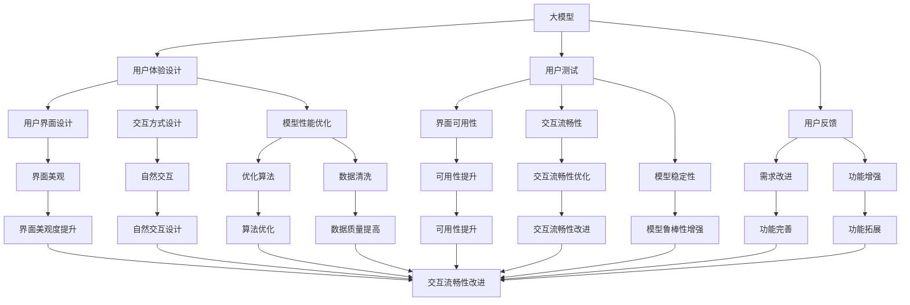
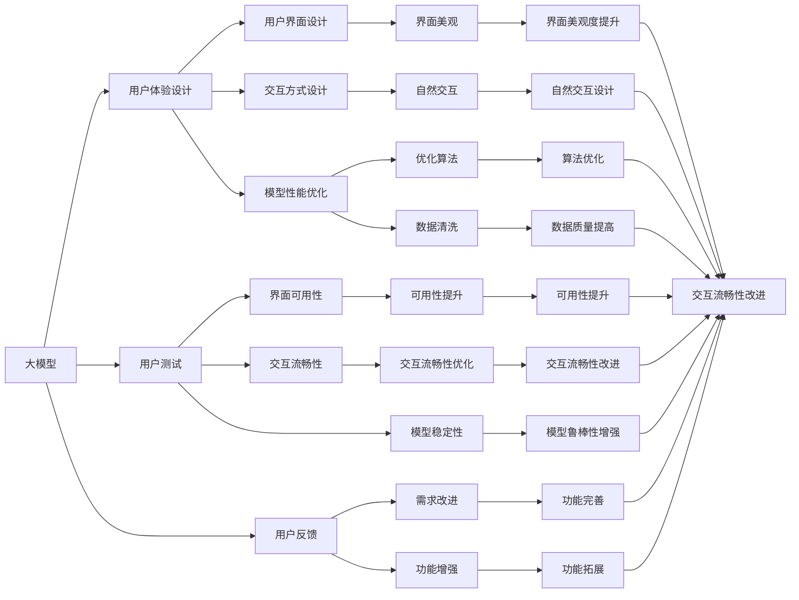
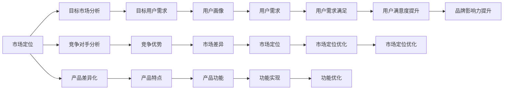
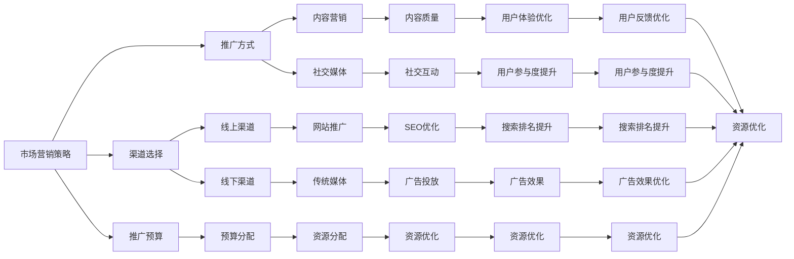

                 

# 大模型的用户体验与市场推广

> 关键词：大模型,用户体验,市场推广,用户体验设计,用户测试,用户反馈,市场定位,品牌建设,市场营销策略

## 1. 背景介绍

### 1.1 问题由来
随着人工智能技术的快速发展，大模型在各个领域的应用越来越广泛。从自然语言处理到计算机视觉，从语音识别到推荐系统，大模型在各个领域都展现出了强大的力量。然而，尽管大模型的技术表现令人瞩目，但在实际应用中，用户的体验往往不尽如人意。用户界面不够友好，交互方式不够自然，模型表现不稳定，这些都会影响用户的使用意愿和信任度。因此，提升大模型的用户体验，成为推动其市场推广的关键环节。

### 1.2 问题核心关键点
大模型的用户体验和市场推广涉及多个环节，包括用户界面设计、交互方式设计、模型性能优化、市场定位、品牌建设、市场营销策略等。这些环节相互影响，共同决定了用户的最终体验。如果各个环节都处理得当，可以大大提升大模型的市场接受度和用户满意度。

### 1.3 问题研究意义
研究大模型的用户体验与市场推广，对于拓展大模型的应用范围，提升用户满意度，加速人工智能技术的产业化进程，具有重要意义：

1. 降低应用开发成本。通过提升用户体验，使用户能够更加高效、愉悦地使用大模型，减少开发和维护成本。
2. 提升用户满意度。良好的用户体验能够使用户更加信任和依赖大模型，增强模型的粘性。
3. 加速开发进度。良好的用户体验能够帮助开发者快速捕捉用户需求，缩短产品迭代周期。
4. 带来技术创新。用户体验的改进往往需要引入新的技术和方法，这些技术创新反过来也会推动大模型的进一步发展。
5. 赋能产业升级。提升用户体验，可以帮助大模型更好地服务各行各业，为传统行业数字化转型升级提供新的技术路径。

## 2. 核心概念与联系

### 2.1 核心概念概述

为更好地理解大模型的用户体验与市场推广，本节将介绍几个密切相关的核心概念：

- 大模型（Large Model）：指在特定领域经过训练，具备处理复杂任务能力的神经网络模型。如BERT、GPT、ResNet等。

- 用户体验设计（User Experience Design, UX Design）：通过研究用户行为和需求，设计出既美观又实用的界面和交互方式，提升用户的使用满意度。

- 用户测试（User Testing）：通过观察用户在使用产品时的行为和反馈，评估产品的可用性和易用性，发现并改进不足之处。

- 用户反馈（User Feedback）：用户在实际使用产品过程中，对产品的评价和意见。通过收集用户反馈，可以改进产品，满足用户需求。

- 市场定位（Market Positioning）：通过分析目标市场和竞争对手，确定产品的市场定位和差异化策略，以吸引目标用户。

- 品牌建设（Brand Building）：通过品牌形象、市场活动等方式，提升产品在用户心中的认知度和美誉度，增强品牌影响力。

- 市场营销策略（Marketing Strategy）：通过多种渠道和手段，推广产品，提高产品的知名度和市场占有率。

这些核心概念之间的逻辑关系可以通过以下Mermaid流程图来展示：



这个流程图展示了大模型的用户体验与市场推广各个环节之间的关系：

1. 大模型通过用户体验设计、用户测试、用户反馈等环节不断优化，提升用户体验。
2. 用户界面设计和交互方式设计是用户体验设计的重要组成部分，影响用户的直观感受。
3. 模型性能优化是提升用户体验的重要手段，包括算法优化、数据清洗等技术手段。
4. 市场定位和品牌建设是提升大模型市场接受度的关键，有助于提升品牌影响力。
5. 市场营销策略是推广大模型的重要手段，包括多种渠道和手段，提升产品的知名度和市场占有率。

这些核心概念共同构成了大模型用户体验与市场推广的完整生态系统，使其能够在各个环节中发挥作用，提升用户的满意度，推动模型的市场推广。

### 2.2 概念间的关系

这些核心概念之间存在着紧密的联系，形成了大模型用户体验与市场推广的完整生态系统。下面我们通过几个Mermaid流程图来展示这些概念之间的关系。

#### 2.2.1 大模型的用户体验与市场推广



这个流程图展示了从用户体验设计到市场营销策略，大模型各个环节之间的关系。

#### 2.2.2 市场定位与品牌建设



这个流程图展示了市场定位与品牌建设的相互关系。

#### 2.2.3 市场营销策略与推广手段



这个流程图展示了市场营销策略与推广手段之间的关系。

### 2.3 核心概念的整体架构

最后，我们用一个综合的流程图来展示这些核心概念在大模型用户体验与市场推广过程中的整体架构：

```mermaid
graph TB
    A[大规模文本数据] --> B[预训练]
    B --> C[大模型]
    C --> D[用户体验设计]
    C --> E[用户测试]
    C --> F[用户反馈]
    D --> G[用户界面设计]
    D --> H[交互方式设计]
    D --> I[模型性能优化]
    E --> J[界面可用性]
    E --> K[交互流畅性]
    E --> L[模型稳定性]
    F --> M[需求改进]
    F --> N[功能增强]
    G --> O[界面美观]
    H --> P[自然交互]
    I --> Q[优化算法]
    I --> R[数据清洗]
    J --> S[可用性提升]
    K --> T[交互流畅性优化]
    L --> U[模型鲁棒性增强]
    M --> V[功能完善]
    N --> W[功能拓展]
    O --> X[界面美观度提升]
    P --> Y[自然交互设计]
    Q --> Z[算法优化]
    R --> $[数据质量提高]
    S --> &[可用性提升]
    T --> &[交互流畅性改进]
    U --> &[模型鲁棒性增强]
    V --> &[功能完善]
    W --> &[功能拓展]
    X --> &[界面美观度提升]
    Y --> &[自然交互设计]
    Z --> &[算法优化]
    $ --> &[数据质量提高]
    S --> &[可用性提升]
    T --> &[交互流畅性改进]
    U --> &[模型鲁棒性增强]
    V --> &[功能完善]
    W --> &[功能拓展]
    X --> &[界面美观度提升]
    Y --> &[自然交互设计]
    Z --> &[算法优化]
    $ --> &[数据质量提高]
    S --> &[可用性提升]
    T --> &[交互流畅性改进]
    U --> &[模型鲁棒性增强]
    V --> &[功能完善]
    W --> &[功能拓展]
    X --> &[界面美观度提升]
    Y --> &[自然交互设计]
    Z --> &[算法优化]
    $ --> &[数据质量提高]
    S --> &[可用性提升]
    T --> &[交互流畅性改进]
    U --> &[模型鲁棒性增强]
    V --> &[功能完善]
    W --> &[功能拓展]
    X --> &[界面美观度提升]
    Y --> &[自然交互设计]
    Z --> &[算法优化]
    $ --> &[数据质量提高]
    S --> &[可用性提升]
    T --> &[交互流畅性改进]
    U --> &[模型鲁棒性增强]
    V --> &[功能完善]
    W --> &[功能拓展]
    X --> &[界面美观度提升]
    Y --> &[自然交互设计]
    Z --> &[算法优化]
    $ --> &[数据质量提高]
    S --> &[可用性提升]
    T --> &[交互流畅性改进]
    U --> &[模型鲁棒性增强]
    V --> &[功能完善]
    W --> &[功能拓展]
    X --> &[界面美观度提升]
    Y --> &[自然交互设计]
    Z --> &[算法优化]
    $ --> &[数据质量提高]
    S --> &[可用性提升]
    T --> &[交互流畅性改进]
    U --> &[模型鲁棒性增强]
    V --> &[功能完善]
    W --> &[功能拓展]
    X --> &[界面美观度提升]
    Y --> &[自然交互设计]
    Z --> &[算法优化]
    $ --> &[数据质量提高]
    S --> &[可用性提升]
    T --> &[交互流畅性改进]
    U --> &[模型鲁棒性增强]
    V --> &[功能完善]
    W --> &[功能拓展]
    X --> &[界面美观度提升]
    Y --> &[自然交互设计]
    Z --> &[算法优化]
    $ --> &[数据质量提高]
    S --> &[可用性提升]
    T --> &[交互流畅性改进]
    U --> &[模型鲁棒性增强]
    V --> &[功能完善]
    W --> &[功能拓展]
    X --> &[界面美观度提升]
    Y --> &[自然交互设计]
    Z --> &[算法优化]
    $ --> &[数据质量提高]
    S --> &[可用性提升]
    T --> &[交互流畅性改进]
    U --> &[模型鲁棒性增强]
    V --> &[功能完善]
    W --> &[功能拓展]
    X --> &[界面美观度提升]
    Y --> &[自然交互设计]
    Z --> &[算法优化]
    $ --> &[数据质量提高]
    S --> &[可用性提升]
    T --> &[交互流畅性改进]
    U --> &[模型鲁棒性增强]
    V --> &[功能完善]
    W --> &[功能拓展]
    X --> &[界面美观度提升]
    Y --> &[自然交互设计]
    Z --> &[算法优化]
    $ --> &[数据质量提高]
    S --> &[可用性提升]
    T --> &[交互流畅性改进]
    U --> &[模型鲁棒性增强]
    V --> &[功能完善]
    W --> &[功能拓展]
    X --> &[界面美观度提升]
    Y --> &[自然交互设计]
    Z --> &[算法优化]
    $ --> &[数据质量提高]
    S --> &[可用性提升]
    T --> &[交互流畅性改进]
    U --> &[模型鲁棒性增强]
    V --> &[功能完善]
    W --> &[功能拓展]
    X --> &[界面美观度提升]
    Y --> &[自然交互设计]
    Z --> &[算法优化]
    $ --> &[数据质量提高]
    S --> &[可用性提升]
    T --> &[交互流畅性改进]
    U --> &[模型鲁棒性增强]
    V --> &[功能完善]
    W --> &[功能拓展]
    X --> &[界面美观度提升]
    Y --> &[自然交互设计]
    Z --> &[算法优化]
    $ --> &[数据质量提高]
    S --> &[可用性提升]
    T --> &[交互流畅性改进]
    U --> &[模型鲁棒性增强]
    V --> &[功能完善]
    W --> &[功能拓展]
    X --> &[界面美观度提升]
    Y --> &[自然交互设计]
    Z --> &[算法优化]
    $ --> &[数据质量提高]
    S --> &[可用性提升]
    T --> &[交互流畅性改进]
    U --> &[模型鲁棒性增强]
    V --> &[功能完善]
    W --> &[功能拓展]
    X --> &[界面美观度提升]
    Y --> &[自然交互设计]
    Z --> &[算法优化]
    $ --> &[数据质量提高]
    S --> &[可用性提升]
    T --> &[交互流畅性改进]
    U --> &[模型鲁棒性增强]
    V --> &[功能完善]
    W --> &[功能拓展]
    X --> &[界面美观度提升]
    Y --> &[自然交互设计]
    Z --> &[算法优化]
    $ --> &[数据质量提高]
    S --> &[可用性提升]
    T --> &[交互流畅性改进]
    U --> &[模型鲁棒性增强]
    V --> &[功能完善]
    W --> &[功能拓展]
    X --> &[界面美观度提升]
    Y --> &[自然交互设计]
    Z --> &[算法优化]
    $ --> &[数据质量提高]
    S --> &[可用性提升]
    T --> &[交互流畅性改进]
    U --> &[模型鲁棒性增强]
    V --> &[功能完善]
    W --> &[功能拓展]
    X --> &[界面美观度提升]
    Y --> &[自然交互设计]
    Z --> &[算法优化]
    $ --> &[数据质量提高]
    S --> &[可用性提升]
    T --> &[交互流畅性改进]
    U --> &[模型鲁棒性增强]
    V --> &[功能完善]
    W --> &[功能拓展]
    X --> &[界面美观度提升]
    Y --> &[自然交互设计]
    Z --> &[算法优化]
    $ --> &[数据质量提高]
    S --> &[可用性提升]
    T --> &[交互流畅性改进]
    U --> &[模型鲁棒性增强]
    V --> &[功能完善]
    W --> &[功能拓展]
    X --> &[界面美观度提升]
    Y --> &[自然交互设计]
    Z --> &[算法优化]
    $ --> &[数据质量提高]
    S --> &[可用性提升]
    T --> &[交互流畅性改进]
    U --> &[模型鲁棒性增强]
    V --> &[功能完善]
    W --> &[功能拓展]
    X --> &[界面美观度提升]
    Y --> &[自然交互设计]
    Z --> &[算法优化]
    $ --> &[数据质量提高]
    S --> &[可用性提升]
    T --> &[交互流畅性改进]
    U --> &[模型鲁棒性增强]
    V --> &[功能完善]
    W --> &[功能拓展]
    X --> &[界面美观度提升]
    Y --> &[自然交互设计]
    Z --> &[算法优化]
    $ --> &[数据质量提高]
    S --> &[可用性提升]
    T --> &[交互流畅性改进]
    U --> &[模型鲁棒性增强]
    V --> &[功能完善]
    W --> &[功能拓展]
    X --> &[界面美观度提升]
    Y --> &[自然交互设计]
    Z --> &[算法优化]
    $ --> &[数据质量提高]
    S --> &[可用性提升]
    T --> &[交互流畅性改进]
    U --> &[模型鲁棒性增强]
    V --> &[功能完善]
    W --> &[功能拓展]
    X --> &[界面美观度提升]
    Y --> &[自然交互设计]
    Z --> &[算法优化]
    $ --> &[数据质量提高]
    S --> &[可用性提升]
    T --> &[交互流畅性改进]
    U --> &[模型鲁棒性增强]
    V --> &[功能完善]
    W --> &[功能拓展]
    X --> &[界面美观度提升]
    Y --> &[自然交互设计]
    Z --> &[算法优化]
    $ --> &[数据质量提高]
    S --> &[可用性提升]
    T --> &[交互流畅性改进]
    U --> &[模型鲁棒性增强]
    V --> &[功能完善]
    W --> &[功能拓展]
    X --> &[界面美观度提升]
    Y --> &[自然交互设计]
    Z --> &[算法优化]
    $ --> &[数据质量提高]
    S --> &[可用性提升]
    T --> &[交互流畅性改进]
    U --> &[模型鲁棒性增强]
    V --> &[功能完善]
    W --> &[功能拓展]
    X --> &[界面美观度提升]
    Y --> &[自然交互设计]
    Z --> &[算法优化]
    $ --> &[数据质量提高]
    S --> &[可用性提升]
    T --> &[交互流畅性改进]
    U --> &[模型鲁棒性增强]
    V --> &[功能完善]
    W --> &[功能拓展]
    X --> &[界面美观度提升]
    Y --> &[自然交互设计]
    Z --> &[算法优化]
    $ --> &[数据质量提高]
    S --> &[可用性提升]
    T --> &[交互流畅性改进]
    U --> &[模型鲁棒性增强]
    V --> &[功能完善]
    W --> &[功能拓展]
    X --> &[界面美观度提升]
    Y --> &[自然交互设计]
    Z --> &[算法优化]
    $ --> &[数据质量提高]
    S --> &[可用性提升]
    T --> &[交互流畅性改进]
    U --> &[模型鲁棒性增强]
    V --> &[功能完善]
    W --> &[功能拓展]
    X --> &[界面美观度提升]
    Y --> &[自然交互设计]
    Z --> &[算法优化]
    $ --> &[数据质量提高]
    S --> &[可用性提升]
    T --> &[交互流畅性改进]
    U --> &[模型鲁棒性增强]
    V --> &[功能完善]
    W --> &[功能拓展]
    X --> &[界面美观度提升]
    Y --> &[自然交互设计]
    Z --> &[算法优化]
    $ --> &[数据质量提高]
    S --> &[可用性提升]
    T --> &[交互流畅性改进]
    U --> &[模型鲁棒性增强]
    V --> &[功能完善]
    W --> &[功能拓展]
    X --> &[界面美观度提升]
    Y --> &[自然交互设计]
    Z --> &[算法优化]
    $ --> &[数据质量提高]
    S --> &[可用性提升]
    T --> &[交互流畅性改进]
    U --> &[模型鲁棒性增强]
    V --> &[功能完善]
    W --> &[功能拓展]
    X --> &[界面美观度提升]
    Y --> &[自然交互设计]
    Z --> &[算法优化]
    $ --> &[数据质量提高]
    S --> &[可用性提升]
    T --> &[交互流畅性改进]
    U --> &[模型鲁棒性增强]
    V --> &[功能完善]
    W --> &[功能拓展]
    X --> &[界面美观度提升]
    Y --> &[自然交互设计]
    Z --> &[算法优化]
    $ --> &[数据质量提高]
    S --> &[可用性提升]
    T --> &[交互流畅性改进]
    U --> &[模型鲁棒性增强]
    V --> &[功能完善]
    W --> &[功能拓展]
    X --> &[界面美观度提升]
    Y --> &[自然交互设计]
    Z --> &[算法优化]
    $ --> &[数据质量提高]
    S --> &[可用性提升]
    T --> &[交互流畅性改进]
    U --> &[模型鲁棒性增强]
    V --> &[功能完善]
    W --> &[功能拓展]
    X --> &[界面美观度提升]
    Y --> &[自然交互设计]
    Z --> &[算法优化]
    $ --> &[数据质量提高]
    S --> &[可用性提升]
    T --> &[交互流畅性改进]
    U --> &[模型鲁棒性增强]
    V --> &[功能完善]
    W --> &[功能拓展]
    X --> &[界面美观度提升]
    Y --> &[自然交互设计]
    Z --> &[算法优化]
    $ --> &[数据质量提高]
    S --> &[可用性提升]
    T --> &[交互流畅性改进]
    U --> &[模型鲁棒性增强]
    V --> &[功能完善]
    W --> &[功能拓展]
    X --> &[界面美观度提升]
    Y --> &[自然交互设计]
    Z --> &[算法优化]
    $ --> &[数据质量提高]
    S --> &[可用性提升]
    T --> &[交互流畅性改进]
    U --> &[模型鲁棒性增强]
    V --> &[功能完善]
    W --> &[功能拓展]
    X --> &[界面美观度提升]
    Y --> &[自然交互设计]
    Z --> &[算法优化]
    $ --> &[数据质量提高]
    S --> &[可用性提升]
    T --> &[交互流畅性改进]
    U --> &[模型鲁棒性增强]
    V --> &[功能完善]
    W --> &[功能拓展]
    X --> &[界面美观度提升]
    Y --> &[自然交互设计]
    Z --> &[算法优化]
    $ --> &[数据质量提高]
    S --> &[可用性提升]
    T --> &[交互流畅性改进]
    U --> &[模型鲁棒性增强]
    V --> &[功能完善]
    W --> &[功能拓展]
    X --> &[界面美观度提升]
    Y --> &[自然交互设计]
    Z --> &[算法优化]
    $ --> &[数据质量提高]
    S --> &[可用性提升]
    T --> &[交互流畅性改进]
    U --> &[模型鲁棒性增强]
    V --> &[功能完善]
    W --> &[功能拓展]
    X --> &[界面美观度提升]
    Y --> &[自然交互设计]
    Z --> &[算法优化]
    $ --> &[数据质量提高]
    S --> &[可用性提升]
    T --> &[交互流畅性改进]
    U --> &[模型鲁棒性增强]
    V --> &[功能完善]
    W --> &[功能拓展]
    X --> &[界面美观度提升]
    Y --> &[自然交互设计]
    Z --> &[算法优化]
    $ --> &[数据质量提高]
    S --> &[可用性提升]
    T --> &[交互流畅性改进]
    U --> &[模型鲁棒性增强]
    V --> &[功能完善]
    W --> &[功能拓展]
    X --> &[界面美观度提升]
    Y --> &[自然交互设计]
    Z --> &[算法优化]
    $ --> &[数据质量提高]
    S --> &[可用性提升]
    T --> &[交互流畅性改进]
    U --> &[模型鲁棒性增强]
    V --> &[功能完善]
    W --> &[功能拓展]
    X --> &[界面美观度提升]
    Y --> &[自然交互设计]
    Z --> &[算法优化]
    $ --> &[数据质量提高]
    S --> &[可用性提升]
    T --> &[交互流畅性改进]
    U --> &[模型鲁棒性增强]
    V --> &[功能完善]
    W --> &[功能拓展]
    X --> &[界面美观度提升]
    Y --> &[自然交互设计]
    Z --> &[算法优化]
    $ --> &[数据质量提高]
    S --> &[可用性提升]
    T --> &[交互流畅性改进]
    U --> &[模型鲁棒性增强]
    V --> &[功能完善]
    W --> &[功能拓展]
    X --> &[界面美观度提升]
    Y --> &[自然交互设计]
    Z --> &[算法优化]
    $ --> &[数据质量提高]
    S --> &[可用性提升]
    T --> &[交互流畅性改进]
    U --> &[模型鲁棒性增强]
    V --> &[功能完善]
    W -->

