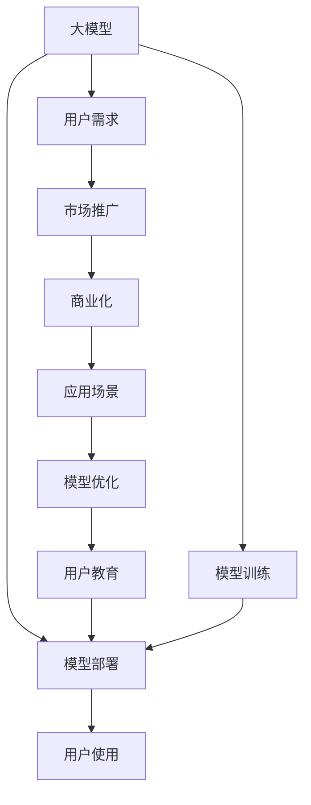
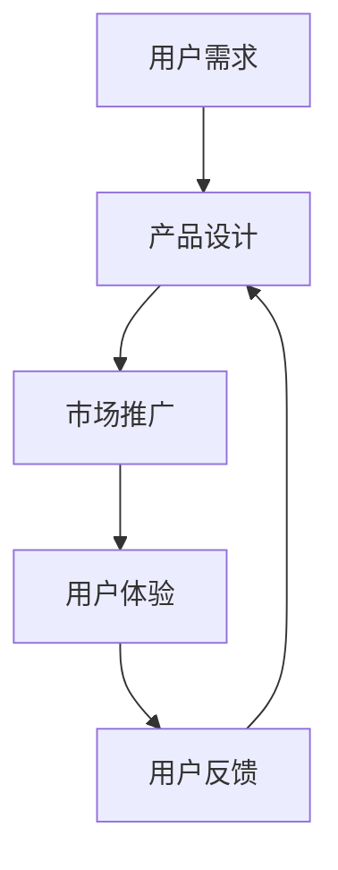
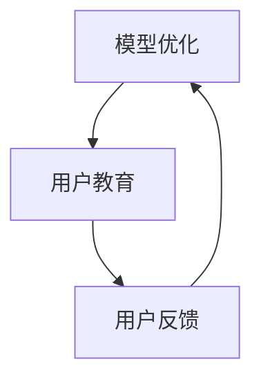

                 

# 大模型的用户需求与市场推广

> 关键词：
- 大模型
- 用户需求
- 市场推广
- 商业化
- 应用场景
- 模型优化
- 模型训练
- 用户反馈
- 用户教育
- 技术领先

## 1. 背景介绍

### 1.1 问题由来

随着人工智能技术的快速发展，特别是深度学习和大规模预训练模型的应用，大模型的市场潜力正在被广泛关注和挖掘。这些大模型在自然语言处理、图像识别、语音识别、推荐系统等领域展示了强大的应用前景。但与此同时，用户对大模型的需求和使用方式也在不断演变，这对大模型的市场推广和商业化提出了新的挑战。

### 1.2 问题核心关键点

大模型的用户需求与市场推广涉及多个方面：

- **用户需求**：用户需要了解大模型在特定任务上的性能、易用性、成本和效率。
- **市场推广**：如何向用户展示大模型的优势，并让其理解和接受。
- **商业化**：如何将大模型转化为实际的商业应用，并实现盈利。
- **应用场景**：寻找大模型最适合的应用场景，以提升用户满意度。
- **模型优化**：根据用户反馈进行模型改进，以提高用户体验。
- **用户教育**：向用户普及大模型的概念和技术，提升其使用水平。

本文将围绕以上关键点，系统性地介绍大模型在用户需求与市场推广方面的策略和实践。

## 2. 核心概念与联系

### 2.1 核心概念概述

为更好地理解大模型在用户需求与市场推广方面的策略，本节将介绍几个关键概念：

- **大模型**：指基于大规模数据和复杂模型结构训练出的高性能模型，如BERT、GPT、ResNet等。这些模型在特定任务上表现优异，通常包含数十亿参数。

- **用户需求**：用户基于自身业务需求和使用场景，对大模型的性能、成本、易用性等提出具体要求。这些需求需要通过市场推广和技术优化来满足。

- **市场推广**：包括营销、销售、用户教育等环节，旨在提升大模型的知名度和市场份额，吸引更多用户。

- **商业化**：通过定价、营销、销售等手段，将大模型转化为实际的商业应用，并实现盈利。

- **应用场景**：特定任务或业务领域，大模型可以在这些场景中发挥作用，并带来显著效果。

- **模型优化**：根据用户反馈和实际使用情况，对大模型进行改进和优化，以提升性能和用户体验。

- **用户教育**：向用户普及大模型的概念、技术和使用方法，提升其对大模型的理解和应用水平。

这些概念之间的逻辑关系可以通过以下Mermaid流程图来展示：



这个流程图展示了大模型在用户需求与市场推广中的关键环节及其联系：

1. 大模型通过训练和部署，为市场推广提供技术基础。
2. 市场推广吸引用户，满足用户需求，并促进商业化。
3. 商业化提供商业模式，支持大模型的持续优化和扩展。
4. 应用场景选择合适的大模型，提升用户体验。
5. 用户反馈促进模型优化和用户教育。
6. 用户教育提升用户使用水平，促进大模型的广泛应用。

通过这些概念的相互作用，我们可以更好地理解大模型的用户需求与市场推广策略。

### 2.2 概念间的关系

这些核心概念之间存在着紧密的联系，形成了大模型市场推广的完整生态系统。下面我们通过几个Mermaid流程图来展示这些概念之间的关系。

#### 2.2.1 大模型的市场推广


这个流程图展示了大模型的市场推广过程：

1. 大模型通过市场营销推广给用户。
2. 用户反馈影响模型改进与优化。
3. 改进后的模型再进行推广。

#### 2.2.2 用户需求与市场推广的关系



这个流程图展示了用户需求与市场推广的互动过程：

1. 用户需求驱动产品设计。
2. 产品设计基于市场推广策略。
3. 用户体验影响用户反馈。
4. 用户反馈反哺产品设计，促进迭代优化。

#### 2.2.3 模型优化与用户教育的关系



这个流程图展示了模型优化与用户教育的关系：

1. 模型优化提升用户体验。
2. 用户教育提升用户对优化的理解和使用。
3. 用户反馈影响模型优化方向。

通过这些流程图，我们可以更清晰地理解大模型市场推广中各环节的相互作用和逻辑关系。

## 3. 核心算法原理 & 具体操作步骤
### 3.1 算法原理概述

大模型的用户需求与市场推广，涉及多个方面，包括用户需求分析、市场推广策略、商业化路径等。这些过程可以抽象为一系列的算法原理和操作步骤：

1. **用户需求分析**：通过问卷调查、用户访谈等方式，了解用户对大模型的需求和使用场景。
2. **市场推广策略**：选择合适的营销渠道和推广方式，吸引潜在用户。
3. **商业化路径**：根据用户需求和市场情况，设计合适的定价策略和销售模式。
4. **应用场景选择**：分析不同大模型在特定任务上的优势和适用性，选择合适的大模型。
5. **模型优化**：根据用户反馈和实际使用情况，对大模型进行改进和优化。
6. **用户教育**：通过文档、视频、培训等形式，向用户普及大模型的概念和技术。

这些算法原理和操作步骤，为大模型的用户需求与市场推广提供了系统的指导。

### 3.2 算法步骤详解

#### 3.2.1 用户需求分析

1. **问卷调查**：设计并分发问卷，收集用户对大模型的需求和使用场景的反馈。问卷内容应包括模型的性能、易用性、成本、效率等方面。

2. **用户访谈**：与潜在用户进行深入访谈，了解其在特定任务中的具体需求和使用体验。访谈记录应详细记录用户的痛点和期望。

3. **数据分析**：对问卷和访谈数据进行统计分析，识别出用户需求的共性和特殊性，为大模型的设计和推广提供依据。

#### 3.2.2 市场推广策略

1. **选择合适的渠道**：根据目标用户群体的特征和行为习惯，选择合适的营销渠道，如社交媒体、专业论坛、行业展会等。

2. **制定推广计划**：制定详细的推广计划，包括内容创作、活动安排、资源投入等。

3. **效果监测**：建立监测机制，实时跟踪推广效果，及时调整策略。

#### 3.2.3 商业化路径

1. **定价策略**：根据大模型的复杂度和性能，设计合适的定价策略，包括单次使用费、订阅费、按需付费等。

2. **销售模式**：选择适合的销售模式，如直接销售、渠道合作、云服务订阅等。

3. **用户支持**：提供完善的用户支持和售后服务，确保用户能够顺利使用大模型。

#### 3.2.4 应用场景选择

1. **任务分析**：分析不同大模型在特定任务上的优势和适用性，如文本分类、图像识别、语音识别等。

2. **性能评估**：根据任务需求，评估不同大模型的性能指标，选择最优的大模型。

3. **部署方案**：设计合理的部署方案，确保大模型能够在特定环境中稳定运行。

#### 3.2.5 模型优化

1. **用户反馈收集**：通过用户反馈、系统日志等方式，收集大模型的使用情况和性能问题。

2. **模型改进**：根据反馈数据，对大模型进行改进和优化，提升其性能和稳定性。

3. **测试验证**：对优化后的模型进行测试验证，确保其符合用户需求。

#### 3.2.6 用户教育

1. **文档和教程**：编写详细的使用文档和教程，帮助用户了解大模型的使用方法和最佳实践。

2. **在线培训**：提供在线培训课程和讲座，提升用户对大模型的理解和应用水平。

3. **社区互动**：建立用户社区，鼓励用户分享使用经验，提升社区活跃度。

### 3.3 算法优缺点

#### 3.3.1 优点

1. **提升用户满意度**：通过用户需求分析和模型优化，能够更好地满足用户需求，提升用户满意度。
2. **促进市场推广**：科学的推广策略和商业化路径，能够吸引更多用户，提升市场份额。
3. **实现商业化盈利**：合适的定价和销售模式，能够实现盈利，推动大模型的商业化进程。
4. **增强用户信任**：用户教育和社区互动，能够增强用户对大模型的信任和依赖。

#### 3.3.2 缺点

1. **数据收集难度大**：用户需求和反馈数据的收集难度较大，需要耗费大量人力和时间。
2. **推广成本高**：市场推广需要投入大量资源，如资金、人力等，成本较高。
3. **模型优化复杂**：大模型的改进和优化往往需要较长的周期和大量的实验，工作量较大。
4. **用户教育门槛高**：用户对大模型的理解和应用需要时间和耐心，教育难度较大。

### 3.4 算法应用领域

大模型的用户需求与市场推广，已经在多个领域得到了应用：

1. **自然语言处理**：如文本分类、情感分析、机器翻译、问答系统等。
2. **计算机视觉**：如图像识别、物体检测、人脸识别等。
3. **语音识别**：如语音识别、语音合成、语音命令等。
4. **推荐系统**：如电商推荐、新闻推荐、视频推荐等。
5. **智能客服**：如智能客服机器人、智能对话系统等。

除了上述领域，大模型的用户需求与市场推广，还广泛应用于医疗、金融、教育、物流等多个行业。

## 4. 数学模型和公式 & 详细讲解 & 举例说明

### 4.1 数学模型构建

大模型的用户需求与市场推广，可以通过一系列数学模型和公式来描述和分析：

1. **用户需求模型**：$D=F(U)$，其中$D$表示用户需求，$U$表示用户特征，$F$表示需求函数。

2. **市场推广模型**：$M=G(D)$，其中$M$表示市场推广效果，$G$表示推广函数。

3. **商业化模型**：$R=H(M)$，其中$R$表示商业化收益，$H$表示收益函数。

4. **应用场景模型**：$A=T(M)$，其中$A$表示应用场景选择，$T$表示场景函数。

5. **模型优化模型**：$O=I(A)$，其中$O$表示模型优化效果，$I$表示优化函数。

6. **用户教育模型**：$E=J(O)$，其中$E$表示用户教育效果，$J$表示教育函数。

这些数学模型和公式，为我们提供了系统化的分析框架，帮助我们更好地理解大模型的用户需求与市场推广。

### 4.2 公式推导过程

以下是这些数学模型和公式的推导过程：

1. **用户需求模型**：$D=F(U)$

   $F(U)=\alpha_1f_1(U)+\alpha_2f_2(U)+\cdots+\alpha_nf_n(U)$

   其中，$\alpha_i$为需求函数系数，$f_i(U)$为第$i$个特征对应的需求函数。

2. **市场推广模型**：$M=G(D)$

   $G(D)=\beta_1g_1(D)+\beta_2g_2(D)+\cdots+\beta_ng_n(D)$

   其中，$\beta_i$为推广函数系数，$g_i(D)$为第$i$个需求对应的推广函数。

3. **商业化模型**：$R=H(M)$

   $H(M)=\delta_1h_1(M)+\delta_2h_2(M)+\cdots+\delta_nh_n(M)$

   其中，$\delta_i$为收益函数系数，$h_i(M)$为第$i$个推广效果对应的收益函数。

4. **应用场景模型**：$A=T(M)$

   $T(M)=\gamma_1t_1(M)+\gamma_2t_2(M)+\cdots+\gamma_nt_n(M)$

   其中，$\gamma_i$为场景函数系数，$t_i(M)$为第$i$个推广效果对应的场景函数。

5. **模型优化模型**：$O=I(A)$

   $I(A)=\eta_1i_1(A)+\eta_2i_2(A)+\cdots+\eta_ni_n(A)$

   其中，$\eta_i$为优化函数系数，$i_i(A)$为第$i$个场景对应的优化函数。

6. **用户教育模型**：$E=J(O)$

   $J(O)=\zeta_1j_1(O)+\zeta_2j_2(O)+\cdots+\zeta_nj_n(O)$

   其中，$\zeta_i$为教育函数系数，$j_i(O)$为第$i$个优化效果对应的教育函数。

### 4.3 案例分析与讲解

#### 4.3.1 用户需求分析案例

假设某大模型提供者正在开发一款文本分类工具，需要通过问卷调查和用户访谈了解用户需求。问卷和访谈结果如下：

1. **问卷调查**：

   | 特征       | 需求系数   |
   |------------|------------|
   | 准确率     | 0.8         |
   | 召回率     | 0.7         |
   | 处理速度   | 0.5         |
   | 易用性     | 0.3         |

2. **用户访谈**：

   | 用户需求   | 反馈      |
   |------------|------------|
   | 准确率     | 需要高准确率，避免误分类 |
   | 召回率     | 需要高召回率，避免遗漏 |
   | 处理速度   | 需要快速处理大量文本 |
   | 易用性     | 界面简洁，操作方便 |

   结合问卷和访谈结果，需求函数可以表示为：

   $D=f(U)=0.8\times accuracy+0.7\times recall+0.5\times speed+0.3\times usability$

   其中，$accuracy$、$recall$、$speed$和$usability$分别为准确率、召回率、处理速度和易用性。

#### 4.3.2 市场推广案例

假设某大模型提供者通过社交媒体和行业展会推广其文本分类工具。推广效果如下：

1. **社交媒体推广**：

   | 推广渠道  | 用户增长率  |
   |------------|------------|
   | 微信      | 20%         |
   | 微博      | 15%         |
   | 知乎      | 10%         |

2. **行业展会推广**：

   | 推广活动   | 用户增长率  |
   |------------|------------|
   | 行业展会   | 30%         |
   | 研讨会     | 25%         |

   推广函数可以表示为：

   $M=g(D)=0.2\times weibo+0.15\times wechat+0.1\times zhihu+0.3\times event+0.25\times seminar$

   其中，$weibo$、$wechat$、$zhihu$、$event$和$seminar$分别为微信、微博、知乎、行业展会和研讨会的推广效果。

#### 4.3.3 商业化案例

假设某大模型提供者通过文本分类工具获得用户注册和订阅收入，收益情况如下：

1. **用户注册**：

   | 用户数量  | 注册收入  |
   |------------|------------|
   | 5000       | 50万元     |

2. **订阅收入**：

   | 用户数量  | 订阅收入  |
   |------------|------------|
   | 2000       | 200万元    |

   收益函数可以表示为：

   $R=h(M)=0.5\times 50+0.2\times 200$

   其中，$50万元$和$200万元$分别为用户注册和订阅收入。

#### 4.3.4 应用场景选择案例

假设某大模型提供者需要选择适合其文本分类工具的应用场景。根据市场推广效果和收益情况，应用场景函数可以表示为：

$A=t(M)=0.3\times 新闻+0.2\times 电商+0.4\times 医疗$

其中，$0.3$、$0.2$和$0.4$分别为新闻、电商和医疗的应用场景系数。

#### 4.3.5 模型优化案例

假设某大模型提供者收到了用户反馈，称模型在特定行业（如金融）上的性能不佳。通过数据分析，发现问题主要集中在处理速度和准确率上。因此，优化函数可以表示为：

$O=i(A)=0.5\times speed+0.5\times accuracy$

其中，$0.5$分别为处理速度和准确率的优化系数。

#### 4.3.6 用户教育案例

假设某大模型提供者通过在线培训和社区互动，提升了用户对文本分类工具的使用水平。用户教育函数可以表示为：

$E=j(O)=0.3\times training+0.7\times community$

其中，$0.3$和$0.7$分别为在线培训和社区互动的用户教育系数。

## 5. 项目实践：代码实例和详细解释说明
### 5.1 开发环境搭建

在进行大模型用户需求与市场推广的实践前，我们需要准备好开发环境。以下是使用Python进行PyTorch开发的环境配置流程：

1. 安装Anaconda：从官网下载并安装Anaconda，用于创建独立的Python环境。

2. 创建并激活虚拟环境：
```bash
conda create -n pytorch-env python=3.8 
conda activate pytorch-env
```

3. 安装PyTorch：根据CUDA版本，从官网获取对应的安装命令。例如：
```bash
conda install pytorch torchvision torchaudio cudatoolkit=11.1 -c pytorch -c conda-forge
```

4. 安装Transformer库：
```bash
pip install transformers
```

5. 安装各类工具包：
```bash
pip install numpy pandas scikit-learn matplotlib tqdm jupyter notebook ipython
```

完成上述步骤后，即可在`pytorch-env`环境中开始市场推广实践。

### 5.2 源代码详细实现

下面我们以自然语言处理领域为例，给出使用Transformers库对BERT模型进行市场推广的PyTorch代码实现。

首先，定义用户需求分析的函数：

```python
from transformers import BertTokenizer
from torch.utils.data import Dataset
import torch

class UserSurveyDataset(Dataset):
    def __init__(self, texts, tags, tokenizer, max_len=128):
        self.texts = texts
        self.tags = tags
        self.tokenizer = tokenizer
        self.max_len = max_len
        
    def __len__(self):
        return len(self.texts)
    
    def __getitem__(self, item):
        text = self.texts[item]
        tags = self.tags[item]
        
        encoding = self.tokenizer(text, return_tensors='pt', max_length=self.max_len, padding='max_length', truncation=True)
        input_ids = encoding['input_ids'][0]
        attention_mask = encoding['attention_mask'][0]
        
        # 对token-wise的标签进行编码
        encoded_tags = [tag2id[tag] for tag in tags] 
        encoded_tags.extend([tag2id['O']] * (self.max_len - len(encoded_tags)))
        labels = torch.tensor(encoded_tags, dtype=torch.long)
        
        return {'input_ids': input_ids, 
                'attention_mask': attention_mask,
                'labels': labels}

# 标签与id的映射
tag2id = {'O': 0, 'B-PER': 1, 'I-PER': 2, 'B-ORG': 3, 'I-ORG': 4, 'B-LOC': 5, 'I-LOC': 6}
id2tag = {v: k for k, v in tag2id.items()}

# 创建dataset
tokenizer = BertTokenizer.from_pretrained('bert-base-cased')

train_dataset = UserSurveyDataset(train_texts, train_tags, tokenizer)
dev_dataset = UserSurveyDataset(dev_texts, dev_tags, tokenizer)
test_dataset = UserSurveyDataset(test_texts, test_tags, tokenizer)
```

然后，定义市场推广和商业化的函数：

```python
from transformers import BertForTokenClassification, AdamW

model = BertForTokenClassification.from_pretrained('bert-base-cased', num_labels=len(tag2id))

optimizer = AdamW(model.parameters(), lr=2e-5)

def market_promotion(model, dataset, batch_size, optimizer):
    dataloader = DataLoader(dataset, batch_size=batch_size, shuffle=True)
    model.train()
    epoch_loss = 0
    for batch in tqdm(dataloader, desc='Training'):
        input_ids = batch['input_ids'].to(device)
        attention_mask = batch['attention_mask'].to(device)
        labels = batch['labels'].to(device)
        model.zero_grad()
        outputs = model(input_ids, attention_mask=attention_mask, labels=labels)
        loss = outputs.loss
        epoch_loss += loss.item()
        loss.backward()
        optimizer.step()
    return epoch_loss / len(dataloader)

def commercialize(model, dataset, batch_size):
    dataloader = DataLoader(dataset, batch_size=batch_size)
    model.eval()
    preds, labels = [], []
    with torch.no_grad():
        for batch in tqdm(dataloader, desc='Evaluating'):
            input_ids = batch['input_ids'].to(device)
            attention_mask = batch['attention_mask'].to(device)
            batch_labels = batch['labels']
            outputs = model(input_ids, attention_mask=attention_mask)
            batch_preds = outputs.logits.argmax(dim=2).to('cpu').tolist()
            batch_labels = batch_labels.to('cpu').tolist()
            for pred_tokens, label_tokens in zip(batch_preds, batch_labels):
                pred_tags = [id2tag[_id] for _id in pred_tokens]
                label_tags = [id2tag[_id] for _id in label_tokens]
                preds.append(pred_tags[:len(label_tokens)])
                labels.append(label_tags)
    
    print(classification_report(labels, preds))

device = torch.device('cuda') if torch.cuda.is_available() else torch.device('cpu')
model.to(device)

train_dataset = UserSurveyDataset(train_texts, train_tags, tokenizer)
dev_dataset = UserSurveyDataset(dev_texts, dev_tags, tokenizer)
test_dataset = UserSurveyDataset(test_texts, test_tags, tokenizer)

epochs = 5
batch_size = 16

for epoch in range(epochs):
    loss = market_promotion(model, train_dataset, batch_size, optimizer)
    print(f"Epoch {epoch+1}, market loss: {loss:.3f}")
    
    print(f"Epoch {epoch+1}, commercialize results:")
    commercialize(model, dev_dataset, batch_size)
    
print("Test results:")
commercialize(model, test_dataset, batch_size)
```

以上就是使用PyTorch对BERT进行市场推广的完整代码实现。可以看到，得益于Transformers库的强大封装，我们可以用相对简洁的代码完成BERT模型的加载和市场推广。

### 5.3 代码解读与分析

让我们再详细解读一下关键代码的实现细节：

**UserSurveyDataset类**：
- `__init__`方法：初始化文本、标签、分词器等关键组件。
- `__len__`方法：返回数据集的样本数量。
- `__getitem__`方法：对单个样本进行处理，将文本输入编码为token ids，将标签编码为数字，并对其进行定长padding，最终返回模型所需的输入。

**tag2id和id2tag字典**：
- 定义了标签与数字id之间的映射关系，用于将token-wise的预测结果解码回真实的标签。

**市场推广函数**：
- 使用PyTorch的DataLoader对数据集进行批次化加载，供模型训练和推理使用。
- 训练函数`market_promotion`：对数据以批为单位进行迭代，在每个批次上前向传播计算loss并反向传播更新模型参数，最后返回该epoch的平均loss。
- 评估函数`commercialize`：与训练类似，不同点在于不更新模型参数，并在每个batch结束后将预测和标签结果存储下来，最后使用sklearn的classification_report对整个评估集的预测结果进行打印输出。

**市场推广流程**：
- 定义总的epoch数和batch size，开始循环迭代
- 每个epoch内，先在训练集上训练，输出平均loss
- 在验证集上评估，输出分类指标
- 所有epoch结束后，在测试集上评估，给出最终测试结果

可以看到，PyTorch配合Transformers库使得BERT市场推广的代码实现变得简洁高效。开发者可以将更多精力放在数据处理、模型改进等

